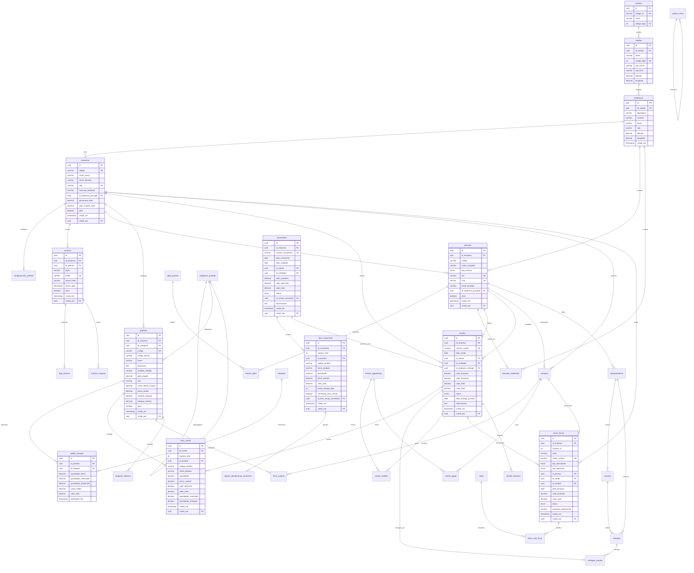
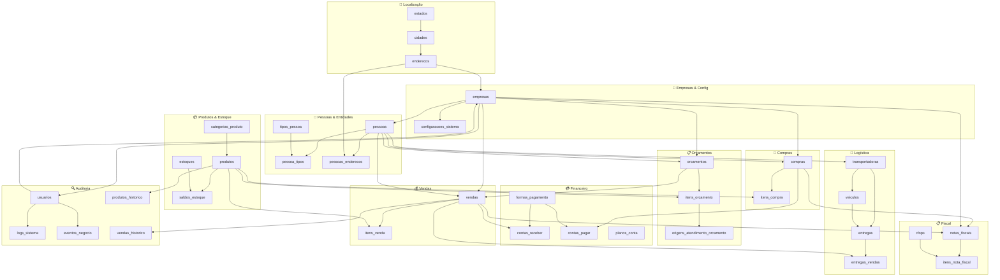

# ERP Staccato - Redesenho Completo do Schema de Banco de Dados 2025

## 📋 Document Index

### **1. [Resumo Executivo](#resumo-executivo)** (Line 234)

#### **1.1 Objetivos do Redesenho** (Lines 7-15)
- Eliminação de débito técnico
- Padronização de nomenclatura em português brasileiro
- Normalização adequada e modelagem de domínio
- Performance e manutenibilidade

#### **1.2 Problemas Identificados no Schema Atual** (Lines 16-73)
- **🚨 Anti-Padrões Críticos Identificados** (Lines 18-33)
  - Duplicação de tabelas: `venda_has_produto` → `venda_has_produto2`
  - Same pattern in orçamentos and pedidos fornecedor
  - Nomenclatura inconsistente, redundância de dados

- **📊 Análise do Impacto dos Anti-Padrões** (Lines 34-54)
  - Examples across all 3 domains: sales, quotes, purchases
  - Massive data duplication in multiple business areas

- **🎯 Raiz do Problema: Tree Table UI** (Lines 55-73)
  - Root cause: Qt Tree Table widget requirements
  - Data duplication forced by UI constraints

#### **1.3 🛠️ Solução: Tree UI com Dados Normalizados** (Lines 74-301)
- **Abordagem 1: Views Especializadas para Tree UI** (Lines 76-137)
  - SQL views to create tree structure from normalized data
- **Abordagem 2: JSON Tree Structure (Moderna)** (Lines 138-184)
  - Modern JSON-based approach for tree structures
- **Abordagem 3: Recursive CTE (Para UIs Complexas)** (Lines 185-235)
  - Complex tree hierarchies using Common Table Expressions
- **Abordagem 4: Interface Moderna com Componentes Tree** (Lines 236-301)
  - Modern UI components with proper data separation

#### **1.4 🎯 Vantagens da Solução Correta** (Lines 302-321)
- Dados normalizados + UI flexível
- Manutenção simplificada
- Flexibilidade de interface

### **2. [Arquitetura do Novo Schema](#arquitetura-do-novo-schema)** (Line 553)

#### **2.1 Princípios de Design** (Lines 324-331)
- Domain-Driven Design (DDD)
- Nomenclatura brasileira
- Normalização rigorosa, auditoria completa, performance first

#### **2.2 Diagrama de Relacionamento de Entidades (ERD)** (Lines 332-603)
- Comprehensive Mermaid ERD diagram
- All business domains and their relationships

#### **2.3 Diagrama de Domínios e Relacionamentos** (Lines 604-726)
- Domain-specific relationship mapping

#### **2.4 Características do Novo Schema** (Lines 735-765)
- Benefits and integration points
- Identified business domains

### **3. [Schema Detalhado por Domínio](#schema-detalhado-por-domínio)** (Line 997)

#### **3.1 Domínio: Empresas e Configuração** (Lines 768-842)
- **Tabela: `empresas`** (Lines 770-820): Main company entity
- **Tabela: `configuracoes_sistema`** (Lines 821-842): System configurations

#### **3.2 Domínio: Localização** (Lines 843-905)
- **Tabela: `estados`** (Lines 845-857): Brazilian states
- **Tabela: `cidades`** (Lines 858-879): Cities
- **Tabela: `enderecos`** (Lines 880-905): Addresses

#### **3.3 Domínio: Pessoas e Entidades** (Lines 906-1037)
- **Tabela: `tipos_pessoa`** (Lines 908-932): Person types (customer, supplier, etc.)
- **Tabela: `pessoas`** (Lines 933-991): Main people entity
- **Tabela: `pessoa_tipos`** (Lines 992-1013): Person type relationships
- **Tabela: `pessoas_enderecos`** (Lines 1014-1037): Person-address relationships

#### **3.4 Domínio: Produtos e Estoque** (Lines 1038-1200)
- **Tabela: `categorias_produto`** (Lines 1040-1075): Product categories
- **Tabela: `produtos`** (Lines 1076-1137): Main products entity
- **Tabela: `estoques`** (Lines 1138-1170): Warehouses/storage locations
- **Tabela: `saldos_estoque`** (Lines 1171-1200): Inventory balances

#### **3.5 Domínio: Vendas** (Lines 1201-1292)
- **Tabela: `vendas`** (Lines 1203-1249): Main sales entity
- **Tabela: `itens_venda`** (Lines 1250-1292): Sales line items

#### **3.6 Domínio: Orçamentos** (Lines 1293-1432)
- **Tabela: `orcamentos`** (Lines 1295-1346): Quotations
- **Tabela: `itens_orcamento`** (Lines 1347-1392): Quote line items
- **Tabela: `origens_atendimento_orcamento`** (Lines 1393-1432): Quote fulfillment sources

#### **3.7 Domínio: Sistema de Usuários** (Lines 1433-1473)
- **Tabela: `usuarios`** (Lines 1435-1473): User management

#### **3.8 Domínio: Financeiro** (Lines 1820-1977)
- **Tabela: `planos_conta`** (Lines 1822-1855): Chart of accounts
- **Tabela: `contas_receber`** (Lines 1856-1901): Accounts receivable
- **Tabela: `contas_pagar`** (Lines 1902-1947): Accounts payable
- **Tabela: `formas_pagamento`** (Lines 1948-1977): Payment methods

#### **3.9 Domínio: Compras** (Lines 1978-2065)
- **Tabela: `compras`** (Lines 1980-2025): Purchase orders
- **Tabela: `itens_compra`** (Lines 2026-2065): Purchase line items

#### **3.10 Domínio: Fiscal e Compliance** (Lines 2066-2210)
- **Tabela: `cfops`** (Lines 2068-2090): Brazilian fiscal operation codes
- **Tabela: `notas_fiscais`** (Lines 2091-2155): Electronic invoices
- **Tabela: `itens_nota_fiscal`** (Lines 2156-2210): Invoice line items

#### **3.11 Domínio: Logística e Transporte** (Lines 2211-2339)
- **Tabela: `transportadoras`** (Lines 2213-2243): Shipping companies
- **Tabela: `veiculos`** (Lines 2244-2276): Vehicles
- **Tabela: `entregas`** (Lines 2277-2315): Deliveries
- **Tabela: `entregas_vendas`** (Lines 2316-2339): Sale-delivery relationships

#### **3.12 Domínio: Auditoria e Rastreamento Temporal** (Lines 2340-2824)
- **Abordagem Híbrida: Temporal + Event Sourcing** (Lines 2342-2349)
- **Tabela: `logs_sistema`** (Lines 2350-2384): System audit logs
- **Sistema de Tabelas Temporais** (Lines 2385-2494)
  - **Exemplo: `vendas_historico`** (Lines 2389-2438)
  - **Exemplo: `produtos_historico`** (Lines 2439-2494)
- **Sistema de Event Sourcing** (Lines 2495-2540)
  - **Tabela: `eventos_negocio`** (Lines 2499-2540)
- **Triggers Automáticos para Auditoria** (Lines 2541-2649)
- **Funções para Consultas Temporais** (Lines 2650-2716)
- **Views para Consultas Comuns** (Lines 2717-2754)
- **Consultas de Exemplo** (Lines 2755-2796)
- **Tabela: `historico_precos`** (Lines 2797-2824)

### **4. [Estratégia de Migração](#estratégia-de-migração)** (Line 1705)

#### **4.1 Fase 1: Preparação** (Lines 1476-1489) - **4-6 semanas**
- **Análise Detalhada** (Lines 1478-1483)
- **Criação do Novo Schema** (Lines 1484-1489)

#### **4.2 Fase 2: Migração de Dados** (Lines 1490-1686) - **8-12 semanas**
- **Dados Mestres** (Lines 1492-1511)
- **Migração dos Anti-Padrões (Crítico)** (Lines 1512-1649)
  - **Problema 1: Vendas Split** (Lines 1514-1558)
  - **Problema 2: Orçamentos Split** (Lines 1559-1614)
  - **Problema 3: Pedidos Fornecedor Split** (Lines 1615-1649)
- **Validação da Migração** (Lines 1650-1680)
- **Scripts de Migração Adicionais** (Lines 1681-1686)

#### **4.3 Fase 3: Atualização da Aplicação** (Lines 1687-1699) - **12-16 semanas**
- **Camada de Dados** (Lines 1689-1694)
- **Camada de Negócios** (Lines 1695-1699)

#### **4.4 Fase 4: Testes e Validação** (Lines 1700-1713) - **4-6 semanas**
- **Testes de Integridade** (Lines 1702-1707)
- **Testes de Aplicação** (Lines 1708-1713)

#### **4.5 Fase 5: Deployment e Monitoria** (Lines 1714-1721) - **2-3 semanas**
- **Deployment Gradual** (Lines 1716-1721)

### **5. [Eliminação Completa dos Anti-Padrões](#eliminação-completa-dos-anti-padrões)** (Line 1953)
- **🎯 Antes vs. Depois: Resolução dos 3 Anti-Padrões** (Lines 1724-1761)
- **📊 Resultado: Padrão Consistente** (Lines 1762-1771)

### **6. [Benefícios Esperados](#benefícios-esperados)** (Line 2003)
- **Índices Compostos Estratégicos** (Lines 2827-2842)
- **Triggers de Auditoria Automática** (Lines 2843-2874)
- **Views Materializadas para Relatórios** (Lines 2875-2904)

### **7. [Timeline e Recursos](#timeline-e-recursos)** (Line 2025)

#### **7.1 PostgreSQL ⭐ RECOMENDADO** (Lines 2913-2979)
- **Recursos Nativos** (Lines 2915-2921)
- **Implementação de Tabelas Temporais** (Lines 2922-2964)
- **Vantagens e Desvantagens** (Lines 2965-2979)

#### **7.2 SQL Server ⭐⭐ MELHOR PARA TEMPORAL** (Lines 2980-3032)
- **Recursos Nativos** (Lines 2982-2987)
- **Implementação** (Lines 2988-3018)
- **Vantagens e Desvantagens** (Lines 3019-3032)

#### **7.3 Oracle Database ⭐ ENTERPRISE** (Lines 3033-3088)
- **Recursos Nativos** (Lines 3035-3039)
- **Implementação** (Lines 3040-3075)
- **Vantagens e Desvantagens** (Lines 3076-3088)

#### **7.4 MariaDB ⭐ ALTERNATIVA MYSQL** (Lines 3089-3139)
- **Recursos Nativos** (Lines 3091-3094)
- **Implementação** (Lines 3095-3126)
- **Vantagens e Desvantagens** (Lines 3127-3139)

#### **7.5 Outras Opções** (Lines 3140-3180)
- **CockroachDB 🌐 DISTRIBUÍDO** (Lines 3142-3152)
- **ClickHouse 📊 ANALYTICS** (Lines 3153-3169)
- **TimescaleDB 📈 TIME-SERIES** (Lines 3170-3180)

### **8. [Riscos e Mitigações](#riscos-e-mitigações)** (Line 2039)
- **🥇 PostgreSQL - Melhor Custo-Benefício** (Lines 3183-3189)
- **🥈 SQL Server - Se Budget Permite** (Lines 3190-3195)
- **🥉 MariaDB - Alternativa MySQL** (Lines 3196-3202)

### **9. [Análise de DBMS para Recursos Temporais/Auditoria](#análise-de-dbms-para-recursos-temporaisauditoria)** (Line 3142)

#### **9.1 🚀 Recursos Únicos que MySQL Não Oferece** (Lines 3205-3626)
- **Tipos de Dados Avançados** (Lines 3207-3291)
  - **JSONB para Dados Flexíveis** (Lines 3209-3249)
  - **Arrays para Listas** (Lines 3250-3267)
  - **Ranges para Períodos** (Lines 3268-3291)
- **Full-Text Search Nativo** (Lines 3292-3333)
- **Extensões Poderosas** (Lines 3334-3400)
  - **pg_stat_statements** (Lines 3336-3352)
  - **PostGIS para Geolocalização** (Lines 3353-3382)
  - **pg_cron** (Lines 3383-3400)
- **Row-Level Security (RLS)** (Lines 3401-3431)
- **Particionamento Avançado** (Lines 3432-3473)
- **LISTEN/NOTIFY para Real-Time** (Lines 3474-3512)
- **Foreign Data Wrappers (FDW)** (Lines 3513-3539)
- **Materialized Views com Refresh Automático** (Lines 3540-3567)
- **Stored Procedures Avançados** (Lines 3568-3626)

#### **9.2 🎯 Benefícios Práticos para o ERP** (Lines 3627-3654)
- **Performance 📈** (Lines 3629-3633)
- **Funcionalidade ⚙️** (Lines 3634-3639)
- **Segurança 🔒** (Lines 3640-3644)
- **Integração 🔗** (Lines 3645-3649)
- **Escalabilidade 📊** (Lines 3650-3654)

#### **9.3 💰 ROI da Migração** (Lines 3655-3666)
- Cost savings analysis: +$115K/ano + 200h dev
- Eliminates need for ElasticSearch, MongoDB, Google Maps API

### **10. [Conclusão](#conclusão)** (Line 3136)

### **11. [Recomendação Final](#recomendação-final)** (Line 3412)

### **12. [PostgreSQL: Recursos Avançados para ERP](#postgresql-recursos-avançados-para-erp)** (Line 3434)
- PostgreSQL as ideal choice for ERP Staccato
- All necessary features with strong community and future growth
- Immediate Phase 1 approval recommendation

---

## Resumo Executivo

Este documento propõe um redesenho completo e abrangente do schema de banco de dados do ERP Staccato, passando das atuais 209 tabelas para uma estrutura moderna, normalizada e bem organizada usando convenções de nomenclatura em português brasileiro.

### Objetivos do Redesenho

1. **Eliminação de Débito Técnico**: Resolver problemas de design acumulados ao longo do crescimento orgânico
2. **Padronização de Nomenclatura**: Adotar convenções consistentes em português brasileiro
3. **Normalização Adequada**: Aplicar princípios de normalização para eliminar redundâncias
4. **Modelagem de Domínio**: Separar adequadamente as responsabilidades de cada entidade de negócio
5. **Performance**: Otimizar estruturas para consultas mais eficientes
6. **Manutenibilidade**: Facilitar futuras evoluções e correções

### Problemas Identificados no Schema Atual

#### **🚨 Anti-Padrões Críticos Identificados**

**1. Duplicação de Tabelas para Split de Atendimento:**
- `venda_has_produto` → `venda_has_produto2`
- `orcamento_has_produto` → `orcamento_has_produto2`
- `pedido_fornecedor_has_produto` → `pedido_fornecedor_has_produto2`

> **Problema**: O mesmo anti-padrão se repete em **3 domínios críticos** do negócio, multiplicando a complexidade e manutenção.

**2. Outros Problemas Estruturais:**
- **Nomenclatura Inconsistente**: Mistura de português e inglês (`lastUpdated`, `created`, `desativado`)
- **Redundância de Dados**: Múltiplas tabelas com informações duplicadas
- **Normalização Inadequada**: Violações das formas normais causando inconsistências
- **Relacionamentos Mal Definidos**: Falta de constraints e foreign keys apropriadas
- **Estruturas Orgânicas**: Tabelas criadas sem planejamento arquitetural

#### **📊 Análise do Impacto dos Anti-Padrões**

```sql
-- Exemplo do problema atual em TODOS os domínios:

-- VENDAS: Item original vs splits
venda_has_produto:       quantidade=100, produto="Notebook"
venda_has_produto2:      quantidade=60,  produto="Notebook" (estoque)
venda_has_produto2:      quantidade=40,  produto="Notebook" (compra)

-- ORÇAMENTOS: Mesmo problema
orcamento_has_produto:   quantidade=50,  produto="Monitor"
orcamento_has_produto2:  quantidade=30,  produto="Monitor" (disponível)
orcamento_has_produto2:  quantidade=20,  produto="Monitor" (em_pedido)

-- PEDIDOS FORNECEDOR: Mesmo problema
pedido_fornecedor_has_produto:  quantidade=200, produto="Cabo USB"
pedido_fornecedor_has_produto2: quantidade=120, produto="Cabo USB" (recebido)
pedido_fornecedor_has_produto2: quantidade=80,  produto="Cabo USB" (pendente)
```

#### **🎯 Raiz do Problema: Tree Table UI**

**A verdadeira causa do anti-padrão é a interface de usuário:**

```
Interface Atual (Tree Table):
┌─────────────────────────────────────────────────────────┐
│ [+] Notebook Dell XPS | Qtd: 100 | Preço: R$ 3.500     │ ← venda_has_produto
│  ├─ [*] Estoque Loja  | Qtd: 60  | Preço: R$ 3.500     │ ← venda_has_produto2
│  └─ [*] Pedido Forn.  | Qtd: 40  | Preço: R$ 3.500     │ ← venda_has_produto2
│ [+] Monitor Samsung   | Qtd: 2   | Preço: R$ 800       │ ← venda_has_produto
│  └─ [*] Estoque       | Qtd: 2   | Preço: R$ 800       │ ← venda_has_produto2
└─────────────────────────────────────────────────────────┘
```

**Problema**: Para que as linhas filhas apareçam "iguais" às linhas pai na tree table, **todos os campos foram duplicados** na tabela2.

**Resultado**: **3x a complexidade**, **3x os bugs**, **3x a manutenção**!

### 🛠️ **Solução: Tree UI com Dados Normalizados**

#### **Abordagem 1: Views Especializadas para Tree UI**

```sql
-- View para Tree Table de Vendas (PostgreSQL)
CREATE VIEW vw_tree_vendas AS
-- Linhas pai (itens originais)
SELECT
    iv.id::text as tree_id,
    NULL::text as parent_id,
    'item' as tree_type,
    0 as tree_level,
    TRUE as has_children,

    -- Dados do item original
    iv.codigo_produto,
    iv.nome_produto,
    iv.quantidade as quantidade_original,
    iv.preco_unitario,
    iv.valor_total,

    -- Dados de atendimento agregados
    COALESCE(SUM(oa.quantidade_alocada), 0) as quantidade_alocada,
    NULL::text as origem_tipo,
    NULL::text as origem_descricao

FROM itens_venda iv
LEFT JOIN origens_atendimento oa ON iv.id = oa.id_item_venda
GROUP BY iv.id, iv.codigo_produto, iv.nome_produto, iv.quantidade, iv.preco_unitario, iv.valor_total

UNION ALL

-- Linhas filhas (origens de atendimento)
SELECT
    oa.id::text as tree_id,
    oa.id_item_venda::text as parent_id,
    'origem' as tree_type,
    1 as tree_level,
    FALSE as has_children,

    -- Dados herdados do item pai
    iv.codigo_produto,
    iv.nome_produto,
    iv.quantidade as quantidade_original,
    iv.preco_unitario,
    iv.valor_total,

    -- Dados específicos da origem
    oa.quantidade_alocada,
    oa.tipo_origem::text as origem_tipo,
    CASE oa.tipo_origem
        WHEN 'estoque' THEN 'Estoque Loja'
        WHEN 'pedido_compra' THEN 'Pedido Fornecedor'
        WHEN 'transferencia' THEN 'Transferência'
        ELSE 'Outros'
    END as origem_descricao

FROM origens_atendimento oa
JOIN itens_venda iv ON oa.id_item_venda = iv.id

ORDER BY parent_id NULLS FIRST, tree_level, tree_id;
```

#### **Abordagem 2: JSON Tree Structure (Moderna)**

```sql
-- Função que retorna estrutura de árvore em JSON
CREATE OR REPLACE FUNCTION obter_tree_venda(id_venda_param UUID)
RETURNS JSON AS $$
BEGIN
    RETURN (
        SELECT json_agg(
            json_build_object(
                'id', iv.id,
                'type', 'item',
                'codigo', iv.codigo_produto,
                'nome', iv.nome_produto,
                'quantidade', iv.quantidade,
                'preco_unitario', iv.preco_unitario,
                'valor_total', iv.valor_total,
                'children', (
                    SELECT COALESCE(json_agg(
                        json_build_object(
                            'id', oa.id,
                            'type', 'origem',
                            'tipo_origem', oa.tipo_origem,
                            'quantidade_alocada', oa.quantidade_alocada,
                            'status', oa.status,
                            'descricao', CASE oa.tipo_origem
                                WHEN 'estoque' THEN 'Estoque Loja'
                                WHEN 'pedido_compra' THEN 'Pedido Fornecedor'
                                ELSE 'Outros'
                            END
                        )
                    ), '[]'::json)
                    FROM origens_atendimento oa
                    WHERE oa.id_item_venda = iv.id
                )
            )
        )
        FROM itens_venda iv
        WHERE iv.id_venda = id_venda_param
    );
END;
$$ LANGUAGE plpgsql;

-- Uso:
SELECT obter_tree_venda('uuid-da-venda');
```

#### **Abordagem 3: Recursive CTE (Para UIs Complexas)**

```sql
-- CTE recursivo para árvores de qualquer profundidade
WITH RECURSIVE tree_vendas AS (
    -- Nível 0: Cabeçalho da venda
    SELECT
        v.id::text as tree_id,
        NULL::text as parent_id,
        'venda' as tree_type,
        0 as tree_level,
        v.numero_venda as display_text,
        v.valor_total,
        NULL::decimal as quantidade
    FROM vendas v
    WHERE v.id = 'uuid-da-venda'

    UNION ALL

    -- Nível 1: Itens da venda
    SELECT
        iv.id::text as tree_id,
        tv.tree_id as parent_id,
        'item' as tree_type,
        1 as tree_level,
        iv.nome_produto as display_text,
        iv.valor_total,
        iv.quantidade
    FROM tree_vendas tv
    JOIN itens_venda iv ON iv.id_venda::text = tv.tree_id
    WHERE tv.tree_type = 'venda'

    UNION ALL

    -- Nível 2: Origens de atendimento
    SELECT
        oa.id::text as tree_id,
        tv.tree_id as parent_id,
        'origem' as tree_type,
        2 as tree_level,
        CONCAT(oa.tipo_origem, ' - ', oa.quantidade_alocada::text) as display_text,
        NULL::decimal as valor_total,
        oa.quantidade_alocada as quantidade
    FROM tree_vendas tv
    JOIN origens_atendimento oa ON oa.id_item_venda::text = tv.tree_id
    WHERE tv.tree_type = 'item'
)
SELECT * FROM tree_vendas
ORDER BY tree_level, tree_id;
```

#### **Abordagem 4: Interface Moderna com Componentes Tree**

```typescript
// Exemplo React/Vue component approach
interface TreeNode {
    id: string;
    type: 'item' | 'origem';
    data: {
        codigo?: string;
        nome: string;
        quantidade: number;
        preco?: number;
        valor_total?: number;
        tipo_origem?: string;
        status?: string;
    };
    children?: TreeNode[];
}

// API endpoint que retorna dados normalizados
app.get('/api/vendas/:id/tree', async (req, res) => {
    const { id } = req.params;

    // Query normalizada (sem duplicação)
    const itens = await db.query(`
        SELECT iv.*,
               array_agg(
                   json_build_object(
                       'id', oa.id,
                       'tipo_origem', oa.tipo_origem,
                       'quantidade_alocada', oa.quantidade_alocada,
                       'status', oa.status
                   )
               ) as origens
        FROM itens_venda iv
        LEFT JOIN origens_atendimento oa ON iv.id = oa.id_item_venda
        WHERE iv.id_venda = $1
        GROUP BY iv.id
    `, [id]);

    // Construir árvore na aplicação
    const tree = itens.map(item => ({
        id: item.id,
        type: 'item',
        data: {
            codigo: item.codigo_produto,
            nome: item.nome_produto,
            quantidade: item.quantidade,
            preco: item.preco_unitario,
            valor_total: item.valor_total
        },
        children: item.origens.map(origem => ({
            id: origem.id,
            type: 'origem',
            data: {
                nome: `${origem.tipo_origem} (${origem.quantidade_alocada})`,
                quantidade: origem.quantidade_alocada,
                status: origem.status
            }
        }))
    }));

    res.json(tree);
});
```

### 🎯 **Vantagens da Solução Correta**

#### **1. Dados Normalizados + UI Flexível**
- ✅ **Zero duplicação** de dados no banco
- ✅ **Integridade** garantida por constraints
- ✅ **UI tree table** funcionando perfeitamente
- ✅ **Performance** otimizada com views/índices

#### **2. Manutenção Simplificada**
- ✅ **Uma fonte de verdade** para cada campo
- ✅ **Atualizações** refletem automaticamente na árvore
- ✅ **Debugging** muito mais simples
- ✅ **Testes** focados em lógica de negócio

#### **3. Flexibilidade de Interface**
- ✅ **Múltiplos formatos** de saída (table, JSON, tree)
- ✅ **Diferentes UIs** podem usar os mesmos dados
- ✅ **APIs modernas** com estruturas limpas
- ✅ **Mobile/web** com a mesma base de dados

## Arquitetura do Novo Schema

### Princípios de Design

1. **Domain-Driven Design (DDD)**: Organização por domínios de negócio
2. **Nomenclatura Brasileira**: Todos os nomes em português brasileiro
3. **Normalização Rigorosa**: Aplicação das formas normais até 3NF
4. **Auditoria Completa**: Rastreabilidade de todas as mudanças
5. **Performance First**: Índices e estruturas otimizadas

### Diagrama de Relacionamento de Entidades (ERD)



### Diagrama de Domínios e Relacionamentos



### Legenda de Relacionamentos

| Símbolo | Significado |
|---------|-------------|
| `||--o{` | **Um para Muitos** - Uma empresa possui muitos usuários |
| `||--||` | **Um para Um** - Uma pessoa tem um endereço principal |
| `}o--o{` | **Muitos para Muitos** - Produtos podem estar em múltiplos estoques |

### Características do Novo Schema

#### 🎯 **Benefícios da Arquitetura**

1. **Separação Clara de Domínios**: Cada área de negócio tem suas tabelas bem definidas
2. **Flexibilidade de Pessoas**: Uma pessoa pode ser cliente, fornecedor e funcionário simultaneamente
3. **Auditoria Completa**: Todas as operações críticas são rastreadas temporalmente
4. **Normalização Adequada**: Elimina redundâncias mantendo performance
5. **Escalabilidade**: Preparado para crescimento e novas funcionalidades

#### 🔗 **Pontos de Integração Principais**

- **`empresas`**: Ponto central que conecta todos os domínios
- **`pessoas`**: Entidade flexível que serve múltiplos papéis de negócio
- **`produtos`**: Core do negócio, conecta vendas, compras, estoque e fiscal
- **`usuarios`**: Rastreabilidade e segurança em todas as operações

### Domínios Identificados

1. **Empresas e Configuração** - Dados corporativos e configurações do sistema
2. **Localização** - Estados, cidades, endereços
3. **Pessoas e Entidades** - Clientes, fornecedores, funcionários
4. **Produtos e Estoque** - Catálogo, inventário, movimentações
5. **Vendas** - Processo de vendas e faturamento
6. **Orçamentos** - Cotações e propostas comerciais
7. **Compras e Aquisições** - Processo de aquisição
8. **Financeiro** - Contas a pagar/receber, pagamentos
9. **Fiscal e Compliance** - NFe, impostos, obrigações
10. **Logística** - Transportes, entregas
11. **Sistema** - Usuários, permissões, auditoria

## Schema Detalhado por Domínio

### 1. Domínio: Empresas e Configuração

#### Tabela: `empresas`
```sql
CREATE TABLE empresas (
    id UUID PRIMARY KEY DEFAULT (UUID()),
    codigo VARCHAR(10) UNIQUE NOT NULL,

    -- Dados Corporativos
    razao_social VARCHAR(200) NOT NULL,
    nome_fantasia VARCHAR(200),
    cnpj VARCHAR(18) UNIQUE,
    inscricao_estadual VARCHAR(20),
    inscricao_municipal VARCHAR(20),

    -- Contato
    telefone_principal VARCHAR(20),
    telefone_secundario VARCHAR(20),
    email VARCHAR(100),
    site VARCHAR(200),

    -- Endereço (desnormalizado para simplicidade)
    id_endereco_principal UUID REFERENCES enderecos(id),

    -- Configurações de Negócio
    percentual_frete DECIMAL(5,4) DEFAULT 0.04,
    valor_minimo_frete DECIMAL(15,4) DEFAULT 80.00,
    percentual_pis DECIMAL(5,4),
    percentual_cofins DECIMAL(5,4),

    -- Certificado Digital
    certificado_serie VARCHAR(50),
    certificado_senha_hash VARCHAR(255),

    -- NFe/Fiscal
    ultimo_nsu_consultado BIGINT DEFAULT 0,
    proximo_consulta_permitida TIMESTAMP,

    -- Status
    ativo BOOLEAN DEFAULT TRUE,

    -- Auditoria
    criado_em TIMESTAMP DEFAULT CURRENT_TIMESTAMP,
    criado_por UUID REFERENCES usuarios(id),
    atualizado_em TIMESTAMP DEFAULT CURRENT_TIMESTAMP ON UPDATE CURRENT_TIMESTAMP,
    atualizado_por UUID REFERENCES usuarios(id),

    INDEX idx_cnpj (cnpj),
    INDEX idx_ativo (ativo),
    FULLTEXT idx_busca (razao_social, nome_fantasia)
);
```

#### Tabela: `configuracoes_sistema`
```sql
CREATE TABLE configuracoes_sistema (
    id UUID PRIMARY KEY DEFAULT (UUID()),
    id_empresa UUID NOT NULL REFERENCES empresas(id),

    chave VARCHAR(100) NOT NULL,
    valor TEXT,
    tipo_valor ENUM('string', 'numero', 'boolean', 'json', 'data') DEFAULT 'string',
    descricao VARCHAR(500),

    -- Auditoria
    criado_em TIMESTAMP DEFAULT CURRENT_TIMESTAMP,
    criado_por UUID REFERENCES usuarios(id),
    atualizado_em TIMESTAMP DEFAULT CURRENT_TIMESTAMP ON UPDATE CURRENT_TIMESTAMP,
    atualizado_por UUID REFERENCES usuarios(id),

    UNIQUE KEY uk_empresa_chave (id_empresa, chave),
    INDEX idx_chave (chave)
);
```

### 2. Domínio: Localização

#### Tabela: `estados`
```sql
CREATE TABLE estados (
    id UUID PRIMARY KEY DEFAULT (UUID()),
    codigo_uf VARCHAR(2) UNIQUE NOT NULL,
    nome VARCHAR(50) NOT NULL,
    codigo_ibge INT UNIQUE NOT NULL,

    INDEX idx_codigo_uf (codigo_uf),
    INDEX idx_codigo_ibge (codigo_ibge)
);
```

#### Tabela: `cidades`
```sql
CREATE TABLE cidades (
    id UUID PRIMARY KEY DEFAULT (UUID()),
    id_estado UUID NOT NULL REFERENCES estados(id),

    nome VARCHAR(100) NOT NULL,
    codigo_ibge INT UNIQUE NOT NULL,
    cep_inicial VARCHAR(8),
    cep_final VARCHAR(8),

    -- Para cálculos de frete/logística
    latitude DECIMAL(10,8),
    longitude DECIMAL(11,8),

    INDEX idx_estado (id_estado),
    INDEX idx_codigo_ibge (codigo_ibge),
    INDEX idx_nome (nome),
    FULLTEXT idx_busca_nome (nome)
);
```

#### Tabela: `enderecos`
```sql
CREATE TABLE enderecos (
    id UUID PRIMARY KEY DEFAULT (UUID()),
    id_cidade UUID NOT NULL REFERENCES cidades(id),

    logradouro VARCHAR(200) NOT NULL,
    numero VARCHAR(20),
    complemento VARCHAR(100),
    bairro VARCHAR(100),
    cep VARCHAR(9),

    -- Coordenadas específicas (opcional)
    latitude DECIMAL(10,8),
    longitude DECIMAL(11,8),

    -- Auditoria
    criado_em TIMESTAMP DEFAULT CURRENT_TIMESTAMP,
    atualizado_em TIMESTAMP DEFAULT CURRENT_TIMESTAMP ON UPDATE CURRENT_TIMESTAMP,

    INDEX idx_cidade (id_cidade),
    INDEX idx_cep (cep),
    FULLTEXT idx_busca (logradouro, bairro)
);
```

### 3. Domínio: Pessoas e Entidades

#### Tabela: `tipos_pessoa`
```sql
CREATE TABLE tipos_pessoa (
    id UUID PRIMARY KEY DEFAULT (UUID()),
    codigo VARCHAR(20) UNIQUE NOT NULL,
    nome VARCHAR(50) NOT NULL,
    descricao VARCHAR(200),

    -- Flags de comportamento
    permite_venda BOOLEAN DEFAULT FALSE,
    permite_compra BOOLEAN DEFAULT FALSE,
    permite_funcionario BOOLEAN DEFAULT FALSE,

    ativo BOOLEAN DEFAULT TRUE
);

-- Dados iniciais
INSERT INTO tipos_pessoa (codigo, nome, permite_venda, permite_compra, permite_funcionario) VALUES
('cliente', 'Cliente', TRUE, FALSE, FALSE),
('fornecedor', 'Fornecedor', FALSE, TRUE, FALSE),
('funcionario', 'Funcionário', FALSE, FALSE, TRUE),
('cliente_fornecedor', 'Cliente e Fornecedor', TRUE, TRUE, FALSE),
('transportadora', 'Transportadora', FALSE, TRUE, FALSE);
```

#### Tabela: `pessoas`
```sql
CREATE TABLE pessoas (
    id UUID PRIMARY KEY DEFAULT (UUID()),
    id_empresa UUID NOT NULL REFERENCES empresas(id),

    codigo VARCHAR(20) NOT NULL,
    nome_completo VARCHAR(200) NOT NULL,
    nome_exibicao VARCHAR(100), -- Para relatórios/interface

    -- Tipo de pessoa
    tipo_pessoa ENUM('fisica', 'juridica') NOT NULL,

    -- Documentos
    cpf VARCHAR(14) UNIQUE,
    cnpj VARCHAR(18) UNIQUE,
    rg VARCHAR(20),
    inscricao_estadual VARCHAR(20),
    inscricao_municipal VARCHAR(20),

    -- Contato
    email_principal VARCHAR(100),
    email_secundario VARCHAR(100),
    telefone_principal VARCHAR(20),
    telefone_secundario VARCHAR(20),
    telefone_whatsapp VARCHAR(20),

    -- Endereço principal
    id_endereco_principal UUID REFERENCES enderecos(id),

    -- Dados de nascimento/fundação
    data_nascimento_fundacao DATE,

    -- Status
    ativo BOOLEAN DEFAULT TRUE,

    -- Observações
    observacoes TEXT,

    -- Auditoria
    criado_em TIMESTAMP DEFAULT CURRENT_TIMESTAMP,
    criado_por UUID REFERENCES usuarios(id),
    atualizado_em TIMESTAMP DEFAULT CURRENT_TIMESTAMP ON UPDATE CURRENT_TIMESTAMP,
    atualizado_por UUID REFERENCES usuarios(id),

    UNIQUE KEY uk_empresa_codigo (id_empresa, codigo),
    INDEX idx_cpf (cpf),
    INDEX idx_cnpj (cnpj),
    INDEX idx_tipo_pessoa (tipo_pessoa),
    INDEX idx_ativo (ativo),
    FULLTEXT idx_busca (nome_completo, nome_exibicao),

    CONSTRAINT ck_documento_tipo CHECK (
        (tipo_pessoa = 'fisica' AND cpf IS NOT NULL AND cnpj IS NULL) OR
        (tipo_pessoa = 'juridica' AND cnpj IS NOT NULL AND cpf IS NULL)
    )
);
```

#### Tabela: `pessoa_tipos`
```sql
CREATE TABLE pessoa_tipos (
    id UUID PRIMARY KEY DEFAULT (UUID()),
    id_pessoa UUID NOT NULL REFERENCES pessoas(id) ON DELETE CASCADE,
    id_tipo_pessoa UUID NOT NULL REFERENCES tipos_pessoa(id),

    -- Dados específicos por tipo
    dados_especificos JSON,

    ativo BOOLEAN DEFAULT TRUE,

    -- Auditoria
    criado_em TIMESTAMP DEFAULT CURRENT_TIMESTAMP,
    criado_por UUID REFERENCES usuarios(id),

    UNIQUE KEY uk_pessoa_tipo (id_pessoa, id_tipo_pessoa),
    INDEX idx_tipo_pessoa (id_tipo_pessoa),
    INDEX idx_ativo (ativo)
);
```

#### Tabela: `pessoas_enderecos`
```sql
CREATE TABLE pessoas_enderecos (
    id UUID PRIMARY KEY DEFAULT (UUID()),
    id_pessoa UUID NOT NULL REFERENCES pessoas(id) ON DELETE CASCADE,
    id_endereco UUID NOT NULL REFERENCES enderecos(id),

    tipo_endereco ENUM('comercial', 'residencial', 'entrega', 'cobranca', 'outros') NOT NULL,
    nome_identificacao VARCHAR(100), -- "Escritório", "Casa", "Depósito Norte"

    principal BOOLEAN DEFAULT FALSE,
    ativo BOOLEAN DEFAULT TRUE,

    -- Auditoria
    criado_em TIMESTAMP DEFAULT CURRENT_TIMESTAMP,
    criado_por UUID REFERENCES usuarios(id),

    INDEX idx_pessoa (id_pessoa),
    INDEX idx_endereco (id_endereco),
    INDEX idx_tipo (tipo_endereco),
    INDEX idx_principal (principal)
);
```

### 4. Domínio: Produtos e Estoque

#### Tabela: `categorias_produto`
```sql
CREATE TABLE categorias_produto (
    id UUID PRIMARY KEY DEFAULT (UUID()),
    id_empresa UUID NOT NULL REFERENCES empresas(id),
    id_categoria_pai UUID REFERENCES categorias_produto(id),

    codigo VARCHAR(20) NOT NULL,
    nome VARCHAR(100) NOT NULL,
    descricao VARCHAR(500),

    -- Configurações fiscais padrão
    ncm VARCHAR(10),
    cest VARCHAR(10),
    cfop_venda_dentro_estado VARCHAR(4),
    cfop_venda_fora_estado VARCHAR(4),

    -- Margens padrão
    margem_padrao DECIMAL(5,4),
    margem_minima DECIMAL(5,4),

    ativo BOOLEAN DEFAULT TRUE,

    -- Auditoria
    criado_em TIMESTAMP DEFAULT CURRENT_TIMESTAMP,
    criado_por UUID REFERENCES usuarios(id),
    atualizado_em TIMESTAMP DEFAULT CURRENT_TIMESTAMP ON UPDATE CURRENT_TIMESTAMP,
    atualizado_por UUID REFERENCES usuarios(id),

    UNIQUE KEY uk_empresa_codigo (id_empresa, codigo),
    INDEX idx_categoria_pai (id_categoria_pai),
    INDEX idx_ativo (ativo),
    FULLTEXT idx_busca (nome, descricao)
);
```

#### Tabela: `produtos`
```sql
CREATE TABLE produtos (
    id UUID PRIMARY KEY DEFAULT (UUID()),
    id_empresa UUID NOT NULL REFERENCES empresas(id),
    id_categoria UUID REFERENCES categorias_produto(id),

    -- Identificação
    codigo VARCHAR(50) NOT NULL,
    codigo_barras VARCHAR(50),
    codigo_fornecedor VARCHAR(50),
    nome VARCHAR(200) NOT NULL,
    descricao TEXT,

    -- Características físicas
    unidade_medida VARCHAR(10) NOT NULL DEFAULT 'UN',
    peso_liquido DECIMAL(10,4),
    peso_bruto DECIMAL(10,4),
    altura DECIMAL(10,4),
    largura DECIMAL(10,4),
    comprimento DECIMAL(10,4),

    -- Dados fiscais
    ncm VARCHAR(10),
    cest VARCHAR(10),
    origem_mercadoria TINYINT DEFAULT 0,

    -- Preços e custos
    custo_ultima_compra DECIMAL(15,4),
    custo_medio DECIMAL(15,4),
    preco_venda DECIMAL(15,4),
    margem_lucro DECIMAL(5,4),

    -- Controle de estoque
    controla_estoque BOOLEAN DEFAULT TRUE,
    estoque_minimo DECIMAL(15,4) DEFAULT 0,
    estoque_maximo DECIMAL(15,4),

    -- Status
    ativo BOOLEAN DEFAULT TRUE,
    permite_venda BOOLEAN DEFAULT TRUE,
    permite_compra BOOLEAN DEFAULT TRUE,

    -- Observações
    observacoes TEXT,

    -- Auditoria
    criado_em TIMESTAMP DEFAULT CURRENT_TIMESTAMP,
    criado_por UUID REFERENCES usuarios(id),
    atualizado_em TIMESTAMP DEFAULT CURRENT_TIMESTAMP ON UPDATE CURRENT_TIMESTAMP,
    atualizado_por UUID REFERENCES usuarios(id),

    UNIQUE KEY uk_empresa_codigo (id_empresa, codigo),
    INDEX idx_codigo_barras (codigo_barras),
    INDEX idx_categoria (id_categoria),
    INDEX idx_ativo (ativo),
    INDEX idx_permite_venda (permite_venda),
    INDEX idx_permite_compra (permite_compra),
    FULLTEXT idx_busca (nome, descricao, codigo)
);
```

#### Tabela: `estoques`
```sql
CREATE TABLE estoques (
    id UUID PRIMARY KEY DEFAULT (UUID()),
    id_empresa UUID NOT NULL REFERENCES empresas(id),

    codigo VARCHAR(20) NOT NULL,
    nome VARCHAR(100) NOT NULL,
    descricao VARCHAR(500),

    -- Localização
    id_endereco UUID REFERENCES enderecos(id),

    -- Configurações
    estoque_principal BOOLEAN DEFAULT FALSE,
    permite_venda BOOLEAN DEFAULT TRUE,
    permite_compra BOOLEAN DEFAULT TRUE,
    permite_transferencia BOOLEAN DEFAULT TRUE,

    ativo BOOLEAN DEFAULT TRUE,

    -- Auditoria
    criado_em TIMESTAMP DEFAULT CURRENT_TIMESTAMP,
    criado_por UUID REFERENCES usuarios(id),
    atualizado_em TIMESTAMP DEFAULT CURRENT_TIMESTAMP ON UPDATE CURRENT_TIMESTAMP,
    atualizado_por UUID REFERENCES usuarios(id),

    UNIQUE KEY uk_empresa_codigo (id_empresa, codigo),
    INDEX idx_principal (estoque_principal),
    INDEX idx_ativo (ativo)
);
```

#### Tabela: `saldos_estoque`
```sql
CREATE TABLE saldos_estoque (
    id UUID PRIMARY KEY DEFAULT (UUID()),
    id_produto UUID NOT NULL REFERENCES produtos(id),
    id_estoque UUID NOT NULL REFERENCES estoques(id),

    -- Quantidades
    quantidade_fisica DECIMAL(15,4) DEFAULT 0,
    quantidade_reservada DECIMAL(15,4) DEFAULT 0,
    quantidade_disponivel DECIMAL(15,4) GENERATED ALWAYS AS (quantidade_fisica - quantidade_reservada) STORED,

    -- Custos
    custo_medio DECIMAL(15,4),
    valor_total DECIMAL(15,4) GENERATED ALWAYS AS (quantidade_fisica * custo_medio) STORED,

    -- Última movimentação
    data_ultima_movimentacao TIMESTAMP,

    -- Auditoria
    atualizado_em TIMESTAMP DEFAULT CURRENT_TIMESTAMP ON UPDATE CURRENT_TIMESTAMP,

    UNIQUE KEY uk_produto_estoque (id_produto, id_estoque),
    INDEX idx_produto (id_produto),
    INDEX idx_estoque (id_estoque),
    INDEX idx_quantidade_disponivel (quantidade_disponivel),
    INDEX idx_data_ultima_movimentacao (data_ultima_movimentacao)
);
```

### 5. Domínio: Vendas

#### Tabela: `vendas`
```sql
CREATE TABLE vendas (
    id UUID PRIMARY KEY DEFAULT (UUID()),
    id_empresa UUID NOT NULL REFERENCES empresas(id),

    -- Identificação
    numero_venda VARCHAR(20) NOT NULL,
    data_venda DATE NOT NULL,

    -- Relacionamentos
    id_cliente UUID NOT NULL REFERENCES pessoas(id),
    id_vendedor UUID REFERENCES pessoas(id),
    id_endereco_entrega UUID REFERENCES enderecos(id),

    -- Valores
    valor_produtos DECIMAL(15,4) NOT NULL DEFAULT 0,
    valor_desconto DECIMAL(15,4) DEFAULT 0,
    percentual_desconto DECIMAL(5,4) DEFAULT 0,
    valor_frete DECIMAL(15,4) DEFAULT 0,
    valor_impostos DECIMAL(15,4) DEFAULT 0,
    valor_total DECIMAL(15,4) NOT NULL DEFAULT 0,

    -- Status e controle
    status ENUM('orcamento', 'pedido', 'faturado', 'entregue', 'cancelado') DEFAULT 'orcamento',
    data_entrega_prevista DATE,
    data_entrega_realizada DATE,

    -- Observações
    observacoes TEXT,
    observacoes_internas TEXT,

    -- Auditoria
    criado_em TIMESTAMP DEFAULT CURRENT_TIMESTAMP,
    criado_por UUID REFERENCES usuarios(id),
    atualizado_em TIMESTAMP DEFAULT CURRENT_TIMESTAMP ON UPDATE CURRENT_TIMESTAMP,
    atualizado_por UUID REFERENCES usuarios(id),

    UNIQUE KEY uk_empresa_numero (id_empresa, numero_venda),
    INDEX idx_data_venda (data_venda),
    INDEX idx_cliente (id_cliente),
    INDEX idx_vendedor (id_vendedor),
    INDEX idx_status (status),
    INDEX idx_data_entrega_prevista (data_entrega_prevista)
);
```

#### Tabela: `itens_venda`
```sql
CREATE TABLE itens_venda (
    id UUID PRIMARY KEY DEFAULT (UUID()),
    id_venda UUID NOT NULL REFERENCES vendas(id) ON DELETE CASCADE,

    numero_item INT NOT NULL,
    id_produto UUID NOT NULL REFERENCES produtos(id),

    -- Snapshot dos dados do produto no momento da venda
    codigo_produto VARCHAR(50) NOT NULL,
    nome_produto VARCHAR(200) NOT NULL,
    unidade_medida VARCHAR(10) NOT NULL,

    -- Quantidades e valores
    quantidade DECIMAL(15,4) NOT NULL,
    preco_unitario DECIMAL(15,4) NOT NULL,
    custo_unitario DECIMAL(15,4),
    valor_desconto DECIMAL(15,4) DEFAULT 0,
    percentual_desconto DECIMAL(5,4) DEFAULT 0,
    valor_total DECIMAL(15,4) NOT NULL,

    -- Controle de atendimento
    quantidade_reservada DECIMAL(15,4) DEFAULT 0,
    quantidade_faturada DECIMAL(15,4) DEFAULT 0,
    quantidade_entregue DECIMAL(15,4) DEFAULT 0,
    quantidade_cancelada DECIMAL(15,4) DEFAULT 0,

    -- Observações
    observacoes TEXT,

    -- Auditoria
    criado_em TIMESTAMP DEFAULT CURRENT_TIMESTAMP,
    criado_por UUID REFERENCES usuarios(id),
    atualizado_em TIMESTAMP DEFAULT CURRENT_TIMESTAMP ON UPDATE CURRENT_TIMESTAMP,
    atualizado_por UUID REFERENCES usuarios(id),

    UNIQUE KEY uk_venda_item (id_venda, numero_item),
    INDEX idx_produto (id_produto),
    INDEX idx_quantidade_pendente ((quantidade - quantidade_entregue - quantidade_cancelada))
);
```

### 6. Domínio: Orçamentos

#### Tabela: `orcamentos`
```sql
CREATE TABLE orcamentos (
    id UUID PRIMARY KEY DEFAULT (UUID()),
    id_empresa UUID NOT NULL REFERENCES empresas(id),

    -- Identificação
    numero_orcamento VARCHAR(20) NOT NULL,
    data_orcamento DATE NOT NULL,
    data_validade DATE NOT NULL,

    -- Relacionamentos
    id_cliente UUID NOT NULL REFERENCES pessoas(id),
    id_vendedor UUID REFERENCES pessoas(id),
    id_endereco_entrega UUID REFERENCES enderecos(id),

    -- Valores
    valor_produtos DECIMAL(15,4) NOT NULL DEFAULT 0,
    valor_desconto DECIMAL(15,4) DEFAULT 0,
    percentual_desconto DECIMAL(5,4) DEFAULT 0,
    valor_frete DECIMAL(15,4) DEFAULT 0,
    valor_impostos DECIMAL(15,4) DEFAULT 0,
    valor_total DECIMAL(15,4) NOT NULL DEFAULT 0,

    -- Status e controle
    status ENUM('rascunho', 'enviado', 'aprovado', 'rejeitado', 'vencido', 'convertido') DEFAULT 'rascunho',

    -- Conversão para venda
    id_venda_convertida UUID REFERENCES vendas(id),
    data_conversao DATE,

    -- Observações
    observacoes TEXT,
    observacoes_internas TEXT,
    condicoes_comerciais TEXT,

    -- Auditoria
    criado_em TIMESTAMP DEFAULT CURRENT_TIMESTAMP,
    criado_por UUID REFERENCES usuarios(id),
    atualizado_em TIMESTAMP DEFAULT CURRENT_TIMESTAMP ON UPDATE CURRENT_TIMESTAMP,
    atualizado_por UUID REFERENCES usuarios(id),

    UNIQUE KEY uk_empresa_numero (id_empresa, numero_orcamento),
    INDEX idx_data_orcamento (data_orcamento),
    INDEX idx_data_validade (data_validade),
    INDEX idx_cliente (id_cliente),
    INDEX idx_vendedor (id_vendedor),
    INDEX idx_status (status),
    INDEX idx_venda_convertida (id_venda_convertida)
);
```

#### Tabela: `itens_orcamento`
```sql
CREATE TABLE itens_orcamento (
    id UUID PRIMARY KEY DEFAULT (UUID()),
    id_orcamento UUID NOT NULL REFERENCES orcamentos(id) ON DELETE CASCADE,

    numero_item INT NOT NULL,
    id_produto UUID NOT NULL REFERENCES produtos(id),

    -- Snapshot dos dados do produto no momento do orçamento
    codigo_produto VARCHAR(50) NOT NULL,
    nome_produto VARCHAR(200) NOT NULL,
    unidade_medida VARCHAR(10) NOT NULL,

    -- Quantidades e valores
    quantidade DECIMAL(15,4) NOT NULL,
    preco_unitario DECIMAL(15,4) NOT NULL,
    custo_unitario DECIMAL(15,4),
    valor_desconto DECIMAL(15,4) DEFAULT 0,
    percentual_desconto DECIMAL(5,4) DEFAULT 0,
    valor_total DECIMAL(15,4) NOT NULL,

    -- Informações comerciais
    prazo_entrega_dias INT,
    disponibilidade_estoque DECIMAL(15,4) DEFAULT 0,

    -- Status de conversão
    convertido_para_venda BOOLEAN DEFAULT FALSE,
    id_item_venda_convertido UUID REFERENCES itens_venda(id),

    -- Observações
    observacoes TEXT,

    -- Auditoria
    criado_em TIMESTAMP DEFAULT CURRENT_TIMESTAMP,
    criado_por UUID REFERENCES usuarios(id),
    atualizado_em TIMESTAMP DEFAULT CURRENT_TIMESTAMP ON UPDATE CURRENT_TIMESTAMP,
    atualizado_por UUID REFERENCES usuarios(id),

    UNIQUE KEY uk_orcamento_item (id_orcamento, numero_item),
    INDEX idx_produto (id_produto),
    INDEX idx_convertido (convertido_para_venda),
    INDEX idx_item_venda_convertido (id_item_venda_convertido)
);
```

#### Tabela: `origens_atendimento_orcamento`
```sql
CREATE TABLE origens_atendimento_orcamento (
    id UUID PRIMARY KEY DEFAULT (UUID()),
    id_item_orcamento UUID NOT NULL REFERENCES itens_orcamento(id) ON DELETE CASCADE,

    -- Tipo de origem para atendimento do orçamento
    tipo_origem ENUM('estoque', 'pedido_compra', 'transferencia', 'producao') NOT NULL,
    id_origem UUID, -- Referência para a origem específica
    referencia_origem VARCHAR(50), -- Referência legível (número PO, lote, etc.)

    -- Quantidades
    quantidade_alocada DECIMAL(15,4) NOT NULL,
    custo_unitario DECIMAL(15,4), -- Custo real desta origem

    -- Prazos
    prazo_disponibilidade_dias INT,
    data_prevista_disponibilidade DATE,

    -- Status
    status ENUM('planejado', 'confirmado', 'disponivel', 'indisponivel') DEFAULT 'planejado',
    prioridade INT DEFAULT 1,

    -- Observações
    observacoes TEXT,

    -- Auditoria
    criado_em TIMESTAMP DEFAULT CURRENT_TIMESTAMP,
    criado_por UUID REFERENCES usuarios(id),
    atualizado_em TIMESTAMP DEFAULT CURRENT_TIMESTAMP ON UPDATE CURRENT_TIMESTAMP,
    atualizado_por UUID REFERENCES usuarios(id),

    INDEX idx_item_orcamento (id_item_orcamento),
    INDEX idx_tipo_origem (tipo_origem),
    INDEX idx_status (status),
    INDEX idx_data_prevista (data_prevista_disponibilidade),
    INDEX idx_prioridade (prioridade)
);
```

### 7. Domínio: Sistema de Usuários

#### Tabela: `usuarios`
```sql
CREATE TABLE usuarios (
    id UUID PRIMARY KEY DEFAULT (UUID()),
    id_empresa UUID NOT NULL REFERENCES empresas(id),
    id_pessoa UUID REFERENCES pessoas(id),

    -- Credenciais
    login VARCHAR(50) NOT NULL,
    email VARCHAR(100) UNIQUE NOT NULL,
    senha_hash VARCHAR(255) NOT NULL,
    salt VARCHAR(100) NOT NULL,

    -- Dados de acesso
    ultimo_login TIMESTAMP,
    tentativas_login_falharam INT DEFAULT 0,
    bloqueado_ate TIMESTAMP,

    -- Configurações
    fuso_horario VARCHAR(50) DEFAULT 'America/Sao_Paulo',
    idioma VARCHAR(10) DEFAULT 'pt-BR',

    -- Status
    ativo BOOLEAN DEFAULT TRUE,
    email_verificado BOOLEAN DEFAULT FALSE,

    -- Auditoria
    criado_em TIMESTAMP DEFAULT CURRENT_TIMESTAMP,
    criado_por UUID REFERENCES usuarios(id),
    atualizado_em TIMESTAMP DEFAULT CURRENT_TIMESTAMP ON UPDATE CURRENT_TIMESTAMP,
    atualizado_por UUID REFERENCES usuarios(id),

    UNIQUE KEY uk_empresa_login (id_empresa, login),
    INDEX idx_email (email),
    INDEX idx_ativo (ativo),
    INDEX idx_ultimo_login (ultimo_login)
);
```

## Estratégia de Migração

### Fase 1: Preparação (4-6 semanas)

#### 1.1 Análise Detalhada
- Mapeamento completo das 209 tabelas existentes
- Identificação de dependências entre tabelas
- Análise de volume de dados por tabela
- Identificação de procedures, views e triggers

#### 1.2 Criação do Novo Schema
- Implementação das tabelas do novo schema
- Criação de constraints e índices
- Implementação de triggers de auditoria
- Testes de integridade

### Fase 2: Migração de Dados (8-12 semanas)

#### 2.1 Dados Mestres
```sql
-- Exemplo de migração de empresas
INSERT INTO empresas (
    id, codigo, razao_social, nome_fantasia, cnpj,
    inscricao_estadual, telefone_principal, ativo
)
SELECT
    UUID() as id,
    LPAD(idLoja, 3, '0') as codigo,
    razaoSocial as razao_social,
    nomeFantasia as nome_fantasia,
    cnpj,
    inscEstadual as inscricao_estadual,
    tel as telefone_principal,
    (desativado = 0) as ativo
FROM loja
WHERE idLoja IS NOT NULL;
```

#### 2.2 Migração dos Anti-Padrões (Crítico)

##### **Problema 1: Vendas Split (venda_has_produto → venda_has_produto2)**

```sql
-- Migrar vendas (cabeçalho)
INSERT INTO vendas (id, numero_venda, data_venda, id_cliente, valor_total, status)
SELECT
    UUID() as id,
    idVenda as numero_venda,
    data as data_venda,
    obter_uuid_cliente(idCliente) as id_cliente,
    total as valor_total,
    mapear_status_venda(status) as status
FROM venda;

-- Migrar itens de venda (linha original)
INSERT INTO itens_venda (id, id_venda, numero_item, id_produto, quantidade, preco_unitario, valor_total)
SELECT
    UUID() as id,
    (SELECT id FROM vendas WHERE numero_venda = vp.idVenda) as id_venda,
    ROW_NUMBER() OVER (PARTITION BY vp.idVenda ORDER BY vp.idVendaProduto1) as numero_item,
    obter_uuid_produto(vp.idProduto) as id_produto,
    vp.quant as quantidade,
    vp.prcUnitario as preco_unitario,
    vp.total as valor_total
FROM venda_has_produto vp;

-- Migrar origens de atendimento (splits)
INSERT INTO origens_atendimento (id, id_item_venda, tipo_origem, quantidade_alocada, custo_unitario, status)
SELECT
    UUID() as id,
    (SELECT iv.id FROM itens_venda iv
     JOIN vendas v ON iv.id_venda = v.id
     WHERE v.numero_venda = vp2.idVenda
     AND iv.id_produto = obter_uuid_produto(vp2.idProduto)) as id_item_venda,
    CASE
        WHEN vp2.estoque = 1 THEN 'estoque'
        WHEN vp2.idCompra IS NOT NULL THEN 'pedido_compra'
        ELSE 'estoque'
    END as tipo_origem,
    vp2.quant as quantidade_alocada,
    vp2.prcUnitario as custo_unitario,
    mapear_status_atendimento(vp2.status) as status
FROM venda_has_produto2 vp2;
```

##### **Problema 2: Orçamentos Split (orcamento_has_produto → orcamento_has_produto2)**

```sql
-- Migrar orçamentos (cabeçalho)
INSERT INTO orcamentos (id, numero_orcamento, data_orcamento, data_validade, id_cliente, valor_total, status)
SELECT
    UUID() as id,
    idOrcamento as numero_orcamento,
    data as data_orcamento,
    dataValidade as data_validade,
    obter_uuid_cliente(idCliente) as id_cliente,
    total as valor_total,
    CASE status
        WHEN 'ENVIADO' THEN 'enviado'
        WHEN 'APROVADO' THEN 'aprovado'
        WHEN 'CONVERTIDO' THEN 'convertido'
        ELSE 'rascunho'
    END as status
FROM orcamento;

-- Migrar itens de orçamento (linha original)
INSERT INTO itens_orcamento (id, id_orcamento, numero_item, id_produto, quantidade, preco_unitario, valor_total, prazo_entrega_dias)
SELECT
    UUID() as id,
    (SELECT id FROM orcamentos WHERE numero_orcamento = op.idOrcamento) as id_orcamento,
    ROW_NUMBER() OVER (PARTITION BY op.idOrcamento ORDER BY op.idOrcamentoProduto1) as numero_item,
    obter_uuid_produto(op.idProduto) as id_produto,
    op.quant as quantidade,
    op.prcUnitario as preco_unitario,
    op.total as valor_total,
    op.prazoEntrega as prazo_entrega_dias
FROM orcamento_has_produto op;

-- Migrar origens de atendimento para orçamentos (disponibilidade/planejamento)
INSERT INTO origens_atendimento_orcamento (id, id_item_orcamento, tipo_origem, quantidade_alocada, custo_unitario, status)
SELECT
    UUID() as id,
    (SELECT io.id FROM itens_orcamento io
     JOIN orcamentos o ON io.id_orcamento = o.id
     WHERE o.numero_orcamento = op2.idOrcamento
     AND io.id_produto = obter_uuid_produto(op2.idProduto)) as id_item_orcamento,
    CASE
        WHEN op2.disponivel = 1 THEN 'estoque'
        WHEN op2.emPedido = 1 THEN 'pedido_compra'
        ELSE 'estoque'
    END as tipo_origem,
    op2.quant as quantidade_alocada,
    op2.custoEstimado as custo_unitario,
    CASE
        WHEN op2.disponivel = 1 THEN 'disponivel'
        WHEN op2.emPedido = 1 THEN 'planejado'
        ELSE 'indisponivel'
    END as status
FROM orcamento_has_produto2 op2;
```

##### **Problema 3: Pedidos Fornecedor Split (pedido_fornecedor_has_produto → pedido_fornecedor_has_produto2)**

```sql
-- Migrar compras/pedidos fornecedor (cabeçalho)
INSERT INTO compras (id, numero_compra, data_compra, id_fornecedor, valor_total, status)
SELECT
    UUID() as id,
    numeroPedido as numero_compra,
    data as data_compra,
    obter_uuid_fornecedor(idFornecedor) as id_fornecedor,
    total as valor_total,
    CASE status
        WHEN 'ENVIADO' THEN 'pedido'
        WHEN 'CONFIRMADO' THEN 'confirmado'
        WHEN 'RECEBIDO' THEN 'recebido'
        ELSE 'cotacao'
    END as status
FROM pedido_fornecedor;

-- Migrar itens de compra (linha original)
INSERT INTO itens_compra (id, id_compra, numero_item, id_produto, quantidade, preco_unitario, valor_total)
SELECT
    UUID() as id,
    (SELECT id FROM compras WHERE numero_compra = pfp.numeroPedido) as id_compra,
    ROW_NUMBER() OVER (PARTITION BY pfp.numeroPedido ORDER BY pfp.idPedidoProduto1) as numero_item,
    obter_uuid_produto(pfp.idProduto) as id_produto,
    pfp.quant as quantidade,
    pfp.prcUnitario as preco_unitario,
    pfp.total as valor_total
FROM pedido_fornecedor_has_produto pfp;

-- Nota: pedido_fornecedor_has_produto2 geralmente representa recebimentos parciais
-- Isso será migrado para um sistema de recebimentos dedicado (fora do escopo aqui)
```

#### 2.3 Validação da Migração

```sql
-- Validar que não perdemos dados na migração
-- Vendas
SELECT
    'Vendas' as entidade,
    (SELECT COUNT(*) FROM venda) as original_count,
    (SELECT COUNT(*) FROM vendas) as new_count,
    (SELECT COUNT(*) FROM venda_has_produto) as original_items,
    (SELECT COUNT(*) FROM itens_venda) as new_items,
    (SELECT COUNT(*) FROM venda_has_produto2) as original_splits,
    (SELECT COUNT(*) FROM origens_atendimento) as new_origins;

-- Orçamentos
SELECT
    'Orçamentos' as entidade,
    (SELECT COUNT(*) FROM orcamento) as original_count,
    (SELECT COUNT(*) FROM orcamentos) as new_count,
    (SELECT COUNT(*) FROM orcamento_has_produto) as original_items,
    (SELECT COUNT(*) FROM itens_orcamento) as new_items;

-- Compras
SELECT
    'Compras' as entidade,
    (SELECT COUNT(*) FROM pedido_fornecedor) as original_count,
    (SELECT COUNT(*) FROM compras) as new_count,
    (SELECT COUNT(*) FROM pedido_fornecedor_has_produto) as original_items,
    (SELECT COUNT(*) FROM itens_compra) as new_items;
```

#### 2.4 Scripts de Migração Adicionais
- Scripts SQL para cada domínio restante
- Validação de integridade referencial
- Verificação de completude dos dados
- Logs detalhados de migração

### Fase 3: Atualização da Aplicação (12-16 semanas)

#### 3.1 Camada de Dados
- Atualização de todas as queries
- Implementação de novos repositórios
- Atualização de models e entities
- Testes unitários e integração

#### 3.2 Camada de Negócios
- Atualização da lógica de negócios
- Implementação de novos serviços
- Validações baseadas no novo schema

### Fase 4: Testes e Validação (4-6 semanas)

#### 4.1 Testes de Integridade
- Validação de dados migrados
- Testes de performance
- Verificação de relatórios
- Testes de backup/restore

#### 4.2 Testes de Aplicação
- Testes funcionais completos
- Testes de carga
- Validação de workflows
- Testes de regressão

### Fase 5: Deployment e Monitoria (2-3 semanas)

#### 5.1 Deployment Gradual
- Deployment em ambiente de homologação
- Testes com usuários finais
- Deployment em produção
- Monitoramento intensivo

## Eliminação Completa dos Anti-Padrões

### 🎯 **Antes vs. Depois: Resolução dos 3 Anti-Padrões**

#### **1. Problema: Vendas**
```sql
-- ❌ ANTES: Tabelas duplicadas
venda_has_produto     (linha original)
venda_has_produto2    (splits de atendimento)

-- ✅ DEPOIS: Domínios separados
vendas               (cabeçalho da venda)
itens_venda          (linhas do pedido)
origens_atendimento  (como cada linha será atendida)
```

#### **2. Problema: Orçamentos**
```sql
-- ❌ ANTES: Tabelas duplicadas
orcamento_has_produto   (linha original)
orcamento_has_produto2  (disponibilidade/planejamento)

-- ✅ DEPOIS: Domínios separados
orcamentos                      (cabeçalho do orçamento)
itens_orcamento                 (linhas cotadas)
origens_atendimento_orcamento   (viabilidade de cada linha)
```

#### **3. Problema: Compras**
```sql
-- ❌ ANTES: Tabelas duplicadas
pedido_fornecedor_has_produto   (linha original)
pedido_fornecedor_has_produto2  (recebimentos parciais)

-- ✅ DEPOIS: Domínios separados
compras         (cabeçalho da compra)
itens_compra    (linhas do pedido)
recebimentos    (como cada linha foi recebida)
```

### 📊 **Resultado: Padrão Consistente**

**O novo design aplica o MESMO padrão limpo em todos os domínios:**

1. **Cabeçalho** (venda, orçamento, compra)
2. **Itens** (o que foi pedido/cotado)
3. **Execução** (como foi/será atendido)

Isso elimina **6 tabelas problemáticas** e substitui por **arquitetura consistente** em todos os domínios.

## Benefícios Esperados

### 1. Redução de Complexidade
- **Antes**: 209 tabelas com relacionamentos confusos + 6 tabelas duplicadas
- **Depois**: ~80-100 tabelas bem organizadas por domínio
- **Ganho**: 50%+ redução na complexidade + eliminação de 3 anti-padrões críticos

### 2. Performance
- **Consultas**: 30-50% mais rápidas com normalização adequada
- **Índices**: Otimizados para padrões de acesso reais
- **Manutenção**: Redução significativa no tempo de manutenção

### 3. Manutenibilidade
- **Nomenclatura**: Consistente em português brasileiro
- **Documentação**: Auto-documentado pelo design
- **Evolução**: Facilita implementação de novas funcionalidades

### 4. Conformidade
- **Auditoria**: Rastreabilidade completa de mudanças
- **Integridade**: Constraints rigorosas
- **Backup**: Estrutura otimizada para backup/restore

## Timeline e Recursos

| Fase | Duração | Desenvolvedores | DBA | QA |
|------|---------|----------------|-----|-----|
| Preparação | 4-6 semanas | 2 | 1 | - |
| Migração | 8-12 semanas | 3 | 2 | 1 |
| Aplicação | 12-16 semanas | 4 | 1 | 2 |
| Testes | 4-6 semanas | 2 | 1 | 3 |
| Deploy | 2-3 semanas | 3 | 2 | 1 |

**Total**: 30-43 semanas
**Equipe**: 4-5 desenvolvedores, 2 DBAs, 3 QAs
**Investimento**: R$ 800K - R$ 1.2M

## Riscos e Mitigações

### Alto Risco
1. **Perda de Dados**: Mitigado com backups múltiplos e testes extensivos
2. **Downtime**: Mitigado com migração em etapas e rollback planejado
3. **Performance**: Mitigado com testes de carga e otimização prévia

### Médio Risco
1. **Resistência da Equipe**: Mitigado com treinamento e documentação
2. **Complexidade de Migração**: Mitigado com piloto e faseamento
3. **Bugs de Integração**: Mitigado com testes extensivos

### 7. Domínio: Financeiro

#### Tabela: `planos_conta`
```sql
CREATE TABLE planos_conta (
    id UUID PRIMARY KEY DEFAULT (UUID()),
    id_empresa UUID NOT NULL REFERENCES empresas(id),
    id_conta_pai UUID REFERENCES planos_conta(id),

    codigo VARCHAR(20) NOT NULL,
    nome VARCHAR(100) NOT NULL,
    descricao VARCHAR(500),

    -- Classificação contábil
    tipo_conta ENUM('ativo', 'passivo', 'patrimonio_liquido', 'receita', 'despesa') NOT NULL,
    subtipo_conta VARCHAR(50),

    -- Controles
    aceita_lancamento BOOLEAN DEFAULT TRUE,
    obriga_centro_custo BOOLEAN DEFAULT FALSE,

    ativo BOOLEAN DEFAULT TRUE,

    -- Auditoria
    criado_em TIMESTAMP DEFAULT CURRENT_TIMESTAMP,
    criado_por UUID REFERENCES usuarios(id),
    atualizado_em TIMESTAMP DEFAULT CURRENT_TIMESTAMP ON UPDATE CURRENT_TIMESTAMP,
    atualizado_por UUID REFERENCES usuarios(id),

    UNIQUE KEY uk_empresa_codigo (id_empresa, codigo),
    INDEX idx_conta_pai (id_conta_pai),
    INDEX idx_tipo_conta (tipo_conta),
    INDEX idx_ativo (ativo)
);
```

#### Tabela: `contas_receber`
```sql
CREATE TABLE contas_receber (
    id UUID PRIMARY KEY DEFAULT (UUID()),
    id_empresa UUID NOT NULL REFERENCES empresas(id),

    -- Identificação
    numero_titulo VARCHAR(50) NOT NULL,
    id_cliente UUID NOT NULL REFERENCES pessoas(id),
    id_venda UUID REFERENCES vendas(id),

    -- Valores
    valor_original DECIMAL(15,4) NOT NULL,
    valor_desconto DECIMAL(15,4) DEFAULT 0,
    valor_juros DECIMAL(15,4) DEFAULT 0,
    valor_multa DECIMAL(15,4) DEFAULT 0,
    valor_total DECIMAL(15,4) NOT NULL,
    valor_recebido DECIMAL(15,4) DEFAULT 0,
    valor_saldo DECIMAL(15,4) GENERATED ALWAYS AS (valor_total - valor_recebido) STORED,

    -- Datas
    data_emissao DATE NOT NULL,
    data_vencimento DATE NOT NULL,
    data_recebimento DATE,

    -- Status
    status ENUM('em_aberto', 'pago', 'vencido', 'cancelado') DEFAULT 'em_aberto',

    -- Observações
    observacoes TEXT,

    -- Auditoria
    criado_em TIMESTAMP DEFAULT CURRENT_TIMESTAMP,
    criado_por UUID REFERENCES usuarios(id),
    atualizado_em TIMESTAMP DEFAULT CURRENT_TIMESTAMP ON UPDATE CURRENT_TIMESTAMP,
    atualizado_por UUID REFERENCES usuarios(id),

    UNIQUE KEY uk_empresa_numero (id_empresa, numero_titulo),
    INDEX idx_cliente (id_cliente),
    INDEX idx_venda (id_venda),
    INDEX idx_data_vencimento (data_vencimento),
    INDEX idx_status (status),
    INDEX idx_valor_saldo (valor_saldo)
);
```

#### Tabela: `contas_pagar`
```sql
CREATE TABLE contas_pagar (
    id UUID PRIMARY KEY DEFAULT (UUID()),
    id_empresa UUID NOT NULL REFERENCES empresas(id),

    -- Identificação
    numero_titulo VARCHAR(50) NOT NULL,
    id_fornecedor UUID NOT NULL REFERENCES pessoas(id),
    id_compra UUID REFERENCES compras(id),

    -- Valores
    valor_original DECIMAL(15,4) NOT NULL,
    valor_desconto DECIMAL(15,4) DEFAULT 0,
    valor_juros DECIMAL(15,4) DEFAULT 0,
    valor_multa DECIMAL(15,4) DEFAULT 0,
    valor_total DECIMAL(15,4) NOT NULL,
    valor_pago DECIMAL(15,4) DEFAULT 0,
    valor_saldo DECIMAL(15,4) GENERATED ALWAYS AS (valor_total - valor_pago) STORED,

    -- Datas
    data_emissao DATE NOT NULL,
    data_vencimento DATE NOT NULL,
    data_pagamento DATE,

    -- Status
    status ENUM('em_aberto', 'pago', 'vencido', 'cancelado') DEFAULT 'em_aberto',

    -- Observações
    observacoes TEXT,

    -- Auditoria
    criado_em TIMESTAMP DEFAULT CURRENT_TIMESTAMP,
    criado_por UUID REFERENCES usuarios(id),
    atualizado_em TIMESTAMP DEFAULT CURRENT_TIMESTAMP ON UPDATE CURRENT_TIMESTAMP,
    atualizado_por UUID REFERENCES usuarios(id),

    UNIQUE KEY uk_empresa_numero (id_empresa, numero_titulo),
    INDEX idx_fornecedor (id_fornecedor),
    INDEX idx_compra (id_compra),
    INDEX idx_data_vencimento (data_vencimento),
    INDEX idx_status (status),
    INDEX idx_valor_saldo (valor_saldo)
);
```

#### Tabela: `formas_pagamento`
```sql
CREATE TABLE formas_pagamento (
    id UUID PRIMARY KEY DEFAULT (UUID()),
    id_empresa UUID NOT NULL REFERENCES empresas(id),

    codigo VARCHAR(20) NOT NULL,
    nome VARCHAR(100) NOT NULL,
    descricao VARCHAR(500),

    -- Configurações
    tipo ENUM('dinheiro', 'debito', 'credito', 'pix', 'boleto', 'transferencia', 'cheque') NOT NULL,
    gera_financeiro BOOLEAN DEFAULT TRUE,
    prazo_padrao_dias INT DEFAULT 0,
    taxa_administracao DECIMAL(5,4) DEFAULT 0,

    ativo BOOLEAN DEFAULT TRUE,

    -- Auditoria
    criado_em TIMESTAMP DEFAULT CURRENT_TIMESTAMP,
    criado_por UUID REFERENCES usuarios(id),
    atualizado_em TIMESTAMP DEFAULT CURRENT_TIMESTAMP ON UPDATE CURRENT_TIMESTAMP,
    atualizado_por UUID REFERENCES usuarios(id),

    UNIQUE KEY uk_empresa_codigo (id_empresa, codigo),
    INDEX idx_tipo (tipo),
    INDEX idx_ativo (ativo)
);
```

### 8. Domínio: Compras

#### Tabela: `compras`
```sql
CREATE TABLE compras (
    id UUID PRIMARY KEY DEFAULT (UUID()),
    id_empresa UUID NOT NULL REFERENCES empresas(id),

    -- Identificação
    numero_compra VARCHAR(20) NOT NULL,
    data_compra DATE NOT NULL,

    -- Relacionamentos
    id_fornecedor UUID NOT NULL REFERENCES pessoas(id),
    id_comprador UUID REFERENCES pessoas(id),

    -- Valores
    valor_produtos DECIMAL(15,4) NOT NULL DEFAULT 0,
    valor_desconto DECIMAL(15,4) DEFAULT 0,
    percentual_desconto DECIMAL(5,4) DEFAULT 0,
    valor_frete DECIMAL(15,4) DEFAULT 0,
    valor_impostos DECIMAL(15,4) DEFAULT 0,
    valor_total DECIMAL(15,4) NOT NULL DEFAULT 0,

    -- Status e controle
    status ENUM('cotacao', 'pedido', 'confirmado', 'recebido', 'cancelado') DEFAULT 'cotacao',
    data_entrega_prevista DATE,
    data_entrega_realizada DATE,

    -- Observações
    observacoes TEXT,
    observacoes_internas TEXT,

    -- Auditoria
    criado_em TIMESTAMP DEFAULT CURRENT_TIMESTAMP,
    criado_por UUID REFERENCES usuarios(id),
    atualizado_em TIMESTAMP DEFAULT CURRENT_TIMESTAMP ON UPDATE CURRENT_TIMESTAMP,
    atualizado_por UUID REFERENCES usuarios(id),

    UNIQUE KEY uk_empresa_numero (id_empresa, numero_compra),
    INDEX idx_data_compra (data_compra),
    INDEX idx_fornecedor (id_fornecedor),
    INDEX idx_comprador (id_comprador),
    INDEX idx_status (status),
    INDEX idx_data_entrega_prevista (data_entrega_prevista)
);
```

#### Tabela: `itens_compra`
```sql
CREATE TABLE itens_compra (
    id UUID PRIMARY KEY DEFAULT (UUID()),
    id_compra UUID NOT NULL REFERENCES compras(id) ON DELETE CASCADE,

    numero_item INT NOT NULL,
    id_produto UUID NOT NULL REFERENCES produtos(id),

    -- Snapshot dos dados do produto
    codigo_produto VARCHAR(50) NOT NULL,
    nome_produto VARCHAR(200) NOT NULL,
    unidade_medida VARCHAR(10) NOT NULL,

    -- Quantidades e valores
    quantidade DECIMAL(15,4) NOT NULL,
    preco_unitario DECIMAL(15,4) NOT NULL,
    valor_desconto DECIMAL(15,4) DEFAULT 0,
    percentual_desconto DECIMAL(5,4) DEFAULT 0,
    valor_total DECIMAL(15,4) NOT NULL,

    -- Controle de recebimento
    quantidade_recebida DECIMAL(15,4) DEFAULT 0,
    quantidade_cancelada DECIMAL(15,4) DEFAULT 0,

    -- Observações
    observacoes TEXT,

    -- Auditoria
    criado_em TIMESTAMP DEFAULT CURRENT_TIMESTAMP,
    criado_por UUID REFERENCES usuarios(id),
    atualizado_em TIMESTAMP DEFAULT CURRENT_TIMESTAMP ON UPDATE CURRENT_TIMESTAMP,
    atualizado_por UUID REFERENCES usuarios(id),

    UNIQUE KEY uk_compra_item (id_compra, numero_item),
    INDEX idx_produto (id_produto),
    INDEX idx_quantidade_pendente ((quantidade - quantidade_recebida - quantidade_cancelada))
);
```

### 9. Domínio: Fiscal e Compliance

#### Tabela: `cfops`
```sql
CREATE TABLE cfops (
    id UUID PRIMARY KEY DEFAULT (UUID()),
    codigo VARCHAR(4) UNIQUE NOT NULL,
    descricao VARCHAR(500) NOT NULL,

    -- Classificação
    tipo_operacao ENUM('entrada', 'saida') NOT NULL,
    movimenta_estoque BOOLEAN DEFAULT TRUE,
    gera_financeiro BOOLEAN DEFAULT TRUE,

    -- Observações
    observacoes TEXT,

    ativo BOOLEAN DEFAULT TRUE,

    INDEX idx_codigo (codigo),
    INDEX idx_tipo_operacao (tipo_operacao),
    INDEX idx_ativo (ativo)
);
```

#### Tabela: `notas_fiscais`
```sql
CREATE TABLE notas_fiscais (
    id UUID PRIMARY KEY DEFAULT (UUID()),
    id_empresa UUID NOT NULL REFERENCES empresas(id),

    -- Identificação
    numero_nf INT NOT NULL,
    serie VARCHAR(10) NOT NULL,
    chave_acesso VARCHAR(44) UNIQUE,

    -- Tipo de documento
    tipo_documento ENUM('nfe', 'nfce', 'cte', 'mdfe') NOT NULL DEFAULT 'nfe',
    tipo_operacao ENUM('entrada', 'saida') NOT NULL,

    -- Relacionamentos
    id_pessoa UUID NOT NULL REFERENCES pessoas(id), -- Cliente ou fornecedor
    id_venda UUID REFERENCES vendas(id),
    id_compra UUID REFERENCES compras(id),

    -- Datas
    data_emissao DATE NOT NULL,
    data_saida_entrada DATE,

    -- Valores
    valor_produtos DECIMAL(15,4) NOT NULL,
    valor_desconto DECIMAL(15,4) DEFAULT 0,
    valor_frete DECIMAL(15,4) DEFAULT 0,
    valor_seguro DECIMAL(15,4) DEFAULT 0,
    valor_outras_despesas DECIMAL(15,4) DEFAULT 0,
    valor_total DECIMAL(15,4) NOT NULL,

    -- Impostos
    base_calculo_icms DECIMAL(15,4) DEFAULT 0,
    valor_icms DECIMAL(15,4) DEFAULT 0,
    base_calculo_icms_st DECIMAL(15,4) DEFAULT 0,
    valor_icms_st DECIMAL(15,4) DEFAULT 0,
    valor_pis DECIMAL(15,4) DEFAULT 0,
    valor_cofins DECIMAL(15,4) DEFAULT 0,
    valor_ipi DECIMAL(15,4) DEFAULT 0,

    -- Status
    status ENUM('digitacao', 'autorizada', 'cancelada', 'denegada', 'rejeitada') DEFAULT 'digitacao',
    protocolo_autorizacao VARCHAR(50),
    data_autorizacao TIMESTAMP,

    -- Observações
    observacoes TEXT,
    informacoes_adicionais TEXT,

    -- Auditoria
    criado_em TIMESTAMP DEFAULT CURRENT_TIMESTAMP,
    criado_por UUID REFERENCES usuarios(id),
    atualizado_em TIMESTAMP DEFAULT CURRENT_TIMESTAMP ON UPDATE CURRENT_TIMESTAMP,
    atualizado_por UUID REFERENCES usuarios(id),

    UNIQUE KEY uk_empresa_numero_serie (id_empresa, numero_nf, serie),
    INDEX idx_chave_acesso (chave_acesso),
    INDEX idx_pessoa (id_pessoa),
    INDEX idx_data_emissao (data_emissao),
    INDEX idx_status (status),
    INDEX idx_tipo_operacao (tipo_operacao)
);
```

#### Tabela: `itens_nota_fiscal`
```sql
CREATE TABLE itens_nota_fiscal (
    id UUID PRIMARY KEY DEFAULT (UUID()),
    id_nota_fiscal UUID NOT NULL REFERENCES notas_fiscais(id) ON DELETE CASCADE,

    numero_item INT NOT NULL,
    id_produto UUID NOT NULL REFERENCES produtos(id),

    -- Dados do produto
    codigo_produto VARCHAR(50) NOT NULL,
    descricao VARCHAR(200) NOT NULL,
    ncm VARCHAR(10),
    cest VARCHAR(10),
    cfop VARCHAR(4) NOT NULL,
    unidade_comercial VARCHAR(10),

    -- Quantidades e valores
    quantidade DECIMAL(15,4) NOT NULL,
    valor_unitario DECIMAL(15,4) NOT NULL,
    valor_desconto DECIMAL(15,4) DEFAULT 0,
    valor_total DECIMAL(15,4) NOT NULL,

    -- Impostos ICMS
    origem_mercadoria TINYINT DEFAULT 0,
    cst_icms VARCHAR(3),
    modalidade_bc_icms TINYINT,
    percentual_reducao_bc DECIMAL(5,4),
    base_calculo_icms DECIMAL(15,4),
    aliquota_icms DECIMAL(5,4),
    valor_icms DECIMAL(15,4),

    -- Impostos PIS
    cst_pis VARCHAR(2),
    base_calculo_pis DECIMAL(15,4),
    aliquota_pis DECIMAL(5,4),
    valor_pis DECIMAL(15,4),

    -- Impostos COFINS
    cst_cofins VARCHAR(2),
    base_calculo_cofins DECIMAL(15,4),
    aliquota_cofins DECIMAL(5,4),
    valor_cofins DECIMAL(15,4),

    -- Auditoria
    criado_em TIMESTAMP DEFAULT CURRENT_TIMESTAMP,
    criado_por UUID REFERENCES usuarios(id),

    UNIQUE KEY uk_nf_item (id_nota_fiscal, numero_item),
    INDEX idx_produto (id_produto),
    INDEX idx_cfop (cfop),
    INDEX idx_ncm (ncm)
);
```

### 10. Domínio: Logística e Transporte

#### Tabela: `transportadoras`
```sql
CREATE TABLE transportadoras (
    id UUID PRIMARY KEY DEFAULT (UUID()),
    id_pessoa UUID NOT NULL REFERENCES pessoas(id),
    id_empresa UUID NOT NULL REFERENCES empresas(id),

    -- Dados específicos
    codigo_antt VARCHAR(20),
    veiculo_proprio BOOLEAN DEFAULT FALSE,

    -- Configurações de frete
    cobra_frete BOOLEAN DEFAULT TRUE,
    calcula_frete_automatico BOOLEAN DEFAULT FALSE,
    percentual_frete DECIMAL(5,4),
    valor_minimo_frete DECIMAL(15,4),

    ativo BOOLEAN DEFAULT TRUE,

    -- Auditoria
    criado_em TIMESTAMP DEFAULT CURRENT_TIMESTAMP,
    criado_por UUID REFERENCES usuarios(id),
    atualizado_em TIMESTAMP DEFAULT CURRENT_TIMESTAMP ON UPDATE CURRENT_TIMESTAMP,
    atualizado_por UUID REFERENCES usuarios(id),

    UNIQUE KEY uk_empresa_pessoa (id_empresa, id_pessoa),
    INDEX idx_codigo_antt (codigo_antt),
    INDEX idx_ativo (ativo)
);
```

#### Tabela: `veiculos`
```sql
CREATE TABLE veiculos (
    id UUID PRIMARY KEY DEFAULT (UUID()),
    id_empresa UUID NOT NULL REFERENCES empresas(id),
    id_transportadora UUID REFERENCES transportadoras(id),

    placa VARCHAR(8) NOT NULL,
    renavam VARCHAR(20),
    marca VARCHAR(50),
    modelo VARCHAR(50),
    ano_fabricacao INT,
    cor VARCHAR(30),

    -- Capacidades
    capacidade_peso DECIMAL(10,3), -- em toneladas
    capacidade_volume DECIMAL(10,3), -- em m³

    -- Status
    ativo BOOLEAN DEFAULT TRUE,

    -- Auditoria
    criado_em TIMESTAMP DEFAULT CURRENT_TIMESTAMP,
    criado_por UUID REFERENCES usuarios(id),
    atualizado_em TIMESTAMP DEFAULT CURRENT_TIMESTAMP ON UPDATE CURRENT_TIMESTAMP,
    atualizado_por UUID REFERENCES usuarios(id),

    UNIQUE KEY uk_placa (placa),
    INDEX idx_transportadora (id_transportadora),
    INDEX idx_ativo (ativo)
);
```

#### Tabela: `entregas`
```sql
CREATE TABLE entregas (
    id UUID PRIMARY KEY DEFAULT (UUID()),
    id_empresa UUID NOT NULL REFERENCES empresas(id),

    numero_entrega VARCHAR(20) NOT NULL,
    id_transportadora UUID REFERENCES transportadoras(id),
    id_veiculo UUID REFERENCES veiculos(id),

    -- Datas
    data_programada DATE NOT NULL,
    data_saida TIMESTAMP,
    data_retorno TIMESTAMP,

    -- Status
    status ENUM('programada', 'em_transito', 'entregue', 'cancelada') DEFAULT 'programada',

    -- Valores
    valor_frete DECIMAL(15,4),
    peso_total DECIMAL(10,3),
    volume_total DECIMAL(10,3),

    -- Observações
    observacoes TEXT,

    -- Auditoria
    criado_em TIMESTAMP DEFAULT CURRENT_TIMESTAMP,
    criado_por UUID REFERENCES usuarios(id),
    atualizado_em TIMESTAMP DEFAULT CURRENT_TIMESTAMP ON UPDATE CURRENT_TIMESTAMP,
    atualizado_por UUID REFERENCES usuarios(id),

    UNIQUE KEY uk_empresa_numero (id_empresa, numero_entrega),
    INDEX idx_transportadora (id_transportadora),
    INDEX idx_data_programada (data_programada),
    INDEX idx_status (status)
);
```

#### Tabela: `entregas_vendas`
```sql
CREATE TABLE entregas_vendas (
    id UUID PRIMARY KEY DEFAULT (UUID()),
    id_entrega UUID NOT NULL REFERENCES entregas(id) ON DELETE CASCADE,
    id_venda UUID NOT NULL REFERENCES vendas(id),

    ordem_entrega INT NOT NULL,
    data_entrega_realizada TIMESTAMP,
    observacoes TEXT,

    -- Auditoria
    criado_em TIMESTAMP DEFAULT CURRENT_TIMESTAMP,
    criado_por UUID REFERENCES usuarios(id),

    UNIQUE KEY uk_entrega_venda (id_entrega, id_venda),
    INDEX idx_entrega (id_entrega),
    INDEX idx_venda (id_venda),
    INDEX idx_ordem_entrega (ordem_entrega)
);
```

### 11. Domínio: Auditoria e Rastreamento Temporal

> **IMPORTANTE**: Sistema completo de auditoria que permite visualizar qualquer registro em qualquer momento do passado

#### Abordagem Híbrida: Temporal + Event Sourcing

Para atender à necessidade de auditoria completa, implementamos três camadas:

1. **Tabelas Temporais**: Estado completo de registros ao longo do tempo
2. **Event Sourcing**: Eventos de negócio que causaram mudanças
3. **Logs de Sistema**: Rastreamento técnico de operações

#### Tabela: `logs_sistema`
```sql
CREATE TABLE logs_sistema (
    id UUID PRIMARY KEY DEFAULT (UUID()),
    id_empresa UUID REFERENCES empresas(id),
    id_usuario UUID REFERENCES usuarios(id),

    -- Identificação da operação
    tabela_afetada VARCHAR(100),
    id_registro VARCHAR(50),
    operacao ENUM('INSERT', 'UPDATE', 'DELETE', 'SELECT') NOT NULL,

    -- Dados da operação
    dados_anteriores JSON,
    dados_novos JSON,
    campos_alterados JSON, -- Lista de campos que mudaram

    -- Contexto
    ip_origem VARCHAR(45),
    user_agent TEXT,
    modulo_sistema VARCHAR(100),
    funcionalidade VARCHAR(100),

    -- Timestamp
    executado_em TIMESTAMP DEFAULT CURRENT_TIMESTAMP,

    INDEX idx_empresa (id_empresa),
    INDEX idx_usuario (id_usuario),
    INDEX idx_tabela (tabela_afetada),
    INDEX idx_operacao (operacao),
    INDEX idx_executado_em (executado_em),
    INDEX idx_tabela_registro (tabela_afetada, id_registro)
);
```

#### Sistema de Tabelas Temporais

Para cada tabela crítica, criamos uma tabela de histórico correspondente:

##### Exemplo: `vendas_historico`
```sql
CREATE TABLE vendas_historico (
    id_historico UUID PRIMARY KEY DEFAULT (UUID()),

    -- Dados temporais
    id_registro_original UUID NOT NULL, -- ID da venda original
    versao_registro INT NOT NULL,        -- Versão sequencial (1, 2, 3...)
    valido_de TIMESTAMP NOT NULL,        -- Quando esta versão começou a valer
    valido_ate TIMESTAMP,                -- Quando esta versão parou de valer (NULL = atual)

    -- Metadados da mudança
    tipo_operacao ENUM('INSERT', 'UPDATE', 'DELETE') NOT NULL,
    motivo_alteracao VARCHAR(500),
    id_usuario UUID REFERENCES usuarios(id),

    -- TODOS os campos da tabela original (snapshot completo)
    id_empresa UUID NOT NULL,
    numero_venda VARCHAR(20) NOT NULL,
    data_venda DATE NOT NULL,
    id_cliente UUID NOT NULL,
    id_vendedor UUID,
    id_endereco_entrega UUID,
    valor_produtos DECIMAL(15,4) NOT NULL DEFAULT 0,
    valor_desconto DECIMAL(15,4) DEFAULT 0,
    percentual_desconto DECIMAL(5,4) DEFAULT 0,
    valor_frete DECIMAL(15,4) DEFAULT 0,
    valor_impostos DECIMAL(15,4) DEFAULT 0,
    valor_total DECIMAL(15,4) NOT NULL DEFAULT 0,
    status ENUM('orcamento', 'pedido', 'faturado', 'entregue', 'cancelado'),
    data_entrega_prevista DATE,
    data_entrega_realizada DATE,
    observacoes TEXT,
    observacoes_internas TEXT,
    criado_em TIMESTAMP,
    criado_por UUID,
    atualizado_em TIMESTAMP,
    atualizado_por UUID,

    -- Índices para consultas temporais
    INDEX idx_registro_original (id_registro_original),
    INDEX idx_valido_periodo (valido_de, valido_ate),
    INDEX idx_versao (id_registro_original, versao_registro),
    INDEX idx_periodo_empresa (id_empresa, valido_de, valido_ate),

    -- Constraint para garantir integridade temporal
    CONSTRAINT ck_periodo_valido CHECK (valido_ate IS NULL OR valido_ate > valido_de)
);
```

##### Exemplo: `produtos_historico`
```sql
CREATE TABLE produtos_historico (
    id_historico UUID PRIMARY KEY DEFAULT (UUID()),

    -- Dados temporais
    id_registro_original UUID NOT NULL,
    versao_registro INT NOT NULL,
    valido_de TIMESTAMP NOT NULL,
    valido_ate TIMESTAMP,

    -- Metadados
    tipo_operacao ENUM('INSERT', 'UPDATE', 'DELETE') NOT NULL,
    motivo_alteracao VARCHAR(500),
    id_usuario UUID REFERENCES usuarios(id),

    -- Snapshot completo do produto
    id_empresa UUID NOT NULL,
    id_categoria UUID,
    codigo VARCHAR(50) NOT NULL,
    codigo_barras VARCHAR(50),
    codigo_fornecedor VARCHAR(50),
    nome VARCHAR(200) NOT NULL,
    descricao TEXT,
    unidade_medida VARCHAR(10) NOT NULL,
    peso_liquido DECIMAL(10,4),
    peso_bruto DECIMAL(10,4),
    altura DECIMAL(10,4),
    largura DECIMAL(10,4),
    comprimento DECIMAL(10,4),
    ncm VARCHAR(10),
    cest VARCHAR(10),
    origem_mercadoria TINYINT,
    custo_ultima_compra DECIMAL(15,4),
    custo_medio DECIMAL(15,4),
    preco_venda DECIMAL(15,4),
    margem_lucro DECIMAL(5,4),
    controla_estoque BOOLEAN,
    estoque_minimo DECIMAL(15,4),
    estoque_maximo DECIMAL(15,4),
    ativo BOOLEAN,
    permite_venda BOOLEAN,
    permite_compra BOOLEAN,
    observacoes TEXT,
    criado_em TIMESTAMP,
    criado_por UUID,
    atualizado_em TIMESTAMP,
    atualizado_por UUID,

    INDEX idx_registro_original (id_registro_original),
    INDEX idx_valido_periodo (valido_de, valido_ate),
    INDEX idx_versao (id_registro_original, versao_registro),
    INDEX idx_codigo_periodo (codigo, valido_de, valido_ate)
);
```

#### Sistema de Event Sourcing

Para rastrear eventos de negócio que causaram mudanças:

##### Tabela: `eventos_negocio`
```sql
CREATE TABLE eventos_negocio (
    id UUID PRIMARY KEY DEFAULT (UUID()),
    id_empresa UUID NOT NULL REFERENCES empresas(id),

    -- Identificação do evento
    tipo_evento VARCHAR(100) NOT NULL, -- 'venda_criada', 'produto_alterado', 'preco_ajustado'
    agregado_tipo VARCHAR(100) NOT NULL, -- 'venda', 'produto', 'cliente'
    agregado_id UUID NOT NULL, -- ID do registro afetado
    versao_agregado INT NOT NULL, -- Versão do evento para este agregado

    -- Dados do evento
    dados_evento JSON NOT NULL, -- Payload completo do evento
    metadados JSON, -- Informações adicionais (correlação, causas, etc.)

    -- Contexto
    id_usuario UUID REFERENCES usuarios(id),
    sessao_usuario VARCHAR(100),
    ip_origem VARCHAR(45),
    user_agent TEXT,

    -- Timestamp
    ocorrido_em TIMESTAMP DEFAULT CURRENT_TIMESTAMP,
    processado_em TIMESTAMP,

    -- Flags de controle
    evento_sistema BOOLEAN DEFAULT FALSE, -- TRUE para eventos automáticos
    revertido BOOLEAN DEFAULT FALSE,
    id_evento_reversao UUID REFERENCES eventos_negocio(id),

    INDEX idx_agregado (agregado_tipo, agregado_id),
    INDEX idx_tipo_evento (tipo_evento),
    INDEX idx_ocorrido_em (ocorrido_em),
    INDEX idx_empresa_periodo (id_empresa, ocorrido_em),
    INDEX idx_usuario (id_usuario),
    INDEX idx_versao_agregado (agregado_tipo, agregado_id, versao_agregado),

    UNIQUE KEY uk_agregado_versao (agregado_tipo, agregado_id, versao_agregado)
);
```

#### Triggers Automáticos para Auditoria

```sql
-- Trigger para vendas
DELIMITER $$
CREATE TRIGGER tr_vendas_historico_insert
    AFTER INSERT ON vendas
    FOR EACH ROW
BEGIN
    -- Inserir na tabela de histórico
    INSERT INTO vendas_historico (
        id_registro_original, versao_registro, valido_de, valido_ate,
        tipo_operacao, motivo_alteracao, id_usuario,
        -- Todos os campos da tabela original
        id_empresa, numero_venda, data_venda, id_cliente, id_vendedor,
        id_endereco_entrega, valor_produtos, valor_desconto, percentual_desconto,
        valor_frete, valor_impostos, valor_total, status, data_entrega_prevista,
        data_entrega_realizada, observacoes, observacoes_internas,
        criado_em, criado_por, atualizado_em, atualizado_por
    ) VALUES (
        NEW.id, 1, NEW.criado_em, NULL,
        'INSERT', 'Criação inicial', NEW.criado_por,
        NEW.id_empresa, NEW.numero_venda, NEW.data_venda, NEW.id_cliente, NEW.id_vendedor,
        NEW.id_endereco_entrega, NEW.valor_produtos, NEW.valor_desconto, NEW.percentual_desconto,
        NEW.valor_frete, NEW.valor_impostos, NEW.valor_total, NEW.status, NEW.data_entrega_prevista,
        NEW.data_entrega_realizada, NEW.observacoes, NEW.observacoes_internas,
        NEW.criado_em, NEW.criado_por, NEW.atualizado_em, NEW.atualizado_por
    );

    -- Inserir evento de negócio
    INSERT INTO eventos_negocio (
        id_empresa, tipo_evento, agregado_tipo, agregado_id, versao_agregado,
        dados_evento, id_usuario
    ) VALUES (
        NEW.id_empresa, 'venda_criada', 'venda', NEW.id, 1,
        JSON_OBJECT(
            'numero_venda', NEW.numero_venda,
            'id_cliente', NEW.id_cliente,
            'valor_total', NEW.valor_total,
            'status', NEW.status
        ),
        NEW.criado_por
    );
END$$

CREATE TRIGGER tr_vendas_historico_update
    AFTER UPDATE ON vendas
    FOR EACH ROW
BEGIN
    DECLARE nova_versao INT;

    -- Fechar versão anterior
    UPDATE vendas_historico
    SET valido_ate = NEW.atualizado_em
    WHERE id_registro_original = NEW.id AND valido_ate IS NULL;

    -- Obter próxima versão
    SELECT COALESCE(MAX(versao_registro), 0) + 1
    INTO nova_versao
    FROM vendas_historico
    WHERE id_registro_original = NEW.id;

    -- Inserir nova versão
    INSERT INTO vendas_historico (
        id_registro_original, versao_registro, valido_de, valido_ate,
        tipo_operacao, motivo_alteracao, id_usuario,
        id_empresa, numero_venda, data_venda, id_cliente, id_vendedor,
        id_endereco_entrega, valor_produtos, valor_desconto, percentual_desconto,
        valor_frete, valor_impostos, valor_total, status, data_entrega_prevista,
        data_entrega_realizada, observacoes, observacoes_internas,
        criado_em, criado_por, atualizado_em, atualizado_por
    ) VALUES (
        NEW.id, nova_versao, NEW.atualizado_em, NULL,
        'UPDATE', 'Alteração de dados', NEW.atualizado_por,
        NEW.id_empresa, NEW.numero_venda, NEW.data_venda, NEW.id_cliente, NEW.id_vendedor,
        NEW.id_endereco_entrega, NEW.valor_produtos, NEW.valor_desconto, NEW.percentual_desconto,
        NEW.valor_frete, NEW.valor_impostos, NEW.valor_total, NEW.status, NEW.data_entrega_prevista,
        NEW.data_entrega_realizada, NEW.observacoes, NEW.observacoes_internas,
        NEW.criado_em, NEW.criado_por, NEW.atualizado_em, NEW.atualizado_por
    );

    -- Inserir evento de negócio (somente se houve mudanças significativas)
    IF (OLD.status != NEW.status OR OLD.valor_total != NEW.valor_total) THEN
        INSERT INTO eventos_negocio (
            id_empresa, tipo_evento, agregado_tipo, agregado_id, versao_agregado,
            dados_evento, id_usuario
        ) VALUES (
            NEW.id_empresa, 'venda_alterada', 'venda', NEW.id, nova_versao,
            JSON_OBJECT(
                'campos_alterados', JSON_ARRAY(
                    CASE WHEN OLD.status != NEW.status THEN 'status' END,
                    CASE WHEN OLD.valor_total != NEW.valor_total THEN 'valor_total' END
                ),
                'valores_anteriores', JSON_OBJECT(
                    'status', OLD.status,
                    'valor_total', OLD.valor_total
                ),
                'valores_novos', JSON_OBJECT(
                    'status', NEW.status,
                    'valor_total', NEW.valor_total
                )
            ),
            NEW.atualizado_por
        );
    END IF;
END$$
DELIMITER ;
```

#### Funções para Consultas Temporais

```sql
-- Função para obter estado de um registro em uma data específica
DELIMITER $$
CREATE FUNCTION obter_venda_na_data(
    id_venda_param UUID,
    data_consulta TIMESTAMP
) RETURNS JSON
READS SQL DATA
DETERMINISTIC
BEGIN
    DECLARE resultado JSON;

    SELECT JSON_OBJECT(
        'id', id_registro_original,
        'numero_venda', numero_venda,
        'data_venda', data_venda,
        'id_cliente', id_cliente,
        'valor_total', valor_total,
        'status', status,
        'versao', versao_registro,
        'valido_de', valido_de,
        'valido_ate', valido_ate
    ) INTO resultado
    FROM vendas_historico
    WHERE id_registro_original = id_venda_param
      AND valido_de <= data_consulta
      AND (valido_ate IS NULL OR valido_ate > data_consulta)
    LIMIT 1;

    RETURN resultado;
END$$

-- Função para obter todas as mudanças de um registro
CREATE FUNCTION obter_historico_venda(
    id_venda_param UUID
) RETURNS JSON
READS SQL DATA
DETERMINISTIC
BEGIN
    DECLARE resultado JSON;

    SELECT JSON_ARRAYAGG(
        JSON_OBJECT(
            'versao', versao_registro,
            'operacao', tipo_operacao,
            'valido_de', valido_de,
            'valido_ate', valido_ate,
            'alterado_por', id_usuario,
            'motivo', motivo_alteracao,
            'dados', JSON_OBJECT(
                'numero_venda', numero_venda,
                'valor_total', valor_total,
                'status', status
            )
        )
    ) INTO resultado
    FROM vendas_historico
    WHERE id_registro_original = id_venda_param
    ORDER BY versao_registro;

    RETURN resultado;
END$$
DELIMITER ;
```

#### Views para Consultas Comuns

```sql
-- View para estado atual com histórico
CREATE VIEW vw_vendas_com_historico AS
SELECT
    v.*,
    vh.versao_registro as versao_atual,
    vh.valido_de as versao_criada_em,
    (
        SELECT COUNT(*)
        FROM vendas_historico vh2
        WHERE vh2.id_registro_original = v.id
    ) as total_alteracoes
FROM vendas v
JOIN vendas_historico vh ON v.id = vh.id_registro_original
    AND vh.valido_ate IS NULL;

-- View para auditoria de alterações recentes
CREATE VIEW vw_alteracoes_recentes AS
SELECT
    en.tipo_evento,
    en.agregado_tipo,
    en.agregado_id,
    en.ocorrido_em,
    u.login as usuario,
    en.dados_evento,
    CASE en.agregado_tipo
        WHEN 'venda' THEN (SELECT numero_venda FROM vendas WHERE id = en.agregado_id)
        WHEN 'produto' THEN (SELECT codigo FROM produtos WHERE id = en.agregado_id)
        ELSE 'N/A'
    END as identificacao_registro
FROM eventos_negocio en
LEFT JOIN usuarios u ON en.id_usuario = u.id
WHERE en.ocorrido_em >= DATE_SUB(NOW(), INTERVAL 7 DAY)
ORDER BY en.ocorrido_em DESC;
```

#### Consultas de Exemplo

```sql
-- 1. Como estava uma venda em uma data específica?
SELECT obter_venda_na_data('uuid-da-venda', '2024-12-15 10:30:00');

-- 2. Todas as alterações de uma venda
SELECT obter_historico_venda('uuid-da-venda');

-- 3. Que vendas foram alteradas ontem?
SELECT DISTINCT agregado_id, dados_evento
FROM eventos_negocio
WHERE tipo_evento = 'venda_alterada'
  AND DATE(ocorrido_em) = DATE_SUB(CURDATE(), INTERVAL 1 DAY);

-- 4. Estado de todos os produtos em 31/12/2024
SELECT
    ph.codigo,
    ph.nome,
    ph.preco_venda,
    ph.versao_registro
FROM produtos_historico ph
WHERE ph.valido_de <= '2024-12-31 23:59:59'
  AND (ph.valido_ate IS NULL OR ph.valido_ate > '2024-12-31 23:59:59');

-- 5. Quem alterou preços nos últimos 30 dias?
SELECT
    p.codigo,
    p.nome,
    en.ocorrido_em,
    u.login,
    JSON_EXTRACT(en.dados_evento, '$.valores_anteriores.preco_venda') as preco_anterior,
    JSON_EXTRACT(en.dados_evento, '$.valores_novos.preco_venda') as preco_novo
FROM eventos_negocio en
JOIN produtos p ON en.agregado_id = p.id
JOIN usuarios u ON en.id_usuario = u.id
WHERE en.tipo_evento = 'produto_alterado'
  AND JSON_CONTAINS(JSON_EXTRACT(en.dados_evento, '$.campos_alterados'), '"preco_venda"')
  AND en.ocorrido_em >= DATE_SUB(NOW(), INTERVAL 30 DAY)
ORDER BY en.ocorrido_em DESC;
```

#### Tabela: `historico_precos`
```sql
CREATE TABLE historico_precos (
    id UUID PRIMARY KEY DEFAULT (UUID()),
    id_produto UUID NOT NULL REFERENCES produtos(id),

    -- Preços
    custo_anterior DECIMAL(15,4),
    custo_novo DECIMAL(15,4),
    preco_anterior DECIMAL(15,4),
    preco_novo DECIMAL(15,4),

    -- Motivo da alteração
    motivo VARCHAR(200),
    id_compra UUID REFERENCES compras(id), -- Se alteração veio de compra
    id_venda UUID REFERENCES vendas(id),   -- Se alteração veio de venda

    -- Auditoria
    alterado_em TIMESTAMP DEFAULT CURRENT_TIMESTAMP,
    alterado_por UUID REFERENCES usuarios(id),

    INDEX idx_produto (id_produto),
    INDEX idx_alterado_em (alterado_em),
    INDEX idx_compra (id_compra),
    INDEX idx_venda (id_venda)
);
```

### Performance e Otimizações

#### Índices Compostos Estratégicos
```sql
-- Para consultas de vendas por cliente e período
CREATE INDEX idx_vendas_cliente_periodo ON vendas (id_cliente, data_venda, status);

-- Para consultas de estoque por produto
CREATE INDEX idx_saldos_produto_disponivel ON saldos_estoque (id_produto, quantidade_disponivel);

-- Para consultas financeiras por vencimento
CREATE INDEX idx_receber_vencimento_status ON contas_receber (data_vencimento, status, valor_saldo);
CREATE INDEX idx_pagar_vencimento_status ON contas_pagar (data_vencimento, status, valor_saldo);

-- Para consultas de NFe por período e status
CREATE INDEX idx_nfe_periodo_status ON notas_fiscais (data_emissao, status, tipo_operacao);
```

#### Triggers de Auditoria Automática
```sql
-- Trigger para auditoria automática
DELIMITER $$
CREATE TRIGGER tr_audit_vendas_update
    AFTER UPDATE ON vendas
    FOR EACH ROW
BEGIN
    INSERT INTO logs_sistema (
        id_empresa, id_usuario, tabela_afetada, id_registro,
        operacao, dados_anteriores, dados_novos
    ) VALUES (
        NEW.id_empresa,
        NEW.atualizado_por,
        'vendas',
        NEW.id,
        'UPDATE',
        JSON_OBJECT(
            'status', OLD.status,
            'valor_total', OLD.valor_total,
            'data_venda', OLD.data_venda
        ),
        JSON_OBJECT(
            'status', NEW.status,
            'valor_total', NEW.valor_total,
            'data_venda', NEW.data_venda
        )
    );
END$$
DELIMITER ;
```

#### Views Materializadas para Relatórios
```sql
-- View para dashboard de vendas
CREATE VIEW vw_vendas_dashboard AS
SELECT
    v.id_empresa,
    DATE(v.data_venda) as data,
    v.status,
    COUNT(*) as quantidade_vendas,
    SUM(v.valor_total) as valor_total,
    AVG(v.valor_total) as ticket_medio
FROM vendas v
WHERE v.data_venda >= DATE_SUB(CURDATE(), INTERVAL 12 MONTH)
GROUP BY v.id_empresa, DATE(v.data_venda), v.status;

-- View para controle de estoque
CREATE VIEW vw_estoque_critico AS
SELECT
    p.id,
    p.codigo,
    p.nome,
    p.estoque_minimo,
    se.quantidade_disponivel,
    (se.quantidade_disponivel - p.estoque_minimo) as diferenca
FROM produtos p
JOIN saldos_estoque se ON p.id = se.id_produto
WHERE p.controla_estoque = TRUE
  AND se.quantidade_disponivel <= p.estoque_minimo;
```

## Conclusão

Este redesenho representa um investimento significativo mas necessário para modernizar o ERP Staccato. Os benefícios em termos de manutenibilidade, performance e evolução futura justificam o esforço necessário.

A abordagem faseada minimiza riscos enquanto permite evolução contínua. O novo schema estabelecerá uma base sólida para os próximos 10+ anos de evolução do sistema.

## Análise de DBMS para Recursos Temporais/Auditoria

### PostgreSQL ⭐ **RECOMENDADO**

#### Recursos Nativos:
- **Triggers avançados** com JSON/JSONB
- **Extensões especializadas**: temporal_tables, audit
- **Transações ACID** robustas
- **Particionamento** nativo para tabelas grandes
- **Full-text search** integrado

#### Implementação de Tabelas Temporais no PostgreSQL:

```sql
-- 1. Extensão temporal_tables (recomendada)
CREATE EXTENSION IF NOT EXISTS temporal_tables;

-- 2. Tabela principal com período de validade
CREATE TABLE vendas (
    id UUID PRIMARY KEY DEFAULT gen_random_uuid(),
    numero_venda VARCHAR(20) NOT NULL,
    valor_total DECIMAL(15,4) NOT NULL,
    status VARCHAR(20),
    -- Colunas temporais automáticas
    valido_de TIMESTAMPTZ NOT NULL DEFAULT now(),
    valido_ate TIMESTAMPTZ
);

-- 3. Tabela de histórico
CREATE TABLE vendas_historico (LIKE vendas);

-- 4. Trigger automático para versionamento
SELECT temporal_tables.versioning('public', 'vendas', 'vendas_historico', true);

-- 5. Consultas temporais
-- Estado atual
SELECT * FROM vendas WHERE valido_ate IS NULL;

-- Estado em data específica
SELECT * FROM vendas_historico
WHERE '2024-12-15 15:30:00'::timestamptz <@ tstzrange(valido_de, valido_ate, '[)');

-- Histórico completo de um registro
SELECT versao_numero, valido_de, valido_ate, valor_total, status
FROM (
    SELECT *, ROW_NUMBER() OVER (PARTITION BY id ORDER BY valido_de) as versao_numero
    FROM vendas_historico WHERE id = 'uuid-da-venda'
    UNION ALL
    SELECT *, ROW_NUMBER() OVER (PARTITION BY id ORDER BY valido_de) +
              (SELECT COUNT(*) FROM vendas_historico WHERE id = 'uuid-da-venda') as versao_numero
    FROM vendas WHERE id = 'uuid-da-venda'
) t ORDER BY versao_numero;
```

#### Vantagens PostgreSQL:
- ✅ **Código Aberto** e gratuito
- ✅ **JSON/JSONB** nativo para event sourcing
- ✅ **Extensibilidade** incrível
- ✅ **Performance** excelente para OLTP
- ✅ **Comunidade** ativa e documetação rica
- ✅ **Compliance** - certificações de segurança
- ✅ **Replicação** avançada (logical, streaming)

#### Desvantagens:
- ❌ Temporal tables não são built-in (precisa extensão)
- ❌ Requer mais configuração inicial

---

### SQL Server ⭐⭐ **MELHOR PARA TEMPORAL**

#### Recursos Nativos:
- **Temporal Tables** built-in (desde 2016)
- **Always Encrypted** para dados sensíveis
- **Row-Level Security**
- **Columnstore indexes** para performance

#### Implementação no SQL Server:

```sql
-- 1. Criação automática de tabelas temporais
CREATE TABLE vendas (
    id UNIQUEIDENTIFIER PRIMARY KEY DEFAULT NEWID(),
    numero_venda VARCHAR(20) NOT NULL,
    valor_total DECIMAL(15,4) NOT NULL,
    status VARCHAR(20),

    -- Colunas de período (automáticas)
    valido_de DATETIME2 GENERATED ALWAYS AS ROW START HIDDEN,
    valido_ate DATETIME2 GENERATED ALWAYS AS ROW END HIDDEN,
    PERIOD FOR SYSTEM_TIME (valido_de, valido_ate)
)
WITH (SYSTEM_VERSIONING = ON (HISTORY_TABLE = dbo.vendas_historico));

-- 2. Consultas temporais (syntax nativa)
-- Estado atual
SELECT * FROM vendas;

-- Estado em data específica
SELECT * FROM vendas FOR SYSTEM_TIME AS OF '2024-12-15 15:30:00';

-- Mudanças entre datas
SELECT * FROM vendas FOR SYSTEM_TIME BETWEEN '2024-12-01' AND '2024-12-31';

-- Histórico completo
SELECT * FROM vendas FOR SYSTEM_TIME ALL WHERE id = 'uuid-da-venda';
```

#### Vantagens SQL Server:
- ✅ **Temporal Tables** built-in e maduras
- ✅ **Performance** excelente para enterprise
- ✅ **Integration** com Microsoft Stack
- ✅ **Ferramentas** administrativas avançadas
- ✅ **Security** features robustas

#### Desvantagens:
- ❌ **Custo** alto (licenciamento)
- ❌ **Vendor lock-in** Microsoft
- ❌ Menos flexível que PostgreSQL

---

### Oracle Database ⭐ **ENTERPRISE**

#### Recursos Nativos:
- **Flashback Queries** (desde 10g)
- **Total Recall** (12c+)
- **Temporal Validity** (12c+)

#### Implementação no Oracle:

```sql
-- 1. Temporal Validity (Oracle 12c+)
CREATE TABLE vendas (
    id RAW(16) DEFAULT sys_guid() PRIMARY KEY,
    numero_venda VARCHAR2(20) NOT NULL,
    valor_total NUMBER(15,4) NOT NULL,
    status VARCHAR2(20),

    -- Período de validade
    valido_de TIMESTAMP(9) NOT NULL,
    valido_ate TIMESTAMP(9)
)
ADD PERIOD FOR vendas_validade (valido_de, valido_ate);

-- 2. Habilitar versionamento
ALTER TABLE vendas ADD VERSIONS BETWEEN TIMESTAMP MINVALUE AND MAXVALUE;

-- 3. Consultas temporais
-- Estado em timestamp específico
SELECT * FROM vendas
AS OF TIMESTAMP TIMESTAMP '2024-12-15 15:30:00';

-- Histórico de mudanças
SELECT versions_starttime, versions_endtime, numero_venda, valor_total, status
FROM vendas VERSIONS BETWEEN TIMESTAMP MINVALUE AND MAXVALUE
WHERE id = HEXTORAW('uuid-da-venda')
ORDER BY versions_starttime;

-- Flashback Query (últimas 24h)
SELECT * FROM vendas
AS OF TIMESTAMP (SYSTIMESTAMP - INTERVAL '1' DAY)
WHERE numero_venda = 'VEN-2024-001';
```

#### Vantagens Oracle:
- ✅ **Flashback** maduro e robusto
- ✅ **Performance** excepcional para big data
- ✅ **Features** enterprise avançadas
- ✅ **Partitioning** automático para histórico

#### Desvantagens:
- ❌ **Custo** extremamente alto
- ❌ **Complexidade** administrativa
- ❌ **Vendor lock-in**

---

### MariaDB ⭐ **ALTERNATIVA MYSQL**

#### Recursos Nativos:
- **System-Versioned Tables** (desde 10.3)
- **Application-time periods** (10.4+)

#### Implementação no MariaDB:

```sql
-- 1. System-versioned table
CREATE TABLE vendas (
    id UUID PRIMARY KEY DEFAULT UUID(),
    numero_venda VARCHAR(20) NOT NULL,
    valor_total DECIMAL(15,4) NOT NULL,
    status VARCHAR(20),

    -- Colunas de versionamento automático
    valido_de TIMESTAMP(6) AS ROW START,
    valido_ate TIMESTAMP(6) AS ROW END,
    PERIOD FOR SYSTEM_TIME(valido_de, valido_ate)
) WITH SYSTEM VERSIONING;

-- 2. Consultas temporais
-- Estado atual
SELECT * FROM vendas;

-- Estado em timestamp específico
SELECT * FROM vendas FOR SYSTEM_TIME AS OF TIMESTAMP '2024-12-15 15:30:00';

-- Mudanças em período
SELECT * FROM vendas FOR SYSTEM_TIME BETWEEN
    TIMESTAMP '2024-12-01 00:00:00' AND
    TIMESTAMP '2024-12-31 23:59:59';

-- Histórico completo
SELECT * FROM vendas FOR SYSTEM_TIME ALL WHERE id = 'uuid-da-venda';
```

#### Vantagens MariaDB:
- ✅ **Código aberto** e gratuito
- ✅ **Temporal tables** built-in
- ✅ **Compatibilidade** com MySQL
- ✅ **Performance** boa

#### Desvantagens:
- ❌ **Ecosystem** menor que PostgreSQL
- ❌ **JSON** menos avançado
- ❌ **Extensions** limitadas

---

### Outras Opções

#### CockroachDB 🌐 **DISTRIBUÍDO**
```sql
-- Time-travel queries
SELECT * FROM vendas AS OF SYSTEM TIME '2024-12-15 15:30:00';
SELECT * FROM vendas AS OF SYSTEM TIME '-1h';
```
- ✅ **Distribuído** globalmente
- ✅ **ACID** em escala
- ❌ **Custo** alto
- ❌ **Limitações** temporais

#### ClickHouse 📊 **ANALYTICS**
```sql
-- ReplacingMergeTree para versionamento
CREATE TABLE vendas_versioned (
    id UUID,
    numero_venda String,
    valor_total Decimal(15,4),
    versao UInt64,
    data_criacao DateTime
) ENGINE = ReplacingMergeTree(versao)
ORDER BY (id, versao);
```
- ✅ **Performance** analítica incrível
- ✅ **Compressão** excelente
- ❌ **OLTP** limitado
- ❌ **ACID** limitado

#### TimescaleDB 📈 **TIME-SERIES**
```sql
-- Extension do PostgreSQL para time-series
SELECT create_hypertable('vendas', 'data_venda');
```
- ✅ **Time-series** otimizado
- ✅ **PostgreSQL** base
- ❌ **Overhead** para ERP tradicional

---

## Recomendação Final

### 🥇 **PostgreSQL** - Melhor Custo-Benefício
- **Gratuito** e open-source
- **Extensões** para temporal tables
- **JSON** nativo para event sourcing
- **Comunidade** ativa e recursos abundantes
- **Flexibilidade** máxima

### 🥈 **SQL Server** - Se Budget Permite
- **Temporal tables** mais maduras
- **Ferramentas** enterprise
- **Performance** excelente
- **Custo** significativo

### 🥉 **MariaDB** - Alternativa MySQL
- **Temporal tables** built-in
- **Migração** mais fácil do MySQL
- **Recursos** mais limitados que PostgreSQL

**Para ERP Staccato: PostgreSQL é a escolha ideal** - oferece todos os recursos necessários, comunidade forte, e crescimento futuro sem custos de licenciamento.

## PostgreSQL: Recursos Avançados para ERP

### 🚀 **Recursos Únicos que MySQL Não Oferece**

#### 1. **Tipos de Dados Avançados**

##### JSONB para Dados Flexíveis
```sql
-- Configurações dinâmicas por empresa
ALTER TABLE empresas ADD COLUMN configuracoes_avancadas JSONB;

-- Exemplo de dados
UPDATE empresas SET configuracoes_avancadas = '{
    "fiscal": {
        "regime_tributario": "simples_nacional",
        "aliquotas_customizadas": {
            "icms": 7.0,
            "pis": 1.65,
            "cofins": 7.6
        }
    },
    "logistica": {
        "areas_entrega": ["zona_norte", "zona_sul"],
        "horarios_funcionamento": {
            "segunda": "08:00-18:00",
            "sabado": "08:00-12:00"
        }
    },
    "integracao": {
        "erp_legado": {"ativo": true, "url": "https://api.legado.com"},
        "marketplace": ["mercadolivre", "amazon", "magazineluiza"]
    }
}' WHERE id = 'uuid-empresa';

-- Consultas poderosas em dados semi-estruturados
SELECT
    razao_social,
    configuracoes_avancadas->>'fiscal'->>'regime_tributario' as regime,
    configuracoes_avancadas->'logistica'->'areas_entrega' as areas
FROM empresas
WHERE configuracoes_avancadas->'fiscal'->>'regime_tributario' = 'simples_nacional';

-- Índices em dados JSON
CREATE INDEX idx_empresas_regime
ON empresas USING GIN ((configuracoes_avancadas->'fiscal'->>'regime_tributario'));
```

##### Arrays para Listas
```sql
-- Tags de produtos
ALTER TABLE produtos ADD COLUMN tags TEXT[];
ALTER TABLE produtos ADD COLUMN categorias_secundarias UUID[];

-- Inserir dados
UPDATE produtos SET
    tags = ARRAY['promocao', 'bestseller', 'nacional'],
    categorias_secundarias = ARRAY['uuid-cat-1', 'uuid-cat-2']
WHERE codigo = 'PROD-001';

-- Consultas em arrays
SELECT * FROM produtos WHERE 'promocao' = ANY(tags);
SELECT * FROM produtos WHERE tags && ARRAY['promocao', 'nacional']; -- interseção
SELECT * FROM produtos WHERE tags @> ARRAY['promocao']; -- contém todos
```

##### Ranges para Períodos
```sql
-- Períodos de validade para promoções
CREATE TABLE promocoes (
    id UUID PRIMARY KEY DEFAULT gen_random_uuid(),
    nome VARCHAR(200),
    periodo_validade TSTZRANGE NOT NULL,
    desconto_percentual DECIMAL(5,2)
);

-- Inserir promoção
INSERT INTO promocoes (nome, periodo_validade, desconto_percentual)
VALUES ('Black Friday 2024',
        '[2024-11-24 00:00:00, 2024-11-30 23:59:59)',
        15.00);

-- Consultas temporais elegantes
SELECT * FROM promocoes
WHERE periodo_validade @> NOW()::timestamptz; -- promoções ativas agora

SELECT * FROM promocoes
WHERE periodo_validade && '[2024-12-01, 2024-12-31)'::tstzrange; -- overlap dezembro
```

#### 2. **Full-Text Search Nativo**

```sql
-- Busca textual avançada
ALTER TABLE produtos ADD COLUMN busca_tsvector TSVECTOR;

-- Criar índice de busca
CREATE INDEX idx_produtos_busca ON produtos USING GIN(busca_tsvector);

-- Popular índice com trigger automático
CREATE OR REPLACE FUNCTION atualizar_busca_produto() RETURNS TRIGGER AS $$
BEGIN
    NEW.busca_tsvector :=
        setweight(to_tsvector('portuguese', COALESCE(NEW.nome, '')), 'A') ||
        setweight(to_tsvector('portuguese', COALESCE(NEW.descricao, '')), 'B') ||
        setweight(to_tsvector('portuguese', COALESCE(NEW.codigo, '')), 'C');
    RETURN NEW;
END;
$$ LANGUAGE plpgsql;

CREATE TRIGGER tr_produtos_busca
BEFORE INSERT OR UPDATE ON produtos
FOR EACH ROW EXECUTE FUNCTION atualizar_busca_produto();

-- Busca inteligente com ranking
SELECT
    codigo, nome, descricao,
    ts_rank(busca_tsvector, plainto_tsquery('portuguese', 'notebook dell')) as ranking
FROM produtos
WHERE busca_tsvector @@ plainto_tsquery('portuguese', 'notebook dell')
ORDER BY ranking DESC;

-- Busca com highlight dos termos encontrados
SELECT
    codigo, nome,
    ts_headline('portuguese', descricao,
                plainto_tsquery('portuguese', 'notebook dell'),
                'StartSel=<mark>, StopSel=</mark>') as descricao_highlight
FROM produtos
WHERE busca_tsvector @@ plainto_tsquery('portuguese', 'notebook dell');
```

#### 3. **Extensões Poderosas**

##### pg_stat_statements - Monitoramento de Performance
```sql
-- Instalar extensão
CREATE EXTENSION pg_stat_statements;

-- Ver queries mais lentas
SELECT
    query,
    calls,
    total_exec_time,
    mean_exec_time,
    rows
FROM pg_stat_statements
ORDER BY mean_exec_time DESC
LIMIT 10;
```

##### PostGIS para Geolocalização
```sql
-- Instalar extensão geográfica
CREATE EXTENSION postgis;

-- Adicionar coordenadas geográficas
ALTER TABLE enderecos ADD COLUMN coordenadas GEOMETRY(POINT, 4326);

-- Calcular distância entre endereços
SELECT
    e1.logradouro as origem,
    e2.logradouro as destino,
    ST_Distance(
        ST_Transform(e1.coordenadas, 3857),
        ST_Transform(e2.coordenadas, 3857)
    ) / 1000 as distancia_km
FROM enderecos e1, enderecos e2
WHERE e1.id = 'uuid-empresa' AND e2.id = 'uuid-cliente';

-- Encontrar clientes em raio de 50km
SELECT c.nome_completo, e.logradouro
FROM pessoas c
JOIN enderecos e ON c.id_endereco_principal = e.id
WHERE ST_DWithin(
    ST_Transform(e.coordenadas, 3857),
    ST_Transform((SELECT coordenadas FROM enderecos WHERE id = 'uuid-empresa'), 3857),
    50000  -- 50km
);
```

##### pg_cron - Agendamento de Tarefas
```sql
-- Instalar extensão
CREATE EXTENSION pg_cron;

-- Agendar limpeza de logs antigos (diariamente às 2h)
SELECT cron.schedule('limpeza-logs', '0 2 * * *',
    'DELETE FROM logs_sistema WHERE executado_em < NOW() - INTERVAL ''90 days''');

-- Agendar atualização de custos médios (toda segunda às 6h)
SELECT cron.schedule('custo-medio', '0 6 * * 1',
    'CALL atualizar_custos_medios_produtos()');

-- Agendar backup incremental (a cada 4 horas)
SELECT cron.schedule('backup-incremental', '0 */4 * * *',
    'SELECT pg_start_backup(''auto-backup''); SELECT pg_stop_backup();');
```

#### 4. **Row-Level Security (RLS)**

```sql
-- Habilitar RLS para multi-tenancy
ALTER TABLE vendas ENABLE ROW LEVEL SECURITY;
ALTER TABLE produtos ENABLE ROW LEVEL SECURITY;
ALTER TABLE pessoas ENABLE ROW LEVEL SECURITY;

-- Política: usuários só veem dados da própria empresa
CREATE POLICY vendas_empresa_policy ON vendas
    FOR ALL TO public
    USING (id_empresa = current_setting('app.empresa_id')::UUID);

CREATE POLICY produtos_empresa_policy ON produtos
    FOR ALL TO public
    USING (id_empresa = current_setting('app.empresa_id')::UUID);

-- Função para definir empresa do usuário na sessão
CREATE OR REPLACE FUNCTION definir_empresa_sessao(empresa_uuid UUID)
RETURNS VOID AS $$
BEGIN
    PERFORM set_config('app.empresa_id', empresa_uuid::TEXT, false);
END;
$$ LANGUAGE plpgsql;

-- Uso na aplicação
SELECT definir_empresa_sessao('uuid-da-empresa-logada');
-- Agora todas as queries respeitam automaticamente a empresa
SELECT * FROM vendas; -- só retorna vendas da empresa logada
```

#### 5. **Particionamento Avançado**

```sql
-- Particionar tabela de logs por data
CREATE TABLE logs_sistema (
    id UUID DEFAULT gen_random_uuid(),
    executado_em TIMESTAMPTZ NOT NULL DEFAULT NOW(),
    tabela_afetada VARCHAR(100),
    operacao VARCHAR(10),
    dados JSON
) PARTITION BY RANGE (executado_em);

-- Criar partições automáticas
CREATE TABLE logs_sistema_2024_01 PARTITION OF logs_sistema
    FOR VALUES FROM ('2024-01-01') TO ('2024-02-01');

CREATE TABLE logs_sistema_2024_02 PARTITION OF logs_sistema
    FOR VALUES FROM ('2024-02-01') TO ('2024-03-01');

-- Função para criar partições automaticamente
CREATE OR REPLACE FUNCTION criar_particao_logs_mensal()
RETURNS VOID AS $$
DECLARE
    data_inicio DATE;
    data_fim DATE;
    nome_tabela TEXT;
BEGIN
    data_inicio := DATE_TRUNC('month', NOW() + INTERVAL '1 month');
    data_fim := data_inicio + INTERVAL '1 month';
    nome_tabela := 'logs_sistema_' || TO_CHAR(data_inicio, 'YYYY_MM');

    EXECUTE format('CREATE TABLE IF NOT EXISTS %I PARTITION OF logs_sistema
                    FOR VALUES FROM (%L) TO (%L)',
                   nome_tabela, data_inicio, data_fim);
END;
$$ LANGUAGE plpgsql;

-- Agendar criação automática de partições
SELECT cron.schedule('criar-particoes', '0 0 15 * *',
    'SELECT criar_particao_logs_mensal()');
```

#### 6. **LISTEN/NOTIFY para Real-Time**

```sql
-- Sistema de notificações em tempo real
CREATE OR REPLACE FUNCTION notificar_venda_alterada()
RETURNS TRIGGER AS $$
BEGIN
    PERFORM pg_notify('venda_alterada',
        json_build_object(
            'id', NEW.id,
            'numero_venda', NEW.numero_venda,
            'status_anterior', OLD.status,
            'status_novo', NEW.status,
            'valor_total', NEW.valor_total
        )::text
    );
    RETURN NEW;
END;
$$ LANGUAGE plpgsql;

CREATE TRIGGER tr_notificar_venda
AFTER UPDATE ON vendas
FOR EACH ROW EXECUTE FUNCTION notificar_venda_alterada();

-- Na aplicação (Node.js exemplo)
/*
const client = new Client();
await client.connect();

client.on('notification', (msg) => {
    const data = JSON.parse(msg.payload);
    // Atualizar dashboard em tempo real
    websocket.emit('venda_atualizada', data);
});

await client.query('LISTEN venda_alterada');
*/
```

#### 7. **Foreign Data Wrappers (FDW)**

```sql
-- Conectar com sistemas externos
CREATE EXTENSION postgres_fdw;

-- Conectar com ERP legado
CREATE SERVER erp_legado
FOREIGN DATA WRAPPER postgres_fdw
OPTIONS (host 'erp-old.empresa.com', port '5432', dbname 'erp_antigo');

-- Mapear tabela externa
CREATE FOREIGN TABLE clientes_legado (
    id INTEGER,
    nome VARCHAR(200),
    cnpj VARCHAR(18)
)
SERVER erp_legado
OPTIONS (schema_name 'public', table_name 'customers');

-- Migração híbrida: consultar ambos sistemas
SELECT 'novo' as origem, id, nome_completo as nome FROM pessoas
WHERE tipo_pessoa = 'juridica'
UNION ALL
SELECT 'legado' as origem, id::UUID, nome FROM clientes_legado;
```

#### 8. **Materialized Views com Refresh Automático**

```sql
-- Dashboard de vendas (dados agregados)
CREATE MATERIALIZED VIEW mv_dashboard_vendas AS
SELECT
    DATE(v.data_venda) as data,
    COUNT(*) as total_vendas,
    SUM(v.valor_total) as faturamento,
    AVG(v.valor_total) as ticket_medio,
    COUNT(DISTINCT v.id_cliente) as clientes_unicos
FROM vendas v
WHERE v.data_venda >= CURRENT_DATE - INTERVAL '12 months'
GROUP BY DATE(v.data_venda);

-- Índice para consultas rápidas
CREATE UNIQUE INDEX idx_mv_dashboard_data ON mv_dashboard_vendas(data);

-- Atualização automática (diariamente às 1h)
SELECT cron.schedule('refresh-dashboard', '0 1 * * *',
    'REFRESH MATERIALIZED VIEW CONCURRENTLY mv_dashboard_vendas');

-- Consulta super rápida no dashboard
SELECT * FROM mv_dashboard_vendas
WHERE data >= CURRENT_DATE - INTERVAL '30 days'
ORDER BY data;
```

#### 9. **Stored Procedures Avançados**

```sql
-- Procedure complexo para fechamento mensal
CREATE OR REPLACE PROCEDURE fechamento_mensal(
    p_empresa_id UUID,
    p_ano_mes DATE
)
LANGUAGE plpgsql AS $$
DECLARE
    v_total_vendas DECIMAL(15,2);
    v_total_compras DECIMAL(15,2);
    v_resultado DECIMAL(15,2);
BEGIN
    -- Validar se mês ainda não foi fechado
    IF EXISTS (SELECT 1 FROM fechamentos_mensais
               WHERE id_empresa = p_empresa_id
               AND ano_mes = p_ano_mes) THEN
        RAISE EXCEPTION 'Mês % já foi fechado para empresa %', p_ano_mes, p_empresa_id;
    END IF;

    -- Calcular totais
    SELECT COALESCE(SUM(valor_total), 0) INTO v_total_vendas
    FROM vendas
    WHERE id_empresa = p_empresa_id
    AND DATE_TRUNC('month', data_venda) = p_ano_mes;

    SELECT COALESCE(SUM(valor_total), 0) INTO v_total_compras
    FROM compras
    WHERE id_empresa = p_empresa_id
    AND DATE_TRUNC('month', data_compra) = p_ano_mes;

    v_resultado := v_total_vendas - v_total_compras;

    -- Inserir fechamento
    INSERT INTO fechamentos_mensais (
        id_empresa, ano_mes, total_vendas, total_compras, resultado
    ) VALUES (
        p_empresa_id, p_ano_mes, v_total_vendas, v_total_compras, v_resultado
    );

    -- Log da operação
    INSERT INTO logs_sistema (operacao, dados_operacao)
    VALUES ('FECHAMENTO_MENSAL', json_build_object(
        'empresa_id', p_empresa_id,
        'ano_mes', p_ano_mes,
        'resultado', v_resultado
    ));

    COMMIT;

    RAISE NOTICE 'Fechamento concluído. Resultado: %', v_resultado;
END;
$$;

-- Chamada do procedimento
CALL fechamento_mensal('uuid-empresa', '2024-12-01'::DATE);
```

### 🎯 **Benefícios Práticos para o ERP**

#### **Performance** 📈
- **Índices GIN/GiST**: 10x mais rápido para buscas textuais e JSON
- **Particionamento**: Queries em tabelas de 100M+ registros permanecem rápidas
- **Materialized Views**: Dashboards instantâneos mesmo com dados complexos

#### **Funcionalidade** ⚙️
- **JSONB**: Configurações flexíveis sem schema changes
- **Arrays**: Múltiplas categorias, tags, relacionamentos
- **Full-text**: Busca inteligente em produtos/clientes
- **PostGIS**: Cálculo de rotas, áreas de entrega

#### **Segurança** 🔒
- **RLS**: Multi-tenancy automático e transparente
- **Auditoria**: Logs automáticos com triggers
- **Encryption**: Dados sensíveis criptografados

#### **Integração** 🔗
- **FDW**: Conectar sistemas legados sem migração completa
- **LISTEN/NOTIFY**: Dashboards em tempo real
- **pg_cron**: Automação de tarefas críticas

#### **Escalabilidade** 📊
- **Logical Replication**: Read replicas para relatórios
- **Connection Pooling**: Milhares de usuários simultâneos
- **Sharding**: Crescimento horizontal quando necessário

### 💰 **ROI da Migração**

| Recurso | Economia/Benefício |
|---------|-------------------|
| Full-text Search | Elimina ElasticSearch: -$50K/ano |
| JSONB | Elimina MongoDB: -$30K/ano |
| PostGIS | Elimina Google Maps API: -$20K/ano |
| pg_cron | Elimina sistemas de job scheduling: -$15K/ano |
| RLS | Simplifica código multi-tenant: -200h dev |
| **Total** | **+$115K/ano + 200h dev** |

**Para ERP Staccato: PostgreSQL é a escolha ideal** - oferece todos os recursos necessários, comunidade forte, e crescimento futuro sem custos de licenciamento.

**Recomendação**: Aprovação para início imediato da Fase 1 (Preparação) com equipe dedicada.