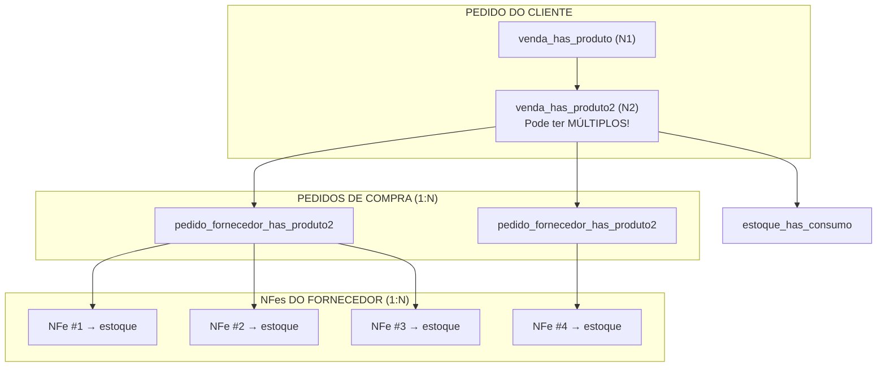
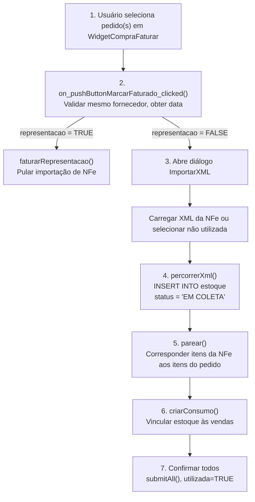
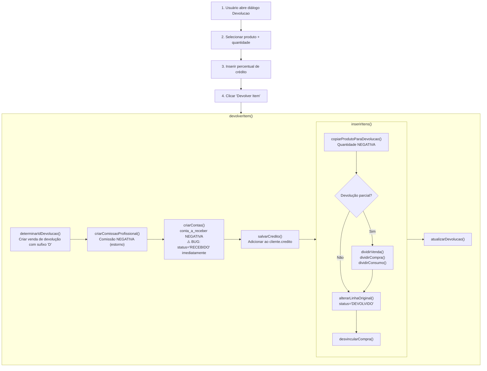
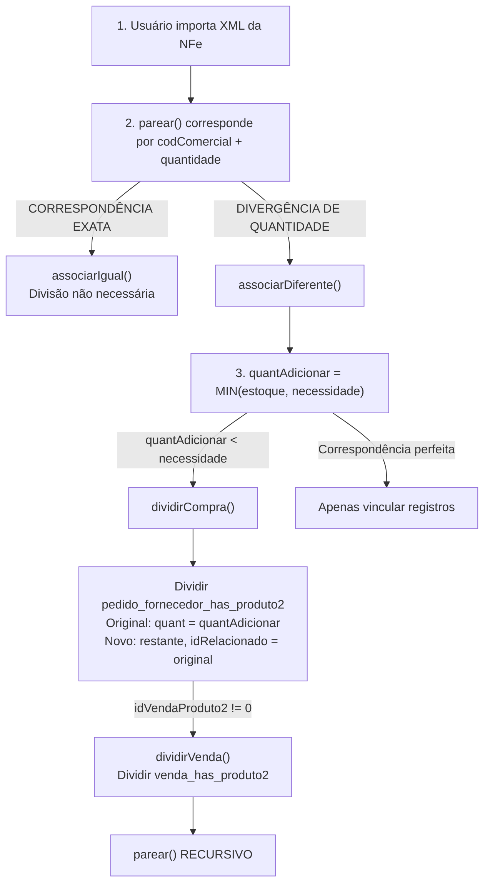

# Fluxo de Estoque - Análise Profunda

> Status: **Análise Crítica Completa**
> Última atualização: 2025-12-27
> Fonte: Análise profunda do código C++

---

## Resumo Executivo

O sistema de estoque é **uma das partes mais complexas** do ERP com múltiplos fluxos interconectados. Este documento fornece uma análise completa baseada na exploração do código-fonte.

### Principais Descobertas

1. **Relacionamentos 1:N:N**: Um item de venda pode ser atendido por múltiplos pedidos de compra, cada um atendido por múltiplas NFes
2. **Estoque criado na importação de NFe**: Não na criação do pedido de compra
3. **Consumo criado na importação**: Pré-consumo vinculado às vendas no momento da importação
4. **FIFO não implementado corretamente**: Depende de `produto.idEstoque` estar pré-definido
5. **Fluxo de devoluções está incompleto/com bugs**: Múltiplos TODOs, sem NFe de Devolução automática

---

## Índice

1. [A Cadeia de Relacionamentos Completa](#1-a-cadeia-de-relacionamentos-completa)
2. [Fluxo de Criação de Estoque (Importação de NFe)](#2-fluxo-de-criação-de-estoque-importação-de-nfe)
3. [O Algoritmo de Pareamento](#3-o-algoritmo-de-pareamento)
4. [Lógica de Consumo de Estoque](#4-lógica-de-consumo-de-estoque)
5. [Cálculo do Campo restante](#5-cálculo-do-campo-restante)
6. [Fluxo de Devoluções e Bugs](#6-fluxo-de-devoluções-e-bugs)
7. [Problemas Identificados](#7-problemas-identificados)
8. [Invariantes de Integridade de Dados](#8-invariantes-de-integridade-de-dados)

---

## 1. A Cadeia de Relacionamentos Completa

### A Estrutura 1:N:N



### Tabelas de Junção

| Tabela                | Propósito                      | Links                           |
| --------------------- | ------------------------------ | ------------------------------- |
| `estoque_has_compra`  | Estoque NFe → Pedido de compra | idEstoque ↔ idCompra, idPedido2 |
| `estoque_has_consumo` | Estoque NFe → Pedido de venda  | idEstoque ↔ idVendaProduto2     |

### Insight Principal

O **idVendaProduto2** é a chave central de vinculação:

- Armazenado em `pedido_fornecedor_has_produto2.idVendaProduto2`
- Armazenado em `estoque_has_consumo.idVendaProduto2`
- Vincula tudo de volta ao pedido do cliente

---

## 2. Fluxo de Criação de Estoque (Importação de NFe)

### Ponto de Entrada: `widgetcomprafaturar.cpp`

**Ação do Usuário**: Clicar em "Marcar Faturado" nos pedidos de compra



### Campos Principais Criados

| Campo       | Valor                             | Notas                                    |
| ----------- | --------------------------------- | ---------------------------------------- |
| `quant`     | Do XML da NFe                     | Quantidade original recebida             |
| `restante`  | = quant                           | Inicialmente quantidade total disponível |
| `status`    | 'EM COLETA'                       | Pronto para retirada no armazém          |
| `idNFe`     | FK para nfe                       | Link para NFe de origem                  |
| `valorUnid` | (valor + vIPI - desconto) / quant | Custo unitário                           |

---

## 3. O Algoritmo de Pareamento

**Localização**: `importarxml.cpp:1251-1313`

### Estratégia de Correspondência

```cpp
void ImportarXML::parear() {
    limparAssociacoes();  // Resetar todas as associações

    for (cada item NFe em modelEstoque) {
        codComercial = item.codComercial;
        quantEstoque = item.quant;

        // PASSO 1: Buscar correspondência EXATA de quantidade
        iguais = modelCompra.multiMatch({
            {"codComercial", codComercial},
            {"quant", quantEstoque},           // Correspondência exata
            {"status", "EM FATURAMENTO"},
            {"quantUpd", Green, NOT}           // Ainda não pareado
        });

        if (iguais found) {
            associarIgual(iguais.first(), rowEstoque);
            continue;
        }

        // PASSO 2: Buscar quantidades DIFERENTES
        diferentes = modelCompra.multiMatch({
            {"codComercial", codComercial},
            {"quant", quantEstoque, NOT},      // Quantidade diferente
            {"status", "EM FATURAMENTO"}
        });

        estoquePareado = 0;
        for (cada linha do pedido em diferentes) {
            associarDiferente(rowCompra, rowEstoque, estoquePareado);
            if (estoquePareado >= quantEstoque) break;
        }
    }
}
```

### Codificação por Cores

| Cor          | Valor | Significado                                         |
| ------------ | ----- | --------------------------------------------------- |
| Verde        | 1     | Correspondência perfeita - pronto para importar     |
| Amarelo      | 2     | Correspondência parcial - divergência de quantidade |
| Vermelho     | 3     | Sem correspondência encontrada                      |
| Verde Escuro | 4     | Consumo criado                                      |

### Quando as Quantidades Não Correspondem

**Cenário**: NFe tem 150 unidades, linha do pedido precisa de 200 unidades

```cpp
void associarDiferente(rowCompra, rowEstoque, &estoquePareado) {
    quantEstoque = 150;  // Quantidade da NFe
    quantCompra = 200;   // Pedido precisa

    quantAdicionar = min(quantEstoque - estoquePareado, quantCompra);
    // quantAdicionar = 150

    if (quantAdicionar < quantCompra) {
        // NFe não cobre totalmente a linha do pedido
        // Dividir a linha do pedido!
        dividirCompra(rowCompra, quantAdicionar);

        // Agora temos:
        // Linha original do pedido: quant = 150 (correspondida a esta NFe)
        // Nova linha do pedido: quant = 50 (aguardando outra NFe)

        parear();  // Re-executar correspondência
        return;
    }
}
```

### A Função dividirCompra()

```cpp
void dividirCompra(rowCompra, quantAdicionar) {
    novoIdPedido2 = qApp->reservarIdPedido2();

    // LINHA ORIGINAL - reduzir para quantidade correspondida
    modelCompra.setData(rowCompra, "quant", quantAdicionar);
    modelCompra.setData(rowCompra, "preco", prcUnitario * quantAdicionar);

    // NOVA LINHA - restante
    INSERT INTO pedido_fornecedor_has_produto2 (
        idPedido2 = novoIdPedido2,
        idRelacionado = original_idPedido2,  // Link para pai
        quant = originalQuant - quantAdicionar,
        status = 'EM FATURAMENTO'  // Ainda aguardando
    );

    // Se pedido de venda vinculado, dividir também
    if (idVendaProduto2 != 0) {
        dividirVenda(rowVenda, quantAdicionar);
    }
}
```

---

## 4. Lógica de Consumo de Estoque

### Quando o Consumo é Criado

Consumo (`estoque_has_consumo`) é criado **no momento da importação da NFe**, NÃO na entrega.

**Localização**: `importarxml.cpp:1030-1130`

```cpp
void criarConsumo(rowCompra, rowEstoque) {
    idVendaProduto2 = modelCompra.data(rowCompra, "idVendaProduto2");

    if (idVendaProduto2 == 0) return;  // Sem venda vinculada, pular

    idEstoque = modelEstoque.data(rowEstoque, "idEstoque");
    quantVenda = modelVenda.data(rowVenda, "quant");
    restanteEstoque = modelEstoque.data(rowEstoque, "restante");

    // Pegar mínimo entre necessidade da venda e estoque disponível
    quantConsumo = min(quantVenda, restanteEstoque);
    proporcao = quantConsumo / quantEstoque;

    // INSERT registro de consumo
    INSERT INTO estoque_has_consumo (
        idEstoque,
        idVendaProduto2,
        status = 'PRÉ-CONSUMO',
        quant = -quantConsumo,        // NEGATIVO = consumo

        -- Valores de impostos proporcionais --
        valor = quantConsumo * valorUnid,
        vBC = vBC * proporcao,
        vICMS = vICMS * proporcao,
        vIPI = vIPI * proporcao,
        -- etc para todos os campos de impostos --
    );

    // Atualizar estoque restante
    modelEstoque.setData(rowEstoque, "restante",
        restanteEstoque - quantConsumo);

    // Atualizar status da linha de venda
    modelVenda.setData(rowVenda, "status", "EM COLETA");
    modelVenda.setData(rowVenda, "dataRealFat", dataFaturamento);
}
```

### Valores de Status do Consumo

| Status        | Significado                     |
| ------------- | ------------------------------- |
| `PRÉ-CONSUMO` | Reservado mas não separado      |
| `CONSUMO`     | Fisicamente separado do armazém |
| `AJUSTE`      | Ajuste (itens quebrados, etc.)  |
| `DEVOLVIDO`   | Retornado ao estoque            |
| `CANCELADO`   | Cancelado                       |

### Múltiplos Consumos por Item de Venda

**Crítico**: Um `idVendaProduto2` pode ter MÚLTIPLOS registros `estoque_has_consumo`!

Isso acontece quando:

- Estoque vem de múltiplas NFes
- Estoque vem de múltiplos lotes
- Entregas parciais

```sql
-- Exemplo: Venda precisa de 100 unidades, atendida por 3 lotes
estoque_has_consumo:
  idEstoque=1, idVendaProduto2=999, quant=-40
  idEstoque=2, idVendaProduto2=999, quant=-35
  idEstoque=3, idVendaProduto2=999, quant=-25

-- Total consumido: 40 + 35 + 25 = 100
```

---

## 5. Cálculo do Campo restante

### Stored Procedure: `update_quant_estoque()`

**Localização**: `initdb.sql:3994-4013`

```sql
-- restante = Quantidade original + Soma de todas as quantidades de consumo
SET @restante := (
    SELECT e.quant + COALESCE(SUM(ehc.quant), 0)
    FROM estoque e
    LEFT JOIN estoque_has_consumo ehc ON e.idEstoque = ehc.idEstoque
    WHERE e.idEstoque = currentId
    GROUP BY e.idEstoque
);

-- Exemplo:
-- estoque.quant = 100 (original)
-- estoque_has_consumo.quant = -40 (consumido)
-- estoque_has_consumo.quant = -30 (consumido)
-- restante = 100 + (-40) + (-30) = 30
```

### Por Que Quantidades Negativas?

- **quant positivo em estoque**: Estoque recebido
- **quant negativo em estoque_has_consumo**: Estoque consumido
- **restante = quant + SUM(consumos)**: Cálculo natural

---

## 6. Fluxo de Devoluções e Bugs

### Dois Tipos de Devoluções

| Tipo                      | Status              | Ação                                  |
| ------------------------- | ------------------- | ------------------------------------- |
| Devolução do Cliente      | `DEVOLVIDO`         | Cliente devolve item, crédito emitido |
| Devolução para Estoque    | `DEVOLVIDO ESTOQUE` | Item retorna ao inventário            |
| Devolução para Fornecedor | `DEVOLVIDO FORN.`   | Item devolvido ao fornecedor          |

### Fluxo de Devolução do Cliente

**Localização**: `devolucao.cpp`



### Bugs Identificados nas Devoluções

| #   | Severidade | Problema                                                                        | Localização                   |
| --- | ---------- | ------------------------------------------------------------------------------- | ----------------------------- |
| 1   | **ALTA**   | Registro financeiro marcado `RECEBIDO` imediatamente (ignora fluxo de trabalho) | devolucao.cpp:554             |
| 2   | **ALTA**   | NFe de Devolução não criada automaticamente                                     | devolucao.cpp:941-947 (TODOs) |
| 3   | **ALTA**   | Registros financeiros têm `observacao` vazia (sem trilha de auditoria)          | devolucao.cpp:552             |
| 4   | **MÉDIA**  | `quantUpd = 5` hard-coded em vez de const                                       | widgetcompradevolucao.cpp:173 |
| 5   | **MÉDIA**  | `quantUpd` faltando em registros de consumo divididos                           | devolucao.cpp:859             |
| 6   | **MÉDIA**  | Crédito do cliente não tem trilha de auditoria do motivo                        | devolucao.cpp:569             |
| 7   | **MÉDIA**  | Vinculação `idRelacionado` confusa para devoluções parciais                     | devolucao.cpp:696,734         |
| 8   | **BAIXA**  | Itens `PENDENTE DEV.` não podem ser devolvidos novamente                        | devolucao.cpp:90              |

### TODOs no Código de Devoluções

```cpp
// De devolucao.cpp:941-946
// TODO: 0. lidar com os casos em que o produto estava agendado é feita a devolucao
// TODO: 1. perguntar e guardar data em que ocorreu a devolucao
// TODO: 2. ??? nao criar linha conta
// TODO: 2. adicionar devolucao de frete quando houver
// TODO: 2. criar linha no followup
// TODO: 2. quando for devolver para o fornecedor perguntar a quantidade
```

---

## 7. Problemas Identificados

### Problemas Críticos

| Problema                                     | Impacto                                 | Causa Raiz                                        |
| -------------------------------------------- | --------------------------------------- | ------------------------------------------------- |
| **FIFO não implementado**                    | Estoque errado consumido                | `produto.idEstoque` não mantido                   |
| **Divisão multi-estoque faltando**           | Não consegue atender de múltiplos lotes | Sem lógica para dividir entre entradas de estoque |
| **Devoluções ignoram fluxo financeiro**      | Não consegue auditar devoluções         | Status definido como RECEBIDO imediatamente       |
| **Sem NFe Devolução**                        | Problemas de conformidade fiscal        | Funcionalidade não implementada                   |
| **Semântica de quantidade negativa confusa** | Confusão em relatórios                  | Padrões de uso misturados                         |

### Detalhe do Problema FIFO

**Implementação Atual**:

```cpp
// De venda.cpp:1046
query.prepare("SELECT p.idEstoque, vp2.idVendaProduto2, vp2.quant
              FROM venda_has_produto2 vp2
              LEFT JOIN produto p ON vp2.idProduto = p.idProduto
              WHERE vp2.idVenda = :idVenda AND vp2.estoque > 0");
```

**Problema**: Sem cláusula `ORDER BY`! Depende inteiramente de `produto.idEstoque` estar pré-definido.

**Deveria Ser**:

```sql
SELECT e.idEstoque
FROM estoque e
WHERE e.idProduto = :idProduto
  AND e.status = 'ESTOQUE'
  AND e.restante > 0
ORDER BY e.created ASC  -- FIFO: mais antigo primeiro
LIMIT 1
```

### Reversão de Devolução Usa LIFO (Errado!)

**Localização**: `inputdialogconfirmacao.cpp:553-601`

Quando mercadorias são danificadas e precisam desfazer consumo:

```cpp
querySelect.prepare(
    "SELECT ... FROM estoque_has_consumo ehc
     LEFT JOIN venda_has_produto2 vp2 ON ...
     WHERE ehc.idEstoque = :idEstoque
     ORDER BY prazoEntrega DESC"  // Prazo MAIS LONGO primeiro!
);
```

Isso é **LIFO** (último a entrar, primeiro a sair) - deveria ser FIFO para reversão adequada.

---

## 8. Invariantes de Integridade de Dados

### Deve SEMPRE Ser Verdade

```sql
-- SALDO DE ESTOQUE
estoque.restante >= 0  -- NUNCA negativo

estoque.restante = estoque.quant + COALESCE(SUM(estoque_has_consumo.quant), 0)

-- LINKS DE CONSUMO
estoque_has_consumo.idVendaProduto2 deve apontar para venda_has_produto2 válido

-- SALDO FINANCEIRO
SUM(conta_a_receber.valor) para venda de devolução = negativo do valor devolvido

-- CONSISTÊNCIA DE STATUS
IF venda_has_produto2.status = 'DEVOLVIDO'
THEN EXISTS linha em estoque_has_consumo com status = 'DEVOLVIDO'
```

### Limites de Transação

Código atual encapsula importação de NFe em transação:

```cpp
qApp->startTransaction("ImportarXML::on_pushButtonImportar");
try {
    importar();  // Todos os inserts/updates
    qApp->endTransaction();  // COMMIT
} catch (...) {
    // ROLLBACK em qualquer erro
}
```

Mas o fluxo de devoluções tem **múltiplas transações separadas** - risco de estado parcial!

---

---

## 9. Quando Registros venda_has_produto2 São Divididos

### Criação Inicial

**Mecanismo**: Trigger do banco + stored procedure

Quando `venda_has_produto` é inserido (durante conversão orçamento→venda):

1. Trigger dispara automaticamente
2. Chama procedure `copy_into_venda_has_produto2`
3. Cria UM `venda_has_produto2` por `venda_has_produto`

**Localização**: `initdb.sql` - procedure `copy_into_venda_has_produto2`

### Quando Divisões Acontecem

**Resposta**: Divisões são **AUTOMÁTICAS** durante importação de NFe, baseadas na disponibilidade de estoque.



### Decisão de Quantidade para Divisão

**Quem decide?** AUTOMÁTICO - sem entrada do usuário

**Fórmula**: `quantAdicionar = qMin(estoqueDisponivel, quantCompra)`

**Localização**: `importarxml.cpp:675`

```cpp
const double quantAdicionar = qMin(estoqueDisponivel, quantCompra);
```

### Cenário de Exemplo

```text
Pedido Original: 100 unidades do Produto X

NFe #1 chega com 60 unidades:
├── venda_has_produto2 #1: quant=60, status='EM COLETA'
└── venda_has_produto2 #2: quant=40, idRelacionado=#1, status='PENDENTE'

NFe #2 chega com 50 unidades:
├── venda_has_produto2 #1: quant=60 (inalterado)
├── venda_has_produto2 #2: quant=40, status='EM COLETA' (agora atendido)
└── (10 unidades da NFe #2 vão para outro pedido ou estoque)
```

### Gatilho Secundário de Divisão: Devoluções

**Localização**: `devolucao.cpp:740` - `dividirVenda()`

Quando cliente devolve quantidade PARCIAL:

- Linha original: status='DEVOLVIDO', quant=quantidade devolvida
- Nova linha: quant=restante, idRelacionado=original

---

## 10. O Link idRelacionado

### Propósito

Vincula registros divididos, formando uma cadeia até o original.

```sql
venda_has_produto2:
  idVendaProduto2 = 1001  -- Original
  idRelacionado = NULL
  quant = 60

  idVendaProduto2 = 1002  -- Primeira divisão
  idRelacionado = 1001    -- Aponta para original
  quant = 25

  idVendaProduto2 = 1003  -- Segunda divisão
  idRelacionado = 1001    -- Também aponta para original
  quant = 15
```

### Relacionamento Pai-Filho

```text
venda_has_produto (idVendaProduto1)
    │
    └── idVendaProdutoFK em venda_has_produto2
           │
           ├── venda_has_produto2 #1 (idRelacionado = NULL)
           ├── venda_has_produto2 #2 (idRelacionado = #1)
           └── venda_has_produto2 #3 (idRelacionado = #1)
```

---

## Próximos Passos

1. [ ] Documentar cenários de relatórios quebrados específicos
2. [ ] Projetar implementação FIFO adequada
3. [ ] Projetar divisão de consumo multi-estoque
4. [ ] Projetar devoluções com NFe Devolução adequada
5. [ ] Projetar limites de transação atômica para todos os fluxos
6. [ ] Criar casos de teste para cada cenário
