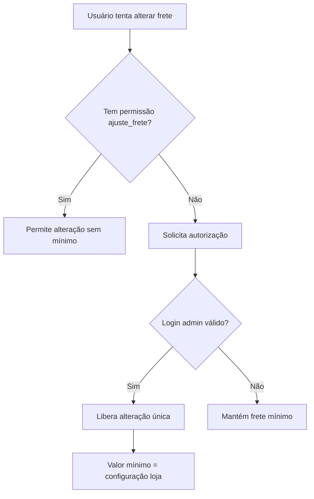

# Regras de Negócio Detalhadas

> Status: **Rascunho**
> Última atualização: 2025-12-28
> Prioridade: Alta

---

## Visão Geral

Este documento centraliza todas as regras de negócio extraídas do sistema C++ atual, servindo como referência para a implementação Laravel.

---

## 1. Precificação (Sistema de 3 Níveis de Desconto)

**Arquivos C++**: `venda.cpp:587-589`, `orcamento.cpp:793-797`, `inputdialogproduto.cpp`

### Estrutura de Descontos

| Nível | Campo          | Descrição                   | Aplicação        |
| ----- | -------------- | --------------------------- | ---------------- |
| 1     | `desconto`     | Desconto % por item         | Linha do produto |
| 2     | `descUnitario` | Preço unitário com desconto | Calculado        |
| 3     | `descGlobal`   | Desconto % global           | Total do pedido  |

### Fórmula de Cálculo

```php
// Implementação Laravel proposta
class PrecoService
{
    public function calcularPrecoItem(
        float $prcUnitario,
        float $quantidade,
        float $descontoItem,    // Nível 1: % desconto do item
        float $descontoGlobal   // Nível 3: % desconto global
    ): array {
        // Subtotal bruto (sem desconto)
        $parcial = $prcUnitario * $quantidade;

        // Preço unitário com desconto do item
        $descUnitario = $prcUnitario * (1 - ($descontoItem / 100));

        // Subtotal com desconto do item
        $parcialDesc = $descUnitario * $quantidade;

        // Total final com desconto global
        $total = $parcialDesc * (1 - ($descontoGlobal / 100));

        return [
            'prc_unitario' => $prcUnitario,
            'parcial' => $parcial,
            'desc_unitario' => $descUnitario,
            'parcial_desc' => $parcialDesc,
            'total' => $total,
        ];
    }
}
```

### Campos do Banco

| Campo          | Tipo          | Descrição                         |
| -------------- | ------------- | --------------------------------- |
| `prcUnitario`  | DECIMAL(10,2) | Preço unitário antes de desconto  |
| `parcial`      | DECIMAL(10,2) | Subtotal (preço × quantidade)     |
| `desconto`     | DECIMAL(5,2)  | % desconto do item                |
| `descUnitario` | DECIMAL(10,2) | Preço unitário após desconto item |
| `parcialDesc`  | DECIMAL(10,2) | Subtotal após desconto item       |
| `descGlobal`   | DECIMAL(5,2)  | % desconto global                 |
| `total`        | DECIMAL(10,2) | Valor final                       |

---

## 2. Frete

**Arquivos C++**: `calculofrete.cpp`, `venda.cpp:379-380,1448-1457`

### Tipos de Cálculo

#### 2.1 Frete por Percentual (Padrão)

```php
class FreteService
{
    public function calcularFrete(float $subtotal, int $lojaId): float
    {
        $config = Loja::find($lojaId);

        $minimoFrete = $config->valor_minimo_frete;
        $percentualFrete = $config->porcentagem_frete;

        // Frete por percentual
        $fretePorcentagem = $subtotal * ($percentualFrete / 100);

        // Retorna o maior entre percentual e mínimo
        return max($fretePorcentagem, $minimoFrete);
    }
}
```

#### 2.2 Frete por Peso (Caminhões)

**Constantes:**

| Constante                   | Valor      | Descrição         |
| --------------------------- | ---------- | ----------------- |
| Capacidade caminhão grande  | 4.300 kg   | Carga máxima      |
| Capacidade caminhão pequeno | 2.000 kg   | Carga máxima      |
| Custo transporte Sul        | R$ 220/ton | Por tonelada      |
| Markup final                | 20%        | Aplicado ao total |

```php
class FreteService
{
    private const CAPACIDADE_CAMINHAO_GRANDE = 4300; // kg
    private const CAPACIDADE_CAMINHAO_PEQUENO = 2000; // kg
    private const CUSTO_TRANSPORTE_SUL_TON = 220.00; // R$/ton
    private const MARKUP = 1.20; // 20%

    public function calcularFretePorPeso(
        float $pesoTotal,
        float $custoMotoristaCaminhaoGrande,
        float $custoAjudantesCaminhaoGrande,
        float $custoMotoristaCaminhaoPequeno,
        float $custoAjudantesCaminhaoPequeno,
        float $custoViagem
    ): float {
        $cargas = intdiv((int)$pesoTotal, self::CAPACIDADE_CAMINHAO_GRANDE);
        $resto = (int)$pesoTotal % self::CAPACIDADE_CAMINHAO_GRANDE;

        if ($resto < self::CAPACIDADE_CAMINHAO_PEQUENO && $resto > 0) {
            // 1 caminhão grande + 1 caminhão pequeno
            $custoCaminhao = (
                ($custoMotoristaCaminhaoGrande + $custoAjudantesCaminhaoGrande) * $cargas
            ) + $custoMotoristaCaminhaoPequeno + $custoAjudantesCaminhaoPequeno;
        } else {
            // Só caminhões grandes
            $custoCaminhao = (
                $custoMotoristaCaminhaoGrande + $custoAjudantesCaminhaoGrande
            ) * ($cargas + ($resto > 0 ? 1 : 0));
        }

        // Custo Sul (por tonelada)
        $custoSul = ($pesoTotal / 1000) * self::CUSTO_TRANSPORTE_SUL_TON;

        // Total com markup de 20%
        $total = ($custoSul + $custoCaminhao + ($cargas * $custoViagem)) * self::MARKUP;

        return round($total, 2);
    }
}
```

### Autorização de Frete

```php
class FreteAuthorizationService
{
    public function podeAjustarFrete(Usuario $usuario): bool
    {
        return $usuario->temPermissao('ajuste_frete');
    }

    public function getValorMinimoFrete(Usuario $usuario, int $lojaId): float
    {
        if ($this->podeAjustarFrete($usuario)) {
            return 0.00; // Sem mínimo para autorizados
        }

        return Loja::find($lojaId)->valor_minimo_frete;
    }
}
```

### Cidades sem Cobrança de Frete

```php
// Configuração em config/frete.php
return [
    'cidades_sem_frete' => [
        // Lista de cidades que não pagam frete
        // Configurável por loja
    ],
];
```

---

## 3. Comissões

**Arquivos C++**: `venda.cpp:675-708`, `devolucao.cpp:485-533`

### 3.1 Comissão de Profissional/Vendedor

```php
class ComissaoService
{
    public function calcularComissaoProfissional(
        Venda $venda,
        float $percentualPontuacao
    ): float {
        // Base: subtotal líquido menos desconto global
        $base = $venda->subtotal_liquido - $venda->desconto_global_reais;

        return $base * ($percentualPontuacao / 100);
    }

    public function getDataPagamento(Carbon $dataVenda): Carbon
    {
        $dia = $dataVenda->day;

        if ($dia >= 1 && $dia <= 15) {
            // Vendas 01-15: pagamento dia 30 do mesmo mês
            return $dataVenda->copy()->endOfMonth();
        } else {
            // Vendas 16-30: pagamento dia 15 do próximo mês
            return $dataVenda->copy()->addMonth()->day(15);
        }
    }
}
```

### 3.2 Comissão RT (Representante Técnico)

```php
class ComissaoRtService
{
    public function calcularComissaoRT(
        float $precoUnitario,
        float $quantidade,
        float $percentualRT // Armazenado em venda.rt
    ): float {
        return ($precoUnitario * $quantidade) * ($percentualRT / 100);
    }

    public function criarLancamentoRT(Venda $venda, VendaItem $item): void
    {
        if ($venda->rt <= 0) {
            return;
        }

        $valor = $this->calcularComissaoRT(
            $item->preco_unitario,
            $item->quantidade,
            $venda->rt
        );

        ContasReceber::create([
            'descricao' => "RT Venda #{$venda->id}",
            'valor' => $valor,
            'grupo' => "RT's",
            'data_vencimento' => $this->getDataPagamento($venda->created_at),
        ]);
    }
}
```

### Calendário de Pagamento

| Período da Venda | Data de Pagamento      |
| ---------------- | ---------------------- |
| Dia 01-15        | Dia 30 do mesmo mês    |
| Dia 16-31        | Dia 15 do mês seguinte |

---

## 4. Crédito de Cliente

**Arquivos C++**: `venda.cpp:939-958`, `devolucao.cpp:566-574`

### Uso de Crédito em Vendas

```php
class CreditoClienteService
{
    public function usarCredito(Cliente $cliente, float $valor): void
    {
        if ($valor > $cliente->credito) {
            throw new SaldoInsuficienteException(
                "Crédito insuficiente. Disponível: R$ {$cliente->credito}"
            );
        }

        $cliente->decrement('credito', $valor);
    }

    public function adicionarCredito(Cliente $cliente, float $valor, string $motivo): void
    {
        $cliente->increment('credito', $valor);

        // Log de auditoria
        activity()
            ->performedOn($cliente)
            ->withProperties(['valor' => $valor, 'motivo' => $motivo])
            ->log('Crédito adicionado');
    }

    public function restaurarCredito(Venda $venda): void
    {
        // Chamado no cancelamento de venda
        $creditoUsado = $venda->pagamentos()
            ->where('tipo', 'CONTA CLIENTE')
            ->sum('valor');

        if ($creditoUsado > 0) {
            $this->adicionarCredito(
                $venda->cliente,
                $creditoUsado,
                "Restauração por cancelamento venda #{$venda->id}"
            );
        }
    }
}
```

### Fluxo de Crédito


---

## 5. Impostos

**Arquivos C++**: `estoque.cpp:244-261`, `devolucao.cpp:848-873`

### Campos de Impostos Rastreados

| Campo       | Descrição              | Tipo          |
| ----------- | ---------------------- | ------------- |
| `vBC`       | Base de cálculo ICMS   | DECIMAL(15,2) |
| `pICMS`     | Alíquota ICMS %        | DECIMAL(5,2)  |
| `vICMS`     | Valor ICMS             | DECIMAL(15,2) |
| `vBCST`     | Base de cálculo ST     | DECIMAL(15,2) |
| `pICMSST`   | Alíquota ST %          | DECIMAL(5,2)  |
| `vICMSST`   | Valor ST               | DECIMAL(15,2) |
| `vBCPIS`    | Base de cálculo PIS    | DECIMAL(15,2) |
| `pPIS`      | Alíquota PIS %         | DECIMAL(5,2)  |
| `vPIS`      | Valor PIS              | DECIMAL(15,2) |
| `vBCCOFINS` | Base de cálculo COFINS | DECIMAL(15,2) |
| `pCOFINS`   | Alíquota COFINS %      | DECIMAL(5,2)  |
| `vCOFINS`   | Valor COFINS           | DECIMAL(15,2) |

### Alocação Proporcional em Consumos

```php
class ImpostoService
{
    public function alocarImpostosConsumo(
        Estoque $estoque,
        float $quantidadeConsumida
    ): array {
        $proporcao = $quantidadeConsumida / $estoque->quantidade;

        return [
            'vBC' => $estoque->vBC * $proporcao,
            'pICMS' => $estoque->pICMS, // Alíquota não muda
            'vICMS' => $estoque->vICMS * $proporcao,
            'vBCST' => $estoque->vBCST * $proporcao,
            'pICMSST' => $estoque->pICMSST,
            'vICMSST' => $estoque->vICMSST * $proporcao,
            'vBCPIS' => $estoque->vBCPIS * $proporcao,
            'pPIS' => $estoque->pPIS,
            'vPIS' => $estoque->vPIS * $proporcao,
            'vBCCOFINS' => $estoque->vBCCOFINS * $proporcao,
            'pCOFINS' => $estoque->pCOFINS,
            'vCOFINS' => $estoque->vCOFINS * $proporcao,
        ];
    }
}
```

### Alíquota ST Padrão

```php
// Configuração
return [
    'st_aliquota_padrao' => 4.68, // %
];
```

---

## 6. Devoluções

**Arquivos C++**: `devolucao.cpp`, `venda.cpp:1155-1189`

### Janela de Cancelamento/Devolução

```php
class DevolucaoService
{
    public function podeDevolver(Venda $venda, Usuario $usuario): bool
    {
        // Admin sempre pode
        if ($usuario->isAdmin()) {
            return true;
        }

        $dataVenda = $venda->created_at;
        $dataAtual = now();

        // Mesmo mês: OK
        if ($dataAtual->isSameMonth($dataVenda)) {
            return true;
        }

        // Mês seguinte: apenas primeiros dias
        $mesSeguinte = $dataVenda->copy()->addMonth();
        if ($dataAtual->isSameMonth($mesSeguinte)) {
            return $this->dentroDosPrimeirosDias($dataAtual);
        }

        return false;
    }

    private function dentroDosPrimeirosDias(Carbon $data): bool
    {
        $diaSemana = $data->dayOfWeek; // 0=Dom, 1=Seg...6=Sab
        $dia = $data->day;

        // Segunda a Sexta: apenas dia 1
        if ($diaSemana >= 1 && $diaSemana <= 5) {
            return $dia === 1;
        }

        // Sábado: até dia 2
        if ($diaSemana === 6) {
            return $dia < 3;
        }

        // Domingo: até dia 1
        if ($diaSemana === 0) {
            return $dia < 2;
        }

        return false;
    }
}
```

### Tabela de Janela de Devolução

| Período                        | Permitido          |
| ------------------------------ | ------------------ |
| Mesmo mês da venda             | ✅ Sempre          |
| Mês seguinte, dia 1 (seg-sex)  | ✅                 |
| Mês seguinte, dia 1-2 (sábado) | ✅                 |
| Mês seguinte, dia 1 (domingo)  | ✅                 |
| Mês seguinte, após prazo       | ❌ (precisa Admin) |
| 2+ meses após                  | ❌ (precisa Admin) |

### Status de Itens em Devolução

| Status          | Descrição                             |
| --------------- | ------------------------------------- |
| `PENDENTE DEV.` | Aguardando processamento              |
| `DEV. FORN.`    | Devolvido ao fornecedor               |
| `DEV. EST.`     | Devolvido ao estoque (adiciona saldo) |

### Cálculo de Crédito na Devolução

```php
class DevolucaoService
{
    public function calcularCredito(
        float $precoUnitario,
        float $quantidade
    ): float {
        return $precoUnitario * $quantidade;
    }
}
```

---

## 7. Aprovações e Autorizações

**Arquivos C++**: `venda.cpp:820-847`, `user.h`

### Permissões por Tipo de Usuário

| Tipo                   | Admin | Administrativo | Gerente | Vendedor |
| ---------------------- | ----- | -------------- | ------- | -------- |
| `ADMINISTRADOR`        | ✅    | ✅             | ❌      | ❌       |
| `DIRETOR`              | ✅    | ✅             | ❌      | ❌       |
| `ADMINISTRATIVO`       | ❌    | ✅             | ❌      | ❌       |
| `GERENTE_LOJA`         | ❌    | ❌             | ✅      | ❌       |
| `GERENTE_DEPARTAMENTO` | ❌    | ❌             | ✅      | ❌       |
| `GERENTE_FINANCEIRO`   | ❌    | ❌             | ✅      | ❌       |
| `VENDEDOR`             | ❌    | ❌             | ❌      | ✅       |
| `VENDEDOR_ESPECIAL`    | ❌    | ❌             | ❌      | ✅       |

### Fluxo de Autorização de Frete



### Implementação Laravel

```php
class AutorizacaoService
{
    public function autorizarOperacao(
        Usuario $usuario,
        string $permissao,
        ?string $senhaAdmin = null
    ): bool {
        // Verifica permissão direta
        if ($usuario->temPermissao($permissao)) {
            return true;
        }

        // Verifica senha de admin
        if ($senhaAdmin) {
            return $this->validarSenhaAdmin($senhaAdmin);
        }

        return false;
    }

    private function validarSenhaAdmin(string $senha): bool
    {
        $admins = Usuario::whereIn('tipo', ['ADMINISTRADOR', 'DIRETOR'])->get();

        foreach ($admins as $admin) {
            if (Hash::check($senha, $admin->password)) {
                return true;
            }
        }

        return false;
    }
}
```

---

## 8. Consumo de Estoque (FIFO)

**Arquivos C++**: `estoque.cpp:186-278`

### Regras de Consumo

```php
class ConsumoService
{
    public function criarConsumo(
        int $vendaItemId,
        int $estoqueId,
        float $quantidade
    ): Consumo {
        $estoque = Estoque::findOrFail($estoqueId);

        // Validação de quantidade
        if ($quantidade > $estoque->quantidade_restante) {
            throw new QuantidadeInsuficienteException();
        }

        // Cria consumo
        $consumo = Consumo::create([
            'estoque_id' => $estoqueId,
            'venda_item_id' => $vendaItemId,
            'quantidade' => $quantidade,
            'caixas' => $quantidade / $estoque->quantidade_caixa,
            'status' => 'CONSUMO',
        ]);

        // Copia lote para item da venda (se existir)
        if ($estoque->lote && $estoque->lote !== 'N/D') {
            VendaItem::find($vendaItemId)->update(['lote' => $estoque->lote]);
        }

        // Aloca impostos proporcionalmente
        $impostos = app(ImpostoService::class)
            ->alocarImpostosConsumo($estoque, $quantidade);
        $consumo->update($impostos);

        return $consumo;
    }
}
```

### Status de Consumo

| Status    | Descrição                    |
| --------- | ---------------------------- |
| `CONSUMO` | Consumo normal de venda      |
| `AJUSTE`  | Ajuste de quantidade (admin) |

### Divisão de Compra (Split)

Quando uma compra é parcialmente consumida:

```php
class CompraService
{
    public function dividirCompra(
        Compra $compra,
        float $quantidadeConsumida,
        int $vendaItemId
    ): void {
        if ($quantidadeConsumida == $compra->quantidade) {
            // Consumo total: apenas vincula
            $compra->update([
                'venda_id' => $vendaItem->venda_id,
                'venda_item_id' => $vendaItemId,
            ]);
        } else {
            // Consumo parcial: divide linha
            $quantidadeRestante = $compra->quantidade - $quantidadeConsumida;

            // Linha original fica com restante
            $compra->update(['quantidade' => $quantidadeRestante]);

            // Nova linha para consumido
            $novaCompra = $compra->replicate();
            $novaCompra->quantidade = $quantidadeConsumida;
            $novaCompra->venda_id = $vendaItem->venda_id;
            $novaCompra->venda_item_id = $vendaItemId;
            $novaCompra->id_relacionado = $compra->id;
            $novaCompra->save();
        }
    }
}
```

---

## 9. Representação

**Arquivos C++**: `venda.cpp:362-367`

### Flag de Representação

```php
class VendaService
{
    public function criarVendaRepresentacao(Orcamento $orcamento): Venda
    {
        $venda = Venda::create([
            'orcamento_id' => $orcamento->id,
            'representacao' => true,
            // Identificador com sufixo 'R': "0000000001R"
        ]);

        // Restrições para representação
        $venda->frete_manual = true;
        $venda->save();

        return $venda;
    }

    public function gerarIdentificador(Venda $venda): string
    {
        $numero = str_pad($venda->id, 10, '0', STR_PAD_LEFT);

        return $venda->representacao
            ? "{$numero}R"  // 11 chars para representação
            : $numero;       // 10 chars normal
    }
}
```

---

## 10. Constantes e Thresholds

### Configurações Globais

```php
// config/negocios.php
return [
    'frete' => [
        'capacidade_caminhao_grande' => 4300, // kg
        'capacidade_caminhao_pequeno' => 2000, // kg
        'custo_transporte_sul_ton' => 220.00, // R$
        'markup' => 1.20, // 20%
    ],

    'impostos' => [
        'st_aliquota_padrao' => 4.68, // %
    ],

    'devolucao' => [
        'dias_mes_seguinte_semana' => 1,
        'dias_mes_seguinte_sabado' => 2,
        'dias_mes_seguinte_domingo' => 1,
    ],

    'comissao' => [
        'dia_corte' => 15,
        'dia_pagamento_primeira_quinzena' => 30,
        'dia_pagamento_segunda_quinzena' => 15,
    ],
];
```

---

## Validações Críticas

### Checklist de Implementação

- [ ] Descontos calculados nos 3 níveis produzem mesmos valores que C++
- [ ] Frete mínimo aplicado para usuários sem permissão
- [ ] Comissões calculadas e agendadas corretamente
- [ ] Crédito de cliente incrementado/decrementado atomicamente
- [ ] Janela de devolução respeitada
- [ ] FIFO consumindo lotes mais antigos primeiro
- [ ] Impostos alocados proporcionalmente
- [ ] Representação com sufixo 'R' no identificador

---

## Documentos Relacionados

- [10-paridade-funcionalidades.md](./10-paridade-funcionalidades.md) - Checklist de funcionalidades
- [../tecnico/modulos/vendas.md](../tecnico/modulos/vendas.md) - Spec do módulo Vendas
- [../tecnico/modulos/financeiro.md](../tecnico/modulos/financeiro.md) - Spec do módulo Financeiro
- [../tecnico/modulos/estoque.md](../tecnico/modulos/estoque.md) - Spec do módulo Estoque
