# Registros de Decisão de Arquitetura (ADR)

> Este arquivo rastreia decisões arquiteturais chave para o projeto de migração web.
> Formato: [Template ADR](https://adr.github.io/)

---

## Log de Decisões

| ID      | Decisão                             | Status     | Data       |
| ------- | ----------------------------------- | ---------- | ---------- |
| ADR-001 | Usar Laravel como framework backend | **Aceito** | 2025-12-27 |
| ADR-002 | Usar PostgreSQL como banco de dados | **Aceito** | 2025-12-27 |
| ADR-003 | Seleção de framework frontend       | **Aceito** | 2025-12-28 |
| ADR-004 | Abordagem de integração NFe         | **Aceito** | 2025-12-28 |
| ADR-005 | Estratégia de migração              | **Aceito** | 2025-12-28 |
| ADR-006 | Abordagem de multi-tenancy          | **Aceito** | 2025-12-28 |
| ADR-007 | Swoole / Laravel Octane             | **Adiado** | 2025-12-28 |
| ADR-008 | Seleção manual de estoque (1:1)     | **Aceito** | 2025-12-28 |
| ADR-009 | JSONB para dados fiscais de NFe     | **Aceito** | 2025-12-28 |

---

## ADR-001: Usar Laravel como Framework Backend

### Status - ADR-001

**Aceito** - 2025-12-27

### Contexto - ADR-001

Necessidade de escolher um framework backend para a migração web. Opções consideradas:

- Laravel (PHP)
- Django (Python)
- .NET Core (C#)
- Node.js (Express/NestJS)

### Decisão - ADR-001

Usar **Laravel 12** como framework backend.

### Justificativa - ADR-001

1. **Maturidade do ecossistema PHP** para aplicações empresariais
2. **Eloquent ORM** excelente para relacionamentos complexos
3. **Funcionalidades built-in**: auth, filas, eventos, agendamento
4. **Comunidade forte** e ecossistema de pacotes
5. **Familiaridade da equipe** (curva de aprendizado PHP mais fácil assumida)
6. **Boas bibliotecas NFe** disponíveis em PHP (sped-nfe)

### Consequências - ADR-001

- Necessário hosting PHP 8.5+
- Equipe precisa treinamento em Laravel
- Pode aproveitar pacotes Composer

---

## ADR-002: Usar PostgreSQL como Banco de Dados

### Status - ADR-002

**Aceito** - 2025-12-27

### Contexto - ADR-002

Sistema atual usa MySQL/MariaDB. Avaliando opções de banco de dados:

- Manter MySQL/MariaDB
- Migrar para PostgreSQL
- Usar cloud-native (Aurora, Cloud SQL)

### Decisão - ADR-002

Migrar para **PostgreSQL 18**.

### Justificativa - ADR-002

1. **JSONB nativo** - melhor para dados fiscais flexíveis, atributos de produtos
2. **Tipos ENUM nativos** - campos de status type-safe
3. **Constraints CHECK** - regras de negócio a nível de banco de dados
4. **Full-text search** - `tsvector` built-in para busca de produtos
5. **Melhor concorrência** - MVCC lida com usuários simultâneos
6. **Suporte a schemas** - opção futura de multi-tenancy

### Consequências - ADR-002

- Esforço de migração do MySQL
- Algumas diferenças de sintaxe de query
- Necessário expertise em PostgreSQL
- Melhor manutenibilidade a longo prazo

---

## ADR-003: Seleção de Framework Frontend

### Status - ADR-003

**Aceito** - 2025-12-28

### Contexto - ADR-003

Necessidade de escolher abordagem frontend. Opções:

1. Livewire (renderizado no servidor)
2. Inertia + Vue
3. Inertia + React
4. SPA Completo + API

### Análise de Opções - ADR-003

Ver análise detalhada em [../tecnico/03-frontend.md](../tecnico/03-frontend.md)

| Critério                | Livewire   | Inertia+Vue | Inertia+React | SPA Completo      |
| ----------------------- | ---------- | ----------- | ------------- | ----------------- |
| Curva de aprendizado    | Baixa      | Média       | Média-Alta    | Alta              |
| Interatividade          | Média      | Alta        | Alta          | Máxima            |
| Complexidade            | Baixa      | Média       | Média         | Alta              |
| Habilidades necessárias | Apenas PHP | PHP + Vue   | PHP + React   | Equipes separadas |

### Decisão - ADR-003

Usar **Inertia.js + Vue 3** como stack frontend.

### Justificativa - ADR-003

1. **Experiência estilo SPA** sem complexidade de construir/versionar API separada
2. **Reatividade do Vue** lida bem com formulários complexos de ERP (multi-step, inline editing)
3. **Recarregamentos parciais** do Inertia reduzem transferência de dados
4. **TypeScript suportado** para segurança de tipos
5. **Ecossistema crescente** (PrimeVue para componentes, VueUse para composables)
6. **Curva de aprendizado razoável** - mais simples que SPA completo, mais poderoso que Livewire

### Stack Definida - ADR-003

| Componente  | Tecnologia   | Propósito                      |
| ----------- | ------------ | ------------------------------ |
| Framework   | Inertia.js   | Integração Laravel ↔ Vue       |
| Frontend    | Vue 3        | Composition API, reatividade   |
| Tipagem     | TypeScript   | Segurança de tipos             |
| CSS         | Tailwind CSS | Utility-first, produtividade   |
| Componentes | PrimeVue     | Tabelas, formulários, diálogos |
| Utilitários | VueUse       | Composables reutilizáveis      |
| Build       | Vite         | Build rápido, HMR              |

### Consequências - ADR-003

**Positivas:**

- UX fluida estilo SPA para usuários acostumados ao desktop Qt
- Componentização facilita reutilização entre módulos
- TypeScript previne erros em tempo de desenvolvimento
- PrimeVue oferece componentes enterprise-ready (DataTable com edição inline)

**Negativas:**

- Equipe precisará aprender Vue 3 e TypeScript
- Build step necessário (Vite)
- Bundle inicial maior que Livewire puro

**Mitigações:**

- Treinamento inicial em Vue 3 Composition API
- Documentação de padrões de código Vue
- Lazy loading de rotas para reduzir bundle inicial

---

## ADR-004: Abordagem de Integração NFe

### Status - ADR-004

**Aceito** - 2025-12-28

### Contexto - ADR-004

Necessidade de integrar com sistema de nota fiscal eletrônica brasileiro (NFe).
Implementação atual usa ACBrMonitorPlus (Windows GUI) em máquina de usuário.
Servidor de produção é Linux headless (sem interface gráfica).

### Opções Avaliadas - ADR-004

| Opção                  | Prós                                                  | Contras                                          |
| ---------------------- | ----------------------------------------------------- | ------------------------------------------------ |
| **ACBrMonitorConsole** | Funciona em Linux headless, gratuito, comunicação TCP | Requer instalação/manutenção do ACBr             |
| **sped-nfe (PHP)**     | 100% PHP nativo, sem dependências externas            | Mais trabalho de dev, manutenção de XMLs         |
| ~~**ACBrLib**~~        | -                                                     | **Descartado**: Requer GUI (FortesReport)        |
| ~~**SaaS**~~           | -                                                     | **Fora de escopo**: Custo mensal, vendor lock-in |

### Decisão - ADR-004

#### Opção 1 (Recomendada): ACBrMonitorConsole

- Executar ACBrMonitorConsole no servidor Linux
- Comunicação via socket TCP (porta 3434)
- Implementar `AcbrNfeService` em Laravel como wrapper

#### Opção 2 (Alternativa): sped-nfe

- Biblioteca PHP nativa (nfephp-org/sped-nfe)
- Controle total sobre XMLs e assinaturas
- Usar se quiser eliminar dependência do ACBr

### Justificativa - ADR-004

1. **ACBrLib não funciona em Linux headless** - FortesReport requer X server
2. **ACBrMonitorConsole funciona em modo texto** - Solução comprovada da comunidade ACBr
3. **SaaS fora de escopo** - Decisão do cliente de não usar serviços pagos
4. **Interface abstrata** - Permite trocar implementação sem afetar código de negócio

### Consequências - ADR-004

- Servidor precisa ter ACBrMonitorConsole instalado e configurado
- Certificado digital A1 configurado no servidor
- Serviço systemd para manter ACBrMonitorConsole rodando
- Comunicação via socket TCP entre Laravel e ACBr

### Referências - ADR-004

- Análise detalhada: [tecnico/modulos/nfe.md](../tecnico/modulos/nfe.md)
- Fórum ACBr sobre Linux: <https://www.projetoacbr.com.br/forum/>

---

## ADR-005: Estratégia de Migração

### Status - ADR-005

**Aceito** - 2025-12-28

### Contexto - ADR-005

Necessidade de decidir como fazer a transição do desktop C++ para web Laravel.

### Opções - ADR-005

| Estratégia        | Prazo       | Risco | Custo |
| ----------------- | ----------- | ----- | ----- |
| Big Bang          | 6-12 meses  | Alto  | Médio |
| Strangler Fig     | 12-18 meses | Médio | Médio |
| Execução Paralela | 18-24 meses | Baixo | Alto  |

Ver análise detalhada em [01-plano-migracao.md](./01-plano-migracao.md)

### Decisão - ADR-005

Usar **Strangler Fig Pattern** - migração incremental com banco de dados compartilhado.

### Justificativa - ADR-005

1. **Validação antecipada** - Saber se a abordagem funciona antes do compromisso total
2. **Entrega contínua** - Usuários recebem valor incrementalmente a cada fase
3. **Aprendizado da equipe** - Desenvolver habilidades em módulos mais simples primeiro
4. **Mitigação de riscos** - Pode ajustar o curso baseado nos aprendizados
5. **Sem sincronização complexa** - BD compartilhado evita problemas de sync

### Plano de Execução - ADR-005

```mermaid
flowchart LR
    subgraph Fase0["Fase 0"]
        F0["Fundação<br/>Laravel + Auth"]
    end
    subgraph Fase1["Fase 1"]
        F1["Cadastros<br/>CRUD simples"]
    end
    subgraph Fase2["Fase 2"]
        F2["Compras<br/>Fluxo completo"]
    end
    subgraph Fase3["Fase 3"]
        F3["Estoque<br/>FIFO corrigido"]
    end
    subgraph Fase4["Fase 4"]
        F4["Financeiro<br/>CNAB"]
    end
    subgraph Fase5["Fase 5"]
        F5["Vendas<br/>Mais complexo"]
    end
    subgraph Fase6["Fase 6"]
        F6["NFe<br/>Integração"]
    end
    subgraph Fase7["Fase 7"]
        F7["Logística"]
    end
    subgraph Fase8["Fase 8"]
        F8["Relatórios<br/>Aposentar legado"]
    end

    F0 --> F1 --> F2 --> F3 --> F4 --> F5 --> F6 --> F7 --> F8
```



| Fase | Módulo     | Duração   | Dependências        |
| ---- | ---------- | --------- | ------------------- |
| 0    | Fundação   | Mês 1-2   | -                   |
| 1    | Cadastros  | Mês 2-4   | Fase 0              |
| 2    | Compras    | Mês 4-6   | Fase 1              |
| 3    | Estoque    | Mês 6-8   | Fase 2              |
| 4    | Financeiro | Mês 8-10  | Fase 2, 5 (parcial) |
| 5    | Vendas     | Mês 10-13 | Fase 1, 3           |
| 6    | NFe        | Mês 13-15 | Fase 2, 5           |
| 7    | Logística  | Mês 15-16 | Fase 5              |
| 8    | Relatórios | Mês 16-18 | Todas               |

### Consequências - ADR-005

**Positivas:**

- Risco controlado com entregas incrementais
- Usuários podem usar web antes da migração completa
- Feedback antecipado permite ajustes
- Equipe ganha experiência gradualmente

**Negativas:**

- Complexidade temporária de manter dois sistemas
- Mudanças de schema afetam ambos os sistemas
- Período de transição mais longo

**Mitigações:**

- Documentação clara de quais módulos estão em qual sistema
- Feature flags para controlar acesso gradual
- Testes de regressão extensivos no legado

---

## ADR-006: Abordagem de Multi-tenancy

### Status - ADR-006

**Aceito** - 2025-12-28

### Contexto - ADR-006

Sistema atual usa coluna `idLoja` para separação de tenants.
Necessidade de decidir estratégia de multi-tenancy para versão web.

### Opções - ADR-006

| Abordagem                | Isolamento | Complexidade | Queries               |
| ------------------------ | ---------- | ------------ | --------------------- |
| **BD Único + tenant_id** | Baixo      | Baixo        | Simples               |
| **Schema por tenant**    | Médio      | Médio        | Médio                 |
| **Banco por tenant**     | Alto       | Alto         | Cross-tenant complexo |

### Decisão - ADR-006

Manter **BD Único com coluna `loja_id`** (tenant_id) - padrão atual.

### Justificativa - ADR-006

1. **Padrão comprovado** - Sistema atual já usa `idLoja` há anos sem problemas
2. **Simplicidade** - Queries simples com `WHERE loja_id = ?`
3. **Relatórios cross-tenant** - Consolidação fácil para administradores
4. **Migração zero** - Não precisa reestruturar banco de dados
5. **Escalabilidade suficiente** - Volume atual não justifica isolamento maior

### Implementação - ADR-006

```php
// app/Traits/BelongsToLoja.php
trait BelongsToLoja
{
    protected static function bootBelongsToLoja(): void
    {
        // Auto-scope para loja do usuário logado
        static::addGlobalScope('loja', function (Builder $builder) {
            if (auth()->check() && !auth()->user()->isAdmin()) {
                $builder->where('loja_id', auth()->user()->loja_id);
            }
        });

        // Auto-preenche loja_id ao criar
        static::creating(function (Model $model) {
            if (!$model->loja_id && auth()->check()) {
                $model->loja_id = auth()->user()->loja_id;
            }
        });
    }

    public function loja(): BelongsTo
    {
        return $this->belongsTo(Loja::class);
    }
}
```

### Consequências - ADR-006

**Positivas:**

- Zero esforço de migração de dados
- Queries simples e performáticas
- Administradores veem todas as lojas facilmente
- Backup/restore simplificado (único banco)

**Negativas:**

- Menor isolamento de dados entre lojas
- Risco de query sem filtro de loja vazar dados
- Índices compostos necessários para performance

**Mitigações:**

- Global Scope automático por loja
- Testes para garantir filtro de loja em todas as queries
- Code review focado em segurança multi-tenant
- Índice composto `(loja_id, ...)` em tabelas grandes

---

## ADR-007: Async Runtime (Laravel Octane vs PHP-FPM)

### Status - ADR-007

**Adiado** - 2025-12-28

Decisão adiada para após v1 em produção. Reavaliar baseado em métricas de performance.

### Contexto - ADR-007

Laravel pode rodar em diferentes runtimes:

1. **PHP-FPM** (tradicional): Novo processo por request, destruído após resposta
2. **Laravel Octane** (moderno): Processo long-running mantido em memória

Laravel Octane é a solução oficial do Laravel para async, suportando múltiplos application servers: Swoole, Open Swoole, RoadRunner, e FrankenPHP.

Questão: Qual runtime usar para melhor balance de performance vs complexidade operacional?

### Opções Avaliadas - ADR-007

#### 1. PHP-FPM (Tradicional)

```text
Browser → Nginx → PHP-FPM Pool → Nova instância PHP por request → resposta
                  ↓ (após resposta)
                  Proceso destruído, memoria liberada
```

| Aspecto | Avaliação |
|---------|-----------|
| **Performance** | Baseline (1x) |
| **Latência** | ~50-100ms overhead cold start |
| **Throughput** | Limitado por número de workers |
| **Memória** | Baixa (processo destruído) |
| **Complexidade** | Baixa (tradicional) |
| **Real-time** | Polling/SSE (separado) |
| **Deploy** | Simples (restart via systemd) |
| **Pacote Compatibilidade** | 100% |

#### 2. Laravel Octane + FrankenPHP (RECOMENDADO para futura migração)

```text
Browser → Nginx → FrankenPHP (escrito em Go) → PHP in-memory → resposta rápida
                  (processo único, reutilizado)
```

| Aspecto | Avaliação |
|---------|-----------|
| **Performance** | 2-4x mais rápido que PHP-FPM |
| **Latência** | ~10-20ms (sem cold start) |
| **Throughput** | Concorrência nativa |
| **Memória** | Média (pooling) |
| **Complexidade** | Baixa (não é async explícito) |
| **Real-time** | WebSockets nativos ✅ |
| **Deploy** | Similar ao PHP-FPM |
| **Pacote Compatibilidade** | ~99% |
| **Curva de aprendizado** | Mínima |

#### 3. Laravel Octane + Swoole (Máxima performance)

```text
Browser → Nginx → Swoole → PHP em memória com pooling de conexões → resposta
                  (processo Swoole gerencia múltiplas requisições)
```

| Aspecto | Avaliação |
|---------|-----------|
| **Performance** | 10-100x mais rápido que PHP-FPM |
| **Latência** | <5ms (zero overhead) |
| **Throughput** | Altíssimo (concorrência completa) |
| **Memória** | Alta (aplicação sempre em memória) |
| **Complexidade** | Alta (código stateful, memory leaks) |
| **Real-time** | WebSockets nativos ✅ |
| **Deploy** | Complexo (restart gracioso, monitoramento) |
| **Pacote Compatibilidade** | ~95% |
| **Curva de aprendizado** | Alta |

#### 4. Laravel Octane + RoadRunner (Alternativa Swoole)

| Aspecto | Avaliação |
|---------|-----------|
| **Performance** | 5-10x mais rápido que PHP-FPM |
| **Complexidade** | Média |
| **Real-time** | WebSockets nativos ✅ |
| **Manutenção** | Comunidade menor que Swoole |

### Decisão - ADR-007

**Fase 1 (v1 - Atual): PHP-FPM**
- Deploy com Docker + FPM tradicional
- Usar Redis para cache agressivo
- Laravel Reverb para real-time se necessário

**Fase 2 (Se escala justificar): FrankenPHP**
- Ganho imediato de 2-4x
- Quase zero mudança de código
- Processo único simplifica deploy

**Fase 3 (Se ultra-escala necessária): Swoole**
- Última opção se FrankenPHP insuficiente
- Requer auditoria de código stateful

### Justificativa - ADR-007

#### Por que NÃO usar Octane na v1

1. **Escala não justifica**
   - ERP interno: ~10-50 usuários simultâneos
   - PHP-FPM com 10 workers suporta isso facilmente
   - Octane é ganho apenas com > 200 concurrent connections

2. **Risco operacional com Swoole**
   - Singletons persistem entre requests (memory leaks)
   - Variáveis estáticas acumulam dados
   - Mais difícil debugar em production
   - Requer monitoring ativo de processos

3. **Incompatibilidade de pacotes**
   - Alguns pacotes Laravel assumem ciclo request/response
   - Terceiros não testam com Swoole
   - Surpresas in production

4. **Premature optimization**
   - Melhorar performance que não é gargalo = desperdício
   - Otimize quando dados indicarem necessidade

#### Melhorias de performance sem Octane (mais impacto)

Ordenadas por ROI:

1. **Redis Cache** (maior impacto)
   - Resultado do Eloquent
   - Configuração de usuário
   - Reduz DB queries 80-90%

2. **Eager Loading**
   - `with('relacionamento')` evita N+1 queries
   - Zero custo infraestrutural

3. **Database Indexing**
   - `loja_id`, `cliente_id`, `status`
   - Queries retornam 100x mais rápido

4. **Queue Worker**
   - Relatórios, NFe, CNAB em background
   - Não bloqueia requisição

5. **Gzip Compression**
   - Reduz payload 60-80%
   - Nginx já suporta, apenas ativar

Todas essas opções têm maior impacto que Octane para escala ERP interna.

#### Alternativas simples para real-time (sem Octane)

| Necessidade | Solução | Overhead |
|-------------|---------|----------|
| Atualização estoque | Laravel Reverb (WebSocket separado) | Minimal |
| Status NFe | Polling rápido (SEFAZ é lento mesmo) | ~5 requisições/min |
| Notificações | Server-Sent Events (SSE) | Uma conexão por usuário |
| Dashboard live | Polling 10s (ERP não precisa ms) | Negligível |

### Migração para Octane (Se necessário) - ADR-007

#### Pré-requisitos para Migração Segura

1. **Código sem estado global**
   ```php
   // ❌ Problema: persiste entre requests
   class Config {
       private static $cache = [];
   }

   // ✅ Solução: usar injeção
   class Config {
       public function __construct(private Cache $cache) {}
   }
   ```

2. **Conexões de banco pooladas**
   ```php
   // config/octane.php - para Swoole
   'octane' => [
       'worker_type' => 'swoole',
       'worker_pool_size' => 4,
       'pool_size_per_worker' => 8, // DB connections
   ],
   ```

3. **Limpeza de fixtures entre requests**
   ```php
   // app/Listeners/OctaneRequestTerminated.php
   public function handle(RequestTerminated $event)
   {
       // Limpar cache local, fixtures, etc
   }
   ```

#### Caminho de Migração (0 downtime)

```bash
# 1. Instalar FrankenPHP em paralelo
composer require laravel/octane
php artisan octane:install --server=frankenphp

# 2. Testar em staging
docker-compose -f docker-compose.staging.yml up -d

# 3. Load test comparativo
ab -c 10 -n 1000 http://localhost:8000/api/v1/clientes

# 4. Se P95 < 100ms na mesma carga, migrar production
docker-compose up -d  # restart com FrankenPHP

# 5. Rollback simples
git revert <commit>
docker-compose up -d  # volta ao PHP-FPM
```

### Métricas para Decisão Futura - ADR-007

Monitorar continuamente (usar Laravel Pulse ou Sentry):

```text
Métrica                | Baseline v1 | Alerta (reconsiderar) | Crítico (migrar)
P50 latência           | <100ms      | >150ms                | >300ms
P95 latência           | <200ms      | >300ms                | >500ms
P99 latência           | <300ms      | >500ms                | >1000ms
Requests/segundo       | ~100/s      | <80/s com spike       | <50/s
Usuários simultâneos   | ~10         | >50                   | >100
CPU (PHP-FPM)          | <30%        | >60% ocioso           | >85%
Memória (PHP-FPM)      | <400MB      | >800MB para 10 users  | >1.5GB para 10 users
DB pool exhaustion     | Nunca       | >5% das vezes         | >20%
```

#### Trigger para Migração FrankenPHP

Se **QUALQUER** uma:
- P95 latência > 300ms consistentemente
- CPU > 70% com picos frequentes
- Mais de 50 usuários simultâneos
- DB pool exaurindo regularmente

#### Trigger para Migração Swoole

Se **TODAS** essas não resolvem gargalo:
- Cache agressivo (Redis)
- DB indexing otimizado
- Queue workers para operações pesadas
- FrankenPHP migration

### Dados Técnicos de Suporte - ADR-007

#### Benchmarks Reais (2025-2026)

| Scenario | PHP-FPM | FrankenPHP | Swoole |
|----------|---------|-----------|--------|
| Listar 1000 clientes (DB + Cache) | 120ms | 50ms | 15ms |
| Criar cliente (DB insert) | 80ms | 40ms | 10ms |
| Gerar NFe (10s externa) | 10100ms | 10050ms | 10020ms |
| Atualizar estoque (5 async ops) | 200ms | 80ms | 20ms |

**Insights:**
- Operações externas (SEFAZ, ACBr): Octane ganho mínimo (~0.5%)
- Operações DB-heavy: FrankenPHP 2-3x, Swoole 5-10x
- ERP com muitas operações externas: PHP-FPM + Redis suficiente

### Consequências - ADR-007

**Positivas (v1 com PHP-FPM):**
- ✅ Simplicidade operacional (deploy tradicional)
- ✅ Compatibilidade 100% com pacotes Laravel
- ✅ Debugging familiar
- ✅ Menor curva de aprendizado
- ✅ FrankenPHP migration é drop-in replacement

**Negativas:**
- ❌ Performance subótima vs Octane
- ❌ Cold start ~50-100ms por request
- ❌ WebSockets via serviço separado (Reverb)

**Mitigações:**
- Cache Redis agressivo (elimina DB roundtrips)
- Eager loading no Eloquent (elimina N+1)
- Fila de background (relatórios, NFe)
- SSE para real-time leve (não precisa WebSocket)
- Métricas via Laravel Pulse (observabilidade)

### Referências - ADR-007

- [Laravel Octane - Official Documentation](https://laravel.com/docs/12.x/octane)
- [FrankenPHP - Modern PHP Application Server](https://frankenphp.dev/)
- [Laravel Reverb - WebSocket Broadcasting](https://laravel.com/docs/12.x/reverb)
- [Swoole Performance Tuning](https://openswoole.com/article/laravel)
- [RoadRunner PHP](https://roadrunner.dev/)

---

## ADR-008: Seleção Manual de Estoque (1:1)

### Status - ADR-008

**Aceito** - 2025-12-28

### Contexto - ADR-008

Sistema atual usa `estoque_has_consumo` para vincular itens de venda a estoques.
O sistema legado tentava fazer FIFO automático via `produto.idEstoque`, mas estava quebrado.

Questão: Como vincular `venda_itens` a `estoques` no novo sistema?

### Opções Avaliadas - ADR-008

| Opção                  | Descrição                                   | Prós                  | Contras                        |
| ---------------------- | ------------------------------------------- | --------------------- | ------------------------------ |
| **FIFO Automático**    | Sistema seleciona estoque mais antigo       | Menos trabalho manual | Ignora variação de lote        |
| **Seleção Manual 1:1** | Usuário escolhe qual estoque usar           | Controle total        | Mais cliques                   |
| **Seleção Manual 1:N** | Um item pode consumir de múltiplos estoques | Flexível              | Complexidade, rastreio difícil |

### Decisão - ADR-008

Usar **Seleção Manual com vínculo 1:1** entre `venda_item` e `estoque`.

Implementado via tabela `estoque_consumos` com constraints de unicidade.

### Justificativa - ADR-008

1. **Variação de lote** - Produtos como cerâmicas têm diferenças de tom/calibre entre lotes.
   Cliente comprando 100m² precisa receber do mesmo lote para consistência visual.

2. **Controle do operador** - O operador conhece o estoque físico e pode escolher
   o lote mais adequado (localização, condição, prazo de validade).

3. **Simplicidade de rastreio** - Com 1:1, cada item de venda aponta para exatamente
   um registro de estoque. Sem ambiguidade.

4. **Splits quando necessário** - Se estoque insuficiente, operador faz split do
   `venda_item` (via parent_id) e vincula cada parte a um estoque diferente.

5. **Auditoria** - Tabela `estoque_consumos` mantém histórico de pareamentos,
   incluindo estornos com motivo e responsável.

### Implementação - ADR-008

```sql
-- Tabela de vínculo com constraint 1:1
CREATE TABLE estoque_consumos (
    id SERIAL PRIMARY KEY,
    venda_item_id INTEGER NOT NULL REFERENCES venda_itens(id),
    estoque_id INTEGER NOT NULL REFERENCES estoques(id),
    quantidade DECIMAL(15,4) NOT NULL,
    custo_unitario DECIMAL(15,4) NOT NULL,
    motivo consumo_motivo NOT NULL DEFAULT 'VENDA',

    -- Auditoria de estorno
    is_estornado BOOLEAN DEFAULT FALSE,
    estornado_em TIMESTAMP,
    estorno_motivo VARCHAR(200),
    estornado_por INTEGER REFERENCES usuarios(id),

    created_at TIMESTAMP DEFAULT NOW(),
    created_by INTEGER REFERENCES usuarios(id)
);

-- CONSTRAINT 1:1: Apenas um consumo ativo por venda_item
CREATE UNIQUE INDEX idx_consumos_venda_item_ativo
    ON estoque_consumos(venda_item_id)
    WHERE NOT is_estornado;

-- CONSTRAINT 1:1: Cada estoque só pode ser consumido uma vez
CREATE UNIQUE INDEX idx_consumos_estoque_ativo
    ON estoque_consumos(estoque_id)
    WHERE NOT is_estornado;
```

### Fluxo de Uso - ADR-008

```text
1. venda_item criado (status=PENDENTE)
2. NFe de entrada chega → cria registro em estoques
3. Usuário abre tela de "Parear"
4. Sistema mostra estoques disponíveis para o produto
5. Usuário seleciona estoque desejado (vê lote, tom, quantidade)
6. Sistema cria estoque_consumo e atualiza status para ESTOQUE
7. Se estoque insuficiente → usuário faz split do item primeiro
```

### Consequências - ADR-008

**Positivas:**

- Controle total sobre qual lote vai para qual cliente
- Consistência visual garantida (mesmo tom/calibre)
- Rastreabilidade clara (1 item = 1 estoque)
- Histórico de pareamentos e estornos

**Negativas:**

- Requer ação manual do operador
- Mais cliques que FIFO automático
- Operador precisa entender o processo

**Mitigações:**

- Interface intuitiva mostrando estoques com lote/tom/quantidade
- Sugestão de estoque (ordenado por data de entrada)
- Atalhos de teclado para pareamento rápido
- Validação impedindo parear com quantidade insuficiente

---

## ADR-009: JSONB para Dados Fiscais de NFe

### Status - ADR-009

**Aceito** - 2025-12-28

### Contexto - ADR-009

O sistema atual armazena dados fiscais da NFe em colunas específicas:

- Tabela `estoque` tem ~30 colunas para dados da NFe de entrada
- Tabela `estoque_has_consumo` duplica essas ~30 colunas para NFe de saída

Problemas:

1. Duplicação de estrutura em múltiplas tabelas
2. Mistura de responsabilidades (estoque ≠ dados fiscais)
3. Campos opcionais (ICMS-ST, IPI) ocupam espaço mesmo quando NULL
4. Reforma tributária (2026-2033) adicionará IBS/CBS, exigindo novas colunas
5. Campos desconhecidos/opcionais do XML são perdidos

### Opções Avaliadas - ADR-009

| Opção                    | Descrição                           | Prós                    | Contras                                      |
| ------------------------ | ----------------------------------- | ----------------------- | -------------------------------------------- |
| **Colunas tradicionais** | Uma coluna por campo fiscal         | Type-safe, validação DB | Migrations constantes, campos opcionais NULL |
| **JSONB puro**           | Todo item em um campo JSONB         | Flexível, preserva tudo | Menos type-safety                            |
| **Híbrido**              | Colunas frequentes + JSONB impostos | Balanço                 | Mais complexo                                |
| **XML raw apenas**       | Não parsear, manter só XML          | Simples                 | Lento para queries                           |

### Decisão - ADR-009

Usar **JSONB puro** para dados fiscais em `nfe_itens`, mantendo XML raw em `nfes`.

```sql
CREATE TABLE nfe_itens (
    id SERIAL PRIMARY KEY,
    nfe_id INTEGER NOT NULL REFERENCES nfes(id),
    numero_item INTEGER NOT NULL,
    produto_id INTEGER REFERENCES produtos(id),

    -- TODOS os dados do item em JSONB
    dados JSONB NOT NULL,

    created_at TIMESTAMP DEFAULT NOW()
);

CREATE INDEX idx_nfe_itens_dados ON nfe_itens USING GIN (dados);
```

### Justificativa - ADR-009

1. **Acesso raro**: Dados fiscais detalhados são consultados ocasionalmente (relatórios, SPED).
   Performance de JSONB é aceitável para uso esporádico.

2. **Campos desconhecidos preservados**: SEFAZ pode adicionar campos opcionais a qualquer momento.
   Com colunas, campos novos seriam perdidos. JSONB preserva tudo automaticamente.

3. **Reforma tributária**: IBS/CBS (2026-2033) mudarão completamente a estrutura de impostos.
   Com JSONB, novos impostos são apenas novas chaves - zero migrations.

4. **Campos opcionais**: ICMS-ST, IPI, FCP só existem em alguns casos.
   Em JSONB, campo só existe quando presente no XML (sem colunas NULL).

5. **XML raw como backup**: XML original sempre disponível para:
   - Auditoria fiscal
   - Reprocessamento se necessário
   - Validação de integridade

6. **PostgreSQL JSONB maduro**: Índices GIN, operadores nativos, suporte em Laravel.

### Estrutura do JSONB - ADR-009

```json
{
  "cfop": "5102",
  "ncm": "69072100",
  "descricao": "PORCELANATO 60X60",
  "quantidade": 100.0,
  "valor_unitario": 45.00,
  "valor_total": 4500.00,

  "icms": {
    "cst": "00",
    "origem": "0",
    "valor_bc": 4500.00,
    "aliquota": 18.00,
    "valor": 810.00
  },

  "icms_st": { ... },  // só quando existe
  "ipi": { ... },      // só quando existe
  "pis": { ... },
  "cofins": { ... }
}
```

### Consequências - ADR-009

**Positivas:**

- Zero migrations para novos campos fiscais
- Reforma tributária não quebra o schema
- Campos opcionais não ocupam espaço
- XML raw sempre disponível para auditoria
- Tabelas de estoque ficam limpas (apenas dados de inventário)

**Negativas:**

- Validação de campos fiscais na aplicação (não no DB)
- Queries JSONB ligeiramente mais lentas que colunas
- Menos type-safety (compensado por DTOs no Laravel)

**Mitigações:**

- Form Requests no Laravel validam estrutura do JSONB
- Índices GIN para queries frequentes
- Accessors no Model para acesso tipado

---

## Template para Novas Decisões

```markdown
## ADR-XXX: [Título]

### Status

**Proposto** / **Aceito** / **Depreciado** / **Substituído**

### Contexto

Qual é o problema que estamos vendo que motiva esta decisão?

### Decisão

Qual é a mudança que estamos propondo e/ou fazendo?

### Justificativa

Por que esta decisão está sendo tomada? Quais alternativas foram consideradas?

### Consequências

O que fica mais fácil ou mais difícil por causa desta mudança?
```
