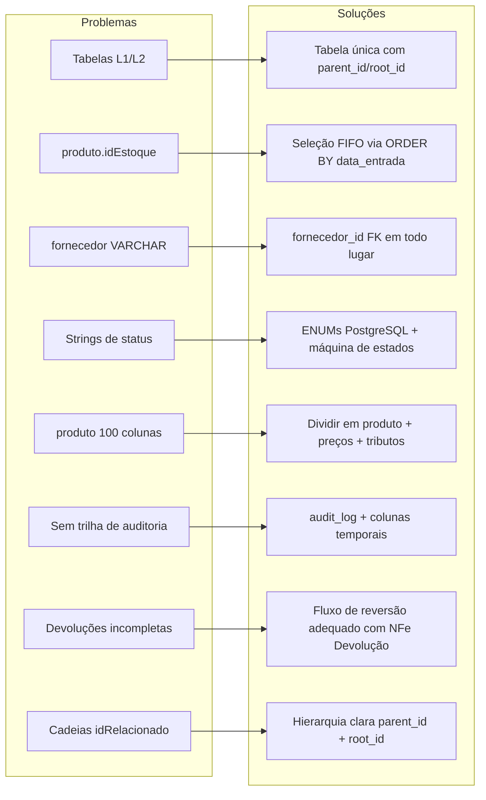
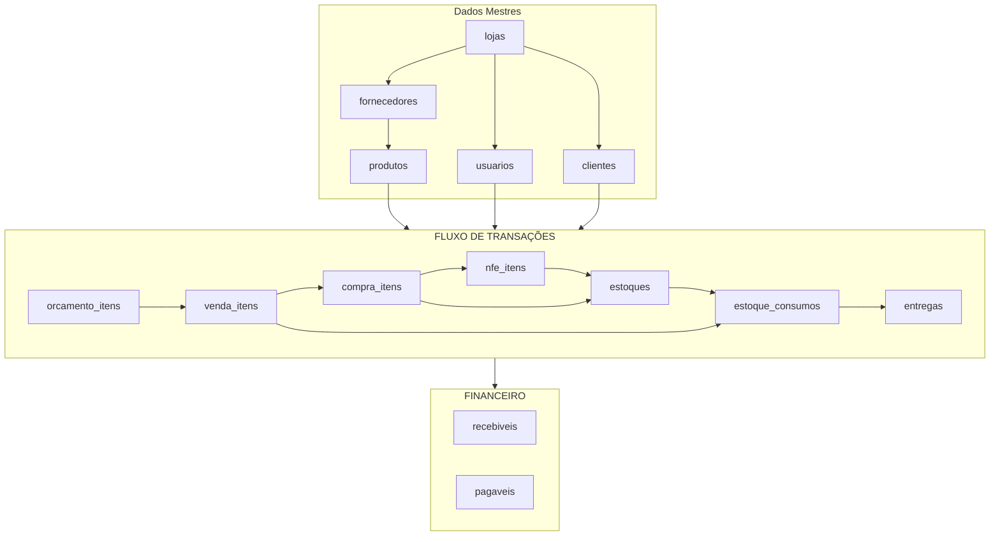
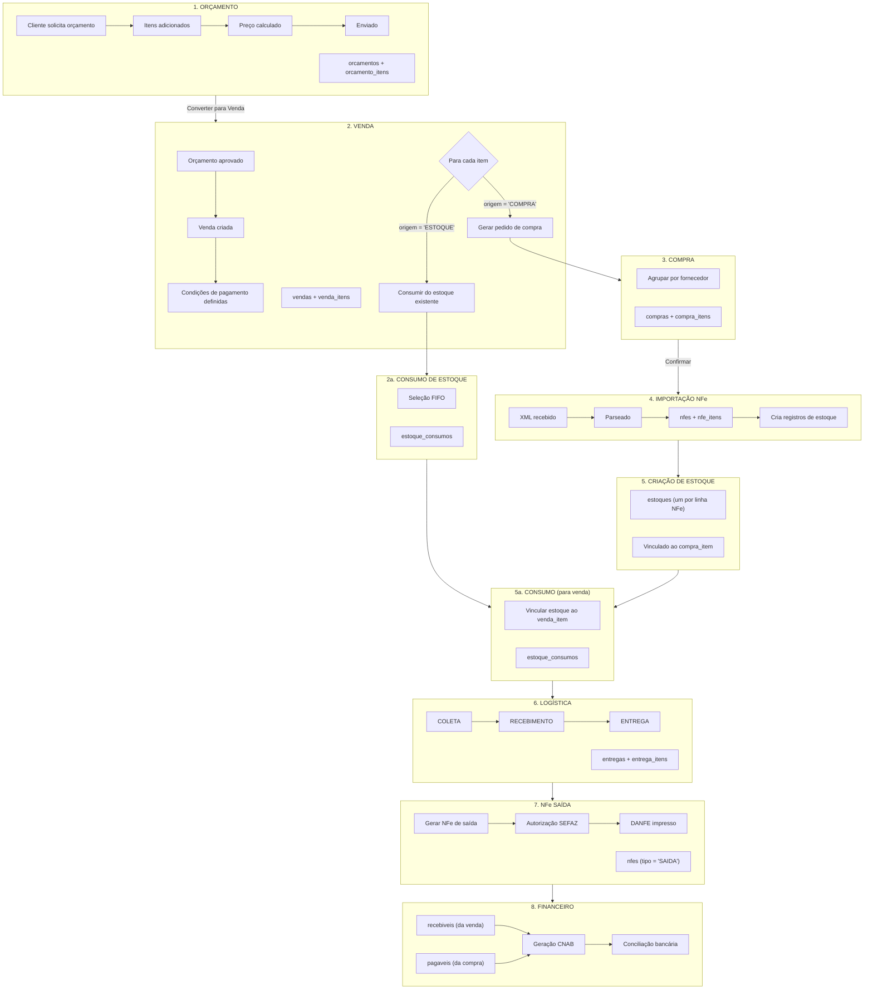
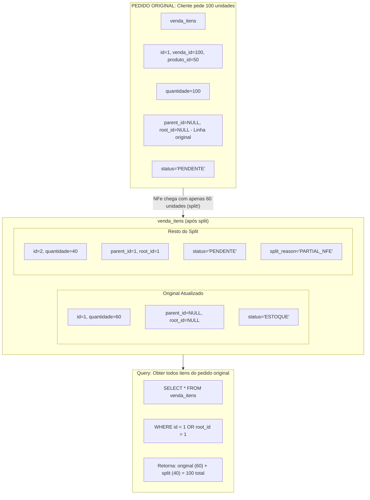
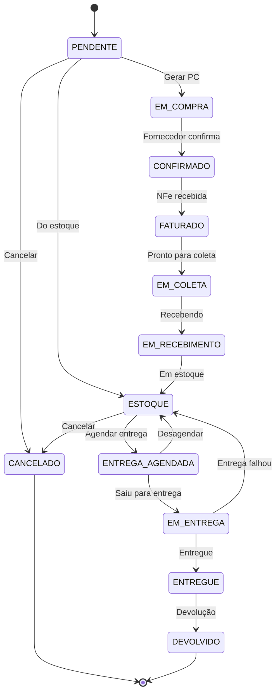
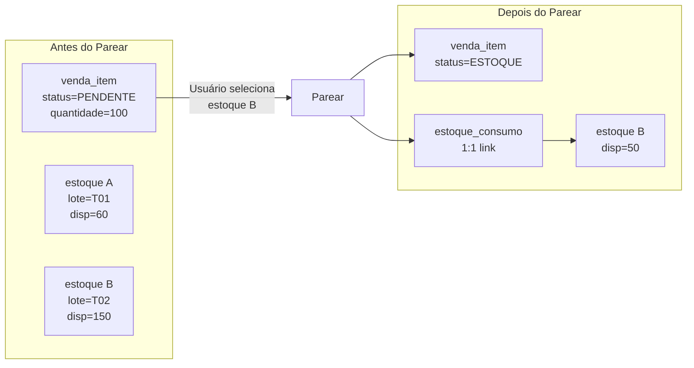
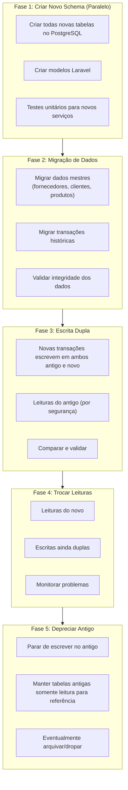

# Fluxo de Negócio e Schema Redesenhados

> Status: **Brainstorming**
> Última atualização: 2025-12-28
> Propósito: Redesenho holístico abordando todos os pontos de dor identificados

---

## Escopo deste Documento

Este documento apresenta a **solução completa de redesign**:

- Schema PostgreSQL completo com todas as tabelas
- ENUMs de status e tipos
- Máquinas de estado com regras de transição
- Arquitetura orientada a eventos
- Caminho de migração em 5 fases

**Para a justificativa técnica do PostgreSQL** e análise detalhada dos problemas atuais, veja [tecnico/02-banco-dados.md](../tecnico/02-banco-dados.md).

---

## Sumário

1. [Princípios de Design](#1-princípios-de-design)
2. [Modelo de Entidades Principal](#2-modelo-de-entidades-principal)
3. [Fluxo do Pedido até a Entrega](#3-fluxo-do-pedido-até-a-entrega)
4. [Schema Completo](#4-schema-completo)
5. [Máquinas de Estado de Status](#5-máquinas-de-estado-de-status)
6. [Principais Melhorias](#6-principais-melhorias)
7. [Arquitetura Orientada a Eventos](#7-arquitetura-orientada-a-eventos)
8. [Caminho de Migração](#8-caminho-de-migração)

---

## 1. Princípios de Design

### 1.1 Princípios Orientadores

| Princípio                   | Implementação                                           |
| --------------------------- | ------------------------------------------------------- |
| **Fonte Única da Verdade**  | Uma tabela por conceito, sem duplicação L1/L2           |
| **Integridade Referencial** | Todas as FKs impostas, sem órfãos                       |
| **Explícito > Implícito**   | ENUMs de status, não strings mágicas                    |
| **Auditar Tudo**            | Quem, quando, o que mudou                               |
| **FIFO por Padrão**         | Estoque consumido por data de entrada                   |
| **Núcleo Imutável**         | Transações apenas append, correções via novos registros |

### 1.2 O Que Estamos Corrigindo



---

## 2. Modelo de Entidades Principal

### 2.1 Visão Geral do Relacionamento de Entidades



### 2.2 Decisões Chave de Design

**Tabelas de Itens Únicas**: Cada nível do fluxo tem UMA tabela de itens:

- `orcamento_itens` - Itens do Orçamento
- `venda_itens` - Itens da Venda (com splits via parent_id)
- `compra_itens` - Itens do pedido de compra
- `nfe_itens` - Itens da NFe
- `estoques` - Registros de estoque (um por lote/linha NFe)
- `estoque_consumos` - Registros de consumo (FIFO)
- `entrega_itens` - Itens de entrega

**Estratégia de Vinculação**: Relacionamentos FK claros, sem cópias desnormalizadas

---

## 3. Fluxo do Pedido até a Entrega

### 3.1 Diagrama de Fluxo Completo



### 3.2 Tratamento de Splits



---

## 4. Schema Completo

### 4.1 ENUMs

```sql
-- Status de Item de Venda
CREATE TYPE venda_item_status AS ENUM (
    'PENDENTE',           -- Aguardando compra
    'EM_COMPRA',          -- Pedido de compra criado
    'CONFIRMADO',         -- Fornecedor confirmou
    'FATURADO',           -- NFe recebida
    'EM_COLETA',          -- Pronto para coleta
    'EM_RECEBIMENTO',     -- Sendo recebido
    'ESTOQUE',            -- Em estoque
    'ENTREGA_AGENDADA',   -- Entrega agendada
    'EM_ENTREGA',         -- Saiu para entrega
    'ENTREGUE',           -- Entregue
    'DEVOLVIDO',          -- Devolvido
    'CANCELADO'           -- Cancelado
);

-- Status de Item de Compra
CREATE TYPE compra_item_status AS ENUM (
    'PENDENTE',           -- Aguardando confirmação
    'CONFIRMADO',         -- Fornecedor confirmou
    'FATURADO',           -- NFe recebida
    'EM_COLETA',          -- Pronto para coleta
    'EM_RECEBIMENTO',     -- Sendo recebido
    'RECEBIDO',           -- Em estoque
    'CANCELADO'           -- Cancelado
);

-- Status de NFe
CREATE TYPE nfe_status AS ENUM (
    'RASCUNHO',           -- Rascunho
    'PENDENTE',           -- Aguardando autorização
    'PROCESSANDO',        -- Enviado ao SEFAZ
    'AUTORIZADA',         -- Autorizada
    'REJEITADA',          -- Rejeitada
    'CANCELADA',          -- Cancelada
    'DENEGADA',           -- Denegada
    'INUTILIZADA'         -- Faixa inutilizada
);

-- Tipo de NFe
CREATE TYPE nfe_tipo AS ENUM (
    'ENTRADA',            -- Entrada (do fornecedor)
    'SAIDA',              -- Saída (para cliente)
    'DEVOLUCAO_ENTRADA',  -- Devolução do cliente
    'DEVOLUCAO_SAIDA'     -- Devolução para fornecedor
);

-- Status Financeiro
CREATE TYPE financeiro_status AS ENUM (
    'PENDENTE',
    'AGENDADO',
    'PAGO',
    'RECEBIDO',
    'ATRASADO',
    'CANCELADO'
);

-- Status de Venda (cabeçalho)
CREATE TYPE venda_status AS ENUM (
    'ABERTA',             -- Em andamento
    'PARCIAL',            -- Alguns itens entregues
    'CONCLUIDA',          -- Todos itens entregues
    'CANCELADA'           -- Cancelada
);

-- Status de Compra (cabeçalho)
CREATE TYPE compra_status AS ENUM (
    'PENDENTE',           -- Aguardando envio
    'ENVIADA',            -- Enviada ao fornecedor
    'CONFIRMADA',         -- Confirmada pelo fornecedor
    'PARCIAL',            -- Parcialmente recebida
    'RECEBIDA',           -- Totalmente recebida
    'CANCELADA'           -- Cancelada
);

-- Status de Estoque
CREATE TYPE estoque_status AS ENUM (
    'DISPONIVEL',         -- Disponível para venda
    'RESERVADO',          -- Reservado para venda
    'CONSUMIDO',          -- Totalmente consumido
    'BLOQUEADO'           -- Bloqueado (avaria, etc)
);

-- Motivo de Consumo de Estoque
CREATE TYPE consumo_motivo AS ENUM (
    'VENDA',              -- Consumo normal para venda
    'AJUSTE',             -- Ajuste de inventário
    'QUEBRA',             -- Produto quebrado/danificado
    'TRANSFERENCIA',      -- Transferência entre lojas
    'AMOSTRA'             -- Amostra para cliente
);
```

### 4.2 Tabelas de Dados Mestres

```sql
-- Lojas (Lojas/Armazéns)
CREATE TABLE lojas (
    id SERIAL PRIMARY KEY,
    codigo VARCHAR(10) UNIQUE NOT NULL,
    nome VARCHAR(200) NOT NULL,
    cnpj VARCHAR(18) UNIQUE NOT NULL,
    inscricao_estadual VARCHAR(20),

    -- Endereço
    endereco_id INTEGER REFERENCES enderecos(id),

    -- Configurações
    config JSONB DEFAULT '{}',

    is_ativo BOOLEAN DEFAULT TRUE,
    created_at TIMESTAMP DEFAULT NOW(),
    updated_at TIMESTAMP DEFAULT NOW()
);

-- Fornecedores
CREATE TABLE fornecedores (
    id SERIAL PRIMARY KEY,
    razao_social VARCHAR(200) NOT NULL,
    nome_fantasia VARCHAR(200),
    cnpj VARCHAR(18) UNIQUE,
    inscricao_estadual VARCHAR(20),

    -- Contato
    email VARCHAR(200),
    telefone VARCHAR(20),

    -- Dados bancários
    banco VARCHAR(100),
    agencia VARCHAR(20),
    conta VARCHAR(20),

    -- Regras de negócio
    comissao_percentual DECIMAL(5,2) DEFAULT 0,
    is_frete_pago_loja BOOLEAN DEFAULT FALSE,
    is_representacao BOOLEAN DEFAULT FALSE,
    prazo_entrega_dias INTEGER DEFAULT 30,

    is_ativo BOOLEAN DEFAULT TRUE,
    created_at TIMESTAMP DEFAULT NOW(),
    updated_at TIMESTAMP DEFAULT NOW()
);

-- Clientes
CREATE TABLE clientes (
    id SERIAL PRIMARY KEY,
    tipo CHAR(2) NOT NULL CHECK (tipo IN ('PF', 'PJ')),
    nome_razao VARCHAR(200) NOT NULL,
    nome_fantasia VARCHAR(200),
    cpf_cnpj VARCHAR(18) UNIQUE NOT NULL,
    inscricao_estadual VARCHAR(20),

    -- Contato
    email VARCHAR(200),
    telefone VARCHAR(20),

    -- Crédito
    limite_credito DECIMAL(15,2) DEFAULT 0,
    saldo_credito DECIMAL(15,2) DEFAULT 0,

    -- Links
    vendedor_id INTEGER REFERENCES usuarios(id),

    is_incompleto BOOLEAN DEFAULT FALSE,
    is_ativo BOOLEAN DEFAULT TRUE,
    created_at TIMESTAMP DEFAULT NOW(),
    updated_at TIMESTAMP DEFAULT NOW()
);

-- Produtos - DIVIDIDO da mega-tabela
CREATE TABLE produtos (
    id SERIAL PRIMARY KEY,
    fornecedor_id INTEGER NOT NULL REFERENCES fornecedores(id),

    -- Identificação
    codigo_comercial VARCHAR(100) NOT NULL,
    codigo_barras VARCHAR(50),
    descricao VARCHAR(500) NOT NULL,
    descricao_curta VARCHAR(100),

    -- Unidades
    unidade VARCHAR(10) DEFAULT 'UN',
    unidades_por_caixa DECIMAL(10,4) DEFAULT 1,
    peso_kg DECIMAL(10,4),

    -- Classificação
    ncm_id INTEGER REFERENCES ncms(id),
    categoria_id INTEGER REFERENCES categorias(id),

    -- Flags
    tem_lote BOOLEAN DEFAULT FALSE,

    is_ativo BOOLEAN DEFAULT TRUE,
    created_at TIMESTAMP DEFAULT NOW(),
    updated_at TIMESTAMP DEFAULT NOW(),

    UNIQUE(fornecedor_id, codigo_comercial)
);

-- Preços (versionados)
CREATE TABLE produto_precos (
    id SERIAL PRIMARY KEY,
    produto_id INTEGER NOT NULL REFERENCES produtos(id),

    custo DECIMAL(15,4) NOT NULL,
    valor_venda DECIMAL(15,4) NOT NULL,
    markup DECIMAL(7,4) GENERATED ALWAYS AS (
        CASE WHEN custo > 0 THEN (valor_venda / custo - 1) * 100 ELSE 0 END
    ) STORED,

    vigencia_inicio DATE NOT NULL DEFAULT CURRENT_DATE,
    vigencia_fim DATE,

    created_at TIMESTAMP DEFAULT NOW(),
    created_by INTEGER REFERENCES usuarios(id)
);

-- Tributos (configuração de impostos)
CREATE TABLE produto_tributos (
    produto_id INTEGER PRIMARY KEY REFERENCES produtos(id),

    -- ICMS
    cst_icms VARCHAR(3),
    aliquota_icms DECIMAL(5,2),

    -- ST
    tem_st BOOLEAN DEFAULT FALSE,
    mva DECIMAL(7,4),

    -- IPI
    cst_ipi VARCHAR(2),
    aliquota_ipi DECIMAL(5,2),

    -- PIS/COFINS
    cst_pis VARCHAR(2),
    aliquota_pis DECIMAL(5,2),
    cst_cofins VARCHAR(2),
    aliquota_cofins DECIMAL(5,2),

    -- IBS/CBS (Reforma Tributária)
    config_ibs_cbs JSONB,

    updated_at TIMESTAMP DEFAULT NOW()
);
```

### 4.3 Tabelas de Transações

```sql
-- Vendas (Cabeçalho)
CREATE TABLE vendas (
    id SERIAL PRIMARY KEY,
    loja_id INTEGER NOT NULL REFERENCES lojas(id),
    cliente_id INTEGER NOT NULL REFERENCES clientes(id),
    vendedor_id INTEGER NOT NULL REFERENCES usuarios(id),

    -- Datas
    data_emissao DATE NOT NULL DEFAULT CURRENT_DATE,

    -- Totais (desnormalizados para performance)
    subtotal DECIMAL(15,2) NOT NULL DEFAULT 0,
    desconto_percentual DECIMAL(5,2) DEFAULT 0,
    desconto_valor DECIMAL(15,2) DEFAULT 0,
    frete DECIMAL(15,2) DEFAULT 0,
    total DECIMAL(15,2) NOT NULL DEFAULT 0,

    -- Entrega
    endereco_entrega_id INTEGER REFERENCES enderecos(id),

    -- Status
    status venda_status NOT NULL DEFAULT 'ABERTA',
    status_financeiro financeiro_status NOT NULL DEFAULT 'PENDENTE',

    -- Links
    orcamento_id INTEGER REFERENCES orcamentos(id),

    -- Auditoria
    created_at TIMESTAMP DEFAULT NOW(),
    updated_at TIMESTAMP DEFAULT NOW(),
    created_by INTEGER REFERENCES usuarios(id)
);

-- Venda Itens (Tabela única, sem L1/L2!)
CREATE TABLE venda_itens (
    id SERIAL PRIMARY KEY,
    venda_id INTEGER NOT NULL REFERENCES vendas(id) ON DELETE CASCADE,

    -- Hierarquia de split
    parent_id INTEGER REFERENCES venda_itens(id),
    root_id INTEGER REFERENCES venda_itens(id),
    split_reason VARCHAR(50),  -- PARTIAL_NFE, PARTIAL_DELIVERY, RETURN

    -- Produto (FK, não desnormalizado!)
    produto_id INTEGER NOT NULL REFERENCES produtos(id),
    fornecedor_id INTEGER NOT NULL REFERENCES fornecedores(id),

    -- Quantidades
    quantidade DECIMAL(15,4) NOT NULL,
    quantidade_caixas DECIMAL(15,4),
    unidade VARCHAR(10) DEFAULT 'UN',

    -- Valores (snapshot no momento da venda)
    valor_unitario DECIMAL(15,4) NOT NULL,
    desconto_item_percentual DECIMAL(5,2) DEFAULT 0,
    valor_com_desconto DECIMAL(15,4),
    valor_total DECIMAL(15,2) NOT NULL,

    -- Desnormalizados para exibição (snapshot)
    descricao_produto VARCHAR(500),
    codigo_comercial VARCHAR(100),

    -- Origem
    origem VARCHAR(20) NOT NULL CHECK (origem IN ('COMPRA', 'ESTOQUE')),

    -- Status
    status venda_item_status NOT NULL DEFAULT 'PENDENTE',

    -- Datas
    data_prev_entrega DATE,
    data_real_entrega TIMESTAMP,

    -- Entrega
    entregue_por VARCHAR(100),
    recebido_por VARCHAR(100),

    -- NFe
    nfe_saida_id INTEGER REFERENCES nfes(id),

    -- Auditoria
    created_at TIMESTAMP DEFAULT NOW(),
    updated_at TIMESTAMP DEFAULT NOW()
);

-- Compras (Cabeçalho)
CREATE TABLE compras (
    id SERIAL PRIMARY KEY,
    loja_id INTEGER NOT NULL REFERENCES lojas(id),
    fornecedor_id INTEGER NOT NULL REFERENCES fornecedores(id),

    -- Links
    venda_id INTEGER REFERENCES vendas(id),  -- Se gerada de venda

    -- Totais
    subtotal DECIMAL(15,2) DEFAULT 0,
    frete DECIMAL(15,2) DEFAULT 0,
    total DECIMAL(15,2) DEFAULT 0,

    -- Datas
    data_emissao DATE DEFAULT CURRENT_DATE,
    data_prev_entrega DATE,
    data_real_entrega DATE,

    -- Status
    status compra_status NOT NULL DEFAULT 'PENDENTE',

    -- NFe
    nfe_entrada_id INTEGER REFERENCES nfes(id),

    created_at TIMESTAMP DEFAULT NOW(),
    updated_at TIMESTAMP DEFAULT NOW()
);

-- Compra Itens
CREATE TABLE compra_itens (
    id SERIAL PRIMARY KEY,
    compra_id INTEGER NOT NULL REFERENCES compras(id) ON DELETE CASCADE,

    -- Hierarquia de split
    parent_id INTEGER REFERENCES compra_itens(id),
    root_id INTEGER REFERENCES compra_itens(id),
    split_reason VARCHAR(50),

    -- Produto
    produto_id INTEGER NOT NULL REFERENCES produtos(id),

    -- Link para item de venda (se de venda)
    venda_item_id INTEGER REFERENCES venda_itens(id),

    -- Quantidades
    quantidade DECIMAL(15,4) NOT NULL,
    quantidade_caixas DECIMAL(15,4),

    -- Valores
    valor_unitario DECIMAL(15,4),
    valor_total DECIMAL(15,2),

    -- Status
    status compra_item_status DEFAULT 'PENDENTE',

    created_at TIMESTAMP DEFAULT NOW(),
    updated_at TIMESTAMP DEFAULT NOW()
);
```

### 4.4 Tabelas de Estoque

```sql
-- Estoques (Estoque - um registro por lote/linha NFe)
CREATE TABLE estoques (
    id SERIAL PRIMARY KEY,
    loja_id INTEGER NOT NULL REFERENCES lojas(id),
    produto_id INTEGER NOT NULL REFERENCES produtos(id),
    fornecedor_id INTEGER NOT NULL REFERENCES fornecedores(id),

    -- Origem
    nfe_entrada_id INTEGER REFERENCES nfes(id),
    nfe_item_id INTEGER REFERENCES nfe_itens(id),
    compra_item_id INTEGER REFERENCES compra_itens(id),

    -- Quantidades
    quantidade_original DECIMAL(15,4) NOT NULL,
    quantidade_disponivel DECIMAL(15,4) NOT NULL,

    -- Custo
    custo_unitario DECIMAL(15,4) NOT NULL,
    custo_total DECIMAL(15,2) NOT NULL,

    -- Rastreamento
    lote VARCHAR(50),
    data_validade DATE,

    -- Localização
    bloco_id INTEGER REFERENCES galpao_blocos(id),

    -- Status
    status estoque_status NOT NULL DEFAULT 'DISPONIVEL',

    -- Chave FIFO
    data_entrada TIMESTAMP NOT NULL DEFAULT NOW(),

    created_at TIMESTAMP DEFAULT NOW(),
    updated_at TIMESTAMP DEFAULT NOW()
);

-- Índice para busca de estoque disponível
CREATE INDEX idx_estoques_disponivel
    ON estoques(produto_id, loja_id, data_entrada)
    WHERE quantidade_disponivel > 0;

-- Estoque Consumos (Vínculo 1:1 entre venda_item e estoque)
-- Seleção MANUAL pelo usuário (não automática) devido a variação de lote
CREATE TABLE estoque_consumos (
    id SERIAL PRIMARY KEY,

    -- Vínculo 1:1 (cada venda_item liga a um estoque específico)
    venda_item_id INTEGER NOT NULL REFERENCES venda_itens(id),
    estoque_id INTEGER NOT NULL REFERENCES estoques(id),

    -- Quantidade e custo (snapshot no momento do pareamento)
    quantidade DECIMAL(15,4) NOT NULL,
    custo_unitario DECIMAL(15,4) NOT NULL,
    custo_total DECIMAL(15,2) GENERATED ALWAYS AS (quantidade * custo_unitario) STORED,

    -- Tipo de consumo
    motivo consumo_motivo NOT NULL DEFAULT 'VENDA',

    -- Reversão/Estorno (mantém histórico)
    is_estornado BOOLEAN DEFAULT FALSE,
    estornado_em TIMESTAMP,
    estorno_motivo VARCHAR(200),
    estornado_por INTEGER REFERENCES usuarios(id),

    -- Auditoria
    created_at TIMESTAMP DEFAULT NOW(),
    created_by INTEGER REFERENCES usuarios(id)
);

-- CONSTRAINT 1:1: Apenas um consumo ativo por venda_item
CREATE UNIQUE INDEX idx_consumos_venda_item_ativo
    ON estoque_consumos(venda_item_id)
    WHERE NOT is_estornado;

-- CONSTRAINT 1:1: Cada estoque só pode ser consumido uma vez (por completo)
CREATE UNIQUE INDEX idx_consumos_estoque_ativo
    ON estoque_consumos(estoque_id)
    WHERE NOT is_estornado;
```

### 4.5 Tabelas de NFe

**Decisão de Design:** Armazenar XML raw + JSONB parseado.

- XML raw é mantido para auditoria e reprocessamento
- JSONB para acesso rápido sem parsing
- Campos desconhecidos/opcionais preservados automaticamente
- Flexível para reforma tributária (IBS/CBS)

Ver ADR-009 em [02-decisoes.md](./02-decisoes.md) para justificativa completa.

```sql
-- NFes (Cabeçalho)
CREATE TABLE nfes (
    id SERIAL PRIMARY KEY,
    loja_id INTEGER NOT NULL REFERENCES lojas(id),

    -- Tipo
    tipo nfe_tipo NOT NULL,
    modelo VARCHAR(2) DEFAULT '55',  -- 55=NFe, 65=NFCe

    -- Identificação
    numero INTEGER,
    serie INTEGER DEFAULT 1,
    chave VARCHAR(44) UNIQUE,

    -- Partes
    emitente_id INTEGER,  -- FK para fornecedor ou loja
    destinatario_id INTEGER,  -- FK para cliente ou fornecedor

    -- Totais (parseados para queries frequentes)
    valor_produtos DECIMAL(15,2),
    valor_frete DECIMAL(15,2),
    valor_total DECIMAL(15,2),

    -- Status
    status nfe_status DEFAULT 'RASCUNHO',
    protocolo VARCHAR(50),

    -- XML RAW (fonte da verdade para auditoria)
    xml_original TEXT,      -- XML enviado/recebido original
    xml_protocolo TEXT,     -- XML com protocolo de autorização

    -- Datas
    data_emissao TIMESTAMP,
    data_autorizacao TIMESTAMP,

    -- Links
    venda_id INTEGER REFERENCES vendas(id),
    compra_id INTEGER REFERENCES compras(id),

    created_at TIMESTAMP DEFAULT NOW(),
    updated_at TIMESTAMP DEFAULT NOW()
);

-- NFe Itens - JSONB para máxima flexibilidade
-- Campos fiscais mudam frequentemente (reforma tributária IBS/CBS 2026-2033)
-- JSONB preserva campos desconhecidos/opcionais automaticamente
CREATE TABLE nfe_itens (
    id SERIAL PRIMARY KEY,
    nfe_id INTEGER NOT NULL REFERENCES nfes(id) ON DELETE CASCADE,

    -- Campos mínimos para JOINs e queries frequentes
    numero_item INTEGER NOT NULL,
    produto_id INTEGER REFERENCES produtos(id),

    -- TODOS os dados do item em JSONB (parseado do XML)
    dados JSONB NOT NULL,

    -- Links para rastreabilidade
    venda_item_id INTEGER REFERENCES venda_itens(id),
    compra_item_id INTEGER REFERENCES compra_itens(id),

    created_at TIMESTAMP DEFAULT NOW(),

    CONSTRAINT uk_nfe_item UNIQUE (nfe_id, numero_item)
);

-- Índice GIN para queries no JSONB
CREATE INDEX idx_nfe_itens_dados ON nfe_itens USING GIN (dados);

-- Índices específicos para campos frequentemente consultados (adicionar conforme necessário)
-- CREATE INDEX idx_nfe_itens_cfop ON nfe_itens ((dados->>'cfop'));
-- CREATE INDEX idx_nfe_itens_ncm ON nfe_itens ((dados->>'ncm'));
```

**Estrutura do JSONB `dados`:**

```json
{
  "cfop": "5102",
  "ncm": "69072100",
  "cest": "1000100",
  "descricao": "PORCELANATO POLIDO 60X60",
  "codigo": "POR-60X60-POL",
  "quantidade": 100.0000,
  "unidade": "M2",
  "valor_unitario": 45.0000,
  "valor_total": 4500.00,
  "valor_desconto": 0.00,
  "valor_frete": 150.00,

  "icms": {
    "cst": "00",
    "origem": "0",
    "modalidade_bc": "3",
    "valor_bc": 4650.00,
    "aliquota": 18.00,
    "valor": 837.00
  },

  "icms_st": {
    "modalidade_bc": "4",
    "mva": 40.00,
    "valor_bc": 6510.00,
    "aliquota": 18.00,
    "valor": 334.80
  },

  "ipi": {
    "cst": "50",
    "valor_bc": 4500.00,
    "aliquota": 5.00,
    "valor": 225.00
  },

  "pis": {
    "cst": "01",
    "valor_bc": 4500.00,
    "aliquota": 1.65,
    "valor": 74.25
  },

  "cofins": {
    "cst": "01",
    "valor_bc": 4500.00,
    "aliquota": 7.60,
    "valor": 342.00
  }
}
```

**Queries de exemplo:**

```sql
-- Buscar por CFOP
SELECT * FROM nfe_itens WHERE dados->>'cfop' = '5102';

-- Soma de ICMS-ST (só itens que têm)
SELECT SUM((dados->'icms_st'->>'valor')::DECIMAL)
FROM nfe_itens
WHERE dados ? 'icms_st';

-- Itens com IPI > 0
SELECT * FROM nfe_itens
WHERE (dados->'ipi'->>'valor')::DECIMAL > 0;

-- Total de impostos por NFe
SELECT
    nfe_id,
    SUM((dados->'icms'->>'valor')::DECIMAL) as total_icms,
    SUM((dados->'ipi'->>'valor')::DECIMAL) as total_ipi,
    SUM((dados->'pis'->>'valor')::DECIMAL) as total_pis,
    SUM((dados->'cofins'->>'valor')::DECIMAL) as total_cofins
FROM nfe_itens
GROUP BY nfe_id;
```

**Laravel Model:**

```php
class NfeItem extends Model
{
    protected $casts = [
        'dados' => 'array',
    ];

    // Accessors para conveniência
    public function getCfopAttribute(): ?string
    {
        return $this->dados['cfop'] ?? null;
    }

    public function getNcmAttribute(): ?string
    {
        return $this->dados['ncm'] ?? null;
    }

    public function getQuantidadeAttribute(): ?float
    {
        return $this->dados['quantidade'] ?? null;
    }

    public function getValorTotalAttribute(): ?float
    {
        return $this->dados['valor_total'] ?? null;
    }

    public function getIcmsAttribute(): ?array
    {
        return $this->dados['icms'] ?? null;
    }

    public function hasIcmsSt(): bool
    {
        return isset($this->dados['icms_st']);
    }

    public function hasIpi(): bool
    {
        return isset($this->dados['ipi']);
    }
}
```

### 4.6 Tabelas Financeiras

```sql
-- Recebíveis (Contas a Receber)
CREATE TABLE recebiveis (
    id SERIAL PRIMARY KEY,
    loja_id INTEGER NOT NULL REFERENCES lojas(id),
    cliente_id INTEGER NOT NULL REFERENCES clientes(id),
    venda_id INTEGER REFERENCES vendas(id),

    -- Info de pagamento
    tipo_pagamento VARCHAR(50),  -- BOLETO, CARTAO, PIX, etc.
    parcela INTEGER DEFAULT 1,
    total_parcelas INTEGER DEFAULT 1,

    -- Valores
    valor DECIMAL(15,2) NOT NULL,
    valor_recebido DECIMAL(15,2) DEFAULT 0,

    -- Datas
    data_vencimento DATE NOT NULL,
    data_recebimento DATE,

    -- Status
    status financeiro_status DEFAULT 'PENDENTE',

    -- Banco
    nosso_numero VARCHAR(50),
    linha_digitavel VARCHAR(100),

    created_at TIMESTAMP DEFAULT NOW(),
    updated_at TIMESTAMP DEFAULT NOW()
);

-- Pagáveis (Contas a Pagar)
CREATE TABLE pagaveis (
    id SERIAL PRIMARY KEY,
    loja_id INTEGER NOT NULL REFERENCES lojas(id),
    fornecedor_id INTEGER NOT NULL REFERENCES fornecedores(id),
    compra_id INTEGER REFERENCES compras(id),

    -- Info de pagamento
    tipo VARCHAR(50),  -- DUPLICATA, BOLETO, etc.
    parcela INTEGER DEFAULT 1,
    total_parcelas INTEGER DEFAULT 1,

    -- Valores
    valor DECIMAL(15,2) NOT NULL,
    valor_pago DECIMAL(15,2) DEFAULT 0,

    -- Datas
    data_vencimento DATE NOT NULL,
    data_pagamento DATE,

    -- Status
    status financeiro_status DEFAULT 'PENDENTE',

    created_at TIMESTAMP DEFAULT NOW(),
    updated_at TIMESTAMP DEFAULT NOW()
);
```

### 4.7 Tabela de Auditoria

```sql
-- Log de Auditoria
CREATE TABLE audit_log (
    id BIGSERIAL PRIMARY KEY,

    -- O que mudou
    tabela VARCHAR(100) NOT NULL,
    registro_id INTEGER NOT NULL,
    acao VARCHAR(20) NOT NULL,  -- INSERT, UPDATE, DELETE

    -- Mudanças
    dados_antigos JSONB,
    dados_novos JSONB,
    campos_alterados TEXT[],

    -- Quem e quando
    usuario_id INTEGER REFERENCES usuarios(id),
    ip_address INET,

    -- Contexto
    transacao_id VARCHAR(100),
    modulo VARCHAR(50),

    created_at TIMESTAMP DEFAULT NOW()
);

CREATE INDEX idx_audit_tabela_registro ON audit_log(tabela, registro_id);
CREATE INDEX idx_audit_created ON audit_log(created_at);
CREATE INDEX idx_audit_usuario ON audit_log(usuario_id);
```

### 4.8 Constraints e Triggers de Integridade

Todas as regras de negócio críticas são impostas a nível de banco de dados.
Mesmo com bugs na aplicação, o PostgreSQL impede dados inconsistentes.

#### 4.8.1 CHECK Constraints

```sql
-- Quantidades sempre positivas
ALTER TABLE estoques ADD CONSTRAINT chk_estoque_quantidade_positiva
    CHECK (quantidade_original > 0 AND quantidade_disponivel >= 0);

ALTER TABLE estoque_consumos ADD CONSTRAINT chk_consumo_quantidade_positiva
    CHECK (quantidade > 0);

ALTER TABLE venda_itens ADD CONSTRAINT chk_venda_item_quantidade_positiva
    CHECK (quantidade > 0);

-- Disponível não pode exceder original
ALTER TABLE estoques ADD CONSTRAINT chk_estoque_disponivel_nao_excede_original
    CHECK (quantidade_disponivel <= quantidade_original);

-- Valores monetários não negativos
ALTER TABLE venda_itens ADD CONSTRAINT chk_venda_item_valores_positivos
    CHECK (valor_unitario >= 0 AND valor_total >= 0);

ALTER TABLE estoques ADD CONSTRAINT chk_estoque_custo_positivo
    CHECK (custo_unitario >= 0);
```

#### 4.8.2 Trigger: Validar Consumo

```sql
-- Valida todas as regras antes de permitir o pareamento
CREATE OR REPLACE FUNCTION fn_validar_consumo()
RETURNS TRIGGER AS $$
DECLARE
    v_qtd_item DECIMAL(15,4);
    v_qtd_disponivel DECIMAL(15,4);
    v_status_item venda_item_status;
    v_produto_item INTEGER;
    v_produto_estoque INTEGER;
    v_fornecedor_item INTEGER;
    v_fornecedor_estoque INTEGER;
BEGIN
    -- Buscar dados do venda_item
    SELECT quantidade, status, produto_id, fornecedor_id
    INTO v_qtd_item, v_status_item, v_produto_item, v_fornecedor_item
    FROM venda_itens WHERE id = NEW.venda_item_id;

    -- Buscar dados do estoque
    SELECT quantidade_disponivel, produto_id, fornecedor_id
    INTO v_qtd_disponivel, v_produto_estoque, v_fornecedor_estoque
    FROM estoques WHERE id = NEW.estoque_id;

    -- REGRA 1: Quantidade do consumo deve ser igual à do item
    IF NEW.quantidade != v_qtd_item THEN
        RAISE EXCEPTION 'Quantidade do consumo (%) deve ser igual à do item (%)',
            NEW.quantidade, v_qtd_item;
    END IF;

    -- REGRA 2: Estoque deve ter quantidade suficiente
    IF v_qtd_disponivel < NEW.quantidade THEN
        RAISE EXCEPTION 'Estoque insuficiente: disponível=%, solicitado=%',
            v_qtd_disponivel, NEW.quantidade;
    END IF;

    -- REGRA 3: Produto deve ser o mesmo
    IF v_produto_item != v_produto_estoque THEN
        RAISE EXCEPTION 'Produto do item (%) diferente do estoque (%)',
            v_produto_item, v_produto_estoque;
    END IF;

    -- REGRA 4: Fornecedor deve ser o mesmo
    IF v_fornecedor_item != v_fornecedor_estoque THEN
        RAISE EXCEPTION 'Fornecedor do item (%) diferente do estoque (%)',
            v_fornecedor_item, v_fornecedor_estoque;
    END IF;

    -- REGRA 5: Item deve estar em status que permite pareamento
    IF v_status_item NOT IN ('PENDENTE', 'EM_COMPRA', 'CONFIRMADO', 'FATURADO',
                              'EM_COLETA', 'EM_RECEBIMENTO') THEN
        RAISE EXCEPTION 'Item com status "%" não pode ser pareado', v_status_item;
    END IF;

    RETURN NEW;
END;
$$ LANGUAGE plpgsql;

CREATE TRIGGER trg_validar_consumo
    BEFORE INSERT ON estoque_consumos
    FOR EACH ROW EXECUTE FUNCTION fn_validar_consumo();
```

#### 4.8.3 Trigger: Atualizar Estoque Automaticamente

```sql
-- Após consumo/estorno, atualiza quantidade e status automaticamente
CREATE OR REPLACE FUNCTION fn_atualizar_estoque_apos_consumo()
RETURNS TRIGGER AS $$
BEGIN
    IF TG_OP = 'INSERT' AND NOT NEW.is_estornado THEN
        -- Consumo: diminuir quantidade disponível
        UPDATE estoques
        SET quantidade_disponivel = quantidade_disponivel - NEW.quantidade,
            status = CASE
                WHEN quantidade_disponivel - NEW.quantidade = 0 THEN 'CONSUMIDO'::estoque_status
                ELSE status
            END,
            updated_at = NOW()
        WHERE id = NEW.estoque_id;

        -- Atualizar status do venda_item para ESTOQUE
        UPDATE venda_itens
        SET status = 'ESTOQUE',
            updated_at = NOW()
        WHERE id = NEW.venda_item_id;

    ELSIF TG_OP = 'UPDATE' AND NEW.is_estornado AND NOT OLD.is_estornado THEN
        -- Estorno: restaurar quantidade
        UPDATE estoques
        SET quantidade_disponivel = quantidade_disponivel + OLD.quantidade,
            status = 'DISPONIVEL'::estoque_status,
            updated_at = NOW()
        WHERE id = OLD.estoque_id;

        -- Status do item não é alterado automaticamente no estorno
        -- (pode ir para DEVOLVIDO, PENDENTE, ou CANCELADO dependendo do caso)
    END IF;

    RETURN NEW;
END;
$$ LANGUAGE plpgsql;

CREATE TRIGGER trg_atualizar_estoque_apos_consumo
    AFTER INSERT OR UPDATE ON estoque_consumos
    FOR EACH ROW EXECUTE FUNCTION fn_atualizar_estoque_apos_consumo();
```

#### 4.8.4 Trigger: Validar Transições de Status

```sql
-- Impede transições de status inválidas
CREATE OR REPLACE FUNCTION fn_validar_transicao_status_venda_item()
RETURNS TRIGGER AS $$
DECLARE
    v_transicoes_validas venda_item_status[];
BEGIN
    -- Se status não mudou, permite
    IF NEW.status = OLD.status THEN
        RETURN NEW;
    END IF;

    -- Definir transições válidas para cada status
    v_transicoes_validas := CASE OLD.status
        WHEN 'PENDENTE' THEN
            ARRAY['EM_COMPRA', 'ESTOQUE', 'CANCELADO']::venda_item_status[]
        WHEN 'EM_COMPRA' THEN
            ARRAY['CONFIRMADO', 'CANCELADO']::venda_item_status[]
        WHEN 'CONFIRMADO' THEN
            ARRAY['FATURADO', 'CANCELADO']::venda_item_status[]
        WHEN 'FATURADO' THEN
            ARRAY['EM_COLETA']::venda_item_status[]
        WHEN 'EM_COLETA' THEN
            ARRAY['EM_RECEBIMENTO']::venda_item_status[]
        WHEN 'EM_RECEBIMENTO' THEN
            ARRAY['ESTOQUE']::venda_item_status[]
        WHEN 'ESTOQUE' THEN
            ARRAY['ENTREGA_AGENDADA', 'CANCELADO', 'PENDENTE']::venda_item_status[]
        WHEN 'ENTREGA_AGENDADA' THEN
            ARRAY['EM_ENTREGA', 'ESTOQUE']::venda_item_status[]
        WHEN 'EM_ENTREGA' THEN
            ARRAY['ENTREGUE', 'ESTOQUE']::venda_item_status[]
        WHEN 'ENTREGUE' THEN
            ARRAY['DEVOLVIDO']::venda_item_status[]
        WHEN 'DEVOLVIDO' THEN
            ARRAY[]::venda_item_status[]
        WHEN 'CANCELADO' THEN
            ARRAY[]::venda_item_status[]
        ELSE
            ARRAY[]::venda_item_status[]
    END;

    -- Verificar se transição é válida
    IF NOT (NEW.status = ANY(v_transicoes_validas)) THEN
        RAISE EXCEPTION 'Transição de status inválida: % -> %', OLD.status, NEW.status;
    END IF;

    RETURN NEW;
END;
$$ LANGUAGE plpgsql;

CREATE TRIGGER trg_validar_transicao_status_venda_item
    BEFORE UPDATE ON venda_itens
    FOR EACH ROW
    WHEN (OLD.status IS DISTINCT FROM NEW.status)
    EXECUTE FUNCTION fn_validar_transicao_status_venda_item();
```

#### 4.8.5 Trigger: Proteções de Imutabilidade

```sql
-- Impedir alteração de consumo já estornado
CREATE OR REPLACE FUNCTION fn_impedir_alteracao_consumo_estornado()
RETURNS TRIGGER AS $$
BEGIN
    IF OLD.is_estornado THEN
        RAISE EXCEPTION 'Não é possível alterar consumo já estornado (id=%)', OLD.id;
    END IF;
    RETURN NEW;
END;
$$ LANGUAGE plpgsql;

CREATE TRIGGER trg_impedir_alteracao_consumo_estornado
    BEFORE UPDATE ON estoque_consumos
    FOR EACH ROW EXECUTE FUNCTION fn_impedir_alteracao_consumo_estornado();


-- Impedir DELETE em consumos (apenas soft delete via estorno)
CREATE OR REPLACE FUNCTION fn_impedir_exclusao_consumo()
RETURNS TRIGGER AS $$
BEGIN
    RAISE EXCEPTION 'Exclusão não permitida. Use estorno (is_estornado=true) para reverter.';
END;
$$ LANGUAGE plpgsql;

CREATE TRIGGER trg_impedir_exclusao_consumo
    BEFORE DELETE ON estoque_consumos
    FOR EACH ROW EXECUTE FUNCTION fn_impedir_exclusao_consumo();


-- Impedir alteração de campos críticos após pareamento
CREATE OR REPLACE FUNCTION fn_impedir_alteracao_item_pareado()
RETURNS TRIGGER AS $$
BEGIN
    -- Se item está pareado (tem consumo ativo), impedir alteração de campos críticos
    IF EXISTS (
        SELECT 1 FROM estoque_consumos
        WHERE venda_item_id = OLD.id AND NOT is_estornado
    ) THEN
        IF NEW.quantidade != OLD.quantidade THEN
            RAISE EXCEPTION 'Não é possível alterar quantidade de item já pareado';
        END IF;
        IF NEW.produto_id != OLD.produto_id THEN
            RAISE EXCEPTION 'Não é possível alterar produto de item já pareado';
        END IF;
        IF NEW.fornecedor_id != OLD.fornecedor_id THEN
            RAISE EXCEPTION 'Não é possível alterar fornecedor de item já pareado';
        END IF;
    END IF;
    RETURN NEW;
END;
$$ LANGUAGE plpgsql;

CREATE TRIGGER trg_impedir_alteracao_item_pareado
    BEFORE UPDATE ON venda_itens
    FOR EACH ROW EXECUTE FUNCTION fn_impedir_alteracao_item_pareado();
```

#### 4.8.6 Resumo das Proteções

| Regra | Implementação | Quando Dispara |
|-------|---------------|----------------|
| Quantidade consumo = quantidade item | `fn_validar_consumo` | INSERT consumo |
| Estoque suficiente | `fn_validar_consumo` | INSERT consumo |
| Mesmo produto | `fn_validar_consumo` | INSERT consumo |
| Mesmo fornecedor | `fn_validar_consumo` | INSERT consumo |
| Status permite pareamento | `fn_validar_consumo` | INSERT consumo |
| Auto-atualizar estoque.quantidade | `fn_atualizar_estoque_apos_consumo` | INSERT/UPDATE consumo |
| Auto-atualizar estoque.status | `fn_atualizar_estoque_apos_consumo` | INSERT/UPDATE consumo |
| Auto-atualizar venda_item.status | `fn_atualizar_estoque_apos_consumo` | INSERT consumo |
| Transições de status válidas | `fn_validar_transicao_status` | UPDATE venda_item |
| Impedir alterar consumo estornado | `fn_impedir_alteracao_consumo_estornado` | UPDATE consumo |
| Impedir DELETE em consumo | `fn_impedir_exclusao_consumo` | DELETE consumo |
| Impedir alterar item pareado | `fn_impedir_alteracao_item_pareado` | UPDATE venda_item |
| 1:1 venda_item ↔ consumo | UNIQUE INDEX parcial | INSERT consumo |
| 1:1 estoque ↔ consumo | UNIQUE INDEX parcial | INSERT consumo |
| Quantidades positivas | CHECK constraint | INSERT/UPDATE |

---

## 5. Máquinas de Estado de Status

### 5.1 Status de Item de Venda



### 5.2 Regras de Transição (Laravel)

```php
enum VendaItemStatus: string
{
    case PENDENTE = 'PENDENTE';
    case EM_COMPRA = 'EM_COMPRA';
    case CONFIRMADO = 'CONFIRMADO';
    case FATURADO = 'FATURADO';
    case EM_COLETA = 'EM_COLETA';
    case EM_RECEBIMENTO = 'EM_RECEBIMENTO';
    case ESTOQUE = 'ESTOQUE';
    case ENTREGA_AGENDADA = 'ENTREGA_AGENDADA';
    case EM_ENTREGA = 'EM_ENTREGA';
    case ENTREGUE = 'ENTREGUE';
    case DEVOLVIDO = 'DEVOLVIDO';
    case CANCELADO = 'CANCELADO';

    public function allowedTransitions(): array
    {
        return match($this) {
            self::PENDENTE => [self::EM_COMPRA, self::ESTOQUE, self::CANCELADO],
            self::EM_COMPRA => [self::CONFIRMADO, self::CANCELADO],
            self::CONFIRMADO => [self::FATURADO, self::CANCELADO],
            self::FATURADO => [self::EM_COLETA],
            self::EM_COLETA => [self::EM_RECEBIMENTO],
            self::EM_RECEBIMENTO => [self::ESTOQUE],
            self::ESTOQUE => [self::ENTREGA_AGENDADA, self::CANCELADO],
            self::ENTREGA_AGENDADA => [self::EM_ENTREGA, self::ESTOQUE],
            self::EM_ENTREGA => [self::ENTREGUE, self::ESTOQUE],
            self::ENTREGUE => [self::DEVOLVIDO],
            self::DEVOLVIDO => [],
            self::CANCELADO => [],
        };
    }

    public function canTransitionTo(self $new): bool
    {
        return in_array($new, $this->allowedTransitions());
    }
}
```

---

## 6. Principais Melhorias

### 6.1 Resumo das Mudanças

| Problema               | Atual                     | Novo Design                  |
| ---------------------- | ------------------------- | ---------------------------- |
| **Tabelas L1/L2**      | 2 tabelas + idRelacionado | 1 tabela + parent_id/root_id |
| **Consumo estoque**    | FIFO automático (quebrado)| Seleção manual 1:1           |
| **Refs de fornecedor** | VARCHAR em 9 tabelas      | fornecedor_id FK             |
| **Status**             | Strings mágicas           | ENUMs PostgreSQL             |
| **Tabela produto**     | 100+ colunas              | Dividida em 3 tabelas        |
| **Auditoria**          | Nenhuma                   | tabela audit_log             |
| **Devoluções**         | Incompleto                | Fluxo adequado com NFe       |

### 6.2 Simplificações de Query

#### Antigo: Buscar todos itens de uma venda (com splits)

```sql
-- Complexo: join L1+L2, seguir cadeias idRelacionado
SELECT vp1.*, vp2.*
FROM venda_has_produto vp1
JOIN venda_has_produto2 vp2 ON vp1.idVendaProduto = vp2.idVendaProdutoFK
WHERE vp1.idVenda = :venda_id
  OR vp2.idRelacionado IN (SELECT ...)  -- Pesadelo recursivo
```

#### Novo: Query simples

```sql
-- Fácil: query em tabela única
SELECT * FROM venda_itens
WHERE venda_id = :venda_id;

-- Obter splits de um item
SELECT * FROM venda_itens
WHERE root_id = :item_id OR id = :item_id;
```

#### Antigo: Obter fornecedor do estoque

```sql
-- Baseado em string, propenso a erros
SELECT * FROM estoque WHERE fornecedor = 'ACME Corp';
```

#### Novo: Baseado em FK

```sql
-- Rápido, confiável
SELECT e.* FROM estoques e
JOIN fornecedores f ON e.fornecedor_id = f.id
WHERE f.id = :fornecedor_id;
```

### 6.3 Processo de Parear (Seleção Manual de Estoque)

**Por que seleção manual?** Produtos como cerâmicas têm variação de lote (tom, calibre).
O usuário deve escolher qual estoque usar para garantir consistência visual.

#### Fluxo de Pareamento



#### SQL do Pareamento

```sql
-- 1. Inserir o consumo (link 1:1)
INSERT INTO estoque_consumos (
    venda_item_id,
    estoque_id,
    quantidade,
    custo_unitario,
    motivo,
    created_by
) VALUES (
    :venda_item_id,
    :estoque_selecionado_id,
    :quantidade,
    (SELECT custo_unitario FROM estoques WHERE id = :estoque_selecionado_id),
    'VENDA',
    :user_id
);

-- 2. Atualizar quantidade disponível do estoque
UPDATE estoques
SET quantidade_disponivel = quantidade_disponivel - :quantidade
WHERE id = :estoque_selecionado_id;

-- 3. Atualizar status do item
UPDATE venda_itens
SET status = 'ESTOQUE'
WHERE id = :venda_item_id;
```

#### SQL de Estorno (Reversão)

```sql
-- 1. Marcar consumo como estornado (mantém histórico)
UPDATE estoque_consumos
SET is_estornado = TRUE,
    estornado_em = NOW(),
    estorno_motivo = :motivo,
    estornado_por = :user_id
WHERE venda_item_id = :venda_item_id
  AND NOT is_estornado
RETURNING estoque_id, quantidade;

-- 2. Restaurar quantidade no estoque
UPDATE estoques
SET quantidade_disponivel = quantidade_disponivel + :quantidade
WHERE id = :estoque_id;

-- 3. Atualizar status do item (volta para pendente ou devolvido)
UPDATE venda_itens
SET status = :novo_status  -- 'PENDENTE' ou 'DEVOLVIDO'
WHERE id = :venda_item_id;
```

#### Query para Exibição no ERP

```sql
-- Listar itens de venda com info do estoque vinculado
SELECT
    vi.id,
    vi.quantidade,
    vi.valor_unitario,
    vi.valor_total,
    vi.status,
    p.descricao as produto,
    e.lote,
    e.data_entrada,
    ec.custo_unitario as custo_consumo,
    ec.created_at as data_pareamento
FROM venda_itens vi
JOIN produtos p ON p.id = vi.produto_id
LEFT JOIN estoque_consumos ec ON ec.venda_item_id = vi.id AND NOT ec.is_estornado
LEFT JOIN estoques e ON e.id = ec.estoque_id
WHERE vi.venda_id = :venda_id
ORDER BY vi.id;
```

#### Constraint 1:1 Explicada

```sql
-- Cada venda_item só pode ter UM consumo ativo
CREATE UNIQUE INDEX idx_consumos_venda_item_ativo
    ON estoque_consumos(venda_item_id)
    WHERE NOT is_estornado;

-- Cada estoque só pode ser consumido por UM item
CREATE UNIQUE INDEX idx_consumos_estoque_ativo
    ON estoque_consumos(estoque_id)
    WHERE NOT is_estornado;
```

**Efeito:** Se tentar parear um item já pareado, ou usar um estoque já consumido,
o banco retorna erro de constraint violation.

---

## 7. Arquitetura Orientada a Eventos

### 7.1 Eventos Chave

```php
// Eventos de venda
VendaCriada::class        // → Gerar pedidos de compra se necessário
VendaItemAdicionado::class
VendaCancelada::class     // → Reverter consumos, cancelar compras

// Eventos de compra
CompraCriada::class
CompraConfirmada::class   // → Criar pagáveis
NfeImportada::class       // → Criar estoques, vincular a compra

// Eventos de estoque
EstoqueCriado::class
EstoqueConsumido::class   // → Atualizar quantidade_disponivel
EstoqueEstornado::class   // → Reverter consumo

// Eventos de entrega
EntregaAgendada::class
EntregaConfirmada::class  // → Atualizar financeiro, emitir NFe

// Eventos financeiros
RecebimentoConfirmado::class
PagamentoRealizado::class
```

### 7.2 Exemplo de Handler de Evento

```php
class NfeImportadaHandler
{
    public function handle(NfeImportada $event): void
    {
        $nfe = $event->nfe;

        // Criar estoque para cada item da NFe
        foreach ($nfe->itens as $item) {
            $estoque = Estoque::create([
                'loja_id' => $nfe->loja_id,
                'produto_id' => $item->produto_id,
                'fornecedor_id' => $nfe->emitente_id,
                'nfe_entrada_id' => $nfe->id,
                'nfe_item_id' => $item->id,
                'quantidade_original' => $item->quantidade,
                'quantidade_disponivel' => $item->quantidade,
                'custo_unitario' => $item->valor_unitario,
                'custo_total' => $item->valor_total,
                'data_entrada' => $nfe->data_emissao,
            ]);

            // Se vinculado a venda, criar consumo
            if ($item->venda_item_id) {
                $this->consumoService->consumirParaVenda(
                    $estoque,
                    $item->venda_item_id
                );
            }
        }
    }
}
```

---

## 8. Caminho de Migração

### 8.1 Fases



### 8.2 Mapeamento de Dados

| Tabela Antiga                          | Tabela(s) Nova(s)                            | Notas                        |
| -------------------------------------- | -------------------------------------------- | ---------------------------- |
| fornecedor                             | fornecedores                                 | 1:1, normalizar nomes        |
| cliente                                | clientes                                     | 1:1                          |
| produto                                | produtos + produto_precos + produto_tributos | Dividir                      |
| venda_has_produto + venda_has_produto2 | venda_itens                                  | Mesclar, adicionar parent_id |
| pedido_fornecedor_has_produto +\_2     | compras + compra_itens                       | Mesclar                      |
| estoque                                | estoques + nfe_itens                         | **Separar dados fiscais**    |
| estoque_has_consumo                    | estoque_consumos                             | **Remover campos fiscais**   |
| nfe                                    | nfes + nfe_itens                             | Adicionar enum tipo + JSONB  |
| conta_a_receber                        | recebiveis                                   | Renomear                     |
| conta_a_pagar                          | pagaveis                                     | Renomear                     |

### 8.2.1 Migração de Dados Fiscais NFe

**Campos removidos de `estoque`** (~30 colunas fiscais → `nfe_itens.dados`):

| Campo Antigo (estoque) | Novo Local |
|------------------------|------------|
| ncm, nve, extipi, cest, cfop | `nfe_itens.dados` |
| tipoICMS, orig, cstICMS, modBC, vBC, pICMS, vICMS | `nfe_itens.dados.icms` |
| modBCST, pMVAST, vBCST, pICMSST, vICMSST | `nfe_itens.dados.icms_st` |
| cEnq, cstIPI, vBCIPI, pIPI, vIPI | `nfe_itens.dados.ipi` |
| cstPIS, vBCPIS, pPIS, vPIS | `nfe_itens.dados.pis` |
| cstCOFINS, vBCCOFINS, pCOFINS, vCOFINS | `nfe_itens.dados.cofins` |
| valorGare | `nfe_itens.dados.gare` |

**Campos removidos de `estoque_has_consumo`** (~30 colunas fiscais → `nfe_itens.dados`):

| Campo Antigo (estoque_has_consumo) | Novo Local |
|------------------------------------|------------|
| Mesmos campos acima | `nfe_itens.dados` (NFe de saída) |

**Novo relacionamento:**

```text
estoques.nfe_item_id → nfe_itens (NFe entrada, dados fiscais do fornecedor)
nfe_itens.venda_item_id → venda_itens (NFe saída, dados fiscais para cliente)
```

**Script de migração:**

```sql
-- 1. Criar nfe_itens a partir de estoque (NFe entrada)
INSERT INTO nfe_itens (nfe_id, numero_item, produto_id, dados)
SELECT
    e.idNFe,
    ROW_NUMBER() OVER (PARTITION BY e.idNFe ORDER BY e.idEstoque),
    e.idProduto,
    jsonb_build_object(
        'cfop', e.cfop,
        'ncm', e.ncm,
        'quantidade', e.quant,
        'valor_unitario', e.valorUnid,
        'valor_total', e.valorTotal,
        'icms', jsonb_build_object(
            'cst', e.cstICMS,
            'origem', e.orig,
            'valor_bc', e.vBC,
            'aliquota', e.pICMS,
            'valor', e.vICMS
        ),
        -- ... outros impostos
    )
FROM estoque e
WHERE e.idNFe IS NOT NULL;

-- 2. Atualizar estoques com FK para nfe_itens
UPDATE estoques es
SET nfe_item_id = ni.id
FROM nfe_itens ni
WHERE ni.nfe_id = es.nfe_entrada_id
  AND ni.produto_id = es.produto_id;
```

### 8.3 Convenções de Nomeação Aplicadas

Este schema segue as convenções definidas em [../tecnico/15-dicionario-dados.md](../tecnico/15-dicionario-dados.md):

| Convenção              | Exemplo                              | Regra                                           |
| ---------------------- | ------------------------------------ | ----------------------------------------------- |
| **Valores monetários** | `valor_unitario`, `valor_total`      | Prefixo `valor_*` para preços                   |
| **Custos**             | `custo`, `custo_unitario`            | Prefixo `custo_*` para custos de aquisição      |
| **Booleanos**          | `is_ativo`, `tem_lote`, `is_estornado` | Prefixos `is_*`, `tem_*`                       |
| **Status**             | `status venda_status`                | Sempre usar tipos ENUM do PostgreSQL            |
| **Datas de negócio**   | `data_emissao`, `data_vencimento`    | Prefixo `data_*`                                |
| **Timestamps audit**   | `created_at`, `updated_at`           | Sufixo `_at` para timestamps automáticos        |
| **Quantidades**        | `quantidade`, `quantidade_caixas`    | Nome completo, sem abreviações                  |

---

## Documentos Relacionados

- [../tecnico/02-banco-dados.md](../tecnico/02-banco-dados.md) - Princípios de banco de dados e problemas atuais
- [03-melhorias.md](./03-melhorias.md) - Pontos de dor que isso aborda
- [04-simplificacao-l1l2.md](./04-simplificacao-l1l2.md) - Detalhes L1/L2
- [05-correcao-fifo.md](./05-correcao-fifo.md) - Implementação FIFO
- [06-normalizacao-fornecedor.md](./06-normalizacao-fornecedor.md) - Normalização FK
- [../negocios/](../negocios/) - Documentação de fluxos atuais
