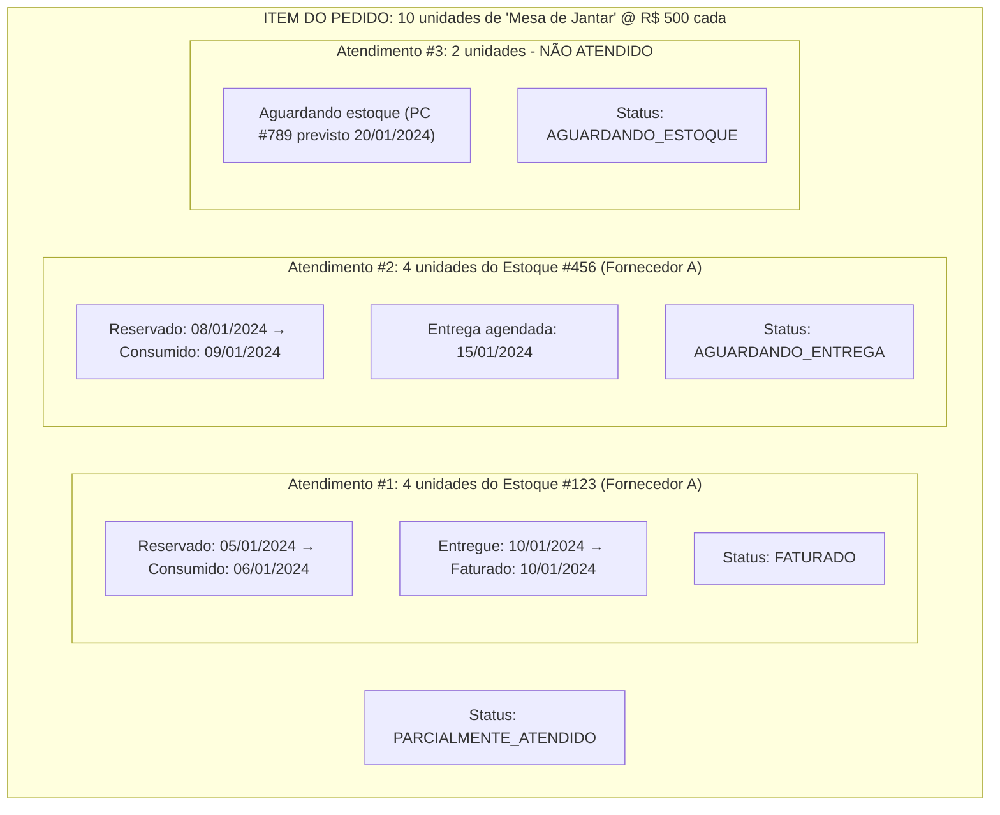
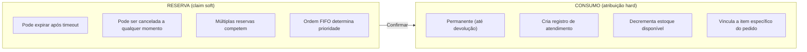
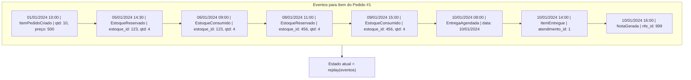
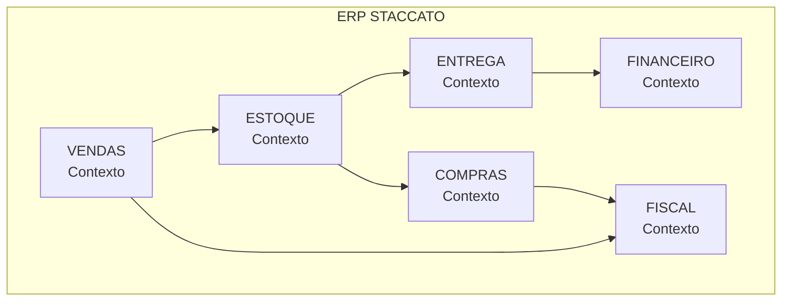
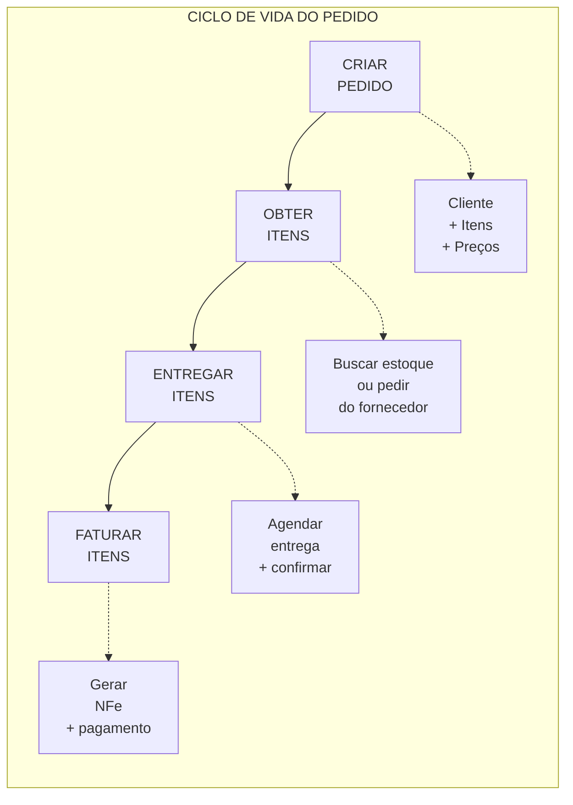

# Design Greenfield de Fluxo de Negócio

> Status: **Proposta de Design**
> Última atualização: 2025-12-27
> Filosofia: Simples, Confiável, Testável, Orientado a Eventos

---

## Sumário

1. [Filosofia de Design](#1-filosofia-de-design)
2. [Conceitos Principais](#2-conceitos-principais)
3. [Contextos Delimitados](#3-contextos-delimitados)
4. [Ciclo de Vida do Pedido](#4-ciclo-de-vida-do-pedido)
5. [Gestão de Estoque](#5-gestão-de-estoque)
6. [Gestão de Entregas](#6-gestão-de-entregas)
7. [Fiscal e Financeiro](#7-fiscal-e-financeiro)
8. [Máquinas de Estado](#8-máquinas-de-estado)
9. [Arquitetura de Eventos](#9-arquitetura-de-eventos)
10. [Schema de Banco de Dados](#10-schema-de-banco-de-dados)
11. [Estratégia de Testes](#11-estratégia-de-testes)
12. [Funcionalidades Avançadas](#12-funcionalidades-avançadas)

---

## 1. Filosofia de Design

### 1.1 Princípios Orientadores

| Princípio                     | Significado                                     |
| ----------------------------- | ----------------------------------------------- |
| **Explícito sobre implícito** | Todo estado e transição é nomeado e documentado |
| **Eventos sobre mutações**    | Mudanças de estado são eventos, não updates     |
| **Derivado sobre duplicado**  | Calcular valores, não armazenar cópias          |
| **Constraints no schema**     | Banco de dados impõe regras, não apenas código  |
| **Responsabilidade única**    | Cada entidade faz UMA coisa bem                 |
| **Testável por design**       | Funções puras, sem dependências ocultas         |

### 1.2 O Que Estamos Evitando

| Evitar                                      |
| ------------------------------------------- |
| Strings mágicas para status                 |
| Estado mutável sem histórico                |
| Tabelas divididas (padrão L1/L2)            |
| Dados desnormalizados                       |
| Lógica de negócio em controllers            |
| Transições de estado implícitas             |
| Condicionais complexas espalhadas no código |

### 1.3 O Que Estamos Abraçando

| Adotar                                       |
| -------------------------------------------- |
| Enums para todos os status                   |
| Event sourcing para trilha de auditoria      |
| Tabela única com registros de atendimento    |
| Referências normalizadas (FKs em todo lugar) |
| Serviços de domínio para lógica de negócio   |
| Máquinas de estado com guards explícitos     |
| Regras de negócio centralizadas              |

---

## 2. Conceitos Principais

### 2.1 O Modelo de Atendimento (Fulfillment)

**O Grande Insight**: Um item de pedido não "divide" - ele é **atendido** em partes.



**Por que isso é melhor:**

| Sistema Atual                        | Modelo de Atendimento              |
| ------------------------------------ | ---------------------------------- |
| Um item vira 3 itens divididos       | Um item com 3 atendimentos         |
| idRelacionado para rastrear divisões | Simples relacionamento pai-filho   |
| Status em cada item dividido         | Status derivado dos atendimentos   |
| Difícil ver "o que o cliente pediu?" | Item do pedido é registro prístino |
| Queries complexas para agregar       | Agregação simples                  |

### 2.2 Reserva vs Consumo



### 2.3 Eventos como Fonte da Verdade

Ao invés de atualizar campos de status, registramos eventos:



---

## 3. Contextos Delimitados

### 3.1 Mapa de Contextos



### 3.2 Responsabilidades dos Contextos

| Contexto       | Possui                                  | Publica Eventos                                     |
| -------------- | --------------------------------------- | --------------------------------------------------- |
| **Vendas**     | Pedidos, Itens, Clientes                | PedidoCriado, ItemAdicionado, PedidoCancelado       |
| **Estoque**    | Estoques, Reservas, Consumos            | EstoqueRecebido, EstoqueReservado, EstoqueConsumido |
| **Compras**    | Pedidos de Compra, Pedidos a Fornecedor | PCCriado, PCRecebido                                |
| **Entrega**    | Agendamentos, Rotas, Confirmações       | EntregaAgendada, EntregaConcluída                   |
| **Fiscal**     | NFe, Impostos                           | NotaGerada, NotaAutorizada                          |
| **Financeiro** | Pagamentos, Comissões                   | PagamentoRecebido, ComissãoPaga                     |

### 3.3 Comunicação Entre Contextos

Contextos comunicam via **eventos**, não chamadas diretas:

```php
// Contexto de Vendas publica
event(new ItemPedidoAtendido($atendimento));

// Contexto de Entrega escuta
class AgendarEntregaNoAtendimento
{
    public function handle(ItemPedidoAtendido $event)
    {
        // Auto-agendar entrega se todos os itens prontos
    }
}

// Contexto Fiscal escuta
class GerarNotaNaEntrega
{
    public function handle(EntregaConcluida $event)
    {
        // Gerar NFe para itens entregues
    }
}
```

---

## 4. Ciclo de Vida do Pedido

### 4.1 Fluxo Simplificado



### 4.2 Entidade Pedido

```php
class Order
{
    // Identidade
    public int $id;
    public string $code;              // "V-2024-00001"

    // Relacionamentos
    public int $customer_id;
    public ?int $seller_id;

    // Tempo
    public Carbon $created_at;
    public ?Carbon $closed_at;

    // Status derivado (calculado dos itens)
    public function status(): OrderStatus
    {
        $itemStatuses = $this->items->pluck('status');

        if ($itemStatuses->every(fn($s) => $s === ItemStatus::INVOICED)) {
            return OrderStatus::COMPLETED;
        }
        if ($itemStatuses->contains(ItemStatus::PENDING)) {
            return OrderStatus::IN_PROGRESS;
        }
        // ... etc
    }

    // Totais derivados
    public function totalAmount(): Money
    {
        return $this->items->sum(fn($i) => $i->totalPrice());
    }
}
```

### 4.3 Entidade Item do Pedido

```php
class OrderItem
{
    // Identidade
    public int $id;
    public int $order_id;

    // O que foi pedido (imutável após criação)
    public int $product_id;
    public int $quantity;
    public Money $unit_price;
    public Decimal $discount_percent;

    // Status derivado dos atendimentos
    public function status(): ItemStatus
    {
        $fulfilled = $this->fulfillments->sum('quantity');
        $delivered = $this->fulfillments
            ->where('status', FulfillmentStatus::DELIVERED)
            ->sum('quantity');
        $invoiced = $this->fulfillments
            ->where('status', FulfillmentStatus::INVOICED)
            ->sum('quantity');

        if ($invoiced === $this->quantity) return ItemStatus::INVOICED;
        if ($delivered === $this->quantity) return ItemStatus::DELIVERED;
        if ($fulfilled === $this->quantity) return ItemStatus::FULFILLED;
        if ($fulfilled > 0) return ItemStatus::PARTIALLY_FULFILLED;
        return ItemStatus::PENDING;
    }

    // Quanto ainda precisa ser obtido?
    public function pendingQuantity(): int
    {
        return $this->quantity - $this->fulfillments->sum('quantity');
    }
}
```

### 4.4 Entidade Atendimento (Fulfillment)

```php
class Fulfillment
{
    // Identidade
    public int $id;
    public int $order_item_id;

    // Origem
    public int $stock_id;           // Qual entrada de estoque
    public int $quantity;           // Quantas unidades

    // Status
    public FulfillmentStatus $status;

    // Rastreamento
    public ?int $delivery_id;       // Qual entrega
    public ?int $invoice_item_id;   // Qual linha da nota

    // Timestamps
    public Carbon $created_at;      // Quando reservado/consumido
    public ?Carbon $delivered_at;
    public ?Carbon $invoiced_at;
}

enum FulfillmentStatus: string
{
    case RESERVED = 'reserved';           // Estoque reservado, ainda não separado
    case READY = 'ready';                 // Separado, pronto para entrega
    case IN_TRANSIT = 'in_transit';       // Saiu para entrega
    case DELIVERED = 'delivered';         // Cliente recebeu
    case INVOICED = 'invoiced';           // NFe gerada
    case RETURNED = 'returned';           // Cliente devolveu
}
```

---

## 5. Gestão de Estoque

### 5.1 Entidade Entrada de Estoque

```php
class StockEntry
{
    // Identidade
    public int $id;
    public int $product_id;
    public int $supplier_id;

    // Rastreamento de quantidade
    public int $quantity_received;      // Quantidade original
    public int $quantity_reserved;      // Claims soft (podem expirar)
    public int $quantity_consumed;      // Atribuições hard

    // Derivado
    public function quantityAvailable(): int
    {
        return $this->quantity_received
             - $this->quantity_reserved
             - $this->quantity_consumed;
    }

    // Origem
    public ?int $purchase_order_item_id;
    public ?int $nfe_item_id;           // NFe que criou este estoque

    // Ordenação FIFO
    public Carbon $received_at;         // Quando estoque chegou

    // Localização
    public ?string $warehouse_block;    // "A-01", "B-03", etc.
}
```

### 5.2 O Algoritmo FIFO

```php
class StockReservationService
{
    /**
     * Reservar estoque para um item de pedido usando FIFO.
     * Retorna lista de reservas feitas.
     */
    public function reserveForItem(OrderItem $item): Collection
    {
        $needed = $item->pendingQuantity();
        $reservations = collect();

        // Buscar estoque disponível, mais antigo primeiro
        $stocks = StockEntry::query()
            ->where('product_id', $item->product_id)
            ->whereRaw('quantity_available() > 0')
            ->orderBy('received_at', 'asc')  // FIFO
            ->lockForUpdate()                 // Prevenir condições de corrida
            ->get();

        foreach ($stocks as $stock) {
            if ($needed <= 0) break;

            $take = min($needed, $stock->quantityAvailable());

            // Criar reserva
            $reservation = Reservation::create([
                'stock_entry_id' => $stock->id,
                'order_item_id' => $item->id,
                'quantity' => $take,
                'expires_at' => now()->addHours(24),
            ]);

            // Atualizar contadores do estoque
            $stock->increment('quantity_reserved', $take);

            $reservations->push($reservation);
            $needed -= $take;

            event(new StockReserved($reservation));
        }

        if ($needed > 0) {
            event(new InsufficientStock($item, $needed));
        }

        return $reservations;
    }
}
```

### 5.3 Reserva → Consumo

```php
class StockConsumptionService
{
    /**
     * Converter reserva em consumo permanente.
     * Chamado quando pedido é confirmado / itens separados.
     */
    public function consumeReservation(Reservation $reservation): Fulfillment
    {
        DB::transaction(function () use ($reservation, &$fulfillment) {
            $stock = $reservation->stockEntry;

            // Mover de reservado para consumido
            $stock->decrement('quantity_reserved', $reservation->quantity);
            $stock->increment('quantity_consumed', $reservation->quantity);

            // Criar registro de atendimento
            $fulfillment = Fulfillment::create([
                'order_item_id' => $reservation->order_item_id,
                'stock_id' => $stock->id,
                'quantity' => $reservation->quantity,
                'status' => FulfillmentStatus::READY,
            ]);

            // Deletar reserva
            $reservation->delete();

            event(new StockConsumed($fulfillment));
        });

        return $fulfillment;
    }
}
```

### 5.4 Devolução de Estoque

```php
class StockReturnService
{
    public function processReturn(Fulfillment $fulfillment, int $quantity, string $reason): StockReturn
    {
        return DB::transaction(function () use ($fulfillment, $quantity, $reason) {
            // Atualizar atendimento
            if ($quantity === $fulfillment->quantity) {
                $fulfillment->update(['status' => FulfillmentStatus::RETURNED]);
            } else {
                // Devolução parcial - dividir atendimento
                $fulfillment->decrement('quantity', $quantity);
                Fulfillment::create([
                    'order_item_id' => $fulfillment->order_item_id,
                    'stock_id' => $fulfillment->stock_id,
                    'quantity' => $quantity,
                    'status' => FulfillmentStatus::RETURNED,
                ]);
            }

            // Criar registro de devolução
            $return = StockReturn::create([
                'fulfillment_id' => $fulfillment->id,
                'stock_entry_id' => $fulfillment->stock_id,
                'quantity' => $quantity,
                'reason' => $reason,
                'restock' => $this->canRestock($reason),
            ]);

            // Se restockável, adicionar de volta ao disponível
            if ($return->restock) {
                $fulfillment->stockEntry->decrement('quantity_consumed', $quantity);
                event(new StockRestocked($return));
            }

            event(new ItemReturned($return));

            return $return;
        });
    }
}
```

---

## 6. Gestão de Entregas

### 6.1 Entidade Entrega

```php
class Delivery
{
    public int $id;
    public Carbon $scheduled_date;
    public ?Carbon $completed_at;

    public int $customer_id;
    public int $carrier_id;              // Transportadora
    public ?int $driver_id;

    public DeliveryStatus $status;
    public ?string $notes;

    // Endereço (snapshot no momento da entrega)
    public Address $delivery_address;

    // Relacionamentos
    public function fulfillments(): HasMany
    {
        return $this->hasMany(Fulfillment::class);
    }

    // Derivado dos atendimentos
    public function orders(): Collection
    {
        return $this->fulfillments
            ->map(fn($f) => $f->orderItem->order)
            ->unique('id');
    }
}

enum DeliveryStatus: string
{
    case SCHEDULED = 'scheduled';
    case LOADING = 'loading';
    case IN_TRANSIT = 'in_transit';
    case COMPLETED = 'completed';
    case FAILED = 'failed';           // Não conseguiu entregar
    case PARTIAL = 'partial';         // Alguns itens recusados
}
```

### 6.2 Serviço de Agendamento de Entrega

```php
class DeliverySchedulingService
{
    public function scheduleDelivery(
        Collection $fulfillments,
        Carbon $date,
        int $carrierId
    ): Delivery {
        // Validar que todos os atendimentos estão prontos
        $notReady = $fulfillments->filter(
            fn($f) => $f->status !== FulfillmentStatus::READY
        );

        if ($notReady->isNotEmpty()) {
            throw new FulfillmentsNotReadyException($notReady);
        }

        // Todos os atendimentos devem ser do mesmo cliente
        $customerIds = $fulfillments
            ->map(fn($f) => $f->orderItem->order->customer_id)
            ->unique();

        if ($customerIds->count() > 1) {
            throw new MultipleCustomersException();
        }

        return DB::transaction(function () use ($fulfillments, $date, $carrierId) {
            $customer = $fulfillments->first()->orderItem->order->customer;

            $delivery = Delivery::create([
                'scheduled_date' => $date,
                'customer_id' => $customer->id,
                'carrier_id' => $carrierId,
                'status' => DeliveryStatus::SCHEDULED,
                'delivery_address' => $customer->deliveryAddress(),
            ]);

            $fulfillments->each(function ($f) use ($delivery) {
                $f->update([
                    'delivery_id' => $delivery->id,
                    'status' => FulfillmentStatus::IN_TRANSIT,
                ]);
            });

            event(new DeliveryScheduled($delivery));

            return $delivery;
        });
    }
}
```

### 6.3 Confirmação de Entrega

```php
class DeliveryConfirmationService
{
    public function confirmDelivery(
        Delivery $delivery,
        Collection $confirmedFulfillmentIds,
        ?string $notes = null
    ): void {
        DB::transaction(function () use ($delivery, $confirmedFulfillmentIds, $notes) {
            $allFulfillments = $delivery->fulfillments;
            $confirmed = $allFulfillments->whereIn('id', $confirmedFulfillmentIds);
            $refused = $allFulfillments->whereNotIn('id', $confirmedFulfillmentIds);

            // Marcar itens confirmados como entregues
            $confirmed->each(function ($f) {
                $f->update([
                    'status' => FulfillmentStatus::DELIVERED,
                    'delivered_at' => now(),
                ]);
                event(new ItemDelivered($f));
            });

            // Tratar itens recusados
            $refused->each(function ($f) {
                $f->update(['status' => FulfillmentStatus::RETURNED]);
                event(new ItemRefused($f));
            });

            // Atualizar status da entrega
            $delivery->update([
                'status' => $refused->isEmpty()
                    ? DeliveryStatus::COMPLETED
                    : DeliveryStatus::PARTIAL,
                'completed_at' => now(),
                'notes' => $notes,
            ]);

            event(new DeliveryCompleted($delivery));
        });
    }
}
```

---

## 7. Fiscal e Financeiro

### 7.1 Geração de Nota Fiscal

```php
class InvoiceService
{
    public function generateForDelivery(Delivery $delivery): Invoice
    {
        // Apenas faturar itens entregues
        $deliveredFulfillments = $delivery->fulfillments
            ->where('status', FulfillmentStatus::DELIVERED);

        if ($deliveredFulfillments->isEmpty()) {
            throw new NoItemsToInvoiceException();
        }

        // Agrupar por pedido para faturamento correto
        $byOrder = $deliveredFulfillments->groupBy(
            fn($f) => $f->orderItem->order_id
        );

        return DB::transaction(function () use ($byOrder, $delivery) {
            $invoice = Invoice::create([
                'customer_id' => $delivery->customer_id,
                'delivery_id' => $delivery->id,
                'status' => InvoiceStatus::DRAFT,
                'issue_date' => now(),
            ]);

            foreach ($byOrder as $orderId => $fulfillments) {
                foreach ($fulfillments as $fulfillment) {
                    $item = $fulfillment->orderItem;

                    $invoiceItem = $invoice->items()->create([
                        'product_id' => $item->product_id,
                        'quantity' => $fulfillment->quantity,
                        'unit_price' => $item->unit_price,
                        'discount_percent' => $item->discount_percent,
                        'fulfillment_id' => $fulfillment->id,
                    ]);

                    $fulfillment->update([
                        'invoice_item_id' => $invoiceItem->id,
                        'status' => FulfillmentStatus::INVOICED,
                        'invoiced_at' => now(),
                    ]);
                }
            }

            // Calcular impostos
            $this->taxCalculator->calculate($invoice);

            event(new InvoiceCreated($invoice));

            return $invoice;
        });
    }
}
```

### 7.2 Integração NFe

```php
interface NFeGateway
{
    public function transmit(Invoice $invoice): NFeResult;
    public function checkStatus(string $chave): NFeStatus;
    public function cancel(Invoice $invoice, string $justificativa): NFeResult;
}

class NFeService
{
    public function __construct(
        private NFeGateway $gateway,
        private NFeXmlBuilder $xmlBuilder
    ) {}

    public function authorize(Invoice $invoice): void
    {
        // Construir XML
        $xml = $this->xmlBuilder->build($invoice);

        // Transmitir ao SEFAZ
        $result = $this->gateway->transmit($invoice);

        if ($result->isAuthorized()) {
            $invoice->update([
                'status' => InvoiceStatus::AUTHORIZED,
                'nfe_chave' => $result->chave,
                'nfe_protocolo' => $result->protocolo,
                'authorized_at' => now(),
            ]);

            event(new NFeAuthorized($invoice));

            // Gerar boletos
            $this->paymentService->generateBoletos($invoice);
        } else {
            $invoice->update([
                'status' => InvoiceStatus::REJECTED,
                'nfe_motivo_rejeicao' => $result->motivo,
            ]);

            event(new NFeRejected($invoice, $result->motivo));
        }
    }
}
```

### 7.3 Rastreamento de Pagamentos

```php
class Payment
{
    public int $id;
    public int $invoice_id;

    public PaymentMethod $method;       // BOLETO, PIX, CARTAO, etc.
    public Money $amount;
    public Carbon $due_date;
    public ?Carbon $paid_at;

    public PaymentStatus $status;

    // Para boleto
    public ?string $boleto_linha_digitavel;
    public ?string $boleto_nosso_numero;
}

class PaymentService
{
    public function recordPayment(Payment $payment, Carbon $paidAt): void
    {
        $payment->update([
            'status' => PaymentStatus::PAID,
            'paid_at' => $paidAt,
        ]);

        event(new PaymentReceived($payment));

        // Verificar se nota está totalmente paga
        $invoice = $payment->invoice;
        if ($invoice->isFullyPaid()) {
            event(new InvoiceFullyPaid($invoice));

            // Disparar cálculo de comissão
            $this->commissionService->calculateFor($invoice);
        }
    }
}
```

### 7.4 Cálculo de Comissão

```php
class CommissionService
{
    public function calculateFor(Invoice $invoice): Commission
    {
        // Apenas calcular após pagamento recebido
        if (!$invoice->isFullyPaid()) {
            throw new InvoiceNotPaidException();
        }

        $seller = $invoice->delivery->fulfillments
            ->first()
            ->orderItem
            ->order
            ->seller;

        // Obter taxa de comissão (do fornecedor ou vendedor)
        $rate = $this->getCommissionRate($invoice);

        $commission = Commission::create([
            'invoice_id' => $invoice->id,
            'seller_id' => $seller->id,
            'base_amount' => $invoice->total_amount,
            'rate_percent' => $rate,
            'commission_amount' => $invoice->total_amount->multiply($rate / 100),
            'status' => CommissionStatus::PENDING,
        ]);

        event(new CommissionCalculated($commission));

        return $commission;
    }
}
```

---

## 8. Máquinas de Estado

### 8.1 Máquina de Estado do Item do Pedido

```php
use Spatie\ModelStates\State;
use Spatie\ModelStates\StateConfig;

abstract class ItemState extends State
{
    abstract public function color(): string;
    abstract public function label(): string;
}

class Pending extends ItemState
{
    public function color(): string => 'gray';
    public function label(): string => 'Pendente';

    public function canTransitionTo(string $state): bool
    {
        return in_array($state, [
            PartiallyFulfilled::class,
            Fulfilled::class,
            Cancelled::class,
        ]);
    }
}

class PartiallyFulfilled extends ItemState
{
    public function color(): string => 'yellow';
    public function label(): string => 'Parcialmente Atendido';
}

class Fulfilled extends ItemState
{
    public function color(): string => 'blue';
    public function label(): string => 'Atendido';
}

class Delivered extends ItemState
{
    public function color(): string => 'green';
    public function label(): string => 'Entregue';
}

class Invoiced extends ItemState
{
    public function color(): string => 'emerald';
    public function label(): string => 'Faturado';

    // Estado final - sem transições de saída
    public function canTransitionTo(string $state): bool
    {
        return false;
    }
}
```

### 8.2 Configuração da Máquina de Estado

```php
class OrderItem extends Model
{
    protected $casts = [
        'status' => ItemState::class,
    ];

    public static function boot()
    {
        parent::boot();

        // Recalcular status quando atendimentos mudam
        static::updated(function ($item) {
            $item->recalculateStatus();
        });
    }

    public function recalculateStatus(): void
    {
        $newStatus = $this->calculateStatusFromFulfillments();

        if ($this->status::class !== $newStatus) {
            $this->status->transitionTo($newStatus);
        }
    }

    private function calculateStatusFromFulfillments(): string
    {
        $fulfilled = $this->fulfillments->sum('quantity');
        $invoiced = $this->fulfillments
            ->where('status', FulfillmentStatus::INVOICED)
            ->sum('quantity');

        return match (true) {
            $invoiced >= $this->quantity => Invoiced::class,
            $this->fulfillments->every(fn($f) => $f->isDelivered()) => Delivered::class,
            $fulfilled >= $this->quantity => Fulfilled::class,
            $fulfilled > 0 => PartiallyFulfilled::class,
            default => Pending::class,
        };
    }
}
```

### 8.3 Guards de Transição de Estado

```php
class FulfillmentStateMachine
{
    public function canTransition(Fulfillment $f, FulfillmentStatus $to): bool
    {
        return match ([$f->status, $to]) {
            // De RESERVED
            [FulfillmentStatus::RESERVED, FulfillmentStatus::READY] => true,
            [FulfillmentStatus::RESERVED, FulfillmentStatus::RETURNED] => true,

            // De READY
            [FulfillmentStatus::READY, FulfillmentStatus::IN_TRANSIT] =>
                $f->delivery_id !== null,

            // De IN_TRANSIT
            [FulfillmentStatus::IN_TRANSIT, FulfillmentStatus::DELIVERED] => true,
            [FulfillmentStatus::IN_TRANSIT, FulfillmentStatus::RETURNED] => true,

            // De DELIVERED
            [FulfillmentStatus::DELIVERED, FulfillmentStatus::INVOICED] =>
                $f->invoice_item_id !== null,
            [FulfillmentStatus::DELIVERED, FulfillmentStatus::RETURNED] => true,

            // INVOICED é terminal
            [FulfillmentStatus::INVOICED, $_] => false,

            // RETURNED é terminal
            [FulfillmentStatus::RETURNED, $_] => false,

            default => false,
        };
    }

    public function transition(Fulfillment $f, FulfillmentStatus $to): void
    {
        if (!$this->canTransition($f, $to)) {
            throw new InvalidStateTransition($f->status, $to);
        }

        $from = $f->status;
        $f->update(['status' => $to]);

        event(new FulfillmentTransitioned($f, $from, $to));
    }
}
```

---

## 9. Arquitetura de Eventos

### 9.1 Eventos Principais

```php
// Eventos de Vendas
class OrderCreated { public Order $order; }
class OrderItemAdded { public OrderItem $item; }
class OrderCancelled { public Order $order; public string $reason; }

// Eventos de Estoque
class StockReceived { public StockEntry $stock; }
class StockReserved { public Reservation $reservation; }
class StockConsumed { public Fulfillment $fulfillment; }
class StockRestocked { public StockReturn $return; }
class InsufficientStock { public OrderItem $item; public int $needed; }

// Eventos de Entrega
class DeliveryScheduled { public Delivery $delivery; }
class DeliveryCompleted { public Delivery $delivery; }
class ItemDelivered { public Fulfillment $fulfillment; }
class ItemRefused { public Fulfillment $fulfillment; }

// Eventos Fiscais
class InvoiceCreated { public Invoice $invoice; }
class NFeAuthorized { public Invoice $invoice; }
class NFeRejected { public Invoice $invoice; public string $reason; }

// Eventos Financeiros
class PaymentReceived { public Payment $payment; }
class InvoiceFullyPaid { public Invoice $invoice; }
class CommissionCalculated { public Commission $commission; }
```

### 9.2 Event Listeners (Orquestração)

```php
// config/events.php
return [
    OrderCreated::class => [
        AutoReserveStockListener::class,
        NotifySellerListener::class,
    ],

    StockConsumed::class => [
        CheckOrderReadyForDeliveryListener::class,
    ],

    DeliveryCompleted::class => [
        AutoGenerateInvoiceListener::class,
        UpdateOrderStatusListener::class,
    ],

    NFeAuthorized::class => [
        GenerateBoletosListener::class,
        SendInvoiceToCustomerListener::class,
    ],

    PaymentReceived::class => [
        CalculateCommissionListener::class,
        UpdateInvoiceStatusListener::class,
    ],
];
```

### 9.3 Event Store (Trilha de Auditoria)

```php
class EventStore extends Model
{
    protected $table = 'event_store';

    protected $casts = [
        'payload' => 'array',
        'metadata' => 'array',
    ];
}

class StoreEventListener
{
    public function handle(object $event): void
    {
        EventStore::create([
            'event_type' => get_class($event),
            'aggregate_type' => $this->getAggregateType($event),
            'aggregate_id' => $this->getAggregateId($event),
            'payload' => $this->serialize($event),
            'metadata' => [
                'user_id' => auth()->id(),
                'ip_address' => request()->ip(),
                'user_agent' => request()->userAgent(),
            ],
            'occurred_at' => now(),
        ]);
    }
}

// Registrar para todos os eventos
Event::listen('*', StoreEventListener::class);
```

---

## 10. Schema de Banco de Dados

### 10.1 Tabelas Principais

```sql
-- ENUMS
CREATE TYPE order_status AS ENUM ('draft', 'confirmed', 'in_progress', 'completed', 'cancelled');
CREATE TYPE item_status AS ENUM ('pending', 'partially_fulfilled', 'fulfilled', 'delivered', 'invoiced', 'cancelled');
CREATE TYPE fulfillment_status AS ENUM ('reserved', 'ready', 'in_transit', 'delivered', 'invoiced', 'returned');
CREATE TYPE delivery_status AS ENUM ('scheduled', 'loading', 'in_transit', 'completed', 'failed', 'partial');
CREATE TYPE invoice_status AS ENUM ('draft', 'pending', 'authorized', 'rejected', 'cancelled');
CREATE TYPE payment_status AS ENUM ('pending', 'paid', 'overdue', 'cancelled');

-- PEDIDOS
CREATE TABLE orders (
    id SERIAL PRIMARY KEY,
    code VARCHAR(20) UNIQUE NOT NULL,
    customer_id INTEGER NOT NULL REFERENCES customers(id),
    seller_id INTEGER REFERENCES users(id),
    status order_status NOT NULL DEFAULT 'draft',
    notes TEXT,
    created_at TIMESTAMP NOT NULL DEFAULT NOW(),
    confirmed_at TIMESTAMP,
    closed_at TIMESTAMP
);

CREATE TABLE order_items (
    id SERIAL PRIMARY KEY,
    order_id INTEGER NOT NULL REFERENCES orders(id),
    product_id INTEGER NOT NULL REFERENCES products(id),
    quantity INTEGER NOT NULL CHECK (quantity > 0),
    unit_price DECIMAL(10,2) NOT NULL,
    discount_percent DECIMAL(5,2) NOT NULL DEFAULT 0,
    status item_status NOT NULL DEFAULT 'pending',
    created_at TIMESTAMP NOT NULL DEFAULT NOW()
);

-- ESTOQUE
CREATE TABLE stock_entries (
    id SERIAL PRIMARY KEY,
    product_id INTEGER NOT NULL REFERENCES products(id),
    supplier_id INTEGER NOT NULL REFERENCES suppliers(id),
    quantity_received INTEGER NOT NULL,
    quantity_reserved INTEGER NOT NULL DEFAULT 0,
    quantity_consumed INTEGER NOT NULL DEFAULT 0,
    unit_cost DECIMAL(10,2),
    purchase_order_item_id INTEGER REFERENCES purchase_order_items(id),
    nfe_item_id INTEGER REFERENCES nfe_items(id),
    warehouse_block VARCHAR(10),
    received_at TIMESTAMP NOT NULL DEFAULT NOW(),

    -- Quantidade disponível calculada
    CONSTRAINT valid_quantities CHECK (
        quantity_reserved >= 0 AND
        quantity_consumed >= 0 AND
        quantity_received >= quantity_reserved + quantity_consumed
    )
);

CREATE TABLE reservations (
    id SERIAL PRIMARY KEY,
    stock_entry_id INTEGER NOT NULL REFERENCES stock_entries(id),
    order_item_id INTEGER NOT NULL REFERENCES order_items(id),
    quantity INTEGER NOT NULL CHECK (quantity > 0),
    expires_at TIMESTAMP NOT NULL,
    created_at TIMESTAMP NOT NULL DEFAULT NOW()
);

CREATE TABLE fulfillments (
    id SERIAL PRIMARY KEY,
    order_item_id INTEGER NOT NULL REFERENCES order_items(id),
    stock_entry_id INTEGER NOT NULL REFERENCES stock_entries(id),
    quantity INTEGER NOT NULL CHECK (quantity > 0),
    status fulfillment_status NOT NULL DEFAULT 'reserved',
    delivery_id INTEGER REFERENCES deliveries(id),
    invoice_item_id INTEGER REFERENCES invoice_items(id),
    created_at TIMESTAMP NOT NULL DEFAULT NOW(),
    delivered_at TIMESTAMP,
    invoiced_at TIMESTAMP
);

-- ENTREGAS
CREATE TABLE deliveries (
    id SERIAL PRIMARY KEY,
    customer_id INTEGER NOT NULL REFERENCES customers(id),
    carrier_id INTEGER NOT NULL REFERENCES carriers(id),
    driver_id INTEGER REFERENCES users(id),
    scheduled_date DATE NOT NULL,
    status delivery_status NOT NULL DEFAULT 'scheduled',

    -- Snapshot do endereço
    delivery_street VARCHAR(200) NOT NULL,
    delivery_number VARCHAR(20),
    delivery_complement VARCHAR(100),
    delivery_neighborhood VARCHAR(100),
    delivery_city VARCHAR(100) NOT NULL,
    delivery_state CHAR(2) NOT NULL,
    delivery_zip VARCHAR(9) NOT NULL,

    notes TEXT,
    created_at TIMESTAMP NOT NULL DEFAULT NOW(),
    completed_at TIMESTAMP
);

-- NOTAS FISCAIS
CREATE TABLE invoices (
    id SERIAL PRIMARY KEY,
    customer_id INTEGER NOT NULL REFERENCES customers(id),
    delivery_id INTEGER REFERENCES deliveries(id),
    status invoice_status NOT NULL DEFAULT 'draft',

    -- Dados NFe
    nfe_numero INTEGER,
    nfe_serie INTEGER,
    nfe_chave VARCHAR(44) UNIQUE,
    nfe_protocolo VARCHAR(20),
    nfe_xml TEXT,

    -- Totais
    total_produtos DECIMAL(10,2) NOT NULL DEFAULT 0,
    total_frete DECIMAL(10,2) NOT NULL DEFAULT 0,
    total_desconto DECIMAL(10,2) NOT NULL DEFAULT 0,
    total_impostos DECIMAL(10,2) NOT NULL DEFAULT 0,
    total_nota DECIMAL(10,2) NOT NULL DEFAULT 0,

    issue_date DATE,
    authorized_at TIMESTAMP,
    created_at TIMESTAMP NOT NULL DEFAULT NOW()
);

CREATE TABLE invoice_items (
    id SERIAL PRIMARY KEY,
    invoice_id INTEGER NOT NULL REFERENCES invoices(id),
    product_id INTEGER NOT NULL REFERENCES products(id),
    fulfillment_id INTEGER NOT NULL REFERENCES fulfillments(id),
    quantity INTEGER NOT NULL,
    unit_price DECIMAL(10,2) NOT NULL,
    discount_percent DECIMAL(5,2) NOT NULL DEFAULT 0,
    total DECIMAL(10,2) NOT NULL
);

-- PAGAMENTOS
CREATE TABLE payments (
    id SERIAL PRIMARY KEY,
    invoice_id INTEGER NOT NULL REFERENCES invoices(id),
    method VARCHAR(20) NOT NULL,
    amount DECIMAL(10,2) NOT NULL,
    due_date DATE NOT NULL,
    status payment_status NOT NULL DEFAULT 'pending',

    -- Dados boleto
    boleto_linha_digitavel VARCHAR(47),
    boleto_nosso_numero VARCHAR(20),
    boleto_pdf_path VARCHAR(255),

    paid_at TIMESTAMP,
    created_at TIMESTAMP NOT NULL DEFAULT NOW()
);

-- EVENT STORE
CREATE TABLE event_store (
    id BIGSERIAL PRIMARY KEY,
    event_type VARCHAR(100) NOT NULL,
    aggregate_type VARCHAR(50) NOT NULL,
    aggregate_id INTEGER NOT NULL,
    payload JSONB NOT NULL,
    metadata JSONB,
    occurred_at TIMESTAMP NOT NULL DEFAULT NOW()
);

CREATE INDEX idx_events_aggregate ON event_store(aggregate_type, aggregate_id);
CREATE INDEX idx_events_type ON event_store(event_type);
CREATE INDEX idx_events_occurred ON event_store(occurred_at);
```

### 10.2 Views Úteis

```sql
-- Itens de pedido com resumo de atendimento
CREATE VIEW v_order_items_summary AS
SELECT
    oi.id,
    oi.order_id,
    oi.product_id,
    p.description as product_name,
    oi.quantity as ordered_qty,
    COALESCE(SUM(f.quantity) FILTER (WHERE f.status != 'returned'), 0) as fulfilled_qty,
    COALESCE(SUM(f.quantity) FILTER (WHERE f.status = 'delivered'), 0) as delivered_qty,
    COALESCE(SUM(f.quantity) FILTER (WHERE f.status = 'invoiced'), 0) as invoiced_qty,
    oi.quantity - COALESCE(SUM(f.quantity) FILTER (WHERE f.status != 'returned'), 0) as pending_qty,
    oi.status
FROM order_items oi
JOIN products p ON p.id = oi.product_id
LEFT JOIN fulfillments f ON f.order_item_id = oi.id
GROUP BY oi.id, p.description;

-- Estoque disponível por produto (ordem FIFO)
CREATE VIEW v_stock_available AS
SELECT
    se.id as stock_entry_id,
    se.product_id,
    p.description as product_name,
    s.razao_social as supplier_name,
    se.quantity_received - se.quantity_reserved - se.quantity_consumed as available,
    se.received_at,
    se.warehouse_block
FROM stock_entries se
JOIN products p ON p.id = se.product_id
JOIN suppliers s ON s.id = se.supplier_id
WHERE se.quantity_received > se.quantity_reserved + se.quantity_consumed
ORDER BY se.product_id, se.received_at;
```

---

## 11. Estratégia de Testes

### 11.1 Testes Unitários (Lógica de Negócio Pura)

```php
class StockReservationTest extends TestCase
{
    /** @test */
    public function it_reserves_stock_using_fifo()
    {
        // Arrange
        $oldStock = StockEntry::factory()->create([
            'quantity_received' => 5,
            'received_at' => now()->subDays(10),
        ]);
        $newStock = StockEntry::factory()->create([
            'quantity_received' => 5,
            'product_id' => $oldStock->product_id,
            'received_at' => now()->subDays(1),
        ]);

        $item = OrderItem::factory()->create([
            'product_id' => $oldStock->product_id,
            'quantity' => 7,
        ]);

        // Act
        $service = new StockReservationService();
        $reservations = $service->reserveForItem($item);

        // Assert
        $this->assertCount(2, $reservations);
        $this->assertEquals(5, $reservations[0]->quantity); // Todo o estoque antigo
        $this->assertEquals(2, $reservations[1]->quantity); // Parte do estoque novo
        $this->assertEquals($oldStock->id, $reservations[0]->stock_entry_id);
    }

    /** @test */
    public function it_fires_insufficient_stock_event_when_not_enough()
    {
        Event::fake([InsufficientStock::class]);

        $stock = StockEntry::factory()->create(['quantity_received' => 3]);
        $item = OrderItem::factory()->create([
            'product_id' => $stock->product_id,
            'quantity' => 10,
        ]);

        $service = new StockReservationService();
        $reservations = $service->reserveForItem($item);

        $this->assertEquals(3, $reservations->sum('quantity'));
        Event::assertDispatched(InsufficientStock::class, function ($e) {
            return $e->needed === 7;
        });
    }
}
```

### 11.2 Testes de Máquina de Estado

```php
class FulfillmentStateMachineTest extends TestCase
{
    /** @test */
    public function reserved_can_transition_to_ready()
    {
        $fulfillment = Fulfillment::factory()->create([
            'status' => FulfillmentStatus::RESERVED,
        ]);

        $sm = new FulfillmentStateMachine();

        $this->assertTrue($sm->canTransition($fulfillment, FulfillmentStatus::READY));
    }

    /** @test */
    public function in_transit_cannot_transition_to_ready()
    {
        $fulfillment = Fulfillment::factory()->create([
            'status' => FulfillmentStatus::IN_TRANSIT,
        ]);

        $sm = new FulfillmentStateMachine();

        $this->assertFalse($sm->canTransition($fulfillment, FulfillmentStatus::READY));
    }

    /** @test */
    public function invoiced_is_terminal_state()
    {
        $fulfillment = Fulfillment::factory()->create([
            'status' => FulfillmentStatus::INVOICED,
        ]);

        $sm = new FulfillmentStateMachine();

        foreach (FulfillmentStatus::cases() as $status) {
            $this->assertFalse($sm->canTransition($fulfillment, $status));
        }
    }
}
```

### 11.3 Testes de Integração (Fluxos Completos)

```php
class OrderToInvoiceFlowTest extends TestCase
{
    use RefreshDatabase;

    /** @test */
    public function complete_order_flow()
    {
        // Setup
        $customer = Customer::factory()->create();
        $product = Product::factory()->create();
        $supplier = Supplier::factory()->create();
        $carrier = Carrier::factory()->create();

        // Criar estoque
        $stock = StockEntry::factory()->create([
            'product_id' => $product->id,
            'supplier_id' => $supplier->id,
            'quantity_received' => 10,
        ]);

        // 1. Criar pedido
        $order = Order::create([
            'customer_id' => $customer->id,
            'status' => OrderStatus::CONFIRMED,
        ]);

        $item = $order->items()->create([
            'product_id' => $product->id,
            'quantity' => 5,
            'unit_price' => 100.00,
        ]);

        // 2. Reservar estoque
        $reservationService = app(StockReservationService::class);
        $reservations = $reservationService->reserveForItem($item);

        $this->assertEquals(5, $reservations->sum('quantity'));
        $this->assertEquals(5, $stock->fresh()->quantity_reserved);

        // 3. Consumir estoque
        $consumptionService = app(StockConsumptionService::class);
        $fulfillment = $consumptionService->consumeReservation($reservations->first());

        $this->assertEquals(FulfillmentStatus::READY, $fulfillment->status);
        $this->assertEquals(5, $stock->fresh()->quantity_consumed);
        $this->assertEquals(0, $stock->fresh()->quantity_reserved);

        // 4. Agendar entrega
        $deliveryService = app(DeliverySchedulingService::class);
        $delivery = $deliveryService->scheduleDelivery(
            collect([$fulfillment]),
            now()->addDay(),
            $carrier->id
        );

        $this->assertEquals(DeliveryStatus::SCHEDULED, $delivery->status);
        $this->assertEquals(FulfillmentStatus::IN_TRANSIT, $fulfillment->fresh()->status);

        // 5. Confirmar entrega
        $confirmationService = app(DeliveryConfirmationService::class);
        $confirmationService->confirmDelivery($delivery, [$fulfillment->id]);

        $this->assertEquals(DeliveryStatus::COMPLETED, $delivery->fresh()->status);
        $this->assertEquals(FulfillmentStatus::DELIVERED, $fulfillment->fresh()->status);

        // 6. Gerar nota
        $invoiceService = app(InvoiceService::class);
        $invoice = $invoiceService->generateForDelivery($delivery->fresh());

        $this->assertEquals(InvoiceStatus::DRAFT, $invoice->status);
        $this->assertEquals(500.00, $invoice->total_produtos);
        $this->assertEquals(FulfillmentStatus::INVOICED, $fulfillment->fresh()->status);

        // 7. Verificar status do pedido
        $this->assertEquals(ItemStatus::INVOICED, $item->fresh()->status());
        $this->assertEquals(OrderStatus::COMPLETED, $order->fresh()->status());
    }
}
```

### 11.4 Testes Orientados a Eventos

```php
class EventFlowTest extends TestCase
{
    /** @test */
    public function delivery_completion_triggers_invoice_generation()
    {
        Event::fake([InvoiceCreated::class]);

        $delivery = Delivery::factory()
            ->has(Fulfillment::factory()->count(3)->state([
                'status' => FulfillmentStatus::IN_TRANSIT,
            ]))
            ->create();

        // Simular conclusão de entrega
        $service = app(DeliveryConfirmationService::class);
        $service->confirmDelivery(
            $delivery,
            $delivery->fulfillments->pluck('id')->toArray()
        );

        // AutoGenerateInvoiceListener deve disparar
        Event::assertDispatched(InvoiceCreated::class);
    }
}
```

---

## 12. Funcionalidades Avançadas

### 12.1 Tratamento de Entrega Parcial

```php
class PartialDeliveryService
{
    public function handlePartialDelivery(
        Delivery $delivery,
        array $deliveredFulfillmentIds,
        string $reason
    ): void {
        DB::transaction(function () use ($delivery, $deliveredFulfillmentIds, $reason) {
            $allFulfillments = $delivery->fulfillments;
            $delivered = $allFulfillments->whereIn('id', $deliveredFulfillmentIds);
            $refused = $allFulfillments->whereNotIn('id', $deliveredFulfillmentIds);

            // Marcar itens entregues
            $delivered->each(fn($f) => $f->update([
                'status' => FulfillmentStatus::DELIVERED,
                'delivered_at' => now(),
            ]));

            // Tratar itens recusados - criar nova tentativa de entrega
            if ($refused->isNotEmpty()) {
                $newDelivery = Delivery::create([
                    'customer_id' => $delivery->customer_id,
                    'carrier_id' => $delivery->carrier_id,
                    'scheduled_date' => now()->addDays(3),
                    'status' => DeliveryStatus::SCHEDULED,
                    'notes' => "Tentativa: {$reason}",
                ]);

                $refused->each(fn($f) => $f->update([
                    'delivery_id' => $newDelivery->id,
                    'status' => FulfillmentStatus::READY, // Reset para pronto
                ]));
            }

            $delivery->update([
                'status' => DeliveryStatus::PARTIAL,
                'completed_at' => now(),
                'notes' => $reason,
            ]);
        });
    }
}
```

### 12.2 Múltiplos Fornecedores para Mesmo Produto

```php
// O modelo de atendimento naturalmente lida com isso
// Um item de pedido pode ter atendimentos de diferentes entradas de estoque (fornecedores)

$item = OrderItem::find(1);

// Atendimentos mostram a origem
$item->fulfillments->each(function ($f) {
    echo "{$f->quantity} de {$f->stockEntry->supplier->name}";
});

// Saída:
// 3 de Fornecedor A
// 2 de Fornecedor B
// 5 de Fornecedor C
```

### 12.3 Gestão de Backorder

```php
class BackorderService
{
    public function handleInsufficientStock(InsufficientStock $event): void
    {
        // Buscar ou criar pedido de compra para este produto
        $po = PurchaseOrder::firstOrCreate(
            [
                'supplier_id' => $event->item->product->default_supplier_id,
                'status' => POStatus::DRAFT,
            ],
            [
                'expected_date' => now()->addDays(14),
            ]
        );

        // Adicionar item ao PC
        $po->items()->create([
            'product_id' => $event->item->product_id,
            'quantity' => $event->needed,
            'linked_order_item_id' => $event->item->id, // Rastrear relacionamento
        ]);

        // Marcar item do pedido como backorder
        Backorder::create([
            'order_item_id' => $event->item->id,
            'quantity' => $event->needed,
            'purchase_order_id' => $po->id,
            'expected_date' => $po->expected_date,
        ]);
    }
}

// Quando estoque chega, auto-atender backorders
class FulfillBackordersOnStockReceived
{
    public function handle(StockReceived $event): void
    {
        $backorders = Backorder::query()
            ->whereHas('orderItem', fn($q) =>
                $q->where('product_id', $event->stock->product_id)
            )
            ->where('status', 'pending')
            ->orderBy('created_at') // FIFO para backorders também
            ->get();

        foreach ($backorders as $backorder) {
            $this->reservationService->reserveForItem($backorder->orderItem);
            $backorder->update(['status' => 'fulfilled']);
        }
    }
}
```

### 12.4 Rastreamento de Mudança de Preço

```php
// Preços são imutáveis nos itens do pedido
// Se mudança de preço necessária, criar registro de ajuste

class PriceAdjustment
{
    public int $id;
    public int $order_item_id;
    public Money $original_price;
    public Money $adjusted_price;
    public string $reason;
    public int $approved_by;
    public Carbon $created_at;
}

// O preço efetivo do item do pedido considera ajustes
class OrderItem
{
    public function effectiveUnitPrice(): Money
    {
        $adjustment = $this->priceAdjustment;
        return $adjustment ? $adjustment->adjusted_price : $this->unit_price;
    }
}
```

### 12.5 Queries de Trilha de Auditoria

```php
// O que aconteceu com este pedido?
$events = EventStore::query()
    ->where('aggregate_type', 'order')
    ->where('aggregate_id', $orderId)
    ->orderBy('occurred_at')
    ->get();

// Quem mudou o status deste item?
$transitions = EventStore::query()
    ->where('event_type', FulfillmentTransitioned::class)
    ->whereJsonContains('payload->fulfillment_id', $fulfillmentId)
    ->get();

// Reconstruir estado do pedido em ponto específico no tempo
class OrderStateRebuilder
{
    public function rebuildAt(int $orderId, Carbon $pointInTime): array
    {
        $events = EventStore::query()
            ->where('aggregate_type', 'order')
            ->where('aggregate_id', $orderId)
            ->where('occurred_at', '<=', $pointInTime)
            ->orderBy('occurred_at')
            ->get();

        return $this->applyEvents($events);
    }
}
```

---

## Resumo: Principais Diferenças do Sistema Atual

| Aspecto                   | Sistema Atual           | Design Greenfield            |
| ------------------------- | ----------------------- | ---------------------------- |
| **Rastreamento de Item**  | Tabelas L1/L2 divididas | Item único + atendimentos    |
| **Atribuição de Estoque** | idEstoque no produto    | Reserva FIFO → consumo       |
| **Status**                | Strings mágicas         | Enums com máquinas de estado |
| **Ref de Fornecedor**     | VARCHAR copiado         | FK em todo lugar             |
| **Auditoria**             | Nenhuma                 | Event sourcing               |
| **Entrega Parcial**       | Dividir itens           | Registros de atendimento     |
| **Lógica de Negócio**     | Espalhada na UI         | Serviços de domínio          |
| **Testes**                | Mínimo                  | Abrangente, fácil de testar  |
| **Concorrência**          | Condições de corrida    | Lock pessimista (FOR UPDATE) |

O insight chave: **Atendimentos são o conceito central**, não itens divididos. Tudo flui de reserva → consumo → entrega → fatura.
