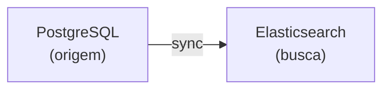
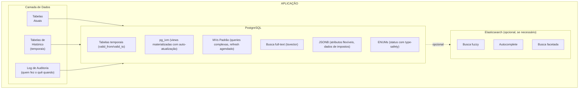

# Arquitetura de Infraestrutura

> Status: **Rascunho**
> Última atualização: 2025-12-27
> Foco: Auditoria, dados temporais, busca, views materializadas, tarefas agendadas, performance

---

## Sumário

1. [Arquitetura de Trilha de Auditoria](#1-arquitetura-de-trilha-de-auditoria)
2. [Dados Temporais / Consultas Point-in-Time](#2-dados-temporais--consultas-point-in-time)
3. [Arquitetura de Busca](#3-arquitetura-de-busca)
4. [Views Materializadas](#4-views-materializadas)
5. [Tarefas Agendadas (Servidor)](#5-tarefas-agendadas-servidor)
6. [Benchmarks de Performance](#6-benchmarks-de-performance)

---

## 1. Arquitetura de Trilha de Auditoria

### Requisitos

- Rastrear TODAS as alterações em tabelas críticas
- Saber QUEM fez a alteração
- Saber QUANDO aconteceu
- Saber O QUE mudou (valores antigos -> novos)
- Capacidade de consultar estado histórico

### Recomendado: Tabela de Log de Auditoria

```sql
CREATE TABLE audit_log (
    id BIGSERIAL PRIMARY KEY,

    -- O que mudou
    table_name VARCHAR(100) NOT NULL,
    record_id INTEGER NOT NULL,
    action VARCHAR(20) NOT NULL, -- INSERT, UPDATE, DELETE

    -- As alterações
    old_values JSONB,
    new_values JSONB,
    changed_fields TEXT[], -- quais colunas mudaram

    -- Quem e quando
    user_id INTEGER,
    user_name VARCHAR(100), -- desnormalizado para histórico
    ip_address INET,
    user_agent TEXT,

    -- Contexto
    transaction_id VARCHAR(100), -- agrupar alterações relacionadas
    module VARCHAR(50), -- 'compras', 'vendas', etc.
    reason TEXT, -- justificativa opcional

    created_at TIMESTAMPTZ DEFAULT NOW()
);

CREATE INDEX idx_audit_table_record ON audit_log(table_name, record_id);
CREATE INDEX idx_audit_created ON audit_log(created_at);
CREATE INDEX idx_audit_user ON audit_log(user_id);
CREATE INDEX idx_audit_transaction ON audit_log(transaction_id);
```

### Trigger Genérico de Auditoria

```sql
CREATE OR REPLACE FUNCTION audit_trigger_func()
RETURNS TRIGGER AS $$
BEGIN
    IF TG_OP = 'DELETE' THEN
        INSERT INTO audit_log (table_name, record_id, action, old_values, user_id)
        VALUES (TG_TABLE_NAME, OLD.id, 'DELETE', to_jsonb(OLD),
                current_setting('app.user_id', true)::int);
        RETURN OLD;
    ELSIF TG_OP = 'UPDATE' THEN
        INSERT INTO audit_log (table_name, record_id, action, old_values, new_values, user_id)
        VALUES (TG_TABLE_NAME, NEW.id, 'UPDATE', to_jsonb(OLD), to_jsonb(NEW),
                current_setting('app.user_id', true)::int);
        RETURN NEW;
    ELSIF TG_OP = 'INSERT' THEN
        INSERT INTO audit_log (table_name, record_id, action, new_values, user_id)
        VALUES (TG_TABLE_NAME, NEW.id, 'INSERT', to_jsonb(NEW),
                current_setting('app.user_id', true)::int);
        RETURN NEW;
    END IF;
END;
$$ LANGUAGE plpgsql;

-- Aplicar às tabelas importantes
CREATE TRIGGER audit_vendas
    AFTER INSERT OR UPDATE OR DELETE ON vendas
    FOR EACH ROW EXECUTE FUNCTION audit_trigger_func();
```

---

## 2. Dados Temporais / Consultas Point-in-Time

### O que é Temporal SQL?

Dados temporais rastreiam **quando** algo era verdadeiro, não apenas **o que** é verdade agora:

| Tipo                 | Rastreia                             | Pergunta que Responde                 |
| -------------------- | ------------------------------------ | ------------------------------------- |
| **System Time**      | Quando dado estava no banco          | "O que sabíamos em 15 de dezembro?"   |
| **Application Time** | Quando dado era válido no mundo real | "Qual era o preço em 15 de dezembro?" |
| **Bi-temporal**      | Ambos                                | Histórico completo + auditoria        |

### Casos de Uso no ERP

| Consulta       | Exemplo                                                           |
| -------------- | ----------------------------------------------------------------- |
| Point-in-time  | "Qual era o estoque do produto X em 15 de janeiro?"               |
| Histórico      | "Mostrar todas as alterações de preço do produto X em 2024"       |
| Auditoria      | "Quem alterou este registro e quando?"                            |
| Rollback       | "Como era esta venda antes da edição?"                            |
| Relatórios     | "Qual era nosso total de recebíveis em 31 de dezembro?"           |
| Duração status | "Quanto tempo pedido ficou em PENDENTE antes de ir para ESTOQUE?" |

### Problemas Atuais

#### 1. Histórico de Preços Perdido

```text
Atual: Preço armazenado uma vez, se mudar, antigo é perdido.
Problema: Relatórios mostram preço atual, não preço histórico da venda.
```

#### 2. Níveis de Estoque ao Longo do Tempo

```text
Atual: Apenas `quantidade_disponivel` atual armazenada.
Problema: Não consegue responder perguntas point-in-time para auditoria de fim de ano.
```

#### 3. Limite de Crédito do Cliente

```text
Atual: Apenas valor atual.
Problema: "Quem mudou o limite de crédito e quando?" - Impossível responder.
```

#### 4. Histórico de Status

```text
Atual: Apenas status atual armazenado.
Problema: Não consegue medir eficiência do processo.
```

### Opção A: Tabelas Temporais com Histórico

```sql
-- Tabela principal (estado atual)
CREATE TABLE vendas (
    id SERIAL PRIMARY KEY,
    cliente_id INTEGER,
    status VARCHAR(50),
    total DECIMAL(15,2),
    -- ... outros campos

    -- Metadados temporais
    valid_from TIMESTAMPTZ NOT NULL DEFAULT NOW(),
    valid_to TIMESTAMPTZ NOT NULL DEFAULT 'infinity',

    -- Metadados de auditoria
    created_by INTEGER,
    updated_by INTEGER,
    created_at TIMESTAMPTZ DEFAULT NOW(),
    updated_at TIMESTAMPTZ DEFAULT NOW()
);

-- Tabela de histórico (estados passados)
CREATE TABLE vendas_history (
    history_id BIGSERIAL PRIMARY KEY,
    id INTEGER NOT NULL, -- id do registro original
    cliente_id INTEGER,
    status VARCHAR(50),
    total DECIMAL(15,2),
    -- ... espelhar todos os campos

    valid_from TIMESTAMPTZ NOT NULL,
    valid_to TIMESTAMPTZ NOT NULL,

    operation VARCHAR(10), -- UPDATE, DELETE
    changed_by INTEGER,
    changed_at TIMESTAMPTZ DEFAULT NOW()
);

-- Trigger para manter histórico
CREATE OR REPLACE FUNCTION vendas_history_trigger()
RETURNS TRIGGER AS $$
BEGIN
    IF TG_OP = 'UPDATE' THEN
        -- Fechar o registro antigo
        INSERT INTO vendas_history
        SELECT nextval('vendas_history_history_id_seq'),
               OLD.*,
               OLD.valid_from, NOW(), 'UPDATE',
               current_setting('app.user_id', true)::int, NOW();

        -- Atualizar valid_from no novo registro
        NEW.valid_from := NOW();
        NEW.updated_at := NOW();
        NEW.updated_by := current_setting('app.user_id', true)::int;
        RETURN NEW;

    ELSIF TG_OP = 'DELETE' THEN
        INSERT INTO vendas_history
        SELECT nextval('vendas_history_history_id_seq'),
               OLD.*,
               OLD.valid_from, NOW(), 'DELETE',
               current_setting('app.user_id', true)::int, NOW();
        RETURN OLD;
    END IF;
END;
$$ LANGUAGE plpgsql;

CREATE TRIGGER vendas_history
    BEFORE UPDATE OR DELETE ON vendas
    FOR EACH ROW EXECUTE FUNCTION vendas_history_trigger();
```

### Consultando em Point in Time

```sql
-- Como era a venda 123 em 2025-01-15?
SELECT * FROM vendas WHERE id = 123
  AND valid_from <= '2025-01-15' AND valid_to > '2025-01-15'
UNION ALL
SELECT id, cliente_id, status, total, ... FROM vendas_history WHERE id = 123
  AND valid_from <= '2025-01-15' AND valid_to > '2025-01-15';
```

### Opção B: Slowly Changing Dimension Type 2 (SCD-2)

Para dados que mudam periodicamente e precisam de histórico consultável (ex: preços):

```sql
CREATE TABLE produto_precos (
    id SERIAL PRIMARY KEY,
    produto_id INTEGER NOT NULL REFERENCES produtos(id),

    custo DECIMAL(15,4) NOT NULL,
    valor_venda DECIMAL(15,4) NOT NULL,

    -- Colunas temporais
    valid_from TIMESTAMP NOT NULL DEFAULT NOW(),
    valid_to TIMESTAMP,  -- NULL = atualmente válido

    created_by INTEGER REFERENCES usuarios(id)
);

-- Índice para consultas point-in-time
CREATE INDEX idx_produto_precos_temporal
    ON produto_precos(produto_id, valid_from, valid_to);
```

**Consultar preço em data específica:**

```sql
SELECT * FROM produto_precos
WHERE produto_id = :produto_id
  AND valid_from <= '2024-12-15'
  AND (valid_to IS NULL OR valid_to > '2024-12-15');
```

**Consultar preço atual:**

```sql
SELECT * FROM produto_precos
WHERE produto_id = :produto_id
  AND valid_to IS NULL;
```

**Atualizar preço (fechar antigo, inserir novo):**

```sql
-- Fechar registro atual
UPDATE produto_precos
SET valid_to = NOW()
WHERE produto_id = :produto_id
  AND valid_to IS NULL;

-- Inserir novo registro
INSERT INTO produto_precos (produto_id, custo, valor_venda, valid_from)
VALUES (:produto_id, :custo, :valor_venda, NOW());
```

**Prós:** Consultas point-in-time rápidas
**Contras:** Updates mais complexos, mais armazenamento

---

### Opção C: Event Sourcing (Mais Poderoso)

Armazena eventos, deriva estado atual. Ideal para dados que mudam frequentemente:

```sql
CREATE TABLE estoque_movimentos (
    id BIGSERIAL PRIMARY KEY,
    estoque_id INTEGER NOT NULL REFERENCES estoques(id),

    tipo VARCHAR(30) NOT NULL,  -- ENTRADA, CONSUMO, ESTORNO, AJUSTE
    quantidade DECIMAL(15,4) NOT NULL,  -- positivo ou negativo
    saldo_apos DECIMAL(15,4) NOT NULL,  -- saldo corrente

    -- Contexto
    consumo_id INTEGER REFERENCES estoque_consumos(id),
    ajuste_motivo VARCHAR(200),

    usuario_id INTEGER REFERENCES usuarios(id),
    created_at TIMESTAMP DEFAULT NOW()
);

CREATE INDEX idx_estoque_mov_temporal
    ON estoque_movimentos(estoque_id, created_at);
```

**Consultar nível de estoque em qualquer ponto no tempo:**

```sql
SELECT saldo_apos
FROM estoque_movimentos
WHERE estoque_id = :estoque_id
  AND created_at <= '2024-12-15 23:59:59'
ORDER BY created_at DESC
LIMIT 1;
```

**Histórico completo de um item de estoque:**

```sql
SELECT
    tipo,
    quantidade,
    saldo_apos,
    created_at
FROM estoque_movimentos
WHERE estoque_id = :estoque_id
ORDER BY created_at;
```

**Prós:** Histórico completo, pode replay, ótimo para debugging
**Contras:** Estado atual precisa ser computado ou cacheado

---

### Opção D: Tabelas de Snapshot

Para necessidades específicas de relatórios, tirar snapshots periódicos:

```sql
CREATE TABLE estoque_snapshots (
    id SERIAL PRIMARY KEY,
    snapshot_date DATE NOT NULL,
    produto_id INTEGER NOT NULL,
    quantidade DECIMAL(15,4),
    valor_total DECIMAL(15,2),
    created_at TIMESTAMPTZ DEFAULT NOW(),

    UNIQUE(snapshot_date, produto_id)
);

-- Job diário para capturar snapshot
INSERT INTO estoque_snapshots (snapshot_date, produto_id, quantidade, valor_total)
SELECT
    CURRENT_DATE,
    produto_id,
    SUM(quantidade_disponivel),
    SUM(quantidade_disponivel * custo_unitario)
FROM estoques
GROUP BY produto_id;
```

---

### Recomendação por Tipo de Dado

| Dado                      | Abordagem                            | Motivo                                   |
| ------------------------- | ------------------------------------ | ---------------------------------------- |
| **Preços**                | SCD-2 (`valid_from`/`valid_to`)      | Consultado frequentemente em relatórios  |
| **Estoque**               | Event sourcing + saldo materializado | Precisa histórico completo de movimentos |
| **Mudanças de status**    | Audit log                            | Já planejado, suficiente                 |
| **Cliente/Fornecedor**    | Audit log                            | Raramente precisa point-in-time          |
| **Configurações fiscais** | SCD-2                                | Alíquotas mudam anualmente               |

---

### Exemplos de Queries para o ERP

**Valoração de inventário de fim de ano:**

```sql
SELECT
    p.descricao,
    e.lote,
    -- Saldo em 31 de dezembro
    (SELECT saldo_apos
     FROM estoque_movimentos
     WHERE estoque_id = e.id
       AND created_at <= '2024-12-31 23:59:59'
     ORDER BY created_at DESC LIMIT 1) as quantidade,
    e.custo_unitario
FROM estoques e
JOIN produtos p ON p.id = e.produto_id
WHERE e.created_at <= '2024-12-31';
```

**Preço no momento da venda (já snapshotted):**

```sql
-- venda_itens.valor_unitario já é snapshot do momento da venda
SELECT
    vi.id,
    vi.quantidade,
    vi.valor_unitario as preco_na_venda,
    pp.valor_venda as preco_atual  -- Preço atual para comparação
FROM venda_itens vi
JOIN produto_precos pp ON pp.produto_id = vi.produto_id
    AND pp.valid_to IS NULL;
```

**Reconstruir estado do cliente em data específica:**

```sql
-- Usando audit_log para reconstruir
WITH estado_em_data AS (
    SELECT
        new_values
    FROM audit_log
    WHERE table_name = 'clientes'
      AND record_id = :cliente_id
      AND created_at <= '2024-06-15 23:59:59'
    ORDER BY created_at DESC
    LIMIT 1
)
SELECT
    new_values->>'razao_social' as razao_social,
    (new_values->>'limite_credito')::DECIMAL as limite_credito,
    new_values->>'status' as status
FROM estado_em_data;
```

---

## 3. Arquitetura de Busca

### Estado Atual

- Índices FULLTEXT do MySQL
- Queries LIKE com wildcards
- Lento em conjuntos de dados grandes
- Recursos limitados (sem fuzzy, sem sinônimos, sem ranking)

### Opção A: Busca Full-Text do PostgreSQL (Início Recomendado)

```sql
-- Adicionar coluna de vetor de busca
ALTER TABLE produtos ADD COLUMN search_vector tsvector;

-- Criar índice GIN
CREATE INDEX idx_produtos_search ON produtos USING GIN(search_vector);

-- Trigger de atualização
CREATE OR REPLACE FUNCTION produtos_search_trigger() RETURNS trigger AS $$
BEGIN
    NEW.search_vector :=
        setweight(to_tsvector('portuguese', COALESCE(NEW.descricao, '')), 'A') ||
        setweight(to_tsvector('portuguese', COALESCE(NEW.cod_comercial, '')), 'B') ||
        setweight(to_tsvector('portuguese', COALESCE(NEW.marca, '')), 'C');
    RETURN NEW;
END;
$$ LANGUAGE plpgsql;

CREATE TRIGGER produtos_search_update
    BEFORE INSERT OR UPDATE ON produtos
    FOR EACH ROW EXECUTE FUNCTION produtos_search_trigger();

-- Query de busca
SELECT
    id, descricao,
    ts_rank(search_vector, query) as rank
FROM produtos, plainto_tsquery('portuguese', 'mesa escritorio madeira') query
WHERE search_vector @@ query
ORDER BY rank DESC
LIMIT 20;
```

**Recursos:**

- Stemming (Português)
- Ranking
- Busca por frase
- Correspondência por prefixo
- Pesos por campo

### Opção B: Elasticsearch (Se Necessário Depois)



**Quando atualizar:**

- Precisa de tolerância a erros de digitação ("meza" encontra "mesa")
- Precisa de autocomplete com fuzzy
- Conjunto de dados > 1M produtos
- Busca facetada complexa necessária

---

## 4. Views Materializadas

### Problema

Views recalculam a cada query - lento para dashboards.

### Solução: Views Materializadas com pg_ivm (Recomendado)

**pg_ivm** (Incremental View Maintenance) fornece views materializadas com atualização automática que atualizam apenas as linhas alteradas - não a view inteira.

#### Instalando pg_ivm

```sql
-- Instalar a extensão
CREATE EXTENSION pg_ivm;
```

#### Criando Views com Manutenção Incremental

```sql
-- Usar create_immv em vez de CREATE MATERIALIZED VIEW
SELECT create_immv('immv_produto_estoque', $$
    SELECT
        p.id as produto_id,
        p.descricao,
        p.fornecedor_id,
        f.razao_social as fornecedor_nome,
        COALESCE(SUM(e.quantidade_disponivel), 0) as estoque_total,
        COALESCE(AVG(e.custo_unitario), 0) as custo_medio,
        MAX(e.data_entrada) as ultima_entrada
    FROM produtos p
    LEFT JOIN fornecedores f ON p.fornecedor_id = f.id
    LEFT JOIN estoques e ON p.id = e.produto_id AND e.quantidade_disponivel > 0
    GROUP BY p.id, p.descricao, p.fornecedor_id, f.razao_social
$$);

-- A view atualiza automaticamente quando produtos, fornecedores ou estoques mudam!
-- Não precisa de REFRESH manual.
```

#### pg_ivm vs Views Materializadas Padrão

| Recurso                   | MV Padrão                 | pg_ivm (IMMV)                   |
| ------------------------- | ------------------------- | ------------------------------- |
| Atualização automática    | Não (REFRESH manual)      | Sim (automática)                |
| Velocidade de atualização | Reconstrução completa     | Incremental (apenas alterações) |
| Consistência              | Desatualizada até refresh | Sempre atual                    |
| Overhead                  | Nenhum entre refreshes    | Leve em cada DML                |
| Melhor para               | Grandes, raramente mudam  | Dados que mudam frequentemente  |

#### Recursos de Query Suportados

pg_ivm suporta a maioria dos padrões de query comuns:

```sql
-- Agregações (SUM, COUNT, AVG, MIN, MAX)
SELECT create_immv('immv_vendas_por_cliente', $$
    SELECT
        cliente_id,
        COUNT(*) as total_vendas,
        SUM(total) as valor_total
    FROM vendas
    WHERE status = 'completed'
    GROUP BY cliente_id
$$);

-- JOINs (INNER, LEFT, RIGHT)
SELECT create_immv('immv_itens_com_produto', $$
    SELECT
        vi.id,
        vi.venda_id,
        p.descricao as produto_nome,
        vi.quantidade,
        vi.preco_unitario
    FROM venda_itens vi
    JOIN produtos p ON p.id = vi.produto_id
$$);

-- DISTINCT
SELECT create_immv('immv_fornecedores_ativos', $$
    SELECT DISTINCT fornecedor_id
    FROM estoques
    WHERE quantidade_disponivel > 0
$$);
```

#### Limitações

pg_ivm NÃO suporta:

- Funções de janela (`ROW_NUMBER`, `RANK`, etc.)
- CTEs (cláusulas `WITH`)
- Subqueries em `FROM`
- `UNION`, `INTERSECT`, `EXCEPT`
- `HAVING` (usar workaround com CTE na camada da aplicação)

Para estes, use views materializadas padrão com refresh agendado.

#### Gerenciando IMMVs

```sql
-- Listar todas as views materializadas com manutenção incremental
SELECT * FROM pg_ivm_immv;

-- Remover uma IMMV
SELECT drop_immv('immv_produto_estoque');

-- Desabilitar temporariamente auto-refresh (para operações em massa)
SELECT immv_set_pause('immv_produto_estoque', true);

-- Reabilitar
SELECT immv_set_pause('immv_produto_estoque', false);

-- Refresh manual se necessário
REFRESH MATERIALIZED VIEW immv_produto_estoque;
```

#### Melhores Práticas

1. **Use IMMVs para dashboards** - Dados sempre atuais sem polling
2. **Pause durante importações em massa** - Evite overhead durante cargas grandes de dados
3. **Crie índices na IMMV** - Crie índices como em tabelas regulares
4. **Monitore o overhead** - Verifique se operações DML estão ficando lentas

```sql
-- Criar índices na IMMV
CREATE INDEX idx_immv_estoque_fornecedor ON immv_produto_estoque(fornecedor_id);
CREATE INDEX idx_immv_estoque_total ON immv_produto_estoque(estoque_total);
```

---

### Views Materializadas Padrão (Quando pg_ivm Não se Aplica)

Para queries com funções de janela, CTEs, ou outros recursos não suportados, use views materializadas padrão com refresh agendado:

```sql
-- Criar view materializada
CREATE MATERIALIZED VIEW mv_produto_estoque AS
SELECT
    p.id as produto_id,
    p.descricao,
    p.fornecedor_id,
    f.razao_social as fornecedor_nome,
    COALESCE(SUM(e.quantidade_disponivel), 0) as estoque_total,
    COALESCE(AVG(e.custo_unitario), 0) as custo_medio,
    MAX(e.data_entrada) as ultima_entrada
FROM produtos p
LEFT JOIN fornecedores f ON p.fornecedor_id = f.id
LEFT JOIN estoques e ON p.id = e.produto_id AND e.quantidade_disponivel > 0
GROUP BY p.id, p.descricao, p.fornecedor_id, f.razao_social;

-- Criar índices na view materializada
CREATE UNIQUE INDEX ON mv_produto_estoque(produto_id);
CREATE INDEX ON mv_produto_estoque(fornecedor_id);
CREATE INDEX ON mv_produto_estoque(estoque_total);

-- Estratégias de refresh:
-- 1. Refresh concorrente (não-bloqueante, requer índice único)
REFRESH MATERIALIZED VIEW CONCURRENTLY mv_produto_estoque;

-- 2. Refresh agendado (via pg_cron)
SELECT cron.schedule('refresh-estoque', '*/5 * * * *',
    'REFRESH MATERIALIZED VIEW CONCURRENTLY mv_produto_estoque');
```

### Views Candidatas para Materialização

| View                        | Tipo       | Refresh    | Motivo                                               |
| --------------------------- | ---------- | ---------- | ---------------------------------------------------- |
| `immv_produto_estoque`      | **pg_ivm** | Automático | Níveis de estoque precisam de precisão em tempo real |
| `immv_vendas_dashboard`     | **pg_ivm** | Automático | Dashboard deve estar atualizado                      |
| `immv_order_totals`         | **pg_ivm** | Automático | Totais de pedidos mudam com itens                    |
| `immv_cliente_stats`        | **pg_ivm** | Automático | Histórico de compras de clientes                     |
| `mv_financeiro_resumo`      | Padrão     | 1 hora     | Queries complexas, menos frequente                   |
| `mv_fornecedor_performance` | Padrão     | Diário     | Análise histórica, funções de janela                 |
| `mv_produto_ranking`        | Padrão     | Diário     | Usa função de janela RANK()                          |

### Refresh com Log

```sql
CREATE TABLE mv_refresh_log (
    id SERIAL PRIMARY KEY,
    view_name VARCHAR(100) NOT NULL,
    started_at TIMESTAMPTZ NOT NULL,
    finished_at TIMESTAMPTZ,
    duration_ms INTEGER,
    rows_affected INTEGER,
    status VARCHAR(20) DEFAULT 'running'
);

CREATE OR REPLACE FUNCTION refresh_mv_with_logging(view_name TEXT)
RETURNS void AS $$
DECLARE
    start_time TIMESTAMPTZ;
    log_id INTEGER;
BEGIN
    start_time := NOW();

    INSERT INTO mv_refresh_log (view_name, started_at)
    VALUES (view_name, start_time)
    RETURNING id INTO log_id;

    EXECUTE 'REFRESH MATERIALIZED VIEW CONCURRENTLY ' || view_name;

    UPDATE mv_refresh_log
    SET finished_at = NOW(),
        duration_ms = EXTRACT(MILLISECONDS FROM NOW() - start_time),
        status = 'completed'
    WHERE id = log_id;
END;
$$ LANGUAGE plpgsql;
```

---

## 5. Tarefas Agendadas (Servidor)

### Problema Atual

No sistema legado, tarefas de manutenção rodam **na primeira conexão do usuário** ao invés de no servidor:

```cpp
// application.cpp - HACK atual
void Application::runSqlJobs() {
  if (query.value("lastInvalidated").toDate() < serverDateTime().date()) {
    query.exec("CALL invalidar_produtos_expirados()");
    query.exec("CALL invalidar_orcamentos_expirados()");
    query.exec("CALL invalidar_staccatoOff()");
    query.exec("UPDATE maintenance SET lastInvalidated = :today");
  }
}
```

**Problemas**:

- Se ninguém logar no dia, as tarefas não rodam
- Depende de alguém usar o app desktop
- Primeiro usuário do dia tem delay no login
- Não é confiável para operações críticas

### Solução: Laravel Scheduler

```text
┌─────────────────────────────────────────────────────────────┐
│                      SERVIDOR LINUX                         │
│                                                             │
│  ┌─────────────────────────────────────────────────────┐   │
│  │                 CRON (a cada minuto)                 │   │
│  │                         │                            │   │
│  │                         ▼                            │   │
│  │          php artisan schedule:run                    │   │
│  │                         │                            │   │
│  │    ┌────────────────────┼────────────────────┐      │   │
│  │    ▼                    ▼                    ▼      │   │
│  │ 00:00              00:00                 00:00      │   │
│  │ Expirar            Expirar               Outras     │   │
│  │ Orçamentos         Produtos              Tarefas    │   │
│  └─────────────────────────────────────────────────────┘   │
│                                                             │
└─────────────────────────────────────────────────────────────┘
```

### Tarefas a Migrar

| Tarefa Atual       | Stored Procedure                   | Novo Job Laravel              | Horário   |
| ------------------ | ---------------------------------- | ----------------------------- | --------- |
| Expirar orçamentos | `invalidar_orcamentos_expirados()` | `ExpirarOrcamentosJob`        | 00:01     |
| Expirar produtos   | `invalidar_produtos_expirados()`   | `ExpirarProdutosJob`          | 00:02     |
| Staccato Off       | `invalidar_staccatoOff()`          | `InvalidarStaccatoOffJob`     | 00:03     |
| Download NFe       | Widget timer                       | `ConsultarDFeJob`             | \*/5 min  |
| Auto-confirmar NFe | -                                  | `AutoConfirmarNFeAntigasJob`  | 06:00     |
| Refresh MVs        | -                                  | `RefreshMaterializedViewsJob` | \*/15 min |

### Implementação Laravel

#### Jobs de Expiração

```php
// app/Jobs/ExpirarOrcamentosJob.php
namespace App\Jobs;

use Illuminate\Bus\Queueable;
use Illuminate\Contracts\Queue\ShouldQueue;
use Illuminate\Support\Facades\DB;
use Illuminate\Support\Facades\Log;

class ExpirarOrcamentosJob implements ShouldQueue
{
    use Queueable;

    public function handle(): void
    {
        $affected = DB::update("
            UPDATE orcamentos
            SET status = 'EXPIRADO'
            WHERE status = 'ATIVO'
              AND data_emissao + (validade || ' days')::interval < CURRENT_DATE
        ");

        Log::info("ExpirarOrcamentosJob: {$affected} orçamentos expirados");
    }
}

// app/Jobs/ExpirarProdutosJob.php
class ExpirarProdutosJob implements ShouldQueue
{
    use Queueable;

    public function handle(): void
    {
        $affected = DB::update("
            UPDATE produto_precos
            SET ativo = false
            WHERE ativo = true
              AND validade_ate IS NOT NULL
              AND validade_ate < CURRENT_DATE
        ");

        Log::info("ExpirarProdutosJob: {$affected} preços expirados");
    }
}
```

#### Scheduler

```php
// app/Console/Kernel.php
namespace App\Console;

use Illuminate\Console\Scheduling\Schedule;
use Illuminate\Foundation\Console\Kernel as ConsoleKernel;

class Kernel extends ConsoleKernel
{
    protected function schedule(Schedule $schedule): void
    {
        // ==========================================
        // MEIA-NOITE - Tarefas de expiração
        // ==========================================

        $schedule->job(new ExpirarOrcamentosJob)
            ->dailyAt('00:01')
            ->onOneServer()
            ->withoutOverlapping();

        $schedule->job(new ExpirarProdutosJob)
            ->dailyAt('00:02')
            ->onOneServer()
            ->withoutOverlapping();

        $schedule->job(new InvalidarStaccatoOffJob)
            ->dailyAt('00:03')
            ->onOneServer()
            ->withoutOverlapping();

        // ==========================================
        // NFe - Download e manifestação
        // ==========================================

        $schedule->job(new ConsultarDFeJob)
            ->everyFiveMinutes()
            ->onOneServer()
            ->withoutOverlapping();

        $schedule->job(new AutoConfirmarNFeAntigasJob)
            ->dailyAt('06:00')
            ->onOneServer();

        $schedule->job(new RetentarNFeRejeitadasJob)
            ->everyThirtyMinutes()
            ->onOneServer();

        // ==========================================
        // MANUTENÇÃO - Views e limpeza
        // ==========================================

        $schedule->job(new RefreshMaterializedViewsJob)
            ->everyFifteenMinutes()
            ->onOneServer();

        $schedule->job(new LimparLogsAntigosJob)
            ->dailyAt('03:00')
            ->onOneServer();

        // ==========================================
        // BACKUP - Opcional se não usar backup externo
        // ==========================================

        $schedule->command('backup:run --only-db')
            ->dailyAt('02:00')
            ->onOneServer();
    }
}
```

#### Configuração do Cron

```bash
# /etc/cron.d/laravel-scheduler
* * * * * www-data cd /var/www/erp && php artisan schedule:run >> /dev/null 2>&1
```

Ou com systemd timer:

```ini
# /etc/systemd/system/laravel-scheduler.timer
[Unit]
Description=Laravel Scheduler

[Timer]
OnBootSec=1min
OnUnitActiveSec=1min

[Install]
WantedBy=timers.target
```

```ini
# /etc/systemd/system/laravel-scheduler.service
[Unit]
Description=Laravel Scheduler Run

[Service]
Type=oneshot
User=www-data
WorkingDirectory=/var/www/erp
ExecStart=/usr/bin/php artisan schedule:run
```

### Migração do Sistema Legado

| Fase | Ação                               |
| ---- | ---------------------------------- |
| 1    | Implementar Jobs no Laravel        |
| 2    | Configurar cron no servidor        |
| 3    | Testar em paralelo (ambos rodando) |
| 4    | Remover `runSqlJobs()` do C++      |
| 5    | Remover tabela `maintenance`       |

### Monitoramento

```php
// Usar Laravel Telescope ou log custom
// app/Jobs/ExpirarOrcamentosJob.php

public function handle(): void
{
    $start = microtime(true);

    $affected = DB::update(...);

    $duration = round((microtime(true) - $start) * 1000);

    // Log estruturado
    Log::channel('scheduler')->info('Job completed', [
        'job' => 'ExpirarOrcamentosJob',
        'affected' => $affected,
        'duration_ms' => $duration,
    ]);

    // Ou salvar em tabela
    SchedulerLog::create([
        'job_name' => 'ExpirarOrcamentosJob',
        'started_at' => now()->subMilliseconds($duration),
        'finished_at' => now(),
        'duration_ms' => $duration,
        'affected_rows' => $affected,
        'status' => 'completed',
    ]);
}
```

### Alertas

```php
// app/Jobs/ExpirarOrcamentosJob.php

public function failed(\Throwable $exception): void
{
    // Notificar administrador
    Notification::route('mail', config('app.admin_email'))
        ->notify(new SchedulerJobFailed('ExpirarOrcamentosJob', $exception));

    // Ou usar serviço de monitoramento
    // Sentry::captureException($exception);
}
```

---

## 6. Benchmarks de Performance

### Metas de Tempo de Resposta

| Categoria      | Operação                 | Meta    | P99     |
| -------------- | ------------------------ | ------- | ------- |
| **Páginas**    | Listagem (index)         | < 200ms | < 500ms |
|                | Detalhes (show)          | < 150ms | < 300ms |
|                | Formulário (create/edit) | < 100ms | < 200ms |
| **API**        | GET simples              | < 50ms  | < 100ms |
|                | GET com relacionamentos  | < 100ms | < 200ms |
|                | POST/PUT                 | < 150ms | < 300ms |
|                | Busca (search)           | < 200ms | < 400ms |
| **Relatórios** | Pequeno (< 1k linhas)    | < 500ms | < 1s    |
|                | Médio (1k-10k linhas)    | < 2s    | < 5s    |
|                | Grande (> 10k linhas)    | < 10s   | < 30s   |
| **Jobs**       | NFe emissão              | < 5s    | < 10s   |
|                | CNAB geração             | < 3s    | < 8s    |
|                | PDF geração              | < 2s    | < 5s    |

### Baseline do Sistema Atual (C++)

Métricas observadas no sistema desktop:

| Operação                  | Tempo Atual | Observação                  |
| ------------------------- | ----------- | --------------------------- |
| Login                     | 2-5s        | Inclui conexão MySQL remota |
| Abrir lista de orçamentos | 1-3s        | Carrega todos sem paginação |
| Criar orçamento           | 0.5-1s      | Resposta rápida (local)     |
| Emitir NFe                | 5-15s       | Depende do ACBr/SEFAZ       |
| Gerar PDF orçamento       | 1-3s        | LimeReport local            |
| Busca de produtos         | 0.5-2s      | LIKE com wildcard           |
| Consulta estoque          | 0.3-1s      | View não otimizada          |

### Estratégia de Cache (Redis)

#### Camadas de Cache

```text
┌─────────────────────────────────────────────────────────────┐
│                    Estratégia de Cache                       │
├──────────────┬──────────────┬──────────────┬───────────────┤
│   Browser    │   Laravel    │    Redis     │   Database    │
│   Cache      │   Cache      │   Cache      │   Indexes     │
├──────────────┼──────────────┼──────────────┼───────────────┤
│ Assets       │ Config       │ Sessions     │ Primary Keys  │
│ API (ETag)   │ Routes       │ Queries      │ Foreign Keys  │
│ Static       │ Views        │ Objects      │ Composite     │
│              │ Events       │ Locks        │ Full-text     │
└──────────────┴──────────────┴──────────────┴───────────────┘
```

#### Configuração Redis

```php
// config/cache.php
return [
    'default' => env('CACHE_STORE', 'redis'),

    'stores' => [
        'redis' => [
            'driver' => 'redis',
            'connection' => 'cache',
            'lock_connection' => 'default',
        ],

        // Cache separado para queries pesadas
        'queries' => [
            'driver' => 'redis',
            'connection' => 'cache',
            'prefix' => 'query:',
        ],
    ],

    'prefix' => env('CACHE_PREFIX', 'staccato'),
];
```

#### Padrões de Cache

```php
// Cache de configurações (longa duração)
Cache::remember('config:formas_pagamento', 3600, function () {
    return FormaPagamento::where('ativo', true)->get();
});

// Cache de dados do usuário (sessão)
Cache::tags(['user', "user:{$userId}"])->remember(
    "user:{$userId}:permissions",
    1800,
    fn() => $user->getAllPermissions()
);

// Cache de queries pesadas (curta duração)
Cache::store('queries')->remember(
    "estoque:produto:{$produtoId}",
    60,
    fn() => Estoque::where('produto_id', $produtoId)
        ->where('quantidade_disponivel', '>', 0)
        ->sum('quantidade_disponivel')
);

// Invalidação por tags
Cache::tags(['user', "user:{$userId}"])->flush();
```

#### TTL por Tipo de Dado

| Tipo                  | TTL        | Motivo                                  |
| --------------------- | ---------- | --------------------------------------- |
| Configurações sistema | 1 hora     | Raramente mudam                         |
| Permissões usuário    | 30 min     | Pode mudar, mas não frequente           |
| Dados de sessão       | 2 horas    | Padrão Laravel                          |
| Consultas de estoque  | 1 min      | Muda frequentemente                     |
| Resultados de busca   | 5 min      | Balanço entre atualização e performance |
| Views materializadas  | 0 (pg_ivm) | Atualizadas automaticamente             |

### Otimização de Queries

#### Problema Comum: N+1

```php
// ❌ Ruim - N+1 queries
$vendas = Venda::all();
foreach ($vendas as $venda) {
    echo $venda->cliente->nome;  // Query adicional por venda
    echo $venda->vendedor->nome; // Outra query
}

// ✅ Bom - Eager loading
$vendas = Venda::with(['cliente', 'vendedor'])->get();
foreach ($vendas as $venda) {
    echo $venda->cliente->nome;  // Já carregado
    echo $venda->vendedor->nome; // Já carregado
}
```

#### Eager Loading Global

```php
// app/Models/Venda.php
class Venda extends Model
{
    // Sempre carregar esses relacionamentos
    protected $with = ['cliente', 'loja'];

    // Contagens sempre incluídas
    protected $withCount = ['itens'];
}
```

#### Lazy Loading Prevention

```php
// app/Providers/AppServiceProvider.php
public function boot(): void
{
    // Prevenir lazy loading em não-produção
    Model::preventLazyLoading(!app()->isProduction());

    // Logar queries lentas
    Model::handleLazyLoadingViolationUsing(function ($model, $relation) {
        Log::warning("Lazy loading detected: {$model}::{$relation}");
    });
}
```

#### Query Optimization com Spatie

```php
// Usando spatie/laravel-query-builder
use Spatie\QueryBuilder\QueryBuilder;
use Spatie\QueryBuilder\AllowedFilter;

$vendas = QueryBuilder::for(Venda::class)
    ->allowedFilters([
        AllowedFilter::exact('status'),
        AllowedFilter::scope('data_entre'),
        AllowedFilter::exact('loja_id'),
    ])
    ->allowedIncludes(['cliente', 'itens', 'pagamentos'])
    ->allowedSorts(['created_at', 'total', 'status'])
    ->defaultSort('-created_at')
    ->paginate(25);
```

### Índices de Banco de Dados

#### Índices Críticos

```sql
-- Vendas - consultas frequentes
CREATE INDEX idx_vendas_status ON vendas(status);
CREATE INDEX idx_vendas_loja_data ON vendas(loja_id, created_at DESC);
CREATE INDEX idx_vendas_cliente ON vendas(cliente_id);
CREATE INDEX idx_vendas_vendedor ON vendas(vendedor_id);

-- Estoque - consumo FIFO
CREATE INDEX idx_estoque_produto_fifo ON estoques(
    produto_id,
    quantidade_disponivel,
    data_entrada ASC
) WHERE quantidade_disponivel > 0;

-- Produtos - busca
CREATE INDEX idx_produtos_search ON produtos USING GIN(search_vector);
CREATE INDEX idx_produtos_fornecedor ON produtos(fornecedor_id);
CREATE INDEX idx_produtos_codigo ON produtos(cod_comercial);

-- Financeiro - vencimentos
CREATE INDEX idx_parcelas_vencimento ON venda_parcelas(
    data_vencimento
) WHERE status = 'PENDENTE';

-- NFe - consultas por chave
CREATE UNIQUE INDEX idx_nfe_chave ON nfe(chave_acesso);
CREATE INDEX idx_nfe_status ON nfe(status);
```

#### Partial Indexes

```sql
-- Apenas orçamentos ativos (90% das consultas)
CREATE INDEX idx_orcamentos_ativos ON orcamentos(id, cliente_id, vendedor_id)
WHERE status = 'ATIVO';

-- Apenas estoque disponível
CREATE INDEX idx_estoque_disponivel ON estoques(produto_id, loja_id)
WHERE quantidade_disponivel > 0;

-- NFe pendentes de autorização
CREATE INDEX idx_nfe_pendentes ON nfe(id, created_at)
WHERE status IN ('PENDENTE', 'PROCESSANDO');
```

### Monitoramento de Performance

#### Laravel Debugbar (Desenvolvimento)

```php
// composer require barryvdh/laravel-debugbar --dev
// config/debugbar.php
return [
    'enabled' => env('DEBUGBAR_ENABLED', false),
    'collectors' => [
        'queries' => true,
        'time' => true,
        'memory' => true,
        'models' => true,
        'cache' => true,
    ],
];
```

#### Laravel Telescope (Staging)

```php
// config/telescope.php
return [
    'enabled' => env('TELESCOPE_ENABLED', false),

    'watchers' => [
        QueryWatcher::class => [
            'slow' => 100, // Log queries > 100ms
        ],
        RequestWatcher::class => [
            'slow' => 500, // Log requests > 500ms
        ],
        CacheWatcher::class => true,
        JobWatcher::class => true,
    ],
];
```

#### Laravel Pulse (Produção)

```php
// config/pulse.php
return [
    'recorders' => [
        SlowQueries::class => [
            'threshold' => 100, // ms
        ],
        SlowRequests::class => [
            'threshold' => 500, // ms
        ],
        Exceptions::class => true,
        Queues::class => true,
        CacheInteractions::class => true,
    ],
];
```

#### Métricas Customizadas

```php
// app/Http/Middleware/MeasurePerformance.php
class MeasurePerformance
{
    public function handle(Request $request, Closure $next)
    {
        $start = microtime(true);

        $response = $next($request);

        $duration = (microtime(true) - $start) * 1000;

        // Log requests lentos
        if ($duration > 500) {
            Log::channel('performance')->warning('Slow request', [
                'url' => $request->fullUrl(),
                'method' => $request->method(),
                'duration_ms' => round($duration, 2),
                'user_id' => auth()->id(),
            ]);
        }

        // Header para debugging
        $response->headers->set('X-Response-Time', round($duration, 2) . 'ms');

        return $response;
    }
}
```

### Otimizações de Frontend

#### Code Splitting

```typescript
// Lazy load rotas pesadas
const routes = [
  {
    path: "/relatorios",
    component: () => import("./pages/Relatorios.vue"), // Lazy
  },
  {
    path: "/dashboard",
    component: Dashboard, // Eager (sempre usado)
  },
];
```

#### Asset Optimization

```javascript
// vite.config.js
export default defineConfig({
  build: {
    rollupOptions: {
      output: {
        manualChunks: {
          vendor: ["vue", "axios", "@inertiajs/vue3"],
          primevue: ["primevue"],
          charts: ["chart.js", "vue-chartjs"],
        },
      },
    },
  },
});
```

#### HTTP Caching

```php
// app/Http/Controllers/Api/ProdutoController.php
public function show(Produto $produto)
{
    return response()
        ->json(new ProdutoResource($produto))
        ->header('Cache-Control', 'private, max-age=60')
        ->setEtag(md5($produto->updated_at));
}
```

### Checklist de Performance

#### Antes do Deploy

- [ ] Queries analisadas com EXPLAIN ANALYZE
- [ ] Índices criados para queries frequentes
- [ ] N+1 queries eliminadas
- [ ] Cache configurado corretamente
- [ ] Assets minificados e versionados
- [ ] Lazy loading para rotas pesadas

#### Em Produção

- [ ] Monitoramento ativo (Pulse/Sentry)
- [ ] Alertas para requests > 1s
- [ ] Log de queries lentas habilitado
- [ ] Métricas de cache hit rate
- [ ] Análise periódica de slow queries

---

## Resumo da Arquitetura



---

## Documentos Relacionados

- [02-banco-dados.md](./02-banco-dados.md) - Design do schema principal
- [../negocios/02-fluxos-estoque.md](../negocios/02-fluxos-estoque.md) - Regras de integridade de dados de estoque
