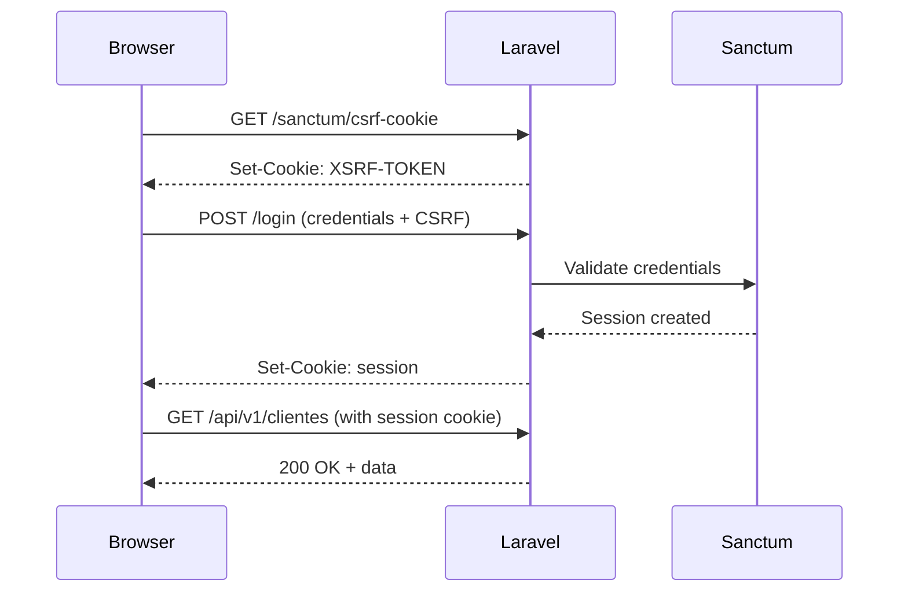

# Design de API

> Status: **Aprovado**
> Última atualização: 2025-12-28

---

## Visão Geral

Este documento define a arquitetura e padrões para a API REST do ERP Staccato em Laravel.

### Decisões Principais

| Aspecto       | Decisão               | Justificativa                               |
| ------------- | --------------------- | ------------------------------------------- |
| Estilo        | REST                  | Simplicidade, cacheabilidade, amplo suporte |
| Formato       | JSON                  | Padrão da indústria, suporte nativo Laravel |
| Especificação | OpenAPI 3.1           | Documentação auto-gerada, tipagem forte     |
| Versionamento | URL path (`/api/v1/`) | Explícito, fácil migração                   |
| Autenticação  | Laravel Sanctum       | SPA + API tokens em um só pacote            |
| Rate Limiting | Laravel nativo        | 60 req/min padrão, ajustável por rota       |

---

## Estrutura de URLs

### Padrão de Endpoints

```text
https://{host}/api/v1/{recurso}
https://{host}/api/v1/{recurso}/{id}
https://{host}/api/v1/{recurso}/{id}/{sub-recurso}
```

### Catálogo de Endpoints

#### Cadastros

| Método | Endpoint                          | Descrição              |
| ------ | --------------------------------- | ---------------------- |
| GET    | `/api/v1/clientes`                | Listar clientes        |
| POST   | `/api/v1/clientes`                | Criar cliente          |
| GET    | `/api/v1/clientes/{id}`           | Obter cliente          |
| PUT    | `/api/v1/clientes/{id}`           | Atualizar cliente      |
| DELETE | `/api/v1/clientes/{id}`           | Excluir cliente        |
| GET    | `/api/v1/clientes/{id}/enderecos` | Endereços do cliente   |
| POST   | `/api/v1/clientes/{id}/enderecos` | Adicionar endereço     |
| GET    | `/api/v1/fornecedores`            | Listar fornecedores    |
| POST   | `/api/v1/fornecedores`            | Criar fornecedor       |
| GET    | `/api/v1/fornecedores/{id}`       | Obter fornecedor       |
| PUT    | `/api/v1/fornecedores/{id}`       | Atualizar fornecedor   |
| GET    | `/api/v1/produtos`                | Listar produtos        |
| POST   | `/api/v1/produtos`                | Criar produto          |
| GET    | `/api/v1/produtos/{id}`           | Obter produto          |
| PUT    | `/api/v1/produtos/{id}`           | Atualizar produto      |
| GET    | `/api/v1/transportadoras`         | Listar transportadoras |
| POST   | `/api/v1/transportadoras`         | Criar transportadora   |
| GET    | `/api/v1/usuarios`                | Listar usuários        |
| POST   | `/api/v1/usuarios`                | Criar usuário          |

#### Vendas

| Método | Endpoint                                 | Descrição           |
| ------ | ---------------------------------------- | ------------------- |
| GET    | `/api/v1/orcamentos`                     | Listar orçamentos   |
| POST   | `/api/v1/orcamentos`                     | Criar orçamento     |
| GET    | `/api/v1/orcamentos/{id}`                | Obter orçamento     |
| PUT    | `/api/v1/orcamentos/{id}`                | Atualizar orçamento |
| POST   | `/api/v1/orcamentos/{id}/converter`      | Converter em venda  |
| GET    | `/api/v1/orcamentos/{id}/itens`          | Itens do orçamento  |
| POST   | `/api/v1/orcamentos/{id}/itens`          | Adicionar item      |
| PUT    | `/api/v1/orcamentos/{id}/itens/{itemId}` | Atualizar item      |
| DELETE | `/api/v1/orcamentos/{id}/itens/{itemId}` | Remover item        |
| GET    | `/api/v1/vendas`                         | Listar vendas       |
| GET    | `/api/v1/vendas/{id}`                    | Obter venda         |
| POST   | `/api/v1/vendas/{id}/cancelar`           | Cancelar venda      |
| POST   | `/api/v1/vendas/{id}/devolver`           | Iniciar devolução   |

#### Compras

| Método | Endpoint                                | Descrição           |
| ------ | --------------------------------------- | ------------------- |
| GET    | `/api/v1/pedidos-compra`                | Listar pedidos      |
| POST   | `/api/v1/pedidos-compra`                | Criar pedido        |
| GET    | `/api/v1/pedidos-compra/{id}`           | Obter pedido        |
| PUT    | `/api/v1/pedidos-compra/{id}`           | Atualizar pedido    |
| POST   | `/api/v1/pedidos-compra/{id}/confirmar` | Confirmar pedido    |
| POST   | `/api/v1/pedidos-compra/{id}/cancelar`  | Cancelar pedido     |
| GET    | `/api/v1/pedidos-compra/{id}/itens`     | Itens do pedido     |
| POST   | `/api/v1/pedidos-compra/importar-nfe`   | Importar de NFe XML |

#### Estoque

| Método | Endpoint                              | Descrição                  |
| ------ | ------------------------------------- | -------------------------- |
| GET    | `/api/v1/estoque`                     | Listar posições de estoque |
| GET    | `/api/v1/estoque/produto/{id}`        | Estoque por produto        |
| GET    | `/api/v1/estoque/lote/{id}`           | Detalhes do lote           |
| POST   | `/api/v1/estoque/reservar`            | Reservar estoque           |
| POST   | `/api/v1/estoque/consumir`            | Consumir estoque (FIFO)    |
| POST   | `/api/v1/estoque/liberar-reserva`     | Liberar reserva            |
| GET    | `/api/v1/galpao/blocos`               | Listar blocos              |
| GET    | `/api/v1/galpao/blocos/{id}/produtos` | Produtos no bloco          |
| POST   | `/api/v1/galpao/movimentar`           | Movimentar entre blocos    |

#### Financeiro

| Método | Endpoint                              | Descrição               |
| ------ | ------------------------------------- | ----------------------- |
| GET    | `/api/v1/contas-pagar`                | Listar contas a pagar   |
| POST   | `/api/v1/contas-pagar`                | Criar conta a pagar     |
| GET    | `/api/v1/contas-pagar/{id}`           | Obter conta             |
| POST   | `/api/v1/contas-pagar/{id}/pagar`     | Baixar pagamento        |
| GET    | `/api/v1/contas-receber`              | Listar contas a receber |
| POST   | `/api/v1/contas-receber`              | Criar conta a receber   |
| GET    | `/api/v1/contas-receber/{id}`         | Obter conta             |
| POST   | `/api/v1/contas-receber/{id}/receber` | Baixar recebimento      |
| POST   | `/api/v1/cnab/gerar`                  | Gerar arquivo CNAB      |
| POST   | `/api/v1/cnab/processar-retorno`      | Processar retorno       |
| GET    | `/api/v1/comissoes`                   | Listar comissões        |
| POST   | `/api/v1/comissoes/calcular`          | Calcular comissões      |

#### NFe

| Método | Endpoint                           | Descrição           |
| ------ | ---------------------------------- | ------------------- |
| GET    | `/api/v1/nfe`                      | Listar NFe          |
| POST   | `/api/v1/nfe`                      | Criar NFe           |
| GET    | `/api/v1/nfe/{id}`                 | Obter NFe           |
| POST   | `/api/v1/nfe/{id}/transmitir`      | Transmitir à SEFAZ  |
| POST   | `/api/v1/nfe/{id}/cancelar`        | Cancelar NFe        |
| GET    | `/api/v1/nfe/{id}/xml`             | Download XML        |
| GET    | `/api/v1/nfe/{id}/danfe`           | Download DANFE PDF  |
| POST   | `/api/v1/nfe/{id}/email`           | Enviar por email    |
| POST   | `/api/v1/nfe/{id}/carta-correcao`  | Emitir CC-e         |
| GET    | `/api/v1/nfe/manifestacao`         | NFe para manifestar |
| POST   | `/api/v1/nfe/manifestacao/{chave}` | Manifestar NFe      |

#### Logística

| Método | Endpoint                          | Descrição               |
| ------ | --------------------------------- | ----------------------- |
| GET    | `/api/v1/entregas`                | Listar entregas         |
| POST   | `/api/v1/entregas`                | Agendar entrega         |
| GET    | `/api/v1/entregas/{id}`           | Obter entrega           |
| PUT    | `/api/v1/entregas/{id}`           | Atualizar entrega       |
| POST   | `/api/v1/entregas/{id}/confirmar` | Confirmar entrega       |
| POST   | `/api/v1/entregas/{id}/foto`      | Upload de foto          |
| GET    | `/api/v1/veiculos`                | Listar veículos         |
| GET    | `/api/v1/rotas`                   | Listar rotas do dia     |
| POST   | `/api/v1/frete/calcular`          | Calcular frete          |
| GET    | `/api/v1/cep/{cep}`               | Buscar endereço por CEP |
| POST   | `/api/v1/geocodificar`            | Geocodificar endereço   |

#### Relatórios

| Método | Endpoint                        | Descrição              |
| ------ | ------------------------------- | ---------------------- |
| GET    | `/api/v1/relatorios/vendas`     | Relatório de vendas    |
| GET    | `/api/v1/relatorios/estoque`    | Relatório de estoque   |
| GET    | `/api/v1/relatorios/financeiro` | Relatório financeiro   |
| GET    | `/api/v1/relatorios/comissoes`  | Relatório de comissões |
| POST   | `/api/v1/relatorios/exportar`   | Exportar relatório     |

---

## Autenticação

### Laravel Sanctum

```php
// config/sanctum.php
return [
    'stateful' => explode(',', env('SANCTUM_STATEFUL_DOMAINS',
        sprintf('%s%s', 'localhost,localhost:3000,127.0.0.1',
                env('APP_URL') ? ','.parse_url(env('APP_URL'), PHP_URL_HOST) : '')
    )),
    'guard' => ['web'],
    'expiration' => 60 * 24 * 7, // 7 dias
    'token_prefix' => env('SANCTUM_TOKEN_PREFIX', ''),
];
```

### Fluxo de Autenticação SPA (Inertia)



### Fluxo de API Token

```php
// Criar token
$token = $user->createToken('api-token', ['*'])->plainTextToken;

// Header de requisição
Authorization: Bearer {token}

// Permissões granulares
$token = $user->createToken('readonly', ['read']);
$token = $user->createToken('financeiro', ['financeiro:*']);
```

### Middleware de Autenticação

```php
// routes/api.php
Route::middleware('auth:sanctum')->group(function () {
    // Rotas protegidas
    Route::apiResource('clientes', ClienteController::class);
    Route::apiResource('produtos', ProdutoController::class);

    // Rotas com permissões específicas
    Route::middleware('can:gerenciar-financeiro')->group(function () {
        Route::apiResource('contas-pagar', ContaPagarController::class);
    });
});
```

---

## Autorização

### Gates e Policies

```php
// app/Policies/VendaPolicy.php
class VendaPolicy
{
    public function view(User $user, Venda $venda): bool
    {
        return $user->loja_id === $venda->loja_id;
    }

    public function update(User $user, Venda $venda): bool
    {
        return $user->hasPermissionTo('vendas.editar')
            && $user->loja_id === $venda->loja_id;
    }

    public function cancel(User $user, Venda $venda): bool
    {
        return $user->hasPermissionTo('vendas.cancelar')
            && $venda->status !== VendaStatus::ENTREGUE;
    }

    public function applyDiscount(User $user, Venda $venda, float $percentual): bool
    {
        $limites = [
            'desconto.nivel1' => 5.0,
            'desconto.nivel2' => 10.0,
            'desconto.nivel3' => 15.0,
        ];

        foreach ($limites as $permissao => $limite) {
            if ($user->hasPermissionTo($permissao) && $percentual <= $limite) {
                return true;
            }
        }

        return $user->hasPermissionTo('desconto.ilimitado');
    }
}
```

### Multi-tenancy (loja_id)

```php
// app/Traits/BelongsToLoja.php
trait BelongsToLoja
{
    protected static function bootBelongsToLoja(): void
    {
        static::addGlobalScope('loja', function (Builder $builder) {
            if (auth()->check()) {
                $builder->where('loja_id', auth()->user()->loja_id);
            }
        });

        static::creating(function (Model $model) {
            if (auth()->check() && !$model->loja_id) {
                $model->loja_id = auth()->user()->loja_id;
            }
        });
    }
}
```

---

## Rate Limiting

### Configuração

```php
// app/Providers/AppServiceProvider.php
public function boot(): void
{
    RateLimiter::for('api', function (Request $request) {
        return Limit::perMinute(60)->by($request->user()?->id ?: $request->ip());
    });

    // Limites específicos por recurso
    RateLimiter::for('nfe', function (Request $request) {
        return Limit::perMinute(10)->by($request->user()->id);
    });

    RateLimiter::for('relatorios', function (Request $request) {
        return Limit::perMinute(5)->by($request->user()->id);
    });

    RateLimiter::for('geocodificacao', function (Request $request) {
        return Limit::perMinute(30)->by($request->user()->loja_id);
    });
}
```

### Headers de Resposta

```http
X-RateLimit-Limit: 60
X-RateLimit-Remaining: 57
X-RateLimit-Reset: 1640995200
Retry-After: 58  # Quando excedido
```

### Aplicação em Rotas

```php
Route::middleware(['auth:sanctum', 'throttle:nfe'])->group(function () {
    Route::post('/nfe/{id}/transmitir', [NfeController::class, 'transmitir']);
    Route::post('/nfe/{id}/cancelar', [NfeController::class, 'cancelar']);
});
```

---

## Formato de Resposta

### Estrutura Padrão de Sucesso

```json
{
  "data": {
    "id": 12345,
    "type": "cliente",
    "attributes": {
      "nome": "João Silva",
      "cpf": "123.456.789-00",
      "email": "joao@email.com",
      "telefone": "(11) 99999-9999",
      "created_at": "2025-01-15T10:30:00-03:00",
      "updated_at": "2025-01-15T10:30:00-03:00"
    },
    "relationships": {
      "enderecos": {
        "data": [
          { "id": 1, "type": "endereco" },
          { "id": 2, "type": "endereco" }
        ]
      }
    }
  },
  "meta": {
    "request_id": "req_abc123",
    "timestamp": "2025-01-15T10:30:00-03:00"
  }
}
```

### Estrutura de Coleção

```json
{
    "data": [
        {"id": 1, "type": "cliente", "attributes": {...}},
        {"id": 2, "type": "cliente", "attributes": {...}}
    ],
    "meta": {
        "current_page": 1,
        "per_page": 25,
        "total": 150,
        "total_pages": 6,
        "request_id": "req_abc123"
    },
    "links": {
        "first": "/api/v1/clientes?page=1",
        "prev": null,
        "next": "/api/v1/clientes?page=2",
        "last": "/api/v1/clientes?page=6"
    }
}
```

### Estrutura de Erro

```json
{
  "error": {
    "code": "VALIDATION_ERROR",
    "message": "Os dados fornecidos são inválidos",
    "details": [
      {
        "field": "cpf",
        "code": "INVALID_CPF",
        "message": "CPF inválido"
      },
      {
        "field": "email",
        "code": "ALREADY_EXISTS",
        "message": "Email já cadastrado"
      }
    ]
  },
  "meta": {
    "request_id": "req_abc123",
    "timestamp": "2025-01-15T10:30:00-03:00"
  }
}
```

### API Resource

```php
// app/Http/Resources/ClienteResource.php
class ClienteResource extends JsonResource
{
    public function toArray(Request $request): array
    {
        return [
            'id' => $this->id,
            'type' => 'cliente',
            'attributes' => [
                'nome' => $this->nome_razao,
                'cpf_cnpj' => $this->cpf_cnpj,
                'email' => $this->email,
                'telefone' => $this->tel,
                'credito_disponivel' => $this->credito,
                'created_at' => $this->created_at->toIso8601String(),
                'updated_at' => $this->updated_at->toIso8601String(),
            ],
            'relationships' => [
                'enderecos' => EnderecoResource::collection(
                    $this->whenLoaded('enderecos')
                ),
                'vendas' => [
                    'meta' => ['count' => $this->vendas_count],
                    'links' => ['related' => route('api.clientes.vendas', $this->id)],
                ],
            ],
        ];
    }
}
```

---

## Paginação, Filtros e Ordenação

### Query Parameters

```text
GET /api/v1/clientes?page=2&per_page=50&sort=-created_at&filter[cidade]=São Paulo&include=enderecos
```

| Parâmetro       | Descrição                  | Exemplo                    |
| --------------- | -------------------------- | -------------------------- |
| `page`          | Número da página           | `page=2`                   |
| `per_page`      | Itens por página (max 100) | `per_page=50`              |
| `sort`          | Ordenação (- para DESC)    | `sort=-created_at,nome`    |
| `filter[campo]` | Filtro por campo           | `filter[cidade]=SP`        |
| `include`       | Relacionamentos            | `include=enderecos,vendas` |
| `fields[tipo]`  | Campos específicos         | `fields[cliente]=id,nome`  |

### Implementação com Spatie Query Builder

```php
// app/Http/Controllers/Api/ClienteController.php
public function index(): AnonymousResourceCollection
{
    $clientes = QueryBuilder::for(Cliente::class)
        ->allowedFilters([
            AllowedFilter::exact('id'),
            AllowedFilter::partial('nome_razao'),
            AllowedFilter::exact('cpf_cnpj'),
            AllowedFilter::exact('cidade'),
            AllowedFilter::exact('uf'),
            AllowedFilter::scope('com_credito'),
            AllowedFilter::scope('ativos'),
        ])
        ->allowedSorts([
            'nome_razao',
            'created_at',
            'updated_at',
            'credito',
        ])
        ->allowedIncludes([
            'enderecos',
            'vendas',
            'contasReceber',
        ])
        ->defaultSort('-created_at')
        ->paginate(request()->input('per_page', 25));

    return ClienteResource::collection($clientes);
}
```

### Filtros Avançados

```bash
# Filtro por intervalo de datas
GET /api/v1/vendas?filter[data_venda][gte]=2025-01-01&filter[data_venda][lte]=2025-01-31

# Filtro por múltiplos valores
GET /api/v1/produtos?filter[fornecedor_id]=1,2,3

# Filtro por status
GET /api/v1/nfe?filter[status]=autorizada,cancelada

# Busca textual
GET /api/v1/clientes?search=joao silva
```

---

## Códigos de Erro

### Códigos HTTP

| Código | Significado           | Uso                                   |
| ------ | --------------------- | ------------------------------------- |
| 200    | OK                    | Sucesso em GET/PUT/PATCH              |
| 201    | Created               | Sucesso em POST                       |
| 204    | No Content            | Sucesso em DELETE                     |
| 400    | Bad Request           | Erro de sintaxe na requisição         |
| 401    | Unauthorized          | Não autenticado                       |
| 403    | Forbidden             | Sem permissão                         |
| 404    | Not Found             | Recurso não encontrado                |
| 409    | Conflict              | Conflito de estado (ex: já cancelado) |
| 422    | Unprocessable Entity  | Erro de validação                     |
| 429    | Too Many Requests     | Rate limit excedido                   |
| 500    | Internal Server Error | Erro interno                          |
| 503    | Service Unavailable   | Serviço indisponível (ACBr, SEFAZ)    |

### Códigos de Erro de Negócio

| Código                      | Descrição                    |
| --------------------------- | ---------------------------- |
| `VALIDATION_ERROR`          | Campos inválidos             |
| `RESOURCE_NOT_FOUND`        | Registro não encontrado      |
| `INSUFFICIENT_STOCK`        | Estoque insuficiente         |
| `INSUFFICIENT_CREDIT`       | Crédito insuficiente         |
| `INVALID_STATUS_TRANSITION` | Transição de status inválida |
| `DUPLICATE_ENTRY`           | Registro duplicado           |
| `BUSINESS_RULE_VIOLATION`   | Regra de negócio violada     |
| `EXTERNAL_SERVICE_ERROR`    | Erro em serviço externo      |
| `NFE_REJECTED`              | NFe rejeitada pela SEFAZ     |
| `PAYMENT_FAILED`            | Falha no pagamento           |
| `AUTHORIZATION_REQUIRED`    | Requer autorização superior  |

### Handler de Exceções

```php
// app/Exceptions/Handler.php
public function render($request, Throwable $e): Response
{
    if ($request->expectsJson()) {
        return $this->renderJsonException($request, $e);
    }

    return parent::render($request, $e);
}

protected function renderJsonException(Request $request, Throwable $e): JsonResponse
{
    $status = match (true) {
        $e instanceof ValidationException => 422,
        $e instanceof AuthenticationException => 401,
        $e instanceof AuthorizationException => 403,
        $e instanceof ModelNotFoundException => 404,
        $e instanceof BusinessRuleException => 422,
        $e instanceof ExternalServiceException => 503,
        default => 500,
    };

    $response = [
        'error' => [
            'code' => $this->getErrorCode($e),
            'message' => $e->getMessage(),
        ],
        'meta' => [
            'request_id' => request()->header('X-Request-ID', Str::uuid()),
            'timestamp' => now()->toIso8601String(),
        ],
    ];

    if ($e instanceof ValidationException) {
        $response['error']['details'] = collect($e->errors())
            ->map(fn($messages, $field) => [
                'field' => $field,
                'messages' => $messages,
            ])
            ->values()
            ->all();
    }

    if (config('app.debug')) {
        $response['debug'] = [
            'exception' => get_class($e),
            'file' => $e->getFile(),
            'line' => $e->getLine(),
            'trace' => collect($e->getTrace())->take(10)->all(),
        ];
    }

    return response()->json($response, $status);
}
```

---

## Webhooks

### Eventos Disponíveis

| Evento               | Payload         | Trigger                   |
| -------------------- | --------------- | ------------------------- |
| `venda.criada`       | Venda completa  | Nova venda confirmada     |
| `venda.cancelada`    | Venda + motivo  | Venda cancelada           |
| `nfe.autorizada`     | NFe + chave     | NFe autorizada pela SEFAZ |
| `nfe.rejeitada`      | NFe + erros     | NFe rejeitada pela SEFAZ  |
| `entrega.confirmada` | Entrega + fotos | Entrega confirmada        |
| `pagamento.recebido` | Conta + valor   | Pagamento baixado         |
| `estoque.baixo`      | Produto + qtd   | Estoque abaixo do mínimo  |

### Configuração de Webhook

```php
// app/Models/Webhook.php
class Webhook extends Model
{
    protected $fillable = [
        'loja_id',
        'url',
        'eventos',
        'secret',
        'ativo',
    ];

    protected $casts = [
        'eventos' => 'array',
        'ativo' => 'boolean',
    ];
}
```

### Dispatch de Webhook

```php
// app/Jobs/DispatchWebhook.php
class DispatchWebhook implements ShouldQueue
{
    use Queueable, SerializesModels;

    public function __construct(
        public Webhook $webhook,
        public string $evento,
        public array $payload,
    ) {}

    public function handle(): void
    {
        $signature = hash_hmac('sha256', json_encode($this->payload), $this->webhook->secret);

        $response = Http::timeout(30)
            ->withHeaders([
                'Content-Type' => 'application/json',
                'X-Webhook-Event' => $this->evento,
                'X-Webhook-Signature' => $signature,
                'X-Webhook-Timestamp' => now()->timestamp,
            ])
            ->post($this->webhook->url, [
                'evento' => $this->evento,
                'data' => $this->payload,
                'timestamp' => now()->toIso8601String(),
            ]);

        WebhookLog::create([
            'webhook_id' => $this->webhook->id,
            'evento' => $this->evento,
            'payload' => $this->payload,
            'response_status' => $response->status(),
            'response_body' => $response->body(),
        ]);

        if ($response->failed()) {
            throw new WebhookDeliveryException($response);
        }
    }

    public function backoff(): array
    {
        return [60, 300, 900]; // 1min, 5min, 15min
    }
}
```

### Payload de Exemplo

```json
{
  "evento": "nfe.autorizada",
  "data": {
    "nfe": {
      "id": 12345,
      "numero": "000012345",
      "serie": "1",
      "chave": "35250112345678000199550010000123451234567890",
      "status": "autorizada",
      "protocolo": "135250000123456",
      "data_autorizacao": "2025-01-15T10:30:00-03:00"
    },
    "venda": {
      "id": 9876,
      "valor_total": 1500.0
    }
  },
  "timestamp": "2025-01-15T10:30:05-03:00"
}
```

---

## Documentação OpenAPI

### Geração com L5-Swagger

```php
// config/l5-swagger.php
return [
    'default' => 'default',
    'documentations' => [
        'default' => [
            'api' => [
                'title' => 'ERP Staccato API',
                'description' => 'API REST do sistema ERP Staccato',
                'version' => '1.0.0',
            ],
            'routes' => [
                'api' => 'api/documentation',
                'docs' => 'docs',
            ],
            'paths' => [
                'docs' => storage_path('api-docs'),
                'annotations' => [
                    base_path('app/Http/Controllers/Api'),
                ],
            ],
        ],
    ],
];
```

### Anotações no Controller

```php
/**
 * @OA\Get(
 *     path="/api/v1/clientes",
 *     operationId="getClientes",
 *     tags={"Clientes"},
 *     summary="Listar clientes",
 *     description="Retorna lista paginada de clientes",
 *     security={{"sanctum":{}}},
 *     @OA\Parameter(
 *         name="page",
 *         in="query",
 *         description="Número da página",
 *         required=false,
 *         @OA\Schema(type="integer", default=1)
 *     ),
 *     @OA\Parameter(
 *         name="per_page",
 *         in="query",
 *         description="Itens por página",
 *         required=false,
 *         @OA\Schema(type="integer", default=25, maximum=100)
 *     ),
 *     @OA\Response(
 *         response=200,
 *         description="Sucesso",
 *         @OA\JsonContent(
 *             @OA\Property(property="data", type="array",
 *                 @OA\Items(ref="#/components/schemas/Cliente")
 *             ),
 *             @OA\Property(property="meta", ref="#/components/schemas/PaginationMeta")
 *         )
 *     ),
 *     @OA\Response(response=401, ref="#/components/responses/Unauthorized"),
 *     @OA\Response(response=403, ref="#/components/responses/Forbidden")
 * )
 */
public function index(): AnonymousResourceCollection
{
    // ...
}
```

### Schema de Modelo

```php
/**
 * @OA\Schema(
 *     schema="Cliente",
 *     required={"id", "nome_razao"},
 *     @OA\Property(property="id", type="integer", example=1),
 *     @OA\Property(property="nome_razao", type="string", example="João Silva"),
 *     @OA\Property(property="cpf_cnpj", type="string", example="123.456.789-00"),
 *     @OA\Property(property="email", type="string", format="email"),
 *     @OA\Property(property="telefone", type="string", example="(11) 99999-9999"),
 *     @OA\Property(property="credito", type="number", format="float", example=1500.00),
 *     @OA\Property(property="created_at", type="string", format="date-time"),
 *     @OA\Property(property="updated_at", type="string", format="date-time")
 * )
 */
class Cliente extends Model
{
    // ...
}
```

---

## Integrações Externas

### Padrão de Cliente HTTP

```php
// app/Services/Integrations/BaseIntegration.php
abstract class BaseIntegration
{
    protected PendingRequest $http;
    protected string $baseUrl;

    public function __construct()
    {
        $this->http = Http::baseUrl($this->baseUrl)
            ->timeout(30)
            ->retry(3, 100, fn($e) => $e instanceof ConnectionException)
            ->withHeaders([
                'Accept' => 'application/json',
                'User-Agent' => 'ERP-Staccato/1.0',
            ]);
    }

    protected function handleResponse(Response $response): array
    {
        if ($response->failed()) {
            Log::error('Integração falhou', [
                'service' => static::class,
                'status' => $response->status(),
                'body' => $response->body(),
            ]);

            throw new ExternalServiceException(
                "Erro na integração: {$response->status()}"
            );
        }

        return $response->json();
    }
}
```

### Google Maps Geocoding

```php
// app/Services/Integrations/GoogleMapsService.php
class GoogleMapsService extends BaseIntegration
{
    protected string $baseUrl = 'https://maps.googleapis.com/maps/api';

    public function geocode(string $endereco): ?array
    {
        $response = $this->http->get('/geocode/json', [
            'address' => $endereco,
            'key' => config('services.google.maps_api_key'),
            'language' => 'pt-BR',
            'region' => 'br',
        ]);

        $data = $this->handleResponse($response);

        if ($data['status'] !== 'OK' || empty($data['results'])) {
            return null;
        }

        $location = $data['results'][0]['geometry']['location'];

        return [
            'latitude' => $location['lat'],
            'longitude' => $location['lng'],
            'endereco_formatado' => $data['results'][0]['formatted_address'],
        ];
    }
}
```

### QualP Cálculo de Frete

```php
// app/Services/Integrations/QualPService.php
class QualPService extends BaseIntegration
{
    public function calcularRota(
        string $origem,
        string $destino,
        int $eixos,
        float $precoCombustivel,
        float $consumoCombustivel,
    ): ?array {
        $loja = auth()->user()->loja;

        $url = str_replace(
            ['_origem_', '_destino_', '_eixos_', '_preco_combustivel_', '_consumo_combustivel_'],
            [urlencode($origem), urlencode($destino), $eixos, $precoCombustivel, $consumoCombustivel],
            $loja->api_qualp
        );

        $response = Http::withHeaders(
            collect(explode("\n", $loja->cabecalhos_qualp))
                ->mapWithKeys(fn($h) => explode(':', $h, 2))
                ->all()
        )->get($url);

        $data = $this->handleResponse($response);

        if (empty($data['rotas'])) {
            return null;
        }

        $summary = $data['rotas'][0]['summary'];

        return [
            'distancia_km' => $summary['raw']['distance'] / 1000,
            'consumo_litros' => $summary['raw']['consumption'],
            'pedagios' => $summary['raw']['tolls'],
            'distancia_formatada' => $summary['fmt']['distance'],
            'consumo_formatado' => $summary['fmt']['consumption'],
            'pedagios_formatado' => $summary['fmt']['tolls'],
        ];
    }
}
```

### Cache de Respostas

```php
// app/Services/Integrations/CepService.php
class CepService extends BaseIntegration
{
    public function buscar(string $cep): ?array
    {
        $cep = preg_replace('/\D/', '', $cep);

        // 1. Busca no banco local
        $endereco = Cep::find($cep);
        if ($endereco) {
            return $endereco->toArray();
        }

        // 2. Fallback para APIs externas com cache
        return Cache::remember("cep:{$cep}", now()->addDays(30), function () use ($cep) {
            return $this->buscarViaCep($cep) ?? $this->buscarBrasilApi($cep);
        });
    }

    protected function buscarViaCep(string $cep): ?array
    {
        try {
            $response = Http::get("https://viacep.com.br/ws/{$cep}/json/");
            $data = $response->json();

            if (isset($data['erro'])) {
                return null;
            }

            return [
                'cep' => $cep,
                'logradouro' => $data['logradouro'],
                'bairro' => $data['bairro'],
                'cidade' => $data['localidade'],
                'uf' => $data['uf'],
            ];
        } catch (Exception $e) {
            Log::warning('ViaCEP falhou', ['cep' => $cep, 'error' => $e->getMessage()]);
            return null;
        }
    }
}
```

---

## Versionamento

### Estratégia de Versionamento

| Versão | Status    | Suporte até |
| ------ | --------- | ----------- |
| v1     | Ativa     | -           |
| v2     | Planejada | -           |

### Regras de Versionamento

1. **Breaking changes** requerem nova versão major
2. **Adições** (novos campos, endpoints) são permitidas em versão atual
3. **Depreciação** anunciada com 6 meses de antecedência
4. **Remoção** apenas em nova versão major

### Detecção de Versão

```php
// app/Http/Middleware/ApiVersion.php
class ApiVersion
{
    public function handle(Request $request, Closure $next): Response
    {
        $version = $request->segment(2); // /api/v1/...

        if (!in_array($version, ['v1'])) {
            return response()->json([
                'error' => [
                    'code' => 'INVALID_API_VERSION',
                    'message' => "Versão de API inválida: {$version}",
                ],
            ], 400);
        }

        config(['api.version' => $version]);

        return $next($request);
    }
}
```

### Headers de Depreciação

```http
Deprecation: true
Sunset: Sat, 01 Jan 2026 00:00:00 GMT
Link: </api/v2/clientes>; rel="successor-version"
```

---

## Testes de API

### Estrutura de Testes

```php
// tests/Feature/Api/ClienteApiTest.php
class ClienteApiTest extends TestCase
{
    use RefreshDatabase;

    protected User $user;

    protected function setUp(): void
    {
        parent::setUp();
        $this->user = User::factory()->create();
    }

    public function test_listar_clientes_requer_autenticacao(): void
    {
        $this->getJson('/api/v1/clientes')
            ->assertUnauthorized();
    }

    public function test_listar_clientes_retorna_paginado(): void
    {
        Cliente::factory()->count(30)->create(['loja_id' => $this->user->loja_id]);

        $this->actingAs($this->user)
            ->getJson('/api/v1/clientes?per_page=10')
            ->assertOk()
            ->assertJsonCount(10, 'data')
            ->assertJsonStructure([
                'data' => [
                    '*' => ['id', 'type', 'attributes' => ['nome', 'cpf_cnpj']],
                ],
                'meta' => ['current_page', 'per_page', 'total'],
                'links',
            ]);
    }

    public function test_criar_cliente_com_dados_validos(): void
    {
        $payload = [
            'nome_razao' => 'João Silva',
            'cpf_cnpj' => '123.456.789-09',
            'email' => 'joao@email.com',
        ];

        $this->actingAs($this->user)
            ->postJson('/api/v1/clientes', $payload)
            ->assertCreated()
            ->assertJsonPath('data.attributes.nome', 'João Silva');

        $this->assertDatabaseHas('cliente', [
            'nome_razao' => 'João Silva',
            'loja_id' => $this->user->loja_id,
        ]);
    }

    public function test_criar_cliente_com_cpf_invalido_falha(): void
    {
        $payload = [
            'nome_razao' => 'João Silva',
            'cpf_cnpj' => '111.111.111-11',
        ];

        $this->actingAs($this->user)
            ->postJson('/api/v1/clientes', $payload)
            ->assertUnprocessable()
            ->assertJsonPath('error.details.0.field', 'cpf_cnpj');
    }

    public function test_cliente_nao_acessivel_por_outra_loja(): void
    {
        $cliente = Cliente::factory()->create(['loja_id' => 999]);

        $this->actingAs($this->user)
            ->getJson("/api/v1/clientes/{$cliente->id}")
            ->assertNotFound();
    }
}
```

### Testes de Contrato

```php
// tests/Contract/ClienteContractTest.php
class ClienteContractTest extends TestCase
{
    public function test_cliente_resource_segue_schema(): void
    {
        $cliente = Cliente::factory()->create();
        $resource = new ClienteResource($cliente);

        $schema = json_decode(
            file_get_contents(base_path('docs/schemas/cliente.json')),
            true
        );

        $this->assertMatchesJsonSchema($resource->toArray(request()), $schema);
    }
}
```

---

## Checklist de Implementação

- [ ] Configurar Laravel Sanctum
- [ ] Criar API Resources para todos os modelos
- [ ] Implementar Query Builder com filtros/ordenação
- [ ] Configurar rate limiting por endpoint
- [ ] Criar exception handler para API
- [ ] Configurar L5-Swagger
- [ ] Documentar todos os endpoints com OpenAPI
- [ ] Criar sistema de webhooks
- [ ] Implementar cache para integrações externas
- [ ] Criar testes de API para todos os endpoints

---

## Documentos Relacionados

- [01-arquitetura.md](./01-arquitetura.md) - Arquitetura geral
- [05-seguranca.md](./05-seguranca.md) - Segurança e autenticação
- [09-integracoes.md](./09-integracoes.md) - Integrações externas
- [17-validacao.md](./17-validacao.md) - Estratégia de validação
