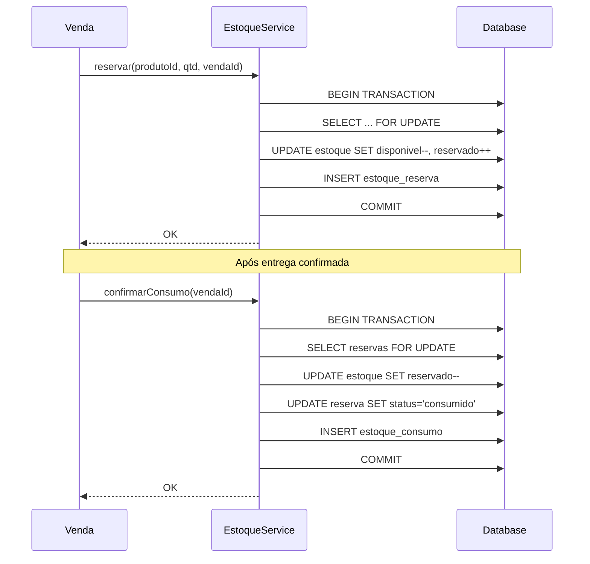

# Estratégia de Concorrência

> Status: **Aprovado**
> Última atualização: 2025-12-28

---

## Visão Geral

Este documento define a estratégia de tratamento de concorrência para o ERP Staccato em Laravel, abordando cenários onde múltiplos usuários podem modificar os mesmos recursos simultaneamente.

### Problemas Identificados no Sistema Atual (C++)

| Problema                      | Impacto                 | Prioridade |
| ----------------------------- | ----------------------- | ---------- |
| Estoque sem locking           | Overallocation possível | Crítica    |
| Crédito com read-modify-write | Lost updates            | Alta       |
| Sem optimistic locking        | Sobrescrita silenciosa  | Alta       |
| ID reservation não atômico    | Colisão de IDs          | Média      |
| estoque_has_consumo não único | Dados duplicados        | Média      |

---

## Padrões de Concorrência

### 1. Optimistic Locking (Padrão Geral)

Para edição de registros, usamos **optimistic locking** com campo `updated_at`.

```php
// app/Models/Concerns/HasOptimisticLocking.php
namespace App\Models\Concerns;

use App\Exceptions\StaleModelException;
use Illuminate\Database\Eloquent\Model;

trait HasOptimisticLocking
{
    protected bool $checkConcurrency = true;

    public static function bootHasOptimisticLocking(): void
    {
        static::updating(function (Model $model) {
            if (!$model->checkConcurrency) {
                return;
            }

            $original = $model->getOriginal('updated_at');
            $current = static::where($model->getKeyName(), $model->getKey())
                ->value('updated_at');

            if ($original && $current && $original->ne($current)) {
                throw new StaleModelException(
                    model: $model,
                    message: 'O registro foi modificado por outro usuário'
                );
            }
        });
    }

    public function withoutConcurrencyCheck(): static
    {
        $this->checkConcurrency = false;
        return $this;
    }
}

// app/Exceptions/StaleModelException.php
namespace App\Exceptions;

use Illuminate\Database\Eloquent\Model;

class StaleModelException extends BusinessException
{
    public function __construct(
        public readonly Model $model,
        string $message = 'Registro modificado por outro usuário'
    ) {
        parent::__construct(
            message: $message,
            errorCode: 'STALE_MODEL',
            context: [
                'model' => get_class($model),
                'id' => $model->getKey(),
            ]
        );
    }
}
```

### Uso no Controller

```php
// app/Http/Controllers/Api/ClienteController.php
public function update(UpdateClienteRequest $request, Cliente $cliente): ClienteResource
{
    // Frontend envia updated_at original
    $cliente->updated_at = Carbon::parse($request->input('_updated_at'));

    try {
        $cliente->update($request->validated());
        return new ClienteResource($cliente->fresh());
    } catch (StaleModelException $e) {
        return response()->json([
            'error' => [
                'code' => 'STALE_MODEL',
                'message' => 'Este registro foi modificado por outro usuário.',
                'current_data' => new ClienteResource($cliente->fresh()),
            ],
        ], 409);
    }
}
```

### Frontend (Vue)

```vue
<script setup>
import { ref } from "vue";
import { router } from "@inertiajs/vue3";

const props = defineProps({
  cliente: Object,
});

const form = ref({
  ...props.cliente,
  _updated_at: props.cliente.updated_at, // Guardar versão original
});

const submit = () => {
  router.put(`/api/v1/clientes/${props.cliente.id}`, form.value, {
    onError: (errors) => {
      if (errors.code === "STALE_MODEL") {
        // Mostrar modal de conflito
        showConflictModal(errors.current_data);
      }
    },
  });
};

const showConflictModal = (currentData) => {
  // Modal com opções:
  // 1. Descartar minhas alterações (recarregar)
  // 2. Forçar minhas alterações (sobrescrever)
  // 3. Mesclar manualmente
};
</script>
```

---

### 2. Pessimistic Locking (Estoque)

Para operações de estoque, usamos **pessimistic locking** com `SELECT FOR UPDATE`.

```php
// app/Services/Estoque/EstoqueService.php
namespace App\Services\Estoque;

use App\Models\Estoque;
use App\Exceptions\InsufficientStockException;
use Illuminate\Support\Facades\DB;

class EstoqueService
{
    /**
     * Reserva estoque para uma venda (two-phase commit)
     */
    public function reservar(int $produtoId, int $quantidade, int $vendaId): void
    {
        DB::transaction(function () use ($produtoId, $quantidade, $vendaId) {
            // Lock pessimista - bloqueia linhas até commit
            $lotes = Estoque::where('produto_id', $produtoId)
                ->where('disponivel', '>', 0)
                ->orderBy('data_entrada') // FIFO
                ->lockForUpdate() // SELECT FOR UPDATE
                ->get();

            $totalDisponivel = $lotes->sum('disponivel');

            if ($totalDisponivel < $quantidade) {
                throw new InsufficientStockException(
                    produtoId: $produtoId,
                    solicitado: $quantidade,
                    disponivel: $totalDisponivel
                );
            }

            $restante = $quantidade;

            foreach ($lotes as $lote) {
                if ($restante <= 0) break;

                $consumir = min($lote->disponivel, $restante);

                // Atualizar estoque
                $lote->decrement('disponivel', $consumir);
                $lote->increment('reservado', $consumir);

                // Criar registro de reserva
                EstoqueReserva::create([
                    'estoque_id' => $lote->id,
                    'venda_id' => $vendaId,
                    'quantidade' => $consumir,
                    'status' => 'reservado',
                ]);

                $restante -= $consumir;
            }
        });
    }

    /**
     * Confirma consumo (após entrega)
     */
    public function confirmarConsumo(int $vendaId): void
    {
        DB::transaction(function () use ($vendaId) {
            $reservas = EstoqueReserva::where('venda_id', $vendaId)
                ->where('status', 'reservado')
                ->lockForUpdate()
                ->get();

            foreach ($reservas as $reserva) {
                $reserva->estoque->decrement('reservado', $reserva->quantidade);

                $reserva->update(['status' => 'consumido']);

                EstoqueConsumo::create([
                    'estoque_id' => $reserva->estoque_id,
                    'venda_id' => $vendaId,
                    'quantidade' => $reserva->quantidade,
                ]);
            }
        });
    }

    /**
     * Libera reserva (cancelamento)
     */
    public function liberarReserva(int $vendaId): void
    {
        DB::transaction(function () use ($vendaId) {
            $reservas = EstoqueReserva::where('venda_id', $vendaId)
                ->where('status', 'reservado')
                ->lockForUpdate()
                ->get();

            foreach ($reservas as $reserva) {
                $reserva->estoque->increment('disponivel', $reserva->quantidade);
                $reserva->estoque->decrement('reservado', $reserva->quantidade);

                $reserva->update(['status' => 'liberado']);
            }
        });
    }
}
```

### Fluxo de Reserva vs Consumo



---

### 3. Atomic Updates (Crédito do Cliente)

Para campos numéricos que sofrem incrementos/decrementos, usamos **atomic updates**.

```php
// app/Services/Cliente/CreditoService.php
namespace App\Services\Cliente;

use App\Models\Cliente;
use App\Exceptions\InsufficientCreditException;
use Illuminate\Support\Facades\DB;

class CreditoService
{
    /**
     * Usa crédito do cliente (atomic decrement)
     */
    public function usar(Cliente $cliente, float $valor, string $referencia): void
    {
        DB::transaction(function () use ($cliente, $valor, $referencia) {
            // Lock e verificação atômica
            $creditoAtual = Cliente::where('id', $cliente->id)
                ->lockForUpdate()
                ->value('credito');

            if ($creditoAtual < $valor) {
                throw new InsufficientCreditException(
                    clienteId: $cliente->id,
                    solicitado: $valor,
                    disponivel: $creditoAtual
                );
            }

            // Decrement atômico (não usa model para evitar race condition)
            DB::table('cliente')
                ->where('id', $cliente->id)
                ->decrement('credito', $valor);

            // Log da movimentação
            CreditoMovimentacao::create([
                'cliente_id' => $cliente->id,
                'tipo' => 'uso',
                'valor' => -$valor,
                'referencia' => $referencia,
                'saldo_apos' => $creditoAtual - $valor,
            ]);
        });
    }

    /**
     * Adiciona crédito (devolução, bônus, etc.)
     */
    public function adicionar(Cliente $cliente, float $valor, string $referencia): void
    {
        DB::transaction(function () use ($cliente, $valor, $referencia) {
            // Increment atômico
            DB::table('cliente')
                ->where('id', $cliente->id)
                ->increment('credito', $valor);

            $novoSaldo = Cliente::find($cliente->id)->credito;

            CreditoMovimentacao::create([
                'cliente_id' => $cliente->id,
                'tipo' => 'adicao',
                'valor' => $valor,
                'referencia' => $referencia,
                'saldo_apos' => $novoSaldo,
            ]);
        });
    }
}
```

---

### 4. Queue-Based Processing

Para operações pesadas e críticas, usamos **filas** para serialização.

```php
// app/Jobs/ProcessarVendaJob.php
namespace App\Jobs;

use App\Models\Venda;
use App\Services\Estoque\EstoqueService;
use App\Services\Financeiro\ContaReceberService;
use Illuminate\Bus\Queueable;
use Illuminate\Contracts\Queue\ShouldBeUnique;
use Illuminate\Contracts\Queue\ShouldQueue;
use Illuminate\Foundation\Bus\Dispatchable;
use Illuminate\Queue\InteractsWithQueue;
use Illuminate\Queue\SerializesModels;

class ProcessarVendaJob implements ShouldQueue, ShouldBeUnique
{
    use Dispatchable, InteractsWithQueue, Queueable, SerializesModels;

    public function __construct(
        public readonly Venda $venda
    ) {}

    /**
     * Unique ID previne jobs duplicados para mesma venda
     */
    public function uniqueId(): string
    {
        return 'venda:' . $this->venda->id;
    }

    /**
     * Lock por 5 minutos
     */
    public int $uniqueFor = 300;

    public function handle(
        EstoqueService $estoqueService,
        ContaReceberService $contaReceberService
    ): void {
        DB::transaction(function () use ($estoqueService, $contaReceberService) {
            // 1. Reservar estoque
            foreach ($this->venda->itens as $item) {
                $estoqueService->reservar(
                    produtoId: $item->produto_id,
                    quantidade: $item->quantidade,
                    vendaId: $this->venda->id
                );
            }

            // 2. Criar contas a receber
            $contaReceberService->criarParaVenda($this->venda);

            // 3. Atualizar status
            $this->venda->update(['status' => VendaStatus::CONFIRMADA]);
        });
    }

    public function failed(\Throwable $exception): void
    {
        // Notificar falha
        $this->venda->update(['status' => VendaStatus::ERRO_PROCESSAMENTO]);

        Log::error('Falha ao processar venda', [
            'venda_id' => $this->venda->id,
            'error' => $exception->getMessage(),
        ]);
    }
}
```

### Configuração de Filas

```php
// config/queue.php
'connections' => [
    'redis' => [
        'driver' => 'redis',
        'connection' => 'default',
        'queue' => env('REDIS_QUEUE', 'default'),
        'retry_after' => 90,
        'block_for' => null,
        'after_commit' => true, // Importante: só dispatch após commit
    ],
],

// Filas separadas por prioridade
'queues' => [
    'critical',  // NFe, pagamentos
    'high',      // Vendas, estoque
    'default',   // Relatórios, emails
    'low',       // Logs, analytics
],
```

---

### 5. Database Locks

#### Tabela de Locks para Operações Longas

```php
// database/migrations/create_locks_table.php
Schema::create('locks', function (Blueprint $table) {
    $table->id();
    $table->string('lockable_type');
    $table->unsignedBigInteger('lockable_id');
    $table->unsignedBigInteger('user_id');
    $table->string('reason')->nullable();
    $table->timestamp('locked_at');
    $table->timestamp('expires_at');
    $table->timestamps();

    $table->unique(['lockable_type', 'lockable_id']);
    $table->index('expires_at');
});

// app/Services/LockService.php
namespace App\Services;

use App\Models\Lock;
use App\Exceptions\ResourceLockedException;

class LockService
{
    public function acquire(
        string $type,
        int $id,
        int $userId,
        int $durationMinutes = 15,
        ?string $reason = null
    ): Lock {
        // Limpar locks expirados
        Lock::where('expires_at', '<', now())->delete();

        // Verificar se já está bloqueado
        $existing = Lock::where('lockable_type', $type)
            ->where('lockable_id', $id)
            ->first();

        if ($existing && $existing->user_id !== $userId) {
            throw new ResourceLockedException(
                type: $type,
                id: $id,
                lockedBy: $existing->user,
                expiresAt: $existing->expires_at
            );
        }

        // Criar ou atualizar lock
        return Lock::updateOrCreate(
            ['lockable_type' => $type, 'lockable_id' => $id],
            [
                'user_id' => $userId,
                'reason' => $reason,
                'locked_at' => now(),
                'expires_at' => now()->addMinutes($durationMinutes),
            ]
        );
    }

    public function release(string $type, int $id, int $userId): bool
    {
        return Lock::where('lockable_type', $type)
            ->where('lockable_id', $id)
            ->where('user_id', $userId)
            ->delete() > 0;
    }

    public function extend(string $type, int $id, int $userId, int $minutes = 15): bool
    {
        return Lock::where('lockable_type', $type)
            ->where('lockable_id', $id)
            ->where('user_id', $userId)
            ->update(['expires_at' => now()->addMinutes($minutes)]) > 0;
    }

    public function isLocked(string $type, int $id): bool
    {
        return Lock::where('lockable_type', $type)
            ->where('lockable_id', $id)
            ->where('expires_at', '>', now())
            ->exists();
    }
}
```

### Uso em Edição de Orçamento

```php
// app/Http/Controllers/OrcamentoController.php
public function edit(Orcamento $orcamento, LockService $lockService): Response
{
    try {
        $lock = $lockService->acquire(
            type: Orcamento::class,
            id: $orcamento->id,
            userId: auth()->id(),
            durationMinutes: 30,
            reason: 'Editando orçamento'
        );

        return Inertia::render('Orcamentos/Edit', [
            'orcamento' => new OrcamentoResource($orcamento),
            'lock' => $lock,
        ]);
    } catch (ResourceLockedException $e) {
        return back()->with('error',
            "Este orçamento está sendo editado por {$e->lockedBy->nome}."
        );
    }
}

public function update(UpdateOrcamentoRequest $request, Orcamento $orcamento): Response
{
    // Verificar se ainda tem o lock
    if (!$this->lockService->isLockedBy($orcamento, auth()->id())) {
        return back()->with('error', 'Seu lock expirou. Recarregue a página.');
    }

    $orcamento->update($request->validated());

    $this->lockService->release(Orcamento::class, $orcamento->id, auth()->id());

    return redirect()->route('orcamentos.show', $orcamento);
}
```

---

## Cenários de Race Condition

### Cenário 1: Venda Simultânea do Mesmo Produto

```text
Usuário A                    Usuário B
    |                            |
    |-- Verifica estoque: 5      |
    |                            |-- Verifica estoque: 5
    |-- Reserva 3 unidades       |
    |                            |-- Reserva 4 unidades
    |-- Commit ✓                 |
    |                            |-- Commit ✗ (estoque insuficiente)
```

**Solução:** `SELECT FOR UPDATE` serializa as verificações.

### Cenário 2: Edição Simultânea de Cliente

```text
Usuário A                    Usuário B
    |                            |
    |-- Abre cliente (v1)        |
    |                            |-- Abre cliente (v1)
    |-- Edita telefone           |
    |                            |-- Edita email
    |-- Salva ✓                  |
    |   (updated_at = v2)        |
    |                            |-- Salva ✗ (conflito v1 ≠ v2)
    |                            |-- Modal: resolver conflito
```

**Solução:** Optimistic locking com `updated_at`.

### Cenario 3: Devolucao Simultanea

```text
Usuario A                    Usuario B
    |                            |
    |-- Inicia devolução         |
    |   venda #123               |-- Inicia devolução
    |                            |   venda #123
    |-- Lock acquired ✓          |
    |                            |-- Lock failed ✗
    |                            |   (mensagem: "Em processamento")
    |-- Processa devolução       |
    |-- Release lock             |
```

**Solução:** Lock de recurso com expiração.

---

## Configurações de Banco

### Isolation Level

```php
// config/database.php
'mysql' => [
    // ...
    'options' => [
        PDO::MYSQL_ATTR_INIT_COMMAND => "
            SET SESSION TRANSACTION ISOLATION LEVEL READ COMMITTED
        ",
    ],
],
```

| Level           | Uso           | Trade-off                                   |
| --------------- | ------------- | ------------------------------------------- |
| READ COMMITTED  | Padrão        | Boa performance, phantom reads possíveis    |
| REPEATABLE READ | Relatórios    | Mais locks, dados consistentes na transação |
| SERIALIZABLE    | Crítico (NFe) | Máxima consistência, menor throughput       |

### Timeout de Lock

```sql
-- my.cnf
[mysqld]
innodb_lock_wait_timeout = 10
```

```php
// Para operações específicas
DB::statement('SET innodb_lock_wait_timeout = 30');
```

---

## Tratamento de Deadlocks

```php
// app/Support/Database/RetryOnDeadlock.php
namespace App\Support\Database;

use Illuminate\Support\Facades\DB;
use Illuminate\Database\DeadlockException;

class RetryOnDeadlock
{
    public static function execute(callable $callback, int $maxAttempts = 3): mixed
    {
        $attempts = 0;

        while (true) {
            try {
                return DB::transaction($callback);
            } catch (DeadlockException $e) {
                $attempts++;

                if ($attempts >= $maxAttempts) {
                    throw $e;
                }

                // Backoff exponencial
                usleep(100000 * pow(2, $attempts)); // 200ms, 400ms, 800ms
            }
        }
    }
}

// Uso
RetryOnDeadlock::execute(function () use ($venda) {
    // Operação que pode causar deadlock
    $this->estoqueService->reservar(...);
    $this->financeiroService->criar(...);
});
```

---

## Monitoramento

### Logs de Concorrência

```php
// app/Listeners/LogConcurrencyEvent.php
class LogConcurrencyEvent
{
    public function handle(ConcurrencyEvent $event): void
    {
        Log::channel('concurrency')->info($event->type, [
            'resource_type' => $event->resourceType,
            'resource_id' => $event->resourceId,
            'user_id' => $event->userId,
            'action' => $event->action,
            'result' => $event->result,
            'duration_ms' => $event->durationMs,
        ]);
    }
}
```

### Métricas

```php
// Métricas a coletar
$metrics = [
    'locks.acquired' => 0,
    'locks.failed' => 0,
    'locks.timeout' => 0,
    'deadlocks.detected' => 0,
    'deadlocks.retried' => 0,
    'stale_model.conflicts' => 0,
    'stock.reservation.success' => 0,
    'stock.reservation.failed' => 0,
];
```

### Alertas

| Métrica                   | Threshold | Ação                        |
| ------------------------- | --------- | --------------------------- |
| Deadlocks/hora            | > 10      | Investigar queries          |
| Lock timeout/hora         | > 50      | Verificar transações longas |
| Conflitos optimistic/hora | > 100     | Verificar fluxo de trabalho |
| Fila de jobs > 1000       | Crítico   | Escalar workers             |

---

## Testes de Concorrência

### Teste de Race Condition

```php
// tests/Feature/Concurrency/EstoqueRaceConditionTest.php
class EstoqueRaceConditionTest extends TestCase
{
    use RefreshDatabase;

    public function test_reserva_concorrente_nao_permite_overallocation(): void
    {
        $produto = Produto::factory()->create();
        Estoque::factory()->create([
            'produto_id' => $produto->id,
            'disponivel' => 10,
        ]);

        $exceptions = collect();

        // Simular 5 reservas simultâneas de 3 unidades cada
        $promises = [];
        for ($i = 0; $i < 5; $i++) {
            $promises[] = async(function () use ($produto, &$exceptions) {
                try {
                    app(EstoqueService::class)->reservar(
                        produtoId: $produto->id,
                        quantidade: 3,
                        vendaId: Venda::factory()->create()->id
                    );
                } catch (InsufficientStockException $e) {
                    $exceptions->push($e);
                }
            });
        }

        await($promises);

        // Apenas 3 devem ter sucesso (10 / 3 = 3)
        $this->assertCount(2, $exceptions);

        // Verificar que não houve overallocation
        $estoque = Estoque::where('produto_id', $produto->id)->first();
        $this->assertEquals(1, $estoque->disponivel); // 10 - 9 = 1
        $this->assertEquals(9, $estoque->reservado);
    }

    public function test_optimistic_lock_detecta_conflito(): void
    {
        $cliente = Cliente::factory()->create();

        // Simular duas edições simultâneas
        $cliente1 = Cliente::find($cliente->id);
        $cliente2 = Cliente::find($cliente->id);

        $cliente1->update(['nome_razao' => 'Nome A']);

        $this->expectException(StaleModelException::class);
        $cliente2->update(['nome_razao' => 'Nome B']);
    }
}
```

### Teste de Stress

```php
// tests/Stress/ConcurrencyStressTest.php
class ConcurrencyStressTest extends TestCase
{
    /**
     * @group stress
     */
    public function test_100_vendas_simultaneas(): void
    {
        $produto = Produto::factory()->create();
        Estoque::factory()->create([
            'produto_id' => $produto->id,
            'disponivel' => 1000,
        ]);

        $startTime = microtime(true);

        $results = Parallel::run(
            ...array_fill(0, 100, function () use ($produto) {
                return $this->createVendaWithReservation($produto);
            })
        );

        $duration = microtime(true) - $startTime;

        $successCount = collect($results)->filter()->count();
        $estoque = Estoque::where('produto_id', $produto->id)->first();

        $this->assertGreaterThan(50, $successCount);
        $this->assertEquals(1000 - ($successCount * 10), $estoque->disponivel);
        $this->assertLessThan(30, $duration, 'Deve completar em menos de 30 segundos');
    }
}
```

---

## Checklist de Implementação

- [ ] Implementar trait HasOptimisticLocking
- [ ] Criar EstoqueService com lockForUpdate
- [ ] Criar CreditoService com atomic updates
- [ ] Configurar filas com ShouldBeUnique
- [ ] Criar tabela e serviço de Locks
- [ ] Configurar isolation level
- [ ] Implementar retry em deadlocks
- [ ] Criar testes de race condition
- [ ] Configurar monitoramento de concorrência
- [ ] Documentar cenários para a equipe

---

## Documentos Relacionados

- [01-arquitetura.md](./01-arquitetura.md) - Arquitetura geral
- [02-database.md](./02-database.md) - Schema do banco
- [08-erros-monitoramento.md](./08-erros-monitoramento.md) - Monitoramento
- [../negocios/05-regras-negocio.md](../negocios/05-regras-negocio.md) - Regras de FIFO
