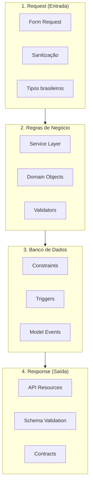

# Estratégia de Validação

> Status: **Rascunho**
> Última atualização: 2025-12-28
> Prioridade: Alta

---

## Visão Geral

Este documento define a estratégia de validação em múltiplas camadas para garantir integridade de dados em todo o sistema.

### Camadas de Validação



---

## 1. Validação de Request (Entrada)

### 1.1 Form Requests

```php
// app/Http/Requests/Venda/CriarVendaRequest.php
class CriarVendaRequest extends FormRequest
{
    public function authorize(): bool
    {
        return $this->user()->temPermissao('create_venda');
    }

    public function rules(): array
    {
        return [
            // Identificadores
            'orcamento_id' => ['required', 'exists:orcamentos,id'],
            'cliente_id' => ['required', 'exists:clientes,id'],
            'vendedor_id' => ['required', 'exists:profissionais,id'],

            // Endereço de entrega
            'endereco_entrega_id' => ['required', 'exists:enderecos,id'],

            // Itens
            'itens' => ['required', 'array', 'min:1'],
            'itens.*.produto_id' => ['required', 'exists:produtos,id'],
            'itens.*.quantidade' => ['required', 'numeric', 'min:0.01'],
            'itens.*.preco_unitario' => ['required', 'numeric', 'min:0'],
            'itens.*.desconto' => ['nullable', 'numeric', 'min:0', 'max:100'],

            // Pagamento
            'pagamentos' => ['required', 'array', 'min:1'],
            'pagamentos.*.tipo' => ['required', Rule::in(TipoPagamento::values())],
            'pagamentos.*.valor' => ['required', 'numeric', 'min:0.01'],
            'pagamentos.*.parcelas' => ['required', 'integer', 'min:1', 'max:24'],

            // Frete
            'frete' => ['required', 'numeric', 'min:0'],
            'frete_manual' => ['boolean'],

            // Observações
            'observacao' => ['nullable', 'string', 'max:2000'],
        ];
    }

    public function messages(): array
    {
        return [
            'itens.required' => 'A venda deve ter pelo menos um item.',
            'itens.min' => 'A venda deve ter pelo menos um item.',
            'pagamentos.required' => 'Informe pelo menos uma forma de pagamento.',
        ];
    }

    /**
     * Validação adicional após regras básicas
     */
    public function withValidator(Validator $validator): void
    {
        $validator->after(function (Validator $validator) {
            $this->validarTotalPagamentos($validator);
            $this->validarCreditoCliente($validator);
            $this->validarEstoqueDisponivel($validator);
        });
    }

    private function validarTotalPagamentos(Validator $validator): void
    {
        $totalItens = collect($this->itens)->sum(function ($item) {
            $subtotal = $item['quantidade'] * $item['preco_unitario'];
            $desconto = $subtotal * (($item['desconto'] ?? 0) / 100);
            return $subtotal - $desconto;
        });

        $totalPagamentos = collect($this->pagamentos)->sum('valor');
        $totalComFrete = $totalItens + $this->frete;

        if (abs($totalPagamentos - $totalComFrete) > 0.01) {
            $validator->errors()->add(
                'pagamentos',
                "Total de pagamentos (R$ {$totalPagamentos}) difere do total da venda (R$ {$totalComFrete})."
            );
        }
    }

    private function validarCreditoCliente(Validator $validator): void
    {
        $creditoUsado = collect($this->pagamentos)
            ->where('tipo', 'CONTA_CLIENTE')
            ->sum('valor');

        if ($creditoUsado > 0) {
            $cliente = Cliente::find($this->cliente_id);
            if ($creditoUsado > $cliente->credito) {
                $validator->errors()->add(
                    'pagamentos',
                    "Crédito insuficiente. Disponível: R$ {$cliente->credito}"
                );
            }
        }
    }

    private function validarEstoqueDisponivel(Validator $validator): void
    {
        foreach ($this->itens as $index => $item) {
            $disponivel = app(EstoqueService::class)
                ->getQuantidadeDisponivel($item['produto_id']);

            if ($item['quantidade'] > $disponivel) {
                $validator->errors()->add(
                    "itens.{$index}.quantidade",
                    "Estoque insuficiente. Disponível: {$disponivel}"
                );
            }
        }
    }
}
```

### 1.2 Validadores Brasileiros

```php
// app/Rules/CpfValido.php
class CpfValido implements ValidationRule
{
    public function validate(string $attribute, mixed $value, Closure $fail): void
    {
        $cpf = preg_replace('/\D/', '', $value);

        if (strlen($cpf) !== 11) {
            $fail('O :attribute deve ter 11 dígitos.');
            return;
        }

        // Rejeita CPFs com todos dígitos iguais
        if (preg_match('/^(\d)\1*$/', $cpf)) {
            $fail('O :attribute é inválido.');
            return;
        }

        // Validação dos dígitos verificadores
        for ($t = 9; $t < 11; $t++) {
            $d = 0;
            for ($c = 0; $c < $t; $c++) {
                $d += $cpf[$c] * (($t + 1) - $c);
            }
            $d = ((10 * $d) % 11) % 10;
            if ($cpf[$t] != $d) {
                $fail('O :attribute é inválido.');
                return;
            }
        }
    }
}

// app/Rules/CnpjValido.php
class CnpjValido implements ValidationRule
{
    public function validate(string $attribute, mixed $value, Closure $fail): void
    {
        $cnpj = preg_replace('/\D/', '', $value);

        if (strlen($cnpj) !== 14) {
            $fail('O :attribute deve ter 14 dígitos.');
            return;
        }

        if (preg_match('/^(\d)\1*$/', $cnpj)) {
            $fail('O :attribute é inválido.');
            return;
        }

        $multiplicadores1 = [5, 4, 3, 2, 9, 8, 7, 6, 5, 4, 3, 2];
        $multiplicadores2 = [6, 5, 4, 3, 2, 9, 8, 7, 6, 5, 4, 3, 2];

        // Primeiro dígito
        $soma = 0;
        for ($i = 0; $i < 12; $i++) {
            $soma += $cnpj[$i] * $multiplicadores1[$i];
        }
        $resto = $soma % 11;
        $digito1 = $resto < 2 ? 0 : 11 - $resto;

        if ($cnpj[12] != $digito1) {
            $fail('O :attribute é inválido.');
            return;
        }

        // Segundo dígito
        $soma = 0;
        for ($i = 0; $i < 13; $i++) {
            $soma += $cnpj[$i] * $multiplicadores2[$i];
        }
        $resto = $soma % 11;
        $digito2 = $resto < 2 ? 0 : 11 - $resto;

        if ($cnpj[13] != $digito2) {
            $fail('O :attribute é inválido.');
            return;
        }
    }
}

// app/Rules/TelefoneValido.php
class TelefoneValido implements ValidationRule
{
    public function validate(string $attribute, mixed $value, Closure $fail): void
    {
        $telefone = preg_replace('/\D/', '', $value);

        // Celular: 11 dígitos (com 9 na frente)
        // Fixo: 10 dígitos
        if (!in_array(strlen($telefone), [10, 11])) {
            $fail('O :attribute deve ter 10 ou 11 dígitos.');
            return;
        }

        // DDD válido (11-99)
        $ddd = (int) substr($telefone, 0, 2);
        if ($ddd < 11 || $ddd > 99) {
            $fail('DDD inválido.');
            return;
        }

        // Celular deve começar com 9
        if (strlen($telefone) === 11 && $telefone[2] !== '9') {
            $fail('Celular deve começar com 9.');
        }
    }
}

// app/Rules/CepValido.php
class CepValido implements ValidationRule
{
    public function validate(string $attribute, mixed $value, Closure $fail): void
    {
        $cep = preg_replace('/\D/', '', $value);

        if (strlen($cep) !== 8) {
            $fail('O :attribute deve ter 8 dígitos.');
            return;
        }

        if ($cep === '00000000') {
            $fail('O :attribute é inválido.');
        }
    }
}
```

### 1.3 Sanitização de Input

```php
// app/Http/Requests/Concerns/SanitizesInput.php
trait SanitizesInput
{
    protected function prepareForValidation(): void
    {
        $this->sanitize();
    }

    protected function sanitize(): void
    {
        $input = $this->all();

        // Remove máscaras de documentos
        $documentFields = ['cpf', 'cnpj', 'cep', 'telefone', 'celular'];
        foreach ($documentFields as $field) {
            if (isset($input[$field])) {
                $input[$field] = preg_replace('/\D/', '', $input[$field]);
            }
        }

        // Trim em strings
        array_walk_recursive($input, function (&$value) {
            if (is_string($value)) {
                $value = trim($value);
            }
        });

        // Uppercase em campos específicos
        $upperFields = ['uf', 'placa'];
        foreach ($upperFields as $field) {
            if (isset($input[$field])) {
                $input[$field] = strtoupper($input[$field]);
            }
        }

        // Normaliza valores monetários (vírgula para ponto)
        $moneyFields = ['valor', 'preco', 'frete', 'desconto'];
        foreach ($moneyFields as $field) {
            if (isset($input[$field]) && is_string($input[$field])) {
                $input[$field] = str_replace(',', '.', $input[$field]);
            }
        }

        $this->merge($input);
    }
}
```

### 1.4 Validação de Arquivos

```php
// app/Http/Requests/ImportarXmlNfeRequest.php
class ImportarXmlNfeRequest extends FormRequest
{
    public function rules(): array
    {
        return [
            'arquivo' => [
                'required',
                'file',
                'mimes:xml',
                'max:5120', // 5MB
                new XmlNfeValido(),
            ],
        ];
    }
}

// app/Rules/XmlNfeValido.php
class XmlNfeValido implements ValidationRule
{
    public function validate(string $attribute, mixed $value, Closure $fail): void
    {
        try {
            $xml = simplexml_load_file($value->getPathname());

            if (!$xml) {
                $fail('Arquivo XML inválido.');
                return;
            }

            // Verifica se é uma NFe
            $namespaces = $xml->getNamespaces(true);
            if (!isset($namespaces['']) || !str_contains($namespaces[''], 'nfe')) {
                $fail('O arquivo não é uma NFe válida.');
                return;
            }

            // Verifica elementos obrigatórios
            $infNFe = $xml->NFe->infNFe ?? null;
            if (!$infNFe) {
                $fail('Estrutura da NFe inválida.');
                return;
            }

            // Verifica chave de acesso
            $chave = (string) ($infNFe->attributes()['Id'] ?? '');
            if (!preg_match('/^NFe\d{44}$/', $chave)) {
                $fail('Chave de acesso inválida.');
            }

        } catch (Exception $e) {
            $fail('Erro ao processar XML: ' . $e->getMessage());
        }
    }
}
```

---

## 2. Validação de Regras de Negócio

### 2.1 Service Layer Validation

```php
// app/Services/VendaService.php
class VendaService
{
    public function __construct(
        private VendaValidator $validator,
        private EstoqueService $estoqueService,
        private FinanceiroService $financeiroService,
    ) {}

    public function criar(array $dados): Venda
    {
        // Validação de regras de negócio ANTES de qualquer operação
        $this->validator->validarCriacao($dados);

        DB::beginTransaction();

        try {
            $venda = Venda::create($dados);

            foreach ($dados['itens'] as $item) {
                $vendaItem = $venda->itens()->create($item);

                // Validação durante processamento
                $this->validator->validarItem($vendaItem);
            }

            // Validação do total
            $this->validator->validarTotais($venda);

            // Criar financeiro
            $this->financeiroService->criarRecebiveisVenda($venda);

            // Reservar estoque
            $this->estoqueService->reservarParaVenda($venda);

            // Validação pós-criação
            $this->validator->validarIntegridade($venda);

            DB::commit();

            return $venda->fresh();

        } catch (Exception $e) {
            DB::rollBack();
            throw $e;
        }
    }
}

// app/Validators/VendaValidator.php
class VendaValidator
{
    public function validarCriacao(array $dados): void
    {
        // Cliente ativo
        $cliente = Cliente::find($dados['cliente_id']);
        if (!$cliente->ativo) {
            throw new ValidationException('Cliente inativo.');
        }

        // Cliente não bloqueado
        if ($cliente->bloqueado) {
            throw new ValidationException('Cliente bloqueado. Motivo: ' . $cliente->motivo_bloqueio);
        }

        // Limite de crédito
        if ($cliente->limite_credito > 0) {
            $emAberto = $cliente->contasReceber()->pendentes()->sum('valor');
            if ($emAberto >= $cliente->limite_credito) {
                throw new ValidationException('Cliente atingiu o limite de crédito.');
            }
        }

        // Vendedor ativo
        $vendedor = Profissional::find($dados['vendedor_id']);
        if (!$vendedor->ativo) {
            throw new ValidationException('Vendedor inativo.');
        }
    }

    public function validarItem(VendaItem $item): void
    {
        // Produto ativo
        if (!$item->produto->ativo) {
            throw new ValidationException("Produto {$item->produto->descricao} está inativo.");
        }

        // Quantidade mínima
        if ($item->quantidade < $item->produto->quantidade_minima) {
            throw new ValidationException(
                "Quantidade mínima para {$item->produto->descricao} é {$item->produto->quantidade_minima}."
            );
        }

        // Preço não pode ser zero (exceto bonificação)
        if ($item->preco_unitario <= 0 && !$item->bonificacao) {
            throw new ValidationException("Preço inválido para {$item->produto->descricao}.");
        }

        // Desconto máximo
        $descontoMaximo = $item->produto->desconto_maximo ?? 30;
        if ($item->desconto > $descontoMaximo) {
            throw new ValidationException(
                "Desconto máximo para {$item->produto->descricao} é {$descontoMaximo}%."
            );
        }
    }

    public function validarTotais(Venda $venda): void
    {
        $totalItens = $venda->itens->sum('total');
        $totalPagamentos = $venda->pagamentos->sum('valor');

        // Tolerância de R$ 0.01 para arredondamentos
        if (abs($totalItens + $venda->frete - $totalPagamentos) > 0.01) {
            throw new ValidationException('Totais de itens e pagamentos não conferem.');
        }
    }

    public function validarIntegridade(Venda $venda): void
    {
        // Verifica se todos os itens foram criados
        if ($venda->itens->isEmpty()) {
            throw new ValidationException('Venda sem itens.');
        }

        // Verifica se pagamentos foram criados
        if ($venda->pagamentos->isEmpty()) {
            throw new ValidationException('Venda sem pagamentos.');
        }

        // Verifica se financeiro foi criado
        if ($venda->contasReceber->isEmpty()) {
            throw new ValidationException('Falha ao criar contas a receber.');
        }
    }
}
```

### 2.2 Domain Value Objects

```php
// app/Domain/ValueObjects/Cpf.php
final class Cpf implements Stringable
{
    private string $value;

    public function __construct(string $cpf)
    {
        $cpf = preg_replace('/\D/', '', $cpf);

        if (!$this->isValid($cpf)) {
            throw new InvalidArgumentException('CPF inválido.');
        }

        $this->value = $cpf;
    }

    public static function tryFrom(?string $cpf): ?self
    {
        if (empty($cpf)) {
            return null;
        }

        try {
            return new self($cpf);
        } catch (InvalidArgumentException) {
            return null;
        }
    }

    private function isValid(string $cpf): bool
    {
        // Validação completa do CPF
        // ...
        return true;
    }

    public function formatted(): string
    {
        return substr($this->value, 0, 3) . '.' .
               substr($this->value, 3, 3) . '.' .
               substr($this->value, 6, 3) . '-' .
               substr($this->value, 9, 2);
    }

    public function __toString(): string
    {
        return $this->value;
    }
}

// app/Domain/ValueObjects/Dinheiro.php
final class Dinheiro implements Stringable
{
    private int $centavos;

    public function __construct(float|int $valor)
    {
        if ($valor < 0) {
            throw new InvalidArgumentException('Valor não pode ser negativo.');
        }

        $this->centavos = (int) round($valor * 100);
    }

    public static function zero(): self
    {
        return new self(0);
    }

    public function valor(): float
    {
        return $this->centavos / 100;
    }

    public function centavos(): int
    {
        return $this->centavos;
    }

    public function adicionar(Dinheiro $outro): self
    {
        return new self(($this->centavos + $outro->centavos) / 100);
    }

    public function subtrair(Dinheiro $outro): self
    {
        $resultado = $this->centavos - $outro->centavos;
        if ($resultado < 0) {
            throw new InvalidArgumentException('Resultado não pode ser negativo.');
        }
        return new self($resultado / 100);
    }

    public function formatted(): string
    {
        return 'R$ ' . number_format($this->valor(), 2, ',', '.');
    }

    public function __toString(): string
    {
        return (string) $this->valor();
    }
}
```

---

## 3. Validação de Banco de Dados

### 3.1 Constraints PostgreSQL

```sql
-- migrations/create_vendas_table.php
Schema::create('vendas', function (Blueprint $table) {
    $table->id();
    $table->foreignId('cliente_id')->constrained();
    $table->foreignId('vendedor_id')->constrained('profissionais');
    $table->foreignId('loja_id')->constrained();

    $table->decimal('subtotal', 15, 2);
    $table->decimal('desconto_global', 5, 2)->default(0);
    $table->decimal('frete', 15, 2)->default(0);
    $table->decimal('total', 15, 2);

    $table->string('status', 20)->default('PENDENTE');

    $table->timestamps();
    $table->softDeletes();

    // Índices
    $table->index(['loja_id', 'status']);
    $table->index(['cliente_id', 'created_at']);
});

-- Constraints CHECK (PostgreSQL)
DB::statement("
    ALTER TABLE vendas
    ADD CONSTRAINT chk_vendas_subtotal_positivo
    CHECK (subtotal >= 0)
");

DB::statement("
    ALTER TABLE vendas
    ADD CONSTRAINT chk_vendas_desconto_valido
    CHECK (desconto_global >= 0 AND desconto_global <= 100)
");

DB::statement("
    ALTER TABLE vendas
    ADD CONSTRAINT chk_vendas_frete_positivo
    CHECK (frete >= 0)
");

DB::statement("
    ALTER TABLE vendas
    ADD CONSTRAINT chk_vendas_total_positivo
    CHECK (total >= 0)
");

DB::statement("
    ALTER TABLE vendas
    ADD CONSTRAINT chk_vendas_status_valido
    CHECK (status IN ('PENDENTE', 'CONFIRMADA', 'FATURADA', 'ENTREGUE', 'CANCELADA'))
");
```

### 3.2 Triggers de Validação

```sql
-- migrations/create_triggers.php

-- Trigger para validar total da venda
DB::unprepared("
    CREATE OR REPLACE FUNCTION validar_total_venda()
    RETURNS TRIGGER AS $$
    DECLARE
        total_itens DECIMAL(15,2);
        total_calculado DECIMAL(15,2);
    BEGIN
        -- Calcula total dos itens
        SELECT COALESCE(SUM(total), 0) INTO total_itens
        FROM venda_itens
        WHERE venda_id = NEW.id;

        -- Calcula total esperado
        total_calculado := total_itens * (1 - NEW.desconto_global / 100) + NEW.frete;

        -- Valida com tolerância de R$ 0.01
        IF ABS(NEW.total - total_calculado) > 0.01 THEN
            RAISE EXCEPTION 'Total da venda (%) não confere com itens + frete (%)',
                NEW.total, total_calculado;
        END IF;

        RETURN NEW;
    END;
    $$ LANGUAGE plpgsql;

    CREATE TRIGGER trg_validar_total_venda
    BEFORE INSERT OR UPDATE ON vendas
    FOR EACH ROW
    EXECUTE FUNCTION validar_total_venda();
");

-- Trigger para impedir estoque negativo
DB::unprepared("
    CREATE OR REPLACE FUNCTION validar_estoque_consumo()
    RETURNS TRIGGER AS $$
    DECLARE
        estoque_atual DECIMAL(15,4);
    BEGIN
        SELECT quantidade INTO estoque_atual
        FROM estoques
        WHERE id = NEW.estoque_id;

        IF NEW.quantidade > estoque_atual THEN
            RAISE EXCEPTION 'Quantidade de consumo (%) maior que estoque disponível (%)',
                NEW.quantidade, estoque_atual;
        END IF;

        -- Atualiza estoque
        UPDATE estoques
        SET quantidade = quantidade - NEW.quantidade,
            updated_at = NOW()
        WHERE id = NEW.estoque_id;

        RETURN NEW;
    END;
    $$ LANGUAGE plpgsql;

    CREATE TRIGGER trg_validar_estoque_consumo
    BEFORE INSERT ON consumos
    FOR EACH ROW
    EXECUTE FUNCTION validar_estoque_consumo();
");

-- Trigger para validar transições de status
DB::unprepared("
    CREATE OR REPLACE FUNCTION validar_transicao_status_venda()
    RETURNS TRIGGER AS $$
    BEGIN
        -- Define transições válidas
        IF OLD.status = 'PENDENTE' AND NEW.status NOT IN ('CONFIRMADA', 'CANCELADA') THEN
            RAISE EXCEPTION 'Transição inválida de % para %', OLD.status, NEW.status;
        END IF;

        IF OLD.status = 'CONFIRMADA' AND NEW.status NOT IN ('FATURADA', 'CANCELADA') THEN
            RAISE EXCEPTION 'Transição inválida de % para %', OLD.status, NEW.status;
        END IF;

        IF OLD.status = 'FATURADA' AND NEW.status NOT IN ('ENTREGUE', 'CANCELADA') THEN
            RAISE EXCEPTION 'Transição inválida de % para %', OLD.status, NEW.status;
        END IF;

        IF OLD.status IN ('ENTREGUE', 'CANCELADA') THEN
            RAISE EXCEPTION 'Não é possível alterar status de venda %', OLD.status;
        END IF;

        RETURN NEW;
    END;
    $$ LANGUAGE plpgsql;

    CREATE TRIGGER trg_validar_transicao_status_venda
    BEFORE UPDATE OF status ON vendas
    FOR EACH ROW
    WHEN (OLD.status IS DISTINCT FROM NEW.status)
    EXECUTE FUNCTION validar_transicao_status_venda();
");
```

### 3.3 Model Validation (Eloquent)

```php
// app/Models/Concerns/ValidatesOnSave.php
trait ValidatesOnSave
{
    public static function bootValidatesOnSave(): void
    {
        static::saving(function (Model $model) {
            $model->validateBeforeSave();
        });

        static::saved(function (Model $model) {
            $model->validateAfterSave();
        });
    }

    protected function validateBeforeSave(): void
    {
        // Override em models específicos
    }

    protected function validateAfterSave(): void
    {
        // Override em models específicos
    }
}

// app/Models/Venda.php
class Venda extends Model
{
    use ValidatesOnSave;

    protected function validateBeforeSave(): void
    {
        // Não pode criar venda para cliente inativo
        if (!$this->exists && !$this->cliente->ativo) {
            throw new ValidationException('Cliente inativo.');
        }

        // Status válido
        if (!in_array($this->status, VendaStatus::values())) {
            throw new ValidationException("Status inválido: {$this->status}");
        }
    }

    protected function validateAfterSave(): void
    {
        // Verifica integridade após salvar
        $this->refresh();

        $totalItens = $this->itens()->sum('total');
        $totalEsperado = ($totalItens * (1 - $this->desconto_global / 100)) + $this->frete;

        if (abs($this->total - $totalEsperado) > 0.01) {
            throw new ValidationException('Inconsistência no total da venda após salvar.');
        }
    }
}
```

---

## 4. Validação de Response (Saída)

### 4.1 API Resources

```php
// app/Http/Resources/VendaResource.php
class VendaResource extends JsonResource
{
    public function toArray(Request $request): array
    {
        return [
            'id' => $this->id,
            'numero' => $this->getNumeroFormatado(),
            'cliente' => new ClienteResource($this->whenLoaded('cliente')),
            'vendedor' => new ProfissionalResource($this->whenLoaded('vendedor')),
            'itens' => VendaItemResource::collection($this->whenLoaded('itens')),

            'valores' => [
                'subtotal' => $this->formatarValor($this->subtotal),
                'desconto_global_percentual' => $this->desconto_global,
                'desconto_global_valor' => $this->formatarValor($this->getDescontoGlobalValor()),
                'frete' => $this->formatarValor($this->frete),
                'total' => $this->formatarValor($this->total),
            ],

            'status' => [
                'codigo' => $this->status,
                'descricao' => $this->getStatusDescricao(),
                'cor' => $this->getStatusCor(),
            ],

            'datas' => [
                'criacao' => $this->created_at->toIso8601String(),
                'atualizacao' => $this->updated_at->toIso8601String(),
                'entrega_prevista' => $this->data_entrega?->toIso8601String(),
            ],

            'links' => [
                'self' => route('api.vendas.show', $this->id),
                'itens' => route('api.vendas.itens.index', $this->id),
                'pdf' => route('api.vendas.pdf', $this->id),
            ],
        ];
    }

    private function formatarValor(float $valor): array
    {
        return [
            'raw' => $valor,
            'formatted' => 'R$ ' . number_format($valor, 2, ',', '.'),
        ];
    }
}
```

### 4.2 Response Schema Validation

```php
// app/Http/Middleware/ValidateJsonResponse.php
class ValidateJsonResponse
{
    public function handle(Request $request, Closure $next): Response
    {
        $response = $next($request);

        if ($response instanceof JsonResponse && app()->environment('local', 'testing')) {
            $this->validateSchema($request, $response);
        }

        return $response;
    }

    private function validateSchema(Request $request, JsonResponse $response): void
    {
        $routeName = $request->route()?->getName();
        $schemaPath = resource_path("schemas/{$routeName}.json");

        if (!file_exists($schemaPath)) {
            return; // Schema não definido para esta rota
        }

        $schema = json_decode(file_get_contents($schemaPath));
        $data = json_decode($response->content());

        $validator = new JsonSchema\Validator();
        $validator->validate($data, $schema);

        if (!$validator->isValid()) {
            $errors = array_map(
                fn($error) => "{$error['property']}: {$error['message']}",
                $validator->getErrors()
            );

            Log::warning('Response não conforme com schema', [
                'route' => $routeName,
                'errors' => $errors,
            ]);

            if (app()->environment('testing')) {
                throw new SchemaValidationException($errors);
            }
        }
    }
}
```

### 4.3 Contract Tests

```php
// tests/Feature/Contracts/VendaContractTest.php
class VendaContractTest extends TestCase
{
    /** @test */
    public function response_deve_conter_campos_obrigatorios(): void
    {
        $venda = Venda::factory()->create();

        $response = $this->getJson("/api/vendas/{$venda->id}");

        $response->assertJsonStructure([
            'data' => [
                'id',
                'numero',
                'cliente' => ['id', 'razao_social'],
                'valores' => [
                    'subtotal' => ['raw', 'formatted'],
                    'total' => ['raw', 'formatted'],
                ],
                'status' => ['codigo', 'descricao'],
                'datas' => ['criacao'],
                'links' => ['self'],
            ],
        ]);
    }

    /** @test */
    public function valores_devem_ser_numericos(): void
    {
        $venda = Venda::factory()->create();

        $response = $this->getJson("/api/vendas/{$venda->id}");

        $data = $response->json('data');

        $this->assertIsNumeric($data['valores']['subtotal']['raw']);
        $this->assertIsNumeric($data['valores']['total']['raw']);
        $this->assertIsString($data['valores']['subtotal']['formatted']);
    }

    /** @test */
    public function datas_devem_estar_em_iso8601(): void
    {
        $venda = Venda::factory()->create();

        $response = $this->getJson("/api/vendas/{$venda->id}");

        $data = $response->json('data');

        $this->assertMatchesRegularExpression(
            '/^\d{4}-\d{2}-\d{2}T\d{2}:\d{2}:\d{2}/',
            $data['datas']['criacao']
        );
    }
}
```

---

## 5. Validação em Filas/Jobs

```php
// app/Jobs/ProcessarNfeJob.php
class ProcessarNfeJob implements ShouldQueue
{
    use Dispatchable, InteractsWithQueue, Queueable, SerializesModels;

    public int $tries = 3;
    public int $backoff = 60;

    public function __construct(
        public Venda $venda,
    ) {}

    public function handle(NfeService $nfeService): void
    {
        // Validação ANTES de processar
        $this->validarPreCondicoes();

        try {
            $nfe = $nfeService->emitir($this->venda);

            // Validação APÓS processar
            $this->validarResultado($nfe);

        } catch (NfeException $e) {
            $this->validarErroRecuperavel($e);
            throw $e;
        }
    }

    private function validarPreCondicoes(): void
    {
        // Venda ainda existe
        if (!$this->venda->exists) {
            throw new ValidationException('Venda não encontrada.');
        }

        // Venda no status correto
        if ($this->venda->status !== VendaStatus::CONFIRMADA) {
            throw new ValidationException("Venda não está confirmada. Status: {$this->venda->status}");
        }

        // Cliente tem dados fiscais
        if (!$this->venda->cliente->cpf && !$this->venda->cliente->cnpj) {
            throw new ValidationException('Cliente sem CPF/CNPJ.');
        }

        // NFe ainda não emitida
        if ($this->venda->nfe()->exists()) {
            throw new ValidationException('NFe já emitida para esta venda.');
        }
    }

    private function validarResultado(Nfe $nfe): void
    {
        // NFe foi autorizada
        if ($nfe->status !== NfeStatus::AUTORIZADA) {
            throw new NfeNaoAutorizadaException($nfe->motivo_rejeicao);
        }

        // Chave de acesso válida
        if (strlen($nfe->chave_acesso) !== 44) {
            throw new ValidationException('Chave de acesso inválida.');
        }

        // XML foi armazenado
        if (!Storage::exists($nfe->xml_path)) {
            throw new ValidationException('XML da NFe não foi armazenado.');
        }
    }

    private function validarErroRecuperavel(NfeException $e): void
    {
        // Erros que não devem fazer retry
        $errosFinais = [
            'Rejeicao: Duplicidade de NF-e',
            'Rejeicao: CNPJ do emitente invalido',
            'Rejeicao: IE do emitente invalida',
        ];

        foreach ($errosFinais as $erro) {
            if (str_contains($e->getMessage(), $erro)) {
                $this->fail($e);
            }
        }
    }

    public function failed(Throwable $exception): void
    {
        Log::error('Falha ao processar NFe', [
            'venda_id' => $this->venda->id,
            'error' => $exception->getMessage(),
            'attempts' => $this->attempts(),
        ]);

        // Notifica administrador
        Notification::route('mail', config('mail.admin'))
            ->notify(new NfeProcessamentoFalhouNotification($this->venda, $exception));
    }
}
```

---

## 6. Monitoramento de Validação

### 6.1 Logging de Falhas

```php
// app/Exceptions/Handler.php
public function register(): void
{
    $this->reportable(function (ValidationException $e) {
        Log::channel('validation')->warning('Falha de validação', [
            'errors' => $e->errors(),
            'input' => request()->except(['password', 'password_confirmation']),
            'user_id' => auth()->id(),
            'url' => request()->fullUrl(),
            'ip' => request()->ip(),
        ]);
    });
}
```

### 6.2 Métricas

```php
// app/Providers/AppServiceProvider.php
public function boot(): void
{
    // Contador de validações falhas
    Validator::resolver(function ($translator, $data, $rules, $messages) {
        $validator = new \Illuminate\Validation\Validator($translator, $data, $rules, $messages);

        $validator->after(function ($validator) {
            if ($validator->fails()) {
                $this->incrementValidationFailureMetric(
                    request()->route()?->getName() ?? 'unknown'
                );
            }
        });

        return $validator;
    });
}

private function incrementValidationFailureMetric(string $route): void
{
    Cache::increment("metrics:validation_failures:{$route}:" . now()->format('Y-m-d-H'));
}
```

### 6.3 Dashboard de Erros

```php
// app/Http/Controllers/Admin/ValidationMetricsController.php
class ValidationMetricsController extends Controller
{
    public function index(): JsonResponse
    {
        $hours = 24;
        $metrics = [];

        for ($i = 0; $i < $hours; $i++) {
            $hour = now()->subHours($i)->format('Y-m-d-H');
            $keys = Cache::get("metrics:validation_failures:*:{$hour}", []);

            foreach ($keys as $key => $count) {
                preg_match('/metrics:validation_failures:(.+):/', $key, $matches);
                $route = $matches[1] ?? 'unknown';

                $metrics[$route] = ($metrics[$route] ?? 0) + $count;
            }
        }

        arsort($metrics);

        return response()->json([
            'periodo' => "{$hours} horas",
            'total_falhas' => array_sum($metrics),
            'por_rota' => $metrics,
        ]);
    }
}
```

---

## Checklist de Implementação

### Request

- [ ] Form Requests para todos os endpoints
- [ ] Validadores brasileiros (CPF, CNPJ, CEP, telefone)
- [ ] Sanitização automática de inputs
- [ ] Validação de arquivos (XML NFe, Excel)

### Regras de Negócio

- [ ] Validators no service layer
- [ ] Value Objects para tipos complexos
- [ ] Validação antes E depois de persistir

### Banco de Dados

- [ ] Constraints CHECK em todas as tabelas
- [ ] Triggers para validações complexas
- [ ] Model validation com traits

### Response

- [ ] API Resources com estrutura consistente
- [ ] Schema validation em ambiente dev/test
- [ ] Contract tests

### Jobs/Filas

- [ ] Validação de pré-condições
- [ ] Validação de resultado
- [ ] Tratamento de erros não-recuperáveis

### Monitoramento

- [ ] Logging de falhas de validação
- [ ] Métricas por rota
- [ ] Dashboard para administradores

---

## Documentos Relacionados

- [05-seguranca.md](./05-seguranca.md) - Validação de entrada (segurança)
- [09-integracoes.md](./09-integracoes.md) - Validação de respostas externas
- [../negocios/05-regras-negocio.md](../negocios/05-regras-negocio.md) - Regras de negócio
