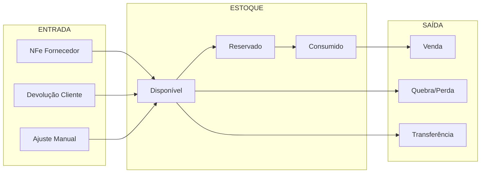
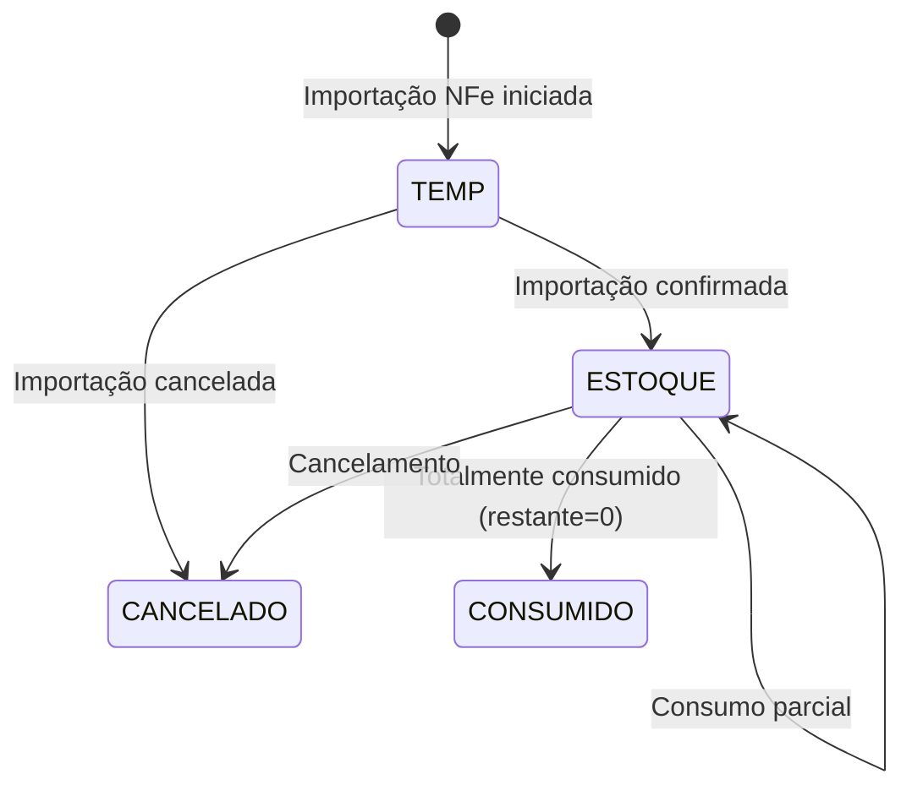
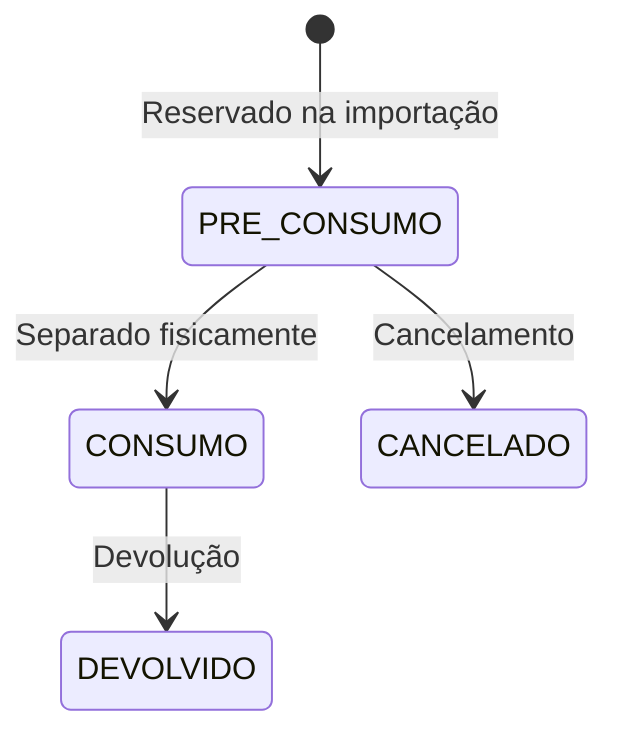

# Módulo: Estoque

> Status: **Rascunho**
> Prioridade: 2 (crítico para operação)
> Complexidade: **Alta**

---

## Visão Geral

O módulo de Estoque controla o inventário físico e lógico da empresa. É um dos módulos mais complexos devido à integração com NFe, compras e vendas.

### Fluxos Principais



---

## Problema Crítico: FIFO Não Implementado

### Situação Atual

O sistema **NÃO** implementa FIFO corretamente:

```cpp
// venda.cpp:1046 - Consumo atual
SELECT p.idEstoque FROM produto p ...
// Usa idEstoque ÚNICO da tabela produto - sem ordenação FIFO!
```

### Impacto

| Problema | Impacto |
|----------|---------|
| **Valoração incorreta** | CMV calculado errado |
| **Produtos perecíveis** | Estoque antigo não consumido, expira |
| **Compliance fiscal** | FIFO é requisito legal brasileiro |
| **Auditoria** | Não consegue rastrear qual lote foi vendido |

### Solução Proposta

Ver documento detalhado: [estrategia/05-correcao-fifo.md](../../estrategia/05-correcao-fifo.md)

---

## Implementação Atual (C++)

### Classes

| Classe | Arquivo | Finalidade |
|--------|---------|------------|
| `TabEstoque` | `tabestoque.cpp` | Container principal da aba |
| `Estoque` | `estoque.cpp` | Lógica de negócio |
| `EstoqueItem` | `estoqueitem.cpp` | Visualização de item |
| `WidgetEstoques` | `widgetestoques.cpp` | Lista de estoques |
| `WidgetEstoqueProduto` | `widgetestoqueproduto.cpp` | Estoque por produto |
| `EstoqueProxyModel` | `estoqueproxymodel.cpp` | Filtros |
| `EstoquePrazoProxyModel` | `estoqueprazoproxymodel.cpp` | Filtro por prazo |
| `PrecoEstoque` | `precoestoque.cpp` | Precificação |

### Tabelas do Banco de Dados

```sql
-- Tabela principal de estoque
estoque
├── idEstoque (PK)
├── idNFe (FK)              -- NFe de origem
├── idProduto (FK)          -- Produto
├── idBloco (FK)            -- Localização no galpão
├── status                  -- TEMP, ESTOQUE, CANCELADO
├── fornecedor (VARCHAR!)   -- ⚠️ Desnormalizado
├── descricao               -- Descrição do produto
├── quant                   -- Quantidade original recebida
├── restante                -- Quantidade disponível
├── valorUnid               -- Custo unitário
├── lote                    -- Número do lote
├── created                 -- Data de entrada
├── -- Campos de impostos da NFe:
├── vBC, pICMS, vICMS, vIPI, pPIS, vPIS, pCOFINS, vCOFINS
└── ...

-- Tabela de consumo
estoque_has_consumo
├── idConsumo (PK)
├── idEstoque (FK)          -- Lote de estoque
├── idVendaProduto2 (FK)    -- Item da venda que consumiu
├── status                  -- PRÉ-CONSUMO, CONSUMO, AJUSTE, DEVOLVIDO
├── quant                   -- NEGATIVO = consumido
├── valor                   -- Valor do consumo
└── -- Campos de impostos proporcionais

-- Link compra-estoque
estoque_has_compra
├── idEstoqueCompra (PK)
├── idEstoque (FK)
├── idCompra (FK)           -- ID do pedido de compra
├── idPedido2 (FK)          -- Item do pedido
└── quant                   -- Quantidade vinculada
```

### Fluxo de Estados

#### Estoque



#### Consumo



### Cálculo do Campo `restante`

```sql
-- Stored procedure: update_quant_estoque()
restante = quant + COALESCE(SUM(estoque_has_consumo.quant), 0)

-- Exemplo:
-- estoque.quant = 100 (recebido)
-- consumo #1: quant = -40
-- consumo #2: quant = -30
-- restante = 100 + (-40) + (-30) = 30
```

### Consumo de Estoque

O consumo é criado **durante importação da NFe**, não na entrega:

```cpp
// importarxml.cpp:1030-1130
void criarConsumo(rowCompra, rowEstoque) {
    idVendaProduto2 = modelCompra.data(rowCompra, "idVendaProduto2");
    if (idVendaProduto2 == 0) return;  // Sem venda vinculada

    quantConsumo = min(quantVenda, restanteEstoque);

    INSERT INTO estoque_has_consumo (
        idEstoque, idVendaProduto2,
        status = 'PRÉ-CONSUMO',
        quant = -quantConsumo,  // NEGATIVO
        // Impostos proporcionais...
    );

    UPDATE estoque SET restante = restante - quantConsumo;
}
```

### Localização no Galpão

O sistema integra com o módulo de Galpão para rastrear localização física:

```text
Galpão (Armazém)
├── Bloco A
│   ├── Posição A1 → estoque.idBloco
│   ├── Posição A2
│   └── ...
├── Bloco B
└── ...
```

---

## Implementação Laravel

### Models

```php
// app/Models/Estoque.php
class Estoque extends Model
{
    protected $fillable = [
        'loja_id', 'nfe_id', 'produto_id', 'fornecedor_id', 'bloco_id',
        'status', 'quantidade', 'quantidade_disponivel', 'custo_unitario',
        'lote', 'data_validade', 'data_entrada',
        // Campos de impostos
        'base_icms', 'aliq_icms', 'valor_icms',
        'valor_ipi', 'aliq_pis', 'valor_pis',
        'aliq_cofins', 'valor_cofins',
    ];

    protected $casts = [
        'status' => EstoqueStatus::class,
        'data_validade' => 'date',
        'data_entrada' => 'datetime',
    ];

    public function loja(): BelongsTo
    {
        return $this->belongsTo(Loja::class);
    }

    public function nfe(): BelongsTo
    {
        return $this->belongsTo(Nfe::class);
    }

    public function produto(): BelongsTo
    {
        return $this->belongsTo(Produto::class);
    }

    public function fornecedor(): BelongsTo
    {
        return $this->belongsTo(Fornecedor::class);
    }

    public function bloco(): BelongsTo
    {
        return $this->belongsTo(GalpaoBloco::class);
    }

    public function consumos(): HasMany
    {
        return $this->hasMany(EstoqueConsumo::class);
    }

    public function compras(): BelongsToMany
    {
        return $this->belongsToMany(Compra::class, 'estoque_compras')
            ->withPivot('quantidade');
    }

    // Scopes para FIFO
    public function scopeDisponivel(Builder $query): Builder
    {
        return $query->where('quantidade_disponivel', '>', 0)
            ->where('status', EstoqueStatus::ESTOQUE);
    }

    public function scopeFifo(Builder $query): Builder
    {
        return $query->orderBy('data_entrada', 'asc');
    }

    public function scopeFefo(Builder $query): Builder
    {
        return $query->orderByRaw('COALESCE(data_validade, DATE("9999-12-31")) ASC')
            ->orderBy('data_entrada', 'asc');
    }
}

// app/Models/EstoqueConsumo.php
class EstoqueConsumo extends Model
{
    protected $table = 'estoque_consumos';

    protected $fillable = [
        'estoque_id', 'venda_item_atendimento_id', 'compra_item_id',
        'status', 'quantidade', 'custo_unitario', 'motivo',
        'estornado', 'estornado_at', 'estornado_por',
    ];

    protected $casts = [
        'status' => EstoqueConsumoStatus::class,
        'estornado' => 'boolean',
        'estornado_at' => 'datetime',
    ];

    public function estoque(): BelongsTo
    {
        return $this->belongsTo(Estoque::class);
    }

    public function vendaItemAtendimento(): BelongsTo
    {
        return $this->belongsTo(VendaItemAtendimento::class);
    }

    // Valor total do consumo
    public function getValorTotalAttribute(): float
    {
        return $this->quantidade * $this->custo_unitario;
    }
}
```

### Enums

```php
// app/Enums/EstoqueStatus.php
enum EstoqueStatus: string
{
    case TEMP = 'TEMP';
    case ESTOQUE = 'ESTOQUE';
    case CANCELADO = 'CANCELADO';

    public function label(): string
    {
        return match($this) {
            self::TEMP => 'Temporário',
            self::ESTOQUE => 'Em Estoque',
            self::CANCELADO => 'Cancelado',
        };
    }

    public function color(): string
    {
        return match($this) {
            self::TEMP => 'yellow',
            self::ESTOQUE => 'green',
            self::CANCELADO => 'red',
        };
    }
}

// app/Enums/EstoqueConsumoStatus.php
enum EstoqueConsumoStatus: string
{
    case PRE_CONSUMO = 'PRE_CONSUMO';
    case CONSUMO = 'CONSUMO';
    case AJUSTE = 'AJUSTE';
    case DEVOLVIDO = 'DEVOLVIDO';
    case CANCELADO = 'CANCELADO';
}

// app/Enums/EstoqueConsumoMotivo.php
enum EstoqueConsumoMotivo: string
{
    case VENDA = 'VENDA';
    case AJUSTE_ENTRADA = 'AJUSTE_ENTRADA';
    case AJUSTE_SAIDA = 'AJUSTE_SAIDA';
    case QUEBRA = 'QUEBRA';
    case TRANSFERENCIA = 'TRANSFERENCIA';
    case DEVOLUCAO = 'DEVOLUCAO';
}
```

### Services

```php
// app/Services/Estoque/EstoqueService.php
class EstoqueService
{
    /**
     * Dar entrada de estoque (via importação de NFe)
     */
    public function darEntrada(array $dados): Estoque
    {
        return DB::transaction(function () use ($dados) {
            $estoque = Estoque::create([
                'loja_id' => $dados['loja_id'],
                'nfe_id' => $dados['nfe_id'],
                'produto_id' => $dados['produto_id'],
                'fornecedor_id' => $dados['fornecedor_id'],
                'bloco_id' => $dados['bloco_id'] ?? null,
                'status' => EstoqueStatus::ESTOQUE,
                'quantidade' => $dados['quantidade'],
                'quantidade_disponivel' => $dados['quantidade'],
                'custo_unitario' => $dados['custo_unitario'],
                'lote' => $dados['lote'] ?? null,
                'data_entrada' => $dados['data_entrada'] ?? now(),
                // Impostos...
            ]);

            // Vincular à compra se existir
            if (isset($dados['compra_id'])) {
                $estoque->compras()->attach($dados['compra_id'], [
                    'quantidade' => $dados['quantidade'],
                ]);
            }

            event(new EstoqueCriado($estoque));

            return $estoque;
        });
    }

    /**
     * Verificar disponibilidade de estoque
     */
    public function verificarDisponibilidade(
        int $produtoId,
        ?int $fornecedorId = null,
        float $quantidadeNecessaria = 0
    ): array {
        $query = Estoque::where('produto_id', $produtoId)
            ->disponivel()
            ->fifo();

        if ($fornecedorId) {
            $query->where('fornecedor_id', $fornecedorId);
        }

        $estoques = $query->get();

        $totalDisponivel = $estoques->sum('quantidade_disponivel');
        $custoMedio = $estoques->avg('custo_unitario');

        return [
            'total_disponivel' => $totalDisponivel,
            'atende_necessidade' => $totalDisponivel >= $quantidadeNecessaria,
            'quantidade_faltante' => max(0, $quantidadeNecessaria - $totalDisponivel),
            'custo_medio' => $custoMedio,
            'lotes' => $estoques->map(fn($e) => [
                'id' => $e->id,
                'quantidade' => $e->quantidade_disponivel,
                'custo' => $e->custo_unitario,
                'data_entrada' => $e->data_entrada,
                'lote' => $e->lote,
                'bloco' => $e->bloco?->nome,
            ])->toArray(),
        ];
    }

    /**
     * Atualizar localização no galpão
     */
    public function atualizarLocalizacao(Estoque $estoque, int $blocoId): void
    {
        $estoque->update(['bloco_id' => $blocoId]);

        event(new EstoqueMovimentado($estoque));
    }

    /**
     * Cancelar estoque (reverter entrada)
     */
    public function cancelar(Estoque $estoque, string $motivo): void
    {
        if ($estoque->consumos()->where('estornado', false)->exists()) {
            throw new BusinessException(
                'Não é possível cancelar estoque com consumos ativos'
            );
        }

        $estoque->update([
            'status' => EstoqueStatus::CANCELADO,
            'motivo_cancelamento' => $motivo,
        ]);

        event(new EstoqueCancelado($estoque));
    }
}

// app/Services/Estoque/EstoqueConsumoService.php
class EstoqueConsumoService
{
    /**
     * Consumir estoque usando FIFO
     */
    public function consumirFifo(
        int $produtoId,
        int $lojaId,
        float $quantidade,
        ?int $vendaItemAtendimentoId = null,
        string $motivo = 'VENDA'
    ): Collection {
        return DB::transaction(function () use (
            $produtoId, $lojaId, $quantidade, $vendaItemAtendimentoId, $motivo
        ) {
            $consumos = collect();
            $restante = $quantidade;

            // Obter estoque disponível em ordem FIFO com lock
            $estoques = Estoque::where('produto_id', $produtoId)
                ->where('loja_id', $lojaId)
                ->disponivel()
                ->fifo()
                ->lockForUpdate()
                ->get();

            foreach ($estoques as $estoque) {
                if ($restante <= 0) break;

                $consumir = min($restante, $estoque->quantidade_disponivel);

                // Atualizar estoque
                $estoque->decrement('quantidade_disponivel', $consumir);

                // Criar registro de consumo
                $consumo = EstoqueConsumo::create([
                    'estoque_id' => $estoque->id,
                    'venda_item_atendimento_id' => $vendaItemAtendimentoId,
                    'status' => EstoqueConsumoStatus::PRE_CONSUMO,
                    'quantidade' => $consumir,
                    'custo_unitario' => $estoque->custo_unitario,
                    'motivo' => $motivo,
                ]);

                $consumos->push($consumo);
                $restante -= $consumir;
            }

            if ($restante > 0) {
                throw new EstoqueInsuficienteException(
                    produtoId: $produtoId,
                    quantidadeNecessaria: $quantidade,
                    quantidadeDisponivel: $quantidade - $restante
                );
            }

            return $consumos;
        });
    }

    /**
     * Consumir de lote específico (ignora FIFO)
     */
    public function consumirLoteEspecifico(
        int $estoqueId,
        float $quantidade,
        ?int $vendaItemAtendimentoId = null,
        string $motivo = 'VENDA'
    ): EstoqueConsumo {
        return DB::transaction(function () use (
            $estoqueId, $quantidade, $vendaItemAtendimentoId, $motivo
        ) {
            $estoque = Estoque::lockForUpdate()->findOrFail($estoqueId);

            if ($estoque->quantidade_disponivel < $quantidade) {
                throw new EstoqueInsuficienteException(
                    produtoId: $estoque->produto_id,
                    quantidadeNecessaria: $quantidade,
                    quantidadeDisponivel: $estoque->quantidade_disponivel
                );
            }

            $estoque->decrement('quantidade_disponivel', $quantidade);

            return EstoqueConsumo::create([
                'estoque_id' => $estoqueId,
                'venda_item_atendimento_id' => $vendaItemAtendimentoId,
                'status' => EstoqueConsumoStatus::PRE_CONSUMO,
                'quantidade' => $quantidade,
                'custo_unitario' => $estoque->custo_unitario,
                'motivo' => $motivo,
            ]);
        });
    }

    /**
     * Estornar consumo (para devoluções/cancelamentos)
     */
    public function estornar(EstoqueConsumo $consumo, ?int $userId = null): void
    {
        DB::transaction(function () use ($consumo, $userId) {
            // Retornar quantidade ao estoque
            $consumo->estoque->increment('quantidade_disponivel', $consumo->quantidade);

            // Marcar consumo como estornado
            $consumo->update([
                'estornado' => true,
                'estornado_at' => now(),
                'estornado_por' => $userId ?? auth()->id(),
            ]);

            event(new EstoqueConsumoEstornado($consumo));
        });
    }

    /**
     * Desfazer todos os consumos de um item de venda
     */
    public function desfazerConsumo(VendaItemAtendimento $item): void
    {
        $consumos = EstoqueConsumo::where('venda_item_atendimento_id', $item->id)
            ->where('estornado', false)
            ->get();

        foreach ($consumos as $consumo) {
            $this->estornar($consumo);
        }
    }

    /**
     * Confirmar consumo (PRE_CONSUMO → CONSUMO)
     */
    public function confirmarConsumo(EstoqueConsumo $consumo): void
    {
        if ($consumo->status !== EstoqueConsumoStatus::PRE_CONSUMO) {
            throw new BusinessException('Apenas pré-consumos podem ser confirmados');
        }

        $consumo->update(['status' => EstoqueConsumoStatus::CONSUMO]);
    }
}

// app/Services/Estoque/EstoqueAjusteService.php
class EstoqueAjusteService
{
    public function __construct(
        private EstoqueConsumoService $consumoService
    ) {}

    /**
     * Ajustar estoque (inventário, quebra, etc.)
     */
    public function ajustar(
        Estoque $estoque,
        float $novaQuantidade,
        string $motivo,
        ?string $observacao = null
    ): EstoqueConsumo {
        $diferenca = $novaQuantidade - $estoque->quantidade_disponivel;

        if ($diferenca == 0) {
            throw new BusinessException('Quantidade não alterada');
        }

        return DB::transaction(function () use ($estoque, $diferenca, $motivo, $observacao) {
            // Atualizar estoque
            $estoque->update([
                'quantidade_disponivel' => $estoque->quantidade_disponivel + $diferenca,
            ]);

            // Criar registro de ajuste
            return EstoqueConsumo::create([
                'estoque_id' => $estoque->id,
                'status' => EstoqueConsumoStatus::AJUSTE,
                'quantidade' => $diferenca,  // Positivo = entrada, Negativo = saída
                'custo_unitario' => $estoque->custo_unitario,
                'motivo' => $motivo,
                'observacao' => $observacao,
            ]);
        });
    }

    /**
     * Registrar quebra/perda
     */
    public function registrarQuebra(
        Estoque $estoque,
        float $quantidade,
        string $motivo
    ): EstoqueConsumo {
        if ($quantidade > $estoque->quantidade_disponivel) {
            throw new BusinessException('Quantidade de quebra maior que disponível');
        }

        return $this->ajustar(
            $estoque,
            $estoque->quantidade_disponivel - $quantidade,
            EstoqueConsumoMotivo::QUEBRA->value,
            $motivo
        );
    }
}
```

### Controllers

```php
// app/Http/Controllers/EstoqueController.php
class EstoqueController extends Controller
{
    public function __construct(
        private EstoqueService $estoqueService
    ) {}

    public function index(Request $request)
    {
        $estoques = Estoque::query()
            ->with(['produto:id,descricao', 'fornecedor:id,razao_social', 'bloco:id,nome'])
            ->when($request->produto_id, fn($q) => $q->where('produto_id', $request->produto_id))
            ->when($request->fornecedor_id, fn($q) => $q->where('fornecedor_id', $request->fornecedor_id))
            ->when($request->status, fn($q) => $q->where('status', $request->status))
            ->when($request->apenas_disponivel, fn($q) => $q->disponivel())
            ->when($request->bloco_id, fn($q) => $q->where('bloco_id', $request->bloco_id))
            ->fifo()
            ->paginate(50);

        return Inertia::render('Estoque/Index', [
            'estoques' => $estoques,
            'filters' => $request->only([
                'produto_id', 'fornecedor_id', 'status', 'apenas_disponivel', 'bloco_id'
            ]),
        ]);
    }

    public function show(Estoque $estoque)
    {
        $estoque->load([
            'produto',
            'fornecedor',
            'nfe',
            'bloco.galpao',
            'consumos' => fn($q) => $q->with('vendaItemAtendimento.venda'),
            'compras',
        ]);

        return Inertia::render('Estoque/Show', [
            'estoque' => $estoque,
        ]);
    }

    public function verificarDisponibilidade(Request $request)
    {
        $request->validate([
            'produto_id' => 'required|exists:produtos,id',
            'quantidade' => 'sometimes|numeric|min:0',
        ]);

        $disponibilidade = $this->estoqueService->verificarDisponibilidade(
            $request->produto_id,
            $request->fornecedor_id,
            $request->quantidade ?? 0
        );

        return response()->json($disponibilidade);
    }

    public function atualizarLocalizacao(Estoque $estoque, Request $request)
    {
        $request->validate(['bloco_id' => 'required|exists:galpao_blocos,id']);

        $this->estoqueService->atualizarLocalizacao($estoque, $request->bloco_id);

        return back()->with('success', 'Localização atualizada');
    }
}

// app/Http/Controllers/EstoqueAjusteController.php
class EstoqueAjusteController extends Controller
{
    public function __construct(
        private EstoqueAjusteService $ajusteService
    ) {}

    public function ajustar(Estoque $estoque, AjustarEstoqueRequest $request)
    {
        $this->ajusteService->ajustar(
            $estoque,
            $request->nova_quantidade,
            $request->motivo,
            $request->observacao
        );

        return back()->with('success', 'Estoque ajustado');
    }

    public function registrarQuebra(Estoque $estoque, RegistrarQuebraRequest $request)
    {
        $this->ajusteService->registrarQuebra(
            $estoque,
            $request->quantidade,
            $request->motivo
        );

        return back()->with('success', 'Quebra registrada');
    }
}
```

### Rotas

```php
// routes/web.php
Route::middleware(['auth'])->group(function () {
    Route::resource('estoques', EstoqueController::class)->only(['index', 'show']);

    Route::get('estoques/verificar-disponibilidade', [EstoqueController::class, 'verificarDisponibilidade'])
        ->name('estoques.verificar-disponibilidade');

    Route::put('estoques/{estoque}/localizacao', [EstoqueController::class, 'atualizarLocalizacao'])
        ->name('estoques.atualizar-localizacao');

    Route::post('estoques/{estoque}/ajustar', [EstoqueAjusteController::class, 'ajustar'])
        ->name('estoques.ajustar');

    Route::post('estoques/{estoque}/quebra', [EstoqueAjusteController::class, 'registrarQuebra'])
        ->name('estoques.registrar-quebra');
});
```

---

## Componentes de UI

### Lista de Estoque

- Filtros: Produto, Fornecedor, Status, Bloco, Apenas Disponível
- Colunas: Produto, Fornecedor, Lote, Quantidade, Disponível, Custo, Bloco, Data Entrada
- Ações: Visualizar, Ajustar, Mover, Registrar Quebra

### Visualização de Estoque

- Informações do lote (quantidade, custo, datas)
- Link para NFe de origem
- Localização no galpão
- Histórico de consumos
- Timeline de movimentações

### Formulário de Ajuste

- Quantidade atual (readonly)
- Nova quantidade
- Motivo (dropdown: Inventário, Correção, Outro)
- Observação

### Verificação de Disponibilidade

- Busca de produto
- Lista de lotes disponíveis (FIFO)
- Total disponível
- Custo médio

---

## Eventos

| Evento | Dispara |
|--------|---------|
| `EstoqueCriado` | Log de auditoria, atualizar dashboard |
| `EstoqueConsumoCreado` | Atualizar quantidade disponível |
| `EstoqueConsumoEstornado` | Retornar quantidade, notificar |
| `EstoqueMovimentado` | Log de movimentação |
| `EstoqueCancelado` | Reverter vínculos, notificar |
| `EstoqueAbaixoMinimo` | Alertar compras |

---

## Considerações de Migração

### Migração de Dados

1. `estoque` → `estoques` (normalizar fornecedor)
2. `estoque_has_consumo` → `estoque_consumos` (ajustar campos)
3. `estoque_has_compra` → `estoque_compras` (pivot table)
4. Popular `data_entrada` a partir de NFe para registros existentes

### Mudanças Críticas

- **FIFO implementado**: Ordenar por `data_entrada`
- **Fornecedor normalizado**: `fornecedor` VARCHAR → `fornecedor_id` FK
- **Quantidades positivas**: Consumo será valor positivo com flag de motivo
- **Lock de concorrência**: `FOR UPDATE` durante consumo

### Scripts de Migração

```sql
-- Popular data_entrada de registros existentes
UPDATE estoques e
SET data_entrada = (
    SELECT n.data_emissao FROM nfes n WHERE n.id = e.nfe_id
)
WHERE data_entrada IS NULL;

-- Normalizar fornecedor
UPDATE estoques e
SET fornecedor_id = (
    SELECT f.id FROM fornecedores f WHERE f.razao_social = e.fornecedor LIMIT 1
)
WHERE fornecedor_id IS NULL AND fornecedor IS NOT NULL;

-- Criar índice FIFO
CREATE INDEX idx_estoques_fifo
ON estoques (produto_id, loja_id, data_entrada)
WHERE quantidade_disponivel > 0 AND status = 'ESTOQUE';
```
