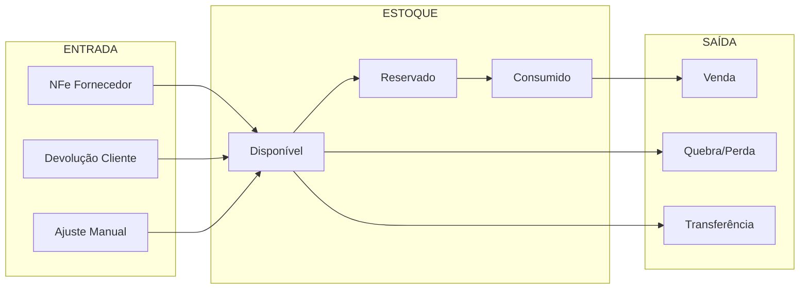
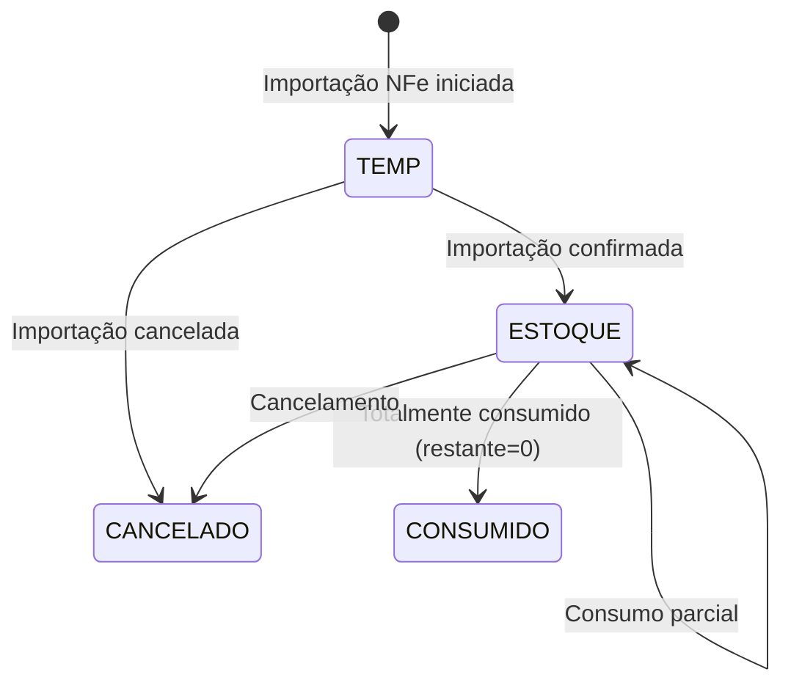
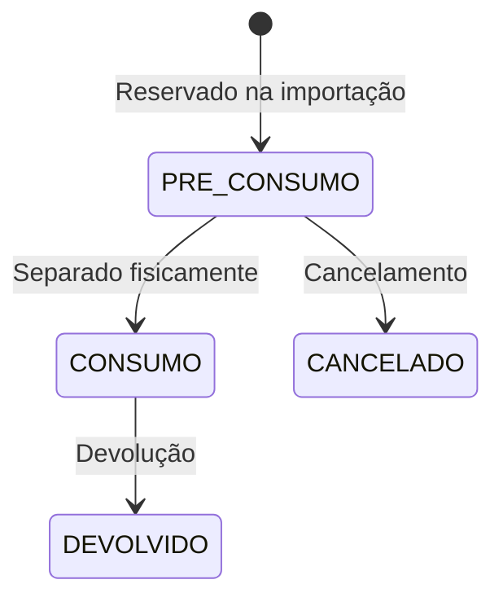

# Módulo: Estoque

> Status: **Rascunho**
> Prioridade: 2 (crítico para operação)
> Complexidade: **Alta**

---

## Visão Geral

O módulo de Estoque controla o inventário físico e lógico da empresa. É um dos módulos mais complexos devido à integração com NFe, compras e vendas.

### Fluxos Principais



---

## Problema Crítico: FIFO Não Implementado

### Situação Atual

O sistema **NÃO** implementa FIFO corretamente:

```cpp
// venda.cpp:1046 - Consumo atual
SELECT p.idEstoque FROM produto p ...
// Usa idEstoque ÚNICO da tabela produto - sem ordenação FIFO!
```

### Impacto

| Problema                | Impacto                                     |
| ----------------------- | ------------------------------------------- |
| **Valoração incorreta** | CMV calculado errado                        |
| **Produtos perecíveis** | Estoque antigo não consumido, expira        |
| **Compliance fiscal**   | FIFO é requisito legal brasileiro           |
| **Auditoria**           | Não consegue rastrear qual lote foi vendido |

### Solução Proposta

Ver documento detalhado: [estrategia/05-correcao-fifo.md](../../estrategia/05-correcao-fifo.md)

---

## Implementação Atual (C++)

### Classes

| Classe                   | Arquivo                      | Finalidade                 |
| ------------------------ | ---------------------------- | -------------------------- |
| `TabEstoque`             | `tabestoque.cpp`             | Container principal da aba |
| `Estoque`                | `estoque.cpp`                | Lógica de negócio          |
| `EstoqueItem`            | `estoqueitem.cpp`            | Visualização de item       |
| `WidgetEstoques`         | `widgetestoques.cpp`         | Lista de estoques          |
| `WidgetEstoqueProduto`   | `widgetestoqueproduto.cpp`   | Estoque por produto        |
| `EstoqueProxyModel`      | `estoqueproxymodel.cpp`      | Filtros                    |
| `EstoquePrazoProxyModel` | `estoqueprazoproxymodel.cpp` | Filtro por prazo           |
| `PrecoEstoque`           | `precoestoque.cpp`           | Precificação               |

### Tabelas do Banco de Dados

```sql
-- Tabela principal de estoque de lotes (NEW SCHEMA - estoque_lotes)
estoque_lotes
├── id (PK)                         -- Nova: Auto-increment primária
├── loja_id (FK)                    -- Loja/filial
├── produto_id (FK)                 -- Produto
├── nfe_id (FK, nullable)           -- NFe de origem (se aplicável)
├── compra_id (FK, nullable)        -- Compra relacionada
├── fornecedor_id (FK, nullable)    -- Fornecedor
├── status                          -- RECEBIDO, RESERVADO, CONSUMIDO, QUEBRA, DEVOLUCAO
├── quantidade                      -- Quantidade original recebida/alocada
├── quantidade_disponivel           -- Quantidade livre para alocação (RECEBIDO)
├── quantidade_reservada            -- Quantidade alocada a vendas
├── custo_unitario                  -- Custo unitário do lote
├── lote                            -- Número do lote (FIFO/FEFO key)
├── data_validade (nullable)        -- Data de validade (perecíveis)
├── data_entrada                    -- Data de entrada/recebimento
├── -- Campos de impostos da NFe (proporcionais):
├── base_icms, aliq_icms, valor_icms
├── valor_ipi, aliq_pis, valor_pis
├── aliq_cofins, valor_cofins
├── bloco_id (nullable)             -- Localização no galpão (FK)
└── ...

-- Tabela de alocações M:N (REPLACED: estoque_has_consumo)
-- Ver: alocacoes table no schema-proposto
alocacoes
├── id (PK)
├── venda_item_id (FK)         -- Item da venda
├── estoque_lote_id (FK)       -- Lote alocado
├── quantidade                 -- Quantidade alocada
├── status                     -- ATIVO, REVERTIDA, CANCELADA
└── ...

-- DEPRECATED: Old tables (for migration only)
-- estoque_has_consumo        → REPLACED by alocacoes
-- estoque_has_compra         → REPLACED by relationship fields in estoque_lotes
```

### Fluxo de Estados

#### Estoque



#### Consumo



### Cálculo da Quantidade Disponível (NEW SCHEMA)

```sql
-- NEW SCHEMA: quantidade_disponível é calculada dinamicamente
quantidade_disponível = quantidade - COALESCE(SUM(alocacoes.quantidade), 0)

-- Exemplo com estoque_lotes + alocacoes:
-- estoque_lotes.quantidade = 100 (recebido)
-- alocacao #1: quantidade = 40 (ATIVO)
-- alocacao #2: quantidade = 30 (ATIVO)
-- quantidade_disponível = 100 - (40 + 30) = 30

-- QUERY para calcular dinâmicamente:
SELECT
    el.id,
    el.quantidade,
    COALESCE(SUM(a.quantidade), 0) as alocado,
    el.quantidade - COALESCE(SUM(a.quantidade), 0) as disponivel
FROM estoque_lotes el
LEFT JOIN alocacoes a ON a.estoque_lote_id = el.id AND a.status = 'ATIVO'
GROUP BY el.id;
```

### Consumo de Estoque (NEW SCHEMA)

Com a nova arquitetura M:N, o consumo é **criado explicitamente** durante alocação:

```php
// app/Services/AlocacaoService.php - NEW SCHEMA
// Chamada manual via controller para alocar estoque a um venda_item

class AlocacaoService {
    public function alocar(
        VendaItem $vendaItem,
        EstoqueLote $estoque,
        int $quantidade
    ): Alocacao {
        return DB::transaction(function () use ($vendaItem, $estoque, $quantidade) {
            // Validar disponibilidade
            $disponivel = $estoque->quantidade -
                          $estoque->alocacoes()
                              ->where('status', AlocacaoStatus::ATIVO)
                              ->sum('quantidade');

            if ($quantidade > $disponivel) {
                throw new BusinessException("Quantidade insuficiente");
            }

            // Criar alocação (M:N link)
            $alocacao = Alocacao::create([
                'venda_item_id' => $vendaItem->id,
                'estoque_lote_id' => $estoque->id,
                'quantidade' => $quantidade,
                'status' => AlocacaoStatus::ATIVO,
            ]);

            // Registrar evento para auditoria
            DB::table('alocacoes_eventos')->insert([
                'alocacao_id' => $alocacao->id,
                'event_type' => 'CRIADA',
                'event_data' => json_encode([
                    'estoque_lote_id' => $estoque->id,
                    'quantidade' => $quantidade,
                ]),
                'created_at' => now(),
            ]);

            return $alocacao;
        });
    }
}
```

### Localização no Galpão

O sistema integra com o módulo de Galpão para rastrear localização física:

```text
Galpão (Armazém)
├── Bloco A
│   ├── Posição A1 → estoque_lotes.bloco_id (FK)
│   ├── Posição A2
│   └── ...
├── Bloco B
└── ...

-- Cada estoque_lote pode ter localização no galpão
-- Usado para separação física durante picking/entrega
```

---

## Implementação Laravel

### Models

```php
// app/Models/EstoqueLote.php (NEW SCHEMA - was: Estoque)
// Table: estoque_lotes (not 'estoques' - renamed for clarity: lotes de estoque)

class EstoqueLote extends Model
{
    protected $table = 'estoque_lotes';  // Explicit table name mapping

    protected $fillable = [
        'loja_id', 'produto_id', 'fornecedor_id', 'nfe_id', 'compra_id', 'bloco_id',
        'status', 'quantidade', 'quantidade_disponivel', 'quantidade_reservada',
        'custo_unitario', 'lote', 'data_validade', 'data_entrada',
        // Campos de impostos (proporcionais)
        'base_icms', 'aliq_icms', 'valor_icms',
        'valor_ipi', 'aliq_pis', 'valor_pis',
        'aliq_cofins', 'valor_cofins',
    ];

    protected $casts = [
        'status' => EstoqueLoteStatus::class,
        'data_validade' => 'date',
        'data_entrada' => 'datetime',
    ];

    public function loja(): BelongsTo
    {
        return $this->belongsTo(Loja::class);
    }

    public function produto(): BelongsTo
    {
        return $this->belongsTo(Produto::class);
    }

    public function fornecedor(): BelongsTo
    {
        return $this->belongsTo(Fornecedor::class)->nullable();
    }

    public function nfe(): BelongsTo
    {
        return $this->belongsTo(Nfe::class)->nullable();
    }

    public function compra(): BelongsTo
    {
        return $this->belongsTo(Compra::class)->nullable();
    }

    // M:N: Alocações a venda_items
    public function alocacoes(): HasMany
    {
        return $this->hasMany(Alocacao::class, 'estoque_lote_id');
    }

    // Evento Sourcing: histórico imutável
    public function eventos(): HasMany
    {
        return $this->hasMany(EstoqueLoteEvento::class, 'lote_id');
    }

    public function bloco(): BelongsTo
    {
        return $this->belongsTo(GalpaoBloco::class)->nullable();
    }

    // Scopes para FIFO/FEFO ordering
    public function scopeDisponivel(Builder $query): Builder
    {
        return $query->where('quantidade_disponivel', '>', 0)
            ->where('status', EstoqueLoteStatus::RECEBIDO);
    }

    public function scopeFifo(Builder $query): Builder
    {
        return $query->orderBy('data_entrada', 'asc');
    }

    public function scopeFefo(Builder $query): Builder
    {
        // Earliest expiry first (FEFO), then oldest by entry date
        return $query->orderByRaw('COALESCE(data_validade, DATE("9999-12-31")) ASC')
            ->orderBy('data_entrada', 'asc');
    }

    // Calculate total allocated quantity from ATIVO allocations
    public function quantidadeAlocada(): float
    {
        return $this->alocacoes()
            ->where('status', AlocacaoStatus::ATIVO)
            ->sum('quantidade') ?? 0;
    }

    // Calculate available quantity for new allocations
    public function quantidadeParaAlocar(): float
    {
        return max(0, $this->quantidade - $this->quantidadeAlocada());
    }
}

// app/Models/Alocacao.php
class Alocacao extends Model
{
    protected $table = 'alocacoes';

    protected $fillable = [
        'venda_item_id', 'estoque_lote_id',
        'quantidade', 'status',
    ];

    protected $casts = [
        'status' => AlocacaoStatus::class,
        'quantidade' => 'decimal:4',
    ];

    public function vendaItem(): BelongsTo
    {
        return $this->belongsTo(VendaItem::class);
    }

    // M:N relationship: references EstoqueLote (not old Estoque)
    public function estoqueLote(): BelongsTo
    {
        return $this->belongsTo(EstoqueLote::class);
    }

    // Event Sourcing: histórico de mudanças
    public function eventos(): HasMany
    {
        return $this->hasMany(AlocacaoEvento::class);
    }

    // Helper to check if allocation is active
    public function isActive(): bool
    {
        return $this->status === AlocacaoStatus::ATIVO;
    }

    // Helper to check if allocation has been reversed
    public function isReversed(): bool
    {
        return $this->status === AlocacaoStatus::REVERTIDA;
    }

    // Calculate cost for this allocation
    public function getValorTotalAttribute(): float
    {
        return $this->quantidade * $this->estoque->custo_unitario;
    }
}
```

### Event Sourcing (Append-Only Movements Log)

This module uses Event Sourcing to maintain immutable log of all inventory movements and allocations for complete audit trail and cost tracking.

#### Event Tables

```sql
-- Append-only movements log for estoque_lotes (inventory receiving/adjustments)
CREATE TABLE estoque_movimentacoes (
    id BIGSERIAL PRIMARY KEY,
    estoque_id BIGINT NOT NULL,
    event_type VARCHAR(50) NOT NULL,               -- RECEBIDO, AJUSTE, QUEBRA, TRANSFERENCIA, etc.
    event_data JSONB NOT NULL,                     -- Complete movement payload
    usuario_id BIGINT,
    ip_address INET,
    created_at TIMESTAMP NOT NULL DEFAULT NOW()
);

-- Immutability constraint
CREATE TRIGGER fn_prevent_mutation_estoque_movimentacoes
BEFORE UPDATE OR DELETE ON estoque_movimentacoes
FOR EACH ROW EXECUTE FUNCTION fn_prevent_mutation();

-- Index for query performance
CREATE INDEX idx_estoque_movimentacoes_lote_tipo
ON estoque_movimentacoes (estoque_id, event_type, created_at);

-- Append-only log for allocation events
CREATE TABLE alocacoes_eventos (
    id BIGSERIAL PRIMARY KEY,
    alocacao_id BIGINT NOT NULL,
    event_type VARCHAR(50) NOT NULL,               -- CRIADA, REVERTIDA, CANCELADA
    event_data JSONB NOT NULL,
    usuario_id BIGINT,
    ip_address INET,
    created_at TIMESTAMP NOT NULL DEFAULT NOW()
);

CREATE TRIGGER fn_prevent_mutation_alocacoes_eventos
BEFORE UPDATE OR DELETE ON alocacoes_eventos
FOR EACH ROW EXECUTE FUNCTION fn_prevent_mutation();

CREATE INDEX idx_alocacoes_eventos_alocacao_tipo
ON alocacoes_eventos (alocacao_id, event_type, created_at);
```

#### Event Types

```php
// app/Enums/EstoqueEventType.php
enum EstoqueEventType: string
{
    case RECEBIDO = 'RECEBIDO';                    // Stock received from NFe/purchase
    case AJUSTE_ENTRADA = 'AJUSTE_ENTRADA';        // Inventory adjustment (increase)
    case AJUSTE_SAIDA = 'AJUSTE_SAIDA';            // Inventory adjustment (decrease)
    case QUEBRA = 'QUEBRA';                        // Breakage/loss recorded
    case TRANSFERENCIA = 'TRANSFERENCIA';          // Transfer to another location
    case DEVOLUCAO = 'DEVOLUCAO';                  // Return from customer
}

// app/Enums/AllocationEventType.php (same as VendaItem)
enum AllocationEventType: string
{
    case CRIADA = 'CRIADA';
    case REVERTIDA = 'REVERTIDA';
    case CANCELADA = 'CANCELADA';
}
```

#### Event Recording

```php
// app/Services/Estoque/EstoqueService.php
class EstoqueService
{
    /**
     * Record incoming stock from NFe with RECEBIDO event
     */
    public function darEntrada(array $dados): Estoque
    {
        return DB::transaction(function () use ($dados) {
            $estoque = Estoque::create([
                'loja_id' => $dados['loja_id'],
                'nfe_id' => $dados['nfe_id'],
                'produto_id' => $dados['produto_id'],
                'fornecedor_id' => $dados['fornecedor_id'],
                'quantidade' => $dados['quantidade'],
                'quantidade_disponivel' => $dados['quantidade'],
                'custo_unitario' => $dados['custo_unitario'],
            ]);

            // Record RECEBIDO event in append-only log
            DB::table('estoque_movimentacoes')->insert([
                'estoque_id' => $estoque->id,
                'event_type' => EstoqueEventType::RECEBIDO->value,
                'event_data' => json_encode([
                    'nfe_id' => $dados['nfe_id'],
                    'produto_id' => $dados['produto_id'],
                    'quantidade' => $dados['quantidade'],
                    'custo_unitario' => $dados['custo_unitario'],
                    'lote' => $dados['lote'] ?? null,
                    'data_validade' => $dados['data_validade'] ?? null,
                ]),
                'usuario_id' => auth()->id(),
                'ip_address' => request()->ip(),
                'created_at' => now(),
            ]);

            event(new EstoqueCriado($estoque));

            return $estoque;
        });
    }

    /**
     * Adjust inventory with audit trail
     */
    public function ajustar(
        Estoque $estoque,
        float $novaQuantidade,
        string $motivo
    ): void {
        DB::transaction(function () use ($estoque, $novaQuantidade, $motivo) {
            $diferenca = $novaQuantidade - $estoque->quantidade_disponivel;
            $eventType = $diferenca > 0
                ? EstoqueEventType::AJUSTE_ENTRADA
                : EstoqueEventType::AJUSTE_SAIDA;

            // Record adjustment event
            DB::table('estoque_movimentacoes')->insert([
                'estoque_id' => $estoque->id,
                'event_type' => $eventType->value,
                'event_data' => json_encode([
                    'quantidade_anterior' => $estoque->quantidade_disponivel,
                    'quantidade_nova' => $novaQuantidade,
                    'diferenca' => $diferenca,
                    'motivo' => $motivo,
                ]),
                'usuario_id' => auth()->id(),
                'ip_address' => request()->ip(),
                'created_at' => now(),
            ]);

            $estoque->update([
                'quantidade_disponivel' => $novaQuantidade,
            ]);

            event(new EstoqueAjustado($estoque, $diferenca));
        });
    }

    /**
     * Register breakage/loss with complete audit trail
     */
    public function registrarQuebra(
        Estoque $estoque,
        float $quantidade,
        string $motivo
    ): void {
        DB::transaction(function () use ($estoque, $quantidade, $motivo) {
            DB::table('estoque_movimentacoes')->insert([
                'estoque_id' => $estoque->id,
                'event_type' => EstoqueEventType::QUEBRA->value,
                'event_data' => json_encode([
                    'quantidade_antes' => $estoque->quantidade_disponivel,
                    'quantidade_quebrada' => $quantidade,
                    'quantidade_apos' => max(0, $estoque->quantidade_disponivel - $quantidade),
                    'motivo' => $motivo,
                    'valor_perdido' => $quantidade * $estoque->custo_unitario,
                ]),
                'usuario_id' => auth()->id(),
                'ip_address' => request()->ip(),
                'created_at' => now(),
            ]);

            $estoque->decrement('quantidade_disponivel', $quantidade);

            event(new QuebrasRegistrada($estoque, $quantidade));
        });
    }
}

// app/Services/Estoque/AlocacaoService.php
class AlocacaoService
{
    public function desfazerAlocacao(Alocacao $alocacao, string $motivo = null): void
    {
        DB::transaction(function () use ($alocacao, $motivo) {
            // Record allocation reversal event
            DB::table('alocacoes_eventos')->insert([
                'alocacao_id' => $alocacao->id,
                'event_type' => AllocationEventType::REVERTIDA->value,
                'event_data' => json_encode([
                    'venda_item_id' => $alocacao->venda_item_id,
                    'estoque_id' => $alocacao->estoque_id,
                    'quantidade_revertida' => $alocacao->quantidade,
                    'motivo' => $motivo,
                    'custo_impactado' => $alocacao->quantidade * $alocacao->estoque->custo_unitario,
                ]),
                'usuario_id' => auth()->id(),
                'ip_address' => request()->ip(),
                'created_at' => now(),
            ]);

            $alocacao->update([
                'status' => AlocacaoStatus::REVERTIDA,
            ]);

            event(new AlocacaoRevertida($alocacao));
        });
    }
}
```

#### Cost Tracking from Events

```php
// Reconstruct cost of inventory at specific date
$movimentos = DB::table('estoque_movimentacoes')
    ->where('estoque_id', $estoqueId)
    ->where('created_at', '<=', $data)
    ->orderBy('created_at')
    ->get();

$custoPorData = collect($movimentos)
    ->reduce(function ($carry, $movimento) use ($estoque) {
        $dados = json_decode($movimento->event_data, true);

        return match ($movimento->event_type) {
            EstoqueEventType::RECEBIDO->value => $dados['quantidade'] * $dados['custo_unitario'],
            EstoqueEventType::QUEBRA->value => $carry - $dados['valor_perdido'],
            EstoqueEventType::AJUSTE_ENTRADA->value =>
                $carry + ($dados['diferenca'] * $estoque->custo_unitario),
            EstoqueEventType::AJUSTE_SAIDA->value =>
                $carry - (abs($dados['diferenca']) * $estoque->custo_unitario),
            default => $carry,
        };
    }, 0);
```

#### Key Benefits

- **Immutable Movement Log**: Cannot modify or delete movements (compliance requirement)
- **Cost Tracking**: Complete history of cost changes for inventory valuation
- **Audit Trail**: Full trace of who adjusted, when, and why
- **Debugging**: Reconstruct inventory state at any point in time
- **Compliance**: Meet regulatory requirements for physical inventory audits
- **Analytics**: Query movements for insights on common breakages, supplier quality, etc.

---

### Enums

```php
// app/Enums/EstoqueStatus.php
enum EstoqueStatus: string
{
    case TEMP = 'TEMP';
    case ESTOQUE = 'ESTOQUE';
    case CANCELADO = 'CANCELADO';

    public function label(): string
    {
        return match($this) {
            self::TEMP => 'Temporário',
            self::ESTOQUE => 'Em Estoque',
            self::CANCELADO => 'Cancelado',
        };
    }

    public function color(): string
    {
        return match($this) {
            self::TEMP => 'yellow',
            self::ESTOQUE => 'green',
            self::CANCELADO => 'red',
        };
    }
}

// app/Enums/AlocacaoStatus.php
enum AlocacaoStatus: string
{
    case ATIVO = 'ATIVO';
    case REVERTIDA = 'REVERTIDA';
    case CANCELADA = 'CANCELADA';

    public function label(): string
    {
        return match($this) {
            self::ATIVO => 'Ativa',
            self::REVERTIDA => 'Revertida',
            self::CANCELADA => 'Cancelada',
        };
    }

    public function color(): string
    {
        return match($this) {
            self::ATIVO => 'green',
            self::REVERTIDA => 'orange',
            self::CANCELADA => 'red',
        };
    }
}
```

### Services

```php
// app/Services/Estoque/EstoqueService.php
class EstoqueService
{
    /**
     * Dar entrada de estoque (via importação de NFe)
     */
    public function darEntrada(array $dados): Estoque
    {
        return DB::transaction(function () use ($dados) {
            $estoque = Estoque::create([
                'loja_id' => $dados['loja_id'],
                'nfe_id' => $dados['nfe_id'],
                'produto_id' => $dados['produto_id'],
                'fornecedor_id' => $dados['fornecedor_id'],
                'bloco_id' => $dados['bloco_id'] ?? null,
                'status' => EstoqueStatus::ESTOQUE,
                'quantidade' => $dados['quantidade'],
                'quantidade_disponivel' => $dados['quantidade'],
                'custo_unitario' => $dados['custo_unitario'],
                'lote' => $dados['lote'] ?? null,
                'data_entrada' => $dados['data_entrada'] ?? now(),
                // Impostos...
            ]);

            // Vincular à compra se existir
            if (isset($dados['compra_id'])) {
                $estoque->compras()->attach($dados['compra_id'], [
                    'quantidade' => $dados['quantidade'],
                ]);
            }

            event(new EstoqueCriado($estoque));

            return $estoque;
        });
    }

    /**
     * Verificar disponibilidade de estoque
     */
    public function verificarDisponibilidade(
        int $produtoId,
        ?int $fornecedorId = null,
        float $quantidadeNecessaria = 0
    ): array {
        $query = Estoque::where('produto_id', $produtoId)
            ->disponivel()
            ->fifo();

        if ($fornecedorId) {
            $query->where('fornecedor_id', $fornecedorId);
        }

        $estoques = $query->get();

        $totalDisponivel = $estoques->sum('quantidade_disponivel');
        $custoMedio = $estoques->avg('custo_unitario');

        return [
            'total_disponivel' => $totalDisponivel,
            'atende_necessidade' => $totalDisponivel >= $quantidadeNecessaria,
            'quantidade_faltante' => max(0, $quantidadeNecessaria - $totalDisponivel),
            'custo_medio' => $custoMedio,
            'lotes' => $estoques->map(fn($e) => [
                'id' => $e->id,
                'quantidade_disponivel' => $e->quantidade_disponivel,
                'quantidade_para_alocar' => $e->quantidadeParaAlocar(),
                'custo' => $e->custo_unitario,
                'data_entrada' => $e->data_entrada,
                'lote' => $e->lote,
                'bloco' => $e->bloco?->nome,
            ])->toArray(),
        ];
    }

    /**
     * Atualizar localização no galpão
     */
    public function atualizarLocalizacao(Estoque $estoque, int $blocoId): void
    {
        $estoque->update(['bloco_id' => $blocoId]);

        event(new EstoqueMovimentado($estoque));
    }

    /**
     * Cancelar estoque (reverter entrada)
     */
    public function cancelar(Estoque $estoque, string $motivo): void
    {
        if ($estoque->alocacoes()->where('status', AlocacaoStatus::ATIVO)->exists()) {
            throw new BusinessException(
                'Não é possível cancelar estoque com alocações ativas'
            );
        }

        $estoque->update([
            'status' => EstoqueStatus::CANCELADO,
            'motivo_cancelamento' => $motivo,
        ]);

        event(new EstoqueCancelado($estoque));
    }
}

// app/Services/Estoque/AlocacaoService.php
class AlocacaoService
{
    /**
     * List available lotes (estoque) for allocation to a venda_item
     * Optionally filter by supplier and sort by FIFO/FEFO
     */
    public function listarLotesDisponiveis(
        int $produtoId,
        int $lojaId,
        ?int $fornecedorId = null,
        ?string $ordenacao = 'fifo'
    ): Collection {
        $query = Estoque::where('produto_id', $produtoId)
            ->where('loja_id', $lojaId)
            ->disponivel();

        if ($fornecedorId) {
            $query->where('fornecedor_id', $fornecedorId);
        }

        // Apply sort (FIFO/FEFO)
        if ($ordenacao === 'fefo') {
            $query->fefo();
        } else {
            $query->fifo();
        }

        return $query->get()->map(fn($estoque) => [
            'id' => $estoque->id,
            'lote' => $estoque->lote,
            'quantidade_disponivel' => $estoque->quantidade_disponivel,
            'quantidade_para_alocar' => $estoque->quantidadeParaAlocar(),
            'custo_unitario' => $estoque->custo_unitario,
            'data_entrada' => $estoque->data_entrada,
            'data_validade' => $estoque->data_validade,
            'bloco' => $estoque->bloco?->nome,
        ]);
    }

    /**
     * Create allocation between venda_item and estoque
     * A venda_item can have multiple alocacoes (M:N relationship)
     */
    public function alocar(
        int $vendaItemId,
        int $estoqueId,
        float $quantidade
    ): Alocacao {
        return DB::transaction(function () use ($vendaItemId, $estoqueId, $quantidade) {
            $estoque = Estoque::lockForUpdate()->findOrFail($estoqueId);
            $vendaItem = VendaItem::lockForUpdate()->findOrFail($vendaItemId);

            // Validate quantities
            if ($quantidade > $estoque->quantidadeParaAlocar()) {
                throw new BusinessException(
                    "Quantidade solicitada ({$quantidade}) maior que disponível para alocação ({$estoque->quantidadeParaAlocar()})"
                );
            }

            if ($vendaItem->quantidadePendente() < $quantidade) {
                throw new BusinessException(
                    "Quantidade solicitada ({$quantidade}) maior que necessária para venda ({$vendaItem->quantidadePendente()})"
                );
            }

            $alocacao = Alocacao::create([
                'venda_item_id' => $vendaItemId,
                'estoque_id' => $estoqueId,
                'quantidade' => $quantidade,
                'status' => AlocacaoStatus::ATIVO,
            ]);

            event(new AlocacaoCriada($alocacao));

            return $alocacao;
        });
    }

    /**
     * Reverse/cancel an allocation
     */
    public function desfazerAlocacao(Alocacao $alocacao, string $motivo = null): void
    {
        DB::transaction(function () use ($alocacao, $motivo) {
            if (!$alocacao->isActive()) {
                throw new BusinessException('Apenas alocações ativas podem ser desfeitas');
            }

            $alocacao->update([
                'status' => AlocacaoStatus::REVERTIDA,
            ]);

            event(new AlocacaoRevertida($alocacao, $motivo));
        });
    }

    /**
     * Get FIFO suggestions for allocating a venda_item
     * Returns estoque lotes sorted by FIFO order
     */
    public function sugestoesFifo(VendaItem $vendaItem): Collection
    {
        return $this->listarLotesDisponiveis(
            $vendaItem->produto_id,
            $vendaItem->venda->loja_id,
            $vendaItem->fornecedor_id,
            'fifo'
        );
    }

    /**
     * Get FEFO suggestions for allocating a venda_item
     * Returns estoque lotes sorted by FEFO order (earliest expiry first)
     */
    public function sugestoesFEFO(VendaItem $vendaItem): Collection
    {
        return $this->listarLotesDisponiveis(
            $vendaItem->produto_id,
            $vendaItem->venda->loja_id,
            $vendaItem->fornecedor_id,
            'fefo'
        );
    }
}

// app/Services/Estoque/EstoqueAjusteService.php
class EstoqueAjusteService
{
    /**
     * Ajustar estoque (inventário, quebra, etc.)
     */
    public function ajustar(
        Estoque $estoque,
        float $novaQuantidade,
        string $motivo,
        ?string $observacao = null
    ): void {
        $diferenca = $novaQuantidade - $estoque->quantidade_disponivel;

        if ($diferenca == 0) {
            throw new BusinessException('Quantidade não alterada');
        }

        DB::transaction(function () use ($estoque, $diferenca) {
            $estoque->update([
                'quantidade_disponivel' => $estoque->quantidade_disponivel + $diferenca,
            ]);

            event(new EstoqueAjustado($estoque, $diferenca));
        });
    }

    /**
     * Registrar quebra/perda
     */
    public function registrarQuebra(
        Estoque $estoque,
        float $quantidade,
        string $motivo
    ): void {
        if ($quantidade > $estoque->quantidade_disponivel) {
            throw new BusinessException('Quantidade de quebra maior que disponível');
        }

        $this->ajustar(
            $estoque,
            $estoque->quantidade_disponivel - $quantidade,
            $motivo
        );
    }
}
```

### Controllers

```php
// app/Http/Controllers/EstoqueController.php
class EstoqueController extends Controller
{
    public function __construct(
        private EstoqueService $estoqueService
    ) {}

    public function index(Request $request)
    {
        $estoques = Estoque::query()
            ->with(['produto:id,descricao', 'fornecedor:id,razao_social', 'bloco:id,nome'])
            ->when($request->produto_id, fn($q) => $q->where('produto_id', $request->produto_id))
            ->when($request->fornecedor_id, fn($q) => $q->where('fornecedor_id', $request->fornecedor_id))
            ->when($request->status, fn($q) => $q->where('status', $request->status))
            ->when($request->apenas_disponivel, fn($q) => $q->disponivel())
            ->when($request->bloco_id, fn($q) => $q->where('bloco_id', $request->bloco_id))
            ->fifo()
            ->paginate(50);

        return Inertia::render('Estoque/Index', [
            'estoques' => $estoques,
            'filters' => $request->only([
                'produto_id', 'fornecedor_id', 'status', 'apenas_disponivel', 'bloco_id'
            ]),
        ]);
    }

    public function show(Estoque $estoque)
    {
        $estoque->load([
            'produto',
            'fornecedor',
            'nfe',
            'bloco.galpao',
            'alocacoes' => fn($q) => $q->with('vendaItem.venda'),
            'compras',
        ]);

        return Inertia::render('Estoque/Show', [
            'estoque' => $estoque,
        ]);
    }

    public function verificarDisponibilidade(Request $request)
    {
        $request->validate([
            'produto_id' => 'required|exists:produtos,id',
            'quantidade' => 'sometimes|numeric|min:0',
        ]);

        $disponibilidade = $this->estoqueService->verificarDisponibilidade(
            $request->produto_id,
            $request->fornecedor_id,
            $request->quantidade ?? 0
        );

        return response()->json($disponibilidade);
    }

    public function atualizarLocalizacao(Estoque $estoque, Request $request)
    {
        $request->validate(['bloco_id' => 'required|exists:galpao_blocos,id']);

        $this->estoqueService->atualizarLocalizacao($estoque, $request->bloco_id);

        return back()->with('success', 'Localização atualizada');
    }
}

// app/Http/Controllers/AlocacaoController.php
class AlocacaoController extends Controller
{
    public function __construct(
        private AlocacaoService $alocacaoService
    ) {}

    public function listarLotes(Request $request)
    {
        $request->validate([
            'produto_id' => 'required|exists:produtos,id',
            'loja_id' => 'required|exists:lojas,id',
            'fornecedor_id' => 'sometimes|exists:fornecedores,id',
            'ordenacao' => 'sometimes|in:fifo,fefo',
        ]);

        $lotes = $this->alocacaoService->listarLotesDisponiveis(
            $request->produto_id,
            $request->loja_id,
            $request->fornecedor_id,
            $request->ordenacao ?? 'fifo'
        );

        return response()->json(['lotes' => $lotes]);
    }

    public function alocar(Request $request)
    {
        $request->validate([
            'venda_item_id' => 'required|exists:venda_itens,id',
            'estoque_id' => 'required|exists:estoques,id',
            'quantidade' => 'required|numeric|min:0.01',
        ]);

        $alocacao = $this->alocacaoService->alocar(
            $request->venda_item_id,
            $request->estoque_id,
            $request->quantidade
        );

        return response()->json([
            'message' => 'Alocação criada com sucesso',
            'alocacao' => $alocacao,
        ], 201);
    }

    public function desfazer(Alocacao $alocacao, Request $request)
    {
        $request->validate([
            'motivo' => 'sometimes|string',
        ]);

        $this->alocacaoService->desfazerAlocacao($alocacao, $request->motivo);

        return back()->with('success', 'Alocação desfeita');
    }

    public function sugestoesFifo(VendaItem $vendaItem)
    {
        $sugestoes = $this->alocacaoService->sugestoesFifo($vendaItem);

        return response()->json(['sugestoes' => $sugestoes]);
    }

    public function sugestoesFEFO(VendaItem $vendaItem)
    {
        $sugestoes = $this->alocacaoService->sugestoesFEFO($vendaItem);

        return response()->json(['sugestoes' => $sugestoes]);
    }
}

// app/Http/Controllers/EstoqueAjusteController.php
class EstoqueAjusteController extends Controller
{
    public function __construct(
        private EstoqueAjusteService $ajusteService
    ) {}

    public function ajustar(Estoque $estoque, AjustarEstoqueRequest $request)
    {
        $this->ajusteService->ajustar(
            $estoque,
            $request->nova_quantidade,
            $request->motivo,
            $request->observacao
        );

        return back()->with('success', 'Estoque ajustado');
    }

    public function registrarQuebra(Estoque $estoque, RegistrarQuebraRequest $request)
    {
        $this->ajusteService->registrarQuebra(
            $estoque,
            $request->quantidade,
            $request->motivo
        );

        return back()->with('success', 'Quebra registrada');
    }
}
```

### Rotas

```php
// routes/web.php
Route::middleware(['auth'])->group(function () {
    // Estoque (lotes)
    Route::resource('estoques', EstoqueController::class)->only(['index', 'show']);

    Route::get('estoques/verificar-disponibilidade', [EstoqueController::class, 'verificarDisponibilidade'])
        ->name('estoques.verificar-disponibilidade');

    Route::put('estoques/{estoque}/localizacao', [EstoqueController::class, 'atualizarLocalizacao'])
        ->name('estoques.atualizar-localizacao');

    Route::post('estoques/{estoque}/ajustar', [EstoqueAjusteController::class, 'ajustar'])
        ->name('estoques.ajustar');

    Route::post('estoques/{estoque}/quebra', [EstoqueAjusteController::class, 'registrarQuebra'])
        ->name('estoques.registrar-quebra');

    // Alocações (M:N entre venda_items e estoques)
    Route::get('alocacoes/lotes', [AlocacaoController::class, 'listarLotes'])
        ->name('alocacoes.listar-lotes');

    Route::post('alocacoes', [AlocacaoController::class, 'alocar'])
        ->name('alocacoes.alocar');

    Route::delete('alocacoes/{alocacao}', [AlocacaoController::class, 'desfazer'])
        ->name('alocacoes.desfazer');

    Route::get('venda-itens/{vendaItem}/sugestoes-fifo', [AlocacaoController::class, 'sugestoesFifo'])
        ->name('venda-itens.sugestoes-fifo');

    Route::get('venda-itens/{vendaItem}/sugestoes-fefo', [AlocacaoController::class, 'sugestoesFEFO'])
        ->name('venda-itens.sugestoes-fefo');
});
```

---

## Componentes de UI

### Lista de Estoque

- Filtros: Produto, Fornecedor, Status, Bloco, Apenas Disponível
- Colunas: Produto, Fornecedor, Lote, Quantidade, Disponível, Custo, Bloco, Data Entrada
- Ações: Visualizar, Ajustar, Mover, Registrar Quebra

### Visualização de Estoque

- Informações do lote (quantidade, custo, datas)
- Link para NFe de origem
- Localização no galpão
- Histórico de consumos
- Timeline de movimentações

### Formulário de Ajuste

- Quantidade atual (readonly)
- Nova quantidade
- Motivo (dropdown: Inventário, Correção, Outro)
- Observação

### Verificação de Disponibilidade

- Busca de produto
- Lista de lotes disponíveis (FIFO)
- Total disponível
- Custo médio

---

## Eventos

| Evento                    | Dispara                               |
| ------------------------- | ------------------------------------- |
| `EstoqueCriado`           | Log de auditoria, atualizar dashboard |
| `EstoqueConsumoCreado`    | Atualizar quantidade disponível       |
| `EstoqueConsumoEstornado` | Retornar quantidade, notificar        |
| `EstoqueMovimentado`      | Log de movimentação                   |
| `EstoqueCancelado`        | Reverter vínculos, notificar          |
| `EstoqueAbaixoMinimo`     | Alertar compras                       |

---

## Considerações de Migração

### Migração de Dados

1. `estoque` → `estoques` (normalizar fornecedor)
2. `estoque_has_consumo` → `estoque_consumos` (ajustar campos)
3. `estoque_has_compra` → `estoque_compras` (pivot table)
4. Popular `data_entrada` a partir de NFe para registros existentes

### Mudanças Críticas

- **FIFO implementado**: Ordenar por `data_entrada`
- **Fornecedor normalizado**: `fornecedor` VARCHAR → `fornecedor_id` FK
- **Quantidades positivas**: Consumo será valor positivo com flag de motivo
- **Lock de concorrência**: `FOR UPDATE` durante consumo

### Scripts de Migração

```sql
-- Popular data_entrada de registros existentes
UPDATE estoques e
SET data_entrada = (
    SELECT n.data_emissao FROM nfes n WHERE n.id = e.nfe_id
)
WHERE data_entrada IS NULL;

-- Normalizar fornecedor
UPDATE estoques e
SET fornecedor_id = (
    SELECT f.id FROM fornecedores f WHERE f.razao_social = e.fornecedor LIMIT 1
)
WHERE fornecedor_id IS NULL AND fornecedor IS NOT NULL;

-- Criar índice FIFO
CREATE INDEX idx_estoques_fifo
ON estoques (produto_id, loja_id, data_entrada)
WHERE quantidade_disponivel > 0 AND status = 'ESTOQUE';
```
