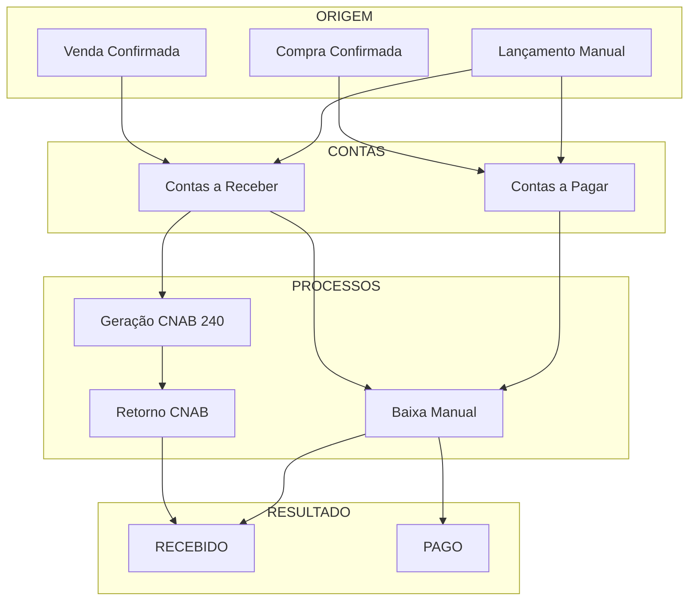
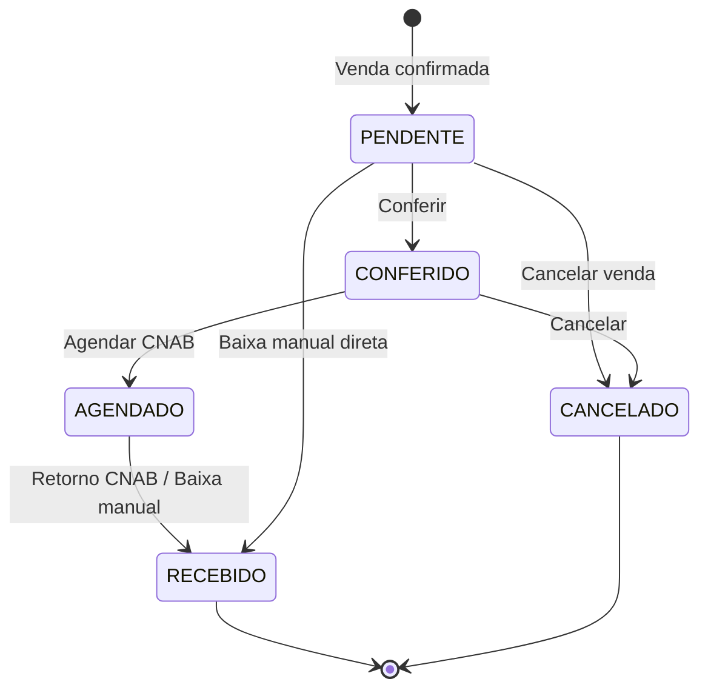
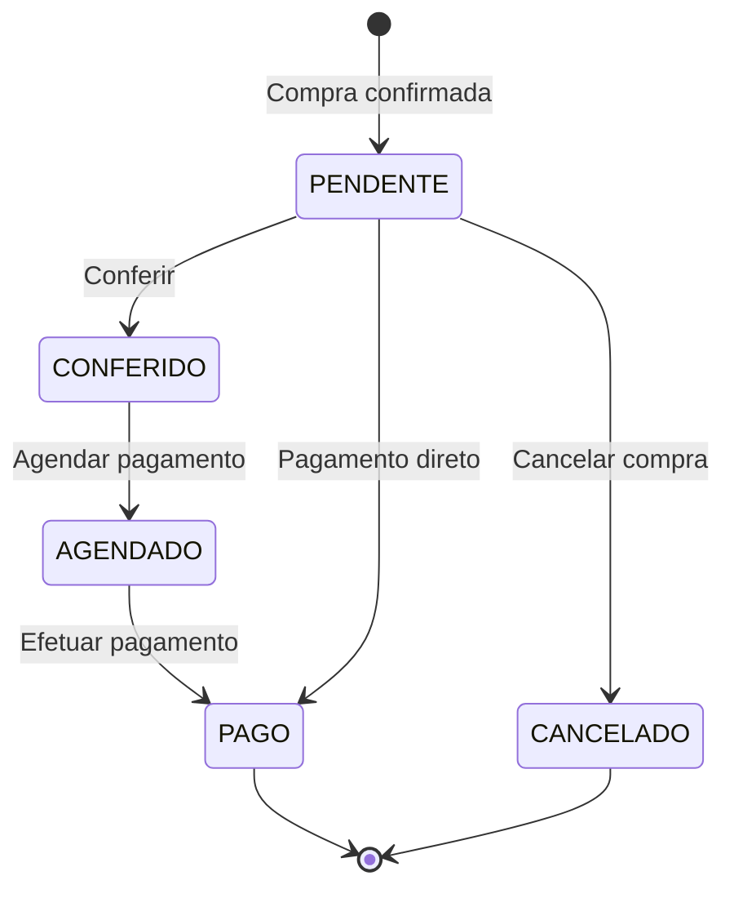

# Módulo: Financeiro

> Status: **Rascunho**
> Prioridade: 3 (crítico para operação)
> Complexidade: **Alta**

---

## Visão Geral

O módulo Financeiro gerencia Contas a Pagar (fornecedores) e Contas a Receber (clientes), incluindo geração de CNAB, baixa automática e conciliação bancária.

### Fluxos Principais



---

## Implementação Atual (C++)

### Classes

| Classe                       | Arquivo                          | Finalidade                      |
| ---------------------------- | -------------------------------- | ------------------------------- |
| `TabFinanceiro`              | `tabfinanceiro.cpp`              | Container principal da aba      |
| `Contas`                     | `contas.cpp`                     | Diálogo unificado Pagar/Receber |
| `WidgetFinanceiroContas`     | `widgetfinanceirocontas.cpp`     | Lista de contas                 |
| `WidgetFinanceiroFluxoCaixa` | `widgetfinanceirofluxocaixa.cpp` | Fluxo de caixa                  |
| `WidgetFinanceiroCompra`     | `widgetfinanceirocompra.cpp`     | Contas de compra                |
| `InputDialogFinanceiro`      | `inputdialogfinanceiro.cpp`      | Entrada de dados                |
| `FinanceiroProxyModel`       | `financeiroproxymodel.cpp`       | Filtros                         |

### Tabelas do Banco de Dados

```sql
-- Contas a Receber
conta_a_receber_has_pagamento
├── idPagamento (PK)
├── idVenda (FK)              -- Venda de origem
├── idLoja (FK)               -- Loja
├── contraParte               -- Nome do cliente
├── tipo                      -- Forma de pagamento (BOLETO, PIX, etc.)
├── parcela                   -- Número da parcela (1/3, 2/3, etc.)
├── valor                     -- Valor previsto
├── valorReal                 -- Valor recebido
├── status                    -- PENDENTE, CONFERIDO, AGENDADO, RECEBIDO, CANCELADO
├── dataPagamento             -- Data de vencimento
├── dataRealizado             -- Data de recebimento
├── idConta (FK)              -- Conta bancária
├── centroCusto               -- Centro de custo
├── tipoReal                  -- Forma real de pagamento
├── parcelaReal               -- Parcela real
├── observacao                -- Observações
├── grupo                     -- Agrupamento (VENDAS, TAXA CARTÃO, etc.)
└── deslesaoBancaria          -- Flag de deslocamento bancário

-- Contas a Pagar
conta_a_pagar_has_pagamento
├── idPagamento (PK)
├── idCompra (FK)             -- Compra de origem
├── idLoja (FK)               -- Loja
├── contraParte               -- Nome do fornecedor
├── tipo                      -- Forma de pagamento
├── parcela                   -- Número da parcela
├── valor                     -- Valor previsto
├── valorReal                 -- Valor pago
├── status                    -- PENDENTE, CONFERIDO, AGENDADO, PAGO, CANCELADO
├── dataPagamento             -- Data de vencimento
├── dataRealizado             -- Data de pagamento
├── idConta (FK)              -- Conta bancária
├── centroCusto               -- Centro de custo
├── grupo                     -- Agrupamento (COMPRAS, RT, DESPESAS, etc.)
├── subGrupo                  -- Subgrupo
├── nroPF                     -- Número do pedido fornecedor
└── observacao                -- Observações

-- Formas de Pagamento
forma_pagamento
├── idPagamento (PK)
├── pagamento                 -- Nome (BOLETO, PIX, CARTÃO, etc.)
├── idConta (FK)              -- Conta bancária padrão
├── parcelas                  -- Número de parcelas
├── taxa                      -- Taxa percentual
├── dMaisUm                   -- D+1 (flag)
├── pula1Mes                  -- Pula primeiro mês (flag)
├── ajustaDiaUtil             -- Ajustar para dia útil (flag)
└── desativado

-- Contas Bancárias
conta
├── idConta (PK)
├── banco                     -- Nome do banco
├── agencia                   -- Número da agência
├── conta                     -- Número da conta
├── tipo                      -- CORRENTE, POUPANÇA
└── saldo                     -- Saldo atual
```

### Fluxo de Estados

#### Contas a Receber



#### Contas a Pagar



### Geração de Contas

#### Contas a Receber (na Venda)

```cpp
// venda.cpp - montarFluxoCaixa()
void Venda::montarFluxoCaixa() {
    // Para cada forma de pagamento selecionada
    for (pagamento : formasPagamento) {
        // Obter configuração da forma de pagamento
        FormaPagamento config = getFormaPagamento(pagamento.tipo);

        // Para cada parcela
        for (int i = 1; i <= config.parcelas; i++) {
            QDate vencimento = calcularVencimento(
                dataVenda,
                i,
                config.dMaisUm,
                config.pula1Mes,
                config.ajustaDiaUtil
            );

            double valorParcela = pagamento.valor / config.parcelas;

            INSERT INTO conta_a_receber_has_pagamento (
                idVenda, idLoja, contraParte,
                tipo, parcela, valor,
                status = 'PENDENTE',
                dataPagamento = vencimento,
                grupo = 'VENDAS'
            );
        }

        // Se for cartão, criar taxa negativa
        if (pagamento.tipo.startsWith("CARTÃO")) {
            INSERT INTO conta_a_receber_has_pagamento (
                valor = -pagamento.valor * config.taxa / 100,
                grupo = 'TAXA CARTÃO',
                status = 'PENDENTE'
            );
        }
    }
}
```

#### Contas a Pagar (na Confirmação de Compra)

```cpp
// widgetcompraconfirmar.cpp
// Criado ao importar NFe do fornecedor
for (duplicata : nfe.duplicatas) {
    INSERT INTO conta_a_pagar_has_pagamento (
        idCompra, idLoja, contraParte = fornecedor,
        tipo = duplicata.tipo,
        parcela = duplicata.numero,
        valor = duplicata.valor,
        status = 'PENDENTE',
        dataPagamento = duplicata.vencimento,
        grupo = 'COMPRAS'
    );
}
```

### Baixa Manual

```cpp
// contas.cpp:100-150 - preencher()
// Quando usuário preenche dataRealizado:
void Contas::preencher(const QModelIndex &index) {
    if (coluna == "dataRealizado") {
        // Auto-preencher campos
        modelPendentes.setData(row, "status", tipo == Receber ? "RECEBIDO" : "PAGO");
        modelPendentes.setData(row, "valorReal", modelPendentes.data(row, "valor"));
        modelPendentes.setData(row, "tipoReal", modelPendentes.data(row, "tipo"));
        modelPendentes.setData(row, "parcelaReal", modelPendentes.data(row, "parcela"));
        modelPendentes.setData(row, "centroCusto", modelPendentes.data(row, "idLoja"));

        // Ajustar para dia útil
        modelPendentes.setData(row, "dataRealizado",
            qApp->ajustarDiaUtil(dataRealizado));

        // Se for taxa de cartão, baixar também
        if (grupo == "VENDAS" && tipoCartao) {
            baixarTaxaCartao(idVenda, tipo, parcela);
        }
    }
}
```

---

## Implementação Laravel (V2 - Event Sourced)

### Models

```php
// app/Models/FinanceiroParcela.php
// Unified table: financeiro_parcelas (tipo: RECEBER or PAGAR)
class FinanceiroParcela extends Model
{
    protected $table = 'financeiro_parcelas';

    protected $fillable = [
        'loja_id', 'tipo',
        'cliente_id', 'fornecedor_id',  // One OR the other depending on tipo
        'venda_id', 'compra_id',
        'nfe_entrada_id',
        'numero_parcela', 'total_parcelas',
        'valor', 'valor_recebido_pago',
        'valor_juros', 'valor_multa', 'valor_desconto',
        'data_vencimento', 'data_recebimento_pagamento',
        'forma_pagamento',
        'status',
        'nosso_numero', 'linha_digitavel', 'codigo_barras',
        'remessa_id', 'documento', 'observacoes',
    ];

    protected $casts = [
        'tipo' => FinanceiroTipo::class,
        'status' => FinanceiroStatus::class,
        'forma_pagamento' => FormaPagamento::class,
        'valor' => 'decimal:2',
        'valor_recebido_pago' => 'decimal:2',
        'valor_juros' => 'decimal:2',
        'valor_multa' => 'decimal:2',
        'valor_desconto' => 'decimal:2',
        'data_vencimento' => 'date',
        'data_recebimento_pagamento' => 'date',
    ];

    public function venda(): BelongsTo
    {
        return $this->belongsTo(Venda::class);
    }

    public function compra(): BelongsTo
    {
        return $this->belongsTo(Compra::class);
    }

    public function cliente(): BelongsTo
    {
        return $this->belongsTo(Cliente::class);
    }

    public function fornecedor(): BelongsTo
    {
        return $this->belongsTo(Fornecedor::class);
    }

    public function loja(): BelongsTo
    {
        return $this->belongsTo(Loja::class);
    }

    public function nfeEntrada(): BelongsTo
    {
        return $this->belongsTo(Nfe::class, 'nfe_entrada_id');
    }

    // View: Contas a Receber
    public static function scopeReceber(Builder $query): Builder
    {
        return $query->where('tipo', FinanceiroTipo::RECEBER);
    }

    // View: Contas a Pagar
    public static function scopePagar(Builder $query): Builder
    {
        return $query->where('tipo', FinanceiroTipo::PAGAR);
    }

    // Vencidos
    public static function scopeVencidos(Builder $query): Builder
    {
        return $query->where('data_vencimento', '<', now()->toDateString())
            ->whereIn('status', [FinanceiroStatus::PENDENTE, FinanceiroStatus::ATRASADO]);
    }

    // A vencer
    public static function scopeAVencer(Builder $query, int $dias = 7): Builder
    {
        return $query->whereBetween('data_vencimento', [now()->toDateString(), now()->addDays($dias)->toDateString()])
            ->where('status', FinanceiroStatus::PENDENTE);
    }

    // Pago/Recebido
    public static function scopePagos(Builder $query): Builder
    {
        return $query->where('status', FinanceiroStatus::PAGO)
            ->orWhere('status', FinanceiroStatus::RECEBIDO);
    }

    // Calcula dias em atraso
    public function diasAtraso(): int
    {
        if ($this->status->isCompleto()) {
            return 0;
        }
        return now()->diffInDays($this->data_vencimento);
    }

    // Valor pendente
    public function valorPendente(): float
    {
        $base = $this->valor + $this->valor_juros + $this->valor_multa - $this->valor_desconto;
        return max(0, $base - $this->valor_recebido_pago);
    }
}

// app/Models/RemessaCnab.php
class RemessaCnab extends Model
{
    protected $table = 'remessas_cnab';

    protected $fillable = [
        'loja_id', 'tipo', 'forma_pagamento',
        'data_geracao', 'sequencia_remessa',
        'arquivo_nome', 'conteudo',
        'status', 'data_envio', 'data_retorno',
    ];

    protected $casts = [
        'tipo' => RemessaTipo::class,
        'status' => RemessaStatus::class,
        'data_geracao' => 'datetime',
        'data_envio' => 'datetime',
        'data_retorno' => 'datetime',
    ];

    public function loja(): BelongsTo
    {
        return $this->belongsTo(Loja::class);
    }

    public function parcelas(): BelongsToMany
    {
        return $this->belongsToMany(FinanceiroParcela::class, 'financeiro_parcelas', 'remessa_id');
    }
}
```

### Event Sourcing (Append-Only Audit Trail)

This module implements Event Sourcing pattern with pg_ivm (PostgreSQL Incremental Materialized Views) for real-time audit logging and state reconstruction.

#### Event Tables (Append-Only)

```php
// Database Schema
CREATE TABLE financeiro_parcelas_events (
    id BIGSERIAL PRIMARY KEY,
    parcela_id BIGINT NOT NULL,                    -- Reference to FinanceiroParcela
    event_type VARCHAR(50) NOT NULL,               -- CRIADA, VALOR_ALTERADO, RECEBIDA, etc.
    event_data JSONB NOT NULL,                     -- Complete event payload
    usuario_id BIGINT,                             -- Who triggered the event
    ip_address INET,                               -- Source IP for audit
    created_at TIMESTAMP NOT NULL DEFAULT NOW()    -- Immutable timestamp
);

-- Immutability constraint: No UPDATE/DELETE allowed
CREATE TRIGGER fn_prevent_mutation_financeiro_events
BEFORE UPDATE OR DELETE ON financeiro_parcelas_events
FOR EACH ROW EXECUTE FUNCTION fn_prevent_mutation();

-- Append-only index for query performance
CREATE INDEX idx_financeiro_events_parcela_tipo
ON financeiro_parcelas_events (parcela_id, event_type, created_at);
```

#### Event Types

```php
// app/Enums/FinanceiroEventType.php
enum FinanceiroEventType: string
{
    case CRIADA = 'CRIADA';                        // Parcela created (from venda/compra)
    case VENCIMENTO_ALTERADO = 'VENCIMENTO_ALTERADO';
    case VALOR_ALTERADO = 'VALOR_ALTERADO';        // Interest/penalty/discount added
    case RECEBIDA = 'RECEBIDA';                    // Payment received
    case PAGA = 'PAGA';                            // Payment made
    case ATRASADA = 'ATRASADA';                    // Status changed to ATRASADO (automatic)
    case CANCELADA = 'CANCELADA';                  // Parcel canceled
    case JUROS_ADICIONADO = 'JUROS_ADICIONADO';
    case MULTA_ADICIONADA = 'MULTA_ADICIONADA';
    case DESCONTO_APLICADO = 'DESCONTO_APLICADO';
    case REMESSA_CNAB_GERADA = 'REMESSA_CNAB_GERADA';
    case RETORNO_PROCESSADO = 'RETORNO_PROCESSADO';
}
```

#### Event Recording Pattern

```php
// app/Services/Financeiro/FinanceiroParcelaService.php
class FinanceiroParcelaService
{
    /**
     * Create parcela and record CRIADA event
     */
    public function criarParcela(array $dados): FinanceiroParcela
    {
        return DB::transaction(function () use ($dados) {
            $parcela = FinanceiroParcela::create($dados);

            // Record event in append-only table
            DB::table('financeiro_parcelas_events')->insert([
                'parcela_id' => $parcela->id,
                'event_type' => FinanceiroEventType::CRIADA->value,
                'event_data' => json_encode([
                    'tipo' => $parcela->tipo,
                    'cliente_id' => $parcela->cliente_id,
                    'fornecedor_id' => $parcela->fornecedor_id,
                    'valor' => $parcela->valor,
                    'data_vencimento' => $parcela->data_vencimento,
                    'origem' => 'VENDA',  // or 'COMPRA', 'MANUAL'
                ]),
                'usuario_id' => auth()->id(),
                'ip_address' => request()->ip(),
                'created_at' => now(),
            ]);

            event(new FinanceiroParcelaCriada($parcela));

            return $parcela;
        });
    }

    /**
     * Record payment and update parcela
     */
    public function registrarRecebimento(
        FinanceiroParcela $parcela,
        float $valor,
        string $formaRecebimento,
        ?string $nossoNumero = null
    ): void {
        DB::transaction(function () use ($parcela, $valor, $formaRecebimento, $nossoNumero) {
            // Record event FIRST (append-only)
            DB::table('financeiro_parcelas_events')->insert([
                'parcela_id' => $parcela->id,
                'event_type' => FinanceiroEventType::RECEBIDA->value,
                'event_data' => json_encode([
                    'valor_recebido' => $valor,
                    'forma_recebimento' => $formaRecebimento,
                    'nosso_numero' => $nossoNumero,
                    'saldo_anterior' => $parcela->valorPendente(),
                    'saldo_novo' => max(0, $parcela->valorPendente() - $valor),
                ]),
                'usuario_id' => auth()->id(),
                'ip_address' => request()->ip(),
                'created_at' => now(),
            ]);

            // Then update materialized view (computed from events)
            $parcela->update([
                'valor_recebido_pago' => $parcela->valor_recebido_pago + $valor,
                'data_recebimento_pagamento' => now(),
                'status' => FinanceiroStatus::RECEBIDO,
                'forma_pagamento' => $formaRecebimento,
            ]);

            event(new FinanceiroParcelaRecebida($parcela, $valor));
        });
    }
}
```

#### Materialized View Maintenance (pg_ivm)

```sql
-- Create materialized view for fast queries (updated incrementally by pg_ivm)
CREATE MATERIALIZED VIEW financeiro_parcelas_view AS
SELECT
    fp.id,
    fp.loja_id,
    fp.tipo,
    fp.cliente_id,
    fp.fornecedor_id,
    fp.valor,
    fp.valor_recebido_pago,
    (fp.valor + fp.valor_juros + fp.valor_multa - fp.valor_desconto - fp.valor_recebido_pago) as saldo_pendente,
    fp.data_vencimento,
    CASE
        WHEN fp.status = 'RECEBIDO' THEN 'RECEBIDO'
        WHEN fp.status = 'PAGO' THEN 'PAGO'
        WHEN fp.status = 'CANCELADO' THEN 'CANCELADO'
        WHEN CURDATE() > fp.data_vencimento AND fp.status NOT IN ('RECEBIDO', 'PAGO', 'CANCELADO')
            THEN 'ATRASADO'
        ELSE fp.status
    END as status_atual,
    fp.created_at,
    MAX(evt.created_at) as ultima_atualizacao
FROM financeiro_parcelas fp
LEFT JOIN financeiro_parcelas_events evt ON evt.parcela_id = fp.id
GROUP BY fp.id, fp.loja_id, fp.tipo, fp.cliente_id, fp.fornecedor_id,
         fp.valor, fp.valor_recebido_pago, fp.valor_juros, fp.valor_multa,
         fp.valor_desconto, fp.data_vencimento, fp.status, fp.created_at;

-- Create IVM trigger to maintain view incrementally
CREATE TRIGGER refresh_financeiro_parcelas_view_on_event
AFTER INSERT ON financeiro_parcelas_events
FOR EACH ROW EXECUTE FUNCTION refresh_ivm_view('financeiro_parcelas_view');
```

#### Audit Trail Query Example

```php
// Query the append-only event log for a specific parcel
$eventos = DB::table('financeiro_parcelas_events')
    ->where('parcela_id', $parcelaId)
    ->orderBy('created_at')
    ->get();

// Reconstruct full history from events
foreach ($eventos as $evento) {
    echo sprintf(
        "[%s] %s: %s (user: %s, ip: %s)\n",
        $evento->created_at->format('Y-m-d H:i:s'),
        $evento->event_type,
        $evento->event_data,
        $evento->usuario_id ?? 'system',
        $evento->ip_address ?? 'unknown'
    );
}
```

#### Key Benefits

- **Immutability**: Events cannot be changed or deleted (fn_prevent_mutation trigger)
- **Audit Trail**: Complete history of all changes with timestamp, user, and IP
- **State Reconstruction**: Can rebuild any parcel state at any point in time
- **Real-time Views**: pg_ivm maintains views incrementally without cron jobs
- **Compliance**: Meets regulatory requirements for financial records
- **Debugging**: Trace exact sequence of changes and who made them

---

### Enums

```php
// app/Enums/FinanceiroTipo.php
enum FinanceiroTipo: string
{
    case RECEBER = 'RECEBER';
    case PAGAR = 'PAGAR';

    public function label(): string
    {
        return match($this) {
            self::RECEBER => 'Contas a Receber',
            self::PAGAR => 'Contas a Pagar',
        };
    }
}

// app/Enums/FinanceiroStatus.php
enum FinanceiroStatus: string
{
    case PENDENTE = 'PENDENTE';
    case AGENDADO = 'AGENDADO';
    case PAGO = 'PAGO';
    case RECEBIDO = 'RECEBIDO';
    case ATRASADO = 'ATRASADO';
    case CANCELADO = 'CANCELADO';

    public function label(): string
    {
        return match($this) {
            self::PENDENTE => 'Pendente',
            self::AGENDADO => 'Agendado',
            self::PAGO => 'Pago',
            self::RECEBIDO => 'Recebido',
            self::ATRASADO => 'Atrasado',
            self::CANCELADO => 'Cancelado',
        };
    }

    public function isCompleto(): bool
    {
        return in_array($this, [self::PAGO, self::RECEBIDO, self::CANCELADO]);
    }
}

// app/Enums/FormaPagamento.php
enum FormaPagamento: string
{
    case DINHEIRO = 'DINHEIRO';
    case PIX = 'PIX';
    case CARTAO_DEBITO = 'CARTAO_DEBITO';
    case CARTAO_CREDITO = 'CARTAO_CREDITO';
    case BOLETO = 'BOLETO';
    case TRANSFERENCIA = 'TRANSFERENCIA';
    case CHEQUE = 'CHEQUE';
    case OUTROS = 'OUTROS';

    public function label(): string
    {
        return match($this) {
            self::DINHEIRO => 'Dinheiro',
            self::PIX => 'PIX',
            self::CARTAO_DEBITO => 'Cartão Débito',
            self::CARTAO_CREDITO => 'Cartão Crédito',
            self::BOLETO => 'Boleto',
            self::TRANSFERENCIA => 'Transferência Bancária',
            self::CHEQUE => 'Cheque',
            self::OUTROS => 'Outros',
        };
    }

    public function temErro(): bool
    {
        return match($this) {
            self::BOLETO, self::CARTAO_CREDITO => true,
            default => false,
        };
    }
}

// NOTE: ContaReceberStatus and ContaPagarStatus are DEPRECATED
// Use the unified FinanceiroStatus enum instead
// Both receivables and payables use the same status values, distinguished by tipo field

// app/Enums/ContaGrupo.php
enum ContaGrupo: string
{
    case VENDAS = 'VENDAS';
    case TAXA_CARTAO = 'TAXA CARTÃO';
    case COMPRAS = 'COMPRAS';
    case RT = 'RT';  // Comissões
    case DESPESAS = 'DESPESAS';
    case IMPOSTOS = 'IMPOSTOS';
    case OUTROS = 'OUTROS';
}
```

### Services

```php
// app/Services/Financeiro/FinanceiroParcelaService.php
//
// UNIFIED SERVICE - Handles both receivables and payables
// Replaces: ContaReceberService, ContaPagarService
// Distinction: tipo field on FinanceiroParcela ('RECEBER' vs 'PAGAR')

class FinanceiroParcelaService
{
    /**
     * Gerar parcelas de venda (contas a receber)
     */
    public function gerarDeVenda(Venda $venda, array $pagamentos): Collection
    {
        return DB::transaction(function () use ($venda, $pagamentos) {
            $parcelas = collect();

            foreach ($pagamentos as $pagamento) {
                $formaPagamento = FormaPagamento::findOrFail($pagamento['forma_pagamento_id']);
                $valorParcela = $pagamento['valor'] / $formaPagamento->parcelas;

                for ($i = 1; $i <= $formaPagamento->parcelas; $i++) {
                    $parcela = FinanceiroParcela::create([
                        'tipo' => FinanceiroTipo::RECEBER,
                        'loja_id' => $venda->loja_id,
                        'venda_id' => $venda->id,
                        'cliente_id' => $venda->cliente_id,
                        'forma_pagamento_id' => $formaPagamento->id,
                        'conta_bancaria_id' => $formaPagamento->conta_bancaria_id,
                        'parcela' => $i,
                        'total_parcelas' => $formaPagamento->parcelas,
                        'valor' => $valorParcela,
                        'status' => FinanceiroStatus::PENDENTE,
                        'grupo' => ContaGrupo::VENDAS,
                        'vencimento' => $formaPagamento->calcularVencimento(
                            $venda->created_at,
                            $i
                        ),
                    ]);

                    // Record event
                    $this->recordarEvento($parcela, 'CRIADA');
                    $parcelas->push($parcela);
                }

                // Criar taxa de cartão se aplicável
                if ($formaPagamento->taxa_percentual > 0) {
                    $taxa = FinanceiroParcela::create([
                        'tipo' => FinanceiroTipo::RECEBER,
                        'loja_id' => $venda->loja_id,
                        'venda_id' => $venda->id,
                        'cliente_id' => $venda->cliente_id,
                        'forma_pagamento_id' => $formaPagamento->id,
                        'valor' => -($pagamento['valor'] * $formaPagamento->taxa_percentual / 100),
                        'status' => FinanceiroStatus::PENDENTE,
                        'grupo' => ContaGrupo::TAXA_CARTAO,
                        'vencimento' => $formaPagamento->calcularVencimento(
                            $venda->created_at,
                            $formaPagamento->parcelas
                        ),
                    ]);

                    $this->recordarEvento($taxa, 'CRIADA');
                    $parcelas->push($taxa);
                }
            }

            return $parcelas;
        });
    }

    /**
     * Gerar parcelas de compra (contas a pagar)
     */
    public function gerarDeCompra(Compra $compra, array $duplicatas): Collection
    {
        return DB::transaction(function () use ($compra, $duplicatas) {
            $parcelas = collect();

            foreach ($duplicatas as $duplicata) {
                $parcela = FinanceiroParcela::create([
                    'tipo' => FinanceiroTipo::PAGAR,
                    'loja_id' => $compra->loja_id,
                    'compra_id' => $compra->id,
                    'fornecedor_id' => $compra->fornecedor_id,
                    'parcela' => $duplicata['numero'],
                    'total_parcelas' => count($duplicatas),
                    'valor' => $duplicata['valor'],
                    'status' => FinanceiroStatus::PENDENTE,
                    'grupo' => ContaGrupo::COMPRAS,
                    'vencimento' => Carbon::parse($duplicata['vencimento']),
                    'numero_documento' => $duplicata['numero_documento'] ?? null,
                ]);

                $this->recordarEvento($parcela, 'CRIADA');
                $parcelas->push($parcela);
            }

            return $parcelas;
        });
    }

    /**
     * Baixar parcela (receber/pagar)
     */
    public function baixar(
        FinanceiroParcela $parcela,
        Carbon $dataMovimentacao,
        ?float $valorReal = null,
        ?int $contaBancariaId = null
    ): void {
        $this->validarBaixa($parcela);

        DB::transaction(function () use ($parcela, $dataMovimentacao, $valorReal, $contaBancariaId) {
            $novoStatus = match ($parcela->tipo) {
                FinanceiroTipo::RECEBER => FinanceiroStatus::RECEBIDA,
                FinanceiroTipo::PAGAR => FinanceiroStatus::PAGA,
            };

            $parcela->update([
                'status' => $novoStatus,
                'data_movimentacao' => $dataMovimentacao,
                'valor_real' => $valorReal ?? $parcela->valor,
                'conta_bancaria_id' => $contaBancariaId ?? $parcela->conta_bancaria_id,
            ]);

            $this->recordarEvento($parcela, 'RECEBIDA/PAGA', [
                'valor' => $valorReal ?? $parcela->valor,
                'data' => $dataMovimentacao->format('Y-m-d'),
            ]);

            // Se for venda, baixar taxa de cartão correspondente
            if ($parcela->grupo === ContaGrupo::VENDAS) {
                $this->baixarTaxaCartaoCorrespondente($parcela, $dataMovimentacao);
            }

            event(new FinanceiroParcelaBaixa($parcela));
        });
    }

    /**
     * Criar comissão (RT) - contas a pagar
     */
    public function criarComissao(
        Venda $venda,
        Profissional $profissional,
        float $valor
    ): FinanceiroParcela {
        return DB::transaction(function () use ($venda, $profissional, $valor) {
            $parcela = FinanceiroParcela::create([
                'tipo' => FinanceiroTipo::PAGAR,
                'loja_id' => $venda->loja_id,
                'fornecedor_id' => null,  // Profissional não é fornecedor
                'parcela' => 1,
                'total_parcelas' => 1,
                'valor' => $valor,
                'status' => FinanceiroStatus::PENDENTE,
                'grupo' => ContaGrupo::RT,
                'vencimento' => now()->addDays(30),
                'observacao' => "Comissão venda #{$venda->id} - {$profissional->nome}",
            ]);

            $this->recordarEvento($parcela, 'CRIADA');
            return $parcela;
        });
    }

    /**
     * Cancelar parcela
     */
    public function cancelar(FinanceiroParcela $parcela, string $motivo): void
    {
        if (in_array($parcela->status, [FinanceiroStatus::RECEBIDA, FinanceiroStatus::PAGA])) {
            throw new BusinessException('Não é possível cancelar parcela já liquidada');
        }

        $parcela->update([
            'status' => FinanceiroStatus::CANCELADA,
            'observacao' => $motivo,
        ]);

        $this->recordarEvento($parcela, 'CANCELADA', ['motivo' => $motivo]);
    }

    /**
     * Baixar taxa de cartão correspondente
     */
    private function baixarTaxaCartaoCorrespondente(FinanceiroParcela $parcela, Carbon $dataMovimentacao): void
    {
        $taxaCartao = FinanceiroParcela::where('venda_id', $parcela->venda_id)
            ->where('forma_pagamento_id', $parcela->forma_pagamento_id)
            ->where('grupo', ContaGrupo::TAXA_CARTAO)
            ->where('status', FinanceiroStatus::PENDENTE)
            ->first();

        if ($taxaCartao) {
            $taxaCartao->update([
                'status' => FinanceiroStatus::RECEBIDA,
                'data_movimentacao' => $dataMovimentacao,
                'valor_real' => $taxaCartao->valor,
            ]);

            $this->recordarEvento($taxaCartao, 'RECEBIDA/PAGA');
        }
    }

    private function validarBaixa(FinanceiroParcela $parcela): void
    {
        $statusPermitidos = [FinanceiroStatus::PENDENTE, FinanceiroStatus::ATRASADA];
        if (!in_array($parcela->status, $statusPermitidos)) {
            throw new BusinessException(
                "Parcela com status {$parcela->status->label()} não pode ser baixada"
            );
        }
    }

    private function recordarEvento(FinanceiroParcela $parcela, string $tipoEvento, array $dados = []): void
    {
        DB::table('financeiro_parcelas_events')->insert([
            'parcela_id' => $parcela->id,
            'event_type' => $tipoEvento,
            'event_data' => json_encode($dados),
            'created_at' => now(),
            'updated_at' => now(),
        ]);
    }
}

// app/Services/Financeiro/CnabService.php
//
// CNAB Processing - Works with unified FinanceiroParcela model
// Handles both receivables (tipo='RECEBER') remittance and return processing

class CnabService
{
    public function __construct(private FinanceiroParcelaService $parcelaService) {}

    /**
     * Gerar arquivo CNAB 240 para cobrança
     * Filtra apenas parcelas RECEBER com forma de pagamento BOLETO
     */
    public function gerarCnab240(Collection $parcelas, ContaBancaria $contaBancaria): string
    {
        // Validar que todas são RECEBER
        if ($parcelas->contains(fn($p) => $p->tipo !== FinanceiroTipo::RECEBER)) {
            throw new BusinessException('CNAB de cobrança deve conter apenas parcelas a receber');
        }

        $cnab = new Cnab240();

        $cnab->setEmpresa([
            'nome' => config('app.empresa_nome'),
            'cnpj' => config('app.empresa_cnpj'),
        ]);

        $cnab->setConta([
            'banco' => $contaBancaria->banco,
            'agencia' => $contaBancaria->agencia,
            'conta' => $contaBancaria->conta,
            'digito' => $contaBancaria->digito,
        ]);

        $parcelas->each(function (FinanceiroParcela $parcela) use ($cnab) {
            $cnab->addBoleto([
                'nosso_numero' => $parcela->id,
                'valor' => $parcela->valor,
                'vencimento' => $parcela->vencimento->format('Y-m-d'),
                'sacado' => [
                    'nome' => $parcela->cliente->razao_social,
                    'cpf_cnpj' => $parcela->cliente->cpf_cnpj,
                    'endereco' => $parcela->cliente->endereco,
                ],
            ]);

            // Marcar como agendado para cobrança
            $parcela->update(['status' => FinanceiroStatus::AGENDADA]);

            DB::table('financeiro_parcelas_events')->insert([
                'parcela_id' => $parcela->id,
                'event_type' => 'REMESSA_CNAB_GERADA',
                'event_data' => json_encode(['banco' => $cnab->getBanco()]),
                'created_at' => now(),
                'updated_at' => now(),
            ]);
        });

        return $cnab->gerar();
    }

    /**
     * Processar arquivo de retorno CNAB
     * Atualiza parcelas com informações de pagamento recebidas do banco
     */
    public function processarRetorno(string $conteudo): array
    {
        $cnab = new Cnab240Retorno($conteudo);
        $processados = [];

        foreach ($cnab->getRegistros() as $registro) {
            if ($registro->isPago()) {
                $parcela = FinanceiroParcela::find($registro->getNossoNumero());

                if ($parcela) {
                    $this->parcelaService->baixar(
                        $parcela,
                        Carbon::parse($registro->getDataPagamento()),
                        $registro->getValorPago()
                    );

                    DB::table('financeiro_parcelas_events')->insert([
                        'parcela_id' => $parcela->id,
                        'event_type' => 'RETORNO_PROCESSADO',
                        'event_data' => json_encode([
                            'banco' => $registro->getBanco(),
                            'sequencial' => $registro->getSequencial(),
                        ]),
                        'created_at' => now(),
                        'updated_at' => now(),
                    ]);

                    $processados[] = $parcela;
                }
            }
        }

        return $processados;
    }
}
```

### Controllers

```php
// app/Http/Controllers/FinanceiroParcelaController.php
//
// UNIFIED CONTROLLER - Handles receivables and payables
// Replaces: ContaReceberController, ContaPagarController
// Routes are filtered by tipo parameter (RECEBER vs PAGAR)

class FinanceiroParcelaController extends Controller
{
    public function __construct(
        private FinanceiroParcelaService $parcelaService
    ) {}

    /**
     * Listar parcelas (contas a receber ou pagar)
     */
    public function index(Request $request, string $tipo = 'RECEBER')
    {
        $tipoEnum = FinanceiroTipo::tryFrom(strtoupper($tipo));
        if (!$tipoEnum) {
            return back()->withErrors('Tipo inválido: deve ser RECEBER ou PAGAR');
        }

        $query = FinanceiroParcela::where('tipo', $tipoEnum);

        if ($tipoEnum === FinanceiroTipo::RECEBER) {
            $parcelas = $query->with(['venda:id', 'cliente:id,razao_social', 'formaPagamento:id,nome'])
                ->when($request->status, fn($q) => $q->where('status', $request->status))
                ->when($request->cliente_id, fn($q) => $q->where('cliente_id', $request->cliente_id))
                ->when($request->vencidos, fn($q) => $q->where('vencimento', '<', now())->where('status', '!=', FinanceiroStatus::RECEBIDA))
                ->when($request->a_vencer, fn($q) => $q->where('vencimento', '<=', now()->addDays($request->a_vencer)))
                ->when($request->periodo, function($q) use ($request) {
                    [$inicio, $fim] = explode(',', $request->periodo);
                    $q->whereBetween('vencimento', [$inicio, $fim]);
                })
                ->orderBy('vencimento')
                ->paginate(50);

            return Inertia::render('Financeiro/Parcelas/Receber', [
                'parcelas' => $parcelas,
                'totais' => [
                    'pendente' => FinanceiroParcela::where('tipo', FinanceiroTipo::RECEBER)
                        ->where('status', FinanceiroStatus::PENDENTE)->sum('valor'),
                    'vencida' => FinanceiroParcela::where('tipo', FinanceiroTipo::RECEBER)
                        ->where('vencimento', '<', now())
                        ->where('status', '!=', FinanceiroStatus::RECEBIDA)
                        ->sum('valor'),
                ],
            ]);
        } else {
            // PAGAR
            $parcelas = $query->with(['compra:id', 'fornecedor:id,razao_social'])
                ->when($request->status, fn($q) => $q->where('status', $request->status))
                ->when($request->fornecedor_id, fn($q) => $q->where('fornecedor_id', $request->fornecedor_id))
                ->when($request->vencidos, fn($q) => $q->where('vencimento', '<', now())->where('status', '!=', FinanceiroStatus::PAGA))
                ->orderBy('vencimento')
                ->paginate(50);

            return Inertia::render('Financeiro/Parcelas/Pagar', [
                'parcelas' => $parcelas,
                'totais' => [
                    'pendente' => FinanceiroParcela::where('tipo', FinanceiroTipo::PAGAR)
                        ->where('status', FinanceiroStatus::PENDENTE)->sum('valor'),
                    'vencida' => FinanceiroParcela::where('tipo', FinanceiroTipo::PAGAR)
                        ->where('vencimento', '<', now())
                        ->where('status', '!=', FinanceiroStatus::PAGA)
                        ->sum('valor'),
                ],
            ]);
        }
    }

    /**
     * Visualizar parcela
     */
    public function show(FinanceiroParcela $parcela)
    {
        return Inertia::render('Financeiro/Parcelas/Show', [
            'parcela' => $parcela->load('eventos'),
            'eventos' => $parcela->eventos()
                ->orderByDesc('created_at')
                ->get(),
        ]);
    }

    /**
     * Baixar parcela (receber/pagar)
     */
    public function baixar(FinanceiroParcela $parcela, BaixarParcelaRequest $request)
    {
        try {
            $this->parcelaService->baixar(
                $parcela,
                Carbon::parse($request->data_movimentacao),
                $request->valor_real ?? $parcela->valor,
                $request->conta_bancaria_id
            );

            return back()->with('success', match ($parcela->tipo) {
                FinanceiroTipo::RECEBER => 'Parcela recebida com sucesso',
                FinanceiroTipo::PAGAR => 'Parcela paga com sucesso',
            });
        } catch (BusinessException $e) {
            return back()->withErrors($e->getMessage());
        }
    }

    /**
     * Baixar parcelas em lote
     */
    public function baixarEmLote(BaixarParcelasEmLoteRequest $request)
    {
        $parcelas = FinanceiroParcela::whereIn('id', $request->parcela_ids)->get();

        try {
            foreach ($parcelas as $parcela) {
                $this->parcelaService->baixar(
                    $parcela,
                    Carbon::parse($request->data_movimentacao ?? now()),
                    null,
                    $request->conta_bancaria_id ?? null
                );
            }

            return back()->with('success', count($parcelas) . ' parcelas liquidadas');
        } catch (BusinessException $e) {
            return back()->withErrors($e->getMessage());
        }
    }

    /**
     * Cancelar parcela
     */
    public function cancelar(FinanceiroParcela $parcela, CancelarParcelaRequest $request)
    {
        try {
            $this->parcelaService->cancelar($parcela, $request->motivo);

            return back()->with('success', 'Parcela cancelada com sucesso');
        } catch (BusinessException $e) {
            return back()->withErrors($e->getMessage());
        }
    }
}
```

### Rotas

```php
// routes/web.php
Route::middleware(['auth'])->prefix('financeiro')->name('financeiro.')->group(function () {
    // UNIFIED: Parcelas (Contas a Receber e Pagar)
    // Filter by tipo parameter: ?tipo=RECEBER (default) or ?tipo=PAGAR

    Route::get('parcelas/{tipo?}', [FinanceiroParcelaController::class, 'index'])
        ->name('parcelas.index');

    Route::get('parcelas/{parcela}', [FinanceiroParcelaController::class, 'show'])
        ->name('parcelas.show');

    Route::post('parcelas/{parcela}/baixar', [FinanceiroParcelaController::class, 'baixar'])
        ->name('parcelas.baixar');

    Route::post('parcelas/baixar-lote', [FinanceiroParcelaController::class, 'baixarEmLote'])
        ->name('parcelas.baixar-lote');

    Route::post('parcelas/{parcela}/cancelar', [FinanceiroParcelaController::class, 'cancelar'])
        ->name('parcelas.cancelar');

    // Legacy routes for backwards compatibility (redirect to unified controller)
    Route::redirect('receber', '/financeiro/parcelas/RECEBER')->name('receber.index');
    Route::redirect('pagar', '/financeiro/parcelas/PAGAR')->name('pagar.index');

    // CNAB
    Route::post('cnab/gerar', [CnabController::class, 'gerar'])->name('cnab.gerar');
    Route::post('cnab/processar-retorno', [CnabController::class, 'processarRetorno'])
        ->name('cnab.processar-retorno');

    // Fluxo de Caixa
    Route::get('fluxo-caixa', [FluxoCaixaController::class, 'index'])->name('fluxo-caixa');
});
```

---

## Componentes de UI

### Lista de Parcelas (Contas a Receber/Pagar)

**UNIFIED VIEW** - Filtra por `tipo` (RECEBER ou PAGAR)

#### Contas a Receber (`/financeiro/parcelas/RECEBER`)
- Filtros: Status, Cliente, Vencimento, Vencidos, A Vencer
- Colunas: Venda, Cliente, Forma, Parcela, Valor, Vencimento, Status
- Totalizadores: Pendente, Vencido, Recebido no período
- Ações: Visualizar, Baixar, Baixar em lote, Cancelar
- Status valores: PENDENTE, AGENDADA, RECEBIDA, ATRASADA, CANCELADA

#### Contas a Pagar (`/financeiro/parcelas/PAGAR`)
- Filtros: Status, Fornecedor, Grupo, Vencimento
- Colunas: Compra, Fornecedor, Grupo, Valor, Vencimento, Status
- Totalizadores: Por grupo, Vencido, A vencer
- Ações: Visualizar, Baixar, Cancelar
- Status valores: PENDENTE, AGENDADA, PAGA, ATRASADA, CANCELADA

### Fluxo de Caixa

- Visão diária/semanal/mensal
- Entradas vs Saídas
- Saldo projetado
- Gráfico de evolução

### Geração de CNAB

- Seleção de contas para cobrança
- Conta bancária de destino
- Download do arquivo
- Histórico de remessas

### Processamento de Retorno

- Upload de arquivo de retorno
- Preview de baixas
- Confirmação
- Log de processamento

---

## Eventos

**UNIFIED EVENTS** - All events use the same `FinanceiroParcelaBaixa` event

| Evento                    | Tipo         | Dispara              | Nota |
| ----------------------- | ------------ | -------------------- | ---- |
| `FinanceiroParcelaBaixa` | RECEBER      | Notificar cliente quando recebe | Com `tipo='RECEBER'` |
| `FinanceiroParcelaBaixa` | PAGAR        | Notificar quando efetua pagamento | Com `tipo='PAGAR'` |
| `FinanceiroParcelaAtrasada` | RECEBER/PAGAR | Alerta para cobrança/pagamento | Triggered by scheduler |
| Event type: `REMESSA_CNAB_GERADA` | Audit trail | Log de remessa gerada | Event Sourcing table |
| Event type: `RETORNO_PROCESSADO` | Audit trail | Log de retorno processado | Event Sourcing table |

Ver: **Event Sourcing** section acima (Database → Event Sourcing) para tabelas `financeiro_parcelas_events` e tipos de eventos completos.

---

## Considerações de Migração

### Migração de Dados

1. `conta_a_receber_has_pagamento` → `contas_receber`
2. `conta_a_pagar_has_pagamento` → `contas_pagar`
3. `forma_pagamento` → `formas_pagamento`
4. `conta` → `contas_bancarias`

### Mudanças

- Separar cliente/fornecedor em FK ao invés de `contraParte` VARCHAR
- Status como Enum
- Normalizar grupos e subgrupos
- Adicionar índices para consultas de vencimento

### Scripts de Migração

```sql
-- Step 1: Create unified financeiro_parcelas table from old contas_receber
INSERT INTO financeiro_parcelas (
    loja_id, tipo, cliente_id, fornecedor_id,
    venda_id, numero_parcela, total_parcelas,
    valor, valor_recebido_pago, valor_juros, valor_multa, valor_desconto,
    data_vencimento, data_recebimento_pagamento,
    forma_pagamento, status, observacoes,
    created_at, updated_at
)
SELECT
    1,  -- Default loja_id (update with actual loja mapping)
    'RECEBER',
    c.id,  -- cliente_id from normalized cliente
    NULL,  -- No fornecedor for receivable
    cr.venda_id,
    cr.numero_parcela,
    cr.total_parcelas,
    cr.valor,
    cr.valor_recebido,
    cr.valor_juros,
    cr.valor_multa,
    cr.valor_desconto,
    cr.data_vencimento,
    CASE WHEN cr.status = 'RECEBIDO' THEN cr.data_recebimento ELSE NULL END,
    cr.forma_pagamento,
    CASE
        WHEN cr.status = 'RECEBIDO' THEN 'RECEBIDO'
        WHEN cr.status = 'CANCELADO' THEN 'CANCELADO'
        WHEN cr.status = 'PENDENTE' THEN 'PENDENTE'
        WHEN CURDATE() > cr.data_vencimento AND cr.status NOT IN ('RECEBIDO', 'CANCELADO')
            THEN 'ATRASADO'
        ELSE 'PENDENTE'
    END,
    cr.observacoes,
    cr.created_at,
    cr.updated_at
FROM contas_receber cr
LEFT JOIN clientes c ON cr.cliente_id = c.id OR (cr.contraparte IS NOT NULL AND c.razao_social = cr.contraparte)
WHERE cr.id NOT IN (SELECT original_id FROM financeiro_parcelas WHERE original_id IS NOT NULL);

-- Step 2: Create unified financeiro_parcelas table from old contas_pagar
INSERT INTO financeiro_parcelas (
    loja_id, tipo, cliente_id, fornecedor_id,
    compra_id, numero_parcela, total_parcelas,
    valor, valor_recebido_pago, valor_juros, valor_multa, valor_desconto,
    data_vencimento, data_recebimento_pagamento,
    forma_pagamento, status, observacoes,
    created_at, updated_at
)
SELECT
    1,  -- Default loja_id (update with actual loja mapping)
    'PAGAR',
    NULL,  -- No cliente for payable
    f.id,  -- fornecedor_id from normalized fornecedor
    cp.compra_id,
    cp.numero_parcela,
    cp.total_parcelas,
    cp.valor,
    cp.valor_pago,
    cp.valor_juros,
    cp.valor_multa,
    cp.valor_desconto,
    cp.data_vencimento,
    CASE WHEN cp.status = 'PAGO' THEN cp.data_pagamento ELSE NULL END,
    cp.forma_pagamento,
    CASE
        WHEN cp.status = 'PAGO' THEN 'PAGO'
        WHEN cp.status = 'CANCELADO' THEN 'CANCELADO'
        WHEN cp.status = 'PENDENTE' THEN 'PENDENTE'
        WHEN CURDATE() > cp.data_vencimento AND cp.status NOT IN ('PAGO', 'CANCELADO')
            THEN 'ATRASADO'
        ELSE 'PENDENTE'
    END,
    cp.observacoes,
    cp.created_at,
    cp.updated_at
FROM contas_pagar cp
LEFT JOIN fornecedores f ON cp.fornecedor_id = f.id OR (cp.contraparte IS NOT NULL AND f.razao_social = cp.contraparte)
WHERE cp.id NOT IN (SELECT original_id FROM financeiro_parcelas WHERE original_id IS NOT NULL);

-- Step 3: Add index for query performance (FIFO for payment scheduling)
CREATE INDEX idx_financeiro_parcelas_vencimento
ON financeiro_parcelas (tipo, status, data_vencimento)
WHERE status IN ('PENDENTE', 'AGENDADO', 'ATRASADO');

-- Step 4: Add index for client/supplier queries
CREATE INDEX idx_financeiro_parcelas_partes
ON financeiro_parcelas (cliente_id, fornecedor_id, tipo);
```
