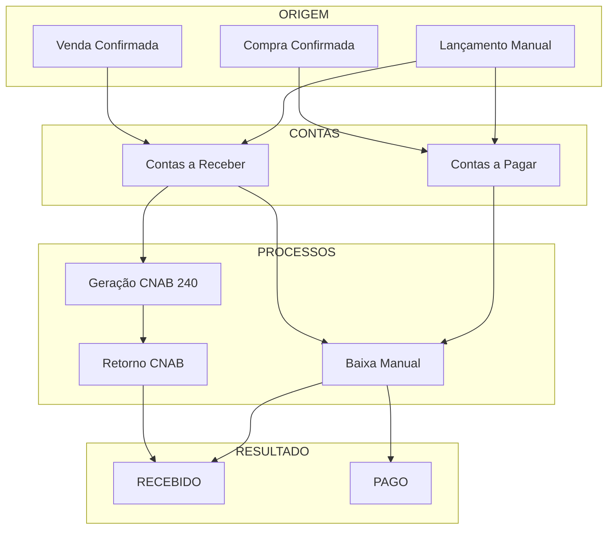
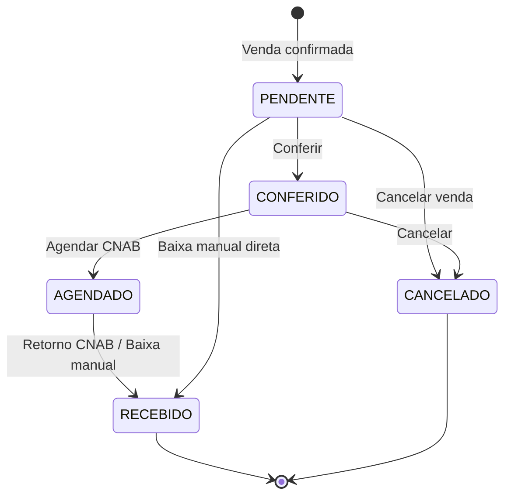
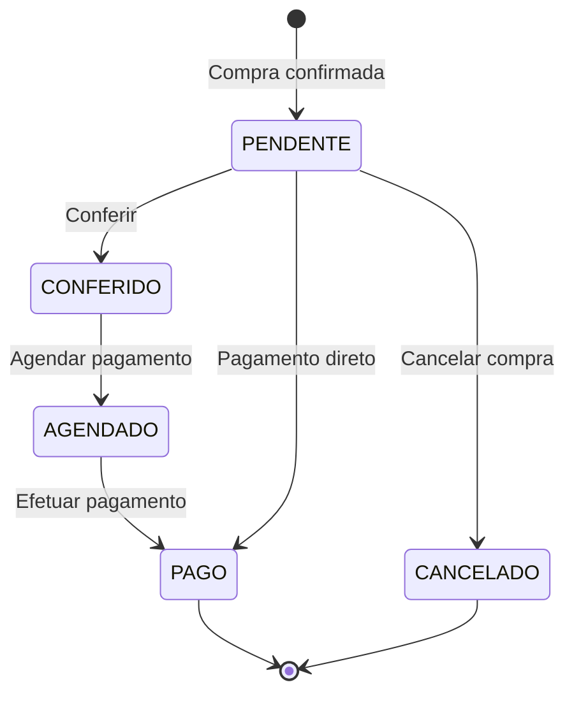

# Módulo: Financeiro

> Status: **Rascunho**
> Prioridade: 3 (crítico para operação)
> Complexidade: **Alta**

---

## Visão Geral

O módulo Financeiro gerencia Contas a Pagar (fornecedores) e Contas a Receber (clientes), incluindo geração de CNAB, baixa automática e conciliação bancária.

### Fluxos Principais



---

## Implementação Atual (C++)

### Classes

| Classe | Arquivo | Finalidade |
|--------|---------|------------|
| `TabFinanceiro` | `tabfinanceiro.cpp` | Container principal da aba |
| `Contas` | `contas.cpp` | Diálogo unificado Pagar/Receber |
| `WidgetFinanceiroContas` | `widgetfinanceirocontas.cpp` | Lista de contas |
| `WidgetFinanceiroFluxoCaixa` | `widgetfinanceirofluxocaixa.cpp` | Fluxo de caixa |
| `WidgetFinanceiroCompra` | `widgetfinanceirocompra.cpp` | Contas de compra |
| `InputDialogFinanceiro` | `inputdialogfinanceiro.cpp` | Entrada de dados |
| `FinanceiroProxyModel` | `financeiroproxymodel.cpp` | Filtros |

### Tabelas do Banco de Dados

```sql
-- Contas a Receber
conta_a_receber_has_pagamento
├── idPagamento (PK)
├── idVenda (FK)              -- Venda de origem
├── idLoja (FK)               -- Loja
├── contraParte               -- Nome do cliente
├── tipo                      -- Forma de pagamento (BOLETO, PIX, etc.)
├── parcela                   -- Número da parcela (1/3, 2/3, etc.)
├── valor                     -- Valor previsto
├── valorReal                 -- Valor recebido
├── status                    -- PENDENTE, CONFERIDO, AGENDADO, RECEBIDO, CANCELADO
├── dataPagamento             -- Data de vencimento
├── dataRealizado             -- Data de recebimento
├── idConta (FK)              -- Conta bancária
├── centroCusto               -- Centro de custo
├── tipoReal                  -- Forma real de pagamento
├── parcelaReal               -- Parcela real
├── observacao                -- Observações
├── grupo                     -- Agrupamento (VENDAS, TAXA CARTÃO, etc.)
└── deslesaoBancaria          -- Flag de deslocamento bancário

-- Contas a Pagar
conta_a_pagar_has_pagamento
├── idPagamento (PK)
├── idCompra (FK)             -- Compra de origem
├── idLoja (FK)               -- Loja
├── contraParte               -- Nome do fornecedor
├── tipo                      -- Forma de pagamento
├── parcela                   -- Número da parcela
├── valor                     -- Valor previsto
├── valorReal                 -- Valor pago
├── status                    -- PENDENTE, CONFERIDO, AGENDADO, PAGO, CANCELADO
├── dataPagamento             -- Data de vencimento
├── dataRealizado             -- Data de pagamento
├── idConta (FK)              -- Conta bancária
├── centroCusto               -- Centro de custo
├── grupo                     -- Agrupamento (COMPRAS, RT, DESPESAS, etc.)
├── subGrupo                  -- Subgrupo
├── nroPF                     -- Número do pedido fornecedor
└── observacao                -- Observações

-- Formas de Pagamento
forma_pagamento
├── idPagamento (PK)
├── pagamento                 -- Nome (BOLETO, PIX, CARTÃO, etc.)
├── idConta (FK)              -- Conta bancária padrão
├── parcelas                  -- Número de parcelas
├── taxa                      -- Taxa percentual
├── dMaisUm                   -- D+1 (flag)
├── pula1Mes                  -- Pula primeiro mês (flag)
├── ajustaDiaUtil             -- Ajustar para dia útil (flag)
└── desativado

-- Contas Bancárias
conta
├── idConta (PK)
├── banco                     -- Nome do banco
├── agencia                   -- Número da agência
├── conta                     -- Número da conta
├── tipo                      -- CORRENTE, POUPANÇA
└── saldo                     -- Saldo atual
```

### Fluxo de Estados

#### Contas a Receber



#### Contas a Pagar



### Geração de Contas

#### Contas a Receber (na Venda)

```cpp
// venda.cpp - montarFluxoCaixa()
void Venda::montarFluxoCaixa() {
    // Para cada forma de pagamento selecionada
    for (pagamento : formasPagamento) {
        // Obter configuração da forma de pagamento
        FormaPagamento config = getFormaPagamento(pagamento.tipo);

        // Para cada parcela
        for (int i = 1; i <= config.parcelas; i++) {
            QDate vencimento = calcularVencimento(
                dataVenda,
                i,
                config.dMaisUm,
                config.pula1Mes,
                config.ajustaDiaUtil
            );

            double valorParcela = pagamento.valor / config.parcelas;

            INSERT INTO conta_a_receber_has_pagamento (
                idVenda, idLoja, contraParte,
                tipo, parcela, valor,
                status = 'PENDENTE',
                dataPagamento = vencimento,
                grupo = 'VENDAS'
            );
        }

        // Se for cartão, criar taxa negativa
        if (pagamento.tipo.startsWith("CARTÃO")) {
            INSERT INTO conta_a_receber_has_pagamento (
                valor = -pagamento.valor * config.taxa / 100,
                grupo = 'TAXA CARTÃO',
                status = 'PENDENTE'
            );
        }
    }
}
```

#### Contas a Pagar (na Confirmação de Compra)

```cpp
// widgetcompraconfirmar.cpp
// Criado ao importar NFe do fornecedor
for (duplicata : nfe.duplicatas) {
    INSERT INTO conta_a_pagar_has_pagamento (
        idCompra, idLoja, contraParte = fornecedor,
        tipo = duplicata.tipo,
        parcela = duplicata.numero,
        valor = duplicata.valor,
        status = 'PENDENTE',
        dataPagamento = duplicata.vencimento,
        grupo = 'COMPRAS'
    );
}
```

### Baixa Manual

```cpp
// contas.cpp:100-150 - preencher()
// Quando usuário preenche dataRealizado:
void Contas::preencher(const QModelIndex &index) {
    if (coluna == "dataRealizado") {
        // Auto-preencher campos
        modelPendentes.setData(row, "status", tipo == Receber ? "RECEBIDO" : "PAGO");
        modelPendentes.setData(row, "valorReal", modelPendentes.data(row, "valor"));
        modelPendentes.setData(row, "tipoReal", modelPendentes.data(row, "tipo"));
        modelPendentes.setData(row, "parcelaReal", modelPendentes.data(row, "parcela"));
        modelPendentes.setData(row, "centroCusto", modelPendentes.data(row, "idLoja"));

        // Ajustar para dia útil
        modelPendentes.setData(row, "dataRealizado",
            qApp->ajustarDiaUtil(dataRealizado));

        // Se for taxa de cartão, baixar também
        if (grupo == "VENDAS" && tipoCartao) {
            baixarTaxaCartao(idVenda, tipo, parcela);
        }
    }
}
```

---

## Implementação Laravel

### Models

```php
// app/Models/ContaReceber.php
class ContaReceber extends Model
{
    protected $table = 'contas_receber';

    protected $fillable = [
        'loja_id', 'venda_id', 'cliente_id',
        'forma_pagamento_id', 'conta_bancaria_id',
        'parcela', 'total_parcelas',
        'valor', 'valor_real',
        'status', 'grupo', 'subgrupo',
        'vencimento', 'data_recebimento',
        'tipo_real', 'centro_custo',
        'observacao',
    ];

    protected $casts = [
        'status' => ContaReceberStatus::class,
        'grupo' => ContaGrupo::class,
        'vencimento' => 'date',
        'data_recebimento' => 'date',
    ];

    public function venda(): BelongsTo
    {
        return $this->belongsTo(Venda::class);
    }

    public function cliente(): BelongsTo
    {
        return $this->belongsTo(Cliente::class);
    }

    public function formaPagamento(): BelongsTo
    {
        return $this->belongsTo(FormaPagamento::class);
    }

    public function contaBancaria(): BelongsTo
    {
        return $this->belongsTo(ContaBancaria::class);
    }

    // Escopo para vencidos
    public function scopeVencidos(Builder $query): Builder
    {
        return $query->where('vencimento', '<', now())
            ->whereIn('status', [
                ContaReceberStatus::PENDENTE,
                ContaReceberStatus::CONFERIDO,
            ]);
    }

    // Escopo para a vencer
    public function scopeAVencer(Builder $query, int $dias = 7): Builder
    {
        return $query->whereBetween('vencimento', [now(), now()->addDays($dias)])
            ->whereIn('status', [
                ContaReceberStatus::PENDENTE,
                ContaReceberStatus::CONFERIDO,
            ]);
    }
}

// app/Models/ContaPagar.php
class ContaPagar extends Model
{
    protected $table = 'contas_pagar';

    protected $fillable = [
        'loja_id', 'compra_id', 'fornecedor_id',
        'forma_pagamento_id', 'conta_bancaria_id',
        'parcela', 'total_parcelas',
        'valor', 'valor_real',
        'status', 'grupo', 'subgrupo',
        'vencimento', 'data_pagamento',
        'numero_documento', 'centro_custo',
        'observacao',
    ];

    protected $casts = [
        'status' => ContaPagarStatus::class,
        'grupo' => ContaGrupo::class,
        'vencimento' => 'date',
        'data_pagamento' => 'date',
    ];

    public function compra(): BelongsTo
    {
        return $this->belongsTo(Compra::class);
    }

    public function fornecedor(): BelongsTo
    {
        return $this->belongsTo(Fornecedor::class);
    }
}

// app/Models/FormaPagamento.php
class FormaPagamento extends Model
{
    protected $table = 'formas_pagamento';

    protected $fillable = [
        'nome', 'conta_bancaria_id', 'parcelas',
        'taxa_percentual', 'd_mais_um', 'pula_primeiro_mes',
        'ajusta_dia_util', 'ativo',
    ];

    protected $casts = [
        'd_mais_um' => 'boolean',
        'pula_primeiro_mes' => 'boolean',
        'ajusta_dia_util' => 'boolean',
        'ativo' => 'boolean',
    ];

    public function contaBancaria(): BelongsTo
    {
        return $this->belongsTo(ContaBancaria::class);
    }

    /**
     * Calcular data de vencimento da parcela
     */
    public function calcularVencimento(Carbon $dataBase, int $numeroParcela): Carbon
    {
        $vencimento = $dataBase->copy();

        if ($this->d_mais_um) {
            $vencimento->addDay();
        }

        if ($this->pula_primeiro_mes) {
            $vencimento->addMonth();
        }

        // Adicionar meses para parcelas subsequentes
        $vencimento->addMonths($numeroParcela - 1);

        if ($this->ajusta_dia_util) {
            // Ajustar para próximo dia útil se cair em fim de semana/feriado
            while ($vencimento->isWeekend() || $this->isFeriado($vencimento)) {
                $vencimento->addDay();
            }
        }

        return $vencimento;
    }
}

// app/Models/ContaBancaria.php
class ContaBancaria extends Model
{
    protected $table = 'contas_bancarias';

    protected $fillable = [
        'loja_id', 'banco', 'agencia', 'conta', 'digito',
        'tipo', 'saldo', 'ativo',
    ];

    protected $casts = [
        'tipo' => TipoContaBancaria::class,
        'ativo' => 'boolean',
    ];

    public function loja(): BelongsTo
    {
        return $this->belongsTo(Loja::class);
    }
}
```

### Enums

```php
// app/Enums/ContaReceberStatus.php
enum ContaReceberStatus: string
{
    case PENDENTE = 'PENDENTE';
    case CONFERIDO = 'CONFERIDO';
    case AGENDADO = 'AGENDADO';
    case RECEBIDO = 'RECEBIDO';
    case CANCELADO = 'CANCELADO';

    public function label(): string
    {
        return match($this) {
            self::PENDENTE => 'Pendente',
            self::CONFERIDO => 'Conferido',
            self::AGENDADO => 'Agendado',
            self::RECEBIDO => 'Recebido',
            self::CANCELADO => 'Cancelado',
        };
    }

    public function color(): string
    {
        return match($this) {
            self::PENDENTE => 'yellow',
            self::CONFERIDO => 'blue',
            self::AGENDADO => 'purple',
            self::RECEBIDO => 'green',
            self::CANCELADO => 'red',
        };
    }

    public function canTransitionTo(self $new): bool
    {
        return match($this) {
            self::PENDENTE => in_array($new, [self::CONFERIDO, self::RECEBIDO, self::CANCELADO]),
            self::CONFERIDO => in_array($new, [self::AGENDADO, self::RECEBIDO, self::CANCELADO]),
            self::AGENDADO => in_array($new, [self::RECEBIDO, self::CANCELADO]),
            self::RECEBIDO, self::CANCELADO => false,
        };
    }
}

// app/Enums/ContaGrupo.php
enum ContaGrupo: string
{
    case VENDAS = 'VENDAS';
    case TAXA_CARTAO = 'TAXA CARTÃO';
    case COMPRAS = 'COMPRAS';
    case RT = 'RT';  // Comissões
    case DESPESAS = 'DESPESAS';
    case IMPOSTOS = 'IMPOSTOS';
    case OUTROS = 'OUTROS';
}
```

### Services

```php
// app/Services/Financeiro/ContaReceberService.php
class ContaReceberService
{
    /**
     * Gerar contas a receber de uma venda
     */
    public function gerarDeVenda(Venda $venda, array $pagamentos): Collection
    {
        return DB::transaction(function () use ($venda, $pagamentos) {
            $contas = collect();

            foreach ($pagamentos as $pagamento) {
                $formaPagamento = FormaPagamento::findOrFail($pagamento['forma_pagamento_id']);
                $valorParcela = $pagamento['valor'] / $formaPagamento->parcelas;

                for ($i = 1; $i <= $formaPagamento->parcelas; $i++) {
                    $conta = ContaReceber::create([
                        'loja_id' => $venda->loja_id,
                        'venda_id' => $venda->id,
                        'cliente_id' => $venda->cliente_id,
                        'forma_pagamento_id' => $formaPagamento->id,
                        'conta_bancaria_id' => $formaPagamento->conta_bancaria_id,
                        'parcela' => $i,
                        'total_parcelas' => $formaPagamento->parcelas,
                        'valor' => $valorParcela,
                        'status' => ContaReceberStatus::PENDENTE,
                        'grupo' => ContaGrupo::VENDAS,
                        'vencimento' => $formaPagamento->calcularVencimento(
                            $venda->created_at,
                            $i
                        ),
                    ]);

                    $contas->push($conta);
                }

                // Criar taxa de cartão se aplicável
                if ($formaPagamento->taxa_percentual > 0) {
                    $taxa = ContaReceber::create([
                        'loja_id' => $venda->loja_id,
                        'venda_id' => $venda->id,
                        'cliente_id' => $venda->cliente_id,
                        'forma_pagamento_id' => $formaPagamento->id,
                        'valor' => -($pagamento['valor'] * $formaPagamento->taxa_percentual / 100),
                        'status' => ContaReceberStatus::PENDENTE,
                        'grupo' => ContaGrupo::TAXA_CARTAO,
                        'vencimento' => $formaPagamento->calcularVencimento(
                            $venda->created_at,
                            $formaPagamento->parcelas
                        ),
                    ]);

                    $contas->push($taxa);
                }
            }

            return $contas;
        });
    }

    /**
     * Baixar conta (receber pagamento)
     */
    public function baixar(
        ContaReceber $conta,
        Carbon $dataRecebimento,
        ?float $valorReal = null,
        ?int $contaBancariaId = null
    ): void {
        $this->validarBaixa($conta);

        DB::transaction(function () use ($conta, $dataRecebimento, $valorReal, $contaBancariaId) {
            $conta->update([
                'status' => ContaReceberStatus::RECEBIDO,
                'data_recebimento' => $dataRecebimento,
                'valor_real' => $valorReal ?? $conta->valor,
                'conta_bancaria_id' => $contaBancariaId ?? $conta->conta_bancaria_id,
            ]);

            // Se for venda, baixar taxa de cartão correspondente
            if ($conta->grupo === ContaGrupo::VENDAS) {
                $this->baixarTaxaCartaoCorrespondente($conta, $dataRecebimento);
            }

            event(new ContaRecebida($conta));
        });
    }

    /**
     * Baixar taxa de cartão correspondente
     */
    private function baixarTaxaCartaoCorrespondente(ContaReceber $conta, Carbon $dataRecebimento): void
    {
        $taxaCartao = ContaReceber::where('venda_id', $conta->venda_id)
            ->where('forma_pagamento_id', $conta->forma_pagamento_id)
            ->where('grupo', ContaGrupo::TAXA_CARTAO)
            ->where('status', ContaReceberStatus::PENDENTE)
            ->first();

        if ($taxaCartao) {
            $taxaCartao->update([
                'status' => ContaReceberStatus::RECEBIDO,
                'data_recebimento' => $dataRecebimento,
                'valor_real' => $taxaCartao->valor,
            ]);
        }
    }

    /**
     * Cancelar conta
     */
    public function cancelar(ContaReceber $conta, string $motivo): void
    {
        if ($conta->status === ContaReceberStatus::RECEBIDO) {
            throw new BusinessException('Não é possível cancelar conta já recebida');
        }

        $conta->update([
            'status' => ContaReceberStatus::CANCELADO,
            'observacao' => $motivo,
        ]);
    }

    private function validarBaixa(ContaReceber $conta): void
    {
        if (!$conta->status->canTransitionTo(ContaReceberStatus::RECEBIDO)) {
            throw new BusinessException(
                "Conta com status {$conta->status->label()} não pode ser baixada"
            );
        }
    }
}

// app/Services/Financeiro/ContaPagarService.php
class ContaPagarService
{
    /**
     * Gerar contas a pagar de uma compra (via NFe)
     */
    public function gerarDeCompra(Compra $compra, array $duplicatas): Collection
    {
        return DB::transaction(function () use ($compra, $duplicatas) {
            $contas = collect();

            foreach ($duplicatas as $duplicata) {
                $conta = ContaPagar::create([
                    'loja_id' => $compra->loja_id,
                    'compra_id' => $compra->id,
                    'fornecedor_id' => $compra->fornecedor_id,
                    'parcela' => $duplicata['numero'],
                    'total_parcelas' => count($duplicatas),
                    'valor' => $duplicata['valor'],
                    'status' => ContaPagarStatus::PENDENTE,
                    'grupo' => ContaGrupo::COMPRAS,
                    'vencimento' => Carbon::parse($duplicata['vencimento']),
                    'numero_documento' => $duplicata['numero_documento'] ?? null,
                ]);

                $contas->push($conta);
            }

            return $contas;
        });
    }

    /**
     * Baixar conta (efetuar pagamento)
     */
    public function baixar(
        ContaPagar $conta,
        Carbon $dataPagamento,
        ?float $valorReal = null,
        ?int $contaBancariaId = null
    ): void {
        DB::transaction(function () use ($conta, $dataPagamento, $valorReal, $contaBancariaId) {
            $conta->update([
                'status' => ContaPagarStatus::PAGO,
                'data_pagamento' => $dataPagamento,
                'valor_real' => $valorReal ?? $conta->valor,
                'conta_bancaria_id' => $contaBancariaId ?? $conta->conta_bancaria_id,
            ]);

            event(new ContaPaga($conta));
        });
    }

    /**
     * Criar comissão (RT)
     */
    public function criarComissao(
        Venda $venda,
        Profissional $profissional,
        float $valor
    ): ContaPagar {
        return ContaPagar::create([
            'loja_id' => $venda->loja_id,
            'fornecedor_id' => null,  // Profissional não é fornecedor
            'parcela' => 1,
            'total_parcelas' => 1,
            'valor' => $valor,
            'status' => ContaPagarStatus::PENDENTE,
            'grupo' => ContaGrupo::RT,
            'vencimento' => now()->addDays(30),
            'observacao' => "Comissão venda #{$venda->id} - {$profissional->nome}",
        ]);
    }
}

// app/Services/Financeiro/CnabService.php
class CnabService
{
    /**
     * Gerar arquivo CNAB 240 para cobrança
     */
    public function gerarCnab240(Collection $contas, ContaBancaria $contaBancaria): string
    {
        // Usar biblioteca como nfrm/laravel-cnab ou php-cnab
        $cnab = new Cnab240();

        $cnab->setEmpresa([
            'nome' => config('app.empresa_nome'),
            'cnpj' => config('app.empresa_cnpj'),
        ]);

        $cnab->setConta([
            'banco' => $contaBancaria->banco,
            'agencia' => $contaBancaria->agencia,
            'conta' => $contaBancaria->conta,
            'digito' => $contaBancaria->digito,
        ]);

        foreach ($contas as $conta) {
            $cnab->addBoleto([
                'nosso_numero' => $conta->id,
                'valor' => $conta->valor,
                'vencimento' => $conta->vencimento->format('Y-m-d'),
                'sacado' => [
                    'nome' => $conta->cliente->razao_social,
                    'cpf_cnpj' => $conta->cliente->cpf_cnpj,
                    'endereco' => $conta->cliente->endereco,
                ],
            ]);

            // Marcar como agendado
            $conta->update(['status' => ContaReceberStatus::AGENDADO]);
        }

        return $cnab->gerar();
    }

    /**
     * Processar arquivo de retorno CNAB
     */
    public function processarRetorno(string $conteudo): array
    {
        $cnab = new Cnab240Retorno($conteudo);
        $processados = [];

        foreach ($cnab->getRegistros() as $registro) {
            if ($registro->isPago()) {
                $conta = ContaReceber::find($registro->getNossoNumero());

                if ($conta) {
                    $conta->update([
                        'status' => ContaReceberStatus::RECEBIDO,
                        'data_recebimento' => $registro->getDataPagamento(),
                        'valor_real' => $registro->getValorPago(),
                    ]);

                    $processados[] = $conta;
                }
            }
        }

        return $processados;
    }
}
```

### Controllers

```php
// app/Http/Controllers/ContaReceberController.php
class ContaReceberController extends Controller
{
    public function __construct(
        private ContaReceberService $contaReceberService
    ) {}

    public function index(Request $request)
    {
        $contas = ContaReceber::query()
            ->with(['venda:id', 'cliente:id,razao_social', 'formaPagamento:id,nome'])
            ->when($request->status, fn($q) => $q->where('status', $request->status))
            ->when($request->cliente_id, fn($q) => $q->where('cliente_id', $request->cliente_id))
            ->when($request->vencidos, fn($q) => $q->vencidos())
            ->when($request->a_vencer, fn($q) => $q->aVencer($request->a_vencer))
            ->when($request->periodo, function($q) use ($request) {
                [$inicio, $fim] = explode(',', $request->periodo);
                $q->whereBetween('vencimento', [$inicio, $fim]);
            })
            ->orderBy('vencimento')
            ->paginate(50);

        return Inertia::render('Financeiro/ContasReceber/Index', [
            'contas' => $contas,
            'totais' => [
                'pendente' => $contas->where('status', ContaReceberStatus::PENDENTE)->sum('valor'),
                'vencido' => ContaReceber::vencidos()->sum('valor'),
            ],
        ]);
    }

    public function baixar(ContaReceber $conta, BaixarContaRequest $request)
    {
        $this->contaReceberService->baixar(
            $conta,
            Carbon::parse($request->data_recebimento),
            $request->valor_real,
            $request->conta_bancaria_id
        );

        return back()->with('success', 'Conta baixada com sucesso');
    }

    public function baixarEmLote(BaixarContasEmLoteRequest $request)
    {
        $contas = ContaReceber::whereIn('id', $request->conta_ids)->get();

        foreach ($contas as $conta) {
            $this->contaReceberService->baixar(
                $conta,
                Carbon::parse($request->data_recebimento)
            );
        }

        return back()->with('success', count($contas) . ' contas baixadas');
    }
}
```

### Rotas

```php
// routes/web.php
Route::middleware(['auth'])->prefix('financeiro')->name('financeiro.')->group(function () {
    // Contas a Receber
    Route::resource('receber', ContaReceberController::class)->only(['index', 'show']);
    Route::post('receber/{conta}/baixar', [ContaReceberController::class, 'baixar'])
        ->name('receber.baixar');
    Route::post('receber/baixar-lote', [ContaReceberController::class, 'baixarEmLote'])
        ->name('receber.baixar-lote');

    // Contas a Pagar
    Route::resource('pagar', ContaPagarController::class)->only(['index', 'show', 'store']);
    Route::post('pagar/{conta}/baixar', [ContaPagarController::class, 'baixar'])
        ->name('pagar.baixar');

    // CNAB
    Route::post('cnab/gerar', [CnabController::class, 'gerar'])->name('cnab.gerar');
    Route::post('cnab/processar-retorno', [CnabController::class, 'processarRetorno'])
        ->name('cnab.processar-retorno');

    // Fluxo de Caixa
    Route::get('fluxo-caixa', [FluxoCaixaController::class, 'index'])->name('fluxo-caixa');
});
```

---

## Componentes de UI

### Lista de Contas a Receber

- Filtros: Status, Cliente, Vencimento, Vencidos, A Vencer
- Colunas: Venda, Cliente, Forma, Parcela, Valor, Vencimento, Status
- Totalizadores: Pendente, Vencido, Recebido no período
- Ações: Visualizar, Baixar, Baixar em lote, Cancelar

### Lista de Contas a Pagar

- Filtros: Status, Fornecedor, Grupo, Vencimento
- Colunas: Compra, Fornecedor, Grupo, Valor, Vencimento, Status
- Totalizadores: Por grupo, Vencido, A vencer
- Ações: Visualizar, Baixar, Cancelar

### Fluxo de Caixa

- Visão diária/semanal/mensal
- Entradas vs Saídas
- Saldo projetado
- Gráfico de evolução

### Geração de CNAB

- Seleção de contas para cobrança
- Conta bancária de destino
- Download do arquivo
- Histórico de remessas

### Processamento de Retorno

- Upload de arquivo de retorno
- Preview de baixas
- Confirmação
- Log de processamento

---

## Eventos

| Evento | Dispara |
|--------|---------|
| `ContaReceberCriada` | Notificar financeiro |
| `ContaRecebida` | Atualizar saldo, log |
| `ContaPagarCriada` | Notificar financeiro |
| `ContaPaga` | Atualizar saldo, log |
| `ContaVencida` | Alerta para cobrança |
| `CnabGerado` | Log de remessa |
| `RetornoProcessado` | Notificar baixas |

---

## Considerações de Migração

### Migração de Dados

1. `conta_a_receber_has_pagamento` → `contas_receber`
2. `conta_a_pagar_has_pagamento` → `contas_pagar`
3. `forma_pagamento` → `formas_pagamento`
4. `conta` → `contas_bancarias`

### Mudanças

- Separar cliente/fornecedor em FK ao invés de `contraParte` VARCHAR
- Status como Enum
- Normalizar grupos e subgrupos
- Adicionar índices para consultas de vencimento

### Scripts de Migração

```sql
-- Normalizar cliente em contas a receber
UPDATE contas_receber cr
SET cliente_id = (
    SELECT c.id FROM clientes c
    WHERE c.razao_social = cr.contraparte LIMIT 1
)
WHERE cliente_id IS NULL;

-- Normalizar fornecedor em contas a pagar
UPDATE contas_pagar cp
SET fornecedor_id = (
    SELECT f.id FROM fornecedores f
    WHERE f.razao_social = cp.contraparte LIMIT 1
)
WHERE fornecedor_id IS NULL;
```
