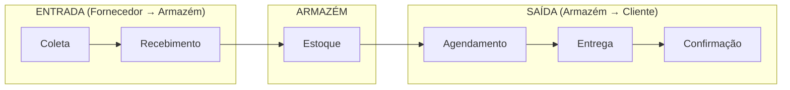
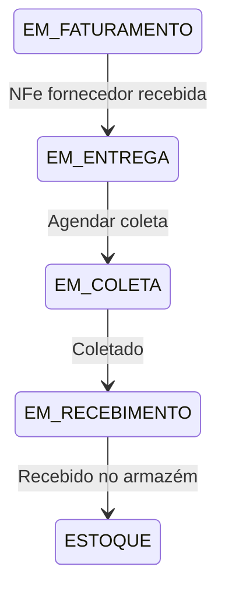

# Módulo: Logística

> Status: **Rascunho**
> Prioridade: 4 (operacional)
> Complexidade: **Média**

---

## Visão Geral

O módulo de Logística gerencia o fluxo físico de mercadorias: coletas nos fornecedores, recebimento no armazém, agendamento de entregas aos clientes e confirmação de entrega.

### Fluxos Principais



---

## Implementação Atual (C++)

### Classes

| Classe | Arquivo | Finalidade |
|--------|---------|------------|
| `TabLogistica` | `tablogistica.cpp` | Container principal da aba |
| `WidgetLogisticaAgendarColeta` | `widgetlogisticaagendarcoleta.cpp` | Agendar coleta no fornecedor |
| `WidgetLogisticaColeta` | `widgetlogisticacoleta.cpp` | Lista de coletas |
| `WidgetLogisticaRecebimento` | `widgetlogisticarecebimento.cpp` | Recebimento no armazém |
| `WidgetLogisticaAgendarEntrega` | `widgetlogisticaagendarentrega.cpp` | Agendar entrega ao cliente |
| `WidgetLogisticaEntregas` | `widgetlogisticaentregas.cpp` | Lista de entregas |
| `WidgetLogisticaEntregues` | `widgetlogisticaentregues.cpp` | Entregas confirmadas |
| `WidgetLogisticaCaminhao` | `widgetlogisticacaminhao.cpp` | Visão por veículo |
| `WidgetLogisticaCalendario` | `widgetlogisticacalendario.cpp` | Calendário de entregas |
| `WidgetLogisticaRepresentacao` | `widgetlogisticarepresentacao.cpp` | Vendas de representação |

### Tabelas do Banco de Dados

```sql
-- Veículos
transportadora_has_veiculo
├── idVeiculo (PK)
├── idTransportadora (FK)
├── placa
├── modelo
├── capacidade
├── tipo
└── desativado

-- Agrupamento de entregas
veiculo_has_produto
├── idVeiculoProduto (PK)
├── idEvento                 -- Agrupa produtos na mesma entrega
├── idVeiculo (FK)
├── idVendaProduto2 (FK)
├── dataPrevEntrega
├── dataRealEntrega
└── observacao

-- Eventos de logística (coleta/entrega)
evento_logistica
├── idEvento (PK)
├── idVeiculo (FK)
├── tipo                     -- COLETA, ENTREGA
├── data
├── status
└── observacao
```

### Fluxo de Estados (Entrega)


### Fluxo de Estados (Coleta)



### Confirmação de Entrega

```cpp
// InputDialogConfirmacao
// Campos obrigatórios:
// - dataRealEnt: Data da entrega
// - entregou: Nome do entregador
// - recebeu: Nome de quem recebeu
// Opcional:
// - Foto do comprovante de entrega

void confirmarEntrega() {
    UPDATE venda_has_produto2
    SET status = 'ENTREGUE',
        dataRealEnt = :data,
        entregou = :entregador,
        recebeu = :recebedor;

    UPDATE pedido_fornecedor_has_produto2
    SET status = 'ENTREGUE'
    WHERE idVendaProduto2 = :idVendaProduto2;
}
```

### Tratamento de Itens Quebrados

```cpp
// Quando item chega quebrado na entrega
void dividirEntrega(int idVendaProduto2, double quantQuebrada) {
    // 1. Reduzir quantidade na linha original
    UPDATE venda_has_produto2
    SET quant = quant - :quantQuebrada
    WHERE idVendaProduto2 = :id;

    // 2. Criar linha para item quebrado
    INSERT INTO venda_has_produto2 (
        idRelacionado = :idOriginal,
        quant = :quantQuebrada,
        status = 'QUEBRADO'
    );

    // 3. Opcional: Criar reposição
    INSERT INTO venda_has_produto2 (
        idRelacionado = :idOriginal,
        quant = :quantQuebrada,
        status = 'REPO. ENTREGA'  -- ou 'REPO. RECEB.'
    );

    // 4. Gerar crédito para o cliente
    INSERT INTO conta_a_receber_has_pagamento (
        valor = -:valorQuebrado,
        grupo = 'CRÉDITO',
        observacao = 'Item quebrado na entrega'
    );
}
```

### Documentos de Entrega

Gerados a partir de modelos Excel:

- `espelho_entrega.xlsx` → Comprovante de entrega
- `modelo_checklist.xlsx` → Checklist de verificação física

---

## Implementação Laravel

### Models

```php
// app/Models/Veiculo.php
class Veiculo extends Model
{
    protected $fillable = [
        'transportadora_id', 'placa', 'modelo',
        'capacidade_kg', 'capacidade_m3', 'tipo', 'ativo',
    ];

    protected $casts = [
        'tipo' => TipoVeiculo::class,
        'ativo' => 'boolean',
    ];

    public function transportadora(): BelongsTo
    {
        return $this->belongsTo(Transportadora::class);
    }

    public function eventos(): HasMany
    {
        return $this->hasMany(EventoLogistica::class);
    }
}

// app/Models/EventoLogistica.php
class EventoLogistica extends Model
{
    protected $table = 'eventos_logistica';

    protected $fillable = [
        'veiculo_id', 'tipo', 'data_prevista', 'data_realizada',
        'status', 'motorista', 'observacao',
    ];

    protected $casts = [
        'tipo' => TipoEventoLogistica::class,
        'status' => EventoLogisticaStatus::class,
        'data_prevista' => 'date',
        'data_realizada' => 'date',
    ];

    public function veiculo(): BelongsTo
    {
        return $this->belongsTo(Veiculo::class);
    }

    public function itens(): HasMany
    {
        return $this->hasMany(EventoLogisticaItem::class);
    }

    public function vendaItens(): BelongsToMany
    {
        return $this->belongsToMany(
            VendaItemAtendimento::class,
            'evento_logistica_itens',
            'evento_id',
            'venda_item_atendimento_id'
        );
    }
}

// app/Models/EventoLogisticaItem.php
class EventoLogisticaItem extends Model
{
    protected $table = 'evento_logistica_itens';

    protected $fillable = [
        'evento_id', 'venda_item_atendimento_id', 'compra_item_id',
        'quantidade', 'observacao',
    ];

    public function evento(): BelongsTo
    {
        return $this->belongsTo(EventoLogistica::class);
    }

    public function vendaItemAtendimento(): BelongsTo
    {
        return $this->belongsTo(VendaItemAtendimento::class);
    }

    public function compraItem(): BelongsTo
    {
        return $this->belongsTo(CompraItem::class);
    }
}

// app/Models/ConfirmacaoEntrega.php
class ConfirmacaoEntrega extends Model
{
    protected $table = 'confirmacoes_entrega';

    protected $fillable = [
        'venda_item_atendimento_id', 'evento_id',
        'data_entrega', 'entregador', 'recebedor',
        'foto_comprovante', 'assinatura', 'observacao',
    ];

    protected $casts = [
        'data_entrega' => 'datetime',
    ];

    public function vendaItemAtendimento(): BelongsTo
    {
        return $this->belongsTo(VendaItemAtendimento::class);
    }

    public function evento(): BelongsTo
    {
        return $this->belongsTo(EventoLogistica::class);
    }
}
```

### Enums

```php
// app/Enums/TipoEventoLogistica.php
enum TipoEventoLogistica: string
{
    case COLETA = 'COLETA';
    case ENTREGA = 'ENTREGA';
    case TRANSFERENCIA = 'TRANSFERENCIA';
}

// app/Enums/EventoLogisticaStatus.php
enum EventoLogisticaStatus: string
{
    case AGENDADO = 'AGENDADO';
    case EM_ANDAMENTO = 'EM_ANDAMENTO';
    case CONCLUIDO = 'CONCLUIDO';
    case CANCELADO = 'CANCELADO';

    public function label(): string
    {
        return match($this) {
            self::AGENDADO => 'Agendado',
            self::EM_ANDAMENTO => 'Em Andamento',
            self::CONCLUIDO => 'Concluído',
            self::CANCELADO => 'Cancelado',
        };
    }

    public function color(): string
    {
        return match($this) {
            self::AGENDADO => 'blue',
            self::EM_ANDAMENTO => 'yellow',
            self::CONCLUIDO => 'green',
            self::CANCELADO => 'red',
        };
    }
}

// app/Enums/TipoVeiculo.php
enum TipoVeiculo: string
{
    case PROPRIO = 'PROPRIO';
    case TERCEIRO = 'TERCEIRO';
    case AGREGADO = 'AGREGADO';
}
```

### Services

```php
// app/Services/Logistica/EntregaService.php
class EntregaService
{
    public function __construct(
        private NfeService $nfeService,
        private EstoqueConsumoService $estoqueService,
    ) {}

    /**
     * Agendar entrega
     */
    public function agendarEntrega(
        array $vendaItemIds,
        int $veiculoId,
        Carbon $dataPrevista,
        ?string $observacao = null
    ): EventoLogistica {
        return DB::transaction(function () use (
            $vendaItemIds, $veiculoId, $dataPrevista, $observacao
        ) {
            // Criar evento de logística
            $evento = EventoLogistica::create([
                'veiculo_id' => $veiculoId,
                'tipo' => TipoEventoLogistica::ENTREGA,
                'data_prevista' => $dataPrevista,
                'status' => EventoLogisticaStatus::AGENDADO,
                'observacao' => $observacao,
            ]);

            // Vincular itens ao evento
            foreach ($vendaItemIds as $itemId) {
                $item = VendaItemAtendimento::findOrFail($itemId);

                $this->validarItemParaEntrega($item);

                $evento->itens()->create([
                    'venda_item_atendimento_id' => $itemId,
                    'quantidade' => $item->quantidade,
                ]);

                // Atualizar status do item
                $item->update([
                    'status' => VendaItemStatus::ENTREGA_AGENDADA,
                    'data_prev_entrega' => $dataPrevista,
                ]);
            }

            event(new EntregaAgendada($evento));

            return $evento;
        });
    }

    /**
     * Confirmar entrega
     */
    public function confirmarEntrega(
        VendaItemAtendimento $item,
        Carbon $dataEntrega,
        string $entregador,
        string $recebedor,
        ?string $fotoPath = null
    ): ConfirmacaoEntrega {
        return DB::transaction(function () use (
            $item, $dataEntrega, $entregador, $recebedor, $fotoPath
        ) {
            // Criar confirmação
            $confirmacao = ConfirmacaoEntrega::create([
                'venda_item_atendimento_id' => $item->id,
                'evento_id' => $item->evento_id,
                'data_entrega' => $dataEntrega,
                'entregador' => $entregador,
                'recebedor' => $recebedor,
                'foto_comprovante' => $fotoPath,
            ]);

            // Atualizar status do item
            $item->update([
                'status' => VendaItemStatus::ENTREGUE,
                'data_real_entrega' => $dataEntrega,
            ]);

            // Atualizar item correspondente na compra (se existir)
            if ($item->compra_item_id) {
                CompraItem::where('id', $item->compra_item_id)
                    ->update(['status' => CompraItemStatus::ENTREGUE]);
            }

            // Verificar se toda a venda foi entregue
            $this->verificarVendaCompleta($item->venda);

            event(new EntregaConfirmada($confirmacao));

            return $confirmacao;
        });
    }

    /**
     * Registrar item quebrado
     */
    public function registrarQuebra(
        VendaItemAtendimento $item,
        float $quantidadeQuebrada,
        bool $criarReposicao = false,
        ?string $motivo = null
    ): void {
        DB::transaction(function () use ($item, $quantidadeQuebrada, $criarReposicao, $motivo) {
            // Reduzir quantidade no item original
            $quantidadeRestante = $item->quantidade - $quantidadeQuebrada;

            if ($quantidadeRestante > 0) {
                $item->update(['quantidade' => $quantidadeRestante]);
            }

            // Criar registro de item quebrado
            $quebrado = VendaItemAtendimento::create([
                'venda_id' => $item->venda_id,
                'venda_item_id' => $item->venda_item_id,
                'produto_id' => $item->produto_id,
                'quantidade' => $quantidadeQuebrada,
                'status' => VendaItemStatus::QUEBRADO,
                'item_relacionado_id' => $item->id,
                'observacao' => $motivo,
            ]);

            // Estornar consumo de estoque do item quebrado
            $this->estoqueService->estornarParcial($item, $quantidadeQuebrada);

            // Criar reposição se solicitado
            if ($criarReposicao) {
                VendaItemAtendimento::create([
                    'venda_id' => $item->venda_id,
                    'venda_item_id' => $item->venda_item_id,
                    'produto_id' => $item->produto_id,
                    'quantidade' => $quantidadeQuebrada,
                    'status' => VendaItemStatus::REPO_ENTREGA,
                    'item_relacionado_id' => $item->id,
                ]);
            }

            // Gerar crédito para o cliente
            $valorQuebrado = $quantidadeQuebrada * $item->vendaItem->preco_unitario;
            ContaReceber::create([
                'venda_id' => $item->venda_id,
                'cliente_id' => $item->venda->cliente_id,
                'valor' => -$valorQuebrado,
                'status' => ContaReceberStatus::RECEBIDO,
                'grupo' => ContaGrupo::CREDITO,
                'observacao' => "Item quebrado na entrega - {$motivo}",
            ]);

            event(new ItemQuebradoRegistrado($quebrado));
        });
    }

    private function validarItemParaEntrega(VendaItemAtendimento $item): void
    {
        if ($item->status !== VendaItemStatus::ESTOQUE) {
            throw new BusinessException(
                "Item com status {$item->status->label()} não pode ser agendado para entrega"
            );
        }
    }

    private function verificarVendaCompleta(Venda $venda): void
    {
        $todosEntregues = $venda->itensAtendimento()
            ->whereNotIn('status', [
                VendaItemStatus::ENTREGUE,
                VendaItemStatus::CANCELADO,
                VendaItemStatus::DEVOLVIDO,
            ])
            ->doesntExist();

        if ($todosEntregues) {
            $venda->update(['status' => VendaStatus::ENTREGUE]);
            event(new VendaEntregue($venda));
        }
    }
}

// app/Services/Logistica/ColetaService.php
class ColetaService
{
    /**
     * Agendar coleta no fornecedor
     */
    public function agendarColeta(
        array $compraItemIds,
        int $veiculoId,
        Carbon $dataPrevista
    ): EventoLogistica {
        return DB::transaction(function () use ($compraItemIds, $veiculoId, $dataPrevista) {
            $evento = EventoLogistica::create([
                'veiculo_id' => $veiculoId,
                'tipo' => TipoEventoLogistica::COLETA,
                'data_prevista' => $dataPrevista,
                'status' => EventoLogisticaStatus::AGENDADO,
            ]);

            foreach ($compraItemIds as $itemId) {
                $item = CompraItem::findOrFail($itemId);

                $evento->itens()->create([
                    'compra_item_id' => $itemId,
                    'quantidade' => $item->quantidade,
                ]);

                // Atualizar status do item de compra
                $item->update([
                    'status' => CompraItemStatus::EM_COLETA,
                    'data_prev_coleta' => $dataPrevista,
                ]);

                // Atualizar item de venda correspondente
                if ($item->venda_item_atendimento_id) {
                    VendaItemAtendimento::where('id', $item->venda_item_atendimento_id)
                        ->update([
                            'status' => VendaItemStatus::EM_COLETA,
                            'data_prev_coleta' => $dataPrevista,
                        ]);
                }
            }

            return $evento;
        });
    }

    /**
     * Confirmar coleta
     */
    public function confirmarColeta(EventoLogistica $evento, Carbon $dataColeta): void
    {
        DB::transaction(function () use ($evento, $dataColeta) {
            $evento->update([
                'status' => EventoLogisticaStatus::CONCLUIDO,
                'data_realizada' => $dataColeta,
            ]);

            foreach ($evento->itens as $eventoItem) {
                $compraItem = $eventoItem->compraItem;

                $compraItem->update([
                    'status' => CompraItemStatus::EM_RECEBIMENTO,
                    'data_real_coleta' => $dataColeta,
                ]);

                if ($compraItem->venda_item_atendimento_id) {
                    VendaItemAtendimento::where('id', $compraItem->venda_item_atendimento_id)
                        ->update([
                            'status' => VendaItemStatus::EM_RECEBIMENTO,
                            'data_real_coleta' => $dataColeta,
                        ]);
                }
            }
        });
    }
}
```

### Controllers

```php
// app/Http/Controllers/Logistica/EntregaController.php
class EntregaController extends Controller
{
    public function __construct(
        private EntregaService $entregaService
    ) {}

    public function index(Request $request)
    {
        $eventos = EventoLogistica::query()
            ->where('tipo', TipoEventoLogistica::ENTREGA)
            ->with(['veiculo', 'itens.vendaItemAtendimento.venda.cliente'])
            ->when($request->status, fn($q) => $q->where('status', $request->status))
            ->when($request->data, fn($q) => $q->whereDate('data_prevista', $request->data))
            ->when($request->veiculo_id, fn($q) => $q->where('veiculo_id', $request->veiculo_id))
            ->orderBy('data_prevista')
            ->paginate(20);

        return Inertia::render('Logistica/Entregas/Index', [
            'eventos' => $eventos,
        ]);
    }

    public function agendar(AgendarEntregaRequest $request)
    {
        $evento = $this->entregaService->agendarEntrega(
            $request->item_ids,
            $request->veiculo_id,
            Carbon::parse($request->data_prevista),
            $request->observacao
        );

        return redirect()->route('logistica.entregas.show', $evento)
            ->with('success', 'Entrega agendada com sucesso');
    }

    public function confirmar(VendaItemAtendimento $item, ConfirmarEntregaRequest $request)
    {
        $this->entregaService->confirmarEntrega(
            $item,
            Carbon::parse($request->data_entrega),
            $request->entregador,
            $request->recebedor,
            $request->file('foto')?->store('comprovantes')
        );

        return back()->with('success', 'Entrega confirmada');
    }

    public function registrarQuebra(VendaItemAtendimento $item, RegistrarQuebraRequest $request)
    {
        $this->entregaService->registrarQuebra(
            $item,
            $request->quantidade,
            $request->criar_reposicao,
            $request->motivo
        );

        return back()->with('success', 'Quebra registrada');
    }
}
```

### Rotas

```php
// routes/web.php
Route::middleware(['auth'])->prefix('logistica')->name('logistica.')->group(function () {
    // Entregas
    Route::get('entregas', [EntregaController::class, 'index'])->name('entregas.index');
    Route::get('entregas/{evento}', [EntregaController::class, 'show'])->name('entregas.show');
    Route::post('entregas/agendar', [EntregaController::class, 'agendar'])->name('entregas.agendar');
    Route::post('entregas/{item}/confirmar', [EntregaController::class, 'confirmar'])
        ->name('entregas.confirmar');
    Route::post('entregas/{item}/quebra', [EntregaController::class, 'registrarQuebra'])
        ->name('entregas.quebra');

    // Coletas
    Route::get('coletas', [ColetaController::class, 'index'])->name('coletas.index');
    Route::post('coletas/agendar', [ColetaController::class, 'agendar'])->name('coletas.agendar');
    Route::post('coletas/{evento}/confirmar', [ColetaController::class, 'confirmar'])
        ->name('coletas.confirmar');

    // Recebimento
    Route::get('recebimento', [RecebimentoController::class, 'index'])->name('recebimento.index');
    Route::post('recebimento/{item}/confirmar', [RecebimentoController::class, 'confirmar'])
        ->name('recebimento.confirmar');

    // Calendário
    Route::get('calendario', [CalendarioController::class, 'index'])->name('calendario.index');

    // Veículos
    Route::resource('veiculos', VeiculoController::class);
});
```

---

## Componentes de UI

### Lista de Entregas

- Filtros: Data, Veículo, Status
- Agrupamento por veículo/evento
- Colunas: Cliente, Endereço, Produtos, Status, Data
- Ações: Visualizar, Confirmar, Registrar Quebra

### Agendamento de Entrega

- Seleção de itens prontos para entrega
- Seleção de veículo
- Data e horário previsto
- Observações

### Confirmação de Entrega (Formulário)

- Data/hora real
- Nome do entregador
- Nome de quem recebeu
- Upload de foto/comprovante
- Assinatura digital (opcional)

### Calendário de Logística

- Visão diária/semanal/mensal
- Coletas e entregas
- Drag-and-drop para reagendar
- Cores por status

### Mapa de Rotas

- Visualização geográfica
- Otimização de rotas (futuro)
- Tracking em tempo real (futuro)

---

## Eventos

| Evento | Dispara |
|--------|---------|
| `EntregaAgendada` | Notificar cliente, gerar documentos |
| `EntregaConfirmada` | Atualizar venda, disparar faturamento |
| `ColetaAgendada` | Notificar motorista |
| `ColetaConfirmada` | Atualizar compra |
| `ItemQuebradoRegistrado` | Gerar crédito, notificar |
| `VendaEntregue` | Atualizar status da venda |

---

## Considerações de Migração

### Migração de Dados

1. `veiculo_has_produto` → `evento_logistica_itens` (reestruturar)
2. `transportadora_has_veiculo` → `veiculos`
3. Criar `eventos_logistica` a partir de `idEvento` existentes
4. Criar `confirmacoes_entrega` a partir de campos `dataRealEnt`, `entregou`, `recebeu`

### Mudanças

- Separar evento de logística dos itens
- Confirmação de entrega como entidade própria
- Suporte a fotos/comprovantes
- Rastreamento de quebras estruturado
