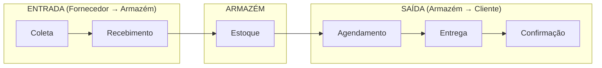
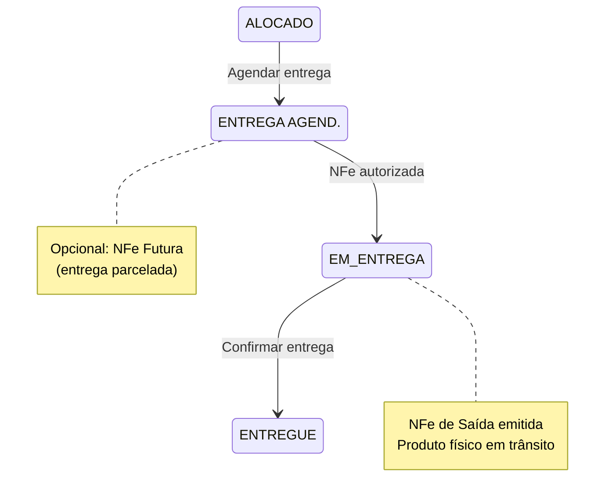
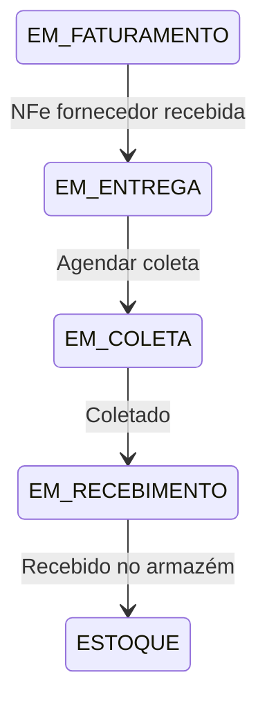

# Módulo: Logística

> Status: **Rascunho**
> Prioridade: 4 (operacional)
> Complexidade: **Média**

---

## Visão Geral

O módulo de Logística gerencia o fluxo físico de mercadorias: coletas nos fornecedores, recebimento no armazém, agendamento de entregas aos clientes e confirmação de entrega.

### Fluxos Principais



---

## Implementação Atual (C++)

### Classes

| Classe                          | Arquivo                             | Finalidade                   |
| ------------------------------- | ----------------------------------- | ---------------------------- |
| `TabLogistica`                  | `tablogistica.cpp`                  | Container principal da aba   |
| `WidgetLogisticaAgendarColeta`  | `widgetlogisticaagendarcoleta.cpp`  | Agendar coleta no fornecedor |
| `WidgetLogisticaColeta`         | `widgetlogisticacoleta.cpp`         | Lista de coletas             |
| `WidgetLogisticaRecebimento`    | `widgetlogisticarecebimento.cpp`    | Recebimento no armazém       |
| `WidgetLogisticaAgendarEntrega` | `widgetlogisticaagendarentrega.cpp` | Agendar entrega ao cliente   |
| `WidgetLogisticaEntregas`       | `widgetlogisticaentregas.cpp`       | Lista de entregas            |
| `WidgetLogisticaEntregues`      | `widgetlogisticaentregues.cpp`      | Entregas confirmadas         |
| `WidgetLogisticaCaminhao`       | `widgetlogisticacaminhao.cpp`       | Visão por veículo            |
| `WidgetLogisticaCalendario`     | `widgetlogisticacalendario.cpp`     | Calendário de entregas       |
| `WidgetLogisticaRepresentacao`  | `widgetlogisticarepresentacao.cpp`  | Vendas de representação      |

### Tabelas do Banco de Dados

```sql
-- Veículos
transportadora_has_veiculo
├── idVeiculo (PK)
├── idTransportadora (FK)
├── placa
├── modelo
├── capacidade
├── tipo
└── desativado

-- Agrupamento de entregas
veiculo_has_produto
├── idVeiculoProduto (PK)
├── idEvento                 -- Agrupa produtos na mesma entrega
├── idVeiculo (FK)
├── idVendaProduto2 (FK)
├── dataPrevEntrega
├── dataRealEntrega
└── observacao

-- Eventos de logística (coleta/entrega)
evento_logistica
├── idEvento (PK)
├── idVeiculo (FK)
├── tipo                     -- COLETA, ENTREGA
├── data
├── status
└── observacao
```

### Fluxo de Estados (Entrega)



### Fluxo de Estados (Coleta)



### Confirmação de Entrega

```cpp
// InputDialogConfirmacao
// Campos obrigatórios:
// - data_entrega: Data da entrega
// - entregador: Nome do entregador
// - recebedor: Nome de quem recebeu
// Opcional:
// - Foto do comprovante de entrega

void confirmarEntrega() {
    -- Update entrega_itens to mark as delivered
    UPDATE entrega_itens
    SET status = 'ENTREGUE',
        data_entrega = :data,
        entregador = :entregador,
        recebedor = :recebedor;

    -- Update venda_itens if all allocation items are delivered
    UPDATE venda_itens
    SET status = 'ENTREGUE'
    WHERE id IN (
        SELECT DISTINCT vi.id FROM venda_itens vi
        WHERE NOT EXISTS (
            SELECT 1 FROM entrega_itens ei
            WHERE ei.venda_item_id = vi.id
            AND ei.status NOT IN ('ENTREGUE', 'CANCELADO')
        )
    );
}
```

### Tratamento de Itens Quebrados

```cpp
// Quando item chega quebrado na entrega
void dividirEntrega(int entrega_item_id, double quantQuebrada) {
    // 1. Update the entrega_item to reflect actual received quantity
    -- Record breakage in entrega_item status
    UPDATE entrega_itens
    SET quantidade_entregue = quantidade - :quantQuebrada,
        quantidade_quebrada = :quantQuebrada,
        status = 'PARCIAL'
    WHERE id = :entrega_item_id;

    // 2. Revert allocation for broken quantity (if needed for replacement)
    -- This creates a "hole" in allocation that can be re-allocated
    UPDATE alocacoes
    SET status = 'REVERTIDA'
    WHERE venda_item_id = (SELECT venda_item_id FROM entrega_itens WHERE id = :entrega_item_id)
    LIMIT :quantQuebrada;

    // 3. Criar crédito para o cliente (via financeiro_parcelas)
    INSERT INTO financeiro_parcelas (
        loja_id, tipo, cliente_id,
        venda_id, numero_parcela, total_parcelas,
        valor, status,
        observacao
    ) VALUES (
        :loja_id, 'RECEBER', :cliente_id,
        :venda_id, 1, 1,
        -:valorQuebrado, 'RECEBIDO',
        'Crédito por item quebrado na entrega'
    );
}
```

### Documentos de Entrega

Gerados a partir de modelos Excel:

- `espelho_entrega.xlsx` → Comprovante de entrega
- `modelo_checklist.xlsx` → Checklist de verificação física

---

## Implementação Laravel

### Models

```php
// app/Models/Veiculo.php
class Veiculo extends Model
{
    protected $fillable = [
        'transportadora_id', 'placa', 'modelo',
        'capacidade_kg', 'capacidade_m3', 'tipo', 'ativo',
    ];

    protected $casts = [
        'tipo' => TipoVeiculo::class,
        'ativo' => 'boolean',
    ];

    public function transportadora(): BelongsTo
    {
        return $this->belongsTo(Transportadora::class);
    }

    public function eventos(): HasMany
    {
        return $this->hasMany(EventoLogistica::class);
    }
}

// app/Models/EventoLogistica.php
class EventoLogistica extends Model
{
    protected $table = 'eventos_logistica';

    protected $fillable = [
        'veiculo_id', 'tipo', 'data_prevista', 'data_realizada',
        'status', 'motorista', 'observacao',
    ];

    protected $casts = [
        'tipo' => TipoEventoLogistica::class,
        'status' => EventoLogisticaStatus::class,
        'data_prevista' => 'date',
        'data_realizada' => 'date',
    ];

    public function veiculo(): BelongsTo
    {
        return $this->belongsTo(Veiculo::class);
    }

    public function itens(): HasMany
    {
        return $this->hasMany(EventoLogisticaItem::class);
    }

    public function entregaItens(): HasMany
    {
        return $this->hasMany(EntregaItem::class);
    }
}

// app/Models/EntregaItem.php
// Represents a single item (venda_item) within a delivery event
class EntregaItem extends Model
{
    protected $table = 'entrega_itens';

    protected $fillable = [
        'entrega_id', 'venda_item_id',
        'quantidade', 'quantidade_entregue', 'quantidade_quebrada',
        'status', 'data_entrega', 'entregador', 'recebedor',
        'foto_comprovante', 'assinatura', 'observacao',
    ];

    protected $casts = [
        'status' => EntregaItemStatus::class,
        'data_entrega' => 'datetime',
        'quantidade' => 'decimal:4',
        'quantidade_entregue' => 'decimal:4',
        'quantidade_quebrada' => 'decimal:4',
    ];

    public function entrega(): BelongsTo
    {
        return $this->belongsTo(EventoLogistica::class, 'entrega_id');
    }

    public function vendaItem(): BelongsTo
    {
        return $this->belongsTo(VendaItem::class);
    }

    public function venda(): BelongsToThrough
    {
        return $this->throughBelongsToMany(VendaItem::class, Venda::class);
    }
}
```

### Enums

```php
// app/Enums/TipoEventoLogistica.php
enum TipoEventoLogistica: string
{
    case COLETA = 'COLETA';
    case ENTREGA = 'ENTREGA';
    case TRANSFERENCIA = 'TRANSFERENCIA';
}

// app/Enums/EventoLogisticaStatus.php
enum EventoLogisticaStatus: string
{
    case AGENDADO = 'AGENDADO';
    case EM_ANDAMENTO = 'EM_ANDAMENTO';
    case CONCLUIDO = 'CONCLUIDO';
    case CANCELADO = 'CANCELADO';

    public function label(): string
    {
        return match($this) {
            self::AGENDADO => 'Agendado',
            self::EM_ANDAMENTO => 'Em Andamento',
            self::CONCLUIDO => 'Concluído',
            self::CANCELADO => 'Cancelado',
        };
    }

    public function color(): string
    {
        return match($this) {
            self::AGENDADO => 'blue',
            self::EM_ANDAMENTO => 'yellow',
            self::CONCLUIDO => 'green',
            self::CANCELADO => 'red',
        };
    }
}

// app/Enums/TipoVeiculo.php
enum TipoVeiculo: string
{
    case PROPRIO = 'PROPRIO';
    case TERCEIRO = 'TERCEIRO';
    case AGREGADO = 'AGREGADO';
}

// app/Enums/EntregaItemStatus.php
enum EntregaItemStatus: string
{
    case AGENDADA = 'AGENDADA';
    case EM_ENTREGA = 'EM_ENTREGA';
    case ENTREGUE = 'ENTREGUE';
    case PARCIAL = 'PARCIAL';  // Partially delivered (some broken)
    case CANCELADA = 'CANCELADA';
    case DEVOLUCAO = 'DEVOLUCAO';

    public function label(): string
    {
        return match($this) {
            self::AGENDADA => 'Agendada',
            self::EM_ENTREGA => 'Em Entrega',
            self::ENTREGUE => 'Entregue',
            self::PARCIAL => 'Parcial (com quebra)',
            self::CANCELADA => 'Cancelada',
            self::DEVOLUCAO => 'Devolução',
        };
    }

    public function color(): string
    {
        return match($this) {
            self::AGENDADA => 'blue',
            self::EM_ENTREGA => 'yellow',
            self::ENTREGUE => 'green',
            self::PARCIAL => 'orange',
            self::CANCELADA => 'red',
            self::DEVOLUCAO => 'purple',
        };
    }
}
```

### Services

```php
// app/Services/Logistica/EntregaService.php
class EntregaService
{
    public function __construct(
        private NfeService $nfeService,
        private AlocacaoService $alocacaoService,
    ) {}

    /**
     * Agendar entrega para venda_items (que possuem alocacoes ativas)
     */
    public function agendarEntrega(
        array $vendaItemIds,
        int $veiculoId,
        Carbon $dataPrevista,
        ?string $observacao = null
    ): EventoLogistica {
        return DB::transaction(function () use (
            $vendaItemIds, $veiculoId, $dataPrevista, $observacao
        ) {
            // Criar evento de logística (delivery event)
            $evento = EventoLogistica::create([
                'veiculo_id' => $veiculoId,
                'tipo' => TipoEventoLogistica::ENTREGA,
                'data_prevista' => $dataPrevista,
                'status' => EventoLogisticaStatus::AGENDADO,
                'observacao' => $observacao,
            ]);

            // Vincular venda_itens ao evento como entrega_itens
            foreach ($vendaItemIds as $itemId) {
                $vendaItem = VendaItem::lockForUpdate()->findOrFail($itemId);

                $this->validarItemParaEntrega($vendaItem);

                // Create entrega_item for this venda_item
                $evento->entregaItens()->create([
                    'venda_item_id' => $itemId,
                    'quantidade' => $vendaItem->quantidade,
                    'status' => EntregaItemStatus::AGENDADA,
                ]);

                // Atualizar status do venda_item
                $vendaItem->update([
                    'status' => VendaItemStatus::ENTREGA_AGENDADA,
                    'data_prev_entrega' => $dataPrevista,
                ]);
            }

            event(new EntregaAgendada($evento));

            return $evento;
        });
    }

    /**
     * Confirmar entrega de um entrega_item
     */
    public function confirmarEntrega(
        EntregaItem $entregaItem,
        Carbon $dataEntrega,
        string $entregador,
        string $recebedor,
        ?string $fotoPath = null
    ): EntregaItem {
        return DB::transaction(function () use (
            $entregaItem, $dataEntrega, $entregador, $recebedor, $fotoPath
        ) {
            // Atualizar entrega_item com dados da confirmação
            $entregaItem->update([
                'status' => EntregaItemStatus::ENTREGUE,
                'data_entrega' => $dataEntrega,
                'entregador' => $entregador,
                'recebedor' => $recebedor,
                'foto_comprovante' => $fotoPath,
                'quantidade_entregue' => $entregaItem->quantidade,
            ]);

            // Atualizar status do venda_item se todas as suas entrega_items foram entregues
            $vendaItem = $entregaItem->vendaItem;
            $this->verificarVendaItemCompleto($vendaItem);

            // Verificar se toda a venda foi entregue
            $this->verificarVendaCompleta($vendaItem->venda);

            event(new EntregaConfirmada($entregaItem));

            return $entregaItem;
        });
    }

    /**
     * Registrar item quebrado em uma entrega_item
     */
    public function registrarQuebra(
        EntregaItem $entregaItem,
        float $quantidadeQuebrada,
        ?string $motivo = null
    ): void {
        DB::transaction(function () use ($entregaItem, $quantidadeQuebrada, $motivo) {
            // Record breakage in the entrega_item
            $quantidadeEntregue = $entregaItem->quantidade - $quantidadeQuebrada;

            $entregaItem->update([
                'quantidade_quebrada' => $quantidadeQuebrada,
                'quantidade_entregue' => max(0, $quantidadeEntregue),
                'status' => EntregaItemStatus::PARCIAL,
            ]);

            // Reverter as alocacoes do item quebrado para que possam ser re-alocadas
            $vendaItem = $entregaItem->vendaItem;
            $this->alocacaoService->desfazerAlocacoesParciais(
                $vendaItem,
                $quantidadeQuebrada,
                "Quebra na entrega: {$motivo}"
            );

            // Gerar crédito para o cliente (nota de crédito)
            $valorQuebrado = $quantidadeQuebrada * $vendaItem->valor_unitario;
            FinanceiroParcela::create([
                'loja_id' => $vendaItem->venda->loja_id,
                'tipo' => FinanceiroTipo::RECEBER,
                'cliente_id' => $vendaItem->venda->cliente_id,
                'venda_id' => $vendaItem->venda_id,
                'numero_parcela' => 1,
                'total_parcelas' => 1,
                'valor' => -$valorQuebrado,  // Negative = credit to customer
                'status' => FinanceiroStatus::RECEBIDO,
                'observacao' => "Crédito por quebra na entrega: {$motivo}",
            ]);

            event(new ItemQuebradoRegistrado($entregaItem));
        });
    }

    private function validarItemParaEntrega(VendaItem $vendaItem): void
    {
        if ($vendaItem->status !== VendaItemStatus::ALOCADO) {
            throw new BusinessException(
                "Item com status {$vendaItem->status->label()} não pode ser agendado para entrega"
            );
        }

        // Verify that all quantity is allocated
        if (!$vendaItem->fullyAllocated()) {
            throw new BusinessException(
                "Item não possui quantidade total alocada"
            );
        }
    }

    private function verificarVendaItemCompleto(VendaItem $vendaItem): void
    {
        // Check if all entrega_itens for this venda_item are delivered or canceled
        $naoEntregues = EntregaItem::where('venda_item_id', $vendaItem->id)
            ->whereNotIn('status', [
                EntregaItemStatus::ENTREGUE,
                EntregaItemStatus::CANCELADA,
                EntregaItemStatus::DEVOLUCAO,
            ])
            ->exists();

        if (!$naoEntregues) {
            $vendaItem->update(['status' => VendaItemStatus::ENTREGUE]);
        }
    }

    private function verificarVendaCompleta(Venda $venda): void
    {
        // Check if all venda_items in this sale are delivered or canceled
        $naoEntregues = VendaItem::where('venda_id', $venda->id)
            ->whereNotIn('status', [
                VendaItemStatus::ENTREGUE,
                VendaItemStatus::CANCELADO,
                VendaItemStatus::DEVOLVIDO,
            ])
            ->exists();

        if (!$naoEntregues) {
            $venda->update(['status' => VendaStatus::ENTREGUE]);
            event(new VendaEntregue($venda));
        }
    }
}

// app/Services/Logistica/ColetaService.php
class ColetaService
{
    /**
     * Agendar coleta no fornecedor
     */
    public function agendarColeta(
        array $compraItemIds,
        int $veiculoId,
        Carbon $dataPrevista
    ): EventoLogistica {
        return DB::transaction(function () use ($compraItemIds, $veiculoId, $dataPrevista) {
            $evento = EventoLogistica::create([
                'veiculo_id' => $veiculoId,
                'tipo' => TipoEventoLogistica::COLETA,
                'data_prevista' => $dataPrevista,
                'status' => EventoLogisticaStatus::AGENDADO,
            ]);

            foreach ($compraItemIds as $itemId) {
                $item = CompraItem::findOrFail($itemId);

                // Create evento_logistica_item for tracking (separate from delivery)
                EventoLogisticaItem::create([
                    'evento_id' => $evento->id,
                    'compra_item_id' => $itemId,
                    'quantidade' => $item->quantidade,
                ]);

                // Atualizar status do item de compra
                $item->update([
                    'status' => CompraItemStatus::EM_COLETA,
                    'data_prev_coleta' => $dataPrevista,
                ]);
            }

            return $evento;
        });
    }

    /**
     * Confirmar coleta
     */
    public function confirmarColeta(EventoLogistica $evento, Carbon $dataColeta): void
    {
        DB::transaction(function () use ($evento, $dataColeta) {
            $evento->update([
                'status' => EventoLogisticaStatus::CONCLUIDO,
                'data_realizada' => $dataColeta,
            ]);

            // Update all compra_items in this event
            foreach ($evento->itens as $eventoItem) {
                if ($eventoItem->compra_item_id) {
                    $compraItem = CompraItem::find($eventoItem->compra_item_id);
                    if ($compraItem) {
                        $compraItem->update([
                            'status' => CompraItemStatus::EM_RECEBIMENTO,
                            'data_real_coleta' => $dataColeta,
                        ]);
                    }
                }
            }

            event(new ColetaConfirmada($evento));
        });
    }
}
```

### Controllers

```php
// app/Http/Controllers/Logistica/EntregaController.php
class EntregaController extends Controller
{
    public function __construct(
        private EntregaService $entregaService
    ) {}

    public function index(Request $request)
    {
        $eventos = EventoLogistica::query()
            ->where('tipo', TipoEventoLogistica::ENTREGA)
            ->with(['veiculo', 'entregaItens.vendaItem.venda.cliente'])
            ->when($request->status, fn($q) => $q->where('status', $request->status))
            ->when($request->data, fn($q) => $q->whereDate('data_prevista', $request->data))
            ->when($request->veiculo_id, fn($q) => $q->where('veiculo_id', $request->veiculo_id))
            ->orderBy('data_prevista')
            ->paginate(20);

        return Inertia::render('Logistica/Entregas/Index', [
            'eventos' => $eventos,
        ]);
    }

    public function agendar(AgendarEntregaRequest $request)
    {
        $evento = $this->entregaService->agendarEntrega(
            $request->item_ids,
            $request->veiculo_id,
            Carbon::parse($request->data_prevista),
            $request->observacao
        );

        return redirect()->route('logistica.entregas.show', $evento)
            ->with('success', 'Entrega agendada com sucesso');
    }

    public function confirmar(EntregaItem $entregaItem, ConfirmarEntregaRequest $request)
    {
        $this->entregaService->confirmarEntrega(
            $entregaItem,
            Carbon::parse($request->data_entrega),
            $request->entregador,
            $request->recebedor,
            $request->file('foto')?->store('comprovantes')
        );

        return back()->with('success', 'Entrega confirmada');
    }

    public function registrarQuebra(EntregaItem $entregaItem, RegistrarQuebraRequest $request)
    {
        $this->entregaService->registrarQuebra(
            $entregaItem,
            $request->quantidade,
            $request->motivo
        );

        return back()->with('success', 'Quebra registrada');
    }
}
```

### Rotas

```php
// routes/web.php
Route::middleware(['auth'])->prefix('logistica')->name('logistica.')->group(function () {
    // Entregas
    Route::get('entregas', [EntregaController::class, 'index'])->name('entregas.index');
    Route::get('entregas/{evento}', [EntregaController::class, 'show'])->name('entregas.show');
    Route::post('entregas/agendar', [EntregaController::class, 'agendar'])->name('entregas.agendar');
    Route::post('entrega-itens/{entregaItem}/confirmar', [EntregaController::class, 'confirmar'])
        ->name('entregas.confirmar');
    Route::post('entrega-itens/{entregaItem}/quebra', [EntregaController::class, 'registrarQuebra'])
        ->name('entregas.quebra');

    // Coletas
    Route::get('coletas', [ColetaController::class, 'index'])->name('coletas.index');
    Route::post('coletas/agendar', [ColetaController::class, 'agendar'])->name('coletas.agendar');
    Route::post('coletas/{evento}/confirmar', [ColetaController::class, 'confirmar'])
        ->name('coletas.confirmar');

    // Recebimento
    Route::get('recebimento', [RecebimentoController::class, 'index'])->name('recebimento.index');
    Route::post('recebimento/{item}/confirmar', [RecebimentoController::class, 'confirmar'])
        ->name('recebimento.confirmar');

    // Calendário
    Route::get('calendario', [CalendarioController::class, 'index'])->name('calendario.index');

    // Veículos
    Route::resource('veiculos', VeiculoController::class);
});
```

---

## Componentes de UI

### Lista de Entregas

- Filtros: Data, Veículo, Status
- Agrupamento por veículo/evento
- Colunas: Cliente, Endereço, Produtos, Status, Data
- Ações: Visualizar, Confirmar, Registrar Quebra

### Agendamento de Entrega

- Seleção de itens prontos para entrega
- Seleção de veículo
- Data e horário previsto
- Observações

### Confirmação de Entrega (Formulário)

- Data/hora real
- Nome do entregador
- Nome de quem recebeu
- Upload de foto/comprovante
- Assinatura digital (opcional)

### Calendário de Logística

- Visão diária/semanal/mensal
- Coletas e entregas
- Drag-and-drop para reagendar
- Cores por status

### Mapa de Rotas

- Visualização geográfica
- Otimização de rotas (futuro)
- Tracking em tempo real (futuro)

---

## Eventos

| Evento                   | Dispara                               |
| ------------------------ | ------------------------------------- |
| `EntregaAgendada`        | Notificar cliente, gerar documentos   |
| `EntregaConfirmada`      | Atualizar venda, disparar faturamento |
| `ColetaAgendada`         | Notificar motorista                   |
| `ColetaConfirmada`       | Atualizar compra                      |
| `ItemQuebradoRegistrado` | Gerar crédito, notificar              |
| `VendaEntregue`          | Atualizar status da venda             |

---

## Considerações de Migração

### Migração de Dados

1. `veiculo_has_produto` → `evento_logistica_itens` (reestruturar)
2. `transportadora_has_veiculo` → `veiculos`
3. Criar `eventos_logistica` a partir de `idEvento` existentes
4. Criar `confirmacoes_entrega` a partir de campos `dataRealEnt`, `entregou`, `recebeu`

### Mudanças

- Separar evento de logística dos itens
- Confirmação de entrega como entidade própria
- Suporte a fotos/comprovantes
- Rastreamento de quebras estruturado
