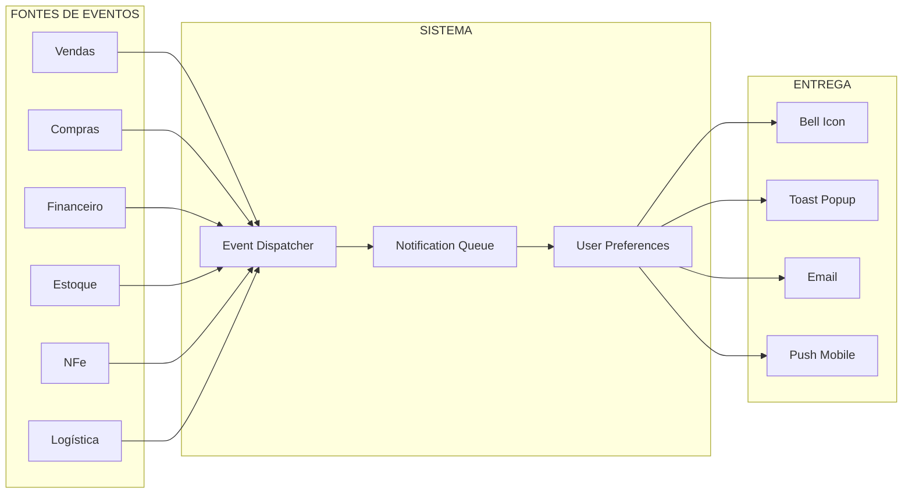

# Módulo: Notificações

> Status: **Rascunho**
> Prioridade: 2 (importante para UX)
> Complexidade: **Média**

---

## Visão Geral

Sistema centralizado de notificações que alerta usuários sobre eventos que requerem atenção. Cada notificação é clicável e redireciona para a página/ação relevante.

### Objetivos

1. **Visibilidade**: Usuário nunca perde evento importante
2. **Acionabilidade**: Um clique leva à ação necessária
3. **Priorização**: Urgente vs informativo claramente distinguíveis
4. **Personalização**: Usuário controla o que recebe

### Fluxo Principal



---

## Schema do Banco de Dados

### Tipos e ENUMs

```sql
-- =====================================================
-- NOTIFICAÇÕES - Schema
-- =====================================================

-- Categorias de notificação (por módulo)
CREATE TYPE notificacao_categoria AS ENUM (
    'VENDAS',
    'COMPRAS',
    'FINANCEIRO',
    'ESTOQUE',
    'NFE',
    'LOGISTICA',
    'SISTEMA',
    'USUARIO'
);

-- Prioridade/Urgência
CREATE TYPE notificacao_prioridade AS ENUM (
    'BAIXA',       -- Informativo, pode esperar
    'NORMAL',      -- Ação em breve
    'ALTA',        -- Ação necessária hoje
    'URGENTE'      -- Ação imediata requerida
);

-- Tipo de ação ao clicar
CREATE TYPE notificacao_acao_tipo AS ENUM (
    'NAVIGATE',    -- Navegar para URL
    'MODAL',       -- Abrir modal
    'DOWNLOAD',    -- Baixar arquivo
    'EXTERNAL',    -- Link externo
    'NONE'         -- Apenas informativo
);

-- Canal de entrega
CREATE TYPE notificacao_canal AS ENUM (
    'IN_APP',      -- Dentro do sistema (bell)
    'TOAST',       -- Popup temporário
    'EMAIL',       -- Email
    'PUSH',        -- Push notification (mobile/desktop)
    'SMS',         -- SMS (crítico)
    'WHATSAPP'     -- WhatsApp
);
```

### Tabelas Principais

```sql
-- Tipos de notificação (templates)
CREATE TABLE notificacao_tipos (
    id BIGSERIAL PRIMARY KEY,
    codigo VARCHAR(50) NOT NULL UNIQUE,              -- 'VENDA_APROVACAO_PENDENTE'
    categoria notificacao_categoria NOT NULL,

    -- Template
    titulo_template VARCHAR(200) NOT NULL,           -- 'Venda #{venda_id} aguarda aprovação'
    mensagem_template TEXT NOT NULL,                 -- 'Cliente {cliente} - R$ {valor}'
    icone VARCHAR(50) DEFAULT 'bell',                -- Nome do ícone (Lucide/heroicons)
    cor VARCHAR(20) DEFAULT 'blue',                  -- Cor do badge

    -- Ação padrão
    acao_tipo notificacao_acao_tipo DEFAULT 'NAVIGATE',
    acao_url_template VARCHAR(200),                  -- '/vendas/{venda_id}'

    -- Configurações padrão
    prioridade_padrao notificacao_prioridade DEFAULT 'NORMAL',
    canais_padrao notificacao_canal[] DEFAULT '{IN_APP}',

    -- Agrupamento
    agrupa_por VARCHAR(50),                          -- Campo para agrupar (ex: 'venda_id')
    max_agrupado INTEGER DEFAULT 5,                  -- Máximo antes de agrupar

    -- Expiração
    expira_em_horas INTEGER,                         -- NULL = não expira

    ativo BOOLEAN DEFAULT TRUE,
    created_at TIMESTAMP DEFAULT NOW()
);

-- Notificações enviadas
CREATE TABLE notificacoes (
    id BIGSERIAL PRIMARY KEY,
    uuid UUID DEFAULT gen_random_uuid() NOT NULL UNIQUE,

    -- Tipo e conteúdo
    tipo_id BIGINT NOT NULL REFERENCES notificacao_tipos(id),
    categoria notificacao_categoria NOT NULL,
    prioridade notificacao_prioridade NOT NULL,

    -- Conteúdo renderizado
    titulo VARCHAR(200) NOT NULL,
    mensagem TEXT NOT NULL,
    icone VARCHAR(50),
    cor VARCHAR(20),

    -- Ação
    acao_tipo notificacao_acao_tipo NOT NULL DEFAULT 'NAVIGATE',
    acao_url VARCHAR(500),                           -- URL para navegar
    acao_dados JSONB,                                -- Dados extras para a ação

    -- Contexto (para queries e agrupamento)
    entidade_tipo VARCHAR(50),                       -- 'venda', 'compra', 'parcela'
    entidade_id BIGINT,                              -- ID da entidade
    loja_id BIGINT REFERENCES lojas(id),

    -- Metadados
    dados JSONB DEFAULT '{}',                        -- Dados extras do evento

    -- Expiração
    expira_em TIMESTAMP,

    created_at TIMESTAMP DEFAULT NOW()
);

-- Destinatários e status de leitura
CREATE TABLE notificacoes_usuarios (
    id BIGSERIAL PRIMARY KEY,
    notificacao_id BIGINT NOT NULL REFERENCES notificacoes(id) ON DELETE CASCADE,
    usuario_id BIGINT NOT NULL REFERENCES usuarios(id),

    -- Status
    lida BOOLEAN DEFAULT FALSE,
    lida_em TIMESTAMP,

    -- Interação
    clicada BOOLEAN DEFAULT FALSE,
    clicada_em TIMESTAMP,

    -- Descarte
    descartada BOOLEAN DEFAULT FALSE,
    descartada_em TIMESTAMP,

    -- Entrega por canal
    entregue_in_app BOOLEAN DEFAULT FALSE,
    entregue_email BOOLEAN DEFAULT FALSE,
    entregue_push BOOLEAN DEFAULT FALSE,

    created_at TIMESTAMP DEFAULT NOW(),

    CONSTRAINT uq_notificacao_usuario UNIQUE (notificacao_id, usuario_id)
);

-- Índices para performance
CREATE INDEX idx_notificacoes_created ON notificacoes(created_at DESC);
CREATE INDEX idx_notificacoes_entidade ON notificacoes(entidade_tipo, entidade_id);
CREATE INDEX idx_notificacoes_categoria ON notificacoes(categoria, created_at DESC);

CREATE INDEX idx_notif_usuarios_nao_lidas
    ON notificacoes_usuarios(usuario_id, created_at DESC)
    WHERE NOT lida AND NOT descartada;
CREATE INDEX idx_notif_usuarios_usuario ON notificacoes_usuarios(usuario_id, lida);
```

### Preferências do Usuário

```sql
-- Preferências de notificação por usuário
CREATE TABLE notificacoes_preferencias (
    id BIGSERIAL PRIMARY KEY,
    usuario_id BIGINT NOT NULL REFERENCES usuarios(id),

    -- Pode ser por tipo específico ou categoria
    tipo_id BIGINT REFERENCES notificacao_tipos(id),
    categoria notificacao_categoria,                 -- Se tipo_id NULL, aplica à categoria

    -- Canais habilitados
    canais notificacao_canal[] NOT NULL DEFAULT '{IN_APP}',

    -- Filtros
    prioridade_minima notificacao_prioridade DEFAULT 'BAIXA',

    -- Horários (para não incomodar)
    horario_inicio TIME DEFAULT '08:00',
    horario_fim TIME DEFAULT '20:00',
    dias_semana INTEGER[] DEFAULT '{1,2,3,4,5}',     -- 1=Seg, 7=Dom

    -- Agrupamento
    agrupar BOOLEAN DEFAULT TRUE,
    intervalo_agrupamento_minutos INTEGER DEFAULT 15,

    ativo BOOLEAN DEFAULT TRUE,
    created_at TIMESTAMP DEFAULT NOW(),
    updated_at TIMESTAMP DEFAULT NOW(),

    CONSTRAINT uq_pref_usuario_tipo UNIQUE (usuario_id, tipo_id),
    CONSTRAINT chk_tipo_ou_categoria CHECK (
        tipo_id IS NOT NULL OR categoria IS NOT NULL
    )
);

-- Preferências globais do usuário
CREATE TABLE notificacoes_config_usuario (
    usuario_id BIGINT PRIMARY KEY REFERENCES usuarios(id),

    -- Canais globais
    email_habilitado BOOLEAN DEFAULT TRUE,
    push_habilitado BOOLEAN DEFAULT TRUE,
    som_habilitado BOOLEAN DEFAULT TRUE,

    -- Resumo diário
    resumo_diario BOOLEAN DEFAULT FALSE,
    resumo_horario TIME DEFAULT '08:00',

    -- Não perturbe
    nao_perturbe BOOLEAN DEFAULT FALSE,
    nao_perturbe_inicio TIME,
    nao_perturbe_fim TIME,

    updated_at TIMESTAMP DEFAULT NOW()
);
```

---

## Catálogo de Notificações

### Por Módulo

#### Vendas

| Código | Título | Prioridade | Ação |
|--------|--------|------------|------|
| `VENDA_APROVACAO_PENDENTE` | Venda aguarda aprovação | ALTA | `/vendas/{id}` |
| `VENDA_APROVADA` | Venda aprovada | NORMAL | `/vendas/{id}` |
| `VENDA_REJEITADA` | Venda rejeitada | ALTA | `/vendas/{id}` |
| `VENDA_CANCELADA` | Venda cancelada | NORMAL | `/vendas/{id}` |
| `VENDA_ESTOQUE_INSUFICIENTE` | Estoque insuficiente | URGENTE | `/vendas/{id}/itens` |
| `VENDA_CREDITO_EXCEDIDO` | Cliente excedeu limite | ALTA | `/clientes/{cliente_id}/credito` |

#### Compras

| Código | Título | Prioridade | Ação |
|--------|--------|------------|------|
| `COMPRA_APROVACAO_PENDENTE` | Pedido aguarda aprovação | ALTA | `/compras/{id}` |
| `COMPRA_APROVADA` | Pedido aprovado | NORMAL | `/compras/{id}` |
| `COMPRA_CHEGOU` | Mercadoria chegou | ALTA | `/compras/{id}/recebimento` |
| `COMPRA_ATRASADA` | Entrega atrasada | ALTA | `/compras/{id}` |
| `COMPRA_NFE_DIVERGENTE` | NFe com divergência | URGENTE | `/compras/{id}/nfe` |

#### Financeiro

| Código | Título | Prioridade | Ação |
|--------|--------|------------|------|
| `FIN_VENCIMENTO_HOJE` | Parcelas vencem hoje | ALTA | `/financeiro/parcelas?vencimento=hoje` |
| `FIN_VENCIMENTO_PROXIMO` | Parcelas vencem em {dias} dias | NORMAL | `/financeiro/parcelas?vencimento=proximos` |
| `FIN_PARCELA_ATRASADA` | Parcela em atraso | URGENTE | `/financeiro/parcelas/{id}` |
| `FIN_PAGAMENTO_RECEBIDO` | Pagamento recebido | BAIXA | `/financeiro/parcelas/{id}` |
| `FIN_CNAB_RETORNO` | Retorno CNAB processado | NORMAL | `/financeiro/cnab/retornos/{id}` |
| `FIN_PIX_RECEBIDO` | PIX recebido | BAIXA | `/financeiro/parcelas/{id}` |
| `FIN_APROVACAO_PENDENTE` | Pagamento aguarda aprovação | ALTA | `/financeiro/aprovacoes/{id}` |
| `FIN_CHARGEBACK` | Chargeback aberto | URGENTE | `/financeiro/chargebacks/{id}` |

#### Estoque

| Código | Título | Prioridade | Ação |
|--------|--------|------------|------|
| `EST_MINIMO_ATINGIDO` | Estoque mínimo atingido | ALTA | `/estoque/produtos/{id}` |
| `EST_ZERADO` | Produto sem estoque | URGENTE | `/estoque/produtos/{id}` |
| `EST_INVENTARIO_DIVERGENCIA` | Divergência no inventário | ALTA | `/estoque/inventarios/{id}` |
| `EST_LOTE_VENCENDO` | Lote próximo do vencimento | ALTA | `/estoque/lotes?vencimento=proximo` |
| `EST_TRANSFERENCIA_PENDENTE` | Transferência pendente | NORMAL | `/estoque/transferencias/{id}` |

#### NFe

| Código | Título | Prioridade | Ação |
|--------|--------|------------|------|
| `NFE_REJEITADA` | NFe rejeitada pela SEFAZ | URGENTE | `/nfe/{id}` |
| `NFE_AUTORIZADA` | NFe autorizada | BAIXA | `/nfe/{id}` |
| `NFE_CANCELADA` | NFe cancelada | NORMAL | `/nfe/{id}` |
| `NFE_CARTA_CORRECAO` | Carta de correção necessária | ALTA | `/nfe/{id}/cce` |
| `NFE_MANIFESTACAO_PENDENTE` | Manifestação pendente | ALTA | `/nfe/entrada/{id}/manifestar` |
| `NFE_ENTRADA_NOVA` | Nova NFe de entrada | NORMAL | `/nfe/entrada/{id}` |

#### Logística

| Código | Título | Prioridade | Ação |
|--------|--------|------------|------|
| `LOG_ENTREGA_HOJE` | Entregas programadas hoje | NORMAL | `/logistica/entregas?data=hoje` |
| `LOG_ENTREGA_ATRASADA` | Entrega atrasada | ALTA | `/logistica/entregas/{id}` |
| `LOG_ENTREGA_REALIZADA` | Entrega concluída | BAIXA | `/logistica/entregas/{id}` |
| `LOG_ENTREGA_PROBLEMA` | Problema na entrega | URGENTE | `/logistica/entregas/{id}` |
| `LOG_ROTA_OTIMIZADA` | Nova rota disponível | BAIXA | `/logistica/rotas/{id}` |

#### Sistema

| Código | Título | Prioridade | Ação |
|--------|--------|------------|------|
| `SIS_BACKUP_FALHOU` | Backup falhou | URGENTE | `/admin/backups` |
| `SIS_ATUALIZACAO_DISPONIVEL` | Nova versão disponível | BAIXA | `/admin/atualizacoes` |
| `SIS_CERTIFICADO_EXPIRANDO` | Certificado digital expira em {dias} | URGENTE | `/admin/certificados` |
| `SIS_ERRO_INTEGRACAO` | Erro de integração | ALTA | `/admin/logs` |

---

## Componentes de UI

### Bell Icon (Header)

```
┌──────────────────────────────────────────────────────────────┐
│  Logo    Dashboard  Vendas  Compras  ...         🔔⁵  👤     │
└──────────────────────────────────────────────────────────────┘
                                                    │
                                                    ▼
┌─────────────────────────────────────────────┐
│ Notificações                    Marcar todas│
├─────────────────────────────────────────────┤
│ 🔴 Parcela em atraso              há 5 min  │
│    Cliente ABC - R$ 1.500,00                │
├─────────────────────────────────────────────┤
│ 🟡 Venda aguarda aprovação        há 15 min │
│    Venda #4521 - R$ 3.200,00                │
├─────────────────────────────────────────────┤
│ 🟢 NFe autorizada                 há 1 hora │
│    NFe 000001234                            │
├─────────────────────────────────────────────┤
│ 🔵 Pagamento recebido             há 2 horas│
│    PIX - R$ 890,00                          │
├─────────────────────────────────────────────┤
│              Ver todas →                    │
└─────────────────────────────────────────────┘
```

### Cores por Prioridade

| Prioridade | Cor | Ícone | Comportamento |
|------------|-----|-------|---------------|
| URGENTE | Vermelho (#EF4444) | 🔴 | Toast + Som + Persist |
| ALTA | Amarelo (#F59E0B) | 🟡 | Toast |
| NORMAL | Azul (#3B82F6) | 🔵 | Apenas bell |
| BAIXA | Verde (#10B981) | 🟢 | Apenas bell |

### Toast Notifications

```
┌─────────────────────────────────────────────┐
│ 🔴 Parcela em atraso                    ✕  │
│    Cliente ABC - R$ 1.500,00                │
│    [Ver detalhes]                           │
└─────────────────────────────────────────────┘
     ▲
     │ Aparece no canto superior direito
     │ Auto-dismiss: 5s (normal), persist (urgente)
```

### Página de Notificações (/notificacoes)

```
┌──────────────────────────────────────────────────────────────────┐
│ Notificações                                                      │
├──────────────────────────────────────────────────────────────────┤
│ Filtros: [Todas ▼] [Todas categorias ▼] [Período ▼]  🔍 Buscar   │
├──────────────────────────────────────────────────────────────────┤
│                                                                   │
│ HOJE                                                              │
│ ┌─────────────────────────────────────────────────────────────┐  │
│ │ ● 🔴 Parcela em atraso                           10:30 AM   │  │
│ │      Cliente ABC Ltda - Parcela 3/5 - R$ 1.500,00           │  │
│ │      Venceu há 5 dias                                       │  │
│ └─────────────────────────────────────────────────────────────┘  │
│ ┌─────────────────────────────────────────────────────────────┐  │
│ │ ○ 🟡 Venda aguarda aprovação                      09:15 AM   │  │
│ │      Venda #4521 - Cliente XYZ - R$ 3.200,00                │  │
│ └─────────────────────────────────────────────────────────────┘  │
│                                                                   │
│ ONTEM                                                             │
│ ┌─────────────────────────────────────────────────────────────┐  │
│ │ ○ 🟢 NFe autorizada                              15:42 PM   │  │
│ │      NFe 000001234 - Série 1                                │  │
│ └─────────────────────────────────────────────────────────────┘  │
│                                                                   │
│ ● = Não lida    ○ = Lida                                         │
└──────────────────────────────────────────────────────────────────┘
```

### Página de Preferências (/configuracoes/notificacoes)

```
┌──────────────────────────────────────────────────────────────────┐
│ Preferências de Notificações                                      │
├──────────────────────────────────────────────────────────────────┤
│                                                                   │
│ CANAIS GLOBAIS                                                    │
│ ┌─────────────────────────────────────────────────────────────┐  │
│ │ [✓] Notificações no sistema                                 │  │
│ │ [✓] Email                                                   │  │
│ │ [ ] Push (desktop/mobile)                                   │  │
│ │ [✓] Som para notificações urgentes                          │  │
│ └─────────────────────────────────────────────────────────────┘  │
│                                                                   │
│ NÃO PERTURBE                                                      │
│ ┌─────────────────────────────────────────────────────────────┐  │
│ │ [ ] Ativar modo não perturbe                                │  │
│ │     Das [22:00] às [07:00]                                  │  │
│ └─────────────────────────────────────────────────────────────┘  │
│                                                                   │
│ POR CATEGORIA                                                     │
│ ┌─────────────────────────────────────────────────────────────┐  │
│ │ Financeiro                                         [⚙️]     │  │
│ │ ├─ Parcelas vencendo          [In-App] [Email] [ ]Push     │  │
│ │ ├─ Pagamentos recebidos       [In-App] [ ]     [ ]         │  │
│ │ └─ Aprovações pendentes       [In-App] [Email] [✓]Push     │  │
│ ├─────────────────────────────────────────────────────────────┤  │
│ │ Vendas                                             [⚙️]     │  │
│ │ ├─ Aprovações pendentes       [In-App] [Email] [✓]Push     │  │
│ │ └─ Estoque insuficiente       [In-App] [Email] [ ]         │  │
│ └─────────────────────────────────────────────────────────────┘  │
│                                                                   │
│ RESUMO DIÁRIO                                                     │
│ ┌─────────────────────────────────────────────────────────────┐  │
│ │ [✓] Receber resumo diário por email                         │  │
│ │     Horário: [08:00]                                        │  │
│ └─────────────────────────────────────────────────────────────┘  │
│                                                                   │
│                                            [Salvar preferências]  │
└──────────────────────────────────────────────────────────────────┘
```

---

## Implementação Laravel

### Models

```php
// app/Models/Notificacao.php
class Notificacao extends Model
{
    protected $table = 'notificacoes';

    protected $fillable = [
        'tipo_id', 'categoria', 'prioridade',
        'titulo', 'mensagem', 'icone', 'cor',
        'acao_tipo', 'acao_url', 'acao_dados',
        'entidade_tipo', 'entidade_id', 'loja_id',
        'dados', 'expira_em',
    ];

    protected $casts = [
        'categoria' => NotificacaoCategoria::class,
        'prioridade' => NotificacaoPrioridade::class,
        'acao_tipo' => NotificacaoAcaoTipo::class,
        'acao_dados' => 'array',
        'dados' => 'array',
        'expira_em' => 'datetime',
    ];

    public function tipo(): BelongsTo
    {
        return $this->belongsTo(NotificacaoTipo::class, 'tipo_id');
    }

    public function usuarios(): BelongsToMany
    {
        return $this->belongsToMany(Usuario::class, 'notificacoes_usuarios')
            ->withPivot(['lida', 'lida_em', 'clicada', 'clicada_em', 'descartada'])
            ->withTimestamps();
    }

    // Escopo: não lidas do usuário
    public function scopeNaoLidas(Builder $query, int $usuarioId): Builder
    {
        return $query->whereHas('usuarios', function ($q) use ($usuarioId) {
            $q->where('usuario_id', $usuarioId)
              ->where('lida', false)
              ->where('descartada', false);
        });
    }

    // Escopo: por categoria
    public function scopeCategoria(Builder $query, NotificacaoCategoria $categoria): Builder
    {
        return $query->where('categoria', $categoria);
    }
}
```

### Service

```php
// app/Services/NotificacaoService.php
class NotificacaoService
{
    public function __construct(
        private NotificacaoRepository $repository,
        private BroadcastService $broadcast,
        private EmailService $email,
    ) {}

    /**
     * Criar e enviar notificação
     */
    public function notificar(
        string $tipoCodigo,
        array $dados,
        array $usuarioIds,
        ?int $lojaId = null
    ): Notificacao {
        $tipo = NotificacaoTipo::where('codigo', $tipoCodigo)->firstOrFail();

        // Renderizar templates
        $titulo = $this->renderTemplate($tipo->titulo_template, $dados);
        $mensagem = $this->renderTemplate($tipo->mensagem_template, $dados);
        $acaoUrl = $this->renderTemplate($tipo->acao_url_template, $dados);

        // Criar notificação
        $notificacao = Notificacao::create([
            'tipo_id' => $tipo->id,
            'categoria' => $tipo->categoria,
            'prioridade' => $dados['prioridade'] ?? $tipo->prioridade_padrao,
            'titulo' => $titulo,
            'mensagem' => $mensagem,
            'icone' => $tipo->icone,
            'cor' => $tipo->cor,
            'acao_tipo' => $tipo->acao_tipo,
            'acao_url' => $acaoUrl,
            'acao_dados' => $dados['acao_dados'] ?? null,
            'entidade_tipo' => $dados['entidade_tipo'] ?? null,
            'entidade_id' => $dados['entidade_id'] ?? null,
            'loja_id' => $lojaId,
            'dados' => $dados,
            'expira_em' => $tipo->expira_em_horas
                ? now()->addHours($tipo->expira_em_horas)
                : null,
        ]);

        // Associar usuários e verificar preferências
        foreach ($usuarioIds as $usuarioId) {
            $this->entregarParaUsuario($notificacao, $usuarioId, $tipo);
        }

        return $notificacao;
    }

    /**
     * Entregar para usuário respeitando preferências
     */
    private function entregarParaUsuario(
        Notificacao $notificacao,
        int $usuarioId,
        NotificacaoTipo $tipo
    ): void {
        // Buscar preferências
        $prefs = $this->getPreferencias($usuarioId, $tipo);

        // Verificar se deve notificar
        if (!$this->deveNotificar($prefs, $notificacao)) {
            return;
        }

        // Criar registro de destinatário
        $notificacao->usuarios()->attach($usuarioId, [
            'entregue_in_app' => in_array('IN_APP', $prefs->canais),
        ]);

        // Entregar por canais
        if (in_array('IN_APP', $prefs->canais)) {
            $this->broadcast->toUser($usuarioId, new NotificacaoEvent($notificacao));
        }

        if (in_array('TOAST', $prefs->canais) || $notificacao->prioridade->isUrgente()) {
            $this->broadcast->toUser($usuarioId, new ToastEvent($notificacao));
        }

        if (in_array('EMAIL', $prefs->canais)) {
            $this->email->queue($usuarioId, new NotificacaoEmail($notificacao));
        }

        if (in_array('PUSH', $prefs->canais)) {
            // Implementar push notification
        }
    }

    /**
     * Marcar como lida
     */
    public function marcarLida(int $notificacaoId, int $usuarioId): void
    {
        DB::table('notificacoes_usuarios')
            ->where('notificacao_id', $notificacaoId)
            ->where('usuario_id', $usuarioId)
            ->update([
                'lida' => true,
                'lida_em' => now(),
            ]);
    }

    /**
     * Marcar todas como lidas
     */
    public function marcarTodasLidas(int $usuarioId, ?NotificacaoCategoria $categoria = null): void
    {
        $query = DB::table('notificacoes_usuarios as nu')
            ->join('notificacoes as n', 'n.id', '=', 'nu.notificacao_id')
            ->where('nu.usuario_id', $usuarioId)
            ->where('nu.lida', false);

        if ($categoria) {
            $query->where('n.categoria', $categoria);
        }

        $query->update([
            'nu.lida' => true,
            'nu.lida_em' => now(),
        ]);
    }

    /**
     * Registrar clique (e redirecionar)
     */
    public function registrarClique(int $notificacaoId, int $usuarioId): ?string
    {
        $notificacao = Notificacao::findOrFail($notificacaoId);

        DB::table('notificacoes_usuarios')
            ->where('notificacao_id', $notificacaoId)
            ->where('usuario_id', $usuarioId)
            ->update([
                'clicada' => true,
                'clicada_em' => now(),
                'lida' => true,
                'lida_em' => DB::raw('COALESCE(lida_em, NOW())'),
            ]);

        return $notificacao->acao_url;
    }

    /**
     * Contar não lidas
     */
    public function contarNaoLidas(int $usuarioId): int
    {
        return DB::table('notificacoes_usuarios')
            ->where('usuario_id', $usuarioId)
            ->where('lida', false)
            ->where('descartada', false)
            ->count();
    }

    /**
     * Listar notificações do usuário
     */
    public function listar(
        int $usuarioId,
        ?bool $apenasNaoLidas = null,
        ?NotificacaoCategoria $categoria = null,
        int $limite = 20
    ): Collection {
        return Notificacao::query()
            ->whereHas('usuarios', function ($q) use ($usuarioId, $apenasNaoLidas) {
                $q->where('usuario_id', $usuarioId)
                  ->where('descartada', false);
                if ($apenasNaoLidas) {
                    $q->where('lida', false);
                }
            })
            ->when($categoria, fn($q) => $q->where('categoria', $categoria))
            ->orderByDesc('created_at')
            ->limit($limite)
            ->get();
    }

    private function renderTemplate(string $template, array $dados): string
    {
        return preg_replace_callback('/\{(\w+)\}/', function ($matches) use ($dados) {
            return $dados[$matches[1]] ?? $matches[0];
        }, $template);
    }
}
```

### Broadcasting (Real-time)

```php
// app/Events/NotificacaoEvent.php
class NotificacaoEvent implements ShouldBroadcast
{
    public function __construct(
        public Notificacao $notificacao
    ) {}

    public function broadcastOn(): Channel
    {
        return new PrivateChannel('usuario.' . $this->notificacao->usuario_id);
    }

    public function broadcastAs(): string
    {
        return 'notificacao';
    }

    public function broadcastWith(): array
    {
        return [
            'id' => $this->notificacao->uuid,
            'titulo' => $this->notificacao->titulo,
            'mensagem' => $this->notificacao->mensagem,
            'icone' => $this->notificacao->icone,
            'cor' => $this->notificacao->cor,
            'prioridade' => $this->notificacao->prioridade,
            'acao_url' => $this->notificacao->acao_url,
            'created_at' => $this->notificacao->created_at->toIso8601String(),
        ];
    }
}

// config/broadcasting.php - usar Laravel Echo + Pusher/Soketi/Reverb
```

### Controller

```php
// app/Http/Controllers/NotificacaoController.php
class NotificacaoController extends Controller
{
    public function __construct(
        private NotificacaoService $service
    ) {}

    /**
     * Listar notificações do usuário
     */
    public function index(Request $request)
    {
        $notificacoes = $this->service->listar(
            auth()->id(),
            $request->boolean('nao_lidas'),
            $request->enum('categoria', NotificacaoCategoria::class),
            $request->integer('limite', 20)
        );

        return Inertia::render('Notificacoes/Index', [
            'notificacoes' => $notificacoes,
            'contadorNaoLidas' => $this->service->contarNaoLidas(auth()->id()),
        ]);
    }

    /**
     * Dropdown do header (últimas 10)
     */
    public function dropdown()
    {
        return response()->json([
            'notificacoes' => $this->service->listar(auth()->id(), true, null, 10),
            'total_nao_lidas' => $this->service->contarNaoLidas(auth()->id()),
        ]);
    }

    /**
     * Marcar como lida
     */
    public function marcarLida(Request $request, string $uuid)
    {
        $notificacao = Notificacao::where('uuid', $uuid)->firstOrFail();
        $this->service->marcarLida($notificacao->id, auth()->id());

        return response()->json(['success' => true]);
    }

    /**
     * Marcar todas como lidas
     */
    public function marcarTodasLidas(Request $request)
    {
        $this->service->marcarTodasLidas(
            auth()->id(),
            $request->enum('categoria', NotificacaoCategoria::class)
        );

        return response()->json(['success' => true]);
    }

    /**
     * Clicar na notificação (registra e retorna URL)
     */
    public function clicar(string $uuid)
    {
        $notificacao = Notificacao::where('uuid', $uuid)->firstOrFail();
        $url = $this->service->registrarClique($notificacao->id, auth()->id());

        return response()->json(['redirect_url' => $url]);
    }
}
```

### Rotas

```php
// routes/web.php
Route::middleware(['auth'])->prefix('notificacoes')->name('notificacoes.')->group(function () {
    Route::get('/', [NotificacaoController::class, 'index'])->name('index');
    Route::get('/dropdown', [NotificacaoController::class, 'dropdown'])->name('dropdown');
    Route::post('/{uuid}/lida', [NotificacaoController::class, 'marcarLida'])->name('marcar-lida');
    Route::post('/marcar-todas-lidas', [NotificacaoController::class, 'marcarTodasLidas'])->name('marcar-todas-lidas');
    Route::post('/{uuid}/clicar', [NotificacaoController::class, 'clicar'])->name('clicar');

    // Preferências
    Route::get('/preferencias', [NotificacaoPreferenciasController::class, 'index'])->name('preferencias');
    Route::put('/preferencias', [NotificacaoPreferenciasController::class, 'update'])->name('preferencias.update');
});
```

---

## Integração com Módulos

### Exemplo: Financeiro

```php
// app/Listeners/FinanceiroNotificacaoListener.php
class FinanceiroNotificacaoListener
{
    public function __construct(
        private NotificacaoService $notificacoes
    ) {}

    /**
     * Notificar parcela vencendo
     */
    public function handleParcelaVencendo(ParcelaVencendoEvent $event): void
    {
        $parcela = $event->parcela;

        // Determinar destinatários (responsável financeiro + gerente)
        $usuarios = Usuario::whereHas('perfis', fn($q) =>
            $q->whereIn('codigo', ['FINANCEIRO', 'GERENTE'])
        )->where('loja_id', $parcela->loja_id)->pluck('id')->toArray();

        $this->notificacoes->notificar(
            'FIN_VENCIMENTO_PROXIMO',
            [
                'parcela_id' => $parcela->id,
                'cliente' => $parcela->cliente->razao_social,
                'valor' => number_format($parcela->valor, 2, ',', '.'),
                'dias' => $event->diasRestantes,
                'entidade_tipo' => 'parcela',
                'entidade_id' => $parcela->id,
            ],
            $usuarios,
            $parcela->loja_id
        );
    }

    /**
     * Notificar pagamento recebido
     */
    public function handlePagamentoRecebido(PagamentoRecebidoEvent $event): void
    {
        $parcela = $event->parcela;

        $this->notificacoes->notificar(
            'FIN_PAGAMENTO_RECEBIDO',
            [
                'parcela_id' => $parcela->id,
                'cliente' => $parcela->cliente->razao_social,
                'valor' => number_format($event->valorPago, 2, ',', '.'),
                'forma' => $event->formaPagamento,
                'entidade_tipo' => 'parcela',
                'entidade_id' => $parcela->id,
            ],
            [$parcela->criado_por], // Notificar quem criou
            $parcela->loja_id
        );
    }
}

// app/Providers/EventServiceProvider.php
protected $listen = [
    ParcelaVencendoEvent::class => [
        FinanceiroNotificacaoListener::class . '@handleParcelaVencendo',
    ],
    PagamentoRecebidoEvent::class => [
        FinanceiroNotificacaoListener::class . '@handlePagamentoRecebido',
    ],
];
```

### Job Scheduler (Notificações Periódicas)

```php
// app/Console/Kernel.php
protected function schedule(Schedule $schedule): void
{
    // Verificar parcelas vencendo amanhã (todo dia às 8h)
    $schedule->job(new VerificarParcelasVencendoJob(dias: 1))
        ->dailyAt('08:00');

    // Verificar parcelas vencendo em 7 dias (toda segunda às 9h)
    $schedule->job(new VerificarParcelasVencendoJob(dias: 7))
        ->weeklyOn(1, '09:00');

    // Verificar estoque mínimo (todo dia às 7h)
    $schedule->job(new VerificarEstoqueMinimoJob())
        ->dailyAt('07:00');

    // Limpar notificações expiradas (todo dia à meia-noite)
    $schedule->job(new LimparNotificacoesExpiradasJob())
        ->daily();

    // Enviar resumo diário (todo dia às 8h)
    $schedule->job(new EnviarResumoDiarioJob())
        ->dailyAt('08:00');
}
```

---

## Frontend (React/Vue)

### Componente Bell Icon

```tsx
// components/NotificationBell.tsx
import { useState, useEffect } from 'react';
import { Bell } from 'lucide-react';
import { useEcho } from '@/hooks/useEcho';

export function NotificationBell() {
    const [notificacoes, setNotificacoes] = useState([]);
    const [contador, setContador] = useState(0);
    const [aberto, setAberto] = useState(false);

    // Carregar inicial
    useEffect(() => {
        fetch('/notificacoes/dropdown')
            .then(r => r.json())
            .then(data => {
                setNotificacoes(data.notificacoes);
                setContador(data.total_nao_lidas);
            });
    }, []);

    // Real-time via Echo
    useEcho(`usuario.${userId}`, 'notificacao', (data) => {
        setNotificacoes(prev => [data, ...prev].slice(0, 10));
        setContador(prev => prev + 1);

        // Toast se urgente
        if (data.prioridade === 'URGENTE' || data.prioridade === 'ALTA') {
            showToast(data);
        }
    });

    const handleClick = async (notificacao) => {
        const response = await fetch(`/notificacoes/${notificacao.id}/clicar`, {
            method: 'POST',
        });
        const { redirect_url } = await response.json();

        setContador(prev => Math.max(0, prev - 1));

        if (redirect_url) {
            router.push(redirect_url);
        }
        setAberto(false);
    };

    return (
        <div className="relative">
            <button onClick={() => setAberto(!aberto)} className="relative">
                <Bell className="h-6 w-6" />
                {contador > 0 && (
                    <span className="absolute -top-1 -right-1 bg-red-500 text-white
                                   text-xs rounded-full h-5 w-5 flex items-center justify-center">
                        {contador > 9 ? '9+' : contador}
                    </span>
                )}
            </button>

            {aberto && (
                <div className="absolute right-0 mt-2 w-80 bg-white rounded-lg shadow-lg
                              border z-50 max-h-96 overflow-y-auto">
                    <div className="p-3 border-b flex justify-between items-center">
                        <span className="font-semibold">Notificações</span>
                        <button onClick={marcarTodasLidas} className="text-sm text-blue-600">
                            Marcar todas
                        </button>
                    </div>

                    {notificacoes.length === 0 ? (
                        <div className="p-4 text-center text-gray-500">
                            Nenhuma notificação
                        </div>
                    ) : (
                        <div>
                            {notificacoes.map(n => (
                                <NotificationItem
                                    key={n.id}
                                    notificacao={n}
                                    onClick={() => handleClick(n)}
                                />
                            ))}
                        </div>
                    )}

                    <div className="p-2 border-t text-center">
                        <Link href="/notificacoes" className="text-sm text-blue-600">
                            Ver todas →
                        </Link>
                    </div>
                </div>
            )}
        </div>
    );
}
```

---

## Documentos Relacionados

- [financeiro.md](./financeiro.md) - Eventos financeiros
- [vendas.md](./vendas.md) - Eventos de vendas
- [compras.md](./compras.md) - Eventos de compras
- [estoque.md](./estoque.md) - Eventos de estoque
- [nfe.md](./nfe.md) - Eventos de NFe
- [logistica.md](./logistica.md) - Eventos de logística
