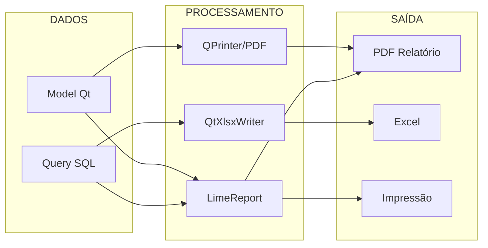

# Módulo: Relatórios

> Status: **Rascunho**
> Prioridade: 5 (suporte)
> Complexidade: **Média**

---

## Visão Geral

O módulo de Relatórios gerencia a geração de documentos e relatórios do sistema. Atualmente utiliza **LimeReport** para relatórios complexos e **QtXlsxWriter** para exportações Excel.

### Tipos de Saída



---

## Implementação Atual (C++)

### Classes

| Classe            | Arquivo               | Finalidade                     |
| ----------------- | --------------------- | ------------------------------ |
| `WidgetRelatorio` | `widgetrelatorio.cpp` | Widget principal de relatórios |
| `Excel`           | `excel.cpp`           | Geração de arquivos Excel      |
| `PDF`             | `pdf.cpp`             | Geração de PDFs                |

### Templates LimeReport

| Template  | Arquivo               | Propósito              |
| --------- | --------------------- | ---------------------- |
| Orçamento | `orcamento.lrxml`     | Impressão de orçamento |
| Venda     | `venda.lrxml`         | Impressão de venda     |
| NFe       | `relatorio_nfe.lrxml` | Relatório de NFe       |
| Galpão    | `galpao.lrxml`        | Layout do armazém      |
| Pallet    | `pallet.lrxml`        | Etiqueta de pallet     |

### Modelos Excel

| Modelo             | Arquivo                 | Propósito              |
| ------------------ | ----------------------- | ---------------------- |
| Pedido de Compra   | `modelo_compras.xlsx`   | Pedido para fornecedor |
| Espelho de Entrega | `espelho_entrega.xlsx`  | Comprovante de entrega |
| Checklist          | `modelo_checklist.xlsx` | Verificação física     |

### Relatórios Existentes

#### Relatórios de Vendas

- Vendas por período
- Vendas por vendedor
- Vendas por cliente
- Vendas por produto
- Comissões (RT)

#### Relatórios de Compras

- Compras por fornecedor
- Compras por período
- Pedidos pendentes

#### Relatórios de Estoque

- Posição de estoque
- Movimentação
- Inventário
- Produtos sem movimento

#### Relatórios Financeiros

- Contas a receber
- Contas a pagar
- Fluxo de caixa
- Inadimplência

#### Relatórios Fiscais

- Livro de entrada
- Livro de saída
- Apuração de impostos

---

## Implementação Laravel

### Estratégia de Substituição

LimeReport não tem equivalente direto em PHP. Opções:

| Biblioteca          | Propósito                   | Complexidade |
| ------------------- | --------------------------- | ------------ |
| **DomPDF**          | PDFs simples                | Baixa        |
| **Laravel Excel**   | Exportações Excel           | Baixa        |
| **Browsershot**     | PDFs complexos (via Chrome) | Média        |
| **Snappy**          | PDFs via wkhtmltopdf        | Média        |
| **Laravel Reports** | Framework de relatórios     | Alta         |

### Arquitetura Proposta

```php
// app/Contracts/ReportInterface.php
interface ReportInterface
{
    public function getData(): Collection;
    public function getTitle(): string;
    public function getColumns(): array;
    public function getFilters(): array;
}

// app/Reports/BaseReport.php
abstract class BaseReport implements ReportInterface
{
    protected array $filters = [];

    public function setFilters(array $filters): self
    {
        $this->filters = $filters;
        return $this;
    }

    abstract public function getData(): Collection;
    abstract public function getTitle(): string;
    abstract public function getColumns(): array;

    public function getFilters(): array
    {
        return $this->filters;
    }
}
```

### Exemplos de Relatórios

```php
// app/Reports/Vendas/VendasPorPeriodoReport.php
class VendasPorPeriodoReport extends BaseReport
{
    public function getTitle(): string
    {
        return 'Vendas por Período';
    }

    public function getColumns(): array
    {
        return [
            'id' => 'ID',
            'data' => 'Data',
            'cliente' => 'Cliente',
            'vendedor' => 'Vendedor',
            'total' => 'Total',
            'status' => 'Status',
        ];
    }

    public function getData(): Collection
    {
        return Venda::query()
            ->with(['cliente:id,razao_social', 'vendedor:id,nome'])
            ->when($this->filters['data_inicio'] ?? null, function ($q) {
                $q->whereDate('created_at', '>=', $this->filters['data_inicio']);
            })
            ->when($this->filters['data_fim'] ?? null, function ($q) {
                $q->whereDate('created_at', '<=', $this->filters['data_fim']);
            })
            ->when($this->filters['vendedor_id'] ?? null, function ($q) {
                $q->where('vendedor_id', $this->filters['vendedor_id']);
            })
            ->when($this->filters['status'] ?? null, function ($q) {
                $q->where('status', $this->filters['status']);
            })
            ->orderBy('created_at', 'desc')
            ->get()
            ->map(fn($v) => [
                'id' => $v->id,
                'data' => $v->created_at->format('d/m/Y'),
                'cliente' => $v->cliente->razao_social,
                'vendedor' => $v->vendedor->nome,
                'total' => 'R$ ' . number_format($v->total, 2, ',', '.'),
                'status' => $v->status->label(),
            ]);
    }
}

// app/Reports/Estoque/PosicaoEstoqueReport.php
class PosicaoEstoqueReport extends BaseReport
{
    public function getTitle(): string
    {
        return 'Posição de Estoque';
    }

    public function getColumns(): array
    {
        return [
            'produto' => 'Produto',
            'fornecedor' => 'Fornecedor',
            'quantidade' => 'Quantidade',
            'custo_medio' => 'Custo Médio',
            'valor_total' => 'Valor Total',
            'localizacao' => 'Localização',
        ];
    }

    public function getData(): Collection
    {
        return Estoque::query()
            ->with(['produto:id,descricao', 'fornecedor:id,razao_social', 'bloco:id,nome'])
            ->disponivel()
            ->when($this->filters['produto_id'] ?? null, function ($q) {
                $q->where('produto_id', $this->filters['produto_id']);
            })
            ->when($this->filters['fornecedor_id'] ?? null, function ($q) {
                $q->where('fornecedor_id', $this->filters['fornecedor_id']);
            })
            ->groupBy('produto_id', 'fornecedor_id')
            ->selectRaw('
                produto_id,
                fornecedor_id,
                SUM(quantidade_disponivel) as quantidade,
                AVG(custo_unitario) as custo_medio,
                SUM(quantidade_disponivel * custo_unitario) as valor_total
            ')
            ->get()
            ->map(fn($e) => [
                'produto' => $e->produto->descricao,
                'fornecedor' => $e->fornecedor->razao_social,
                'quantidade' => number_format($e->quantidade, 4, ',', '.'),
                'custo_medio' => 'R$ ' . number_format($e->custo_medio, 4, ',', '.'),
                'valor_total' => 'R$ ' . number_format($e->valor_total, 2, ',', '.'),
                'localizacao' => $e->bloco?->nome ?? '-',
            ]);
    }
}
```

### Services

```php
// app/Services/Reports/ReportService.php
class ReportService
{
    /**
     * Gerar relatório em formato específico
     */
    public function generate(
        ReportInterface $report,
        string $format = 'html'
    ): mixed {
        return match($format) {
            'html' => $this->generateHtml($report),
            'pdf' => $this->generatePdf($report),
            'excel' => $this->generateExcel($report),
            'csv' => $this->generateCsv($report),
            default => throw new InvalidArgumentException("Formato inválido: {$format}"),
        };
    }

    private function generateHtml(ReportInterface $report): string
    {
        return view('reports.template', [
            'title' => $report->getTitle(),
            'columns' => $report->getColumns(),
            'data' => $report->getData(),
            'filters' => $report->getFilters(),
        ])->render();
    }

    private function generatePdf(ReportInterface $report): string
    {
        $html = $this->generateHtml($report);

        // Usando DomPDF
        $pdf = Pdf::loadHTML($html);
        $pdf->setPaper('a4', 'landscape');

        return $pdf->output();
    }

    private function generateExcel(ReportInterface $report): string
    {
        $export = new ReportExport($report);

        return Excel::raw($export, \Maatwebsite\Excel\Excel::XLSX);
    }

    private function generateCsv(ReportInterface $report): string
    {
        $export = new ReportExport($report);

        return Excel::raw($export, \Maatwebsite\Excel\Excel::CSV);
    }
}

// app/Exports/ReportExport.php
class ReportExport implements FromCollection, WithHeadings, WithStyles
{
    public function __construct(
        private ReportInterface $report
    ) {}

    public function collection(): Collection
    {
        return $this->report->getData();
    }

    public function headings(): array
    {
        return array_values($this->report->getColumns());
    }

    public function styles(Worksheet $sheet): array
    {
        return [
            1 => ['font' => ['bold' => true]],
        ];
    }
}
```

### Documentos Específicos

```php
// app/Services/Documents/OrcamentoDocumentService.php
class OrcamentoDocumentService
{
    /**
     * Gerar PDF do orçamento
     */
    public function gerarPdf(Orcamento $orcamento): string
    {
        $orcamento->load([
            'cliente',
            'vendedor',
            'profissional',
            'enderecoEntrega',
            'itens.produto',
        ]);

        $html = view('documents.orcamento', [
            'orcamento' => $orcamento,
            'empresa' => $this->getEmpresa(),
        ])->render();

        return Pdf::loadHTML($html)
            ->setPaper('a4')
            ->output();
    }

    /**
     * Gerar Excel do orçamento
     */
    public function gerarExcel(Orcamento $orcamento): string
    {
        return Excel::raw(
            new OrcamentoExport($orcamento),
            \Maatwebsite\Excel\Excel::XLSX
        );
    }
}

// app/Services/Documents/VendaDocumentService.php
class VendaDocumentService
{
    public function gerarPdf(Venda $venda): string
    {
        $venda->load([
            'cliente',
            'vendedor',
            'enderecoEntrega',
            'itens.produto',
            'contasReceber',
        ]);

        return Pdf::loadView('documents.venda', [
            'venda' => $venda,
            'empresa' => $this->getEmpresa(),
        ])->output();
    }

    public function gerarEspelhoEntrega(Venda $venda): string
    {
        return Pdf::loadView('documents.espelho-entrega', [
            'venda' => $venda,
        ])->output();
    }
}
```

### Controllers

```php
// app/Http/Controllers/ReportController.php
class ReportController extends Controller
{
    public function __construct(
        private ReportService $reportService
    ) {}

    public function index()
    {
        $reports = [
            'vendas' => [
                ['name' => 'Vendas por Período', 'route' => 'reports.vendas.periodo'],
                ['name' => 'Vendas por Vendedor', 'route' => 'reports.vendas.vendedor'],
                ['name' => 'Vendas por Cliente', 'route' => 'reports.vendas.cliente'],
            ],
            'estoque' => [
                ['name' => 'Posição de Estoque', 'route' => 'reports.estoque.posicao'],
                ['name' => 'Movimentação', 'route' => 'reports.estoque.movimentacao'],
            ],
            'financeiro' => [
                ['name' => 'Contas a Receber', 'route' => 'reports.financeiro.receber'],
                ['name' => 'Contas a Pagar', 'route' => 'reports.financeiro.pagar'],
                ['name' => 'Fluxo de Caixa', 'route' => 'reports.financeiro.fluxo'],
            ],
        ];

        return Inertia::render('Reports/Index', ['reports' => $reports]);
    }

    public function vendasPorPeriodo(Request $request)
    {
        $report = (new VendasPorPeriodoReport())
            ->setFilters($request->only(['data_inicio', 'data_fim', 'vendedor_id', 'status']));

        if ($request->format === 'pdf') {
            return response($this->reportService->generate($report, 'pdf'))
                ->header('Content-Type', 'application/pdf');
        }

        if ($request->format === 'excel') {
            return response($this->reportService->generate($report, 'excel'))
                ->header('Content-Type', 'application/vnd.openxmlformats-officedocument.spreadsheetml.sheet')
                ->header('Content-Disposition', 'attachment; filename="vendas.xlsx"');
        }

        return Inertia::render('Reports/VendasPorPeriodo', [
            'data' => $report->getData(),
            'columns' => $report->getColumns(),
            'filters' => $report->getFilters(),
        ]);
    }
}
```

### Rotas

```php
// routes/web.php
Route::middleware(['auth'])->prefix('relatorios')->name('reports.')->group(function () {
    Route::get('/', [ReportController::class, 'index'])->name('index');

    // Vendas
    Route::get('vendas/periodo', [ReportController::class, 'vendasPorPeriodo'])
        ->name('vendas.periodo');
    Route::get('vendas/vendedor', [ReportController::class, 'vendasPorVendedor'])
        ->name('vendas.vendedor');

    // Estoque
    Route::get('estoque/posicao', [ReportController::class, 'posicaoEstoque'])
        ->name('estoque.posicao');

    // Financeiro
    Route::get('financeiro/receber', [ReportController::class, 'contasReceber'])
        ->name('financeiro.receber');
    Route::get('financeiro/pagar', [ReportController::class, 'contasPagar'])
        ->name('financeiro.pagar');
});
```

---

## Componentes de UI

### Catálogo de Relatórios

- Agrupamento por módulo
- Descrição de cada relatório
- Favoritos do usuário
- Histórico de execuções

### Tela de Filtros

- Filtros dinâmicos por relatório
- Salvamento de filtros favoritos
- Preview de dados

### Visualização de Relatório

- Tabela paginada
- Gráficos (quando aplicável)
- Botões de exportação (PDF, Excel, CSV)
- Impressão direta

---

## Considerações de Migração

### Inventário de Relatórios

1. Listar todos os relatórios LimeReport existentes
2. Classificar por criticidade (crítico, importante, nice-to-have)
3. Definir ordem de migração

### Estratégia

1. **Fase 1**: Relatórios críticos (vendas, estoque, financeiro)
2. **Fase 2**: Documentos (orçamento, venda, NFe)
3. **Fase 3**: Relatórios gerenciais
4. **Fase 4**: Relatórios fiscais

### Templates

- Criar templates Blade para cada tipo de documento
- Manter consistência visual com sistema atual
- Testar impressão em diferentes impressoras
