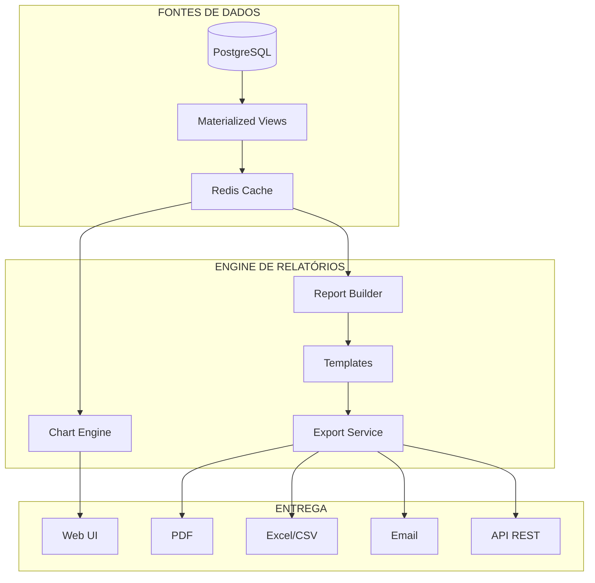

# Módulo: Relatórios e Dashboards

> Status: **Rascunho**
> Prioridade: 5 (suporte)
> Complexidade: **Alta**

---

## Visão Geral

O módulo de Relatórios e Dashboards fornece inteligência de negócios através de visualizações, métricas e relatórios exportáveis. Evolui de relatórios básicos para uma plataforma completa de BI.

### Estado Atual vs. Estado Alvo

| Aspecto | Atual | Alvo |
|---------|-------|------|
| Dashboards | 1 (Comissões) + Gráfico vendas | 10+ dashboards especializados |
| Relatórios | ~15 básicos | 50+ relatórios estruturados |
| KPIs | Nenhum em tempo real | 30+ KPIs com metas |
| Análises | Básico (período/vendedor) | ABC, RFM, Aging, Forecasting |
| Fiscal | NFe summary | SPED, DIRF, EFD compliant |
| Export | PDF, Excel | PDF, Excel, CSV, JSON, Email |
| Customização | Nenhuma | Report Builder visual |
| Automação | Manual | Agendamento + distribuição |

### Arquitetura



---

## Implementação Atual (C++)

### Classes Existentes

| Classe | Arquivo | Finalidade |
|--------|---------|------------|
| `WidgetRelatorio` | `widgetrelatorio.cpp` | Dashboard de comissões (3 tabelas) |
| `WidgetGraficos` | `widgetgraficos.cpp` | Gráfico de vendas 13 meses |
| `WidgetGalpao` | `widgetgalpao.cpp` | Impressão de pallets |
| `WidgetNfeSaida` | `widgetnfesaida.cpp` | Relatório NFe com totais |
| `Excel` | `excel.cpp` | Geração de arquivos Excel |
| `PDF` | `pdf.cpp` | Geração de PDFs |

### Templates LimeReport Existentes

| Template | Arquivo | Propósito |
|----------|---------|-----------|
| Venda | `venda.lrxml` (202 KB) | Impressão de venda |
| Orçamento | `orcamento.lrxml` (197 KB) | Impressão de orçamento |
| NFe | `relatorio_nfe.lrxml` (192 KB) | Relatório fiscal NFe |
| Galpão | `galpao.lrxml` (63 KB) | Layout do armazém |
| Pallet | `pallet.lrxml` (13 KB) | Etiqueta de pallet |

### Views de Banco Existentes

```sql
-- Relatórios de Comissão
view_relatorio              -- Dados detalhados de vendas/comissão
view_relatorio_vendedor     -- Agregado por vendedor
view_relatorio_loja         -- Agregado por loja
view_relatorio_reposicao    -- Custos de reposição

-- Gráficos
view_grafico_lojas          -- Vendas diárias cumulativas (todas lojas)
view_grafico_loja           -- Vendas diárias cumulativas (por loja)

-- NFe
view_relatorio_nfe          -- Detalhes de notas fiscais
```

### Relatórios Existentes

#### Vendas
- Vendas por período
- Vendas por vendedor
- Vendas por cliente
- Comissões (RT) por vendedor/loja

#### Compras
- Compras por fornecedor
- Pedidos pendentes

#### Estoque
- Posição de estoque
- Movimentação

#### Financeiro
- Contas a receber (básico)
- Contas a pagar (básico)
- Fluxo de caixa (simplificado)

#### Fiscal
- Livro de entrada/saída (via NFe)

---

## Roadmap de Expansão

### FASE 1: DASHBOARDS EXECUTIVOS (P0)

**Complexidade:** Alta | **Estimativa:** 6-8 semanas

#### 1.1 Dashboard Principal (Home)

```
┌─────────────────────────────────────────────────────────────────────────┐
│ Dashboard                                          Hoje: 10/01/2026     │
├─────────────────────────────────────────────────────────────────────────┤
│                                                                         │
│  ┌──────────────┐  ┌──────────────┐  ┌──────────────┐  ┌──────────────┐│
│  │ Faturamento  │  │   Pedidos    │  │   Margem     │  │  Ticket Médio││
│  │   Hoje       │  │    Hoje      │  │    Bruta     │  │              ││
│  │  R$ 45.230   │  │     12       │  │    32,5%     │  │  R$ 3.769    ││
│  │  ▲ +12% meta │  │  ▲ +3 ontem  │  │  ▼ -1,2% mês │  │  ▲ +5% mês   ││
│  └──────────────┘  └──────────────┘  └──────────────┘  └──────────────┘│
│                                                                         │
│  ┌─────────────────────────────────┐  ┌─────────────────────────────┐  │
│  │ Faturamento Mensal              │  │ Top 5 Produtos              │  │
│  │ ████████████████░░░░  78%       │  │ 1. Produto A    R$ 12.500   │  │
│  │ Meta: R$ 500.000                │  │ 2. Produto B    R$ 9.800    │  │
│  │ Atual: R$ 390.000               │  │ 3. Produto C    R$ 7.200    │  │
│  │ Faltam: R$ 110.000              │  │ 4. Produto D    R$ 5.100    │  │
│  │                                 │  │ 5. Produto E    R$ 4.300    │  │
│  └─────────────────────────────────┘  └─────────────────────────────┘  │
│                                                                         │
│  ┌─────────────────────────────────┐  ┌─────────────────────────────┐  │
│  │ Vendas por Loja (Mês)          │  │ Alertas                      │  │
│  │ ┌─────────────────────────┐    │  │ ⚠️ 15 parcelas vencem hoje   │  │
│  │ │    📊 Gráfico Barras    │    │  │ ⚠️ 8 produtos estoque mínimo │  │
│  │ │    Loja A: R$ 150k      │    │  │ 🔴 3 parcelas em atraso      │  │
│  │ │    Loja B: R$ 120k      │    │  │ 📦 2 entregas pendentes      │  │
│  │ │    Loja C: R$ 120k      │    │  │                              │  │
│  │ └─────────────────────────┘    │  │ [Ver todos os alertas →]    │  │
│  └─────────────────────────────────┘  └─────────────────────────────┘  │
│                                                                         │
└─────────────────────────────────────────────────────────────────────────┘
```

#### 1.2 Schema de KPIs

```sql
-- =====================================================
-- FASE 1: DASHBOARDS - Schema
-- =====================================================

-- Definição de KPIs
CREATE TABLE kpis (
    id BIGSERIAL PRIMARY KEY,
    codigo VARCHAR(50) NOT NULL UNIQUE,
    nome VARCHAR(100) NOT NULL,
    descricao TEXT,

    -- Categoria
    categoria VARCHAR(50) NOT NULL,        -- VENDAS, FINANCEIRO, ESTOQUE, etc.

    -- Cálculo
    formula TEXT NOT NULL,                 -- SQL ou expressão
    unidade VARCHAR(20),                   -- R$, %, un, dias
    decimais SMALLINT DEFAULT 2,

    -- Agregação
    agregacao VARCHAR(20) DEFAULT 'SUM',   -- SUM, AVG, COUNT, MAX, MIN
    periodo_padrao VARCHAR(20) DEFAULT 'MES', -- DIA, SEMANA, MES, ANO

    -- Visualização
    formato VARCHAR(20) DEFAULT 'numero',  -- numero, moeda, percentual, inteiro
    icone VARCHAR(50),
    cor_positivo VARCHAR(20) DEFAULT 'green',
    cor_negativo VARCHAR(20) DEFAULT 'red',
    invertido BOOLEAN DEFAULT FALSE,       -- TRUE = menor é melhor

    ativo BOOLEAN DEFAULT TRUE,
    created_at TIMESTAMP DEFAULT NOW()
);

-- Metas de KPIs
CREATE TABLE kpis_metas (
    id BIGSERIAL PRIMARY KEY,
    kpi_id BIGINT NOT NULL REFERENCES kpis(id),
    loja_id BIGINT REFERENCES lojas(id),   -- NULL = todas

    ano SMALLINT NOT NULL,
    mes SMALLINT,                          -- NULL = meta anual

    valor_meta DECIMAL(15,2) NOT NULL,
    valor_minimo DECIMAL(15,2),            -- Mínimo aceitável
    valor_maximo DECIMAL(15,2),            -- Stretch goal

    created_at TIMESTAMP DEFAULT NOW(),

    CONSTRAINT uq_kpi_meta_periodo UNIQUE (kpi_id, loja_id, ano, mes)
);

-- Cache de KPIs calculados (atualizado periodicamente)
CREATE TABLE kpis_cache (
    id BIGSERIAL PRIMARY KEY,
    kpi_id BIGINT NOT NULL REFERENCES kpis(id),
    loja_id BIGINT REFERENCES lojas(id),

    periodo_tipo VARCHAR(20) NOT NULL,     -- DIA, SEMANA, MES, ANO
    periodo_inicio DATE NOT NULL,
    periodo_fim DATE NOT NULL,

    valor DECIMAL(15,4) NOT NULL,
    valor_anterior DECIMAL(15,4),          -- Período anterior (para comparação)
    variacao_percentual DECIMAL(8,4),

    meta_valor DECIMAL(15,2),
    meta_atingida_percentual DECIMAL(8,4),

    calculado_em TIMESTAMP DEFAULT NOW(),

    CONSTRAINT uq_kpi_cache UNIQUE (kpi_id, loja_id, periodo_tipo, periodo_inicio)
);

CREATE INDEX idx_kpis_cache_periodo ON kpis_cache(periodo_tipo, periodo_inicio DESC);

-- Dashboards customizados
CREATE TABLE dashboards (
    id BIGSERIAL PRIMARY KEY,
    codigo VARCHAR(50) NOT NULL UNIQUE,
    nome VARCHAR(100) NOT NULL,
    descricao TEXT,

    -- Layout
    layout JSONB NOT NULL DEFAULT '[]',    -- Array de widgets com posições

    -- Acesso
    publico BOOLEAN DEFAULT FALSE,
    perfis_acesso VARCHAR(50)[],           -- Perfis que podem ver

    criado_por BIGINT REFERENCES usuarios(id),
    ativo BOOLEAN DEFAULT TRUE,
    created_at TIMESTAMP DEFAULT NOW(),
    updated_at TIMESTAMP DEFAULT NOW()
);

-- Widgets do dashboard
CREATE TABLE dashboard_widgets (
    id BIGSERIAL PRIMARY KEY,
    dashboard_id BIGINT NOT NULL REFERENCES dashboards(id),

    tipo VARCHAR(50) NOT NULL,             -- KPI_CARD, CHART_LINE, CHART_BAR, TABLE, ALERT
    titulo VARCHAR(100),

    -- Posição no grid (12 colunas)
    posicao_x SMALLINT NOT NULL DEFAULT 0,
    posicao_y SMALLINT NOT NULL DEFAULT 0,
    largura SMALLINT NOT NULL DEFAULT 3,   -- 1-12 colunas
    altura SMALLINT NOT NULL DEFAULT 2,    -- Unidades de altura

    -- Configuração
    config JSONB NOT NULL DEFAULT '{}',    -- KPI_ID, chart config, filters, etc.

    ordem SMALLINT DEFAULT 0,
    ativo BOOLEAN DEFAULT TRUE
);
```

#### 1.3 KPIs Padrão

```sql
-- Inserir KPIs padrão
INSERT INTO kpis (codigo, nome, categoria, formula, unidade, formato) VALUES
-- Vendas
('FATURAMENTO_DIA', 'Faturamento do Dia', 'VENDAS',
 'SELECT COALESCE(SUM(total), 0) FROM vendas WHERE DATE(created_at) = CURRENT_DATE AND status NOT IN (''CANCELADO'')',
 'R$', 'moeda'),
('FATURAMENTO_MES', 'Faturamento do Mês', 'VENDAS',
 'SELECT COALESCE(SUM(total), 0) FROM vendas WHERE DATE_TRUNC(''month'', created_at) = DATE_TRUNC(''month'', CURRENT_DATE) AND status NOT IN (''CANCELADO'')',
 'R$', 'moeda'),
('TICKET_MEDIO', 'Ticket Médio', 'VENDAS',
 'SELECT COALESCE(AVG(total), 0) FROM vendas WHERE DATE_TRUNC(''month'', created_at) = DATE_TRUNC(''month'', CURRENT_DATE) AND status NOT IN (''CANCELADO'')',
 'R$', 'moeda'),
('PEDIDOS_DIA', 'Pedidos do Dia', 'VENDAS',
 'SELECT COUNT(*) FROM vendas WHERE DATE(created_at) = CURRENT_DATE AND status NOT IN (''CANCELADO'')',
 'un', 'inteiro'),
('MARGEM_BRUTA', 'Margem Bruta', 'VENDAS',
 'SELECT COALESCE((SUM(total) - SUM(custo_total)) / NULLIF(SUM(total), 0) * 100, 0) FROM vendas WHERE DATE_TRUNC(''month'', created_at) = DATE_TRUNC(''month'', CURRENT_DATE)',
 '%', 'percentual'),
('CONVERSAO_ORCAMENTO', 'Taxa de Conversão', 'VENDAS',
 'SELECT COALESCE(COUNT(DISTINCT v.orcamento_id)::DECIMAL / NULLIF(COUNT(DISTINCT o.id), 0) * 100, 0) FROM orcamentos o LEFT JOIN vendas v ON v.orcamento_id = o.id WHERE DATE_TRUNC(''month'', o.created_at) = DATE_TRUNC(''month'', CURRENT_DATE)',
 '%', 'percentual'),

-- Financeiro
('RECEBER_VENCIDO', 'A Receber Vencido', 'FINANCEIRO',
 'SELECT COALESCE(SUM(valor - valor_pago), 0) FROM financeiro_parcelas WHERE tipo = ''RECEBER'' AND data_vencimento < CURRENT_DATE AND status NOT IN (''RECEBIDO'', ''CANCELADO'')',
 'R$', 'moeda'),
('RECEBER_HOJE', 'A Receber Hoje', 'FINANCEIRO',
 'SELECT COALESCE(SUM(valor - valor_pago), 0) FROM financeiro_parcelas WHERE tipo = ''RECEBER'' AND data_vencimento = CURRENT_DATE AND status NOT IN (''RECEBIDO'', ''CANCELADO'')',
 'R$', 'moeda'),
('PAGAR_VENCIDO', 'A Pagar Vencido', 'FINANCEIRO',
 'SELECT COALESCE(SUM(valor - valor_pago), 0) FROM financeiro_parcelas WHERE tipo = ''PAGAR'' AND data_vencimento < CURRENT_DATE AND status NOT IN (''PAGO'', ''CANCELADO'')',
 'R$', 'moeda'),
('INADIMPLENCIA', 'Taxa de Inadimplência', 'FINANCEIRO',
 'SELECT COALESCE(SUM(CASE WHEN data_vencimento < CURRENT_DATE THEN valor - valor_pago ELSE 0 END) / NULLIF(SUM(valor), 0) * 100, 0) FROM financeiro_parcelas WHERE tipo = ''RECEBER'' AND status NOT IN (''RECEBIDO'', ''CANCELADO'')',
 '%', 'percentual'),
('DSO', 'DSO (Dias para Receber)', 'FINANCEIRO',
 'SELECT COALESCE(AVG(EXTRACT(DAY FROM (data_pagamento - data_emissao))), 0) FROM financeiro_parcelas WHERE tipo = ''RECEBER'' AND status = ''RECEBIDO'' AND DATE_TRUNC(''month'', data_pagamento) = DATE_TRUNC(''month'', CURRENT_DATE)',
 'dias', 'inteiro'),

-- Estoque
('ESTOQUE_VALOR', 'Valor em Estoque', 'ESTOQUE',
 'SELECT COALESCE(SUM(quantidade * custo_unitario), 0) FROM estoque_lotes WHERE status = ''DISPONIVEL''',
 'R$', 'moeda'),
('PRODUTOS_MINIMO', 'Produtos no Mínimo', 'ESTOQUE',
 'SELECT COUNT(DISTINCT produto_id) FROM estoque_lotes el JOIN produtos p ON p.id = el.produto_id WHERE el.status = ''DISPONIVEL'' GROUP BY produto_id HAVING SUM(quantidade) <= p.estoque_minimo',
 'un', 'inteiro'),
('GIRO_ESTOQUE', 'Giro de Estoque', 'ESTOQUE',
 'SELECT COALESCE(SUM(vi.quantidade * vi.custo_unitario) / NULLIF(AVG(el.quantidade * el.custo_unitario), 0), 0) FROM venda_itens vi JOIN vendas v ON v.id = vi.venda_id JOIN estoque_lotes el ON el.produto_id = vi.produto_id WHERE v.status NOT IN (''CANCELADO'') AND DATE_TRUNC(''month'', v.created_at) = DATE_TRUNC(''month'', CURRENT_DATE)',
 'x', 'numero'),

-- Compras
('COMPRAS_PENDENTES', 'Pedidos Pendentes', 'COMPRAS',
 'SELECT COUNT(*) FROM pedidos_compra WHERE status IN (''PENDENTE'', ''ENVIADO'')',
 'un', 'inteiro'),
('LEAD_TIME_MEDIO', 'Lead Time Médio', 'COMPRAS',
 'SELECT COALESCE(AVG(EXTRACT(DAY FROM (data_recebimento - data_pedido))), 0) FROM compras WHERE data_recebimento IS NOT NULL AND DATE_TRUNC(''month'', data_recebimento) = DATE_TRUNC(''month'', CURRENT_DATE)',
 'dias', 'inteiro');
```

#### 1.4 Materialized Views para Performance

```sql
-- View materializada: Faturamento diário por loja
CREATE MATERIALIZED VIEW mv_faturamento_diario AS
SELECT
    DATE(v.created_at) AS data,
    v.loja_id,
    COUNT(*) AS qtd_pedidos,
    SUM(v.total) AS faturamento,
    SUM(v.total - v.custo_total) AS lucro_bruto,
    AVG(v.total) AS ticket_medio,
    COUNT(DISTINCT v.cliente_id) AS clientes_unicos
FROM vendas v
WHERE v.status NOT IN ('CANCELADO')
GROUP BY DATE(v.created_at), v.loja_id;

CREATE UNIQUE INDEX idx_mv_fat_diario ON mv_faturamento_diario(data, loja_id);

-- View materializada: Ranking de produtos
CREATE MATERIALIZED VIEW mv_ranking_produtos AS
SELECT
    vi.produto_id,
    p.descricao AS produto_nome,
    DATE_TRUNC('month', v.created_at) AS mes,
    v.loja_id,
    SUM(vi.quantidade) AS qtd_vendida,
    SUM(vi.total) AS valor_vendido,
    SUM(vi.total - vi.quantidade * vi.custo_unitario) AS lucro,
    COUNT(DISTINCT v.id) AS qtd_vendas
FROM venda_itens vi
JOIN vendas v ON v.id = vi.venda_id
JOIN produtos p ON p.id = vi.produto_id
WHERE v.status NOT IN ('CANCELADO')
GROUP BY vi.produto_id, p.descricao, DATE_TRUNC('month', v.created_at), v.loja_id;

CREATE INDEX idx_mv_ranking_mes ON mv_ranking_produtos(mes, loja_id);

-- View materializada: Aging de recebíveis
CREATE MATERIALIZED VIEW mv_aging_receber AS
SELECT
    fp.cliente_id,
    c.razao_social AS cliente_nome,
    fp.loja_id,
    SUM(CASE WHEN fp.data_vencimento > CURRENT_DATE THEN fp.valor - fp.valor_pago ELSE 0 END) AS a_vencer,
    SUM(CASE WHEN CURRENT_DATE - fp.data_vencimento BETWEEN 1 AND 30 THEN fp.valor - fp.valor_pago ELSE 0 END) AS vencido_1_30,
    SUM(CASE WHEN CURRENT_DATE - fp.data_vencimento BETWEEN 31 AND 60 THEN fp.valor - fp.valor_pago ELSE 0 END) AS vencido_31_60,
    SUM(CASE WHEN CURRENT_DATE - fp.data_vencimento BETWEEN 61 AND 90 THEN fp.valor - fp.valor_pago ELSE 0 END) AS vencido_61_90,
    SUM(CASE WHEN CURRENT_DATE - fp.data_vencimento > 90 THEN fp.valor - fp.valor_pago ELSE 0 END) AS vencido_90_mais,
    SUM(fp.valor - fp.valor_pago) AS total_aberto
FROM financeiro_parcelas fp
JOIN clientes c ON c.id = fp.cliente_id
WHERE fp.tipo = 'RECEBER'
  AND fp.status NOT IN ('RECEBIDO', 'CANCELADO')
  AND fp.deleted_at IS NULL
GROUP BY fp.cliente_id, c.razao_social, fp.loja_id;

CREATE INDEX idx_mv_aging_cliente ON mv_aging_receber(cliente_id);

-- Refresh automático via pg_cron
-- SELECT cron.schedule('refresh_dashboards', '*/15 * * * *', $$
--     REFRESH MATERIALIZED VIEW CONCURRENTLY mv_faturamento_diario;
--     REFRESH MATERIALIZED VIEW CONCURRENTLY mv_ranking_produtos;
--     REFRESH MATERIALIZED VIEW CONCURRENTLY mv_aging_receber;
-- $$);
```

#### 1.5 Features da Fase 1

| Feature | Descrição | Prioridade |
|---------|-----------|------------|
| Dashboard Home | KPIs principais, metas, alertas | P0 |
| KPIs configuráveis | 15+ KPIs com metas | P0 |
| Comparativo YoY/MoM | Variação vs período anterior | P0 |
| Gráfico de metas | Barra de progresso visual | P1 |
| Alertas integrados | Link com módulo notificações | P1 |
| Filtro por loja | Visão consolidada ou por loja | P0 |
| Cache de KPIs | Materialized views + Redis | P1 |

---

### FASE 2: RELATÓRIOS OPERACIONAIS (P1)

**Complexidade:** Média | **Estimativa:** 6-8 semanas

#### 2.1 Catálogo de Relatórios

```sql
-- Catálogo de relatórios disponíveis
CREATE TABLE relatorios (
    id BIGSERIAL PRIMARY KEY,
    codigo VARCHAR(50) NOT NULL UNIQUE,
    nome VARCHAR(100) NOT NULL,
    descricao TEXT,

    -- Categorização
    categoria VARCHAR(50) NOT NULL,        -- VENDAS, COMPRAS, ESTOQUE, FINANCEIRO, FISCAL
    subcategoria VARCHAR(50),

    -- Implementação
    classe_php VARCHAR(200) NOT NULL,      -- App\Reports\Vendas\VendasPorPeriodo

    -- Filtros disponíveis
    filtros JSONB NOT NULL DEFAULT '[]',   -- [{campo, tipo, label, obrigatorio}]

    -- Colunas
    colunas JSONB NOT NULL DEFAULT '[]',   -- [{campo, label, tipo, alinhamento}]

    -- Totalizadores
    totalizadores JSONB DEFAULT '[]',      -- [{campo, agregacao, label}]

    -- Exportação
    formatos_export VARCHAR(20)[] DEFAULT '{pdf,excel,csv}',

    -- Gráfico associado
    grafico_tipo VARCHAR(50),              -- line, bar, pie, null
    grafico_config JSONB,

    -- Acesso
    perfis_acesso VARCHAR(50)[],

    -- Controle
    ativo BOOLEAN DEFAULT TRUE,
    ordem SMALLINT DEFAULT 0,
    created_at TIMESTAMP DEFAULT NOW()
);

-- Favoritos do usuário
CREATE TABLE relatorios_favoritos (
    usuario_id BIGINT NOT NULL REFERENCES usuarios(id),
    relatorio_id BIGINT NOT NULL REFERENCES relatorios(id),
    ordem SMALLINT DEFAULT 0,
    created_at TIMESTAMP DEFAULT NOW(),

    PRIMARY KEY (usuario_id, relatorio_id)
);

-- Filtros salvos
CREATE TABLE relatorios_filtros_salvos (
    id BIGSERIAL PRIMARY KEY,
    relatorio_id BIGINT NOT NULL REFERENCES relatorios(id),
    usuario_id BIGINT NOT NULL REFERENCES usuarios(id),

    nome VARCHAR(100) NOT NULL,
    filtros JSONB NOT NULL,
    padrao BOOLEAN DEFAULT FALSE,

    created_at TIMESTAMP DEFAULT NOW()
);

-- Histórico de execuções
CREATE TABLE relatorios_execucoes (
    id BIGSERIAL PRIMARY KEY,
    relatorio_id BIGINT NOT NULL REFERENCES relatorios(id),
    usuario_id BIGINT NOT NULL REFERENCES usuarios(id),

    filtros JSONB NOT NULL,
    formato VARCHAR(20) NOT NULL,

    -- Performance
    tempo_execucao_ms INTEGER,
    registros_retornados INTEGER,

    -- Arquivo gerado (se export)
    arquivo_path TEXT,
    arquivo_tamanho INTEGER,

    created_at TIMESTAMP DEFAULT NOW()
);

CREATE INDEX idx_rel_exec_usuario ON relatorios_execucoes(usuario_id, created_at DESC);
```

#### 2.2 Relatórios por Categoria

##### Vendas

| Código | Nome | Filtros | Gráfico |
|--------|------|---------|---------|
| `VENDAS_PERIODO` | Vendas por Período | Data início/fim, Loja, Vendedor, Status | Line |
| `VENDAS_VENDEDOR` | Vendas por Vendedor | Período, Loja | Bar horizontal |
| `VENDAS_CLIENTE` | Vendas por Cliente | Período, Loja, Top N | Bar |
| `VENDAS_PRODUTO` | Vendas por Produto | Período, Loja, Categoria | Bar |
| `VENDAS_HORA` | Vendas por Hora do Dia | Período, Loja, Dia semana | Heatmap |
| `VENDAS_REGIAO` | Vendas por Região | Período, UF, Cidade | Map |
| `COMISSOES` | Comissões (RT) | Mês, Vendedor, Loja | Table |
| `CONVERSAO_ORCAMENTOS` | Conversão de Orçamentos | Período, Vendedor | Funnel |
| `MARGEM_PRODUTO` | Margem por Produto | Período, Categoria | Bar |
| `TICKET_MEDIO` | Análise Ticket Médio | Período, Loja, Vendedor | Line |

##### Compras

| Código | Nome | Filtros | Gráfico |
|--------|------|---------|---------|
| `COMPRAS_PERIODO` | Compras por Período | Data início/fim, Fornecedor | Line |
| `COMPRAS_FORNECEDOR` | Compras por Fornecedor | Período, Top N | Bar |
| `PEDIDOS_PENDENTES` | Pedidos Pendentes | Fornecedor, Atraso | Table |
| `LEAD_TIME` | Lead Time por Fornecedor | Período | Bar |
| `CURVA_ABC_FORNECEDOR` | Curva ABC Fornecedores | Período | Pareto |

##### Estoque

| Código | Nome | Filtros | Gráfico |
|--------|------|---------|---------|
| `POSICAO_ESTOQUE` | Posição de Estoque | Produto, Fornecedor, Bloco | Table |
| `MOVIMENTACAO` | Movimentação de Estoque | Período, Produto, Tipo | Table |
| `INVENTARIO` | Inventário | Data, Bloco | Table |
| `CURVA_ABC` | Curva ABC Produtos | Período, Critério (qtd/valor) | Pareto |
| `GIRO_ESTOQUE` | Giro de Estoque | Período, Categoria | Bar |
| `ESTOQUE_MINIMO` | Produtos Abaixo do Mínimo | Fornecedor | Table |
| `ESTOQUE_PARADO` | Estoque Sem Movimento | Dias sem venda | Table |
| `LOTES_VENCENDO` | Lotes Próximos Vencimento | Dias | Table |
| `VALORIZACAO` | Valorização de Estoque | Data, Método (FIFO/Médio) | Table |

##### Financeiro

| Código | Nome | Filtros | Gráfico |
|--------|------|---------|---------|
| `RECEBER_ANALITICO` | Contas a Receber Analítico | Período, Cliente, Status | Table |
| `RECEBER_SINTETICO` | Contas a Receber Sintético | Período | Table |
| `PAGAR_ANALITICO` | Contas a Pagar Analítico | Período, Fornecedor, Status | Table |
| `PAGAR_SINTETICO` | Contas a Pagar Sintético | Período, Grupo | Table |
| `AGING_RECEBER` | Aging de Recebíveis | Cliente, Loja | Table + Bar |
| `AGING_PAGAR` | Aging de Pagáveis | Fornecedor | Table |
| `FLUXO_CAIXA` | Fluxo de Caixa | Período, Conta | Line |
| `FLUXO_PROJETADO` | Fluxo de Caixa Projetado | Dias futuros | Line |
| `INADIMPLENCIA` | Inadimplência por Cliente | Período, Dias atraso | Table |
| `DSO_DPO` | DSO/DPO Mensal | Período | Line (dual axis) |
| `CONCILIACAO` | Conciliação Bancária | Conta, Período | Table |
| `CENTRO_CUSTO` | Despesas por Centro de Custo | Período, Centro | Pie |

##### Fiscal

| Código | Nome | Filtros | Gráfico |
|--------|------|---------|---------|
| `LIVRO_ENTRADA` | Livro de Entrada | Período | Table |
| `LIVRO_SAIDA` | Livro de Saída | Período | Table |
| `APURACAO_ICMS` | Apuração de ICMS | Período | Table |
| `RETENCOES` | Retenções de Impostos | Período, Tipo | Table |
| `SPED_CONTRIB` | Dados SPED Contribuições | Período | Table |

#### 2.3 Interface de Relatórios

```
┌─────────────────────────────────────────────────────────────────────────┐
│ Relatórios                                            [⭐ Favoritos ▼]  │
├─────────────────────────────────────────────────────────────────────────┤
│                                                                         │
│ 🔍 Buscar relatório...                                                  │
│                                                                         │
│ ┌─────────────────────────────────────────────────────────────────────┐│
│ │ VENDAS                                                              ││
│ │ ├── 📊 Vendas por Período                              [⭐] [▶]    ││
│ │ ├── 👤 Vendas por Vendedor                             [⭐] [▶]    ││
│ │ ├── 🏢 Vendas por Cliente                                   [▶]    ││
│ │ ├── 📦 Vendas por Produto                                   [▶]    ││
│ │ └── 💰 Comissões (RT)                                  [⭐] [▶]    ││
│ ├─────────────────────────────────────────────────────────────────────┤│
│ │ ESTOQUE                                                             ││
│ │ ├── 📋 Posição de Estoque                              [⭐] [▶]    ││
│ │ ├── 📈 Curva ABC                                            [▶]    ││
│ │ └── ⚠️ Produtos Abaixo do Mínimo                            [▶]    ││
│ ├─────────────────────────────────────────────────────────────────────┤│
│ │ FINANCEIRO                                                          ││
│ │ ├── 💳 Contas a Receber                                     [▶]    ││
│ │ ├── 📅 Aging de Recebíveis                                  [▶]    ││
│ │ └── 💸 Fluxo de Caixa                                  [⭐] [▶]    ││
│ └─────────────────────────────────────────────────────────────────────┘│
│                                                                         │
│ RECENTES                                                                │
│ • Vendas por Período (há 2 horas)                                       │
│ • Comissões RT - Janeiro (há 1 dia)                                     │
│ • Posição de Estoque (há 3 dias)                                        │
│                                                                         │
└─────────────────────────────────────────────────────────────────────────┘
```

```
┌─────────────────────────────────────────────────────────────────────────┐
│ Vendas por Período                                    [PDF] [Excel] [🖨]│
├─────────────────────────────────────────────────────────────────────────┤
│ FILTROS                                                                 │
│ ┌─────────────────────────────────────────────────────────────────────┐│
│ │ Data Início: [01/01/2026]  Data Fim: [31/01/2026]  Loja: [Todas ▼] ││
│ │ Vendedor: [Todos ▼]        Status: [Todos ▼]                       ││
│ │                                                                     ││
│ │ [🔍 Filtrar]  [💾 Salvar filtros]  [📋 Carregar: Meus filtros ▼]   ││
│ └─────────────────────────────────────────────────────────────────────┘│
│                                                                         │
│ ┌─────────────────────────────────────────────────────────────────────┐│
│ │                    📈 Gráfico de Vendas                             ││
│ │    R$ 50k │    ╭──────╮                                             ││
│ │           │   ╱        ╲      ╭──╮                                  ││
│ │    R$ 25k │──╱          ╲────╱    ╲───                              ││
│ │           │                                                         ││
│ │         0 │────────────────────────────                             ││
│ │             01   05   10   15   20   25   30                        ││
│ └─────────────────────────────────────────────────────────────────────┘│
│                                                                         │
│ ┌─────────────────────────────────────────────────────────────────────┐│
│ │ # │ Data       │ Cliente          │ Vendedor  │ Total      │ Status ││
│ │───┼────────────┼──────────────────┼───────────┼────────────┼────────││
│ │ 1 │ 10/01/2026 │ ABC Ltda         │ João      │ R$ 5.230   │ ✅     ││
│ │ 2 │ 10/01/2026 │ XYZ S.A.         │ Maria     │ R$ 3.100   │ ✅     ││
│ │ 3 │ 09/01/2026 │ Empresa Teste    │ João      │ R$ 8.750   │ ✅     ││
│ │...│ ...        │ ...              │ ...       │ ...        │ ...    ││
│ └─────────────────────────────────────────────────────────────────────┘│
│                                                                         │
│ TOTAIS                                                                  │
│ ┌─────────────────────────────────────────────────────────────────────┐│
│ │ Total Geral: R$ 456.230,00    Qtd Vendas: 127    Ticket Médio: R$ 3.593││
│ └─────────────────────────────────────────────────────────────────────┘│
│                                                                         │
│ Mostrando 1-50 de 127 registros                    [< 1 2 3 ... 3 >]   │
└─────────────────────────────────────────────────────────────────────────┘
```

#### 2.4 Features da Fase 2

| Feature | Descrição | Prioridade |
|---------|-----------|------------|
| Catálogo de relatórios | 40+ relatórios organizados | P0 |
| Filtros dinâmicos | Por relatório, salvamento | P0 |
| Exportação | PDF, Excel, CSV | P0 |
| Gráficos integrados | Chart.js/Apache ECharts | P1 |
| Favoritos | Por usuário | P1 |
| Histórico | Últimas execuções | P2 |
| Totalizadores | Somas, médias automáticas | P0 |

---

### FASE 3: ANÁLISES AVANÇADAS (P2)

**Complexidade:** Alta | **Estimativa:** 8-10 semanas

#### 3.1 Curva ABC (Pareto)

```sql
-- View para análise ABC de produtos
CREATE VIEW analise_abc_produtos AS
WITH vendas_produto AS (
    SELECT
        vi.produto_id,
        p.descricao AS produto,
        p.categoria_id,
        SUM(vi.total) AS valor_total,
        SUM(vi.quantidade) AS qtd_total
    FROM venda_itens vi
    JOIN vendas v ON v.id = vi.venda_id
    JOIN produtos p ON p.id = vi.produto_id
    WHERE v.status NOT IN ('CANCELADO')
      AND v.created_at >= CURRENT_DATE - INTERVAL '12 months'
    GROUP BY vi.produto_id, p.descricao, p.categoria_id
),
ranking AS (
    SELECT
        *,
        SUM(valor_total) OVER () AS total_geral,
        SUM(valor_total) OVER (ORDER BY valor_total DESC) AS acumulado,
        ROW_NUMBER() OVER (ORDER BY valor_total DESC) AS ranking
    FROM vendas_produto
)
SELECT
    *,
    ROUND(valor_total / total_geral * 100, 2) AS percentual,
    ROUND(acumulado / total_geral * 100, 2) AS percentual_acumulado,
    CASE
        WHEN acumulado / total_geral <= 0.80 THEN 'A'
        WHEN acumulado / total_geral <= 0.95 THEN 'B'
        ELSE 'C'
    END AS classe_abc
FROM ranking
ORDER BY ranking;
```

#### 3.2 Análise RFM (Recência, Frequência, Valor)

```sql
-- View para análise RFM de clientes
CREATE VIEW analise_rfm_clientes AS
WITH metricas AS (
    SELECT
        v.cliente_id,
        c.razao_social AS cliente,
        MAX(v.created_at) AS ultima_compra,
        COUNT(*) AS frequencia,
        SUM(v.total) AS valor_total,
        AVG(v.total) AS ticket_medio
    FROM vendas v
    JOIN clientes c ON c.id = v.cliente_id
    WHERE v.status NOT IN ('CANCELADO')
      AND v.created_at >= CURRENT_DATE - INTERVAL '24 months'
    GROUP BY v.cliente_id, c.razao_social
),
scores AS (
    SELECT
        *,
        CURRENT_DATE - DATE(ultima_compra) AS dias_desde_ultima,
        NTILE(5) OVER (ORDER BY ultima_compra DESC) AS score_recencia,
        NTILE(5) OVER (ORDER BY frequencia) AS score_frequencia,
        NTILE(5) OVER (ORDER BY valor_total) AS score_valor
    FROM metricas
)
SELECT
    *,
    score_recencia || score_frequencia || score_valor AS rfm_score,
    CASE
        WHEN score_recencia >= 4 AND score_frequencia >= 4 AND score_valor >= 4 THEN 'Champions'
        WHEN score_recencia >= 4 AND score_frequencia >= 3 THEN 'Loyal Customers'
        WHEN score_recencia >= 4 AND score_valor >= 4 THEN 'Big Spenders'
        WHEN score_recencia <= 2 AND score_frequencia >= 4 THEN 'At Risk'
        WHEN score_recencia <= 2 AND score_frequencia <= 2 THEN 'Lost'
        WHEN score_recencia >= 4 AND score_frequencia <= 2 THEN 'New Customers'
        ELSE 'Potential Loyalists'
    END AS segmento
FROM scores
ORDER BY valor_total DESC;
```

#### 3.3 Forecasting (Previsão de Vendas)

```sql
-- Dados históricos para forecasting
CREATE VIEW dados_forecasting AS
SELECT
    DATE_TRUNC('week', v.created_at) AS semana,
    v.loja_id,
    vi.produto_id,
    p.categoria_id,
    SUM(vi.quantidade) AS qtd_vendida,
    SUM(vi.total) AS valor_vendido,
    COUNT(DISTINCT v.id) AS qtd_vendas
FROM venda_itens vi
JOIN vendas v ON v.id = vi.venda_id
JOIN produtos p ON p.id = vi.produto_id
WHERE v.status NOT IN ('CANCELADO')
GROUP BY DATE_TRUNC('week', v.created_at), v.loja_id, vi.produto_id, p.categoria_id
ORDER BY semana;

-- Média móvel para previsão simples
CREATE VIEW previsao_media_movel AS
SELECT
    produto_id,
    loja_id,
    semana,
    qtd_vendida,
    AVG(qtd_vendida) OVER (
        PARTITION BY produto_id, loja_id
        ORDER BY semana
        ROWS BETWEEN 4 PRECEDING AND 1 PRECEDING
    ) AS media_movel_4sem,
    AVG(qtd_vendida) OVER (
        PARTITION BY produto_id, loja_id
        ORDER BY semana
        ROWS BETWEEN 12 PRECEDING AND 1 PRECEDING
    ) AS media_movel_12sem
FROM dados_forecasting;
```

#### 3.4 Features da Fase 3

| Feature | Descrição | Prioridade |
|---------|-----------|------------|
| Curva ABC | Produtos, clientes, fornecedores | P1 |
| Análise RFM | Segmentação de clientes | P1 |
| Forecasting | Previsão por média móvel | P2 |
| CLV | Customer Lifetime Value | P2 |
| Cohort Analysis | Análise por coorte | P3 |
| Break-even | Ponto de equilíbrio | P2 |

---

### FASE 4: DEMONSTRATIVOS FINANCEIROS (P2)

**Complexidade:** Alta | **Estimativa:** 8-10 semanas

#### 4.1 DRE (Demonstração do Resultado)

```sql
-- Estrutura do DRE
CREATE TABLE dre_contas (
    id BIGSERIAL PRIMARY KEY,
    codigo VARCHAR(20) NOT NULL,
    descricao VARCHAR(200) NOT NULL,

    -- Hierarquia
    pai_id BIGINT REFERENCES dre_contas(id),
    nivel SMALLINT NOT NULL,
    ordem SMALLINT NOT NULL,

    -- Cálculo
    tipo VARCHAR(20) NOT NULL,             -- RECEITA, DEDUCAO, CUSTO, DESPESA, RESULTADO
    formula TEXT,                          -- Para linhas calculadas

    -- Exibição
    negrito BOOLEAN DEFAULT FALSE,
    separador_antes BOOLEAN DEFAULT FALSE,

    ativo BOOLEAN DEFAULT TRUE
);

-- Mapeamento de contas contábeis para DRE
CREATE TABLE dre_mapeamento (
    id BIGSERIAL PRIMARY KEY,
    dre_conta_id BIGINT NOT NULL REFERENCES dre_contas(id),
    conta_contabil_id BIGINT NOT NULL REFERENCES plano_contas(id),

    fator SMALLINT DEFAULT 1,              -- 1 ou -1 para inversão de sinal

    CONSTRAINT uq_mapeamento UNIQUE (dre_conta_id, conta_contabil_id)
);

-- View do DRE
CREATE VIEW dre_realizado AS
WITH valores AS (
    SELECT
        dc.id AS dre_conta_id,
        DATE_TRUNC('month', lc.data_competencia) AS mes,
        SUM(
            COALESCE(lcp.valor_credito, 0) * dm.fator -
            COALESCE(lcp.valor_debito, 0) * dm.fator
        ) AS valor
    FROM dre_contas dc
    JOIN dre_mapeamento dm ON dm.dre_conta_id = dc.id
    JOIN lancamentos_contabeis_partidas lcp ON lcp.conta_id = dm.conta_contabil_id
    JOIN lancamentos_contabeis lc ON lc.id = lcp.lancamento_id
    WHERE lc.status = 'ATIVO'
    GROUP BY dc.id, DATE_TRUNC('month', lc.data_competencia)
)
SELECT
    dc.codigo,
    dc.descricao,
    dc.nivel,
    dc.ordem,
    dc.tipo,
    dc.negrito,
    dc.separador_antes,
    v.mes,
    COALESCE(v.valor, 0) AS valor
FROM dre_contas dc
LEFT JOIN valores v ON v.dre_conta_id = dc.id
WHERE dc.ativo
ORDER BY dc.ordem;
```

#### 4.2 Fluxo de Caixa (DFC)

```sql
-- Estrutura do DFC (método direto)
CREATE TABLE dfc_categorias (
    id BIGSERIAL PRIMARY KEY,
    codigo VARCHAR(20) NOT NULL,
    descricao VARCHAR(200) NOT NULL,

    -- Tipo de atividade
    atividade VARCHAR(20) NOT NULL,        -- OPERACIONAL, INVESTIMENTO, FINANCIAMENTO

    -- Hierarquia
    pai_id BIGINT REFERENCES dfc_categorias(id),
    nivel SMALLINT NOT NULL,
    ordem SMALLINT NOT NULL,

    -- Cálculo
    tipo VARCHAR(20) NOT NULL,             -- ENTRADA, SAIDA, SUBTOTAL, TOTAL

    ativo BOOLEAN DEFAULT TRUE
);

-- Mapeamento de grupos financeiros para DFC
CREATE TABLE dfc_mapeamento (
    id BIGSERIAL PRIMARY KEY,
    dfc_categoria_id BIGINT NOT NULL REFERENCES dfc_categorias(id),

    -- Filtro (pelo menos um preenchido)
    grupo_financeiro grupo_financeiro,
    conta_bancaria_id BIGINT REFERENCES contas_bancarias(id),

    fator SMALLINT DEFAULT 1               -- 1 = entrada, -1 = saída
);

-- View do Fluxo de Caixa Realizado
CREATE VIEW dfc_realizado AS
SELECT
    dc.atividade,
    dc.codigo,
    dc.descricao,
    dc.nivel,
    dc.tipo,
    DATE_TRUNC('month', fpp.data_pagamento) AS mes,
    SUM(fpp.valor * dm.fator) AS valor
FROM dfc_categorias dc
JOIN dfc_mapeamento dm ON dm.dfc_categoria_id = dc.id
JOIN financeiro_parcelas fp ON fp.grupo = dm.grupo_financeiro
JOIN financeiro_parcelas_pagamentos fpp ON fpp.parcela_id = fp.id
GROUP BY dc.atividade, dc.codigo, dc.descricao, dc.nivel, dc.tipo,
         DATE_TRUNC('month', fpp.data_pagamento)
ORDER BY dc.atividade, dc.ordem;
```

#### 4.3 Features da Fase 4

| Feature | Descrição | Prioridade |
|---------|-----------|------------|
| DRE | Mensal, trimestral, anual | P1 |
| DFC | Método direto | P1 |
| Balanço Patrimonial | Simplificado | P2 |
| Comparativo | Período vs período | P1 |
| Análise vertical/horizontal | Percentuais e variações | P2 |
| Budget vs Actual | Orçado vs realizado | P2 |

---

### FASE 5: RELATÓRIOS FISCAIS (P2)

**Complexidade:** Alta | **Estimativa:** 6-8 semanas

#### 5.1 Livros Fiscais

```sql
-- Livro de Entrada (NFe)
CREATE VIEW livro_entrada AS
SELECT
    n.numero,
    n.serie,
    n.chave,
    n.data_emissao,
    n.data_entrada,
    f.razao_social AS emitente,
    f.cnpj AS emitente_cnpj,
    n.cfop,
    n.valor_total,
    n.valor_produtos,
    n.valor_icms,
    n.valor_icms_st,
    n.valor_ipi,
    n.valor_pis,
    n.valor_cofins,
    n.valor_frete,
    n.valor_seguro,
    n.valor_desconto
FROM nfes n
JOIN fornecedores f ON f.id = n.fornecedor_id
WHERE n.tipo_operacao = 'ENTRADA'
  AND n.status = 'AUTORIZADA'
ORDER BY n.data_entrada, n.numero;

-- Livro de Saída (NFe)
CREATE VIEW livro_saida AS
SELECT
    n.numero,
    n.serie,
    n.chave,
    n.data_emissao,
    c.razao_social AS destinatario,
    c.cpf_cnpj AS destinatario_doc,
    n.cfop,
    n.valor_total,
    n.valor_produtos,
    n.valor_icms,
    n.valor_icms_st,
    n.valor_ipi,
    n.valor_pis,
    n.valor_cofins,
    n.valor_frete,
    n.valor_seguro,
    n.valor_desconto
FROM nfes n
LEFT JOIN clientes c ON c.id = n.cliente_id
WHERE n.tipo_operacao = 'SAIDA'
  AND n.status = 'AUTORIZADA'
ORDER BY n.data_emissao, n.numero;

-- Apuração ICMS
CREATE VIEW apuracao_icms AS
SELECT
    DATE_TRUNC('month', n.data_emissao) AS competencia,
    SUM(CASE WHEN tipo_operacao = 'SAIDA' THEN valor_icms ELSE 0 END) AS icms_saidas,
    SUM(CASE WHEN tipo_operacao = 'ENTRADA' THEN valor_icms ELSE 0 END) AS icms_entradas,
    SUM(CASE WHEN tipo_operacao = 'SAIDA' THEN valor_icms ELSE 0 END) -
    SUM(CASE WHEN tipo_operacao = 'ENTRADA' THEN valor_icms ELSE 0 END) AS icms_a_recolher
FROM nfes n
WHERE n.status = 'AUTORIZADA'
GROUP BY DATE_TRUNC('month', n.data_emissao)
ORDER BY competencia;
```

#### 5.2 Dados para SPED

```sql
-- Dados auxiliares para SPED Contribuições
CREATE VIEW sped_contribuicoes AS
SELECT
    DATE_TRUNC('month', n.data_emissao) AS competencia,
    n.cfop,
    n.cst_pis,
    n.cst_cofins,
    SUM(n.valor_produtos) AS base_calculo,
    SUM(n.valor_pis) AS valor_pis,
    SUM(n.valor_cofins) AS valor_cofins,
    n.natureza_bc_credito
FROM nfes n
WHERE n.status = 'AUTORIZADA'
GROUP BY
    DATE_TRUNC('month', n.data_emissao),
    n.cfop, n.cst_pis, n.cst_cofins, n.natureza_bc_credito
ORDER BY competencia, cfop;

-- Retenções para DIRF
CREATE VIEW retencoes_dirf AS
SELECT
    DATE_TRUNC('year', ri.competencia) AS ano,
    f.cnpj AS cnpj_fonte,
    f.razao_social AS fonte_pagadora,
    ri.tipo AS tipo_retencao,
    SUM(ri.base_calculo) AS total_rendimentos,
    SUM(ri.valor_retido) AS total_retido
FROM retencoes_impostos ri
JOIN financeiro_parcelas fp ON fp.id = ri.parcela_id
JOIN fornecedores f ON f.id = fp.fornecedor_id
WHERE ri.tipo = 'IRRF'
GROUP BY DATE_TRUNC('year', ri.competencia), f.cnpj, f.razao_social, ri.tipo
ORDER BY ano, f.razao_social;
```

#### 5.3 Features da Fase 5

| Feature | Descrição | Prioridade |
|---------|-----------|------------|
| Livro Entrada | Por período, com filtros | P0 |
| Livro Saída | Por período, com filtros | P0 |
| Apuração ICMS | Mensal | P1 |
| Dados SPED | PIS/COFINS, Contribuições | P2 |
| Dados DIRF | Retenções anuais | P2 |
| Registro Inventário | Para SPED Fiscal | P2 |

---

### FASE 6: AUTOMAÇÃO E DISTRIBUIÇÃO (P3)

**Complexidade:** Média | **Estimativa:** 4-6 semanas

#### 6.1 Agendamento de Relatórios

```sql
-- Agendamentos de relatórios
CREATE TABLE relatorios_agendamentos (
    id BIGSERIAL PRIMARY KEY,
    relatorio_id BIGINT NOT NULL REFERENCES relatorios(id),

    nome VARCHAR(100) NOT NULL,
    descricao TEXT,

    -- Filtros fixos
    filtros JSONB NOT NULL DEFAULT '{}',
    formato VARCHAR(20) NOT NULL DEFAULT 'pdf',

    -- Frequência (cron expression)
    cron_expression VARCHAR(100) NOT NULL, -- '0 8 * * 1' = Segunda 8h
    timezone VARCHAR(50) DEFAULT 'America/Sao_Paulo',

    -- Destinatários
    destinatarios_usuarios BIGINT[],
    destinatarios_emails TEXT[],

    -- Controle
    ativo BOOLEAN DEFAULT TRUE,
    ultima_execucao TIMESTAMP,
    proxima_execucao TIMESTAMP,

    criado_por BIGINT REFERENCES usuarios(id),
    created_at TIMESTAMP DEFAULT NOW()
);

-- Execuções agendadas
CREATE TABLE relatorios_agendamentos_execucoes (
    id BIGSERIAL PRIMARY KEY,
    agendamento_id BIGINT NOT NULL REFERENCES relatorios_agendamentos(id),

    -- Status
    status VARCHAR(20) NOT NULL,           -- PENDENTE, EXECUTANDO, SUCESSO, ERRO
    iniciado_em TIMESTAMP,
    finalizado_em TIMESTAMP,

    -- Resultado
    arquivo_path TEXT,
    erro_mensagem TEXT,

    -- Entrega
    emails_enviados INTEGER DEFAULT 0,

    created_at TIMESTAMP DEFAULT NOW()
);

-- Índices
CREATE INDEX idx_agend_proxima ON relatorios_agendamentos(proxima_execucao)
    WHERE ativo;
```

#### 6.2 Features da Fase 6

| Feature | Descrição | Prioridade |
|---------|-----------|------------|
| Agendamento | Cron-based scheduling | P1 |
| Email delivery | Envio automático por email | P1 |
| Múltiplos destinatários | Usuários + emails externos | P2 |
| Retry automático | Em caso de falha | P2 |
| Log de execuções | Histórico completo | P1 |

---

### FASE 7: REPORT BUILDER (P4)

**Complexidade:** Alta | **Estimativa:** 10-12 semanas

#### 7.1 Relatórios Customizados

```sql
-- Relatórios customizados pelo usuário
CREATE TABLE relatorios_custom (
    id BIGSERIAL PRIMARY KEY,

    nome VARCHAR(100) NOT NULL,
    descricao TEXT,

    -- Fonte de dados
    fonte_tipo VARCHAR(50) NOT NULL,       -- TABLE, VIEW, QUERY
    fonte_nome VARCHAR(100),               -- Nome da tabela/view
    fonte_query TEXT,                      -- Query customizada (se QUERY)

    -- Colunas selecionadas
    colunas JSONB NOT NULL,                -- [{campo, label, tipo, visivel, ordem}]

    -- Filtros configurados
    filtros JSONB DEFAULT '[]',

    -- Ordenação
    ordenacao JSONB DEFAULT '[]',

    -- Agrupamento
    agrupamento JSONB DEFAULT '[]',

    -- Totalizadores
    totalizadores JSONB DEFAULT '[]',

    -- Gráfico
    grafico_config JSONB,

    -- Acesso
    criado_por BIGINT NOT NULL REFERENCES usuarios(id),
    compartilhado BOOLEAN DEFAULT FALSE,

    created_at TIMESTAMP DEFAULT NOW(),
    updated_at TIMESTAMP DEFAULT NOW()
);
```

#### 7.2 Interface do Builder

```
┌─────────────────────────────────────────────────────────────────────────┐
│ Report Builder                                        [Salvar] [Testar] │
├─────────────────────────────────────────────────────────────────────────┤
│                                                                         │
│ ┌─────────────────────┐  ┌──────────────────────────────────────────┐  │
│ │ FONTE DE DADOS      │  │ PREVIEW                                  │  │
│ │                     │  │                                          │  │
│ │ [Vendas         ▼]  │  │ ┌────────────────────────────────────┐  │  │
│ │                     │  │ │ Data  │ Cliente │ Total  │ Status │  │  │
│ │ CAMPOS DISPONÍVEIS  │  │ │───────┼─────────┼────────┼────────│  │  │
│ │ ├── 📅 data         │  │ │ 10/01 │ ABC     │ 5.230  │ ✅     │  │  │
│ │ ├── 👤 cliente      │  │ │ 10/01 │ XYZ     │ 3.100  │ ✅     │  │  │
│ │ ├── 👤 vendedor     │  │ │ ...   │ ...     │ ...    │ ...    │  │  │
│ │ ├── 💰 total        │  │ └────────────────────────────────────┘  │  │
│ │ ├── 📊 status       │  │                                          │  │
│ │ └── 🏢 loja         │  │ Total: R$ 456.230,00                     │  │
│ │                     │  │                                          │  │
│ │ [+ Adicionar campo] │  └──────────────────────────────────────────┘  │
│ └─────────────────────┘                                                 │
│                                                                         │
│ ┌─────────────────────┐  ┌──────────────────────────────────────────┐  │
│ │ COLUNAS SELECIONADAS│  │ FILTROS                                  │  │
│ │                     │  │                                          │  │
│ │ 1. Data        [↑↓] │  │ Data: [01/01/2026] até [31/01/2026]     │  │
│ │ 2. Cliente     [↑↓] │  │ Status: [Todos ▼]                       │  │
│ │ 3. Total       [↑↓] │  │ Loja: [Todas ▼]                         │  │
│ │ 4. Status      [↑↓] │  │                                          │  │
│ │                     │  │ [+ Adicionar filtro]                     │  │
│ └─────────────────────┘  └──────────────────────────────────────────┘  │
│                                                                         │
│ ┌─────────────────────┐  ┌──────────────────────────────────────────┐  │
│ │ AGRUPAMENTO         │  │ TOTALIZADORES                            │  │
│ │                     │  │                                          │  │
│ │ Agrupar por:        │  │ [✓] Soma de Total                        │  │
│ │ [Nenhum         ▼]  │  │ [✓] Contagem de registros                │  │
│ │                     │  │ [ ] Média de Total                       │  │
│ └─────────────────────┘  └──────────────────────────────────────────┘  │
│                                                                         │
└─────────────────────────────────────────────────────────────────────────┘
```

#### 7.3 Features da Fase 7

| Feature | Descrição | Prioridade |
|---------|-----------|------------|
| Drag & drop | Colunas e filtros | P1 |
| Preview em tempo real | Ao modificar | P1 |
| Múltiplas fontes | Tabelas, views, queries | P2 |
| Fórmulas | Colunas calculadas | P2 |
| Compartilhamento | Entre usuários | P2 |
| Templates | Salvar como template | P3 |

---

## Resumo do Roadmap

| Fase | Prioridade | Duração | Entregável Principal |
|------|------------|---------|---------------------|
| 1. Dashboards Executivos | P0 | 6-8 sem | KPIs, metas, alertas |
| 2. Relatórios Operacionais | P1 | 6-8 sem | 40+ relatórios estruturados |
| 3. Análises Avançadas | P2 | 8-10 sem | ABC, RFM, Forecasting |
| 4. Demonstrativos Financeiros | P2 | 8-10 sem | DRE, DFC, Balanço |
| 5. Relatórios Fiscais | P2 | 6-8 sem | SPED, DIRF, Livros |
| 6. Automação | P3 | 4-6 sem | Agendamento, email |
| 7. Report Builder | P4 | 10-12 sem | Relatórios customizados |

**Total estimado: 48-62 semanas**

---

## Tecnologias Recomendadas

### Backend (Laravel)

| Componente | Biblioteca | Propósito |
|------------|------------|-----------|
| PDF | DomPDF ou Browsershot | Geração de PDFs |
| Excel | Laravel Excel (Maatwebsite) | Export Excel/CSV |
| Charts | Chart.js ou Apache ECharts | Gráficos |
| Cache | Redis | Cache de KPIs |
| Queue | Laravel Horizon | Jobs de relatórios |
| Scheduler | Laravel Schedule | Agendamentos |

### Frontend (React/Vue)

| Componente | Biblioteca | Propósito |
|------------|------------|-----------|
| Charts | Recharts ou ECharts | Gráficos interativos |
| Tables | TanStack Table | Tabelas com sort/filter |
| Grid | react-grid-layout | Dashboard layout |
| PDF Viewer | react-pdf | Visualização inline |
| Date Range | react-day-picker | Filtros de período |

---

## Documentos Relacionados

- [financeiro.md](./financeiro.md) - Dados financeiros para relatórios
- [vendas.md](./vendas.md) - Dados de vendas
- [estoque.md](./estoque.md) - Dados de estoque
- [nfe.md](./nfe.md) - Dados fiscais
- [notificacoes.md](./notificacoes.md) - Alertas do dashboard
