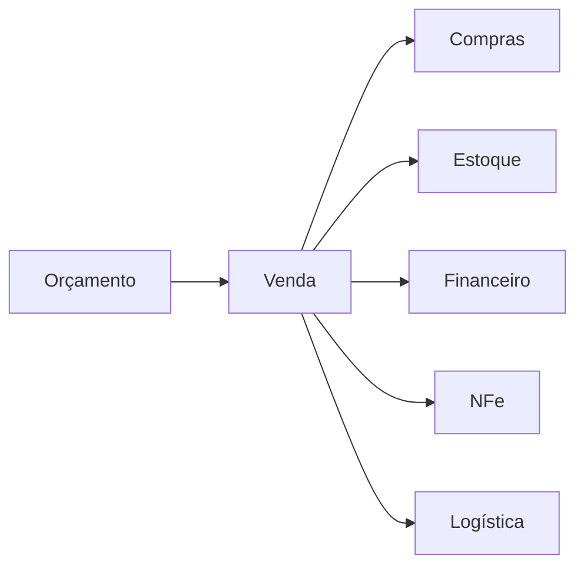
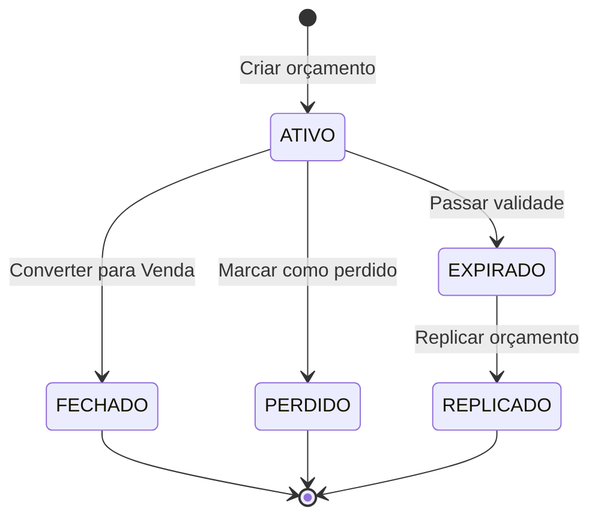
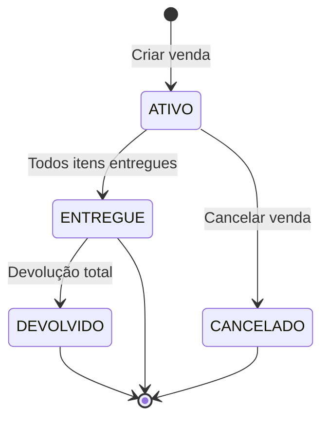
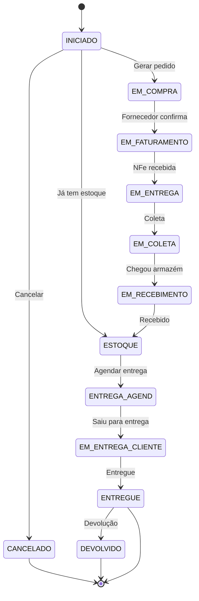

# Módulo: Vendas

> Status: **Rascunho**
> Prioridade: 1 (módulo central)
> Complexidade: **Alta**

---

## Visão Geral

O módulo de Vendas é o **coração do ERP** - todos os outros módulos existem para suportá-lo. O fluxo principal é:



---

## Implementação Atual (C++)

### Classes

| Classe                | Arquivo                   | Finalidade                       |
| --------------------- | ------------------------- | -------------------------------- |
| `Orcamento`           | `orcamento.cpp`           | Diálogo de criação de orçamento  |
| `Venda`               | `venda.cpp`               | Diálogo de venda                 |
| `WidgetOrcamento`     | `widgetorcamento.cpp`     | Widget de listagem de orçamentos |
| `WidgetVenda`         | `widgetvenda.cpp`         | Widget de listagem de vendas     |
| `BaixaOrcamento`      | `baixaorcamento.cpp`      | Fechamento/baixa de orçamento    |
| `OrcamentoProxyModel` | `orcamentoproxymodel.cpp` | Filtros de orçamento             |
| `VendaProxyModel`     | `vendaproxymodel.cpp`     | Filtros de venda                 |

### Tabelas do Banco de Dados

#### Nível 1 (Cabeçalho + Itens do Pedido)

```text
orcamento                    venda
├── idOrcamento              ├── idVenda
├── idCliente                ├── idCliente
├── idEnderecoEntrega        ├── idEnderecoEntrega
├── idEnderecoFaturamento    ├── idEnderecoFaturamento
├── idUsuario (vendedor)     ├── idUsuario
├── idProfissional           ├── idProfissional
├── status                   ├── status
├── subTotalBru              ├── subTotalBru
├── subTotalLiq              ├── subTotalLiq
├── frete                    ├── frete
├── descontoPorc             ├── descontoPorc
├── descontoReais            ├── descontoReais
├── total                    ├── total
├── prazoEntrega             ├── prazoEntrega
├── validade                 ├── idOrcamento (FK)
└── semaforo                 └── statusFinanceiro

orcamento_itens              venda_itens (Flat structure - NEW SCHEMA)
├── id                       ├── id (PK)
├── orcamento_id (FK)        ├── venda_id (FK)
├── produto_id (FK)          ├── produto_id (FK)
├── quantidade               ├── quantidade
├── valor_unitario           ├── valor_unitario
├── desconto                 ├── desconto
└── total                    └── valor_total

#### Alocações (M:N Relationship - NEW SCHEMA)

```text
alocacoes - Links venda_items to estoque_lotes (FIFO/FEFO fulfillment)
├── id (PK)
├── venda_item_id (FK)          ← Venda item being fulfilled
├── estoque_lote_id (FK)        ← Inventory batch (estoque_lotes)
├── quantidade                  ← Allocated quantity (can be partial)
├── status                      ← ATIVO | REVERTIDA | CANCELADA
└── created_at / updated_at     ← Timestamps for audit

**Key Architecture Change**:
- **OLD**: Two-level structure (N1 + N2) with complex partial splitting
  - N1 (venda_has_produto): Product line item
  - N2 (venda_has_produto2): Fulfillment variant/batch
- **NEW**: Flat single-level items + M:N allocations
  - venda_itens: Single product line (no splitting)
  - alocacoes: M:N relationship to inventory batches (supports FIFO/FEFO)
```

### Fluxo de Estados

#### Orçamento



#### Venda (Cabeçalho)



#### Item da Venda (venda_has_produto2)



### Regras de Precificação

O sistema suporta **3 níveis de desconto**:

```text
┌─────────────────────────────────────────────────────────────┐
│                    CÁLCULO DE PREÇO                         │
├─────────────────────────────────────────────────────────────┤
│                                                             │
│  1. PREÇO UNITÁRIO (prcUnitario)                           │
│     └── Preço base do produto                              │
│                                                             │
│  2. DESCONTO POR ITEM (desconto %)                         │
│     └── Aplicado sobre preço unitário                      │
│     └── parcial = quant × prcUnitario × (1 - desconto)     │
│                                                             │
│  3. DESCONTO GLOBAL (descontoPorc % ou descontoReais)      │
│     └── Aplicado proporcionalmente sobre todos itens       │
│     └── total = subTotalLiq × (1 - descontoGlobal) + frete │
│                                                             │
│  CÁLCULO FINAL:                                             │
│  subTotalBru = Σ(quant × prcUnitario)                      │
│  subTotalLiq = Σ(parcial após desconto item)               │
│  total = subTotalLiq - descontoGlobal + frete              │
│                                                             │
└─────────────────────────────────────────────────────────────┘
```

### Funcionalidades Especiais

#### Semáforo de Orçamento

```text
🔴 FRIO    - Baixa probabilidade de fechamento
🟡 MORNO   - Média probabilidade
🟢 QUENTE  - Alta probabilidade de fechamento
```

#### Representação

Flag `representacao` indica venda via representante (comissão diferenciada).

#### RT (Comissão)

Flag `checkBoxRT` indica se venda gera comissão para profissional indicador.

---

## Implementação Laravel (V2 - Simplified)

### Models

```php
// app/Models/Orcamento.php
class Orcamento extends Model
{
    protected $fillable = [
        'loja_id', 'cliente_id', 'vendedor_id', 'profissional_id',
        'endereco_entrega_id', 'endereco_faturamento_id',
        'status', 'semaforo', 'validade',
        'subtotal_bruto', 'subtotal_liquido',
        'desconto_percentual', 'desconto_reais',
        'frete', 'frete_manual', 'total',
        'prazo_entrega', 'representacao', 'observacoes',
    ];

    protected $casts = [
        'status' => OrcamentoStatus::class,
        'semaforo' => SemaforoOrcamento::class,
        'validade' => 'date',
        'representacao' => 'boolean',
        'frete_manual' => 'boolean',
    ];

    public function cliente(): BelongsTo
    {
        return $this->belongsTo(Cliente::class);
    }

    public function vendedor(): BelongsTo
    {
        return $this->belongsTo(Usuario::class, 'vendedor_id');
    }

    public function profissional(): BelongsTo
    {
        return $this->belongsTo(Profissional::class);
    }

    public function enderecoEntrega(): BelongsTo
    {
        return $this->belongsTo(ClienteEndereco::class, 'endereco_entrega_id');
    }

    public function itens(): HasMany
    {
        return $this->hasMany(OrcamentoItem::class);
    }

    public function venda(): HasOne
    {
        return $this->hasOne(Venda::class);
    }

    public function replicadoDe(): BelongsTo
    {
        return $this->belongsTo(Orcamento::class, 'replicado_de_id');
    }
}

// app/Models/Venda.php
class Venda extends Model
{
    protected $fillable = [
        'loja_id', 'orcamento_id', 'cliente_id', 'vendedor_id', 'profissional_id',
        'endereco_entrega_id', 'endereco_faturamento_id',
        'status',
        'subtotal_bruto', 'subtotal_liquido',
        'desconto_percentual', 'desconto_reais',
        'frete', 'frete_manual', 'total',
        'prazo_entrega', 'representacao', 'rt', 'observacoes',
    ];

    protected $casts = [
        'status' => VendaStatus::class,
        'representacao' => 'boolean',
        'rt' => 'boolean',
        'frete_manual' => 'boolean',
    ];

    public function orcamento(): BelongsTo
    {
        return $this->belongsTo(Orcamento::class);
    }

    public function cliente(): BelongsTo
    {
        return $this->belongsTo(Cliente::class);
    }

    public function itens(): HasMany
    {
        return $this->hasMany(VendaItem::class);
    }

    public function parcelasReceber(): HasMany
    {
        return $this->hasMany(FinanceiroParcela::class)
            ->where('tipo', FinanceiroTipo::RECEBER);
    }

    public function entregas(): HasMany
    {
        return $this->hasMany(Entrega::class);
    }
}

// app/Models/VendaItem.php (Flat structure - no N2 level)
class VendaItem extends Model
{
    protected $table = 'venda_itens';

    protected $fillable = [
        'venda_id', 'posicao', 'produto_id', 'fornecedor_id',
        'descricao_produto', 'codigo_produto',
        'quantidade', 'quantidade_caixas', 'unidade',
        'valor_unitario', 'desconto_item_percentual', 'valor_total',
        'origem', 'status',
        'observacoes', 'orcamento_item_id', 'compra_item_id',
    ];

    protected $casts = [
        'origem' => VendaItemOrigem::class,
        'status' => VendaItemStatus::class,
        'quantidade' => 'decimal:4',
        'quantidade_caixas' => 'decimal:4',
        'valor_unitario' => 'decimal:4',
        'desconto_item_percentual' => 'decimal:2',
        'valor_total' => 'decimal:2',
    ];

    public function venda(): BelongsTo
    {
        return $this->belongsTo(Venda::class);
    }

    public function produto(): BelongsTo
    {
        return $this->belongsTo(Produto::class);
    }

    public function fornecedor(): BelongsTo
    {
        return $this->belongsTo(Fornecedor::class);
    }

    // === RELATIONSHIPS ===

    // M:N allocation relationship (venda_items ↔ estoque_lotes)
    public function alocacoes(): HasMany
    {
        return $this->hasMany(Alocacao::class, 'venda_item_id');
    }

    // Deliveries containing this item (via entrega_itens)
    public function entregas(): BelongsToMany
    {
        return $this->belongsToMany(
            Entrega::class,
            'entrega_itens',
            'venda_item_id',
            'entrega_id'
        )
        ->withPivot(['quantidade', 'status']);
    }

    // Link to quotation item (if originated from quote)
    public function orcamentoItem(): BelongsTo
    {
        return $this->belongsTo(OrcamentoItem::class)->nullable();
    }

    // Link to purchase item (if originated from purchase)
    // Used when origem = VendaItemOrigem::COMPRA
    public function compraItem(): BelongsTo
    {
        return $this->belongsTo(CompraItem::class)->nullable();
    }

    // Polymorphic origin: Can be from ORCAMENTO or COMPRA
    // origem field distinguishes: VendaItemOrigem::ORCAMENTO or VendaItemOrigem::COMPRA
    // Use getOrigemModel() helper to get the actual source model

    // Event Sourcing: Historical audit trail
    public function eventos(): HasMany
    {
        return $this->hasMany(VendaItemEvento::class, 'venda_item_id');
    }

    // === HELPERS & CALCULATIONS ===

    /**
     * Get the source model based on origem field
     * Returns either OrcamentoItem or CompraItem model
     */
    public function getOrigemModel()
    {
        return match ($this->origem) {
            VendaItemOrigem::ORCAMENTO => $this->orcamentoItem,
            VendaItemOrigem::COMPRA => $this->compraItem,
            default => null,
        };
    }

    // Calculate total allocated quantity from ATIVO allocations
    public function quantidadeAlocada(): float
    {
        return $this->alocacoes()
            ->where('status', AlocacaoStatus::ATIVO)
            ->sum('quantidade') ?? 0;
    }

    // Calculate remaining unallocated quantity
    public function quantidadePendente(): float
    {
        return max(0, $this->quantidade - $this->quantidadeAlocada());
    }

    // Check if fully allocated
    public function fullyAllocated(): bool
    {
        return $this->quantidadePendente() == 0;
    }

    // Calculate total delivered quantity
    public function quantidadeEntregue(): float
    {
        return $this->entregas()
            ->wherePivot('status', EntregaItemStatus::ENTREGUE)
            ->sum('entrega_itens.quantidade') ?? 0;
    }

    // Check if fully delivered
    public function fullyDelivered(): bool
    {
        return $this->quantidadeEntregue() >= $this->quantidade;
    }
}
```

### Event Sourcing (Append-Only Audit Trail)

This module uses Event Sourcing with append-only events tables for complete audit trail and state reconstruction of sales transactions.

#### Event Tables

```sql
-- Append-only events table for venda_itens state changes
CREATE TABLE venda_itens_events (
    id BIGSERIAL PRIMARY KEY,
    venda_item_id BIGINT NOT NULL,
    event_type VARCHAR(50) NOT NULL,               -- CRIADO, ALOCADO, ENTREGUE, CANCELADO, etc.
    event_data JSONB NOT NULL,                     -- Complete event payload
    usuario_id BIGINT,
    ip_address INET,
    created_at TIMESTAMP NOT NULL DEFAULT NOW()
);

-- Immutability constraint
CREATE TRIGGER fn_prevent_mutation_venda_itens_events
BEFORE UPDATE OR DELETE ON venda_itens_events
FOR EACH ROW EXECUTE FUNCTION fn_prevent_mutation();

-- Index for query performance
CREATE INDEX idx_venda_itens_events_item_tipo
ON venda_itens_events (venda_item_id, event_type, created_at);

-- Append-only events table for allocation changes
CREATE TABLE alocacoes_events (
    id BIGSERIAL PRIMARY KEY,
    alocacao_id BIGINT NOT NULL,
    event_type VARCHAR(50) NOT NULL,               -- CRIADA, REVERTIDA, CANCELADA
    event_data JSONB NOT NULL,
    usuario_id BIGINT,
    ip_address INET,
    created_at TIMESTAMP NOT NULL DEFAULT NOW()
);

CREATE TRIGGER fn_prevent_mutation_alocacoes_events
BEFORE UPDATE OR DELETE ON alocacoes_events
FOR EACH ROW EXECUTE FUNCTION fn_prevent_mutation();

CREATE INDEX idx_alocacoes_events_alocacao_tipo
ON alocacoes_events (alocacao_id, event_type, created_at);
```

#### Event Types

```php
// app/Enums/VendaItemEventType.php
enum VendaItemEventType: string
{
    case CRIADO = 'CRIADO';                        // Item added to venda
    case VALOR_ALTERADO = 'VALOR_ALTERADO';        // Unit price or quantity changed
    case DESCONTO_APLICADO = 'DESCONTO_APLICADO';
    case ORIGEM_ALTERADA = 'ORIGEM_ALTERADA';      // Origem changed (COMPRA → ESTOQUE)
    case ALOCADO = 'ALOCADO';                      // Fully allocated
    case PARCIALMENTE_ALOCADO = 'PARCIALMENTE_ALOCADO';
    case ENTREGUE = 'ENTREGUE';
    case CANCELADO = 'CANCELADO';
    case DEVOLVIDO = 'DEVOLVIDO';
}

// app/Enums/AlocacaoEventType.php
enum AlocacaoEventType: string
{
    case CRIADA = 'CRIADA';                        // Allocation created
    case REVERTIDA = 'REVERTIDA';                  // Allocation reversed (breakage/return)
    case CANCELADA = 'CANCELADA';                  // Allocation canceled
}
```

#### Event Recording in Services

```php
// app/Services/Vendas/VendaService.php
class VendaService
{
    public function adicionarItem(Venda $venda, array $itemData): VendaItem
    {
        return DB::transaction(function () use ($venda, $itemData) {
            $item = $venda->itens()->create($itemData);

            // Record CRIADO event
            DB::table('venda_itens_events')->insert([
                'venda_item_id' => $item->id,
                'event_type' => VendaItemEventType::CRIADO->value,
                'event_data' => json_encode([
                    'produto_id' => $item->produto_id,
                    'quantidade' => $item->quantidade,
                    'valor_unitario' => $item->valor_unitario,
                    'origem' => $item->origem,
                    'status' => $item->status,
                ]),
                'usuario_id' => auth()->id(),
                'ip_address' => request()->ip(),
                'created_at' => now(),
            ]);

            event(new VendaItemAdicionado($item));

            return $item;
        });
    }

    public function cancelarItem(VendaItem $item, string $motivo): void
    {
        DB::transaction(function () use ($item, $motivo) {
            // Record allocation reversals first
            $item->alocacoes()
                ->where('status', AlocacaoStatus::ATIVO)
                ->update(['status' => AlocacaoStatus::REVERTIDA]);

            foreach ($item->alocacoes as $alocacao) {
                DB::table('alocacoes_events')->insert([
                    'alocacao_id' => $alocacao->id,
                    'event_type' => AlocacaoEventType::REVERTIDA->value,
                    'event_data' => json_encode([
                        'motivo' => 'Item cancelado: ' . $motivo,
                        'quantidade_revertida' => $alocacao->quantidade,
                    ]),
                    'usuario_id' => auth()->id(),
                    'ip_address' => request()->ip(),
                    'created_at' => now(),
                ]);
            }

            // Then record item cancellation
            DB::table('venda_itens_events')->insert([
                'venda_item_id' => $item->id,
                'event_type' => VendaItemEventType::CANCELADO->value,
                'event_data' => json_encode([
                    'motivo' => $motivo,
                    'quantidade_cancelada' => $item->quantidade,
                    'alocacoes_revertidas' => $item->alocacoes()->count(),
                ]),
                'usuario_id' => auth()->id(),
                'ip_address' => request()->ip(),
                'created_at' => now(),
            ]);

            $item->update(['status' => VendaItemStatus::CANCELADO]);

            event(new VendaItemCancelado($item));
        });
    }
}

// app/Services/Estoque/AlocacaoService.php
class AlocacaoService
{
    public function alocar(int $vendaItemId, int $estoqueLoteId, float $quantidade): Alocacao
    {
        return DB::transaction(function () use ($vendaItemId, $estoqueLoteId, $quantidade) {
            $alocacao = Alocacao::create([
                'venda_item_id' => $vendaItemId,
                'estoque_lote_id' => $estoqueLoteId,
                'quantidade' => $quantidade,
                'status' => AlocacaoStatus::ATIVO,
            ]);

            // Record CRIADA event
            DB::table('alocacoes_eventos')->insert([
                'alocacao_id' => $alocacao->id,
                'event_type' => AlocacaoEventType::CRIADA->value,
                'event_data' => json_encode([
                    'venda_item_id' => $vendaItemId,
                    'estoque_lote_id' => $estoqueLoteId,
                    'quantidade' => $quantidade,
                    'custo_unitario' => $alocacao->estoqueLote->custo_unitario,
                    'valor_total' => $quantidade * $alocacao->estoqueLote->custo_unitario,
                ]),
                'usuario_id' => auth()->id(),
                'ip_address' => request()->ip(),
                'created_at' => now(),
            ]);

            // Update venda_item allocation status
            DB::table('venda_itens_events')->insert([
                'venda_item_id' => $vendaItemId,
                'event_type' => VendaItemEventType::ALOCADO->value,
                'event_data' => json_encode([
                    'alocacao_id' => $alocacao->id,
                    'quantidade_alocada' => $quantidade,
                ]),
                'usuario_id' => auth()->id(),
                'ip_address' => request()->ip(),
                'created_at' => now(),
            ]);

            event(new AlocacaoCriada($alocacao));

            return $alocacao;
        });
    }
}
```

#### Audit Trail Queries

```php
// Get complete history of a venda_item
$historia = DB::table('venda_itens_events')
    ->where('venda_item_id', $itemId)
    ->orderBy('created_at')
    ->get();

// Get all allocation events for an item
$alocacoes_historia = DB::table('alocacoes_events')
    ->whereIn('alocacao_id', function ($query) use ($itemId) {
        $query->select('id')->from('alocacoes')
            ->where('venda_item_id', $itemId);
    })
    ->orderBy('created_at')
    ->get();

// Reconstruct state at specific timestamp
$estado_em_data = DB::table('venda_itens_events')
    ->where('venda_item_id', $itemId)
    ->where('created_at', '<=', $data)
    ->orderBy('created_at', 'desc')
    ->first();
```

#### Key Benefits

- **Complete Audit Trail**: Every change is recorded with user, timestamp, and IP
- **Immutable History**: Cannot modify or delete events (fn_prevent_mutation enforced)
- **State Reconstruction**: Can replay events to see state at any point in time
- **Compliance**: Meets regulatory requirements for transaction audit logs
- **Debugging**: Trace exact sequence of allocation and delivery events
- **Analytics**: Query event log for insights (e.g., most frequently canceled items)

---

### Enums

```php
// app/Enums/OrcamentoStatus.php
enum OrcamentoStatus: string
{
    case ATIVO = 'ATIVO';
    case FECHADO = 'FECHADO';
    case EXPIRADO = 'EXPIRADO';
    case PERDIDO = 'PERDIDO';
    case REPLICADO = 'REPLICADO';

    public function label(): string
    {
        return match($this) {
            self::ATIVO => 'Ativo',
            self::FECHADO => 'Fechado',
            self::EXPIRADO => 'Expirado',
            self::PERDIDO => 'Perdido',
            self::REPLICADO => 'Replicado',
        };
    }

    public function color(): string
    {
        return match($this) {
            self::ATIVO => 'green',
            self::FECHADO => 'blue',
            self::EXPIRADO => 'gray',
            self::PERDIDO => 'red',
            self::REPLICADO => 'purple',
        };
    }

    public function canConvertToSale(): bool
    {
        return $this === self::ATIVO;
    }
}

// app/Enums/VendaItemStatus.php
enum VendaItemStatus: string
{
    case INICIADO = 'INICIADO';
    case PENDENTE = 'PENDENTE';
    case EM_COMPRA = 'EM COMPRA';
    case EM_FATURAMENTO = 'EM FATURAMENTO';
    case EM_ENTREGA = 'EM ENTREGA';
    case EM_COLETA = 'EM COLETA';
    case EM_RECEBIMENTO = 'EM RECEBIMENTO';
    case ESTOQUE = 'ESTOQUE';
    case ENTREGA_AGENDADA = 'ENTREGA AGEND.';
    case ENTREGUE = 'ENTREGUE';
    case CANCELADO = 'CANCELADO';
    case DEVOLVIDO = 'DEVOLVIDO';

    public function canTransitionTo(self $new): bool
    {
        return match($this) {
            self::INICIADO => in_array($new, [
                self::EM_COMPRA, self::ESTOQUE, self::CANCELADO
            ]),
            self::EM_COMPRA => in_array($new, [
                self::EM_FATURAMENTO, self::CANCELADO
            ]),
            self::EM_FATURAMENTO => in_array($new, [
                self::EM_ENTREGA, self::CANCELADO
            ]),
            self::EM_ENTREGA => in_array($new, [
                self::EM_COLETA, self::EM_RECEBIMENTO, self::CANCELADO
            ]),
            self::EM_COLETA => in_array($new, [
                self::EM_RECEBIMENTO
            ]),
            self::EM_RECEBIMENTO => in_array($new, [
                self::ESTOQUE
            ]),
            self::ESTOQUE => in_array($new, [
                self::ENTREGA_AGENDADA, self::CANCELADO
            ]),
            self::ENTREGA_AGENDADA => in_array($new, [
                self::EM_ENTREGA, self::CANCELADO
            ]),
            self::ENTREGUE => in_array($new, [
                self::DEVOLVIDO
            ]),
            self::CANCELADO, self::DEVOLVIDO => false,
            default => false,
        };
    }
}

// app/Enums/SemaforoOrcamento.php
enum SemaforoOrcamento: string
{
    case FRIO = 'FRIO';
    case MORNO = 'MORNO';
    case QUENTE = 'QUENTE';

    public function emoji(): string
    {
        return match($this) {
            self::FRIO => '🔴',
            self::MORNO => '🟡',
            self::QUENTE => '🟢',
        };
    }
}
```

## Service Layer Architecture

### Overview

The service layer is organized by **module boundaries** with **event-driven decoupling**:

```
┌─────────────────────────────────────────────────────────────┐
│ Presentation Layer (Controllers)                            │
└─────────────────────────┬───────────────────────────────────┘
                          │
┌─────────────────────────▼───────────────────────────────────┐
│ Application Layer (Services)                                │
│                                                              │
│  VendaService (Vendas module owner)                         │
│  ├── AlocacaoService (Estoque module owner)                 │
│  ├── FinanceiroParcelaService (Financeiro module owner)     │
│  └── EntregaService (Logística module owner)                │
│                                                              │
│  ⚠️ Direct dependencies create TIGHT COUPLING               │
│  Solution: Use EVENTS for cross-module communication        │
│                                                              │
└─────────────────────────┬───────────────────────────────────┘
                          │ EVENTS
┌─────────────────────────▼───────────────────────────────────┐
│ Event Listeners (Decoupled handlers)                        │
│                                                              │
│  VendaCriada → Create financial accounts                    │
│  VendaCriada → Initialize allocation                        │
│  AlocacaoCriada → Update inventory                          │
│  EntregueConfirmada → Generate invoice                      │
│                                                              │
└─────────────────────────┬───────────────────────────────────┘
                          │
┌─────────────────────────▼───────────────────────────────────┐
│ Domain Models & Database                                    │
└─────────────────────────────────────────────────────────────┘
```

### Service Boundaries

**Module Owners** (each module owns its service):

| Module     | Service                | Responsibilities |
| ---------- | ---------------------- | --------------- |
| Vendas     | VendaService, OrcamentoService | Quote/Sales management, item tracking |
| Estoque    | EstoqueService, AlocacaoService | Inventory batches, allocation logic, FIFO/FEFO |
| Financeiro | FinanceiroParcelaService | Accounts receivable/payable, CNAB processing |
| Logística  | EntregaService | Delivery scheduling, route optimization |

### Avoiding Tight Coupling

**❌ ANTI-PATTERN (DO NOT DO):**
```php
class VendaService {
    public function __construct(
        private EstoqueService $estoqueService,              // ⚠️ Creates dependency
        private FinanceiroParcelaService $financeiroService, // ⚠️ Creates dependency
        private EntregaService $entregaService,             // ⚠️ Creates dependency
    ) {}

    public function criar($dados) {
        $venda = Venda::create($dados);

        // ⚠️ Direct calls across modules
        $this->estoqueService->reservar($venda);
        $this->financeiroService->gerarParcelas($venda, FinanceiroTipo::RECEBER);
        $this->entregaService->agendar($venda);

        return $venda;
    }
}
```

**✅ SOLUTION (USE EVENTS):**
```php
class VendaService {
    public function criar($dados) {
        $venda = Venda::create($dados);

        // ✅ Emit event - let other modules subscribe
        event(new VendaCriada($venda));

        return $venda;
    }
}

// In separate module listeners:
class GerarParcelaRecebidaListener {
    public function __construct(private FinanceiroParcelaService $financeiroService) {}

    public function handle(VendaCriada $event) {
        $this->financeiroService->gerarParcelas($event->venda, FinanceiroTipo::RECEBER);
    }
}

class ReservarEstoqueListener {
    public function handle(VendaCriada $event) {
        $this->estoqueService->reservar($event->venda);
    }
}
```

### Dependency Direction

Services should **depend inward** toward the domain:

```
Controllers
    ↓
Services (should NOT depend on each other)
    ↓
Models / Events
    ↓
Database
```

**✅ GOOD**: Service calls Service in same module or Models
**⚠️ OK**: Service publishes Event that other modules subscribe to
**❌ BAD**: Service injects Service from different module

### Cross-Module Communication Pattern

When services need to communicate across module boundaries:

1. **Publisher**: Module A publishes an Event
2. **Event**: Contains all necessary data for subscribers
3. **Listeners**: Module B subscribes to event via Listener
4. **Handler**: Listener calls Module B's service independently

Example flow:
```
VendaService::criar()
    └─> event(new VendaCriada($venda))
        ├─> Listener 1: CreateFinancialAccountsListener
        │   └─> FinanceiroParcelaService::gerarDeVenda()
        ├─> Listener 2: InitializeAllocationListener
        │   └─> AlocacaoService::inicializar()
        └─> Listener 3: ScheduleDeliveryListener
            └─> EntregaService::agendar()
```

### Services

```php
// app/Services/Vendas/OrcamentoService.php
class OrcamentoService
{
    public function __construct(
        private FreteService $freteService,
    ) {}

    /**
     * Criar novo orçamento
     */
    public function criar(array $dados): Orcamento
    {
        return DB::transaction(function () use ($dados) {
            $orcamento = Orcamento::create([
                'loja_id' => $dados['loja_id'],
                'cliente_id' => $dados['cliente_id'],
                'vendedor_id' => $dados['vendedor_id'] ?? auth()->id(),
                'profissional_id' => $dados['profissional_id'] ?? null,
                'endereco_entrega_id' => $dados['endereco_entrega_id'],
                'status' => OrcamentoStatus::ATIVO,
                'semaforo' => SemaforoOrcamento::MORNO,
                'validade' => now()->addDays(30),
            ]);

            foreach ($dados['itens'] as $item) {
                $this->adicionarItem($orcamento, $item);
            }

            $this->recalcularTotais($orcamento);

            return $orcamento;
        });
    }

    /**
     * Adicionar item ao orçamento
     */
    public function adicionarItem(Orcamento $orcamento, array $item): OrcamentoItem
    {
        $produto = Produto::findOrFail($item['produto_id']);

        return $orcamento->itens()->create([
            'produto_id' => $produto->id,
            'fornecedor_id' => $item['fornecedor_id'] ?? $produto->fornecedor_padrao_id,
            'quantidade' => $item['quantidade'],
            'preco_unitario' => $item['preco_unitario'] ?? $produto->preco_venda,
            'desconto_percentual' => $item['desconto'] ?? 0,
            'descricao_produto' => $produto->descricao,
            'unidade' => $produto->unidade,
            'codigo_comercial' => $produto->codigo_comercial,
        ]);
    }

    /**
     * Recalcular totais do orçamento
     */
    public function recalcularTotais(Orcamento $orcamento): void
    {
        $subtotalBruto = $orcamento->itens->sum(fn($item) =>
            $item->quantidade * $item->preco_unitario
        );

        $subtotalLiquido = $orcamento->itens->sum(fn($item) =>
            $item->quantidade * $item->preco_unitario * (1 - $item->desconto_percentual / 100)
        );

        // Calcular frete automaticamente se não for manual
        $frete = $orcamento->frete_manual
            ? $orcamento->frete
            : $this->freteService->calcular($orcamento);

        $descontoGlobal = $orcamento->desconto_percentual > 0
            ? $subtotalLiquido * $orcamento->desconto_percentual / 100
            : $orcamento->desconto_reais;

        $total = $subtotalLiquido - $descontoGlobal + $frete;

        $orcamento->update([
            'subtotal_bruto' => $subtotalBruto,
            'subtotal_liquido' => $subtotalLiquido,
            'frete' => $frete,
            'total' => $total,
        ]);
    }

    /**
     * Replicar orçamento expirado
     */
    public function replicar(Orcamento $orcamento): Orcamento
    {
        return DB::transaction(function () use ($orcamento) {
            $novo = $orcamento->replicate([
                'status', 'created_at', 'updated_at'
            ]);
            $novo->status = OrcamentoStatus::ATIVO;
            $novo->validade = now()->addDays(30);
            $novo->replicado_de_id = $orcamento->id;
            $novo->save();

            foreach ($orcamento->itens as $item) {
                $novoItem = $item->replicate();
                $novoItem->orcamento_id = $novo->id;
                $novoItem->save();
            }

            $orcamento->update(['status' => OrcamentoStatus::REPLICADO]);

            return $novo;
        });
    }
}

// app/Services/Vendas/VendaService.php
// ✅ DECOUPLED SERVICE - No cross-module dependencies
class VendaService
{
    public function __construct() {
        // ✅ No injected services from other modules
        // Cross-module concerns handled via event listeners
    }

    /**
     * Converter orçamento em venda
     */
    public function criarDeOrcamento(Orcamento $orcamento): Venda
    {
        $this->validarConversao($orcamento);

        return DB::transaction(function () use ($orcamento) {
            // Criar cabeçalho da venda
            $venda = Venda::create([
                'loja_id' => $orcamento->loja_id,
                'orcamento_id' => $orcamento->id,
                'cliente_id' => $orcamento->cliente_id,
                'vendedor_id' => $orcamento->vendedor_id,
                'profissional_id' => $orcamento->profissional_id,
                'endereco_entrega_id' => $orcamento->endereco_entrega_id,
                'endereco_faturamento_id' => $orcamento->endereco_faturamento_id,
                'status' => VendaStatus::ATIVO,
                'status_financeiro' => VendaStatusFinanceiro::PENDENTE,
                'subtotal_bruto' => $orcamento->subtotal_bruto,
                'subtotal_liquido' => $orcamento->subtotal_liquido,
                'desconto_percentual' => $orcamento->desconto_percentual,
                'desconto_reais' => $orcamento->desconto_reais,
                'frete' => $orcamento->frete,
                'total' => $orcamento->total,
                'prazo_entrega' => $orcamento->prazo_entrega,
                'representacao' => $orcamento->representacao,
            ]);

            // Copiar itens de orçamento para venda (flat structure)
            foreach ($orcamento->itens as $orcItem) {
                $vendaItem = $venda->itens()->create([
                    'produto_id' => $orcItem->produto_id,
                    'fornecedor_id' => $orcItem->fornecedor_id,
                    'quantidade' => $orcItem->quantidade,
                    'preco_unitario' => $orcItem->preco_unitario,
                    'desconto_percentual' => $orcItem->desconto_percentual,
                    'desconto_global_percentual' => $orcamento->desconto_percentual,
                    'subtotal' => $orcItem->subtotal,
                    'total' => $orcItem->total,
                    'descricao_produto' => $orcItem->descricao_produto,
                    'unidade' => $orcItem->unidade,
                ]);

                // Initialize delivery/fulfillment (allocations handled separately)
                $this->inicializarAtendimento($venda, $vendaItem);
            }

            // Fechar orçamento
            $orcamento->update(['status' => OrcamentoStatus::FECHADO]);

            event(new VendaCriada($venda));

            return $venda;
        });
    }

    /**
     * Inicializar atendimento/fulfillment
     * ✅ DECOUPLED: No EstoqueService dependency
     * NEW SCHEMA: Allocations (alocacoes) created via separate listeners/services
     * This method: Default to INICIADO status, let event listeners check stock
     */
    private function inicializarAtendimento(Venda $venda, VendaItem $vendaItem): void
    {
        // ✅ Set default status - availability will be determined by listeners
        $status = VendaItemStatus::INICIADO;

        // Atualizar status do item de venda
        $vendaItem->update([
            'status' => $status,
        ]);

        // Event Sourcing: Registrar evento de criação
        DB::table('venda_itens_events')->insert([
            'venda_item_id' => $vendaItem->id,
            'event_type' => 'CRIADO',
            'event_data' => json_encode([
                'quantidade' => $vendaItem->quantidade,
                'produto_id' => $vendaItem->produto_id,
            ]),
            'created_at' => now(),
        ]);

        // ✅ Emit event - let EstoqueService listener check availability
        event(new VendaItemCriado($vendaItem, $venda));
    }

    /**
     * Cancelar venda
     */
    public function cancelar(Venda $venda, string $motivo): void
    {
        DB::transaction(function () use ($venda, $motivo) {
            // Cancelar todos os itens de atendimento
            foreach ($venda->itensAtendimento as $item) {
                $this->cancelarItemAtendimento($item);
            }

            // Cancelar parcelas a receber
            $venda->parcelasReceber()->update([
                'status' => FinanceiroStatus::CANCELADO,
            ]);

            // Atualizar venda
            $venda->update([
                'status' => VendaStatus::CANCELADO,
                'motivo_cancelamento' => $motivo,
            ]);

            // Reativar orçamento
            if ($venda->orcamento) {
                $venda->orcamento->update([
                    'status' => OrcamentoStatus::ATIVO,
                ]);
            }

            event(new VendaCancelada($venda));
        });
    }

    /**
     * Estorno/Reversal Workflow - Detailed Example
     *
     * When customer returns 30 units out of 100:
     *
     * ```mermaid
     * flowchart TB
     *     Start["Cliente devolve 30 unidades"] --> GetConsumption
     *
     *     subgraph GetConsumption["1️⃣ Localizar consumo"]
     *         Q["SELECT * FROM alocacoes<br/>WHERE venda_item_id = :id<br/>  AND status = 'ATIVO'"]
     *         Q --> Found["Encontra:<br/>estoque_lote_id: 1<br/>quantidade: 30"]
     *     end
     *
     *     GetConsumption --> MarkReversed
     *
     *     subgraph MarkReversed["2️⃣ Marcar alocação como revertida"]
     *         Update["UPDATE alocacoes<br/>SET status = 'REVERTIDA',<br/>    is_estornado = TRUE,<br/>    estornado_em = NOW()<br/>WHERE venda_item_id = 100"]
     *         Update --> Keep["✅ Registro mantido<br/>para auditoria"]
     *     end
     *
     *     MarkReversed --> RestoreStock
     *
     *     subgraph RestoreStock["3️⃣ Restaurar estoque"]
     *         RestoreQty["UPDATE estoque_lotes<br/>SET quantidade_disponivel += 30<br/>WHERE id = 1"]
     *         RestoreQty --> RestoreReserved["UPDATE estoque_lotes<br/>SET quantidade_reservada -= 30"]
     *     end
     *
     *     RestoreStock --> UpdateVendaItem
     *
     *     subgraph UpdateVendaItem["4️⃣ Atualizar venda_item"]
     *         Decision{"Devolução<br/>total ou<br/>parcial?"}
     *         Decision -->|"Total"| SetDevolvido["status = 'DEVOLVIDO'"]
     *         Decision -->|"Parcial"| Split["Criar split:<br/>Original (30): DEVOLVIDO<br/>Restante (70): ALOCADO"]
     *     end
     *
     *     UpdateVendaItem --> CreateNFe
     *
     *     subgraph CreateNFe["5️⃣ NFe de Devolução"]
     *         NFe["Gerar NFe de devolução<br/>tipo = 'DEVOLUCAO'<br/>referenciando venda original<br/>(pode reverenciar NFe se entrada processada)"]
     *         NFe --> Submit["Submeter ao SEFAZ"]
     *     end
     *
     *     CreateNFe --> FinancialAdjust
     *
     *     subgraph FinancialAdjust["6️⃣ Ajuste Financeiro"]
     *         Financial["Ajustar parcelas a receber:<br/>- Reduzir valor ou criar crédito<br/>- Gerar nota de crédito"]
     *     end
     *
     *     FinancialAdjust --> End["✅ Reversão completa<br/>com trilha de auditoria"]
     * ```
     */

    /**
     * Cancelar item de atendimento específico
     */
    private function cancelarItemAtendimento(VendaItemAtendimento $item): void
    {
        // Desfazer consumo de estoque
        $this->estoqueService->desfazerConsumo($item);

        // Desvincular de compra
        if ($item->compra_id) {
            $item->compraItem?->update([
                'venda_id' => null,
                'venda_item_atendimento_id' => null,
            ]);
        }

        $item->update([
            'status' => VendaItemStatus::CANCELADO,
            'compra_id' => null,
            'lote' => null,
        ]);
    }

    private function validarConversao(Orcamento $orcamento): void
    {
        if (!$orcamento->status->canConvertToSale()) {
            throw new BusinessException(
                "Orçamento com status {$orcamento->status->label()} não pode ser convertido"
            );
        }

        if (!$orcamento->endereco_entrega_id) {
            throw new BusinessException('Endereço de entrega é obrigatório');
        }

        if ($orcamento->itens->isEmpty()) {
            throw new BusinessException('Orçamento não possui itens');
        }
    }
}
```

### Controllers

```php
// app/Http/Controllers/OrcamentoController.php
class OrcamentoController extends Controller
{
    public function __construct(
        private OrcamentoService $orcamentoService
    ) {}

    public function index(Request $request)
    {
        $orcamentos = Orcamento::query()
            ->with(['cliente:id,razao_social', 'vendedor:id,nome'])
            ->when($request->status, fn($q) => $q->where('status', $request->status))
            ->when($request->semaforo, fn($q) => $q->where('semaforo', $request->semaforo))
            ->when($request->vendedor_id, fn($q) => $q->where('vendedor_id', $request->vendedor_id))
            ->when($request->search, fn($q) => $q->whereHas('cliente', fn($q) =>
                $q->where('razao_social', 'like', "%{$request->search}%")
            ))
            ->latest()
            ->paginate(20);

        return Inertia::render('Orcamentos/Index', [
            'orcamentos' => $orcamentos,
            'filters' => $request->only(['status', 'semaforo', 'vendedor_id', 'search']),
        ]);
    }

    public function store(CriarOrcamentoRequest $request)
    {
        $orcamento = $this->orcamentoService->criar($request->validated());

        return redirect()->route('orcamentos.show', $orcamento)
            ->with('success', 'Orçamento criado com sucesso');
    }

    public function gerarVenda(Orcamento $orcamento, VendaService $vendaService)
    {
        $venda = $vendaService->criarDeOrcamento($orcamento);

        return redirect()->route('vendas.show', $venda)
            ->with('success', 'Venda gerada com sucesso');
    }

    public function replicar(Orcamento $orcamento)
    {
        $novo = $this->orcamentoService->replicar($orcamento);

        return redirect()->route('orcamentos.show', $novo)
            ->with('success', 'Orçamento replicado com sucesso');
    }
}

// app/Http/Controllers/VendaController.php
class VendaController extends Controller
{
    public function __construct(
        private VendaService $vendaService
    ) {}

    public function index(Request $request)
    {
        $vendas = Venda::query()
            ->with(['cliente:id,razao_social', 'vendedor:id,nome'])
            ->when($request->status, fn($q) => $q->where('status', $request->status))
            ->when($request->cliente_id, fn($q) => $q->where('cliente_id', $request->cliente_id))
            ->when($request->periodo, function($q) use ($request) {
                [$inicio, $fim] = explode(',', $request->periodo);
                $q->whereBetween('created_at', [$inicio, $fim]);
            })
            ->latest()
            ->paginate(20);

        return Inertia::render('Vendas/Index', [
            'vendas' => $vendas,
            'filters' => $request->only(['status', 'cliente_id', 'periodo']),
        ]);
    }

    public function show(Venda $venda)
    {
        $venda->load([
            'cliente',
            'vendedor',
            'profissional',
            'enderecoEntrega',
            'itens.produto',
            'itensAtendimento.compra',
            'parcelasReceber',
        ]);

        return Inertia::render('Vendas/Show', [
            'venda' => $venda,
        ]);
    }

    public function cancelar(Venda $venda, CancelarVendaRequest $request)
    {
        $this->vendaService->cancelar($venda, $request->motivo);

        return back()->with('success', 'Venda cancelada com sucesso');
    }
}
```

### Rotas

```php
// routes/web.php
Route::middleware(['auth'])->group(function () {
    // Orçamentos
    Route::resource('orcamentos', OrcamentoController::class);
    Route::post('orcamentos/{orcamento}/gerar-venda', [OrcamentoController::class, 'gerarVenda'])
        ->name('orcamentos.gerar-venda');
    Route::post('orcamentos/{orcamento}/replicar', [OrcamentoController::class, 'replicar'])
        ->name('orcamentos.replicar');
    Route::post('orcamentos/{orcamento}/marcar-perdido', [OrcamentoController::class, 'marcarPerdido'])
        ->name('orcamentos.marcar-perdido');

    // Vendas
    Route::resource('vendas', VendaController::class);
    Route::post('vendas/{venda}/cancelar', [VendaController::class, 'cancelar'])
        ->name('vendas.cancelar');
    Route::get('vendas/{venda}/pdf', [VendaController::class, 'gerarPdf'])
        ->name('vendas.pdf');
    Route::get('vendas/{venda}/excel', [VendaController::class, 'gerarExcel'])
        ->name('vendas.excel');
});
```

---

## Componentes de UI

### Lista de Orçamentos

- Filtros: Status, Semáforo, Vendedor, Período, Busca
- Colunas: ID, Cliente, Vendedor, Total, Validade, Semáforo, Status
- Ações: Visualizar, Editar, Gerar Venda, Replicar, PDF

### Lista de Vendas

- Filtros: Status, Status Financeiro, Cliente, Vendedor, Período
- Colunas: ID, Cliente, Vendedor, Total, Status, Status Financeiro
- Ações: Visualizar, PDF, Excel, Cancelar

### Formulário de Orçamento

- Seleção de cliente (com cadastro rápido)
- Seleção de endereço de entrega
- Seleção de profissional (opcional)
- Tabela de itens com:
  - Busca de produto
  - Quantidade, preço, desconto por item
  - Subtotal automático
- Frete (automático ou manual)
- Desconto global (% ou R$)
- Total calculado
- Observações

### Visualização de Venda

- Cabeçalho com dados do cliente e endereços
- Timeline de status
- Tabela de itens com status individual
- Aba de pagamentos (formas de pagamento)
- Aba de documentos (NFes vinculadas)
- Botões de ação baseados no status

---

## Eventos

| Evento              | Dispara                                               |
| ------------------- | ----------------------------------------------------- |
| `OrcamentoCriado`   | Notificar vendedor, log de auditoria                  |
| `VendaCriada`       | Gerar contas a receber, notificar logística           |
| `VendaCancelada`    | Reverter financeiro, reativar orçamento, notificar    |
| `VendaEntregue`     | Atualizar status, disparar faturamento se automático  |
| `ItemStatusChanged` | Atualizar status da venda pai, notificar interessados |

---

## Sistema de Desconto Progressivo

> **Nova funcionalidade** para controle de margens e autorização de descontos.

### Visão Geral

O sistema de desconto progressivo implementa:

1. **Limites por perfil**: Cada perfil de usuário tem um limite máximo de desconto
2. **Tiers de margem**: Visualização verde/amarelo/vermelho baseada na margem resultante
3. **Workflow de aprovação**: Descontos acima do limite requerem aprovação de superior

```
┌─────────────────────────────────────────────────────────────────────────────┐
│                        SISTEMA DE DESCONTO PROGRESSIVO                       │
├─────────────────────────────────────────────────────────────────────────────┤
│                                                                              │
│  VENDEDOR                    GERENTE                      DIRETOR            │
│  ┌──────────────────┐        ┌──────────────────┐        ┌──────────────────┐│
│  │ Limite: 10%      │        │ Limite: 20%      │        │ Limite: 35%      ││
│  │                  │        │                  │        │                  ││
│  │ 🟢 0-5%   Livre  │        │ 🟢 0-10%  Livre  │        │ 🟢 0-20%  Livre  ││
│  │ 🟡 5-10%  Livre  │ ──────▶│ 🟡 10-20% Livre  │ ──────▶│ 🟡 20-35% Livre  ││
│  │ 🔴 >10%  Aprova  │        │ 🔴 >20%  Aprova  │        │ 🔴 >35%  Aprova  ││
│  └──────────────────┘        └──────────────────┘        └──────────────────┘│
│                                                                              │
│  MARGEM DO ORÇAMENTO (baseada no custo vs preço final)                      │
│  ┌──────────────────────────────────────────────────────────────────────────┐│
│  │ 🟢 VERDE   │ Margem ≥ 20%  │ Desconto seguro, boa rentabilidade         ││
│  │ 🟡 AMARELO │ Margem 10-20% │ Zona de atenção, margem reduzida           ││
│  │ 🔴 VERMELHO│ Margem < 10%  │ Zona crítica, margem insuficiente/negativa ││
│  └──────────────────────────────────────────────────────────────────────────┘│
│                                                                              │
└─────────────────────────────────────────────────────────────────────────────┘
```

### Schema do Banco de Dados

```sql
-- =====================================================
-- DESCONTO PROGRESSIVO - Schema
-- =====================================================

-- Limites de desconto por perfil de usuário
CREATE TABLE desconto_limites (
    id BIGSERIAL PRIMARY KEY,

    -- Identificação (um dos dois preenchidos)
    perfil VARCHAR(50),                    -- VENDEDOR, GERENTE, DIRETOR, etc.
    usuario_id BIGINT REFERENCES usuarios(id), -- Override específico para usuário

    -- Limites de desconto
    desconto_maximo_percentual DECIMAL(5,2) NOT NULL, -- Ex: 10.00 = 10%

    -- Limites por tier de margem (opcional - para ser mais granular)
    desconto_verde_max DECIMAL(5,2),       -- Até quanto fica verde
    desconto_amarelo_max DECIMAL(5,2),     -- Até quanto fica amarelo
    -- Acima de amarelo_max = vermelho

    -- Aprovador padrão
    aprovador_perfil VARCHAR(50),          -- GERENTE, DIRETOR
    aprovador_usuario_id BIGINT REFERENCES usuarios(id), -- Aprovador específico

    -- Controle
    ativo BOOLEAN DEFAULT TRUE,
    created_at TIMESTAMP DEFAULT NOW(),
    updated_at TIMESTAMP DEFAULT NOW(),

    -- Apenas um registro por perfil ou usuário
    CONSTRAINT uq_desconto_limite_perfil UNIQUE (perfil),
    CONSTRAINT uq_desconto_limite_usuario UNIQUE (usuario_id),
    CONSTRAINT chk_perfil_ou_usuario CHECK (
        (perfil IS NOT NULL AND usuario_id IS NULL) OR
        (perfil IS NULL AND usuario_id IS NOT NULL)
    )
);

-- Configuração de tiers de margem (configurável por loja ou global)
CREATE TABLE margem_tiers_config (
    id BIGSERIAL PRIMARY KEY,
    loja_id BIGINT REFERENCES lojas(id),   -- NULL = global

    -- Thresholds de margem
    margem_verde_min DECIMAL(5,2) NOT NULL DEFAULT 20.00,   -- ≥ 20% = verde
    margem_amarelo_min DECIMAL(5,2) NOT NULL DEFAULT 10.00, -- ≥ 10% = amarelo
    -- < amarelo_min = vermelho

    -- Margem mínima absoluta (bloqueia venda abaixo disso)
    margem_minima_absoluta DECIMAL(5,2) DEFAULT 0.00,       -- 0 = pode ter margem zero
    bloquear_margem_negativa BOOLEAN DEFAULT TRUE,

    ativo BOOLEAN DEFAULT TRUE,
    created_at TIMESTAMP DEFAULT NOW(),

    CONSTRAINT uq_margem_tier_loja UNIQUE (loja_id)
);

-- Solicitações de aprovação de desconto
CREATE TABLE desconto_aprovacoes (
    id BIGSERIAL PRIMARY KEY,
    uuid UUID NOT NULL DEFAULT gen_random_uuid() UNIQUE,

    -- Documento
    orcamento_id BIGINT REFERENCES orcamentos(id),
    venda_id BIGINT REFERENCES vendas(id),

    -- Solicitante
    solicitante_id BIGINT NOT NULL REFERENCES usuarios(id),
    solicitante_limite DECIMAL(5,2) NOT NULL,  -- Limite do solicitante na época

    -- Desconto solicitado
    desconto_percentual_solicitado DECIMAL(5,2) NOT NULL,
    desconto_reais_solicitado DECIMAL(15,2),

    -- Informações de margem
    margem_original DECIMAL(5,2) NOT NULL,     -- Margem sem desconto
    margem_com_desconto DECIMAL(5,2) NOT NULL, -- Margem após desconto
    tier_margem VARCHAR(10) NOT NULL,          -- VERDE, AMARELO, VERMELHO

    -- Justificativa
    justificativa TEXT NOT NULL,

    -- Aprovação
    aprovador_id BIGINT REFERENCES usuarios(id),
    status VARCHAR(20) NOT NULL DEFAULT 'PENDENTE', -- PENDENTE, APROVADO, NEGADO, EXPIRADO

    -- Resposta
    resposta_observacao TEXT,
    respondido_em TIMESTAMP,

    -- Desconto alternativo (aprovador pode sugerir outro valor)
    desconto_aprovado_percentual DECIMAL(5,2),

    -- Controle
    expira_em TIMESTAMP DEFAULT NOW() + INTERVAL '24 hours',
    notificacao_id BIGINT REFERENCES notificacoes(id),

    created_at TIMESTAMP DEFAULT NOW(),
    updated_at TIMESTAMP DEFAULT NOW(),

    CONSTRAINT chk_orcamento_ou_venda CHECK (
        (orcamento_id IS NOT NULL AND venda_id IS NULL) OR
        (orcamento_id IS NULL AND venda_id IS NOT NULL)
    )
);

CREATE INDEX idx_desconto_aprov_status ON desconto_aprovacoes(status) WHERE status = 'PENDENTE';
CREATE INDEX idx_desconto_aprov_aprovador ON desconto_aprovacoes(aprovador_id, status);
CREATE INDEX idx_desconto_aprov_orcamento ON desconto_aprovacoes(orcamento_id);

-- Histórico de descontos aplicados (auditoria)
CREATE TABLE desconto_historico (
    id BIGSERIAL PRIMARY KEY,

    orcamento_id BIGINT REFERENCES orcamentos(id),
    venda_id BIGINT REFERENCES vendas(id),

    -- Desconto
    desconto_percentual DECIMAL(5,2),
    desconto_reais DECIMAL(15,2),

    -- Margem resultante
    margem_resultante DECIMAL(5,2) NOT NULL,
    tier_margem VARCHAR(10) NOT NULL,

    -- Quem aplicou
    usuario_id BIGINT NOT NULL REFERENCES usuarios(id),

    -- Se foi aprovado por outro
    aprovacao_id BIGINT REFERENCES desconto_aprovacoes(id),

    created_at TIMESTAMP DEFAULT NOW()
);

-- =====================================================
-- Campos de margem para ORÇAMENTOS
-- =====================================================
ALTER TABLE orcamentos ADD COLUMN IF NOT EXISTS
    custo_total DECIMAL(15,2) DEFAULT 0;

ALTER TABLE orcamentos ADD COLUMN IF NOT EXISTS
    margem_percentual DECIMAL(5,2) GENERATED ALWAYS AS (
        CASE
            WHEN total > 0 THEN ((total - custo_total - frete) / total * 100)
            ELSE 0
        END
    ) STORED;

ALTER TABLE orcamentos ADD COLUMN IF NOT EXISTS
    tier_margem VARCHAR(10) DEFAULT 'VERDE';

ALTER TABLE orcamentos ADD COLUMN IF NOT EXISTS
    desconto_pendente_aprovacao BOOLEAN DEFAULT FALSE;

ALTER TABLE orcamentos ADD COLUMN IF NOT EXISTS
    desconto_aprovacao_id BIGINT REFERENCES desconto_aprovacoes(id);

-- =====================================================
-- Campos de margem para VENDAS (mesma estrutura)
-- =====================================================
ALTER TABLE vendas ADD COLUMN IF NOT EXISTS
    custo_total DECIMAL(15,2) DEFAULT 0;

ALTER TABLE vendas ADD COLUMN IF NOT EXISTS
    margem_percentual DECIMAL(5,2) GENERATED ALWAYS AS (
        CASE
            WHEN total > 0 THEN ((total - custo_total - frete) / total * 100)
            ELSE 0
        END
    ) STORED;

ALTER TABLE vendas ADD COLUMN IF NOT EXISTS
    tier_margem VARCHAR(10) DEFAULT 'VERDE';

ALTER TABLE vendas ADD COLUMN IF NOT EXISTS
    desconto_pendente_aprovacao BOOLEAN DEFAULT FALSE;

ALTER TABLE vendas ADD COLUMN IF NOT EXISTS
    desconto_aprovacao_id BIGINT REFERENCES desconto_aprovacoes(id);

-- =====================================================
-- Trigger para atualizar tier de margem (compartilhado)
-- =====================================================
CREATE OR REPLACE FUNCTION fn_atualizar_tier_margem()
RETURNS TRIGGER AS $$
DECLARE
    v_config margem_tiers_config%ROWTYPE;
BEGIN
    -- Buscar config (loja específica ou global)
    SELECT * INTO v_config
    FROM margem_tiers_config
    WHERE (loja_id = NEW.loja_id OR loja_id IS NULL)
    AND ativo = TRUE
    ORDER BY loja_id NULLS LAST
    LIMIT 1;

    -- Se não encontrou config, usar defaults
    IF v_config.id IS NULL THEN
        v_config.margem_verde_min := 20.00;
        v_config.margem_amarelo_min := 10.00;
    END IF;

    -- Determinar tier
    NEW.tier_margem := CASE
        WHEN NEW.margem_percentual >= v_config.margem_verde_min THEN 'VERDE'
        WHEN NEW.margem_percentual >= v_config.margem_amarelo_min THEN 'AMARELO'
        ELSE 'VERMELHO'
    END;

    RETURN NEW;
END;
$$ LANGUAGE plpgsql;

-- Trigger para orçamentos
CREATE TRIGGER tr_orcamento_tier_margem
BEFORE INSERT OR UPDATE OF total, custo_total ON orcamentos
FOR EACH ROW EXECUTE FUNCTION fn_atualizar_tier_margem();

-- Trigger para vendas
CREATE TRIGGER tr_venda_tier_margem
BEFORE INSERT OR UPDATE OF total, custo_total ON vendas
FOR EACH ROW EXECUTE FUNCTION fn_atualizar_tier_margem();
```

### Dados Padrão

```sql
-- Limites de desconto por perfil
INSERT INTO desconto_limites (perfil, desconto_maximo_percentual, desconto_verde_max, desconto_amarelo_max, aprovador_perfil) VALUES
('VENDEDOR', 10.00, 5.00, 10.00, 'GERENTE'),
('GERENTE', 20.00, 10.00, 20.00, 'DIRETOR'),
('DIRETOR', 35.00, 20.00, 35.00, 'ADMIN'),
('ADMIN', 50.00, 35.00, 50.00, NULL); -- Admin não precisa aprovação

-- Configuração global de margem
INSERT INTO margem_tiers_config (loja_id, margem_verde_min, margem_amarelo_min, margem_minima_absoluta, bloquear_margem_negativa) VALUES
(NULL, 20.00, 10.00, 5.00, TRUE);
```

### Enums

```php
// app/Enums/TierMargem.php
enum TierMargem: string
{
    case VERDE = 'VERDE';
    case AMARELO = 'AMARELO';
    case VERMELHO = 'VERMELHO';

    public function label(): string
    {
        return match($this) {
            self::VERDE => 'Margem Saudável',
            self::AMARELO => 'Margem Reduzida',
            self::VERMELHO => 'Margem Crítica',
        };
    }

    public function color(): string
    {
        return match($this) {
            self::VERDE => 'green',
            self::AMARELO => 'yellow',
            self::VERMELHO => 'red',
        };
    }

    public function icon(): string
    {
        return match($this) {
            self::VERDE => '🟢',
            self::AMARELO => '🟡',
            self::VERMELHO => '🔴',
        };
    }
}

// app/Enums/StatusAprovacaoDesconto.php
enum StatusAprovacaoDesconto: string
{
    case PENDENTE = 'PENDENTE';
    case APROVADO = 'APROVADO';
    case NEGADO = 'NEGADO';
    case EXPIRADO = 'EXPIRADO';

    public function isFinal(): bool
    {
        return in_array($this, [self::APROVADO, self::NEGADO, self::EXPIRADO]);
    }
}
```

### Interface e Trait para Desconto

```php
// app/Contracts/HasDesconto.php
interface HasDesconto
{
    public function itens(): HasMany;
    public function getLojaIdAttribute(): int;
    public function getSubtotalLiquidoAttribute(): float;
    public function getTotalAttribute(): float;
    public function getFreteAttribute(): float;
}

// app/Traits/HasDescontoTrait.php
trait HasDescontoTrait
{
    // Ambos Orcamento e Venda implementam esta interface
    // Campos comuns: custo_total, margem_percentual, tier_margem,
    //                desconto_pendente_aprovacao, desconto_aprovacao_id
}
```

### Service de Desconto

```php
// app/Services/Vendas/DescontoService.php
class DescontoService
{
    public function __construct(
        private NotificacaoService $notificacaoService,
    ) {}

    /**
     * Calcular margem do documento (orçamento ou venda)
     *
     * @param Orcamento|Venda $documento
     */
    public function calcularMargem(Model $documento): array
    {
        // Custo total dos itens
        $custoTotal = $documento->itens->sum(function ($item) {
            return $item->quantidade * $item->produto->custo;
        });

        // Preço final (após descontos)
        $precoFinal = $documento->total - $documento->frete;

        // Margem
        $margemReais = $precoFinal - $custoTotal;
        $margemPercentual = $precoFinal > 0
            ? ($margemReais / $precoFinal) * 100
            : 0;

        // Determinar tier
        $config = $this->getMargemConfig($documento->loja_id);
        $tier = $this->determinarTier($margemPercentual, $config);

        return [
            'custo_total' => $custoTotal,
            'preco_final' => $precoFinal,
            'margem_reais' => $margemReais,
            'margem_percentual' => round($margemPercentual, 2),
            'tier' => $tier,
            'config' => $config,
        ];
    }

    /**
     * Simular desconto e retornar impacto na margem
     *
     * @param Orcamento|Venda $documento
     */
    public function simularDesconto(Model $documento, float $descontoPercentual): array
    {
        // Margem atual
        $margemAtual = $this->calcularMargem($documento);

        // Calcular novo total com desconto
        $descontoReais = $documento->subtotal_liquido * ($descontoPercentual / 100);
        $novoTotal = $documento->subtotal_liquido - $descontoReais + $documento->frete;
        $novoPrecoFinal = $novoTotal - $documento->frete;

        // Nova margem
        $novaMargemReais = $novoPrecoFinal - $margemAtual['custo_total'];
        $novaMargemPercentual = $novoPrecoFinal > 0
            ? ($novaMargemReais / $novoPrecoFinal) * 100
            : 0;

        $config = $this->getMargemConfig($documento->loja_id);
        $novoTier = $this->determinarTier($novaMargemPercentual, $config);

        // Verificar limite do usuário
        $usuario = auth()->user();
        $limite = $this->getLimiteUsuario($usuario);
        $precisaAprovacao = $descontoPercentual > $limite['desconto_maximo'];

        return [
            'tipo_documento' => $documento instanceof Venda ? 'venda' : 'orcamento',
            'documento_id' => $documento->id,
            'desconto_percentual' => $descontoPercentual,
            'desconto_reais' => round($descontoReais, 2),
            'novo_total' => round($novoTotal, 2),

            'margem_atual' => $margemAtual,
            'margem_nova' => [
                'margem_reais' => round($novaMargemReais, 2),
                'margem_percentual' => round($novaMargemPercentual, 2),
                'tier' => $novoTier,
            ],

            'limite_usuario' => $limite,
            'precisa_aprovacao' => $precisaAprovacao,

            // Validações
            'margem_negativa' => $novaMargemPercentual < 0,
            'abaixo_minimo' => $novaMargemPercentual < $config['margem_minima_absoluta'],
            'bloqueado' => $config['bloquear_margem_negativa'] && $novaMargemPercentual < 0,
        ];
    }

    /**
     * Aplicar desconto (com verificação de limite)
     *
     * @param Orcamento|Venda $documento
     */
    public function aplicarDesconto(
        Model $documento,
        float $descontoPercentual,
        ?string $justificativa = null
    ): array {
        $simulacao = $this->simularDesconto($documento, $descontoPercentual);

        // Verificar se está bloqueado
        if ($simulacao['bloqueado']) {
            throw new BusinessException(
                'Desconto resulta em margem negativa e está bloqueado pela política'
            );
        }

        // Verificar se precisa aprovação
        if ($simulacao['precisa_aprovacao']) {
            if (empty($justificativa)) {
                throw new BusinessException(
                    'Desconto acima do limite requer justificativa'
                );
            }

            return $this->solicitarAprovacao($documento, $descontoPercentual, $justificativa);
        }

        // Aplicar direto
        return $this->aplicarDescontoDireto($documento, $descontoPercentual);
    }

    /**
     * Aplicar desconto diretamente (sem aprovação)
     *
     * @param Orcamento|Venda $documento
     */
    private function aplicarDescontoDireto(Model $documento, float $descontoPercentual): array
    {
        $simulacao = $this->simularDesconto($documento, $descontoPercentual);
        $isVenda = $documento instanceof Venda;

        DB::transaction(function () use ($documento, $descontoPercentual, $simulacao, $isVenda) {
            $documento->update([
                'desconto_percentual' => $descontoPercentual,
                'desconto_reais' => $simulacao['desconto_reais'],
                'total' => $simulacao['novo_total'],
                'custo_total' => $simulacao['margem_atual']['custo_total'],
                'tier_margem' => $simulacao['margem_nova']['tier'],
                'desconto_pendente_aprovacao' => false,
            ]);

            // Registrar histórico
            DescontoHistorico::create([
                'orcamento_id' => $isVenda ? null : $documento->id,
                'venda_id' => $isVenda ? $documento->id : null,
                'desconto_percentual' => $descontoPercentual,
                'desconto_reais' => $simulacao['desconto_reais'],
                'margem_resultante' => $simulacao['margem_nova']['margem_percentual'],
                'tier_margem' => $simulacao['margem_nova']['tier'],
                'usuario_id' => auth()->id(),
            ]);
        });

        return [
            'status' => 'aplicado',
            'orcamento' => $orcamento->fresh(),
            'simulacao' => $simulacao,
        ];
    }

    /**
     * Solicitar aprovação de desconto
     *
     * @param Orcamento|Venda $documento
     */
    private function solicitarAprovacao(
        Model $documento,
        float $descontoPercentual,
        string $justificativa
    ): array {
        $simulacao = $this->simularDesconto($documento, $descontoPercentual);
        $limite = $simulacao['limite_usuario'];
        $isVenda = $documento instanceof Venda;
        $tipoDoc = $isVenda ? 'venda' : 'orçamento';
        $rotaBase = $isVenda ? 'vendas' : 'orcamentos';

        // Encontrar aprovador
        $aprovador = $this->encontrarAprovador($limite);

        if (!$aprovador) {
            throw new BusinessException('Nenhum aprovador disponível para este limite');
        }

        $aprovacao = DB::transaction(function () use (
            $documento, $descontoPercentual, $justificativa, $simulacao, $limite, $aprovador, $isVenda, $tipoDoc, $rotaBase
        ) {
            // Criar solicitação
            $aprovacao = DescontoAprovacao::create([
                'orcamento_id' => $isVenda ? null : $documento->id,
                'venda_id' => $isVenda ? $documento->id : null,
                'solicitante_id' => auth()->id(),
                'solicitante_limite' => $limite['desconto_maximo'],
                'desconto_percentual_solicitado' => $descontoPercentual,
                'desconto_reais_solicitado' => $simulacao['desconto_reais'],
                'margem_original' => $simulacao['margem_atual']['margem_percentual'],
                'margem_com_desconto' => $simulacao['margem_nova']['margem_percentual'],
                'tier_margem' => $simulacao['margem_nova']['tier'],
                'justificativa' => $justificativa,
                'aprovador_id' => $aprovador->id,
                'status' => StatusAprovacaoDesconto::PENDENTE,
            ]);

            // Marcar documento como pendente
            $documento->update([
                'desconto_pendente_aprovacao' => true,
                'desconto_aprovacao_id' => $aprovacao->id,
            ]);

            // Criar notificação para aprovador
            $notificacao = $this->notificacaoService->criar(
                tipo: 'DESCONTO_PENDENTE',
                titulo: "Desconto de {$descontoPercentual}% aguarda aprovação",
                mensagem: "O vendedor " . auth()->user()->nome . " solicitou desconto de {$descontoPercentual}% " .
                         "na {$tipoDoc} #{$documento->id}. Margem resultante: {$simulacao['margem_nova']['margem_percentual']}%",
                acaoUrl: "/{$rotaBase}/{$documento->id}/aprovacao-desconto/{$aprovacao->uuid}",
                entidadeTipo: $isVenda ? 'venda' : 'orcamento',
                entidadeId: $documento->id,
                usuariosIds: [$aprovador->id],
                prioridade: $simulacao['margem_nova']['tier'] === 'VERMELHO'
                    ? NotificacaoPrioridade::URGENTE
                    : NotificacaoPrioridade::ALTA
            );

            $aprovacao->update(['notificacao_id' => $notificacao->id]);

            return $aprovacao;
        });

        return [
            'status' => 'pendente_aprovacao',
            'tipo_documento' => $isVenda ? 'venda' : 'orcamento',
            'aprovacao' => $aprovacao,
            'aprovador' => $aprovador->only(['id', 'nome']),
            'simulacao' => $simulacao,
            'message' => "Desconto enviado para aprovação de {$aprovador->nome}",
        ];
    }

    /**
     * Obter documento (orcamento ou venda) da aprovação
     */
    private function getDocumentoFromAprovacao(DescontoAprovacao $aprovacao): Model
    {
        if ($aprovacao->venda_id) {
            return $aprovacao->venda;
        }
        return $aprovacao->orcamento;
    }

    /**
     * Aprovar desconto
     */
    public function aprovarDesconto(
        DescontoAprovacao $aprovacao,
        ?float $descontoAlternativo = null,
        ?string $observacao = null
    ): array {
        if ($aprovacao->status !== StatusAprovacaoDesconto::PENDENTE) {
            throw new BusinessException('Esta solicitação já foi processada');
        }

        // Verificar se é o aprovador
        if ($aprovacao->aprovador_id !== auth()->id()) {
            throw new BusinessException('Você não é o aprovador desta solicitação');
        }

        $descontoFinal = $descontoAlternativo ?? $aprovacao->desconto_percentual_solicitado;
        $documento = $this->getDocumentoFromAprovacao($aprovacao);
        $isVenda = $aprovacao->venda_id !== null;
        $tipoDoc = $isVenda ? 'venda' : 'orçamento';
        $rotaBase = $isVenda ? 'vendas' : 'orcamentos';
        $docId = $isVenda ? $aprovacao->venda_id : $aprovacao->orcamento_id;

        return DB::transaction(function () use ($aprovacao, $descontoFinal, $observacao, $documento, $isVenda, $tipoDoc, $rotaBase, $docId) {
            // Atualizar aprovação
            $aprovacao->update([
                'status' => StatusAprovacaoDesconto::APROVADO,
                'resposta_observacao' => $observacao,
                'desconto_aprovado_percentual' => $descontoFinal,
                'respondido_em' => now(),
            ]);

            // Aplicar desconto
            $resultado = $this->aplicarDescontoDireto($documento, $descontoFinal);

            // Atualizar documento
            $documento->update([
                'desconto_pendente_aprovacao' => false,
            ]);

            // Registrar histórico com aprovação
            $historicoQuery = DescontoHistorico::query();
            if ($isVenda) {
                $historicoQuery->where('venda_id', $docId);
            } else {
                $historicoQuery->where('orcamento_id', $docId);
            }
            $historicoQuery->latest()->first()?->update(['aprovacao_id' => $aprovacao->id]);

            // Notificar solicitante
            $this->notificacaoService->criar(
                tipo: 'DESCONTO_APROVADO',
                titulo: "Desconto aprovado!",
                mensagem: "Seu desconto de {$descontoFinal}% na {$tipoDoc} #{$docId} foi aprovado.",
                acaoUrl: "/{$rotaBase}/{$docId}",
                entidadeTipo: $isVenda ? 'venda' : 'orcamento',
                entidadeId: $docId,
                usuariosIds: [$aprovacao->solicitante_id],
            );

            return [
                'status' => 'aprovado',
                'tipo_documento' => $isVenda ? 'venda' : 'orcamento',
                'aprovacao' => $aprovacao->fresh(),
                'documento' => $resultado['documento'] ?? $documento->fresh(),
            ];
        });
    }

    /**
     * Negar desconto
     */
    public function negarDesconto(
        DescontoAprovacao $aprovacao,
        string $motivo
    ): array {
        if ($aprovacao->status !== StatusAprovacaoDesconto::PENDENTE) {
            throw new BusinessException('Esta solicitação já foi processada');
        }

        $documento = $this->getDocumentoFromAprovacao($aprovacao);
        $isVenda = $aprovacao->venda_id !== null;
        $tipoDoc = $isVenda ? 'venda' : 'orçamento';
        $rotaBase = $isVenda ? 'vendas' : 'orcamentos';
        $docId = $isVenda ? $aprovacao->venda_id : $aprovacao->orcamento_id;

        return DB::transaction(function () use ($aprovacao, $motivo, $documento, $isVenda, $tipoDoc, $rotaBase, $docId) {
            $aprovacao->update([
                'status' => StatusAprovacaoDesconto::NEGADO,
                'resposta_observacao' => $motivo,
                'respondido_em' => now(),
            ]);

            // Limpar flag do documento
            $documento->update([
                'desconto_pendente_aprovacao' => false,
                'desconto_aprovacao_id' => null,
            ]);

            // Notificar solicitante
            $this->notificacaoService->criar(
                tipo: 'DESCONTO_NEGADO',
                titulo: "Desconto negado",
                mensagem: "Seu desconto de {$aprovacao->desconto_percentual_solicitado}% na {$tipoDoc} " .
                         "#{$docId} foi negado. Motivo: {$motivo}",
                acaoUrl: "/{$rotaBase}/{$docId}",
                entidadeTipo: $isVenda ? 'venda' : 'orcamento',
                entidadeId: $docId,
                usuariosIds: [$aprovacao->solicitante_id],
            );

            return [
                'status' => 'negado',
                'tipo_documento' => $isVenda ? 'venda' : 'orcamento',
                'aprovacao' => $aprovacao->fresh(),
            ];
        });
    }

    /**
     * Obter limite do usuário
     */
    public function getLimiteUsuario(Usuario $usuario): array
    {
        // Primeiro busca limite específico do usuário
        $limite = DescontoLimite::where('usuario_id', $usuario->id)->first();

        // Se não encontrou, busca pelo perfil
        if (!$limite) {
            $limite = DescontoLimite::where('perfil', $usuario->perfil)->first();
        }

        // Se ainda não encontrou, usar valores padrão mínimos
        if (!$limite) {
            return [
                'desconto_maximo' => 5.00,
                'desconto_verde_max' => 2.50,
                'desconto_amarelo_max' => 5.00,
                'aprovador_perfil' => 'GERENTE',
            ];
        }

        return [
            'desconto_maximo' => $limite->desconto_maximo_percentual,
            'desconto_verde_max' => $limite->desconto_verde_max ?? $limite->desconto_maximo_percentual * 0.5,
            'desconto_amarelo_max' => $limite->desconto_amarelo_max ?? $limite->desconto_maximo_percentual,
            'aprovador_perfil' => $limite->aprovador_perfil,
            'aprovador_usuario_id' => $limite->aprovador_usuario_id,
        ];
    }

    private function getMargemConfig(?int $lojaId): array
    {
        $config = MargemTiersConfig::where(function ($q) use ($lojaId) {
            $q->where('loja_id', $lojaId)->orWhereNull('loja_id');
        })
        ->where('ativo', true)
        ->orderByRaw('loja_id IS NULL')
        ->first();

        return [
            'margem_verde_min' => $config?->margem_verde_min ?? 20.00,
            'margem_amarelo_min' => $config?->margem_amarelo_min ?? 10.00,
            'margem_minima_absoluta' => $config?->margem_minima_absoluta ?? 0.00,
            'bloquear_margem_negativa' => $config?->bloquear_margem_negativa ?? true,
        ];
    }

    private function determinarTier(float $margemPercentual, array $config): TierMargem
    {
        if ($margemPercentual >= $config['margem_verde_min']) {
            return TierMargem::VERDE;
        }
        if ($margemPercentual >= $config['margem_amarelo_min']) {
            return TierMargem::AMARELO;
        }
        return TierMargem::VERMELHO;
    }

    private function encontrarAprovador(array $limite): ?Usuario
    {
        // Se tem aprovador específico
        if ($limite['aprovador_usuario_id']) {
            return Usuario::find($limite['aprovador_usuario_id']);
        }

        // Buscar pelo perfil
        if ($limite['aprovador_perfil']) {
            return Usuario::where('perfil', $limite['aprovador_perfil'])
                ->where('ativo', true)
                ->first();
        }

        return null;
    }
}
```

### Controller

```php
// app/Http/Controllers/DescontoController.php
class DescontoController extends Controller
{
    public function __construct(
        private DescontoService $descontoService,
    ) {}

    /**
     * Simular desconto (preview) - Orçamento
     */
    public function simularOrcamento(Orcamento $orcamento, Request $request)
    {
        return $this->simular($orcamento, $request);
    }

    /**
     * Simular desconto (preview) - Venda
     */
    public function simularVenda(Venda $venda, Request $request)
    {
        return $this->simular($venda, $request);
    }

    /**
     * Simular desconto genérico
     */
    private function simular(Model $documento, Request $request)
    {
        $request->validate([
            'desconto_percentual' => 'required|numeric|min:0|max:100',
        ]);

        $simulacao = $this->descontoService->simularDesconto(
            $documento,
            $request->desconto_percentual
        );

        return response()->json($simulacao);
    }

    /**
     * Aplicar desconto - Orçamento
     */
    public function aplicarOrcamento(Orcamento $orcamento, Request $request)
    {
        return $this->aplicar($orcamento, $request);
    }

    /**
     * Aplicar desconto - Venda
     */
    public function aplicarVenda(Venda $venda, Request $request)
    {
        return $this->aplicar($venda, $request);
    }

    /**
     * Aplicar desconto genérico
     */
    private function aplicar(Model $documento, Request $request)
    {
        $request->validate([
            'desconto_percentual' => 'required|numeric|min:0|max:100',
            'justificativa' => 'nullable|string|max:500',
        ]);

        $resultado = $this->descontoService->aplicarDesconto(
            $documento,
            $request->desconto_percentual,
            $request->justificativa
        );

        return response()->json($resultado);
    }

    /**
     * Aprovar desconto
     */
    public function aprovar(DescontoAprovacao $aprovacao, Request $request)
    {
        $request->validate([
            'desconto_alternativo' => 'nullable|numeric|min:0|max:100',
            'observacao' => 'nullable|string|max:500',
        ]);

        $resultado = $this->descontoService->aprovarDesconto(
            $aprovacao,
            $request->desconto_alternativo,
            $request->observacao
        );

        return response()->json($resultado);
    }

    /**
     * Negar desconto
     */
    public function negar(DescontoAprovacao $aprovacao, Request $request)
    {
        $request->validate([
            'motivo' => 'required|string|max:500',
        ]);

        $resultado = $this->descontoService->negarDesconto(
            $aprovacao,
            $request->motivo
        );

        return response()->json($resultado);
    }

    /**
     * Listar aprovações pendentes (para aprovadores)
     */
    public function pendentes()
    {
        $aprovacoes = DescontoAprovacao::where('aprovador_id', auth()->id())
            ->where('status', StatusAprovacaoDesconto::PENDENTE)
            ->with([
                'orcamento.cliente:id,razao_social',
                'venda.cliente:id,razao_social',
                'solicitante:id,nome'
            ])
            ->orderBy('created_at')
            ->get()
            ->map(function ($aprovacao) {
                // Adicionar informações unificadas para UI
                $aprovacao->tipo_documento = $aprovacao->venda_id ? 'venda' : 'orcamento';
                $aprovacao->documento_id = $aprovacao->venda_id ?? $aprovacao->orcamento_id;
                $aprovacao->cliente = $aprovacao->venda?->cliente ?? $aprovacao->orcamento?->cliente;
                return $aprovacao;
            });

        return response()->json($aprovacoes);
    }
}
```

### Rotas

```php
// routes/web.php
Route::middleware(['auth'])->group(function () {

    // =====================================================
    // Desconto em ORÇAMENTOS
    // =====================================================
    Route::prefix('orcamentos/{orcamento}')->group(function () {
        Route::post('desconto/simular', [DescontoController::class, 'simularOrcamento'])
            ->name('orcamentos.desconto.simular');
        Route::post('desconto/aplicar', [DescontoController::class, 'aplicarOrcamento'])
            ->name('orcamentos.desconto.aplicar');
    });

    // =====================================================
    // Desconto em VENDAS
    // =====================================================
    Route::prefix('vendas/{venda}')->group(function () {
        Route::post('desconto/simular', [DescontoController::class, 'simularVenda'])
            ->name('vendas.desconto.simular');
        Route::post('desconto/aplicar', [DescontoController::class, 'aplicarVenda'])
            ->name('vendas.desconto.aplicar');
    });

    // =====================================================
    // Aprovações (comuns para orcamento e venda)
    // =====================================================
    Route::prefix('aprovacoes-desconto')->group(function () {
        Route::get('pendentes', [DescontoController::class, 'pendentes'])
            ->name('aprovacoes-desconto.pendentes');
        Route::post('{aprovacao}/aprovar', [DescontoController::class, 'aprovar'])
            ->name('aprovacoes-desconto.aprovar');
        Route::post('{aprovacao}/negar', [DescontoController::class, 'negar'])
            ->name('aprovacoes-desconto.negar');
    });
});
```

### Interface de Usuário

```
┌─────────────────────────────────────────────────────────────────────────────┐
│ Orçamento #12345                                           Cliente: ABC Ltda │
├─────────────────────────────────────────────────────────────────────────────┤
│                                                                              │
│ ITENS                                                                        │
│ ┌───────────────────────────────────────────────────────────────────────────┐│
│ │ Produto           │ Qtd │ Preço Unit. │ Desc. │ Total        │ Custo     ││
│ │───────────────────┼─────┼─────────────┼───────┼──────────────┼───────────││
│ │ Piso Porcelanato  │ 100 │ R$ 89,90    │ 5%    │ R$ 8.540,50  │ R$ 55,00  ││
│ │ Argamassa AC-III  │ 50  │ R$ 25,00    │ 0%    │ R$ 1.250,00  │ R$ 15,00  ││
│ │ Rejunte Flexível  │ 20  │ R$ 18,00    │ 10%   │ R$ 324,00    │ R$ 10,00  ││
│ └───────────────────────────────────────────────────────────────────────────┘│
│                                                                              │
│ RESUMO                                                                       │
│ ┌───────────────────────────────────────────────────────────────────────────┐│
│ │ Subtotal:                                              R$ 10.114,50       ││
│ │ Frete:                                                 R$ 150,00          ││
│ │ ─────────────────────────────────────────────────────────────────────────││
│ │ DESCONTO GLOBAL                                                           ││
│ │                                                                           ││
│ │ ┌────────────────────────────────────────────────────────────────────────┐││
│ │ │  Desconto: [____8____] %    ou    R$ [__________]                     │││
│ │ │                                                                        │││
│ │ │  ┌─────────────── SIMULAÇÃO ───────────────┐                          │││
│ │ │  │                                          │                          │││
│ │ │  │  Desconto:        R$ 809,16  (8%)       │                          │││
│ │ │  │  Novo Total:      R$ 9.455,34           │                          │││
│ │ │  │                                          │                          │││
│ │ │  │  MARGEM                                  │                          │││
│ │ │  │  ├── Atual:  🟢 28,5% (R$ 2.614,50)     │                          │││
│ │ │  │  └── Nova:   🟡 18,2% (R$ 1.805,34)     │                          │││
│ │ │  │                                          │                          │││
│ │ │  │  ⚠️ Margem entrará na zona AMARELA      │                          │││
│ │ │  │                                          │                          │││
│ │ │  │  Seu limite: 10%                        │                          │││
│ │ │  │  ❌ Desconto acima do limite            │                          │││
│ │ │  │  → Requer aprovação do GERENTE          │                          │││
│ │ │  │                                          │                          │││
│ │ │  └──────────────────────────────────────────┘                          │││
│ │ │                                                                        │││
│ │ │  Justificativa (obrigatório para aprovação):                          │││
│ │ │  ┌────────────────────────────────────────────────────────────────┐   │││
│ │ │  │ Cliente importante, primeira compra grande, fidelização...    │   │││
│ │ │  └────────────────────────────────────────────────────────────────┘   │││
│ │ │                                                                        │││
│ │ │  [Solicitar Aprovação]        [Ajustar para 10%]                      │││
│ │ └────────────────────────────────────────────────────────────────────────┘││
│ │                                                                           ││
│ │ TOTAL:                                                 R$ 9.455,34       ││
│ └───────────────────────────────────────────────────────────────────────────┘│
│                                                                              │
└─────────────────────────────────────────────────────────────────────────────┘
```

### Tela de Aprovação (Gerente)

```
┌─────────────────────────────────────────────────────────────────────────────┐
│ 🔔 Aprovação de Desconto                                                     │
├─────────────────────────────────────────────────────────────────────────────┤
│                                                                              │
│ Orçamento: #12345                                                            │
│ Cliente: ABC Ltda                                                            │
│ Vendedor: João Silva                                                         │
│ Solicitado em: 10/01/2026 14:32                                             │
│                                                                              │
│ ┌───────────────────────────────────────────────────────────────────────────┐│
│ │ DESCONTO SOLICITADO                                                       ││
│ │                                                                           ││
│ │ Percentual:          8%                                                   ││
│ │ Valor:               R$ 809,16                                            ││
│ │ Limite do vendedor:  10%                                                  ││
│ │                                                                           ││
│ │ IMPACTO NA MARGEM                                                         ││
│ │ ├── Margem atual:   🟢 28,5%                                              ││
│ │ └── Margem nova:    🟡 18,2%                                              ││
│ │                                                                           ││
│ │ JUSTIFICATIVA                                                             ││
│ │ "Cliente importante, primeira compra grande, potencial de fidelização    ││
│ │  para projetos futuros. Concorrência ofereceu 10% de desconto."          ││
│ │                                                                           ││
│ └───────────────────────────────────────────────────────────────────────────┘│
│                                                                              │
│ ┌───────────────────────────────────────────────────────────────────────────┐│
│ │ SUA DECISÃO                                                               ││
│ │                                                                           ││
│ │ [⦿] Aprovar desconto de 8%                                               ││
│ │ [ ] Aprovar desconto alternativo: [______] %                             ││
│ │ [ ] Negar                                                                 ││
│ │                                                                           ││
│ │ Observação:                                                               ││
│ │ ┌────────────────────────────────────────────────────────────────────┐   ││
│ │ │                                                                    │   ││
│ │ └────────────────────────────────────────────────────────────────────┘   ││
│ │                                                                           ││
│ │ [Confirmar]                                                               ││
│ └───────────────────────────────────────────────────────────────────────────┘│
│                                                                              │
└─────────────────────────────────────────────────────────────────────────────┘
```

### Indicador Visual de Margem (Componente)

```
┌────────────────────────────────────────────┐
│ MARGEM                                      │
│                                            │
│ ┌──────────────────────────────────────┐   │
│ │🟢🟢🟢🟢🟢🟢│🟡🟡🟡🟡│🔴🔴🔴🔴🔴🔴🔴│   │
│ │   ≥20%    │ 10-20% │    <10%        │   │
│ │           │        │                 │   │
│ │           │   ▲    │                 │   │
│ │           │ 18,2%  │                 │   │
│ └──────────────────────────────────────┘   │
│                                            │
│ Margem atual: 18,2% (R$ 1.805,34)         │
│ Status: 🟡 Zona de atenção                 │
└────────────────────────────────────────────┘
```

### Tipos de Notificação (Adicionar ao notificacoes.md)

```sql
-- Notificações de desconto (funcionam para orçamento e venda)
-- O {tipo_documento} será substituído por "orçamento" ou "venda"
-- O {rota_base} será substituído por "orcamentos" ou "vendas"
INSERT INTO notificacao_tipos (codigo, categoria, titulo_template, mensagem_template, acao_tipo, acao_url_template, prioridade_padrao) VALUES
('DESCONTO_PENDENTE', 'VENDAS',
 'Desconto de {desconto}% aguarda aprovação',
 '{solicitante} solicitou desconto de {desconto}% na {tipo_documento} #{documento_id}. Margem resultante: {margem}%',
 'NAVEGAR', '/{rota_base}/{documento_id}/aprovacao-desconto/{aprovacao_uuid}', 'ALTA'),

('DESCONTO_APROVADO', 'VENDAS',
 'Desconto aprovado!',
 'Seu desconto de {desconto}% na {tipo_documento} #{documento_id} foi aprovado por {aprovador}.',
 'NAVEGAR', '/{rota_base}/{documento_id}', 'NORMAL'),

('DESCONTO_NEGADO', 'VENDAS',
 'Desconto negado',
 'Seu desconto de {desconto}% na {tipo_documento} #{documento_id} foi negado. Motivo: {motivo}',
 'NAVEGAR', '/{rota_base}/{documento_id}', 'ALTA'),

('DESCONTO_EXPIRADO', 'VENDAS',
 'Solicitação de desconto expirada',
 'A solicitação de desconto de {desconto}% na {tipo_documento} #{documento_id} expirou sem resposta.',
 'NAVEGAR', '/{rota_base}/{documento_id}', 'NORMAL');
```

### Resumo do Sistema

| Componente | Descrição |
|------------|-----------|
| **Documentos suportados** | Orçamentos e Vendas (mesma lógica, schema compartilhado) |
| **Limites por perfil** | VENDEDOR: 10%, GERENTE: 20%, DIRETOR: 35% |
| **Tiers de margem** | 🟢 ≥20%, 🟡 10-20%, 🔴 <10% |
| **Workflow** | Desconto > limite → Solicitar aprovação → Notificar gerente → Aprovar/Negar |
| **Bloqueio** | Margem negativa bloqueada por padrão |
| **Auditoria** | Histórico completo de todos os descontos aplicados |

---

## Considerações de Migração

### Migração de Dados

**Architecture Change: Two-level (N1+N2) → Flat (items + M:N allocations)**

1. **Orçamentos**: `orcamento` → `orcamentos` (direto)
2. **Orçamento Itens**: `orcamento_has_produto` → `orcamento_itens` (normalizar fornecedor)
3. **Vendas**: `venda` → `vendas` (direto)
4. **Venda Itens**: `venda_has_produto` + `venda_has_produto2` → `venda_itens` (FLAT, no N2 splitting)
   - Merge N1 + N2 in migration to single venda_itens per product/supplier combination
   - Remove "partial division" logic - allocations handle fulfillment
5. **Allocations**: `estoque_has_consumo` → `alocacoes` (M:N, supports FIFO/FEFO)

### Mudanças Incompatíveis

- Two-level structure (N1 + N2) → Single level + M:N relationships
- `fornecedor` VARCHAR → `fornecedor_id` FK (normalização obrigatória)
- Status como strings → Status como Enum
- Old `venda_has_produto2` complex partial logic → Simple `alocacoes` M:N model

### Scripts de Migração

```sql
-- Normalizar fornecedor em venda_has_produto
UPDATE venda_has_produto vhp
SET fornecedor_id = (
    SELECT id FROM fornecedores WHERE razao_social = vhp.fornecedor LIMIT 1
)
WHERE fornecedor_id IS NULL AND fornecedor IS NOT NULL;

-- Verificar itens sem fornecedor válido
SELECT COUNT(*) FROM venda_has_produto
WHERE fornecedor IS NOT NULL AND fornecedor_id IS NULL;
```
