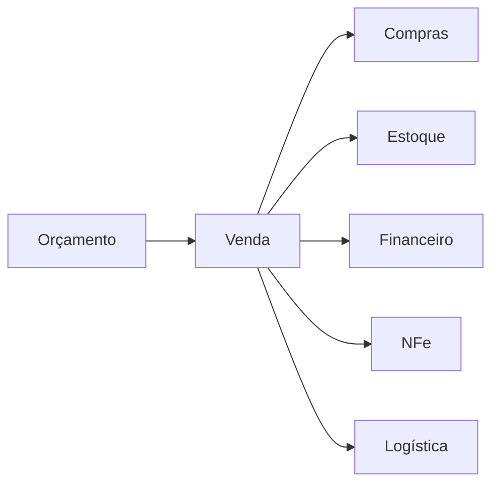
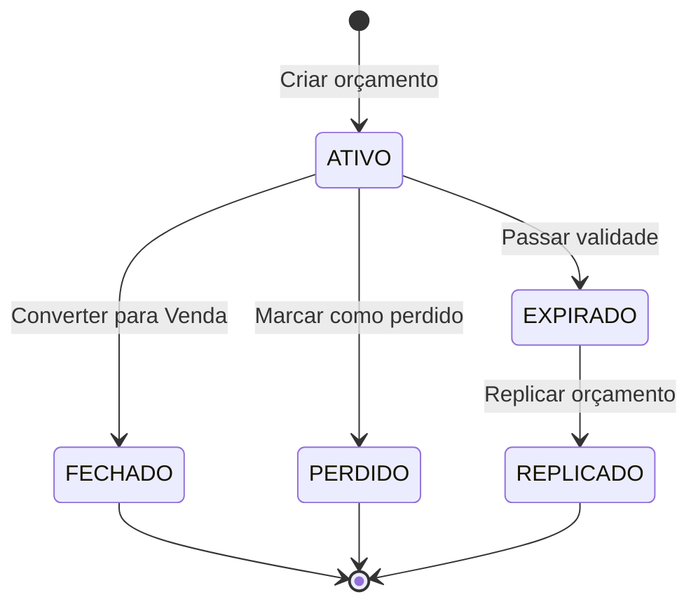
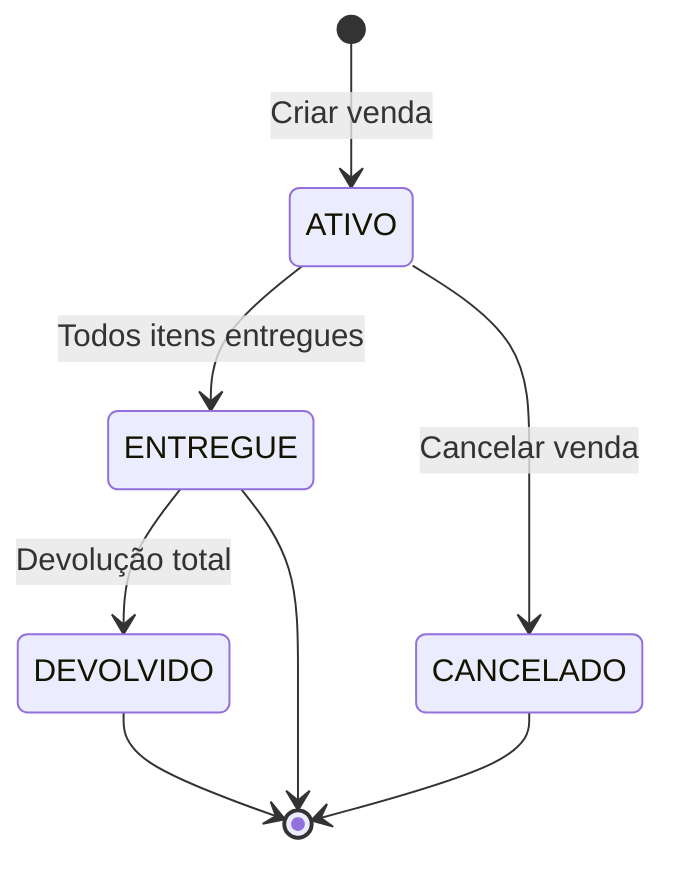
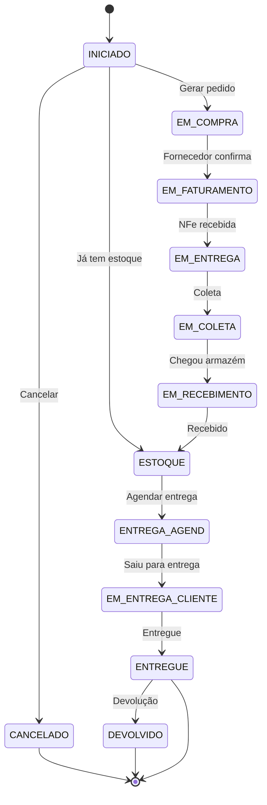

# Módulo: Vendas

> Status: **Rascunho**
> Prioridade: 1 (módulo central)
> Complexidade: **Alta**

---

## Visão Geral

O módulo de Vendas é o **coração do ERP** - todos os outros módulos existem para suportá-lo. O fluxo principal é:



---

## Implementação Atual (C++)

### Classes

| Classe                | Arquivo                   | Finalidade                       |
| --------------------- | ------------------------- | -------------------------------- |
| `Orcamento`           | `orcamento.cpp`           | Diálogo de criação de orçamento  |
| `Venda`               | `venda.cpp`               | Diálogo de venda                 |
| `WidgetOrcamento`     | `widgetorcamento.cpp`     | Widget de listagem de orçamentos |
| `WidgetVenda`         | `widgetvenda.cpp`         | Widget de listagem de vendas     |
| `BaixaOrcamento`      | `baixaorcamento.cpp`      | Fechamento/baixa de orçamento    |
| `OrcamentoProxyModel` | `orcamentoproxymodel.cpp` | Filtros de orçamento             |
| `VendaProxyModel`     | `vendaproxymodel.cpp`     | Filtros de venda                 |

### Tabelas do Banco de Dados

#### Nível 1 (Cabeçalho + Itens do Pedido)

```text
orcamento                    venda
├── idOrcamento              ├── idVenda
├── idCliente                ├── idCliente
├── idEnderecoEntrega        ├── idEnderecoEntrega
├── idEnderecoFaturamento    ├── idEnderecoFaturamento
├── idUsuario (vendedor)     ├── idUsuario
├── idProfissional           ├── idProfissional
├── status                   ├── status
├── subTotalBru              ├── subTotalBru
├── subTotalLiq              ├── subTotalLiq
├── frete                    ├── frete
├── descontoPorc             ├── descontoPorc
├── descontoReais            ├── descontoReais
├── total                    ├── total
├── prazoEntrega             ├── prazoEntrega
├── validade                 ├── idOrcamento (FK)
└── semaforo                 └── statusFinanceiro

orcamento_has_produto        venda_has_produto (N1)
├── idOrcamentoProduto       ├── idVendaProduto
├── idOrcamento (FK)         ├── idVenda (FK)
├── idProduto (FK)           ├── idProduto (FK)
├── fornecedor (VARCHAR!)    ├── fornecedor (VARCHAR!)
├── quant                    ├── quant
├── prcUnitario              ├── prcUnitario
├── desconto                 ├── desconto
├── descGlobal               └── descGlobal
└── total
```

#### Nível 2 (Atendimento/Entrega)

```text
venda_has_produto2 (N2) - O "burro de carga" do sistema
├── idVendaProduto2
├── idVendaProduto (FK para N1)
├── idVenda (FK)
├── idProduto (FK)
├── idCompra                    ← Link para pedido de compra
├── idNFeSaida                  ← NFe para cliente
├── idNFeEntrada                ← NFe do fornecedor
├── idNFeFutura                 ← NFe de entrega futura
├── status                      ← Status do fluxo de trabalho
├── quant                       ← Pode ser PARCIAL do N1
├── lote                        ← Número do lote do estoque
├── dataPrevCompra / dataRealCompra
├── dataPrevConf / dataRealConf
├── dataPrevFat / dataRealFat
├── dataPrevColeta / dataRealColeta
├── dataPrevReceb / dataRealReceb
└── dataPrevEnt / dataRealEnt
```

### Fluxo de Estados

#### Orçamento



#### Venda (Cabeçalho)



#### Item da Venda (venda_has_produto2)



### Regras de Precificação

O sistema suporta **3 níveis de desconto**:

```text
┌─────────────────────────────────────────────────────────────┐
│                    CÁLCULO DE PREÇO                         │
├─────────────────────────────────────────────────────────────┤
│                                                             │
│  1. PREÇO UNITÁRIO (prcUnitario)                           │
│     └── Preço base do produto                              │
│                                                             │
│  2. DESCONTO POR ITEM (desconto %)                         │
│     └── Aplicado sobre preço unitário                      │
│     └── parcial = quant × prcUnitario × (1 - desconto)     │
│                                                             │
│  3. DESCONTO GLOBAL (descontoPorc % ou descontoReais)      │
│     └── Aplicado proporcionalmente sobre todos itens       │
│     └── total = subTotalLiq × (1 - descontoGlobal) + frete │
│                                                             │
│  CÁLCULO FINAL:                                             │
│  subTotalBru = Σ(quant × prcUnitario)                      │
│  subTotalLiq = Σ(parcial após desconto item)               │
│  total = subTotalLiq - descontoGlobal + frete              │
│                                                             │
└─────────────────────────────────────────────────────────────┘
```

### Funcionalidades Especiais

#### Semáforo de Orçamento

```text
🔴 FRIO    - Baixa probabilidade de fechamento
🟡 MORNO   - Média probabilidade
🟢 QUENTE  - Alta probabilidade de fechamento
```

#### Representação

Flag `representacao` indica venda via representante (comissão diferenciada).

#### RT (Comissão)

Flag `checkBoxRT` indica se venda gera comissão para profissional indicador.

---

## Implementação Laravel

### Models

```php
// app/Models/Orcamento.php
class Orcamento extends Model
{
    protected $fillable = [
        'loja_id', 'cliente_id', 'vendedor_id', 'profissional_id',
        'endereco_entrega_id', 'endereco_faturamento_id',
        'status', 'semaforo', 'validade',
        'subtotal_bruto', 'subtotal_liquido',
        'desconto_percentual', 'desconto_reais',
        'frete', 'frete_manual', 'total',
        'prazo_entrega', 'representacao', 'observacoes',
    ];

    protected $casts = [
        'status' => OrcamentoStatus::class,
        'semaforo' => SemaforoOrcamento::class,
        'validade' => 'date',
        'representacao' => 'boolean',
        'frete_manual' => 'boolean',
    ];

    public function cliente(): BelongsTo
    {
        return $this->belongsTo(Cliente::class);
    }

    public function vendedor(): BelongsTo
    {
        return $this->belongsTo(Usuario::class, 'vendedor_id');
    }

    public function profissional(): BelongsTo
    {
        return $this->belongsTo(Profissional::class);
    }

    public function enderecoEntrega(): BelongsTo
    {
        return $this->belongsTo(ClienteEndereco::class, 'endereco_entrega_id');
    }

    public function itens(): HasMany
    {
        return $this->hasMany(OrcamentoItem::class);
    }

    public function venda(): HasOne
    {
        return $this->hasOne(Venda::class);
    }

    public function replicadoDe(): BelongsTo
    {
        return $this->belongsTo(Orcamento::class, 'replicado_de_id');
    }
}

// app/Models/Venda.php
class Venda extends Model
{
    protected $fillable = [
        'loja_id', 'orcamento_id', 'cliente_id', 'vendedor_id', 'profissional_id',
        'endereco_entrega_id', 'endereco_faturamento_id',
        'status', 'status_financeiro',
        'subtotal_bruto', 'subtotal_liquido',
        'desconto_percentual', 'desconto_reais',
        'frete', 'frete_manual', 'total',
        'prazo_entrega', 'representacao', 'rt', 'observacoes',
    ];

    protected $casts = [
        'status' => VendaStatus::class,
        'status_financeiro' => VendaStatusFinanceiro::class,
        'representacao' => 'boolean',
        'rt' => 'boolean',
        'frete_manual' => 'boolean',
    ];

    public function orcamento(): BelongsTo
    {
        return $this->belongsTo(Orcamento::class);
    }

    public function cliente(): BelongsTo
    {
        return $this->belongsTo(Cliente::class);
    }

    public function itens(): HasMany
    {
        return $this->hasMany(VendaItem::class);
    }

    public function itensAtendimento(): HasMany
    {
        return $this->hasMany(VendaItemAtendimento::class);
    }

    public function contasReceber(): HasMany
    {
        return $this->hasMany(ContaReceber::class);
    }

    public function compras(): HasManyThrough
    {
        return $this->hasManyThrough(
            Compra::class,
            VendaItemAtendimento::class,
            'venda_id',
            'id',
            'id',
            'compra_id'
        );
    }
}

// app/Models/VendaItem.php (Nível 1)
class VendaItem extends Model
{
    protected $table = 'venda_itens';

    protected $fillable = [
        'venda_id', 'produto_id', 'fornecedor_id',
        'quantidade', 'preco_unitario', 'desconto_percentual',
        'desconto_global_percentual', 'subtotal', 'total',
        'descricao_produto', 'unidade', 'codigo_comercial',
    ];

    public function venda(): BelongsTo
    {
        return $this->belongsTo(Venda::class);
    }

    public function produto(): BelongsTo
    {
        return $this->belongsTo(Produto::class);
    }

    public function fornecedor(): BelongsTo
    {
        return $this->belongsTo(Fornecedor::class);
    }

    public function atendimentos(): HasMany
    {
        return $this->hasMany(VendaItemAtendimento::class);
    }
}

// app/Models/VendaItemAtendimento.php (Nível 2)
class VendaItemAtendimento extends Model
{
    protected $table = 'venda_item_atendimentos';

    protected $fillable = [
        'venda_id', 'venda_item_id', 'produto_id', 'compra_id',
        'nfe_saida_id', 'nfe_entrada_id', 'nfe_futura_id',
        'status', 'quantidade', 'lote',
        'data_prev_compra', 'data_real_compra',
        'data_prev_confirmacao', 'data_real_confirmacao',
        'data_prev_faturamento', 'data_real_faturamento',
        'data_prev_coleta', 'data_real_coleta',
        'data_prev_recebimento', 'data_real_recebimento',
        'data_prev_entrega', 'data_real_entrega',
    ];

    protected $casts = [
        'status' => VendaItemStatus::class,
        'data_prev_compra' => 'date',
        'data_real_compra' => 'date',
        // ... outras datas
    ];

    public function venda(): BelongsTo
    {
        return $this->belongsTo(Venda::class);
    }

    public function vendaItem(): BelongsTo
    {
        return $this->belongsTo(VendaItem::class);
    }

    public function compra(): BelongsTo
    {
        return $this->belongsTo(Compra::class);
    }

    public function nfeSaida(): BelongsTo
    {
        return $this->belongsTo(Nfe::class, 'nfe_saida_id');
    }

    public function consumos(): HasMany
    {
        return $this->hasMany(EstoqueConsumo::class);
    }
}
```

### Enums

```php
// app/Enums/OrcamentoStatus.php
enum OrcamentoStatus: string
{
    case ATIVO = 'ATIVO';
    case FECHADO = 'FECHADO';
    case EXPIRADO = 'EXPIRADO';
    case PERDIDO = 'PERDIDO';
    case REPLICADO = 'REPLICADO';

    public function label(): string
    {
        return match($this) {
            self::ATIVO => 'Ativo',
            self::FECHADO => 'Fechado',
            self::EXPIRADO => 'Expirado',
            self::PERDIDO => 'Perdido',
            self::REPLICADO => 'Replicado',
        };
    }

    public function color(): string
    {
        return match($this) {
            self::ATIVO => 'green',
            self::FECHADO => 'blue',
            self::EXPIRADO => 'gray',
            self::PERDIDO => 'red',
            self::REPLICADO => 'purple',
        };
    }

    public function canConvertToSale(): bool
    {
        return $this === self::ATIVO;
    }
}

// app/Enums/VendaItemStatus.php
enum VendaItemStatus: string
{
    case INICIADO = 'INICIADO';
    case PENDENTE = 'PENDENTE';
    case EM_COMPRA = 'EM COMPRA';
    case EM_FATURAMENTO = 'EM FATURAMENTO';
    case EM_ENTREGA = 'EM ENTREGA';
    case EM_COLETA = 'EM COLETA';
    case EM_RECEBIMENTO = 'EM RECEBIMENTO';
    case ESTOQUE = 'ESTOQUE';
    case ENTREGA_AGENDADA = 'ENTREGA AGEND.';
    case ENTREGUE = 'ENTREGUE';
    case CANCELADO = 'CANCELADO';
    case DEVOLVIDO = 'DEVOLVIDO';

    public function canTransitionTo(self $new): bool
    {
        return match($this) {
            self::INICIADO => in_array($new, [
                self::EM_COMPRA, self::ESTOQUE, self::CANCELADO
            ]),
            self::EM_COMPRA => in_array($new, [
                self::EM_FATURAMENTO, self::CANCELADO
            ]),
            self::EM_FATURAMENTO => in_array($new, [
                self::EM_ENTREGA, self::CANCELADO
            ]),
            self::EM_ENTREGA => in_array($new, [
                self::EM_COLETA, self::EM_RECEBIMENTO, self::CANCELADO
            ]),
            self::EM_COLETA => in_array($new, [
                self::EM_RECEBIMENTO
            ]),
            self::EM_RECEBIMENTO => in_array($new, [
                self::ESTOQUE
            ]),
            self::ESTOQUE => in_array($new, [
                self::ENTREGA_AGENDADA, self::CANCELADO
            ]),
            self::ENTREGA_AGENDADA => in_array($new, [
                self::EM_ENTREGA, self::CANCELADO
            ]),
            self::ENTREGUE => in_array($new, [
                self::DEVOLVIDO
            ]),
            self::CANCELADO, self::DEVOLVIDO => false,
            default => false,
        };
    }
}

// app/Enums/SemaforoOrcamento.php
enum SemaforoOrcamento: string
{
    case FRIO = 'FRIO';
    case MORNO = 'MORNO';
    case QUENTE = 'QUENTE';

    public function emoji(): string
    {
        return match($this) {
            self::FRIO => '🔴',
            self::MORNO => '🟡',
            self::QUENTE => '🟢',
        };
    }
}
```

### Services

```php
// app/Services/Vendas/OrcamentoService.php
class OrcamentoService
{
    public function __construct(
        private FreteService $freteService,
    ) {}

    /**
     * Criar novo orçamento
     */
    public function criar(array $dados): Orcamento
    {
        return DB::transaction(function () use ($dados) {
            $orcamento = Orcamento::create([
                'loja_id' => $dados['loja_id'],
                'cliente_id' => $dados['cliente_id'],
                'vendedor_id' => $dados['vendedor_id'] ?? auth()->id(),
                'profissional_id' => $dados['profissional_id'] ?? null,
                'endereco_entrega_id' => $dados['endereco_entrega_id'],
                'status' => OrcamentoStatus::ATIVO,
                'semaforo' => SemaforoOrcamento::MORNO,
                'validade' => now()->addDays(30),
            ]);

            foreach ($dados['itens'] as $item) {
                $this->adicionarItem($orcamento, $item);
            }

            $this->recalcularTotais($orcamento);

            return $orcamento;
        });
    }

    /**
     * Adicionar item ao orçamento
     */
    public function adicionarItem(Orcamento $orcamento, array $item): OrcamentoItem
    {
        $produto = Produto::findOrFail($item['produto_id']);

        return $orcamento->itens()->create([
            'produto_id' => $produto->id,
            'fornecedor_id' => $item['fornecedor_id'] ?? $produto->fornecedor_padrao_id,
            'quantidade' => $item['quantidade'],
            'preco_unitario' => $item['preco_unitario'] ?? $produto->preco_venda,
            'desconto_percentual' => $item['desconto'] ?? 0,
            'descricao_produto' => $produto->descricao,
            'unidade' => $produto->unidade,
            'codigo_comercial' => $produto->codigo_comercial,
        ]);
    }

    /**
     * Recalcular totais do orçamento
     */
    public function recalcularTotais(Orcamento $orcamento): void
    {
        $subtotalBruto = $orcamento->itens->sum(fn($item) =>
            $item->quantidade * $item->preco_unitario
        );

        $subtotalLiquido = $orcamento->itens->sum(fn($item) =>
            $item->quantidade * $item->preco_unitario * (1 - $item->desconto_percentual / 100)
        );

        // Calcular frete automaticamente se não for manual
        $frete = $orcamento->frete_manual
            ? $orcamento->frete
            : $this->freteService->calcular($orcamento);

        $descontoGlobal = $orcamento->desconto_percentual > 0
            ? $subtotalLiquido * $orcamento->desconto_percentual / 100
            : $orcamento->desconto_reais;

        $total = $subtotalLiquido - $descontoGlobal + $frete;

        $orcamento->update([
            'subtotal_bruto' => $subtotalBruto,
            'subtotal_liquido' => $subtotalLiquido,
            'frete' => $frete,
            'total' => $total,
        ]);
    }

    /**
     * Replicar orçamento expirado
     */
    public function replicar(Orcamento $orcamento): Orcamento
    {
        return DB::transaction(function () use ($orcamento) {
            $novo = $orcamento->replicate([
                'status', 'created_at', 'updated_at'
            ]);
            $novo->status = OrcamentoStatus::ATIVO;
            $novo->validade = now()->addDays(30);
            $novo->replicado_de_id = $orcamento->id;
            $novo->save();

            foreach ($orcamento->itens as $item) {
                $novoItem = $item->replicate();
                $novoItem->orcamento_id = $novo->id;
                $novoItem->save();
            }

            $orcamento->update(['status' => OrcamentoStatus::REPLICADO]);

            return $novo;
        });
    }
}

// app/Services/Vendas/VendaService.php
class VendaService
{
    public function __construct(
        private EstoqueService $estoqueService,
        private ContaReceberService $contaReceberService,
    ) {}

    /**
     * Converter orçamento em venda
     */
    public function criarDeOrcamento(Orcamento $orcamento): Venda
    {
        $this->validarConversao($orcamento);

        return DB::transaction(function () use ($orcamento) {
            // Criar cabeçalho da venda
            $venda = Venda::create([
                'loja_id' => $orcamento->loja_id,
                'orcamento_id' => $orcamento->id,
                'cliente_id' => $orcamento->cliente_id,
                'vendedor_id' => $orcamento->vendedor_id,
                'profissional_id' => $orcamento->profissional_id,
                'endereco_entrega_id' => $orcamento->endereco_entrega_id,
                'endereco_faturamento_id' => $orcamento->endereco_faturamento_id,
                'status' => VendaStatus::ATIVO,
                'status_financeiro' => VendaStatusFinanceiro::PENDENTE,
                'subtotal_bruto' => $orcamento->subtotal_bruto,
                'subtotal_liquido' => $orcamento->subtotal_liquido,
                'desconto_percentual' => $orcamento->desconto_percentual,
                'desconto_reais' => $orcamento->desconto_reais,
                'frete' => $orcamento->frete,
                'total' => $orcamento->total,
                'prazo_entrega' => $orcamento->prazo_entrega,
                'representacao' => $orcamento->representacao,
            ]);

            // Copiar itens (N1)
            foreach ($orcamento->itens as $orcItem) {
                $vendaItem = $venda->itens()->create([
                    'produto_id' => $orcItem->produto_id,
                    'fornecedor_id' => $orcItem->fornecedor_id,
                    'quantidade' => $orcItem->quantidade,
                    'preco_unitario' => $orcItem->preco_unitario,
                    'desconto_percentual' => $orcItem->desconto_percentual,
                    'desconto_global_percentual' => $orcamento->desconto_percentual,
                    'subtotal' => $orcItem->subtotal,
                    'total' => $orcItem->total,
                    'descricao_produto' => $orcItem->descricao_produto,
                    'unidade' => $orcItem->unidade,
                ]);

                // Criar item de atendimento (N2)
                $this->criarItemAtendimento($venda, $vendaItem);
            }

            // Fechar orçamento
            $orcamento->update(['status' => OrcamentoStatus::FECHADO]);

            event(new VendaCriada($venda));

            return $venda;
        });
    }

    /**
     * Criar item de atendimento (N2) - pode ser único ou dividido
     */
    private function criarItemAtendimento(Venda $venda, VendaItem $vendaItem): void
    {
        // Verificar se há estoque disponível
        $estoqueDisponivel = $this->estoqueService->verificarDisponibilidade(
            $vendaItem->produto_id,
            $vendaItem->fornecedor_id,
            $vendaItem->quantidade
        );

        $status = $estoqueDisponivel >= $vendaItem->quantidade
            ? VendaItemStatus::ESTOQUE
            : VendaItemStatus::INICIADO;

        $venda->itensAtendimento()->create([
            'venda_item_id' => $vendaItem->id,
            'produto_id' => $vendaItem->produto_id,
            'status' => $status,
            'quantidade' => $vendaItem->quantidade,
        ]);
    }

    /**
     * Cancelar venda
     */
    public function cancelar(Venda $venda, string $motivo): void
    {
        DB::transaction(function () use ($venda, $motivo) {
            // Cancelar todos os itens de atendimento
            foreach ($venda->itensAtendimento as $item) {
                $this->cancelarItemAtendimento($item);
            }

            // Cancelar contas a receber
            $venda->contasReceber()->update([
                'status' => ContaReceberStatus::CANCELADO,
            ]);

            // Atualizar venda
            $venda->update([
                'status' => VendaStatus::CANCELADO,
                'motivo_cancelamento' => $motivo,
            ]);

            // Reativar orçamento
            if ($venda->orcamento) {
                $venda->orcamento->update([
                    'status' => OrcamentoStatus::ATIVO,
                ]);
            }

            event(new VendaCancelada($venda));
        });
    }

    /**
     * Cancelar item de atendimento específico
     */
    private function cancelarItemAtendimento(VendaItemAtendimento $item): void
    {
        // Desfazer consumo de estoque
        $this->estoqueService->desfazerConsumo($item);

        // Desvincular de compra
        if ($item->compra_id) {
            $item->compraItem?->update([
                'venda_id' => null,
                'venda_item_atendimento_id' => null,
            ]);
        }

        $item->update([
            'status' => VendaItemStatus::CANCELADO,
            'compra_id' => null,
            'lote' => null,
        ]);
    }

    private function validarConversao(Orcamento $orcamento): void
    {
        if (!$orcamento->status->canConvertToSale()) {
            throw new BusinessException(
                "Orçamento com status {$orcamento->status->label()} não pode ser convertido"
            );
        }

        if (!$orcamento->endereco_entrega_id) {
            throw new BusinessException('Endereço de entrega é obrigatório');
        }

        if ($orcamento->itens->isEmpty()) {
            throw new BusinessException('Orçamento não possui itens');
        }
    }
}
```

### Controllers

```php
// app/Http/Controllers/OrcamentoController.php
class OrcamentoController extends Controller
{
    public function __construct(
        private OrcamentoService $orcamentoService
    ) {}

    public function index(Request $request)
    {
        $orcamentos = Orcamento::query()
            ->with(['cliente:id,razao_social', 'vendedor:id,nome'])
            ->when($request->status, fn($q) => $q->where('status', $request->status))
            ->when($request->semaforo, fn($q) => $q->where('semaforo', $request->semaforo))
            ->when($request->vendedor_id, fn($q) => $q->where('vendedor_id', $request->vendedor_id))
            ->when($request->search, fn($q) => $q->whereHas('cliente', fn($q) =>
                $q->where('razao_social', 'like', "%{$request->search}%")
            ))
            ->latest()
            ->paginate(20);

        return Inertia::render('Orcamentos/Index', [
            'orcamentos' => $orcamentos,
            'filters' => $request->only(['status', 'semaforo', 'vendedor_id', 'search']),
        ]);
    }

    public function store(CriarOrcamentoRequest $request)
    {
        $orcamento = $this->orcamentoService->criar($request->validated());

        return redirect()->route('orcamentos.show', $orcamento)
            ->with('success', 'Orçamento criado com sucesso');
    }

    public function gerarVenda(Orcamento $orcamento, VendaService $vendaService)
    {
        $venda = $vendaService->criarDeOrcamento($orcamento);

        return redirect()->route('vendas.show', $venda)
            ->with('success', 'Venda gerada com sucesso');
    }

    public function replicar(Orcamento $orcamento)
    {
        $novo = $this->orcamentoService->replicar($orcamento);

        return redirect()->route('orcamentos.show', $novo)
            ->with('success', 'Orçamento replicado com sucesso');
    }
}

// app/Http/Controllers/VendaController.php
class VendaController extends Controller
{
    public function __construct(
        private VendaService $vendaService
    ) {}

    public function index(Request $request)
    {
        $vendas = Venda::query()
            ->with(['cliente:id,razao_social', 'vendedor:id,nome'])
            ->when($request->status, fn($q) => $q->where('status', $request->status))
            ->when($request->cliente_id, fn($q) => $q->where('cliente_id', $request->cliente_id))
            ->when($request->periodo, function($q) use ($request) {
                [$inicio, $fim] = explode(',', $request->periodo);
                $q->whereBetween('created_at', [$inicio, $fim]);
            })
            ->latest()
            ->paginate(20);

        return Inertia::render('Vendas/Index', [
            'vendas' => $vendas,
            'filters' => $request->only(['status', 'cliente_id', 'periodo']),
        ]);
    }

    public function show(Venda $venda)
    {
        $venda->load([
            'cliente',
            'vendedor',
            'profissional',
            'enderecoEntrega',
            'itens.produto',
            'itensAtendimento.compra',
            'contasReceber',
        ]);

        return Inertia::render('Vendas/Show', [
            'venda' => $venda,
        ]);
    }

    public function cancelar(Venda $venda, CancelarVendaRequest $request)
    {
        $this->vendaService->cancelar($venda, $request->motivo);

        return back()->with('success', 'Venda cancelada com sucesso');
    }
}
```

### Rotas

```php
// routes/web.php
Route::middleware(['auth'])->group(function () {
    // Orçamentos
    Route::resource('orcamentos', OrcamentoController::class);
    Route::post('orcamentos/{orcamento}/gerar-venda', [OrcamentoController::class, 'gerarVenda'])
        ->name('orcamentos.gerar-venda');
    Route::post('orcamentos/{orcamento}/replicar', [OrcamentoController::class, 'replicar'])
        ->name('orcamentos.replicar');
    Route::post('orcamentos/{orcamento}/marcar-perdido', [OrcamentoController::class, 'marcarPerdido'])
        ->name('orcamentos.marcar-perdido');

    // Vendas
    Route::resource('vendas', VendaController::class);
    Route::post('vendas/{venda}/cancelar', [VendaController::class, 'cancelar'])
        ->name('vendas.cancelar');
    Route::get('vendas/{venda}/pdf', [VendaController::class, 'gerarPdf'])
        ->name('vendas.pdf');
    Route::get('vendas/{venda}/excel', [VendaController::class, 'gerarExcel'])
        ->name('vendas.excel');
});
```

---

## Componentes de UI

### Lista de Orçamentos

- Filtros: Status, Semáforo, Vendedor, Período, Busca
- Colunas: ID, Cliente, Vendedor, Total, Validade, Semáforo, Status
- Ações: Visualizar, Editar, Gerar Venda, Replicar, PDF

### Lista de Vendas

- Filtros: Status, Status Financeiro, Cliente, Vendedor, Período
- Colunas: ID, Cliente, Vendedor, Total, Status, Status Financeiro
- Ações: Visualizar, PDF, Excel, Cancelar

### Formulário de Orçamento

- Seleção de cliente (com cadastro rápido)
- Seleção de endereço de entrega
- Seleção de profissional (opcional)
- Tabela de itens com:
  - Busca de produto
  - Quantidade, preço, desconto por item
  - Subtotal automático
- Frete (automático ou manual)
- Desconto global (% ou R$)
- Total calculado
- Observações

### Visualização de Venda

- Cabeçalho com dados do cliente e endereços
- Timeline de status
- Tabela de itens com status individual
- Aba de pagamentos (formas de pagamento)
- Aba de documentos (NFes vinculadas)
- Botões de ação baseados no status

---

## Eventos

| Evento              | Dispara                                               |
| ------------------- | ----------------------------------------------------- |
| `OrcamentoCriado`   | Notificar vendedor, log de auditoria                  |
| `VendaCriada`       | Gerar contas a receber, notificar logística           |
| `VendaCancelada`    | Reverter financeiro, reativar orçamento, notificar    |
| `VendaEntregue`     | Atualizar status, disparar faturamento se automático  |
| `ItemStatusChanged` | Atualizar status da venda pai, notificar interessados |

---

## Considerações de Migração

### Migração de Dados

1. **Orçamentos**: `orcamento` → `orcamentos` (direto)
2. **Orçamento Itens**: `orcamento_has_produto` → `orcamento_itens` (normalizar fornecedor)
3. **Vendas**: `venda` → `vendas` (direto)
4. **Venda Itens N1**: `venda_has_produto` → `venda_itens` (normalizar fornecedor)
5. **Venda Itens N2**: `venda_has_produto2` → `venda_item_atendimentos`

### Mudanças Incompatíveis

- `fornecedor` VARCHAR → `fornecedor_id` FK (normalização obrigatória)
- Status como strings → Status como Enum
- Dois níveis mantidos mas com nomenclatura clara (VendaItem vs VendaItemAtendimento)

### Scripts de Migração

```sql
-- Normalizar fornecedor em venda_has_produto
UPDATE venda_has_produto vhp
SET fornecedor_id = (
    SELECT id FROM fornecedores WHERE razao_social = vhp.fornecedor LIMIT 1
)
WHERE fornecedor_id IS NULL AND fornecedor IS NOT NULL;

-- Verificar itens sem fornecedor válido
SELECT COUNT(*) FROM venda_has_produto
WHERE fornecedor IS NOT NULL AND fornecedor_id IS NULL;
```
