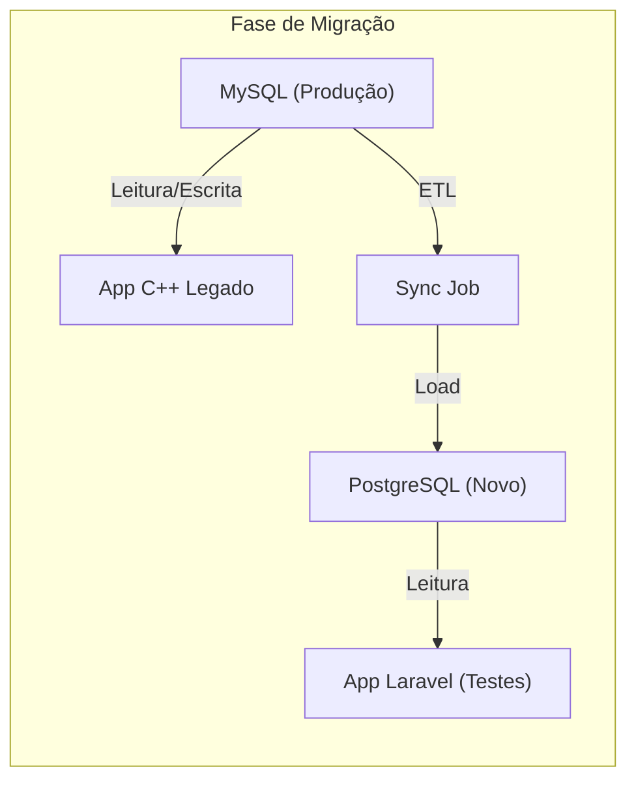

# Scripts e Estratégia de Migração de Dados

> Status: **Rascunho**
> Última atualização: 2025-12-28
> Banco Origem: MySQL 8.0
> Banco Destino: PostgreSQL 16

---

## Visão Geral

Este documento detalha o processo de migração de dados do MySQL legado para o PostgreSQL novo, incluindo transformações, validações e rollback.

### Princípios

1. **Migração em fases** - Tabelas migradas por ordem de dependência
2. **Validação contínua** - Contagens e checksums antes/depois
3. **Rollback possível** - Manter legado até validação completa
4. **Zero perda de dados** - 100% dos registros migrados

---

## 1. Mapeamento de Tabelas

### 1.1 Dados Mestres (Fase 1)

| Tabela MySQL                 | Tabela PostgreSQL      | Transformação             |
| ---------------------------- | ---------------------- | ------------------------- |
| `loja`                       | `lojas`                | Renomear colunas          |
| `usuario`                    | `usuarios`             | Hash de senha, permissões |
| `usuario_has_permissao`      | `permissions` (Spatie) | Converter flags → roles   |
| `fornecedor`                 | `fornecedores`         | Renomear colunas          |
| `fornecedor_has_endereco`    | `fornecedor_enderecos` | Renomear colunas          |
| `cliente`                    | `clientes`             | Renomear colunas          |
| `cliente_has_endereco`       | `cliente_enderecos`    | Renomear colunas          |
| `transportadora`             | `transportadoras`      | Renomear colunas          |
| `transportadora_has_veiculo` | `veiculos`             | Renomear colunas          |
| `profissional`               | `profissionais`        | Renomear colunas          |
| `ncm`                        | `ncms`                 | Direto                    |

### 1.2 Produtos (Fase 2)

| Tabela MySQL         | Tabela PostgreSQL   | Transformação    |
| -------------------- | ------------------- | ---------------- |
| `produto` (100 cols) | `produtos`          | Extrair core     |
| `produto`            | `produto_precos`    | Extrair preços   |
| `produto`            | `produto_tributos`  | Extrair impostos |
| -                    | `produto_atributos` | JSONB flexível   |

### 1.3 Transações (Fase 3)

| Tabela MySQL                                                       | Tabela PostgreSQL | Transformação         |
| ------------------------------------------------------------------ | ----------------- | --------------------- |
| `orcamento`                                                        | `orcamentos`      | Renomear colunas      |
| `orcamento_has_produto`                                            | `orcamento_itens` | Normalizar fornecedor |
| `venda`                                                            | `vendas`          | Renomear colunas      |
| `venda_has_produto` + `venda_has_produto2`                         | `venda_itens`     | **Merge L1/L2**       |
| `pedido_fornecedor`                                                | `compras`         | Renomear colunas      |
| `pedido_fornecedor_has_produto` + `pedido_fornecedor_has_produto2` | `compra_itens`    | **Merge L1/L2**       |

### 1.4 Estoque (Fase 4)

| Tabela MySQL          | Tabela PostgreSQL  | Transformação         |
| --------------------- | ------------------ | --------------------- |
| `estoque`             | `estoques`         | Normalizar fornecedor |
| `estoque_has_consumo` | `estoque_consumos` | Normalizar fornecedor |
| `bloco`               | `blocos`           | Renomear colunas      |

### 1.5 NFe (Fase 5)

| Tabela MySQL      | Tabela PostgreSQL | Transformação         |
| ----------------- | ----------------- | --------------------- |
| `nfe`             | `nfes`            | Renomear colunas      |
| `nfe_has_produto` | `nfe_itens`       | Normalizar fornecedor |

### 1.6 Financeiro (Fase 6)

| Tabela MySQL                    | Tabela PostgreSQL          | Transformação    |
| ------------------------------- | -------------------------- | ---------------- |
| `conta_a_receber`               | `contas_receber`           | Renomear colunas |
| `conta_a_receber_has_pagamento` | `conta_receber_pagamentos` | Renomear         |
| `conta_a_pagar`                 | `contas_pagar`             | Renomear colunas |
| `conta_a_pagar_has_pagamento`   | `conta_pagar_pagamentos`   | Renomear         |

### 1.7 Logística (Fase 7)

| Tabela MySQL          | Tabela PostgreSQL        | Transformação       |
| --------------------- | ------------------------ | ------------------- |
| `veiculo_has_produto` | `evento_logistica_itens` | Reestruturar        |
| -                     | `eventos_logistica`      | Criar de `idEvento` |
| -                     | `confirmacoes_entrega`   | Extrair campos      |

---

## 2. Transformações Críticas

### 2.1 Merge L1/L2 → Tabela Única

A transformação mais complexa: unificar `venda_has_produto` (L1) e `venda_has_produto2` (L2).

```sql
-- Script de migração: venda_has_produto + venda_has_produto2 → venda_itens

INSERT INTO venda_itens (
    id,
    venda_id,
    parent_id,
    root_id,
    split_reason,
    produto_id,
    fornecedor_id,
    quantidade,
    quantidade_caixas,
    unidade,
    unidades_por_caixa,
    valor_unitario,
    desconto_percentual,
    valor_com_desconto,
    desconto_global_percentual,
    valor_total,
    descricao_produto,
    codigo_comercial,
    ncm,
    status,
    data_prev_coleta,
    data_prev_recebimento,
    data_prev_entrega,
    data_real_coleta,
    data_real_recebimento,
    data_real_entrega,
    nfe_saida_id,
    entregou,
    recebeu,
    created_at
)
SELECT
    l2.idVendaProduto2 as id,
    l2.idVenda as venda_id,

    -- Hierarquia de split
    CASE
        WHEN l2.idRelacionado IS NOT NULL AND l2.idRelacionado != l2.idVendaProduto2
        THEN l2.idRelacionado
        ELSE NULL
    END as parent_id,

    -- Root: encontrar o item original na cadeia
    CASE
        WHEN l2.idRelacionado IS NULL OR l2.idRelacionado = l2.idVendaProduto2
        THEN NULL  -- É o original
        ELSE (
            -- Buscar recursivamente o root
            WITH RECURSIVE chain AS (
                SELECT idVendaProduto2, idRelacionado, 1 as depth
                FROM venda_has_produto2
                WHERE idVendaProduto2 = l2.idRelacionado

                UNION ALL

                SELECT p.idVendaProduto2, p.idRelacionado, c.depth + 1
                FROM venda_has_produto2 p
                JOIN chain c ON p.idVendaProduto2 = c.idRelacionado
                WHERE p.idRelacionado IS NOT NULL
                  AND p.idRelacionado != p.idVendaProduto2
                  AND c.depth < 10  -- Limite de profundidade
            )
            SELECT idVendaProduto2
            FROM chain
            WHERE idRelacionado IS NULL OR idRelacionado = idVendaProduto2
            ORDER BY depth DESC
            LIMIT 1
        )
    END as root_id,

    -- Razão do split (inferida do status)
    CASE
        WHEN l2.idRelacionado IS NOT NULL AND l2.idRelacionado != l2.idVendaProduto2 THEN
            CASE l2.status
                WHEN 'QUEBRADO' THEN 'BROKEN'
                WHEN 'DEVOLVIDO' THEN 'RETURN'
                WHEN 'REPO. ENTREGA' THEN 'REPLACEMENT'
                WHEN 'REPO. RECEB.' THEN 'REPLACEMENT'
                ELSE 'PARTIAL_NFE'
            END
        ELSE NULL
    END as split_reason,

    l2.idProduto as produto_id,

    -- Normalizar fornecedor: lookup por nome
    (SELECT id FROM fornecedores WHERE razao_social = l2.fornecedor LIMIT 1) as fornecedor_id,

    l2.quant as quantidade,
    l2.caixas as quantidade_caixas,
    l2.un as unidade,
    l2.quantCaixa as unidades_por_caixa,
    l2.prcUnitario as valor_unitario,
    l2.desconto as desconto_percentual,
    l2.descUnitario as valor_com_desconto,
    l2.descGlobal as desconto_global_percentual,
    l2.total as valor_total,
    l2.produto as descricao_produto,
    l2.codComercial as codigo_comercial,
    l2.ncm,

    -- Mapear status strings → enum
    CASE l2.status
        WHEN 'PENDENTE' THEN 'PENDENTE'
        WHEN 'EM COMPRA' THEN 'EM_COMPRA'
        WHEN 'EM FATURAMENTO' THEN 'FATURADO'
        WHEN 'EM COLETA' THEN 'EM_COLETA'
        WHEN 'EM RECEBIMENTO' THEN 'EM_RECEBIMENTO'
        WHEN 'ESTOQUE' THEN 'ESTOQUE'
        WHEN 'ENTREGA AGEND.' THEN 'ENTREGA_AGENDADA'
        WHEN 'EM ENTREGA' THEN 'EM_ENTREGA'
        WHEN 'ENTREGUE' THEN 'ENTREGUE'
        WHEN 'QUEBRADO' THEN 'QUEBRADO'
        WHEN 'DEVOLVIDO' THEN 'DEVOLVIDO'
        WHEN 'CANCELADO' THEN 'CANCELADO'
        WHEN 'REPO. ENTREGA' THEN 'PENDENTE'
        WHEN 'REPO. RECEB.' THEN 'PENDENTE'
        ELSE 'PENDENTE'
    END::venda_item_status as status,

    l2.dataPrevColeta as data_prev_coleta,
    l2.dataPrevReceb as data_prev_recebimento,
    l2.dataPrevEnt as data_prev_entrega,
    l2.dataRealColeta as data_real_coleta,
    l2.dataRealReceb as data_real_recebimento,
    l2.dataRealEnt as data_real_entrega,
    l2.idNFeSaida as nfe_saida_id,
    l2.entregou,
    l2.recebeu,
    l2.created as created_at

FROM venda_has_produto2 l2;
```

### 2.2 Normalização de Fornecedor

Converter `fornecedor VARCHAR` → `fornecedor_id INTEGER`.

```sql
-- Passo 1: Criar tabela de mapeamento
CREATE TEMP TABLE fornecedor_mapping AS
SELECT DISTINCT
    TRIM(e.fornecedor) as nome_legado,
    f.id as fornecedor_id
FROM estoque e
LEFT JOIN fornecedores f ON
    TRIM(UPPER(f.razao_social)) = TRIM(UPPER(e.fornecedor))
    OR TRIM(UPPER(f.nome_fantasia)) = TRIM(UPPER(e.fornecedor));

-- Verificar não encontrados
SELECT nome_legado
FROM fornecedor_mapping
WHERE fornecedor_id IS NULL;

-- Passo 2: Criar fornecedores faltantes (se necessário)
INSERT INTO fornecedores (razao_social, is_ativo, created_at)
SELECT nome_legado, true, NOW()
FROM fornecedor_mapping
WHERE fornecedor_id IS NULL;

-- Passo 3: Atualizar mapeamento
UPDATE fornecedor_mapping m
SET fornecedor_id = f.id
FROM fornecedores f
WHERE m.fornecedor_id IS NULL
  AND TRIM(UPPER(f.razao_social)) = TRIM(UPPER(m.nome_legado));

-- Passo 4: Migrar estoques com FK
INSERT INTO estoques (
    id,
    produto_id,
    fornecedor_id,  -- Agora é FK!
    quantidade_inicial,
    quantidade_disponivel,
    -- ...outros campos
)
SELECT
    e.idEstoque,
    e.idProduto,
    m.fornecedor_id,
    e.quant,
    e.quantDisponivel,
    -- ...
FROM estoque e
JOIN fornecedor_mapping m ON TRIM(e.fornecedor) = m.nome_legado;
```

### 2.3 Migração de Senhas

Converter `SHA_PASSWORD()` para bcrypt.

```php
// Estratégia: Migração lazy (no primeiro login)
// Ver tecnico/05-seguranca.md para implementação

// Durante migração inicial, apenas copiar hash legado:
INSERT INTO usuarios (id, username, password_legado, is_ativo, ...)
SELECT idUsuario, user, password, NOT desativado, ...
FROM usuario;

// No login, o LegacyPasswordService verifica e migra
```

### 2.4 Migração de Permissões

Converter flags booleanas → Spatie Permission.

```php
// database/seeders/MigrarPermissoesSeeder.php
class MigrarPermissoesSeeder extends Seeder
{
    private array $mapeamento = [
        'view_tab_orcamento' => 'view_orcamento',
        'view_tab_venda' => 'view_venda',
        'view_tab_compra' => 'view_compra',
        'view_tab_logistica' => 'view_logistica',
        'view_tab_nfe' => 'view_nfe',
        'view_tab_estoque' => 'view_estoque',
        'view_tab_galpao' => 'view_galpao',
        'view_tab_financeiro' => 'view_financeiro',
        'view_tab_relatorio' => 'view_relatorio',
        'ajusteFrete' => 'ajuste_frete',
    ];

    public function run(): void
    {
        $legado = DB::connection('mysql')
            ->table('usuario_has_permissao')
            ->get();

        foreach ($legado as $row) {
            $usuario = Usuario::find($row->idUsuario);
            if (!$usuario) continue;

            foreach ($this->mapeamento as $antiga => $nova) {
                if ($row->{$antiga}) {
                    $usuario->givePermissionTo($nova);
                }
            }
        }
    }
}
```

### 2.5 Split de Tabela `produto`

Dividir mega-tabela em tabelas normalizadas.

```sql
-- produtos (core)
INSERT INTO produtos (
    id,
    fornecedor_id,
    codigo_comercial,
    codigo_barras,
    descricao,
    formato_comercial,
    unidade,
    quantidade_caixa,
    ncm,
    tem_lote,
    is_descontinuado,
    is_ativo,
    created_at
)
SELECT
    idProduto,
    idFornecedor,
    codComercial,
    codBarras,
    descricao,
    formComercial,
    un,
    quantCaixa,
    ncm,
    temLote = 1,
    descontinuado = 1,
    desativado = 0,
    created
FROM produto;

-- produto_precos (histórico)
INSERT INTO produto_precos (
    produto_id,
    custo,
    valor_venda,
    margem,
    vigencia_inicio,
    created_at
)
SELECT
    idProduto,
    custo,
    precoVenda,
    markup,
    COALESCE(DATE(created), '2020-01-01'),
    created
FROM produto
WHERE custo > 0 OR precoVenda > 0;

-- produto_tributos
INSERT INTO produto_tributos (
    produto_id,
    cst,
    aliquota_icms,
    tem_st,
    aliquota_st,
    mva,
    origem
)
SELECT
    idProduto,
    cst,
    icms,
    st = 1,
    sticms,
    mva,
    origem
FROM produto;
```

---

## 3. Scripts de Validação

### 3.1 Contagem de Registros

```sql
-- validacao_contagens.sql
-- Executar antes e depois da migração

-- Dados Mestres
SELECT 'lojas' as tabela, COUNT(*) as qt FROM loja
UNION ALL SELECT 'usuarios', COUNT(*) FROM usuario WHERE desativado = 0
UNION ALL SELECT 'fornecedores', COUNT(*) FROM fornecedor WHERE desativado = 0
UNION ALL SELECT 'clientes', COUNT(*) FROM cliente WHERE desativado = 0
UNION ALL SELECT 'produtos', COUNT(*) FROM produto WHERE desativado = 0
UNION ALL SELECT 'transportadoras', COUNT(*) FROM transportadora WHERE desativado = 0

-- Transações
UNION ALL SELECT 'orcamentos', COUNT(*) FROM orcamento
UNION ALL SELECT 'vendas', COUNT(*) FROM venda
UNION ALL SELECT 'compras', COUNT(*) FROM pedido_fornecedor
UNION ALL SELECT 'venda_itens_l1', COUNT(*) FROM venda_has_produto
UNION ALL SELECT 'venda_itens_l2', COUNT(*) FROM venda_has_produto2

-- Estoque
UNION ALL SELECT 'estoques', COUNT(*) FROM estoque
UNION ALL SELECT 'consumos', COUNT(*) FROM estoque_has_consumo

-- NFe
UNION ALL SELECT 'nfes', COUNT(*) FROM nfe

-- Financeiro
UNION ALL SELECT 'contas_receber', COUNT(*) FROM conta_a_receber
UNION ALL SELECT 'contas_pagar', COUNT(*) FROM conta_a_pagar;
```

### 3.2 Validação de Integridade

```sql
-- validacao_integridade.sql

-- 1. Verificar FKs de fornecedor após normalização
SELECT 'estoques_sem_fornecedor' as problema, COUNT(*) as qt
FROM estoques e
WHERE e.fornecedor_id IS NULL

UNION ALL

-- 2. Verificar hierarquia de splits
SELECT 'venda_itens_root_invalido', COUNT(*)
FROM venda_itens vi
WHERE vi.root_id IS NOT NULL
  AND NOT EXISTS (SELECT 1 FROM venda_itens WHERE id = vi.root_id)

UNION ALL

-- 3. Verificar totais de vendas
SELECT 'vendas_total_divergente', COUNT(*)
FROM (
    SELECT v.id, v.total as total_cabecalho, SUM(vi.total) as total_itens
    FROM vendas v
    JOIN venda_itens vi ON vi.venda_id = v.id
    GROUP BY v.id, v.total
    HAVING ABS(v.total - SUM(vi.total)) > 0.01
) x

UNION ALL

-- 4. Verificar estoque negativo
SELECT 'estoque_negativo', COUNT(*)
FROM estoques
WHERE quantidade_disponivel < 0

UNION ALL

-- 5. Verificar usuários sem permissões
SELECT 'usuarios_sem_permissoes', COUNT(*)
FROM usuarios u
WHERE NOT EXISTS (
    SELECT 1 FROM model_has_permissions mhp
    WHERE mhp.model_id = u.id
);
```

### 3.3 Validação de Somas

```sql
-- validacao_somas.sql

-- Comparar somas financeiras
SELECT
    'recebiveis_origem' as fonte,
    SUM(valor) as total
FROM conta_a_receber
WHERE status != 'CANCELADO'

UNION ALL

SELECT
    'recebiveis_destino',
    SUM(valor)
FROM contas_receber
WHERE status != 'CANCELADO';

-- Comparar quantidades de estoque
SELECT
    'estoque_origem',
    SUM(quantDisponivel)
FROM estoque
WHERE quantDisponivel > 0

UNION ALL

SELECT
    'estoque_destino',
    SUM(quantidade_disponivel)
FROM estoques
WHERE quantidade_disponivel > 0;
```

---

## 4. Ordem de Migração

### Fase 0: Preparação

```bash
# 1. Backup completo do MySQL
mysqldump -u root -p staccato > backup_pre_migracao.sql

# 2. Criar banco PostgreSQL
createdb staccato_novo

# 3. Executar migrations Laravel
php artisan migrate

# 4. Criar ENUMs e funções
psql staccato_novo < sql/enums.sql
psql staccato_novo < sql/functions.sql
```

### Fase 1: Dados Mestres (sem dependências)

```text
1. lojas
2. fornecedores + endereços
3. clientes + endereços
4. transportadoras + veículos
5. profissionais
6. ncms
7. usuarios (sem senha migrada)
8. permissões (Spatie)
```

### Fase 2: Produtos

```text
1. produtos (core)
2. produto_precos
3. produto_tributos
4. produto_atributos
```

### Fase 3: Orçamentos e Vendas

```text
1. orcamentos
2. orcamento_itens
3. vendas
4. venda_itens (merge L1/L2) ← CRÍTICO
```

### Fase 4: Compras

```text
1. compras
2. compra_itens (merge L1/L2)
```

### Fase 5: NFe

```text
1. nfes
2. nfe_itens
```

### Fase 6: Estoque

```text
1. blocos
2. estoques (com fornecedor_id)
3. estoque_consumos (com fornecedor_id)
```

### Fase 7: Financeiro

```text
1. contas_receber
2. conta_receber_pagamentos
3. contas_pagar
4. conta_pagar_pagamentos
```

### Fase 8: Logística

```text
1. eventos_logistica (criados de idEvento)
2. evento_logistica_itens
3. confirmacoes_entrega
```

---

## 5. Rollback

### 5.1 Estratégia

Durante a migração, o sistema legado permanece **operacional**:



### 5.2 Procedimento de Rollback

Se problemas críticos forem encontrados:

```bash
# 1. Parar aplicação Laravel
sudo systemctl stop staccato-laravel

# 2. Descartar banco PostgreSQL
dropdb staccato_novo

# 3. Sistema legado continua funcionando normalmente
# (nunca foi desligado)
```

### 5.3 Ponto de Não-Retorno

O rollback não é mais possível após:

1. **Desligar escritas no MySQL** (semana de cutover)
2. **Migrar dados finais** (delta desde última sync)
3. **Trocar DNS/Load Balancer** para novo sistema

---

## 6. Comandos Artisan

```php
// app/Console/Commands/MigrarDadosCommand.php
class MigrarDadosCommand extends Command
{
    protected $signature = 'migracao:executar
                            {fase : Fase a executar (1-8)}
                            {--dry-run : Apenas simular}
                            {--validar : Executar validações após}';

    public function handle()
    {
        $fase = $this->argument('fase');
        $dryRun = $this->option('dry-run');

        $this->info("Executando Fase {$fase}" . ($dryRun ? ' (DRY RUN)' : ''));

        DB::beginTransaction();

        try {
            match ((int) $fase) {
                1 => $this->migrarDadosMestres(),
                2 => $this->migrarProdutos(),
                3 => $this->migrarOrcamentosVendas(),
                4 => $this->migrarCompras(),
                5 => $this->migrarNfe(),
                6 => $this->migrarEstoque(),
                7 => $this->migrarFinanceiro(),
                8 => $this->migrarLogistica(),
            };

            if ($this->option('validar')) {
                $this->validar($fase);
            }

            if ($dryRun) {
                DB::rollBack();
                $this->warn('Rollback executado (dry-run)');
            } else {
                DB::commit();
                $this->info('Fase concluída com sucesso!');
            }

        } catch (\Exception $e) {
            DB::rollBack();
            $this->error("Erro: " . $e->getMessage());
            return 1;
        }

        return 0;
    }
}
```

---

## 7. Checklist de Migração

### Pré-Migração

- [ ] Backup completo do MySQL
- [ ] PostgreSQL instalado e configurado
- [ ] Migrations Laravel executadas
- [ ] ENUMs e funções criados
- [ ] Conexão dupla configurada (mysql + pgsql)

### Por Fase

- [ ] Fase 1: Dados mestres migrados e validados
- [ ] Fase 2: Produtos migrados e validados
- [ ] Fase 3: Orçamentos/Vendas migrados (merge L1/L2 validado)
- [ ] Fase 4: Compras migradas
- [ ] Fase 5: NFe migrada
- [ ] Fase 6: Estoque migrado (fornecedor normalizado)
- [ ] Fase 7: Financeiro migrado (somas conferem)
- [ ] Fase 8: Logística migrada

### Pós-Migração

- [ ] Todas as contagens conferem
- [ ] Somas financeiras conferem
- [ ] Hierarquia de splits válida
- [ ] Usuários conseguem logar
- [ ] Permissões funcionando
- [ ] Aplicação Laravel operacional

---

## Documentos Relacionados

- [01-plano-migracao.md](./01-plano-migracao.md) - Plano geral de migração
- [04-simplificacao-l1l2.md](./04-simplificacao-l1l2.md) - Detalhes do merge L1/L2
- [06-normalizacao-fornecedor.md](./06-normalizacao-fornecedor.md) - Normalização de fornecedor
- [07-esquema-redesenhado.md](./07-esquema-redesenhado.md) - Schema novo completo
- [../tecnico/02-banco-dados.md](../tecnico/02-banco-dados.md) - Decisões de banco de dados
- [../tecnico/15-dicionario-dados.md](../tecnico/15-dicionario-dados.md) - Convenções de nomeação SQL
