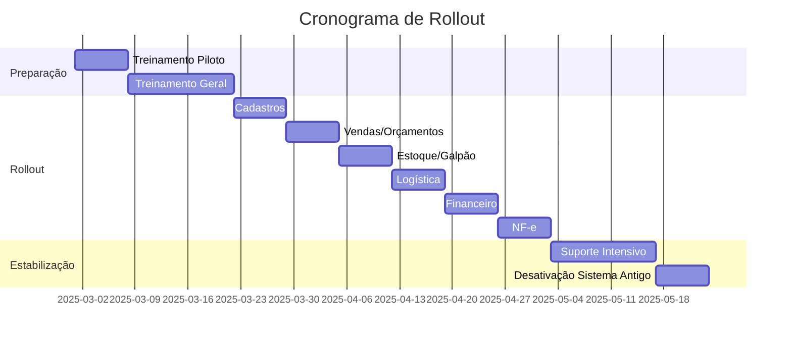

# Plano de Treinamento de Usuários

> Status: **Aprovado**
> Última atualização: 2025-12-28

---

## Visão Geral

Este documento define a estratégia de treinamento para a migração do ERP Staccato de desktop (C++ Qt) para web (Laravel + Vue).

### Objetivos

| Objetivo | Meta |
|----------|------|
| Adoção | 100% dos usuários treinados antes do go-live |
| Proficiência | 80% completando tarefas sem suporte em 2 semanas |
| Satisfação | NPS ≥ 7 após treinamento |
| Suporte | Redução de 50% nos tickets após 1 mês |

---

## Perfis de Usuário

### Matriz de Usuários

| Perfil | Quantidade Est. | Complexidade | Prioridade |
|--------|-----------------|--------------|------------|
| Administrador | 2-3 | Alta | Crítica |
| Gerente de Loja | 3-5 | Alta | Crítica |
| Gerente Financeiro | 2-3 | Alta | Crítica |
| Vendedor | 15-25 | Média | Alta |
| Vendedor Especial | 3-5 | Média | Alta |
| Administrativo | 5-8 | Média | Alta |
| Operacional | 8-12 | Média | Alta |
| Assistente Administrativo | 3-5 | Baixa | Média |

### Detalhamento por Perfil

#### Administrador / Diretor

**Responsabilidades:**

- Gerenciamento completo do sistema
- Configuração de usuários e permissões
- Cadastros mestres (lojas, NCMs, transportadoras)
- Monitoramento geral

**Funcionalidades principais:**

- Dashboard administrativo
- Gestão de usuários
- Cadastro de produtos, fornecedores, lojas
- Relatórios gerenciais
- Configurações do sistema

**Nível de treinamento:** Avançado (8 horas)

#### Gerente de Loja

**Responsabilidades:**

- Supervisão de vendas da loja
- Aprovação de descontos
- Acompanhamento financeiro
- Gestão de equipe

**Funcionalidades principais:**

- Visão de vendas (filtrado por loja)
- Aprovação de orçamentos
- Ajuste de frete
- Relatórios de loja
- Acompanhamento de metas

**Nível de treinamento:** Intermediário (6 horas)

#### Gerente Financeiro

**Responsabilidades:**

- Contas a pagar e receber
- Conciliação bancária
- Fluxo de caixa
- Comissões

**Funcionalidades principais:**

- Módulo Financeiro completo
- Geração de CNAB
- Processamento de retornos
- Relatórios financeiros

**Nível de treinamento:** Intermediário (6 horas)

#### Vendedor / Vendedor Especial

**Responsabilidades:**

- Criação de orçamentos
- Conversão em vendas
- Atendimento ao cliente
- Acompanhamento de pedidos

**Funcionalidades principais:**

- Criar/editar orçamentos
- Calcular frete
- Aplicar descontos (dentro do limite)
- Converter orçamento em venda
- Visualizar estoque

**Nível de treinamento:** Básico (4 horas)

#### Administrativo

**Responsabilidades:**

- Cadastro de produtos
- Cadastro de fornecedores
- Precificação
- Importação de tabelas

**Funcionalidades principais:**

- Cadastros mestres
- Importação de produtos
- Gestão de preços de estoque
- NCMs e IBPT

**Nível de treinamento:** Intermediário (5 horas)

#### Operacional

**Responsabilidades:**

- Logística de entregas
- Recebimento de mercadorias
- Organização de galpão
- Expedição

**Funcionalidades principais:**

- Agendamento de entregas
- Agendamento de coletas
- Calendário de logística
- Gestão de veículos
- Organização de blocos (galpão)

**Nível de treinamento:** Básico (4 horas)

---

## Mapeamento de Funcionalidades

### Onde Encontrar Cada Coisa

#### Menu Principal

| Antigo (Desktop) | Novo (Web) | Observações |
|------------------|------------|-------------|
| Menu Arquivo > Cadastrar Cliente | Cadastros > Clientes > Novo | Atalho: Ctrl+Shift+C |
| Menu Arquivo > Cadastrar Fornecedor | Cadastros > Fornecedores > Novo | Apenas admin |
| Menu Arquivo > Criar Orçamento | Vendas > Orçamentos > Novo | Atalho: Ctrl+N |
| Menu Gerenciar > Lojas | Configurações > Lojas | Apenas admin |
| Menu Gerenciar > Usuários | Configurações > Usuários | Apenas admin |
| Menu Ferramentas > Calculadora | Atalho do navegador | Usar calc do SO |
| Menu Ferramentas > Configurações | Menu usuário > Preferências | Canto superior direito |

#### Navegação por Abas

| Aba Desktop | Seção Web | Rota |
|-------------|-----------|------|
| Orçamentos | Vendas > Orçamentos | `/orcamentos` |
| Vendas | Vendas > Vendas | `/vendas` |
| Compras | Compras > Pedidos | `/compras` |
| Logística | Logística > Dashboard | `/logistica` |
| NF-e | Fiscal > Notas Fiscais | `/nfe` |
| Estoque | Estoque > Posições | `/estoque` |
| Galpão | Estoque > Galpão | `/galpao` |
| Financeiro | Financeiro > Dashboard | `/financeiro` |
| Relatórios | Relatórios | `/relatorios` |
| Gráficos | Dashboard > Analytics | `/dashboard/analytics` |

#### Ações Comuns

| Ação | Desktop | Web |
|------|---------|-----|
| Criar orçamento | Duplo clique em branco na tabela | Botão "+ Novo Orçamento" |
| Abrir registro | Duplo clique na linha | Clique na linha ou ícone 👁️ |
| Editar registro | Duplo clique para abrir | Botão "Editar" ou ícone ✏️ |
| Excluir registro | Botão Excluir no dialog | Menu ações > Excluir |
| Filtrar dados | ComboBox acima da tabela | Barra de filtros expansível |
| Ordenar coluna | Clique no cabeçalho | Clique no cabeçalho (mesmo) |
| Exportar Excel | Botão Excel no dialog | Menu Exportar > Excel |
| Imprimir | Botão Imprimir | Menu Exportar > PDF / Ctrl+P |

---

## Estrutura do Treinamento

### Módulos de Treinamento

#### Módulo 1: Introdução ao Sistema Web (1 hora)

**Conteúdo:**

1. Visão geral da mudança
2. Acesso ao sistema (URL, login)
3. Navegação básica
4. Interface do usuário
5. Menu e sidebar
6. Preferências do usuário

**Prática:**

- Login no sistema
- Explorar o menu
- Configurar preferências
- Navegar entre módulos

#### Módulo 2: Vendas e Orçamentos (2 horas)

**Conteúdo:**

1. Criar novo orçamento
2. Buscar e selecionar cliente
3. Adicionar produtos
4. Calcular frete
5. Aplicar descontos
6. Converter em venda
7. Processar pagamentos
8. Visualizar histórico

**Prática:**

- Criar orçamento completo
- Aplicar desconto com autorização
- Converter em venda
- Registrar pagamento

**Exercícios:**

1. Criar orçamento para cliente pessoa física
2. Criar orçamento para cliente pessoa jurídica com ST
3. Converter orçamento existente
4. Cancelar venda (com justificativa)

#### Módulo 3: Estoque e Galpão (1.5 horas)

**Conteúdo:**

1. Consultar estoque
2. Entender posições (lotes)
3. Filtrar por produto/fornecedor
4. Organização do galpão
5. Blocos e localizações
6. Movimentação de estoque

**Prática:**

- Consultar disponibilidade
- Localizar produto no galpão
- Entender consumo FIFO

#### Módulo 4: Logística (1.5 horas)

**Conteúdo:**

1. Dashboard de logística
2. Agendar entrega
3. Agendar coleta
4. Calendário de entregas
5. Gestão de veículos
6. Confirmar entrega (com foto)
7. Receber mercadorias

**Prática:**

- Agendar entrega para venda
- Visualizar rota no mapa
- Confirmar entrega com foto

#### Módulo 5: Financeiro (2 horas)

**Conteúdo:**

1. Contas a receber
2. Contas a pagar
3. Baixar pagamentos
4. Fluxo de caixa
5. Gerar CNAB
6. Processar retorno
7. Comissões

**Prática:**

- Baixar conta a receber
- Gerar arquivo CNAB
- Processar retorno bancário

#### Módulo 6: Nota Fiscal Eletrônica (1.5 horas)

**Conteúdo:**

1. Emitir NF-e de saída
2. Consultar NF-e
3. Cancelar NF-e
4. Carta de correção
5. Importar NF-e de entrada
6. Manifestação

**Prática:**

- Emitir NF-e para venda
- Enviar por email
- Download DANFE/XML

#### Módulo 7: Relatórios (1 hora)

**Conteúdo:**

1. Tipos de relatórios
2. Filtros e parâmetros
3. Visualização
4. Exportação (PDF, Excel, CSV)
5. Agendamento de relatórios

**Prática:**

- Gerar relatório de vendas
- Exportar para Excel
- Imprimir relatório

#### Módulo 8: Administração (2 horas) - Apenas Admins

**Conteúdo:**

1. Gestão de usuários
2. Permissões e papéis
3. Cadastro de lojas
4. NCMs e CFOP
5. Transportadoras
6. Formas de pagamento
7. Configurações do sistema
8. Logs e auditoria

**Prática:**

- Criar novo usuário
- Configurar permissões
- Cadastrar transportadora

---

## Cronograma de Treinamento

### Fase 1: Preparação (2 semanas antes)

| Semana | Atividade |
|--------|-----------|
| S-2 | Preparar materiais de treinamento |
| S-2 | Configurar ambiente de treinamento |
| S-2 | Criar usuários de teste |
| S-1 | Validar materiais com stakeholders |
| S-1 | Agendar sessões de treinamento |
| S-1 | Comunicar cronograma aos usuários |

### Fase 2: Treinamento Piloto (1 semana)

| Dia | Grupo | Módulos |
|-----|-------|---------|
| D1 | Administradores | 1, 8 (completo) |
| D2 | Administradores | 2-7 (visão geral) |
| D3 | Gerentes | 1, 2, 5 |
| D4 | Gerentes | 3, 4, 6, 7 |
| D5 | Feedback e ajustes | - |

### Fase 3: Treinamento Geral (2 semanas)

| Semana | Seg | Ter | Qua | Qui | Sex |
|--------|-----|-----|-----|-----|-----|
| S1 | Vendedores T1 | Vendedores T2 | Administrativo | Operacional T1 | Operacional T2 |
| S2 | Reforço | Reforço | Assistentes | Suporte | Go-live prep |

### Fase 4: Go-live e Suporte (2 semanas)

| Dia | Atividade |
|-----|-----------|
| D1 | Go-live com suporte presencial |
| D2-D5 | Suporte intensivo |
| S2 | Suporte reduzido |
| S2-Fim | Documentar dúvidas frequentes |

---

## Materiais de Treinamento

### Documentação

| Material | Formato | Público |
|----------|---------|---------|
| Manual do Usuário | PDF/Web | Todos |
| Guia Rápido | PDF (2 páginas) | Todos |
| FAQ de Transição | Web | Todos |
| Manual do Administrador | PDF/Web | Admins |
| Checklist de Migração | PDF | Gestores |

### Vídeos

| Vídeo | Duração | Público |
|-------|---------|---------|
| Introdução ao novo sistema | 5 min | Todos |
| Tour pela interface | 10 min | Todos |
| Criando um orçamento | 8 min | Vendas |
| Convertendo em venda | 5 min | Vendas |
| Processando pagamentos | 6 min | Vendas/Financeiro |
| Emitindo NF-e | 7 min | Vendas/Admin |
| Agendando entrega | 5 min | Operacional |
| Gestão de estoque | 8 min | Operacional |
| Administração de usuários | 10 min | Admins |

### Ambiente de Prática

- **URL:** `https://treinamento.erp.staccato.com.br`
- **Dados:** Cópia sanitizada de produção
- **Reset:** Diário às 00:00
- **Acesso:** Mesmas credenciais + sufixo `.treinamento`

---

## FAQ de Transição

### Acesso e Login

**P: Como acesso o novo sistema?**
R: Acesse `https://erp.staccato.com.br` em qualquer navegador (Chrome recomendado). Use seu usuário e senha atuais.

**P: Preciso instalar algo?**
R: Não. O sistema é 100% web e funciona em qualquer navegador moderno.

**P: Posso usar no celular?**
R: O sistema é responsivo, mas recomendamos usar em desktop para operações complexas.

**P: Esqueci minha senha, o que faço?**
R: Clique em "Esqueci minha senha" na tela de login. Um email será enviado para redefinição.

### Navegação

**P: Onde ficou o menu de cadastros?**
R: No menu lateral esquerdo, seção "Cadastros" ou através do menu superior.

**P: Como abro duas telas ao mesmo tempo?**
R: Clique com botão direito e "Abrir em nova aba", ou use Ctrl+Clique.

**P: Cadê os atalhos de teclado?**
R: Pressione `?` em qualquer tela para ver os atalhos disponíveis.

### Funcionalidades

**P: Como faço para imprimir?**
R: Use o botão "Exportar > PDF" ou Ctrl+P para impressão direta.

**P: A calculadora sumiu?**
R: Use a calculadora do seu sistema operacional ou instale uma extensão do navegador.

**P: Como exporto para Excel?**
R: Em qualquer tabela, clique em "Exportar > Excel" no menu de ações.

**P: Posso usar o sistema antigo ainda?**
R: Durante a transição, o sistema antigo estará disponível em modo somente leitura.

### Problemas Comuns

**P: A tela travou, o que faço?**
R: Pressione F5 para recarregar. Se persistir, faça logout e login novamente.

**P: Perdi os dados que estava digitando!**
R: O sistema salva automaticamente como rascunho. Verifique em "Meus Rascunhos".

**P: O sistema está lento.**
R: Verifique sua conexão de internet. Se persistir, contate o suporte.

---

## Estratégia de Rollout

### Opção Recomendada: Rollout Gradual por Módulo



### Critérios de Avanço

| Fase | Critérios para Próxima Fase |
|------|----------------------------|
| Piloto → Geral | 0 bugs críticos, NPS ≥ 6 |
| Treinamento → Rollout | 90% usuários treinados |
| Módulo N → Módulo N+1 | < 5 tickets/dia, 0 bugs bloqueantes |
| Rollout → Estabilização | Todos módulos em produção |
| Estabilização → Fim | < 2 tickets/dia por 5 dias consecutivos |

### Plano de Contingência

| Cenário | Ação |
|---------|------|
| Bug crítico em módulo | Rollback do módulo, manter antigo |
| Resistência de usuários | Treinamento adicional, suporte 1:1 |
| Performance degradada | Escalar infraestrutura, investigar |
| Integração SEFAZ falha | Manter NFe no sistema antigo |

---

## Métricas de Sucesso

### Durante Treinamento

| Métrica | Meta | Medição |
|---------|------|---------|
| Participação | 100% | Lista de presença |
| Conclusão de exercícios | 90% | Checklist |
| Avaliação de satisfação | ≥ 4/5 | Formulário pós-treino |

### Pós Go-live

| Métrica | Meta | Medição |
|---------|------|---------|
| Tickets de suporte/dia | < 10 (S1), < 5 (S2) | Helpdesk |
| Tempo médio de resolução | < 2 horas | Helpdesk |
| NPS do sistema | ≥ 7 | Pesquisa mensal |
| Tarefas sem suporte | 80% | Observação |
| Erros de usuário | < 5% | Logs |

### Indicadores de Problema

| Indicador | Ação |
|-----------|------|
| Tickets > 20/dia | Reunião de crise, suporte adicional |
| Mesmo usuário 3+ tickets | Treinamento 1:1 |
| Mesma dúvida 5+ vezes | Atualizar FAQ/documentação |
| NPS < 5 | Investigar, plano de ação |

---

## Equipe de Suporte

### Estrutura

| Nível | Responsável | Escopo |
|-------|-------------|--------|
| N1 | Helpdesk interno | Dúvidas básicas, reset senha |
| N2 | Usuários-chave treinados | Dúvidas funcionais |
| N3 | Equipe de desenvolvimento | Bugs, problemas técnicos |

### Canais de Suporte

| Canal | Horário | SLA |
|-------|---------|-----|
| Chat interno | 8h-18h | 15 min (primeira resposta) |
| Email suporte@staccato | 24/7 | 4 horas |
| Telefone | 8h-18h | Imediato |
| WhatsApp grupo | 8h-18h | 30 min |

### Escalação

```text
Usuário → Helpdesk (N1)
         ↓ Não resolvido em 30 min
    Usuário-chave (N2)
         ↓ Não resolvido em 2h
    Desenvolvimento (N3)
         ↓ Bug crítico
    Gerência + Rollback
```

---

## Usuários-Chave (Champions)

### Seleção

Critérios para seleção de usuários-chave:

- Experiência com sistema atual (> 2 anos)
- Facilidade com tecnologia
- Boa comunicação
- Disponibilidade para ajudar colegas
- Representatividade por setor/loja

### Responsabilidades

1. Participar do treinamento piloto
2. Fornecer feedback detalhado
3. Ajudar colegas com dúvidas básicas
4. Reportar problemas recorrentes
5. Sugerir melhorias

### Reconhecimento

- Certificado de "Champion do ERP"
- Participação em decisões de melhoria
- Menção em comunicações internas

---

## Comunicação

### Cronograma de Comunicações

| Quando | O Quê | Canal | Responsável |
|--------|-------|-------|-------------|
| S-4 | Anúncio da mudança | Email + reunião | Direção |
| S-3 | Detalhes do cronograma | Email | RH/TI |
| S-2 | Convite para treinamento | Email | RH |
| S-1 | Lembrete de treinamento | Email + WhatsApp | RH |
| D-1 | Instruções de acesso | Email | TI |
| D0 | Go-live | Email + WhatsApp | Direção |
| S+1 | Primeira pesquisa | Email | RH |
| S+4 | Pesquisa de satisfação | Email | RH |

### Templates

**Email de Anúncio:**

```text
Assunto: Novo Sistema ERP - Modernização do Staccato

Prezados,

Temos o prazer de anunciar a modernização do nosso sistema ERP Staccato.

O que muda:
- Acesso via navegador (sem instalação)
- Interface moderna e intuitiva
- Mesmo login e senha
- Todas as funcionalidades mantidas

Quando:
- Treinamentos: [DATA]
- Go-live: [DATA]

Próximos passos:
Você receberá um convite para treinamento em breve.

Atenciosamente,
[Direção]
```

---

## Checklist de Implementação

### Pré-Treinamento

- [ ] Ambiente de treinamento configurado
- [ ] Materiais preparados e revisados
- [ ] Vídeos gravados e editados
- [ ] FAQ inicial documentado
- [ ] Usuários de teste criados
- [ ] Cronograma comunicado
- [ ] Salas/recursos reservados

### Durante Treinamento (Checklist)

- [ ] Lista de presença
- [ ] Exercícios práticos realizados
- [ ] Dúvidas documentadas
- [ ] Feedback coletado
- [ ] Materiais distribuídos

### Pós-Treinamento

- [ ] Avaliações tabuladas
- [ ] FAQ atualizado
- [ ] Materiais ajustados
- [ ] Usuários-chave identificados
- [ ] Canais de suporte ativos

### Go-live

- [ ] Comunicação enviada
- [ ] Suporte disponível
- [ ] Monitoramento ativo
- [ ] Plano de contingência pronto
- [ ] Sistema antigo em standby

---

## Documentos Relacionados

- [01-plano-migracao.md](./01-plano-migracao.md) - Plano de migração
- [10-paridade-funcionalidades.md](./10-paridade-funcionalidades.md) - Checklist de funcionalidades
- [../tecnico/05-seguranca.md](../tecnico/05-seguranca.md) - Autenticação/autorização
