# Business Process Flows - Complete Analysis

> Status: **Analyzed from codebase**
> Last updated: 2025-12-27
> Source: Deep analysis of C++ codebase

---

## Executive Summary

The ERP has **6 main interconnected flows**:

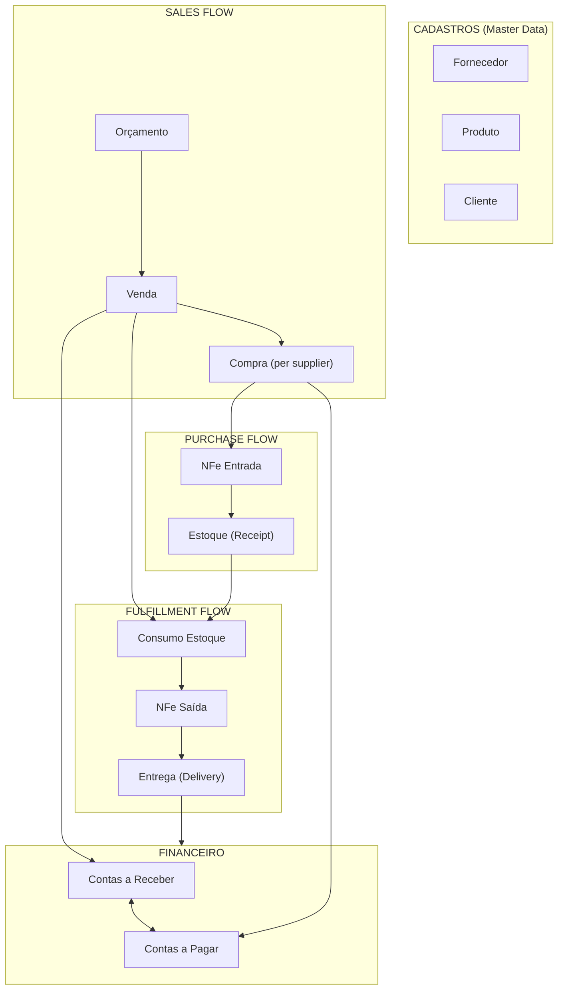

---

## Table of Contents

1. [Two-Level Table Architecture](#1-two-level-table-architecture)
2. [Orçamento → Venda Flow](#2-orçamento--venda-flow)
3. [Venda → Compra Flow](#3-venda--compra-flow)
4. [Compra → Estoque Flow](#4-compra--estoque-flow)
5. [Estoque → Consumo Flow](#5-estoque--consumo-flow)
6. [NFe Flow](#6-nfe-flow)
7. [Financial Flow](#7-financial-flow)
8. [Complete Status Reference](#8-complete-status-reference)
9. [Data Integrity Rules](#9-data-integrity-rules)
10. [Known Problems](#10-known-problems)

---

## 1. Two-Level Table Architecture

### Why Two Levels Exist

The system uses a **two-level hierarchy** for both sales and purchases:

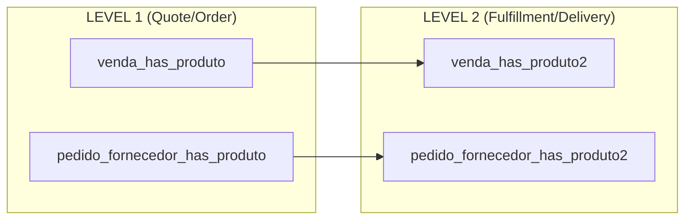

### Purpose of Each Level

| Aspect | Level 1 | Level 2 |
|--------|---------|---------|
| **Purpose** | What was ordered | How it's being fulfilled |
| **Granularity** | One per product in quote | **Can have MULTIPLE per L1** (split deliveries) |
| **Status** | Order-level status | Item-level workflow status |
| **NFe Links** | None | 3 NFe references (Entrada, Saída, Futura) |
| **Estoque Link** | None | Links to estoque_has_consumo |
| **Dates** | Order dates | All workflow dates (6 date pairs) |

### Split Delivery Example

```
Customer orders: 100 units of Product A (venda_has_produto qty=100)

Split into 3 deliveries:
├── venda_has_produto2 [qty=40] → status=ENTREGUE (delivered)
├── venda_has_produto2 [qty=35] → status=EM ENTREGA (in transit)
└── venda_has_produto2 [qty=25] → status=EM COMPRA (being purchased)

Each L2 tracks independently:
- Own status progression
- Own purchase link (idCompra)
- Own stock consumption records
- Own NFe references
```

### Relationship Diagram

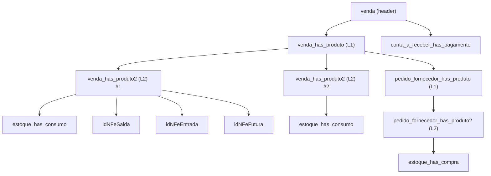

### Key Insight

**Level 2 is the "workhorse"** - it tracks the actual fulfillment:
- `venda_has_produto2.idVendaProduto2` is THE KEY that connects:
  - What inventory was consumed (`estoque_has_consumo`)
  - What was purchased (`pedido_fornecedor_has_produto2`)
  - What NFe was issued (`idNFeSaida`)

---

## 2. Orçamento → Venda Flow

### Status Values: Orçamento

| Status | Description | Transitions To |
|--------|-------------|----------------|
| `ATIVO` | Active quote, can be converted | FECHADO, EXPIRADO, PERDIDO |
| `EXPIRADO` | Past validity date | REPLICADO (if replicated) |
| `REPLICADO` | Source of a replica quote | - |
| `FECHADO` | Converted to Venda | - |
| `PERDIDO` | Manually marked as lost | - |

### Conversion Flow

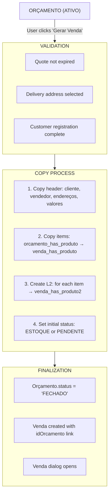

### Data Transformation

```
ORÇAMENTO                          VENDA
─────────                          ─────
idOrcamento          ───────────►  idOrcamento (FK)
idCliente            ───────────►  idCliente
idEnderecoEntrega    ───────────►  idEnderecoEntrega
idEnderecoFaturamento ──────────►  idEnderecoFaturamento
idProfissional       ───────────►  idProfissional
idUsuario            ───────────►  idUsuario
subTotalBru          ───────────►  subTotalBru
subTotalLiq          ───────────►  subTotalLiq
frete                ───────────►  frete
descontoPorc         ───────────►  descontoPorc
descontoReais        ───────────►  descontoReais
total                ───────────►  total
prazoEntrega         ───────────►  prazoEntrega
representacao        ───────────►  representacao
                     NEW ───────►  status = 'ATIVO'
                     NEW ───────►  data (sale date)
```

---

## 3. Venda → Compra Flow

### When Compras Are Generated

Compras (purchase orders) are generated when:
1. User opens "Gerar Compra" tab in Compras module
2. Selects pending items (status = INICIADO or PENDENTE)
3. Clicks "Gerar Compra" button

### Status Values: Venda Item (venda_has_produto2)

| Status | Description | Next Status |
|--------|-------------|-------------|
| `INICIADO` | Initial state after venda creation | EM COMPRA, ESTOQUE |
| `PENDENTE` | Waiting for action | EM COMPRA, ESTOQUE |
| `EM COMPRA` | Purchase order generated | EM FATURAMENTO |
| `EM FATURAMENTO` | Supplier confirmed/dispatched | EM ENTREGA |
| `EM ENTREGA` | Goods in transit | EM RECEBIMENTO, ESTOQUE |
| `EM RECEBIMENTO` | Being received at warehouse | ESTOQUE |
| `ESTOQUE` | In stock, ready for delivery | ENTREGA AGEND. |
| `ENTREGA AGEND.` | Delivery scheduled | EM ENTREGA (to customer) |
| `EM ENTREGA` | Out for delivery | ENTREGUE |
| `ENTREGUE` | Delivered to customer | (final) |
| `CANCELADO` | Cancelled | (final) |
| `DEVOLVIDO` | Returned | (final) |

### Flow Diagram

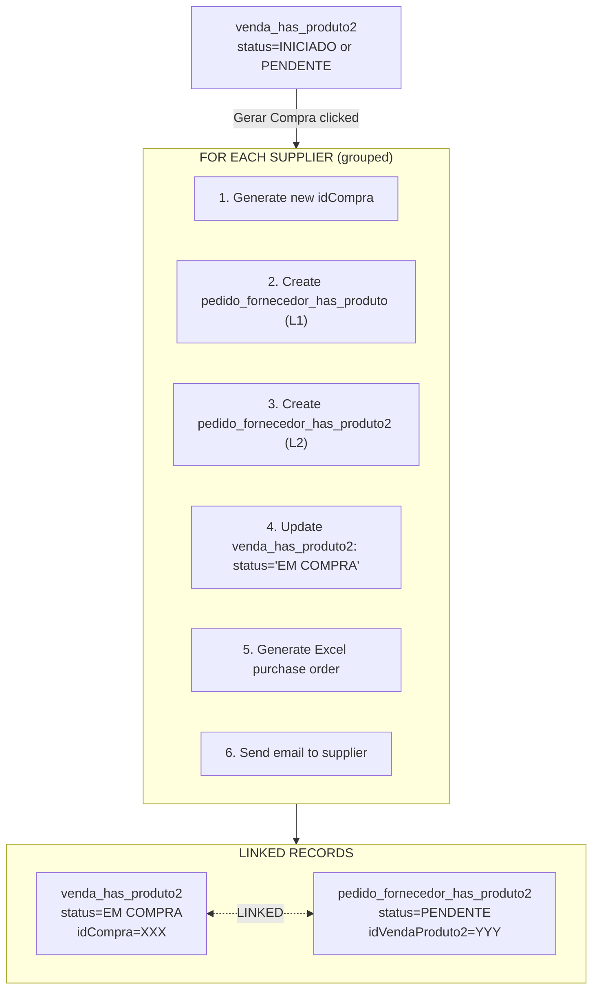

### Key: idCompra Links Everything

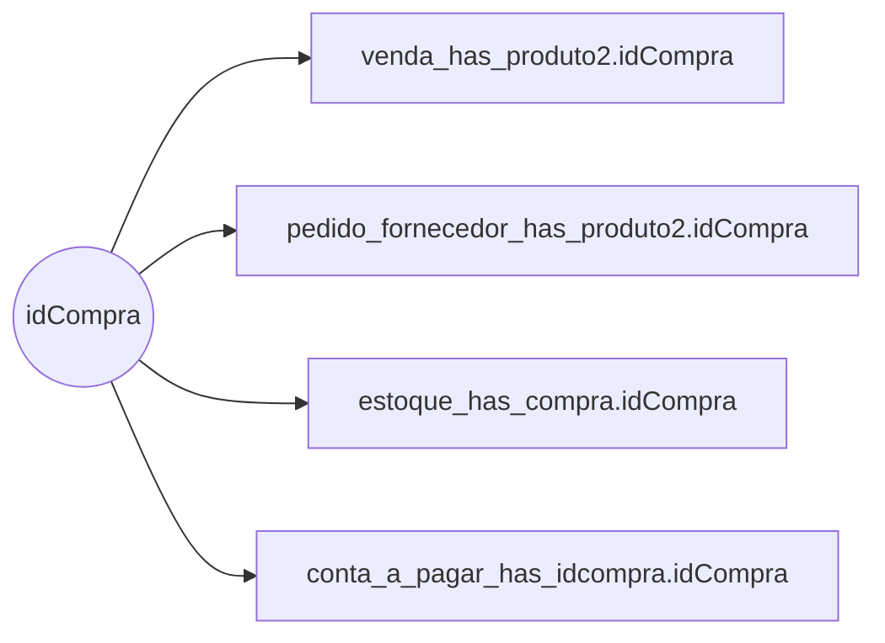

---

## 4. Compra → Estoque Flow

### Purchase Confirmation Steps

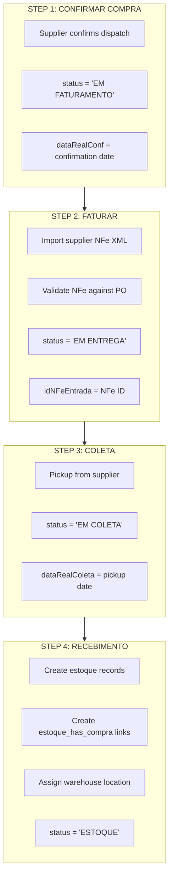

### Estoque Record Creation

```sql
-- Created during NFe import / receiving
INSERT INTO estoque (
    idNFe,              -- Supplier's NFe
    idProduto,
    fornecedor,         -- Supplier name (denormalized)
    descricao,          -- Product description
    status,             -- 'ESTOQUE'
    quant,              -- Quantity received
    restante,           -- Available quantity (= quant initially)
    valorUnid,          -- Unit cost from NFe
    idBloco,            -- Warehouse location
    lote,               -- Batch/lot number
    -- All tax fields from NFe...
    vBC, pICMS, vICMS, vIPI, vPIS, vCOFINS...
)
```

---

## 5. Estoque → Consumo Flow

### Stock Consumption Logic

When a sale is ready for delivery, stock is "consumed" (allocated):

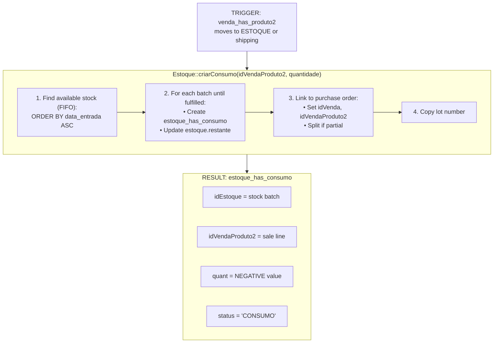

### Important: Negative Quantities

Stock consumption is stored as **NEGATIVE** values in `estoque_has_consumo.quant`:

```
estoque.quant = 100          (original received)
estoque.restante = 100       (available)

After consumption of 40:
estoque_has_consumo.quant = -40   (NEGATIVE!)
estoque.restante = 60             (updated)
```

### Consumption Reversal

When a sale is cancelled or item returned:

```cpp
// Estoque::desfazerConsumo()
1. DELETE FROM estoque_has_consumo WHERE idVendaProduto2 = ?
2. UPDATE pedido_fornecedor_has_produto2 SET idVenda = NULL, idVendaProduto2 = NULL
3. UPDATE venda_has_produto2 SET status = 'PENDENTE', lote = NULL, idCompra = NULL
4. Recalculate estoque.restante
```

---

## 6. NFe Flow

### NFe Types

| Type | Direction | Purpose |
|------|-----------|---------|
| `SAIDA` | Outgoing | Invoice TO customer |
| `ENTRADA` | Incoming | Invoice FROM supplier |
| `FUTURA` | Scheduled | Future delivery invoice |
| `DEVOLUCAO` | Return | Return credit note |

### NFe Status Values

| Status | Description |
|--------|-------------|
| `NOTA PENDENTE` | Pre-registered, waiting SEFAZ |
| `AUTORIZADA` | Approved by SEFAZ |
| `DENEGADA` | Rejected by SEFAZ |
| `CANCELADA` | Cancelled after approval |
| `RESUMO` | Summary from manifest (not full XML) |
| `INUTILIZADA` | Voided/unused number |

### NFe Emission Flow (Saída)

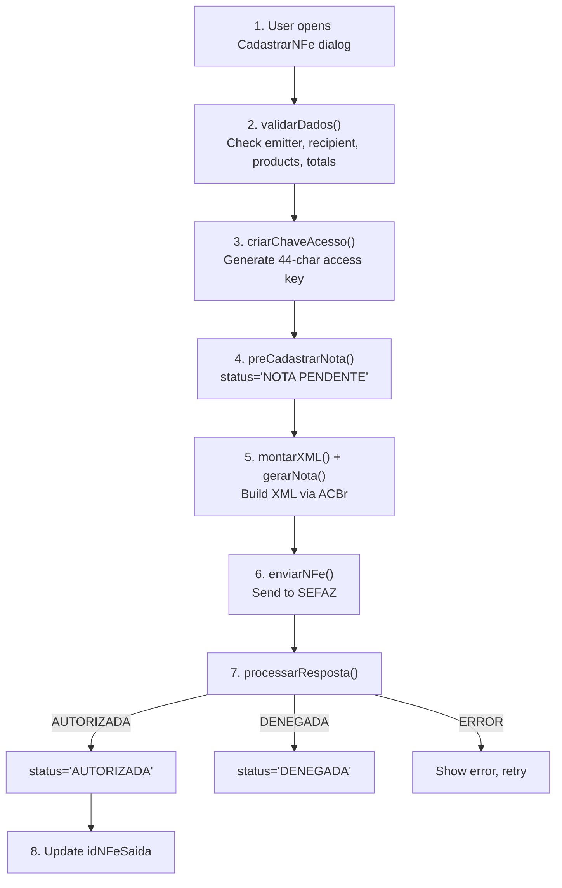

### NFe Import Flow (Entrada)

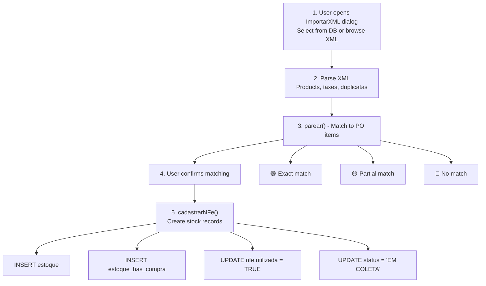

### Three NFe References per Sale Item

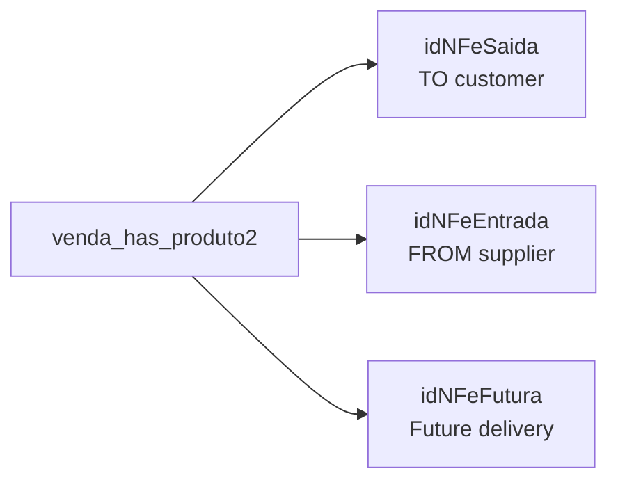

---

## 7. Financial Flow

### Contas a Receber (Receivables)

**Created**: Automatically when Venda is saved/confirmed

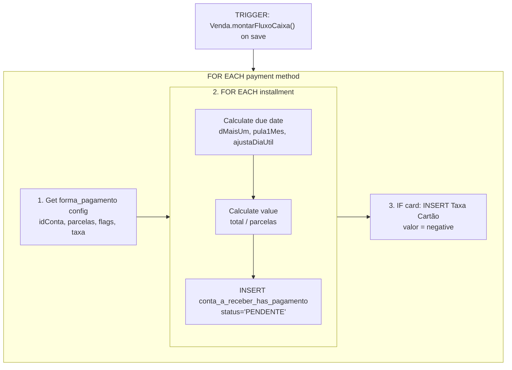

### Contas a Pagar (Payables)

**Created**: At purchase CONFIRMATION step (`widgetcompraconfirmar`)

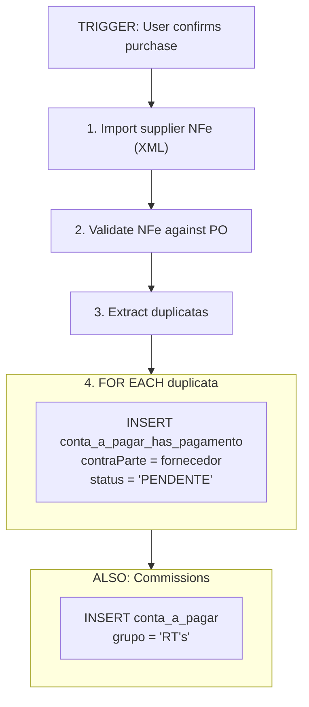

### Financial Status Values

| Status | Description |
|--------|-------------|
| `PENDENTE` | Not yet paid |
| `CONFERIDO` | Verified/confirmed |
| `AGENDADO` | Scheduled for payment |
| `RECEBIDO` | Payment received (receivables) |
| `PAGO` | Payment made (payables) |
| `CANCELADO` | Cancelled |
| `PAGO GARE` | Tax payment completed |

### Payment Recording

```
User edits dataRealizado column in Contas dialog
    │
    ▼
preencher() method auto-populates:
    • status = 'RECEBIDO' or 'PAGO'
    • valorReal = valor (actual amount)
    • tipoReal = tipo (actual method)
    • idConta = bank account
    • centroCusto = cost center
    │
    ▼
IF card payment:
    • Find matching "Taxa Cartão" record
    • Update that record identically
```

---

## 8. Complete Status Reference

### All Status Columns by Table

| Table | Column | Values |
|-------|--------|--------|
| `venda` | status | ATIVO, CANCELADO, ENTREGUE, DEVOLVIDO |
| `venda` | statusFinanceiro | PENDENTE, CONFERIDO, LIBERADO, PAGO, CANCELADO |
| `venda_has_produto2` | status | INICIADO, PENDENTE, EM COMPRA, EM FATURAMENTO, EM ENTREGA, EM RECEBIMENTO, EM COLETA, ESTOQUE, ENTREGA AGEND., ENTREGUE, CANCELADO, DEVOLVIDO, DEVOLVIDO ESTOQUE, QUEBRADO, REPO. ENTREGA, REPO. RECEB. |
| `pedido_fornecedor_has_produto` | status | PENDENTE, CONFIRMADO, FATURADO, CANCELADO |
| `pedido_fornecedor_has_produto2` | status | (same as venda_has_produto2) |
| `compra_avulsa` | status | PEND. APROV., CONFERIDO, COMPRADO, CANCELADO |
| `estoque` | status | TEMP, ESTOQUE, CANCELADO |
| `estoque_has_consumo` | status | TEMP, CONSUMO, AJUSTE, DEVOLVIDO |
| `nfe` | status | NOTA PENDENTE, AUTORIZADA, DENEGADA, CANCELADA, RESUMO, INUTILIZADA |
| `conta_a_receber` | status | PENDENTE, CONFERIDO, AGENDADO, RECEBIDO, CANCELADO |
| `conta_a_pagar` | status | PENDENTE, CONFERIDO, AGENDADO, PAGO, CANCELADO, PAGO GARE, PENDENTE GARE, LIBERADO GARE |
| `orcamento` | status | ATIVO, EXPIRADO, REPLICADO, FECHADO, PERDIDO |

### Complete Item Status Flow

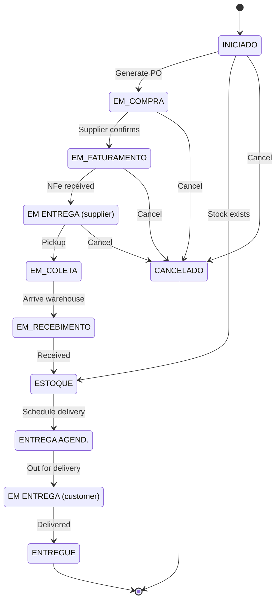

---

## 9. Data Integrity Rules

### Invariants That Must ALWAYS Be True

```
FINANCIAL INTEGRITY:
──────────────────
1. SUM(conta_a_receber.valor) for venda == venda.total
2. SUM(conta_a_pagar.valor) for compra == compra.total
3. No orphan payments (always linked to transaction)

STOCK INTEGRITY:
───────────────
1. estoque.restante >= 0 (NEVER negative)
2. estoque.restante = estoque.quant + estoque.ajuste + SUM(estoque_has_consumo.quant)
3. SUM(estoque_has_consumo.quant) for item == venda_has_produto2.quant (as negative)

FLOW INTEGRITY:
──────────────
1. Venda cannot be ESTOQUE if compras not RECEBIDO (unless stock existed)
2. Compra RECEBIDO must create estoque records
3. Cancellation must reverse ALL downstream effects:
   • Delete consumos
   • Unlink purchases
   • Cancel financials
   • Reactivate orçamento (if applicable)

NFe INTEGRITY:
─────────────
1. NFe AUTORIZADA cannot be modified
2. NFe can only be CANCELADA within 24h (SEFAZ rule)
3. venda_has_produto2.idNFeSaida must point to valid NFe
```

### Status Cascade Rules

```
When purchase status changes → venda_has_produto2 status changes
    via stored procedure: update_venda_status()

When all venda_has_produto2 are ENTREGUE → venda.status = ENTREGUE
    via stored procedure: update_venda_status()

When venda cancelled →
    1. All venda_has_produto2.status = CANCELADO
    2. All conta_a_receber.status = CANCELADO
    3. All estoque_has_consumo deleted
    4. All pedido_fornecedor links cleared
    5. orcamento.status = ATIVO (reactivated)
```

---

## 10. Known Problems

### Issues Identified in Analysis

| Problem | Impact | Cause |
|---------|--------|-------|
| **Denormalized supplier names** | Updates require 5+ tables | fornecedor stored as VARCHAR, not FK |
| **No atomic transactions** | Inconsistent state possible | Separate SQL updates, not wrapped |
| **Status as strings** | No validation | Should be ENUM |
| **Two-level complexity** | Hard to query | Organic growth |
| **Payables at confirmation** | Timing issues? | Created at confirmation step, not order |
| **No audit trail** | Can't track changes | No history tables |
| **Negative quantities** | Confusing | estoque_has_consumo.quant is negative |

### Clarified Rules

1. **Can a venda item be split across multiple deliveries?**
   - **YES** - One `venda_has_produto` can have MULTIPLE `venda_has_produto2` records
   - This enables partial deliveries and split fulfillment
   - Each L2 record tracks a separate delivery/fulfillment path

2. **When are contas_a_pagar created for compras?**
   - **At confirmation step** (`widgetcompraconfirmar`)
   - This is when supplier invoice details are known

3. **What happens with partial receiving?**
   - **YES** - Can receive LESS than ordered
   - Venda item stays **partially fulfilled**
   - Need to track: quantity ordered vs quantity received

4. **Commission calculation timing?**
   - Still needs clarification
   - When is commission calculated?
   - What if sale cancelled after commission paid?

---

## Next Steps

1. [ ] Document each broken scenario specifically
2. [ ] Define atomic transaction boundaries
3. [ ] Map all stored procedures
4. [ ] Create test cases for each status transition
5. [ ] Design new normalized schema
