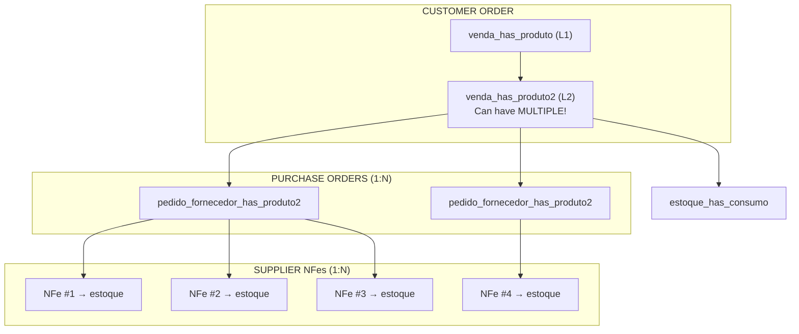
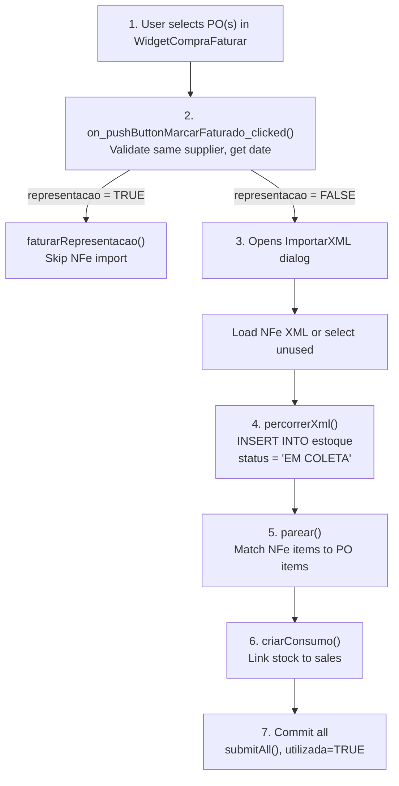
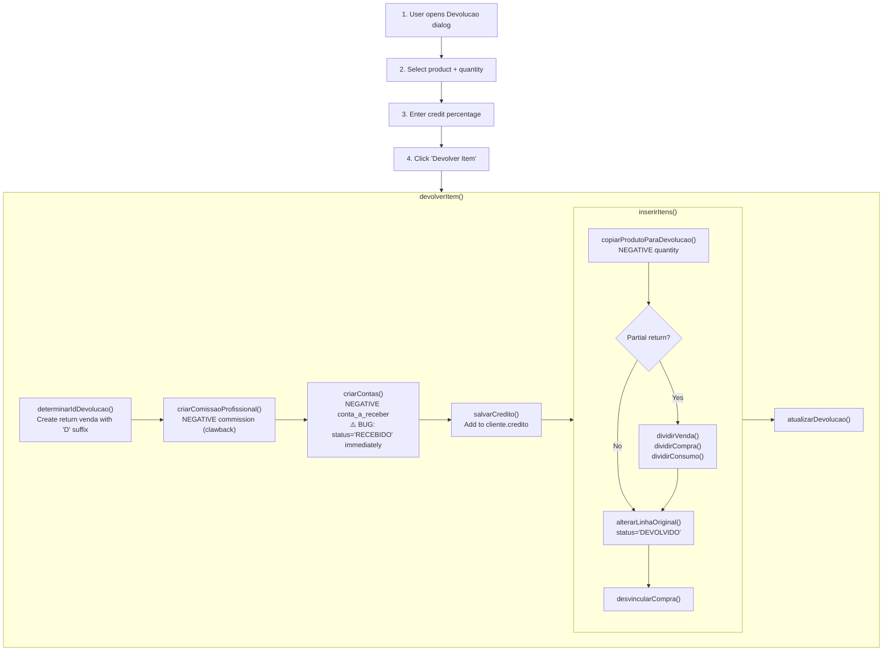
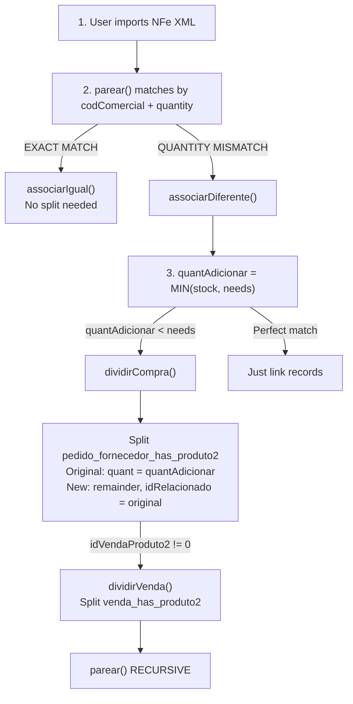

# Stock (Estoque) Flow - Deep Analysis

> Status: **Critical Analysis Complete**
> Last updated: 2025-12-27
> Source: Deep analysis of C++ codebase

---

## Executive Summary

The stock system is **one of the most complex** parts of the ERP with multiple interconnected flows. This document provides a complete analysis based on codebase exploration.

### Key Findings

1. **1:N:N Relationships**: One sale item can be fulfilled by multiple purchase orders, each fulfilled by multiple NFes
2. **Stock created at NFe import**: Not at purchase order creation
3. **Consumption created at import**: Pre-consumption linked to sales at import time
4. **FIFO not properly implemented**: Relies on `produto.idEstoque` being pre-set
5. **Returns flow is incomplete/buggy**: Multiple TODOs, no automatic NFe de Devolução

---

## Table of Contents

1. [The Complete Relationship Chain](#1-the-complete-relationship-chain)
2. [Stock Creation Flow (NFe Import)](#2-stock-creation-flow-nfe-import)
3. [The Parear (Matching) Algorithm](#3-the-parear-matching-algorithm)
4. [Stock Consumption Logic](#4-stock-consumption-logic)
5. [The restante Field Calculation](#5-the-restante-field-calculation)
6. [Returns (Devolução) Flow & Bugs](#6-returns-devolução-flow--bugs)
7. [Identified Problems](#7-identified-problems)
8. [Data Integrity Invariants](#8-data-integrity-invariants)

---

## 1. The Complete Relationship Chain

### The 1:N:N Structure



### Junction Tables

| Table | Purpose | Links |
|-------|---------|-------|
| `estoque_has_compra` | NFe stock → Purchase order | idEstoque ↔ idCompra, idPedido2 |
| `estoque_has_consumo` | NFe stock → Sale order | idEstoque ↔ idVendaProduto2 |

### Key Insight

The **idVendaProduto2** is the central linking key:
- Stored in `pedido_fornecedor_has_produto2.idVendaProduto2`
- Stored in `estoque_has_consumo.idVendaProduto2`
- Links everything back to the customer order

---

## 2. Stock Creation Flow (NFe Import)

### Entry Point: `widgetcomprafaturar.cpp`

**User Action**: Click "Marcar Faturado" on purchase orders



### Key Fields Created

| Field | Value | Notes |
|-------|-------|-------|
| `quant` | From NFe XML | Original received quantity |
| `restante` | = quant | Initially full quantity available |
| `status` | 'EM COLETA' | Ready for warehouse pickup |
| `idNFe` | FK to nfe | Links to source NFe |
| `valorUnid` | (valor + vIPI - desconto) / quant | Unit cost |

---

## 3. The Parear (Matching) Algorithm

**Location**: `importarxml.cpp:1251-1313`

### Matching Strategy

```cpp
void ImportarXML::parear() {
    limparAssociacoes();  // Reset all associations

    for (each NFe item in modelEstoque) {
        codComercial = item.codComercial;
        quantEstoque = item.quant;

        // STEP 1: Search for EXACT quantity match
        iguais = modelCompra.multiMatch({
            {"codComercial", codComercial},
            {"quant", quantEstoque},           // Exact match
            {"status", "EM FATURAMENTO"},
            {"quantUpd", Green, NOT}           // Not yet paired
        });

        if (iguais found) {
            associarIgual(iguais.first(), rowEstoque);
            continue;
        }

        // STEP 2: Search for DIFFERENT quantities
        diferentes = modelCompra.multiMatch({
            {"codComercial", codComercial},
            {"quant", quantEstoque, NOT},      // Different quantity
            {"status", "EM FATURAMENTO"}
        });

        estoquePareado = 0;
        for (each PO line in diferentes) {
            associarDiferente(rowCompra, rowEstoque, estoquePareado);
            if (estoquePareado >= quantEstoque) break;
        }
    }
}
```

### Color Coding

| Color | Value | Meaning |
|-------|-------|---------|
| Green | 1 | Perfect match - ready to import |
| Yellow | 2 | Partial match - quantity mismatch |
| Red | 3 | No match found |
| DarkGreen | 4 | Consumption created |

### When Quantities Don't Match

**Scenario**: NFe has 150 units, PO line needs 200 units

```cpp
void associarDiferente(rowCompra, rowEstoque, &estoquePareado) {
    quantEstoque = 150;  // NFe amount
    quantCompra = 200;   // PO needs

    quantAdicionar = min(quantEstoque - estoquePareado, quantCompra);
    // quantAdicionar = 150

    if (quantAdicionar < quantCompra) {
        // NFe doesn't fully cover PO line
        // Split the PO line!
        dividirCompra(rowCompra, quantAdicionar);

        // Now we have:
        // Original PO line: quant = 150 (matched to this NFe)
        // New PO line: quant = 50 (waiting for another NFe)

        parear();  // Re-run matching
        return;
    }
}
```

### The dividirCompra() Function

```cpp
void dividirCompra(rowCompra, quantAdicionar) {
    novoIdPedido2 = qApp->reservarIdPedido2();

    // ORIGINAL LINE - reduce to matched amount
    modelCompra.setData(rowCompra, "quant", quantAdicionar);
    modelCompra.setData(rowCompra, "preco", prcUnitario * quantAdicionar);

    // NEW LINE - remainder
    INSERT INTO pedido_fornecedor_has_produto2 (
        idPedido2 = novoIdPedido2,
        idRelacionado = original_idPedido2,  // Links to parent
        quant = originalQuant - quantAdicionar,
        status = 'EM FATURAMENTO'  // Still waiting
    );

    // If sales order linked, split that too
    if (idVendaProduto2 != 0) {
        dividirVenda(rowVenda, quantAdicionar);
    }
}
```

---

## 4. Stock Consumption Logic

### When Consumption is Created

Consumption (`estoque_has_consumo`) is created **at NFe import time**, NOT at delivery.

**Location**: `importarxml.cpp:1030-1130`

```cpp
void criarConsumo(rowCompra, rowEstoque) {
    idVendaProduto2 = modelCompra.data(rowCompra, "idVendaProduto2");

    if (idVendaProduto2 == 0) return;  // No sale linked, skip

    idEstoque = modelEstoque.data(rowEstoque, "idEstoque");
    quantVenda = modelVenda.data(rowVenda, "quant");
    restanteEstoque = modelEstoque.data(rowEstoque, "restante");

    // Take minimum of sale needs and available stock
    quantConsumo = min(quantVenda, restanteEstoque);
    proporcao = quantConsumo / quantEstoque;

    // INSERT consumption record
    INSERT INTO estoque_has_consumo (
        idEstoque,
        idVendaProduto2,
        status = 'PRÉ-CONSUMO',
        quant = -quantConsumo,        // NEGATIVE = consumption

        -- Proportional tax values --
        valor = quantConsumo * valorUnid,
        vBC = vBC * proporcao,
        vICMS = vICMS * proporcao,
        vIPI = vIPI * proporcao,
        -- etc for all tax fields --
    );

    // Update remaining stock
    modelEstoque.setData(rowEstoque, "restante",
        restanteEstoque - quantConsumo);

    // Update sale line status
    modelVenda.setData(rowVenda, "status", "EM COLETA");
    modelVenda.setData(rowVenda, "dataRealFat", dataFaturamento);
}
```

### Consumption Status Values

| Status | Meaning |
|--------|---------|
| `PRÉ-CONSUMO` | Reserved but not picked |
| `CONSUMO` | Physically picked from warehouse |
| `AJUSTE` | Adjustment (broken items, etc.) |
| `DEVOLVIDO` | Returned to stock |
| `CANCELADO` | Cancelled |

### Multiple Consumptions per Sale Item

**Critical**: One `idVendaProduto2` can have MULTIPLE `estoque_has_consumo` records!

This happens when:
- Stock comes from multiple NFes
- Stock comes from multiple batches
- Partial deliveries

```sql
-- Example: Sale needs 100 units, fulfilled from 3 batches
estoque_has_consumo:
  idEstoque=1, idVendaProduto2=999, quant=-40
  idEstoque=2, idVendaProduto2=999, quant=-35
  idEstoque=3, idVendaProduto2=999, quant=-25

-- Total consumed: 40 + 35 + 25 = 100
```

---

## 5. The restante Field Calculation

### Stored Procedure: `update_quant_estoque()`

**Location**: `initdb.sql:3994-4013`

```sql
-- restante = Original quantity + Sum of all consumption quantities
SET @restante := (
    SELECT e.quant + COALESCE(SUM(ehc.quant), 0)
    FROM estoque e
    LEFT JOIN estoque_has_consumo ehc ON e.idEstoque = ehc.idEstoque
    WHERE e.idEstoque = currentId
    GROUP BY e.idEstoque
);

-- Example:
-- estoque.quant = 100 (original)
-- estoque_has_consumo.quant = -40 (consumed)
-- estoque_has_consumo.quant = -30 (consumed)
-- restante = 100 + (-40) + (-30) = 30
```

### Why Negative Quantities?

- **Positive quant in estoque**: Stock received
- **Negative quant in estoque_has_consumo**: Stock consumed
- **restante = quant + SUM(consumptions)**: Natural calculation

---

## 6. Returns (Devolução) Flow & Bugs

### Two Types of Returns

| Type | Status | Action |
|------|--------|--------|
| Customer Return | `DEVOLVIDO` | Customer returns item, credit issued |
| Stock Return | `DEVOLVIDO ESTOQUE` | Item returned to inventory |
| Supplier Return | `DEVOLVIDO FORN.` | Item returned to supplier |

### Customer Return Flow

**Location**: `devolucao.cpp`



### Identified Bugs in Returns

| # | Severity | Issue | Location |
|---|----------|-------|----------|
| 1 | **HIGH** | Financial record marked `RECEBIDO` immediately (bypasses workflow) | devolucao.cpp:554 |
| 2 | **HIGH** | No NFe de Devolução created automatically | devolucao.cpp:941-947 (TODOs) |
| 3 | **HIGH** | Financial records have empty `observacao` (no audit trail) | devolucao.cpp:552 |
| 4 | **MEDIUM** | Hard-coded `quantUpd = 5` instead of const | widgetcompradevolucao.cpp:173 |
| 5 | **MEDIUM** | Missing `quantUpd` on split consumo records | devolucao.cpp:859 |
| 6 | **MEDIUM** | Client credit has no audit trail of what it's for | devolucao.cpp:569 |
| 7 | **MEDIUM** | Confusing `idRelacionado` linking for partial returns | devolucao.cpp:696,734 |
| 8 | **LOW** | `PENDENTE DEV.` items can't be re-returned | devolucao.cpp:90 |

### TODOs in Returns Code

```cpp
// From devolucao.cpp:941-946
// TODO: 0. lidar com os casos em que o produto estava agendado é feita a devolucao
// TODO: 1. perguntar e guardar data em que ocorreu a devolucao
// TODO: 2. ??? nao criar linha conta
// TODO: 2. adicionar devolucao de frete quando houver
// TODO: 2. criar linha no followup
// TODO: 2. quando for devolver para o fornecedor perguntar a quantidade
```

---

## 7. Identified Problems

### Critical Issues

| Problem | Impact | Root Cause |
|---------|--------|------------|
| **FIFO not implemented** | Wrong stock consumed | `produto.idEstoque` not maintained |
| **Multi-estoque split missing** | Can't fulfill from multiple batches | No logic to split across estoque entries |
| **Returns bypass financial workflow** | Can't audit returns | Status set to RECEBIDO immediately |
| **No NFe Devolução** | Tax compliance issues | Feature not implemented |
| **Negative quantity semantics unclear** | Confusion in reports | Mixed usage patterns |

### FIFO Problem Detail

**Current Implementation**:
```cpp
// From venda.cpp:1046
query.prepare("SELECT p.idEstoque, vp2.idVendaProduto2, vp2.quant
              FROM venda_has_produto2 vp2
              LEFT JOIN produto p ON vp2.idProduto = p.idProduto
              WHERE vp2.idVenda = :idVenda AND vp2.estoque > 0");
```

**Problem**: No `ORDER BY` clause! Relies entirely on `produto.idEstoque` being pre-set.

**Should Be**:
```sql
SELECT e.idEstoque
FROM estoque e
WHERE e.idProduto = :idProduto
  AND e.status = 'ESTOQUE'
  AND e.restante > 0
ORDER BY e.created ASC  -- FIFO: oldest first
LIMIT 1
```

### Return Reversal Uses LIFO (Wrong!)

**Location**: `inputdialogconfirmacao.cpp:553-601`

When goods are damaged and need to undo consumption:
```cpp
querySelect.prepare(
    "SELECT ... FROM estoque_has_consumo ehc
     LEFT JOIN venda_has_produto2 vp2 ON ...
     WHERE ehc.idEstoque = :idEstoque
     ORDER BY prazoEntrega DESC"  // LONGEST deadline first!
);
```

This is **LIFO** (last in, first out) - should be FIFO for proper reversal.

---

## 8. Data Integrity Invariants

### Must ALWAYS Be True

```sql
-- STOCK BALANCE
estoque.restante >= 0  -- NEVER negative

estoque.restante = estoque.quant + COALESCE(SUM(estoque_has_consumo.quant), 0)

-- CONSUMPTION LINKS
estoque_has_consumo.idVendaProduto2 must point to valid venda_has_produto2

-- FINANCIAL BALANCE
SUM(conta_a_receber.valor) for return venda = negative of returned value

-- STATUS CONSISTENCY
IF venda_has_produto2.status = 'DEVOLVIDO'
THEN EXISTS row in estoque_has_consumo with status = 'DEVOLVIDO'
```

### Transaction Boundaries

Current code wraps NFe import in transaction:
```cpp
qApp->startTransaction("ImportarXML::on_pushButtonImportar");
try {
    importar();  // All inserts/updates
    qApp->endTransaction();  // COMMIT
} catch (...) {
    // ROLLBACK on any error
}
```

But returns flow has **multiple separate transactions** - risk of partial state!

---

---

## 9. When venda_has_produto2 Records Are Split

### Initial Creation

**Mechanism**: Database trigger + stored procedure

When `venda_has_produto` is inserted (during orçamento→venda conversion):
1. Trigger fires automatically
2. Calls `copy_into_venda_has_produto2` procedure
3. Creates ONE `venda_has_produto2` per `venda_has_produto`

**Location**: `initdb.sql` - procedure `copy_into_venda_has_produto2`

### When Splits Happen

**Answer**: Splits are **AUTOMATIC** during NFe import, based on stock availability.



### Split Quantity Decision

**Who decides?** AUTOMATIC - no user input

**Formula**: `quantAdicionar = qMin(estoqueDisponivel, quantCompra)`

**Location**: `importarxml.cpp:675`

```cpp
const double quantAdicionar = qMin(estoqueDisponivel, quantCompra);
```

### Example Scenario

```
Original Order: 100 units of Product X

NFe #1 arrives with 60 units:
├── venda_has_produto2 #1: quant=60, status='EM COLETA'
└── venda_has_produto2 #2: quant=40, idRelacionado=#1, status='PENDENTE'

NFe #2 arrives with 50 units:
├── venda_has_produto2 #1: quant=60 (unchanged)
├── venda_has_produto2 #2: quant=40, status='EM COLETA' (now fulfilled)
└── (10 units from NFe #2 go to different order or stock)
```

### Secondary Split Trigger: Returns

**Location**: `devolucao.cpp:740` - `dividirVenda()`

When customer returns PARTIAL quantity:
- Original line: status='DEVOLVIDO', quant=returned amount
- New line: quant=remaining, idRelacionado=original

---

## 10. The idRelacionado Link

### Purpose

Links split records together, forming a chain back to the original.

```sql
venda_has_produto2:
  idVendaProduto2 = 1001  -- Original
  idRelacionado = NULL
  quant = 60

  idVendaProduto2 = 1002  -- First split
  idRelacionado = 1001    -- Points to original
  quant = 25

  idVendaProduto2 = 1003  -- Second split
  idRelacionado = 1001    -- Also points to original
  quant = 15
```

### Parent-Child Relationship

```
venda_has_produto (idVendaProduto1)
    │
    └── idVendaProdutoFK in venda_has_produto2
           │
           ├── venda_has_produto2 #1 (idRelacionado = NULL)
           ├── venda_has_produto2 #2 (idRelacionado = #1)
           └── venda_has_produto2 #3 (idRelacionado = #1)
```

---

## Next Steps

1. [ ] Document specific broken report scenarios
2. [ ] Design proper FIFO implementation
3. [ ] Design multi-estoque consumption split
4. [ ] Design returns with proper NFe Devolução
5. [ ] Design atomic transaction boundaries for all flows
6. [ ] Create test cases for each scenario
