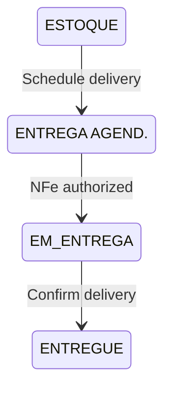
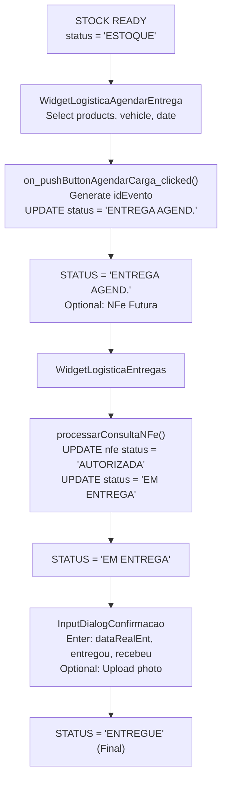
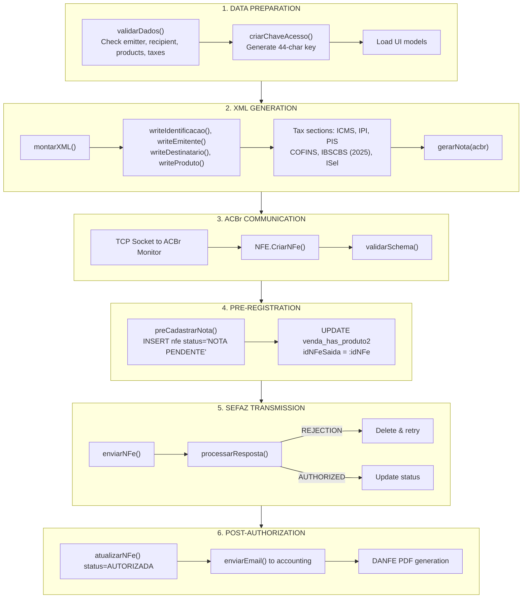
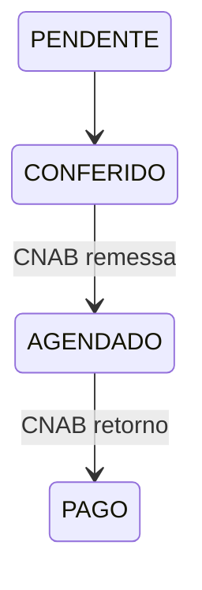
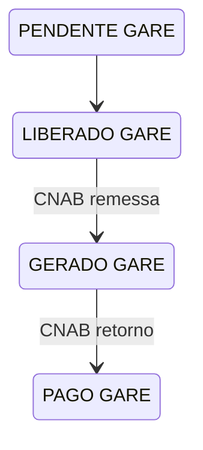
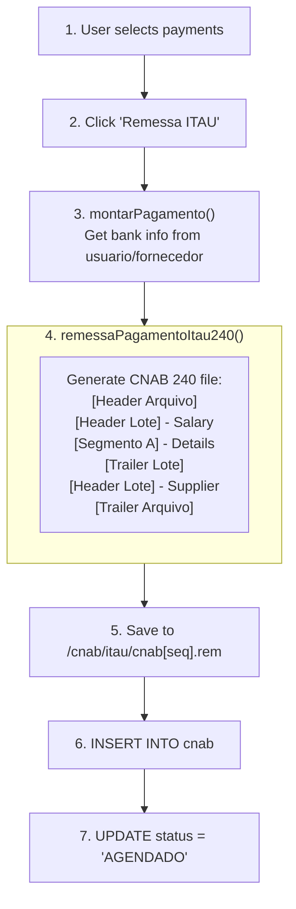
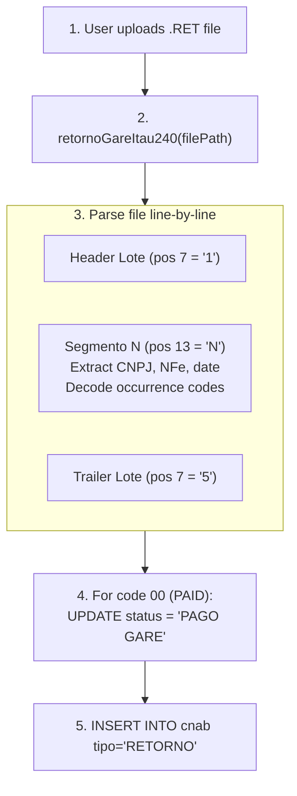
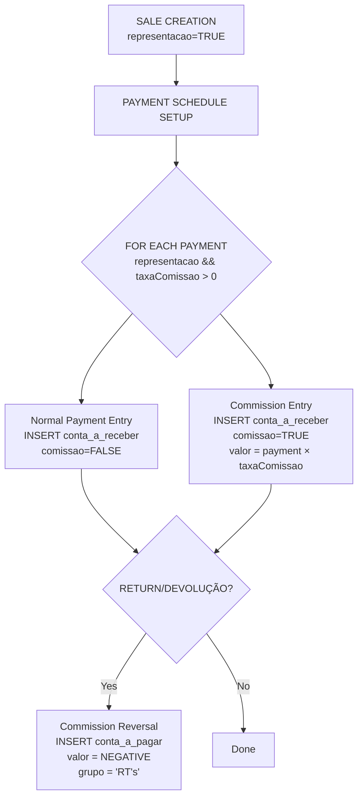

# Delivery, NFe Emission & Financial Flows - Deep Analysis

> Status: **Complete**
> Last updated: 2025-12-27
> Source: Deep analysis of C++ codebase

---

## Table of Contents

1. [Delivery (Entrega) Flow](#1-delivery-entrega-flow)
2. [NFe Emission (Saída) Flow](#2-nfe-emission-saída-flow)
3. [CNAB/Bank Reconciliation Flow](#3-cnabbank-reconciliation-flow)
4. [Commission (RT) Calculation Flow](#4-commission-rt-calculation-flow)

---

## 1. Delivery (Entrega) Flow

### Status Transitions



### Complete Flow Diagram



### Key Tables

| Table | Purpose |
|-------|---------|
| `venda_has_produto2` | Main product status tracking |
| `pedido_fornecedor_has_produto2` | Purchase order parallel status |
| `veiculo_has_produto` | Delivery grouping by vehicle/event |
| `transportadora_has_veiculo` | Vehicle registry |

### Delivery Document Generation

Two Excel files generated from templates:
- `espelho_entrega.xlsx` → Delivery receipt
- `modelo_checklist.xlsx` → Physical verification checklist

### Broken Items Handling

```
User marks items as broken → dividirEntrega()
    │
    ├── Original line: ENTREGUE (reduced qty)
    ├── Broken line: QUEBRADO
    ├── Replacement line (optional): REPO. ENTREGA
    └── Credit record: Negative conta_a_receber entry
```

---

## 2. NFe Emission (Saída) Flow

### Entry Points

- **Types**: `Saida`, `Futura`, `SaidaAposFutura`, `Entrada`
- **Trigger**: User selects sale items → "Gerar NF-e" button
- **File**: `cadastrarnfe.cpp`

### Complete Emission Flow



### NFe Status Values

| Status | Meaning |
|--------|---------|
| `NOTA PENDENTE` | Pre-SEFAZ, waiting authorization |
| `AUTORIZADA` | SEFAZ approved |
| `DENEGADA` | SEFAZ denied |
| `CANCELADA` | Cancelled after authorization |

### NFe Cancellation Flow

```cpp
1. User enters justification (15-200 chars)
2. Command: NFE.CancelarNFe(<chaveAcesso>, <justificativa>)
3. Verify: xEvento=Cancelamento registrado
4. UPDATE nfe SET status = 'CANCELADA'
5. UPDATE venda_has_produto2 SET status = 'ENTREGA AGEND.', idNFeSaida = NULL
```

### 2025 Tax Reform (IBS/CBS/IS)

New XML sections added:
- `[IBSCBS###]` - IBS (state+municipal) and CBS (federal)
- `[gIBSUF###]` - State IBS
- `[gIBSMun###]` - Municipal IBS
- `[gCBS###]` - Federal CBS
- `[ISel###]` - Selective tax

---

## 3. CNAB/Bank Reconciliation Flow

### Overview

CNAB (Centro Nacional de Automação Bancária) is the Brazilian bank file standard.

- **CNAB 240**: 240-character fixed-width records
- **Bank**: Itaú (code 341) - only bank implemented

### File Types

| Type | Direction | Purpose |
|------|-----------|---------|
| **Remessa** | Outgoing | Payment instructions to bank |
| **Retorno** | Incoming | Payment confirmations from bank |

### Payment Status Flow



### GARE (Tax) Status Flow



### Remessa Generation Flow



### Retorno Processing Flow



### Key Occurrence Codes

| Code | Meaning |
|------|---------|
| 00 | PAGAMENTO EFETUADO (Payment Completed) |
| BD | PAGAMENTO AGENDADO (Payment Scheduled) |
| CE | PAGAMENTO CANCELADO (Payment Cancelled) |
| SS | CANCELADO POR INSUFICIÊNCIA DE SALDO (Insufficient Balance) |

### Not Implemented

- Boleto generation (TODO in code)
- CNAB 400 format
- Banks other than Itaú

---

## 4. Commission (RT) Calculation Flow

### Formula

```
Commission = Sale Value × (Commission Percentage / 100)
```

- **Only for REPRESENTAÇÃO sales**: `venda.representacao = TRUE`
- **Percentage stored in**: `profissional.comissao` (DECIMAL 15,4)
- **Default**: 5% if not set

### When Commission is Created

**At payment creation** (not at sale or delivery):

```cpp
// venda.cpp:1836-1877
const double taxaComissao = query.value("comissaoLoja").toDouble() / 100;
const bool calculaComissao = (taxaComissao > 0 && isRepresentacao && observacao != "FRETE");

if (calculaComissao) {
    const double valorBase = payment.valor;
    const double valorComissao = valorBase * taxaComissao;
    // Create entry in conta_a_receber_has_pagamento with comissao = TRUE
}
```

### Storage Tables

**Receivables** (`conta_a_receber_has_pagamento`):
- `comissao = TRUE` flag
- `grupo = "Comissão Representação"`
- `dataPagamento = payment_date + 1 month`

**Payables for Reversals** (`conta_a_pagar_has_pagamento`):
- Negative value for return clawbacks
- `grupo = "RT's"`

### Commission Reversal on Returns

```cpp
// devolucao.cpp:485-534
void criarComissaoProfissional() {
    const double rt = queryVenda.value("rt").toDouble();
    const double valor = (prcUn * quant) * (rt / 100) * -1;  // NEGATIVE

    INSERT INTO conta_a_pagar_has_pagamento (
        idVenda = idDevolucao,
        contraParte = profissional_name,
        valor = valor,  // Negative amount
        grupo = "RT's",
        dataPagamento = quinzena_date  // 15th or 30th
    )
}
```

### Complete Flow Diagram



### The "Profissional" Entity

```sql
CREATE TABLE profissional (
    idProfissional INT AUTO_INCREMENT,
    idLoja INT,
    nome_razao VARCHAR(100),
    comissao DECIMAL(15,4),    -- Commission percentage
    banco, agencia, cc,        -- Bank info for payment
    cpf / cnpj,                -- Tax ID
    desativado TINYINT(1)
)
```

---

## Summary

All 4 critical flows are now documented:

| Flow | Key Files | Status |
|------|-----------|--------|
| Delivery | `widgetlogistica*.cpp`, `inputdialogconfirmacao.cpp` | Complete |
| NFe Emission | `cadastrarnfe.cpp`, `acbr.cpp` | Complete |
| CNAB/Bank | `cnab.cpp`, `widgetfinanceirocontas.cpp` | Complete |
| Commission | `venda.cpp`, `devolucao.cpp`, `cadastroprofissional.cpp` | Complete |
