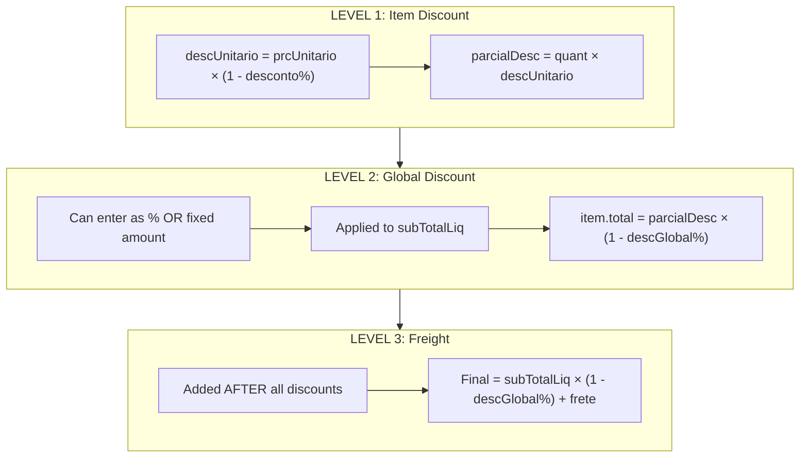
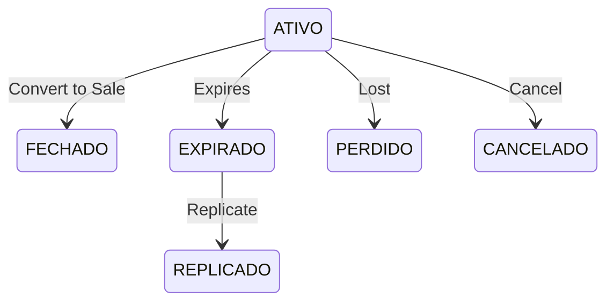
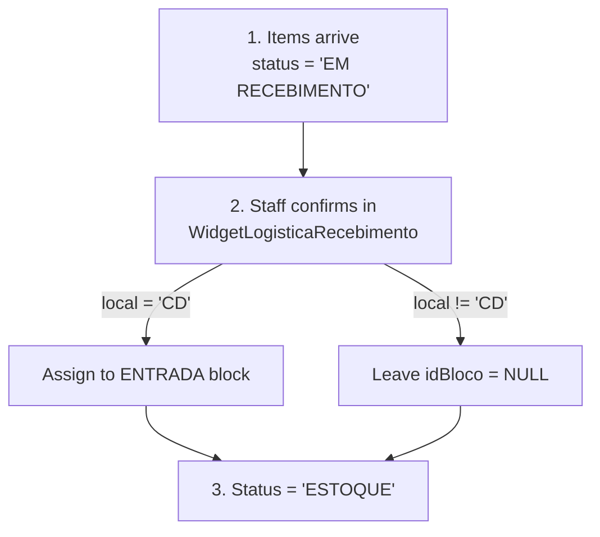
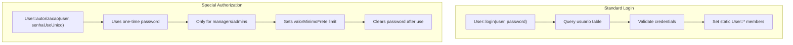

# Cadastros, Orçamento, Warehouse & Permissions - Complete Analysis

> Status: **Complete**
> Last updated: 2025-12-27
> Source: Deep analysis of C++ codebase

---

## Table of Contents

1. [Cadastros (Master Data)](#1-cadastros-master-data)
2. [Orçamento (Budget/Quote)](#2-orçamento-budgetquote)
3. [Galpão (Warehouse)](#3-galpão-warehouse)
4. [User Permissions](#4-user-permissions)

---

## 1. Cadastros (Master Data)

### 1.1 Fornecedor (Supplier)

**Key Fields:**
```sql
idFornecedor (PK)
razaoSocial, nomeFantasia     -- Business names
cnpj (UNIQUE)                 -- Tax ID
inscEstadual                  -- State registration
banco, agencia, cc            -- Banking info
comissao1, comissao2          -- Commission rates
representacao                 -- Is representative?
fretePagoLoja                -- Who pays freight
vemDoSul                     -- Origin from south
desativado                   -- Soft delete flag
```

**Relationships:**
- `fornecedor_has_endereco` - Multiple addresses
- `produto` - One-to-many (supplier's products)
- `pedido_fornecedor` - Purchase orders

**Validation:**
- CNPJ format: `99.999.999/9999-99`
- Soft delete via `desativado` flag

---

### 1.2 Cliente (Customer)

**Key Fields:**
```sql
idCliente (PK)
pfpj                          -- PF (individual) or PJ (company)
nome_razao, nomeFantasia
cpf (UNIQUE) / cnpj (UNIQUE)  -- Tax IDs
credito (DECIMAL 15,4)        -- Available credit balance
idProfissionalRel             -- Linked sales rep
incompleto                    -- Incomplete registration flag
```

**Relationships:**
- `cliente_has_endereco` - Delivery + billing addresses
- `orcamento` - Customer quotes
- `venda` - Customer sales
- Self-referential (parent customer)

**Validation:**
- CPF format: `999.999.999-99`
- CNPJ format: `99.999.999/9999-99`
- CEP lookup via Qualp API with geolocation

---

### 1.3 Produto (Product)

**Key Fields:**
```sql
idProduto (PK)
idFornecedor (FK)             -- Supplier link
fornecedor                    -- Denormalized name
descricao                     -- Full-text indexed
codComercial                  -- Commercial code
codBarras                     -- Barcode

-- Pricing
custo                         -- Cost price
precoVenda                    -- Sale price
markup                        -- Auto-calculated

-- Tax
ncm                           -- NCM classification
cst                           -- ICMS tax code
icms                          -- ICMS percentage
st, sticms, mva               -- Tax substitution

-- Stock
estoqueRestante               -- Available stock
quantCaixa                    -- Units per box
temLote                       -- Batch tracking
```

**Validation:**
- `fornecedor + codComercial` must be unique
- Markup auto-calculated from cost/price
- Discontinuation on zero stock

---

### 1.4 Transportadora (Carrier)

**Key Fields:**
```sql
idTransportadora (PK)
razaoSocial, nomeFantasia
cnpj (UNIQUE)
antt                          -- ANTT registration
```

**Relationships:**
- `transportadora_has_endereco` - Addresses
- `transportadora_has_veiculo` - Vehicles (modelo, placa, capacidade)
- `veiculo_has_produto` - Delivery tracking with GPS

---

## 2. Orçamento (Budget/Quote)

### 2.1 Table Structure

**Main Table: `orcamento`**
```sql
idOrcamento (PK)
idCliente, idProfissionalRel, idUsuario
dataEmissao                   -- Emission date
validade                      -- Days valid (default: 7)
status                        -- ATIVO, EXPIRADO, REPLICADO, FECHADO, PERDIDO
representacao                 -- Is RT sale?

-- Totals
subTotalBru                   -- Before any discounts
subTotalLiq                   -- After item discounts
descontoPorc / descontoReais  -- Global discount
frete                         -- Freight charge
total                         -- Final total
```

**Line Items: `orcamento_has_produto`**
```sql
idOrcamentoProduto (PK)
idOrcamento (FK)
idProduto (FK)

-- Pricing
prcUnitario                   -- Unit price
desconto                      -- Item discount %
descUnitario                  -- Price after discount
parcial                       -- qty × prcUnitario
parcialDesc                   -- qty × descUnitario
descGlobal                    -- Global discount applied
total                         -- Final line total
```

### 2.2 Three-Level Discount System



### 2.3 Status Lifecycle



### 2.4 Validity Rules

- **Default validity**: 7 days from emission
- **Expiration check**: `serverDate > dataEmissao + validade`
- **When expired**:
  - UI becomes read-only
  - Cannot edit items
  - Cannot generate sale
  - CAN replicate (creates new quote with today's date)

### 2.5 Freight Calculation

```cpp
IF manual freight: use entered value
ELSE:
  fretePorcentagem = subTotalBruto × porcentagemFrete / 100
  freteMaior = MAX(fretePorcentagem, minimoFrete)
  freteQualp = CalculoFrete.getFrete()  // External API
  finalFrete = MAX(freteMaior, freteQualp)

  IF user is manager:
    minimoGerente = MIN(freteQualp, freteMaior) × 1.2
```

### 2.6 Orçamento → Venda Conversion

**Trigger**: `on_pushButtonGerarVenda_clicked()`

**Validations**:
1. Quote not expired
2. Delivery address selected
3. Customer registration complete

**Process**:
1. Copy header: cliente, vendedor, endereços, valores
2. Copy items: `orcamento_has_produto` → `venda_has_produto`
3. Trigger creates `venda_has_produto2` (L2)
4. Set item status: ESTOQUE if stock exists, else PENDENTE
5. Mark orçamento as FECHADO

---

## 3. Galpão (Warehouse)

### 3.1 Block Structure

**Table: `galpao`**
```sql
idBloco (PK)
label                         -- "ENTRADA", "A1", "B2", etc.
posicao                       -- "x,y" coordinates
tamanho                       -- "width,height" dimensions
```

### 3.2 Special Block: ENTRADA

**Purpose**: Receiving zone for incoming inventory

```cpp
// Required for receiving process
SELECT idBloco FROM galpao WHERE label = 'ENTRADA'
// Items in EM RECEBIMENTO cannot be moved
```

### 3.3 Stock Location Assignment

**Two Tables Track Location:**

```sql
-- Warehouse-owned inventory
estoque.idBloco → galpao.idBloco

-- Customer-allocated inventory
estoque_has_consumo.idBloco → galpao.idBloco
```

### 3.4 Receiving Flow



### 3.5 Stock Movement

```cpp
// Move items between blocks
on_pushButtonMover_clicked() {
    for each selected item:
        if (tipo == "EST. LOJA"):
            UPDATE estoque SET idBloco = :newBlock
        if (tipo == "CLIENTE"):
            UPDATE estoque_has_consumo SET idBloco = :newBlock
}
```

**Movement Types:**
- `EST. LOJA` - Store inventory (estoque table)
- `CLIENTE` - Customer-allocated (estoque_has_consumo table)

**Restriction**: Cannot move FROM "EM RECEBIMENTO" block

### 3.6 Visual Interface

- Qt Graphics Scene for warehouse map
- Background image from WebDAV
- PalletItem graphics for each block
- Click to select and show contents
- Highlight blocks with selected items

---

## 4. User Permissions

### 4.1 User Table Structure

```sql
CREATE TABLE usuario (
    idUsuario (PK)
    idLoja (FK)               -- Store assignment
    user (UNIQUE)             -- Login username
    password                  -- SHA hash
    tipo                      -- Role type
    nome                      -- Display name
    senhaUsoUnico             -- One-time authorization password
    valorMinimoFrete          -- Freight authorization limit
    desativado                -- Account disabled flag
)
```

### 4.2 User Roles (tipo)

| Role | Description | Access Level |
|------|-------------|--------------|
| ADMINISTRADOR | Full system admin | Full |
| DIRETOR | Director | Full |
| ADMINISTRATIVO | Administrative staff | High |
| GERENTE LOJA | Store manager | Medium-High |
| GERENTE DEPARTAMENTO | Department manager | Medium-High |
| GERENTE FINANCEIRO | Financial manager | Medium-High |
| VENDEDOR | Salesperson | Low |
| VENDEDOR ESPECIAL | Special salesperson | Low-Medium |
| OPERACIONAL | Operations staff | Low |
| ASSISTENTE ADMINISTRATIVO | Admin assistant | Low |

### 4.3 Permission Table

```sql
CREATE TABLE usuario_has_permissao (
    idUsuario (PK, FK)

    -- Module Access (11 tabs)
    view_tab_orcamento, view_tab_venda, view_tab_compra,
    view_tab_logistica, view_tab_nfe, view_tab_estoque,
    view_tab_galpao, view_tab_financeiro, view_tab_relatorio,
    view_tab_grafico, view_tab_rh

    -- WebDAV Folder Access
    webdav_documentos, webdav_compras, webdav_financeiro,
    webdav_rh, webdav_obras, webdav_logistica

    -- Feature Permissions
    ajusteFrete               -- Can adjust freight
)
```

### 4.4 Role Check Methods

```cpp
// Static methods in User class
User::isAdmin()              // ADMINISTRADOR or DIRETOR
User::isAdministrativo()     // ADMIN, ADMINISTRATIVO, or DIRETOR
User::isGerente()            // Any GERENTE type
User::isVendedor()           // VENDEDOR
User::isVendedorOrEspecial() // VENDEDOR or VENDEDOR ESPECIAL
User::isOperacional()        // OPERACIONAL

// Dynamic permission check
User::temPermissao("view_tab_financeiro")
```

### 4.5 Authorization Flow



### 4.6 Store Access Control

- Each user assigned to ONE store (idLoja)
- Store-specific limits via `User::fromLoja()`
- Examples:
  - `tetoProfissionalRT` - Professional commission ceiling
  - `valorMinimoFrete` - Minimum freight value
  - `porcentagemFrete` - Freight percentage

### 4.7 Feature-Level Access

| Feature | Required Permission |
|---------|---------------------|
| User management | `isAdmin()` |
| Product deactivation | `isAdministrativo()` |
| Freight adjustment | `ajusteFrete` permission |
| Email/NFe config | `isAdministrativo()` |
| Commission ceiling | `isAdmin()` to exceed store limit |

---

## Summary

All remaining flows are now documented:

| Flow | Key Tables | Files |
|------|------------|-------|
| Cadastros | fornecedor, cliente, produto, transportadora | cadastro*.cpp |
| Orçamento | orcamento, orcamento_has_produto | orcamento.cpp |
| Galpão | galpao, estoque.idBloco | widgetgalpao.cpp |
| Permissions | usuario, usuario_has_permissao | user.cpp, logindialog.cpp |

**Documentation now covers 100% of business flows.**
