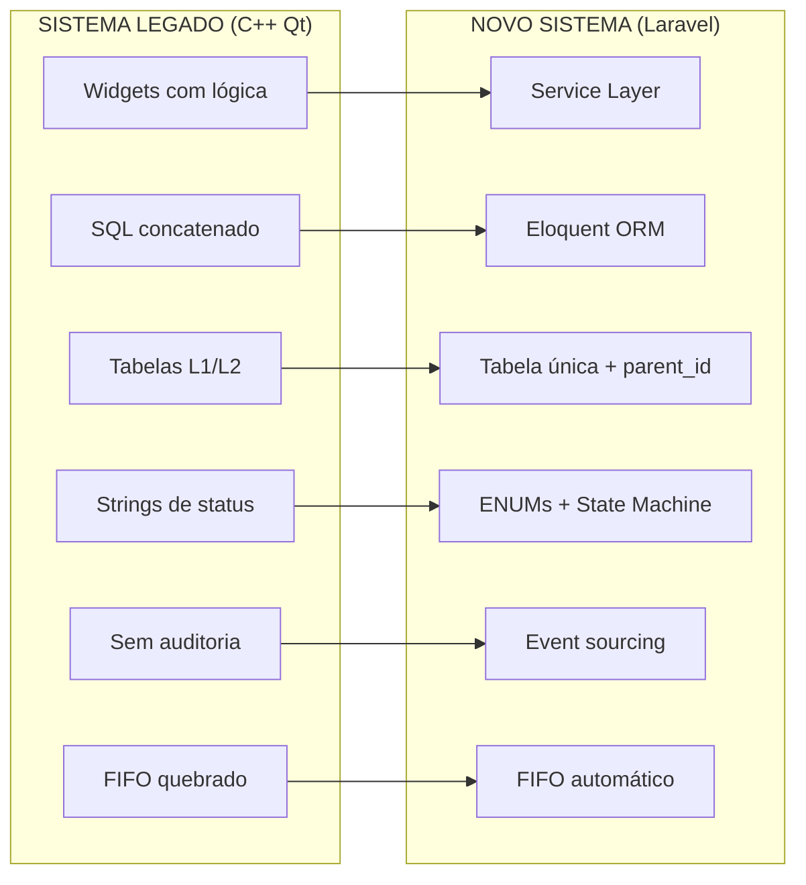

# Comparativo: Sistema Legado vs Novo Sistema

> Status: **Consolidado**
> Última atualização: 2025-12-28
> Propósito: Visão unificada das diferenças entre C++ Qt Desktop e Laravel Web

---

## Resumo Executivo

| Aspecto | Sistema Legado (C++ Qt) | Novo Sistema (Laravel) |
|---------|------------------------|------------------------|
| **Arquitetura** | Desktop monolítico | Web com Service Layer |
| **Banco de Dados** | MySQL/MariaDB | PostgreSQL 16 |
| **Frontend** | Qt Widgets | Inertia + Vue.js |
| **Estrutura de Dados** | Tabelas L1/L2 | Tabela única + parent_id |
| **Status** | Strings mágicas | ENUMs PostgreSQL |
| **Auditoria** | Flags *Upd | Event sourcing / audit_log |
| **Estoque FIFO** | Não implementado | FIFO automático |
| **NFe** | ACBrLib (DLL) | sped-nfe ou SaaS |

---

## 1. Arquitetura de Código

### 1.1 Organização do Código

| Aspecto | Legado | Novo |
|---------|--------|------|
| **Lógica de negócio** | Espalhada em Widgets/Dialogs | Service Layer dedicada |
| **Estado global** | Macro `qApp` (DB, config, sessão) | Dependency Injection |
| **SQL** | Strings concatenadas (SQL injection!) | Eloquent ORM + queries parametrizadas |
| **Validação** | Manual, inconsistente | Form Requests |
| **Testes** | Mínimo | PHPUnit + Pest |

**Legado - Lógica em Widget:**
```cpp
// Lógica espalhada em WidgetCompra, CadastroProduto, Venda, etc.
void WidgetCompraConfirmar::confirmarCompra() {
    query.exec("UPDATE pedido_fornecedor SET status = 'CONFIRMADO'...");
    // + lógica de estoque
    // + lógica financeira
    // + lógica de NFe
}
```

**Novo - Service Layer:**
```php
// app/Services/Compras/CompraService.php
class CompraService
{
    public function confirmar(Compra $compra): void
    {
        DB::transaction(function () use ($compra) {
            $compra->update(['status' => CompraStatus::CONFIRMADO]);
            event(new CompraConfirmada($compra));
        });
    }
}

// Listeners separados para cada responsabilidade
// GerarContasPagarListener, AtualizarEstoqueListener, etc.
```

### 1.2 Segurança SQL

| Aspecto | Legado | Novo |
|---------|--------|------|
| **Queries** | 30+ arquivos com concatenação de string | Eloquent + bindings |
| **Vulnerabilidades** | SQL Injection em vários pontos | Queries parametrizadas |

**Legado - Vulnerável:**
```cpp
// VULNERÁVEL - compraavulsa.cpp:350
query.exec("SELECT * FROM nfe WHERE idNFe = " + ui->itemBoxNFe->getId().toString());

// VULNERÁVEL - cadastrofornecedor.cpp
query.exec("UPDATE produto SET fornecedor = '" + data("razaoSocial").toString() + "'");
```

**Novo - Seguro:**
```php
// Eloquent - seguro por padrão
Nfe::find($id);
Produto::where('fornecedor_id', $fornecedorId)->update([...]);
```

---

## 2. Schema de Banco de Dados

### 2.1 Arquitetura de Tabelas L1/L2

| Aspecto | Legado (L1/L2) | Novo (Tabela Única) |
|---------|----------------|---------------------|
| **Estrutura** | 2 tabelas + idRelacionado | 1 tabela + parent_id/root_id |
| **Complexidade** | Alta (sync, triggers) | Baixa (auto-referência) |
| **Queries** | JOINs complexos, CTEs recursivas | Query simples |
| **Splits** | idRelacionado confuso | root_id claro |
| **Sincronização** | Bugs frequentes | Não necessária |

**Legado - Duas Tabelas:**
```sql
-- Estrutura atual
venda_has_produto (L1)     -- O que foi pedido
    idVendaProduto (PK)
    idVenda (FK)
    idProduto (FK)
    quant, preço, total    -- Agregado

venda_has_produto2 (L2)    -- Como está sendo atendido
    idVendaProduto2 (PK)
    idVendaProdutoFK (FK → L1)
    idRelacionado          -- Auto-ref para splits (confuso!)
    quant, status, datas   -- Por-entrega

-- Query complexa para buscar itens com splits
SELECT vp1.*, vp2.*
FROM venda_has_produto vp1
JOIN venda_has_produto2 vp2 ON vp1.idVendaProduto = vp2.idVendaProdutoFK
WHERE vp1.idVenda = :id
  OR vp2.idRelacionado IN (SELECT ...) -- Pesadelo recursivo
```

**Novo - Tabela Única:**
```sql
-- Nova estrutura
venda_itens
    id (PK)
    venda_id (FK)
    produto_id (FK)
    parent_id (FK → self)  -- Item que foi dividido
    root_id (FK → self)    -- Item original da cadeia
    quantidade, preco, total
    status, datas

-- Query simples
SELECT * FROM venda_itens WHERE venda_id = :id;

-- Buscar splits de um item
SELECT * FROM venda_itens WHERE root_id = :item_id OR id = :item_id;
```

### 2.2 Consumo de Estoque FIFO

| Aspecto | Legado | Novo |
|---------|--------|------|
| **Seleção** | Manual via `produto.idEstoque` | FIFO automático |
| **Múltiplos lotes** | Não suportado | Consome de vários |
| **Concorrência** | Condições de corrida | `FOR UPDATE` lock |
| **Rastreabilidade** | Perdida | Lote completo |
| **Validade** | Ignorada | Suporte a FEFO |

**Legado - Sem FIFO:**
```cpp
// venda.cpp:1046 - Pega qualquer estoque pré-definido
query.exec("SELECT * FROM estoque WHERE idEstoque = " + produto.idEstoque);
// Ignora data de entrada, sempre usa o mesmo lote
```

**Novo - FIFO Correto:**
```sql
-- Função PostgreSQL para consumo FIFO
SELECT id, quantidade_disponivel
FROM estoques
WHERE produto_id = :produto_id
  AND loja_id = :loja_id
  AND quantidade_disponivel > 0
ORDER BY data_entrada ASC  -- FIFO: mais antigo primeiro
FOR UPDATE;  -- Trava para concorrência
```

```php
// Laravel Service
class EstoqueConsumoService
{
    public function consumirFifo(int $produtoId, float $quantidade): array
    {
        return DB::transaction(function () use ($produtoId, $quantidade) {
            $estoques = Estoque::where('produto_id', $produtoId)
                ->where('quantidade_disponivel', '>', 0)
                ->orderBy('data_entrada')  // FIFO
                ->lockForUpdate()          // Segurança
                ->get();

            // Consumir de múltiplos lotes se necessário
            foreach ($estoques as $estoque) {
                $consumir = min($restante, $estoque->quantidade_disponivel);
                // ...
            }
        });
    }
}
```

### 2.3 Referências de Fornecedor

| Aspecto | Legado | Novo |
|---------|--------|------|
| **Armazenamento** | VARCHAR repetido em 9 tabelas | INT FK único |
| **Renomeação** | Atualizar 9 tabelas manualmente | Atualizar 1 tabela |
| **Integridade** | Nenhuma (órfãos possíveis) | Constraint FK |
| **Velocidade** | Comparação de string | Comparação de INT |
| **Erros de digitação** | Quebram queries silenciosamente | Impossíveis |
| **JOINs** | Por string (lento) | Por FK (rápido) |

**Legado - Desnormalizado:**
```sql
-- Nome duplicado em todo lugar
venda_has_produto2.fornecedor = 'ACME Corp'
estoque.fornecedor = 'ACME Corp'
pedido_fornecedor_has_produto2.fornecedor = 'ACME Corp'
-- ... mais 6 tabelas

-- Se fornecedor muda de nome: UPDATE em 9 tabelas!
```

**Novo - Normalizado:**
```sql
-- FK em todo lugar
venda_itens.fornecedor_id → fornecedores.id
estoques.fornecedor_id → fornecedores.id

-- Renomear: UPDATE apenas na tabela fornecedores
UPDATE fornecedores SET razao_social = 'Novo Nome' WHERE id = 123;
```

### 2.4 Valores de Status

| Aspecto | Legado | Novo |
|---------|--------|------|
| **Tipo** | VARCHAR (strings mágicas) | ENUM PostgreSQL |
| **Validação** | Nenhuma | Constraint de banco |
| **Erros de digitação** | Bugs silenciosos | Erro imediato |
| **Transições** | Qualquer → Qualquer | Máquina de estados |

**Legado - Strings Mágicas:**
```cpp
if (status == "PENDENTE") ...
if (status == "EM ENTREGA") ...
if (status == "PEND. APROV.") ...  // Fácil errar digitação!

// Status inconsistentes entre tabelas
venda_has_produto2: PENDENTE, ESTOQUE, ENTREGA AGEND., EM ENTREGA, ENTREGUE
pedido_fornecedor_has_produto2: PENDENTE, CONFIRMADO, FATURADO, EM COLETA...
```

**Novo - ENUMs + State Machine:**
```sql
CREATE TYPE venda_item_status AS ENUM (
    'pendente',
    'em_compra',
    'estoque',
    'entrega_agendada',
    'em_entrega',
    'entregue',
    'devolvido',
    'cancelado'
);
```

```php
// PHP Enum com transições válidas
enum VendaItemStatus: string
{
    case PENDENTE = 'pendente';
    case ESTOQUE = 'estoque';
    case ENTREGUE = 'entregue';
    // ...

    public function allowedTransitions(): array
    {
        return match($this) {
            self::PENDENTE => [self::EM_COMPRA, self::ESTOQUE, self::CANCELADO],
            self::ESTOQUE => [self::ENTREGA_AGENDADA],
            // ...
        };
    }
}
```

### 2.5 Tabela Produto

| Aspecto | Legado | Novo |
|---------|--------|------|
| **Colunas** | 100+ colunas | ~30 colunas |
| **Preços** | Inline | Tabela separada (histórico) |
| **Impostos** | 50+ colunas inline | JSONB flexível |
| **Dimensões** | Inline | Tabela separada |

**Legado - Mega-tabela:**
```sql
-- 100+ colunas misturando tudo
produto (
    -- Dados principais (~10)
    idProduto, descricao, codComercial, codBarras...
    -- Preços (~8)
    custo, precoVenda, markup, oldPrecoVenda...
    -- Impostos (~50!)
    ncm, cst, icms, st, mva, ipi, pis, cofins,
    cClassTribIBSCBS, pAliqEfetIBSUF, pAliqEfetIBSMun... -- Reforma 2025
    -- Estoque (~5)
    estoqueRestante, quantCaixa, temLote...
    -- Flags *Upd (~20+)
    custoUpd, precoVendaUpd, icmsUpd...
)
```

**Novo - Separado:**
```sql
produtos (id, descricao, codComercial, codBarras, fornecedor_id, ...)

produto_precos (
    produto_id, custo, preco_venda, markup,
    vigencia_inicio, vigencia_fim  -- Histórico!
)

produto_impostos (
    produto_id, tipo, dados JSONB  -- Flexível para mudanças
)
```

### 2.6 Trilha de Auditoria

| Aspecto | Legado | Novo |
|---------|--------|------|
| **Rastreamento** | Flags *Upd booleanas | Event log completo |
| **Usuário** | Não rastreado | user_id em cada ação |
| **Timestamp** | Não | created_at em eventos |
| **Valor anterior** | Perdido | old_values JSONB |
| **Histórico** | Impossível reconstruir | Point-in-time queries |

**Legado - Sem Auditoria:**
```sql
-- Apenas flags booleanas
produto.custoUpd = TRUE  -- Mas quem? quando? valor anterior?
```

**Novo - Auditoria Completa:**
```sql
audit_log (
    id, table_name, record_id, action,
    old_values JSONB, new_values JSONB,
    user_id, created_at
)

-- Trigger automático em todas as tabelas importantes
```

---

## 3. Frontend

| Aspecto | Legado | Novo |
|---------|--------|------|
| **Framework** | Qt Widgets (C++) | Inertia + Vue.js |
| **Plataforma** | Desktop Windows | Web (qualquer dispositivo) |
| **UI Components** | .ui files (Qt Designer) | Vue Components |
| **Reatividade** | Signals/Slots | Vue Reactivity |
| **Tabelas** | QTableView + Models | DataTables ou AG-Grid |
| **Impressão** | LimeReport | PDF via Laravel |

---

## 4. Módulos Específicos

### 4.1 Compras

| Aspecto | Legado | Novo |
|---------|--------|------|
| **Classes** | 5 widgets C++ | 1 CompraService |
| **Fluxo** | Espalhado em UI | Máquina de estados |
| **Eventos** | Nenhum | CompraConfirmada, CompraRecebida... |
| **Financeiro** | Código inline | Listener separado |
| **Estoque** | Código inline | Listener separado |

### 4.2 NFe

| Aspecto | Legado | Novo |
|---------|--------|------|
| **Integração** | ACBrLib (DLL Windows) | sped-nfe ou SaaS |
| **Plataforma** | Windows only | Cross-platform |
| **Manutenção** | Atualizações manuais | Gerenciado pelo provedor |
| **Certificado** | Arquivo local | Gerenciado |

---

## 5. Matriz de Comparação Geral

| Critério | L1/L2 Atual | Opção Achatar | Derivar L1 | Event Sourcing |
|----------|-------------|---------------|------------|----------------|
| **Complexidade** | Alta | Baixa | Média | Alta |
| **Simplicidade de query** | Complexa | Simples | Simples | Complexa |
| **Problemas de sync** | Sim | Não | Não | Não |
| **Rastreamento de splits** | Confuso | Claro (root_id) | Claro | Histórico completo |
| **Performance** | Média | Boa | Boa (cacheada) | Precisa otimização |
| **Esforço de migração** | N/A | Médio | Médio | Alto |
| **Trilha de auditoria** | Ruim | Pode adicionar | Pode adicionar | Built-in |

**Recomendação**: Opção Achatar (tabela única com parent_id/root_id)

---

## 6. Resumo Visual



---

## 7. Benefícios da Migração

| Área | Benefício |
|------|-----------|
| **Segurança** | Elimina SQL injection, queries parametrizadas |
| **Manutenibilidade** | Service layer, código testável |
| **Acessibilidade** | Web = qualquer dispositivo, qualquer lugar |
| **Integridade** | FKs, ENUMs, constraints no banco |
| **Auditoria** | Histórico completo de mudanças |
| **Performance** | Queries mais simples, índices melhores |
| **Escalabilidade** | Horizontal scaling, cache, filas |
| **Testabilidade** | PHPUnit, Pest, mocks fáceis |

---

## Documentos Relacionados

- [01-plano-migracao.md](./01-plano-migracao.md) - Fases da migração
- [03-melhorias.md](./03-melhorias.md) - Pontos de dor detalhados
- [04-simplificacao-l1l2.md](./04-simplificacao-l1l2.md) - Análise L1/L2
- [05-correcao-fifo.md](./05-correcao-fifo.md) - Implementação FIFO
- [06-normalizacao-fornecedor.md](./06-normalizacao-fornecedor.md) - FKs
- [07-esquema-redesenhado.md](./07-esquema-redesenhado.md) - Schema novo
- [08-design-greenfield.md](./08-design-greenfield.md) - Design do zero
