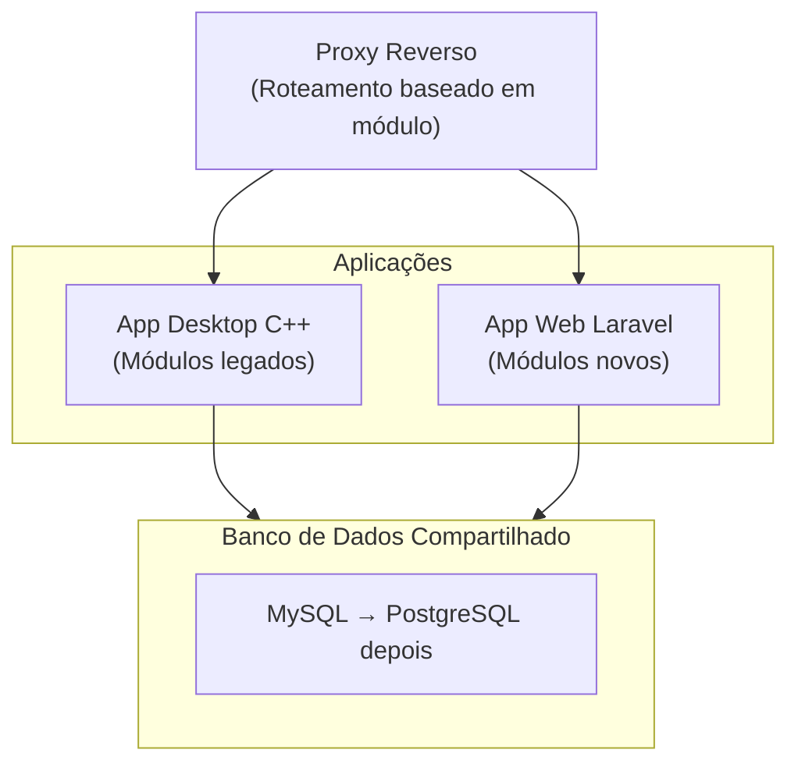
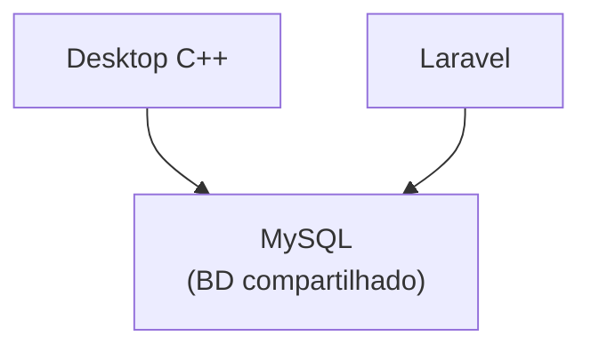

# Plano de Migração

> Status: **Rascunho**
> Última atualização: 2025-12-27

---

## Opções de Estratégia

### Opção 1: Reescrita Big Bang

**Abordagem**: Construir sistema novo completo, migrar tudo de uma vez.

| Prós | Contras |
|------|---------|
| Começar do zero | Alto risco |
| Sem restrições do legado | Longo tempo sem entrega de valor |
| Arquitetura consistente | Tudo ou nada |
| Migração de dados mais simples | Equipe bloqueada em bugs antigos |

**Prazo**: 6-12 meses
**Risco**: ALTO

---

### Opção 2: Padrão Strangler Fig (Recomendado)

**Abordagem**: Substituir gradualmente o sistema antigo, peça por peça.

| Prós | Contras |
|------|---------|
| Valor incremental | Complexidade temporária |
| Menor risco | Necessidade de manter dois sistemas |
| Pode validar abordagem cedo | Desafios de sincronização de dados |
| Equipe aprende enquanto desenvolve | Algum código duplicado |

**Prazo**: 12-18 meses
**Risco**: MÉDIO

---

### Opção 3: Execução Paralela

**Abordagem**: Construir sistema novo enquanto o antigo roda, espelhar dados, fazer a virada.

| Prós | Contras |
|------|---------|
| Menor risco | Mais caro |
| Validação completa antes da virada | Infraestrutura duplicada |
| Rollback fácil | Complexidade de sincronização de dados |
| Usuários podem comparar | Maior prazo |

**Prazo**: 18-24 meses
**Risco**: BAIXO

---

## Abordagem Recomendada: Strangler Fig

### Por quê?
1. **Validação antecipada** - Saber se a abordagem funciona antes do compromisso total
2. **Entrega contínua** - Usuários recebem valor incrementalmente
3. **Aprendizado da equipe** - Desenvolver habilidades em módulos mais simples primeiro
4. **Mitigação de riscos** - Pode ajustar o curso baseado nos aprendizados

---

## Plano de Fases

### Fase 0: Fundação (Mês 1-2)

**Objetivo**: Configurar infraestrutura e padrões.

**Tarefas**:
- [ ] Criar projeto Laravel com stack escolhida
- [ ] Configurar banco de dados PostgreSQL
- [ ] Implementar autenticação (usuários do BD legado)
- [ ] Criar componentes base de UI (layout, navegação)
- [ ] Configurar pipeline CI/CD
- [ ] Configurar ambiente de desenvolvimento

**Entregas**:
- App Laravel funcionando com login
- Ambiente de desenvolvimento para equipe
- Padrões de código documentados

---

### Fase 1: Cadastros (Mês 2-4)

**Objetivo**: Migrar gestão de dados mestres (CRUD mais simples).

**Módulos**:
1. Fornecedor
2. Cliente
3. Produto
4. Transportadora
5. NCM (Classificação fiscal)

**Por que começar aqui**:
- Operações CRUD simples
- Estabelece padrões
- Baixa complexidade de regras de negócio
- Fundação para outros módulos

**Tarefas**:
- [ ] Criar modelos Eloquent
- [ ] Construir validação de formulários (classes Request)
- [ ] Implementar controllers CRUD
- [ ] Criar componentes de UI (formulários, tabelas)
- [ ] Escrever testes
- [ ] Sincronização de dados com legado (se executando em paralelo)

**Critérios de Sucesso**:
- Usuários podem gerenciar fornecedores/clientes/produtos na web
- Dados permanecem sincronizados com app desktop
- Sem perda ou corrupção de dados

---

### Fase 2: Compras (Mês 4-6)

**Objetivo**: Migrar fluxo de compras.

**Componentes**:
- Criação de pedido de compra
- Fluxo de confirmação
- Vinculação de nota fiscal
- Recebimento de mercadoria

**Dependências**: Fase 1 (Cadastros)

**Tarefas**:
- [ ] Implementar CompraService
- [ ] Criar fluxo de status com eventos
- [ ] Construir visualizações de lista e detalhe de compras
- [ ] Integrar com geração de ContasPagar
- [ ] Criar entrada de Estoque no recebimento

**Critérios de Sucesso**:
- Ciclo completo de compras na web
- Contas a pagar geradas automaticamente
- Estoque atualizado no recebimento

---

### Fase 3: Estoque (Mês 6-8)

**Objetivo**: Migrar gestão de estoque.

**Componentes**:
- Entrada/recebimento de estoque
- Rastreamento de consumo
- Consultas de estoque
- Localização no galpão

**Dependências**: Fase 2 (Compras)

**Tarefas**:
- [ ] Implementar EstoqueService
- [ ] Lógica de consumo FIFO/LIFO
- [ ] Consultas e relatórios de níveis de estoque
- [ ] Gestão de blocos do galpão

**Critérios de Sucesso**:
- Visibilidade de estoque em tempo real
- Rastreamento de consumo preciso
- Atribuição de localização no galpão

---

### Fase 4: Financeiro (Mês 8-10)

**Objetivo**: Migrar gestão financeira.

**Componentes**:
- Contas a Pagar
- Contas a Receber
- Registro de pagamentos
- Conciliação bancária (CNAB)

**Dependências**: Fase 2 (Compras), Fase 5 (Vendas - parcial)

**Tarefas**:
- [ ] Implementar serviços financeiros
- [ ] Fluxo de pagamento
- [ ] Geração/importação de arquivos CNAB
- [ ] Relatórios financeiros

**Critérios de Sucesso**:
- Rastrear todas as contas a pagar/receber
- Processar pagamentos
- Gerar arquivos bancários

---

### Fase 5: Vendas (Mês 10-13)

**Objetivo**: Migrar fluxo de vendas (mais complexo).

**Componentes**:
- Criação de Orçamento
- Pedido de venda
- Alocação de estoque
- Agendamento de entrega
- Conclusão de vendas

**Dependências**: Fase 1, 3 (Cadastros, Estoque)

**Tarefas**:
- [ ] Implementar VendaService
- [ ] Conversão Orçamento → Venda
- [ ] Lógica de reserva de estoque
- [ ] Integração com Compras (geração automática)
- [ ] Integração com Financeiro (recebíveis)

**Critérios de Sucesso**:
- Ciclo completo de vendas
- Estoque alocado corretamente
- Financeiro gerado automaticamente

---

### Fase 6: NFe (Mês 13-15)

**Objetivo**: Migrar nota fiscal eletrônica.

**Componentes**:
- Emissão de NFe
- Cancelamento de NFe
- Importação de NFe (de fornecedores)
- Geração de DANFE

**Dependências**: Fase 5 (Vendas), Fase 2 (Compras)

**Tarefas**:
- [ ] Escolher e integrar provedor de NFe
- [ ] Implementar interface NfeService
- [ ] Construir fluxo de emissão
- [ ] Armazenamento e recuperação de XML
- [ ] Gestão de certificados

**Critérios de Sucesso**:
- Emitir NFe válida pela web
- Importar NFe de fornecedores
- Cálculos de impostos corretos

---

### Fase 7: Logística (Mês 15-16)

**Objetivo**: Migrar gestão de entregas.

**Componentes**:
- Calendário de entregas
- Planejamento de rotas
- Atribuição de transportadora
- Confirmação de entrega

**Dependências**: Fase 5 (Vendas)

**Tarefas**:
- [ ] Componente de calendário
- [ ] Agendamento de entregas
- [ ] Rastreamento de status

---

### Fase 8: Relatórios e Polimento (Mês 16-18)

**Objetivo**: Completar migração, aposentar legado.

**Tarefas**:
- [ ] Migrar todos os relatórios
- [ ] Treinamento de usuários
- [ ] Otimização de performance
- [ ] Aposentadoria do sistema legado
- [ ] Migração de banco de dados (MySQL → PostgreSQL)

---

## Estratégia de Migração de Banco de Dados

### Opção A: Banco de Dados Compartilhado (Recomendado para Strangler)

Ambos os sistemas leem/escrevem no mesmo banco de dados MySQL.

**Prós**: Sem necessidade de sincronização, dados consistentes
**Contras**: Mudanças de schema afetam ambos os sistemas

### Opção B: Migração para PostgreSQL Depois

1. Executar MySQL compartilhado durante a migração
2. Após todos os módulos migrados, mudar para PostgreSQL
3. Migração de dados única
4. Aposentar MySQL

---

## Mitigação de Riscos

| Risco | Mitigação |
|-------|-----------|
| Corrupção de dados durante sincronização | Testes extensivos, segurança transacional |
| Usuários confusos com dois sistemas | Comunicação clara, treinamento |
| Aumento de escopo | Limites de fase rigorosos |
| Problemas de integração NFe | Começar com SaaS, abstrair interface |
| Capacidade da equipe | Priorizar, adiar funcionalidades não essenciais |
| Problemas de performance | Testes de carga em cada fase |

---

## Métricas de Sucesso

### Por Fase
- [ ] Todas as funcionalidades operando
- [ ] Sem perda de dados
- [ ] Performance aceitável (< 2s carregamento de página)
- [ ] Cobertura de testes > 80%
- [ ] Aprovação de aceitação do usuário

### Geral
- [ ] Todos os módulos migrados
- [ ] Sistema legado aposentado
- [ ] Usuários treinados
- [ ] Transição sem downtime
- [ ] Redução de custos alcançada

---

## Requisitos de Equipe

| Papel | Responsabilidade |
|-------|-----------------|
| Tech Lead | Decisões de arquitetura, revisão de código |
| Dev Backend (1-2) | Serviços Laravel, API |
| Dev Frontend (1) | Componentes Vue/Livewire |
| DBA | Migração de banco de dados, otimização |
| QA | Testes, validação |
| Product Owner | Requisitos, priorização |

---

## Próximos Passos

1. **Decidir sobre framework frontend** → Ver [03-frontend.md](./03-frontend.md)
2. **Decidir sobre estratégia NFe** → Ver [04-modules/nfe.md](./04-modules/nfe.md)
3. **Configurar ambiente de desenvolvimento**
4. **Iniciar Fase 0**
