# Registros de Decisão de Arquitetura (ADR)

> Este arquivo rastreia decisões arquiteturais chave para o projeto de migração web.
> Formato: [Template ADR](https://adr.github.io/)

---

## Log de Decisões

| ID      | Decisão                             | Status        | Data       |
| ------- | ----------------------------------- | ------------- | ---------- |
| ADR-001 | Usar Laravel como framework backend | **Aceito**    | 2025-12-27 |
| ADR-002 | Usar PostgreSQL como banco de dados | **Aceito**    | 2025-12-27 |
| ADR-003 | Seleção de framework frontend       | **Aceito**    | 2025-12-28 |
| ADR-004 | Abordagem de integração NFe         | **Aceito**    | 2025-12-28 |
| ADR-005 | Estratégia de migração              | **Aceito**    | 2025-12-28 |
| ADR-006 | Abordagem de multi-tenancy          | **Aceito**    | 2025-12-28 |
| ADR-007 | Swoole / Laravel Octane             | **Adiado**    | 2025-12-28 |

---

## ADR-001: Usar Laravel como Framework Backend

### Status - ADR-001

**Aceito** - 2025-12-27

### Contexto - ADR-001

Necessidade de escolher um framework backend para a migração web. Opções consideradas:

- Laravel (PHP)
- Django (Python)
- .NET Core (C#)
- Node.js (Express/NestJS)

### Decisão - ADR-001

Usar **Laravel 11** como framework backend.

### Justificativa - ADR-001

1. **Maturidade do ecossistema PHP** para aplicações empresariais
2. **Eloquent ORM** excelente para relacionamentos complexos
3. **Funcionalidades built-in**: auth, filas, eventos, agendamento
4. **Comunidade forte** e ecossistema de pacotes
5. **Familiaridade da equipe** (curva de aprendizado PHP mais fácil assumida)
6. **Boas bibliotecas NFe** disponíveis em PHP (sped-nfe)

### Consequências - ADR-001

- Necessário hosting PHP 8.2+
- Equipe precisa treinamento em Laravel
- Pode aproveitar pacotes Composer

---

## ADR-002: Usar PostgreSQL como Banco de Dados

### Status - ADR-002

**Aceito** - 2025-12-27

### Contexto - ADR-002

Sistema atual usa MySQL/MariaDB. Avaliando opções de banco de dados:

- Manter MySQL/MariaDB
- Migrar para PostgreSQL
- Usar cloud-native (Aurora, Cloud SQL)

### Decisão - ADR-002

Migrar para **PostgreSQL 16**.

### Justificativa - ADR-002

1. **JSONB nativo** - melhor para dados fiscais flexíveis, atributos de produtos
2. **Tipos ENUM nativos** - campos de status type-safe
3. **Constraints CHECK** - regras de negócio a nível de banco de dados
4. **Full-text search** - `tsvector` built-in para busca de produtos
5. **Melhor concorrência** - MVCC lida com usuários simultâneos
6. **Suporte a schemas** - opção futura de multi-tenancy

### Consequências - ADR-002

- Esforço de migração do MySQL
- Algumas diferenças de sintaxe de query
- Necessário expertise em PostgreSQL
- Melhor manutenibilidade a longo prazo

---

## ADR-003: Seleção de Framework Frontend

### Status - ADR-003

**Aceito** - 2025-12-28

### Contexto - ADR-003

Necessidade de escolher abordagem frontend. Opções:

1. Livewire (renderizado no servidor)
2. Inertia + Vue
3. Inertia + React
4. SPA Completo + API

### Análise de Opções - ADR-003

Ver análise detalhada em [../tecnico/03-frontend.md](../tecnico/03-frontend.md)

| Critério                | Livewire   | Inertia+Vue | Inertia+React | SPA Completo      |
| ----------------------- | ---------- | ----------- | ------------- | ----------------- |
| Curva de aprendizado    | Baixa      | Média       | Média-Alta    | Alta              |
| Interatividade          | Média      | Alta        | Alta          | Máxima            |
| Complexidade            | Baixa      | Média       | Média         | Alta              |
| Habilidades necessárias | Apenas PHP | PHP + Vue   | PHP + React   | Equipes separadas |

### Decisão - ADR-003

Usar **Inertia.js + Vue 3** como stack frontend.

### Justificativa - ADR-003

1. **Experiência estilo SPA** sem complexidade de construir/versionar API separada
2. **Reatividade do Vue** lida bem com formulários complexos de ERP (multi-step, inline editing)
3. **Recarregamentos parciais** do Inertia reduzem transferência de dados
4. **TypeScript suportado** para segurança de tipos
5. **Ecossistema crescente** (PrimeVue para componentes, VueUse para composables)
6. **Curva de aprendizado razoável** - mais simples que SPA completo, mais poderoso que Livewire

### Stack Definida - ADR-003

| Componente   | Tecnologia       | Propósito                        |
| ------------ | ---------------- | -------------------------------- |
| Framework    | Inertia.js       | Integração Laravel ↔ Vue         |
| Frontend     | Vue 3            | Composition API, reatividade     |
| Tipagem      | TypeScript       | Segurança de tipos               |
| CSS          | Tailwind CSS     | Utility-first, produtividade     |
| Componentes  | PrimeVue         | Tabelas, formulários, diálogos   |
| Utilitários  | VueUse           | Composables reutilizáveis        |
| Build        | Vite             | Build rápido, HMR                |

### Consequências - ADR-003

**Positivas:**
- UX fluida estilo SPA para usuários acostumados ao desktop Qt
- Componentização facilita reutilização entre módulos
- TypeScript previne erros em tempo de desenvolvimento
- PrimeVue oferece componentes enterprise-ready (DataTable com edição inline)

**Negativas:**
- Equipe precisará aprender Vue 3 e TypeScript
- Build step necessário (Vite)
- Bundle inicial maior que Livewire puro

**Mitigações:**
- Treinamento inicial em Vue 3 Composition API
- Documentação de padrões de código Vue
- Lazy loading de rotas para reduzir bundle inicial

---

## ADR-004: Abordagem de Integração NFe

### Status - ADR-004

**Aceito** - 2025-12-28

### Contexto - ADR-004

Necessidade de integrar com sistema de nota fiscal eletrônica brasileiro (NFe).
Implementação atual usa ACBrMonitorPlus (Windows GUI) em máquina de usuário.
Servidor de produção é Linux headless (sem interface gráfica).

### Opções Avaliadas - ADR-004

| Opção                  | Prós                                                  | Contras                                          |
| ---------------------- | ----------------------------------------------------- | ------------------------------------------------ |
| **ACBrMonitorConsole** | Funciona em Linux headless, gratuito, comunicação TCP | Requer instalação/manutenção do ACBr             |
| **sped-nfe (PHP)**     | 100% PHP nativo, sem dependências externas            | Mais trabalho de dev, manutenção de XMLs         |
| ~~**ACBrLib**~~        | -                                                     | **Descartado**: Requer GUI (FortesReport)        |
| ~~**SaaS**~~           | -                                                     | **Fora de escopo**: Custo mensal, vendor lock-in |

### Decisão - ADR-004

#### Opção 1 (Recomendada): ACBrMonitorConsole

- Executar ACBrMonitorConsole no servidor Linux
- Comunicação via socket TCP (porta 3434)
- Implementar `AcbrNfeService` em Laravel como wrapper

#### Opção 2 (Alternativa): sped-nfe

- Biblioteca PHP nativa (nfephp-org/sped-nfe)
- Controle total sobre XMLs e assinaturas
- Usar se quiser eliminar dependência do ACBr

### Justificativa - ADR-004

1. **ACBrLib não funciona em Linux headless** - FortesReport requer X server
2. **ACBrMonitorConsole funciona em modo texto** - Solução comprovada da comunidade ACBr
3. **SaaS fora de escopo** - Decisão do cliente de não usar serviços pagos
4. **Interface abstrata** - Permite trocar implementação sem afetar código de negócio

### Consequências - ADR-004

- Servidor precisa ter ACBrMonitorConsole instalado e configurado
- Certificado digital A1 configurado no servidor
- Serviço systemd para manter ACBrMonitorConsole rodando
- Comunicação via socket TCP entre Laravel e ACBr

### Referências - ADR-004

- Análise detalhada: [tecnico/modulos/nfe.md](../tecnico/modulos/nfe.md)
- Fórum ACBr sobre Linux: <https://www.projetoacbr.com.br/forum/>

---

## ADR-005: Estratégia de Migração

### Status - ADR-005

**Aceito** - 2025-12-28

### Contexto - ADR-005

Necessidade de decidir como fazer a transição do desktop C++ para web Laravel.

### Opções - ADR-005

| Estratégia        | Prazo       | Risco | Custo |
| ----------------- | ----------- | ----- | ----- |
| Big Bang          | 6-12 meses  | Alto  | Médio |
| Strangler Fig     | 12-18 meses | Médio | Médio |
| Execução Paralela | 18-24 meses | Baixo | Alto  |

Ver análise detalhada em [01-plano-migracao.md](./01-plano-migracao.md)

### Decisão - ADR-005

Usar **Strangler Fig Pattern** - migração incremental com banco de dados compartilhado.

### Justificativa - ADR-005

1. **Validação antecipada** - Saber se a abordagem funciona antes do compromisso total
2. **Entrega contínua** - Usuários recebem valor incrementalmente a cada fase
3. **Aprendizado da equipe** - Desenvolver habilidades em módulos mais simples primeiro
4. **Mitigação de riscos** - Pode ajustar o curso baseado nos aprendizados
5. **Sem sincronização complexa** - BD compartilhado evita problemas de sync

### Plano de Execução - ADR-005

```mermaid
flowchart LR
    subgraph Fase0["Fase 0"]
        F0["Fundação<br/>Laravel + Auth"]
    end
    subgraph Fase1["Fase 1"]
        F1["Cadastros<br/>CRUD simples"]
    end
    subgraph Fase2["Fase 2"]
        F2["Compras<br/>Fluxo completo"]
    end
    subgraph Fase3["Fase 3"]
        F3["Estoque<br/>FIFO corrigido"]
    end
    subgraph Fase4["Fase 4"]
        F4["Financeiro<br/>CNAB"]
    end
    subgraph Fase5["Fase 5"]
        F5["Vendas<br/>Mais complexo"]
    end
    subgraph Fase6["Fase 6"]
        F6["NFe<br/>Integração"]
    end
    subgraph Fase7["Fase 7"]
        F7["Logística"]
    end
    subgraph Fase8["Fase 8"]
        F8["Relatórios<br/>Aposentar legado"]
    end

    F0 --> F1 --> F2 --> F3 --> F4 --> F5 --> F6 --> F7 --> F8
```



| Fase | Módulo     | Duração   | Dependências          |
| ---- | ---------- | --------- | --------------------- |
| 0    | Fundação   | Mês 1-2   | -                     |
| 1    | Cadastros  | Mês 2-4   | Fase 0                |
| 2    | Compras    | Mês 4-6   | Fase 1                |
| 3    | Estoque    | Mês 6-8   | Fase 2                |
| 4    | Financeiro | Mês 8-10  | Fase 2, 5 (parcial)   |
| 5    | Vendas     | Mês 10-13 | Fase 1, 3             |
| 6    | NFe        | Mês 13-15 | Fase 2, 5             |
| 7    | Logística  | Mês 15-16 | Fase 5                |
| 8    | Relatórios | Mês 16-18 | Todas                 |

### Consequências - ADR-005

**Positivas:**
- Risco controlado com entregas incrementais
- Usuários podem usar web antes da migração completa
- Feedback antecipado permite ajustes
- Equipe ganha experiência gradualmente

**Negativas:**
- Complexidade temporária de manter dois sistemas
- Mudanças de schema afetam ambos os sistemas
- Período de transição mais longo

**Mitigações:**
- Documentação clara de quais módulos estão em qual sistema
- Feature flags para controlar acesso gradual
- Testes de regressão extensivos no legado

---

## ADR-006: Abordagem de Multi-tenancy

### Status - ADR-006

**Aceito** - 2025-12-28

### Contexto - ADR-006

Sistema atual usa coluna `idLoja` para separação de tenants.
Necessidade de decidir estratégia de multi-tenancy para versão web.

### Opções - ADR-006

| Abordagem                | Isolamento | Complexidade | Queries               |
| ------------------------ | ---------- | ------------ | --------------------- |
| **BD Único + tenant_id** | Baixo      | Baixo        | Simples               |
| **Schema por tenant**    | Médio      | Médio        | Médio                 |
| **Banco por tenant**     | Alto       | Alto         | Cross-tenant complexo |

### Decisão - ADR-006

Manter **BD Único com coluna `loja_id`** (tenant_id) - padrão atual.

### Justificativa - ADR-006

1. **Padrão comprovado** - Sistema atual já usa `idLoja` há anos sem problemas
2. **Simplicidade** - Queries simples com `WHERE loja_id = ?`
3. **Relatórios cross-tenant** - Consolidação fácil para administradores
4. **Migração zero** - Não precisa reestruturar banco de dados
5. **Escalabilidade suficiente** - Volume atual não justifica isolamento maior

### Implementação - ADR-006

```php
// app/Traits/BelongsToLoja.php
trait BelongsToLoja
{
    protected static function bootBelongsToLoja(): void
    {
        // Auto-scope para loja do usuário logado
        static::addGlobalScope('loja', function (Builder $builder) {
            if (auth()->check() && !auth()->user()->isAdmin()) {
                $builder->where('loja_id', auth()->user()->loja_id);
            }
        });

        // Auto-preenche loja_id ao criar
        static::creating(function (Model $model) {
            if (!$model->loja_id && auth()->check()) {
                $model->loja_id = auth()->user()->loja_id;
            }
        });
    }

    public function loja(): BelongsTo
    {
        return $this->belongsTo(Loja::class);
    }
}
```

### Consequências - ADR-006

**Positivas:**
- Zero esforço de migração de dados
- Queries simples e performáticas
- Administradores veem todas as lojas facilmente
- Backup/restore simplificado (único banco)

**Negativas:**
- Menor isolamento de dados entre lojas
- Risco de query sem filtro de loja vazar dados
- Índices compostos necessários para performance

**Mitigações:**
- Global Scope automático por loja
- Testes para garantir filtro de loja em todas as queries
- Code review focado em segurança multi-tenant
- Índice composto `(loja_id, ...)` em tabelas grandes

---

## ADR-007: Swoole / Laravel Octane

### Status - ADR-007

**Adiado** - 2025-12-28

Decisão adiada para após v1 em produção. Reavaliar se performance se tornar gargalo.

### Contexto - ADR-007

Laravel tradicionalmente roda em PHP-FPM (processo por request). Swoole é uma extensão PHP que mantém a aplicação em memória, eliminando cold starts e permitindo async I/O. Laravel Octane é o wrapper oficial.

Questão: Devemos usar Swoole/Octane para melhor performance?

### Opções Avaliadas - ADR-007

| Opção              | Performance | Complexidade | Real-time     |
| ------------------ | ----------- | ------------ | ------------- |
| **PHP-FPM**        | Baseline    | Baixa        | Polling/SSE   |
| **Swoole/Octane**  | 10-100x     | Alta         | WebSocket     |
| **FrankenPHP**     | 2-4x        | Média        | WebSocket     |
| **RoadRunner**     | 5-10x       | Média        | WebSocket     |

### Decisão - ADR-007

**Não usar Swoole/Octane na v1**. Usar PHP-FPM tradicional.

Para funcionalidades real-time, usar **Laravel Reverb** (WebSockets oficiais do Laravel) ou polling simples.

### Justificativa - ADR-007

#### Por que NÃO usar Swoole na v1:

1. **Escala não justifica** - ERP interno com ~10-50 usuários simultâneos, PHP-FPM é suficiente
2. **Complexidade operacional** - Processos long-running requerem:
   - Supervisord para gerenciar processo
   - Cuidado com memory leaks
   - Gestão de conexões de banco
   - Deploy diferente (restart gracioso)
3. **Riscos de código stateful**:
   - Singletons persistem entre requests
   - Variáveis estáticas acumulam dados
   - Conexões de banco precisam de pooling
4. **Incompatibilidade de pacotes** - Alguns pacotes Laravel assumem ciclo request/response tradicional
5. **Debug mais difícil** - Stack traces e debugging em processos long-running são mais complexos
6. **Premature optimization** - Otimizar antes de medir é desperdício

#### Alternativas mais simples para real-time:

| Necessidade               | Solução Simples              |
| ------------------------- | ---------------------------- |
| Atualização de estoque    | Laravel Reverb ou polling    |
| Status de NFe             | Polling (SEFAZ é lento)      |
| Notificações              | Server-Sent Events (SSE)     |
| Dashboard em tempo real   | Polling com intervalo curto  |

### Quando Reconsiderar - ADR-007

Reavaliar Swoole/Octane se:

1. **Performance virar gargalo** - Tempo de resposta > 500ms consistentemente
2. **Muitos usuários simultâneos** - > 100 conexões concorrentes
3. **Muitas chamadas externas** - Async I/O para SEFAZ, bancos (CNAB) em paralelo
4. **WebSockets intensivos** - Chat, colaboração em tempo real

### Métricas para Decisão Futura - ADR-007

Antes de reconsiderar, medir:

```
- Tempo médio de resposta (P50, P95, P99)
- Requests por segundo
- Uso de memória PHP-FPM
- Tempo gasto em chamadas externas (SEFAZ, ACBr)
- Número de usuários simultâneos
```

Se P95 > 500ms ou requests/segundo insuficiente, então avaliar Octane.

### Consequências - ADR-007

**Positivas:**
- Simplicidade operacional (deploy tradicional)
- Menor curva de aprendizado para equipe
- Debugging familiar
- Compatibilidade garantida com todos os pacotes Laravel

**Negativas:**
- Performance menor que poderia ter com Swoole
- WebSockets requerem serviço separado (Reverb)
- Cold start em cada request

**Mitigações:**
- Usar cache agressivamente (Redis)
- Otimizar queries com eager loading
- Usar filas para operações pesadas
- Laravel Reverb para real-time quando necessário

---

## Template para Novas Decisões

```markdown
## ADR-XXX: [Título]

### Status

**Proposto** / **Aceito** / **Depreciado** / **Substituído**

### Contexto

Qual é o problema que estamos vendo que motiva esta decisão?

### Decisão

Qual é a mudança que estamos propondo e/ou fazendo?

### Justificativa

Por que esta decisão está sendo tomada? Quais alternativas foram consideradas?

### Consequências

O que fica mais fácil ou mais difícil por causa desta mudança?
```
