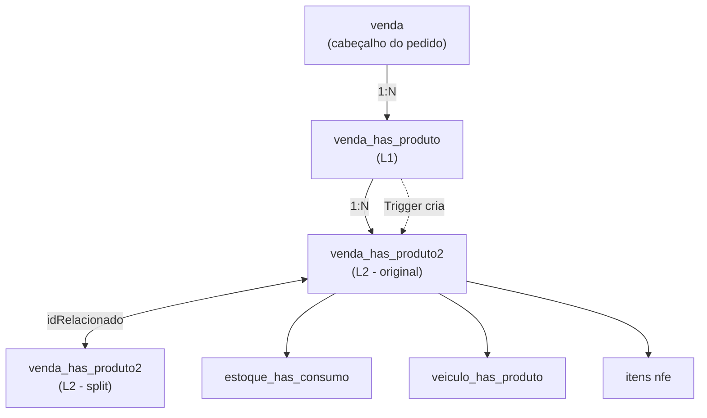

# Simplificação de Tabelas L1/L2 - Exploração Detalhada

> Status: **Análise**
> Última atualização: 2025-12-27
> Foco: Achatar arquitetura de tabelas de dois níveis para tabela única

---

## Sumário

1. [Análise da Arquitetura Atual](#1-análise-da-arquitetura-atual)
2. [Problemas com Design Atual](#2-problemas-com-design-atual)
3. [Opção A: Tabela Única com Auto-Referência](#3-opção-a-tabela-única-com-auto-referência)
4. [Opção B: Manter Apenas L2, Derivar L1](#4-opção-b-manter-apenas-l2-derivar-l1)
5. [Opção C: Event Sourcing](#5-opção-c-event-sourcing)
6. [Matriz de Comparação](#6-matriz-de-comparação)
7. [Recomendação](#7-recomendação)
8. [Estratégia de Migração](#8-estratégia-de-migração)

---

## 1. Análise da Arquitetura Atual

### 1.1 As Duas Tabelas

**Nível 1 (L1)**: `venda_has_produto`
- Criado quando: Orçamento/Pedido é colocado
- Propósito: "O que o cliente pediu"
- Granularidade: Uma linha por produto no pedido
- Contém: Quantidades originais, preços, descontos

**Nível 2 (L2)**: `venda_has_produto2`
- Criado quando: L1 é criado (trigger copia dados)
- Propósito: "Como o pedido está sendo atendido"
- Granularidade: Pode ter MÚLTIPLAS linhas por linha L1 (splits)
- Contém: Status de atendimento, datas de entrega, links de NFe

### 1.2 O Padrão `idRelacionado`

Quando um item é **dividido** (entrega parcial, itens quebrados, devoluções), uma nova linha L2 é criada com:
- Novo `idVendaProduto2` (chave primária)
- `idRelacionado` = `idVendaProduto2` original (link para pai)

```
Pedido Original: 10 caixas
    |
    +-- [idVendaProduto2=100] 10 caixas, status=PENDENTE
    |
    |   (NFe chega com apenas 6 caixas - split acontece)
    |
    +-- [idVendaProduto2=100] 6 caixas, status=ESTOQUE
    |
    +-- [idVendaProduto2=101, idRelacionado=100] 4 caixas, status=PENDENTE
```

### 1.3 Cenários de Split

| Cenário | O Que Acontece |
|---------|----------------|
| **NFe Parcial** | NFe tem menos qtd que PC → `dividirCompra()` + `dividirVenda()` |
| **Itens quebrados** | Entrega tem itens danificados → `dividirEntrega()` |
| **Entrega parcial** | Apenas algumas caixas cabem no caminhão → `dividirVenda()` |
| **Devoluções** | Cliente devolve itens → novo L2 com qtd negativa |

### 1.4 Relacionamentos de Tabelas Atuais



### 1.5 Colunas Chave em L2

```sql
-- De venda_has_produto2
idVendaProduto2      -- PK
idVendaProduto1      -- FK para L1 (idVendaProdutoFK)
idRelacionado        -- Auto-referência para splits
idVenda              -- FK para cabeçalho do pedido
idProduto            -- FK para produto
fornecedor           -- Nome do fornecedor (desnormalizado!)

-- Quantidades
quant                -- Quantidade em unidades
caixas               -- Quantidade em caixas
kg                   -- Peso
quantCaixa           -- Unidades por caixa

-- Preços
prcUnitario          -- Preço unitário
desconto             -- Desconto %
descUnitario         -- Preço após desconto
descGlobal           -- Desconto global aplicado
total                -- Total da linha

-- Status e Datas
status               -- Status de atendimento atual
dataPrevColeta       -- Data prevista de coleta
dataPrevReceb        -- Data prevista de recebimento
dataPrevEnt          -- Data prevista de entrega
dataRealColeta       -- Data real de coleta
dataRealReceb        -- Data real de recebimento
dataRealEnt          -- Data real de entrega

-- Links
idNFeSaida           -- FK para NFe de saída
idNFeEntrada         -- FK para NFe de entrada (devoluções)
idEvento             -- Agrupamento de evento de entrega
```

---

## 2. Problemas com Design Atual

### 2.1 Complexidade de Sincronização

L1 e L2 devem permanecer sincronizados:
- Triggers copiam L1 → L2 no insert
- Updates de preços em L1 devem propagar para L2
- Totais em L1 devem igualar soma de L2

**Bugs atuais encontrados:**
- Totais de L1 às vezes não batem com somas de L2 após splits
- Cancelar linhas L2 nem sempre atualiza L1

### 2.2 Complexidade de Query

Pergunta simples: "Qual o status do item X do pedido?"

**Abordagem atual:**
```sql
-- Precisa verificar ambas tabelas e agregar
SELECT
  vp1.idVendaProduto,
  vp1.quant as pedido,
  SUM(CASE WHEN vp2.status = 'ENTREGUE' THEN vp2.quant ELSE 0 END) as entregue,
  SUM(CASE WHEN vp2.status = 'PENDENTE' THEN vp2.quant ELSE 0 END) as pendente
FROM venda_has_produto vp1
LEFT JOIN venda_has_produto2 vp2 ON vp1.idVendaProduto = vp2.idVendaProdutoFK
GROUP BY vp1.idVendaProduto;
```

### 2.3 Rastreamento de Cadeia de Splits

Quando splits cascateiam, o rastreamento fica complexo:
```
Original (100)
  → Split A (101, relacionado a 100)
    → Split B (102, relacionado a 101)  -- Perdeu conexão com original!
```

Precisa query recursiva para encontrar item original.

### 2.4 Dados Redundantes

Muitas colunas duplicadas entre L1 e L2:
- `produto`, `fornecedor`, `un`, `prcUnitario`
- Desperdiça armazenamento, cria risco de inconsistência

### 2.5 Lógica de Negócio Espalhada

Código para lidar com splits em 10+ arquivos:
- `importarxml.cpp` - dividirCompra(), dividirVenda()
- `inputdialogconfirmacao.cpp` - dividirEntrega()
- `devolucao.cpp` - split na devolução
- `produtospendentes.cpp` - splits manuais
- `widgetlogisticaagendarentrega.cpp` - splits de entrega
- etc.

---

## 3. Opção A: Tabela Única com Auto-Referência

### 3.1 Schema Proposto

```sql
CREATE TABLE venda_itens (
    -- Identidade
    id SERIAL PRIMARY KEY,
    venda_id INTEGER NOT NULL REFERENCES vendas(id) ON DELETE CASCADE,

    -- Hierarquia (para splits)
    parent_id INTEGER REFERENCES venda_itens(id),  -- NULL = linha original
    root_id INTEGER REFERENCES venda_itens(id),    -- Sempre aponta para original
    split_reason VARCHAR(50),  -- 'PARTIAL_NFE', 'BROKEN', 'PARTIAL_DELIVERY', 'RETURN'

    -- Produto
    produto_id INTEGER NOT NULL REFERENCES produtos(id),
    fornecedor_id INTEGER NOT NULL REFERENCES fornecedores(id),

    -- Quantidades (imutáveis após criação)
    quantidade DECIMAL(15,4) NOT NULL,
    quantidade_caixas DECIMAL(15,4),
    quantidade_kg DECIMAL(15,4),
    unidade VARCHAR(10) DEFAULT 'UN',
    unidades_por_caixa DECIMAL(15,4),

    -- Preços (capturados no momento da venda)
    preco_unitario DECIMAL(15,2) NOT NULL,
    desconto_percentual DECIMAL(7,4) DEFAULT 0,
    preco_com_desconto DECIMAL(15,2),
    desconto_global_percentual DECIMAL(7,4) DEFAULT 0,
    total DECIMAL(15,2) NOT NULL,

    -- Info de produto desnormalizada (snapshot no momento da venda)
    descricao_produto VARCHAR(500),
    codigo_comercial VARCHAR(100),
    ncm VARCHAR(10),

    -- Status de Atendimento
    status venda_item_status NOT NULL DEFAULT 'PENDENTE',

    -- Datas
    data_prev_coleta DATE,
    data_prev_recebimento DATE,
    data_prev_entrega DATE,
    data_real_coleta TIMESTAMP,
    data_real_recebimento TIMESTAMP,
    data_real_entrega TIMESTAMP,

    -- Links
    nfe_saida_id INTEGER REFERENCES nfes(id),
    nfe_entrada_id INTEGER REFERENCES nfes(id),  -- Para devoluções
    evento_entrega_id INTEGER,  -- Agrupamento de entrega

    -- Info de entrega
    entregou VARCHAR(100),  -- Quem entregou
    recebeu VARCHAR(100),   -- Quem recebeu

    -- Auditoria
    created_at TIMESTAMP DEFAULT NOW(),
    updated_at TIMESTAMP DEFAULT NOW(),
    created_by INTEGER REFERENCES usuarios(id),

    -- Constraints
    CONSTRAINT positive_quantity CHECK (quantidade > 0 OR split_reason = 'RETURN'),
    CONSTRAINT valid_split CHECK (
        (parent_id IS NULL AND root_id IS NULL) OR  -- Linha original
        (parent_id IS NOT NULL AND root_id IS NOT NULL)  -- Linha de split
    )
);

-- Índices
CREATE INDEX idx_venda_itens_venda ON venda_itens(venda_id);
CREATE INDEX idx_venda_itens_produto ON venda_itens(produto_id);
CREATE INDEX idx_venda_itens_status ON venda_itens(status);
CREATE INDEX idx_venda_itens_parent ON venda_itens(parent_id) WHERE parent_id IS NOT NULL;
CREATE INDEX idx_venda_itens_root ON venda_itens(root_id) WHERE root_id IS NOT NULL;
```

### 3.2 Enum de Status

```sql
CREATE TYPE venda_item_status AS ENUM (
    -- Pré-compra
    'PENDENTE',           -- Aguardando pedido de compra

    -- Fluxo de compra
    'EM_COMPRA',          -- Pedido de compra gerado
    'CONFIRMADO',         -- Fornecedor confirmou
    'FATURADO',           -- NFe recebida do fornecedor

    -- Logística - Entrada
    'EM_COLETA',          -- Pronto para coleta do fornecedor
    'EM_RECEBIMENTO',     -- Sendo recebido no galpão
    'ESTOQUE',            -- Em estoque, pronto para entrega

    -- Logística - Saída
    'ENTREGA_AGENDADA',   -- Entrega agendada
    'EM_ENTREGA',         -- Saiu para entrega
    'ENTREGUE',           -- Entregue ao cliente

    -- Exceções
    'QUEBRADO',           -- Danificado
    'DEVOLVIDO',          -- Devolvido
    'CANCELADO'           -- Cancelado
);
```

### 3.3 View de Agregação (substitui L1)

```sql
CREATE VIEW venda_itens_agregado AS
SELECT
    venda_id,
    produto_id,
    fornecedor_id,
    descricao_produto,
    codigo_comercial,

    -- Pedido original (de itens raiz)
    SUM(quantidade) FILTER (WHERE parent_id IS NULL) as quantidade_pedida,
    SUM(total) FILTER (WHERE parent_id IS NULL) as total_pedido,

    -- Estado atual (de todos os itens ativos)
    SUM(quantidade) FILTER (WHERE status NOT IN ('CANCELADO', 'DEVOLVIDO')) as quantidade_ativa,

    -- Por status
    SUM(quantidade) FILTER (WHERE status = 'PENDENTE') as quantidade_pendente,
    SUM(quantidade) FILTER (WHERE status = 'ESTOQUE') as quantidade_estoque,
    SUM(quantidade) FILTER (WHERE status = 'ENTREGUE') as quantidade_entregue,
    SUM(quantidade) FILTER (WHERE status = 'DEVOLVIDO') as quantidade_devolvida,

    -- Contagem de linhas (para splits)
    COUNT(*) as total_linhas,
    COUNT(*) FILTER (WHERE parent_id IS NOT NULL) as linhas_split

FROM venda_itens
GROUP BY venda_id, produto_id, fornecedor_id, descricao_produto, codigo_comercial;
```

### 3.4 Função de Split

```sql
CREATE OR REPLACE FUNCTION split_venda_item(
    p_item_id INTEGER,
    p_quantidade_manter DECIMAL,
    p_split_reason VARCHAR(50)
) RETURNS INTEGER AS $$
DECLARE
    v_original RECORD;
    v_novo_id INTEGER;
    v_quantidade_split DECIMAL;
BEGIN
    -- Obter item original
    SELECT * INTO v_original FROM venda_itens WHERE id = p_item_id FOR UPDATE;

    IF NOT FOUND THEN
        RAISE EXCEPTION 'Item não encontrado: %', p_item_id;
    END IF;

    v_quantidade_split := v_original.quantidade - p_quantidade_manter;

    IF v_quantidade_split <= 0 THEN
        RAISE EXCEPTION 'Quantidade de split inválida';
    END IF;

    -- Atualizar original com quantidade reduzida
    UPDATE venda_itens
    SET quantidade = p_quantidade_manter,
        quantidade_caixas = p_quantidade_manter / NULLIF(unidades_por_caixa, 0),
        total = preco_com_desconto * p_quantidade_manter,
        updated_at = NOW()
    WHERE id = p_item_id;

    -- Criar item de split
    INSERT INTO venda_itens (
        venda_id, parent_id, root_id, split_reason,
        produto_id, fornecedor_id,
        quantidade, quantidade_caixas, unidade, unidades_por_caixa,
        preco_unitario, desconto_percentual, preco_com_desconto,
        desconto_global_percentual, total,
        descricao_produto, codigo_comercial, ncm,
        status
    )
    SELECT
        venda_id,
        p_item_id,  -- pai
        COALESCE(root_id, p_item_id),  -- raiz (original ou herdado)
        p_split_reason,
        produto_id, fornecedor_id,
        v_quantidade_split,
        v_quantidade_split / NULLIF(unidades_por_caixa, 0),
        unidade, unidades_por_caixa,
        preco_unitario, desconto_percentual, preco_com_desconto,
        desconto_global_percentual,
        preco_com_desconto * v_quantidade_split,
        descricao_produto, codigo_comercial, ncm,
        v_original.status  -- Herda status
    FROM venda_itens WHERE id = p_item_id
    RETURNING id INTO v_novo_id;

    RETURN v_novo_id;
END;
$$ LANGUAGE plpgsql;
```

### 3.5 Implementação Laravel

```php
// app/Models/VendaItem.php
class VendaItem extends Model
{
    protected $casts = [
        'status' => VendaItemStatus::class,
        'quantidade' => 'decimal:4',
        'total' => 'decimal:2',
    ];

    // Relacionamentos
    public function venda(): BelongsTo
    {
        return $this->belongsTo(Venda::class);
    }

    public function produto(): BelongsTo
    {
        return $this->belongsTo(Produto::class);
    }

    public function fornecedor(): BelongsTo
    {
        return $this->belongsTo(Fornecedor::class);
    }

    // Hierarquia de split
    public function parent(): BelongsTo
    {
        return $this->belongsTo(VendaItem::class, 'parent_id');
    }

    public function children(): HasMany
    {
        return $this->hasMany(VendaItem::class, 'parent_id');
    }

    public function root(): BelongsTo
    {
        return $this->belongsTo(VendaItem::class, 'root_id');
    }

    public function descendants(): HasMany
    {
        return $this->hasMany(VendaItem::class, 'root_id');
    }

    // Scopes
    public function scopeOriginals($query)
    {
        return $query->whereNull('parent_id');
    }

    public function scopeSplits($query)
    {
        return $query->whereNotNull('parent_id');
    }

    public function scopeActive($query)
    {
        return $query->whereNotIn('status', [
            VendaItemStatus::CANCELADO,
            VendaItemStatus::DEVOLVIDO,
        ]);
    }

    // Métodos
    public function isOriginal(): bool
    {
        return $this->parent_id === null;
    }

    public function isSplit(): bool
    {
        return $this->parent_id !== null;
    }

    public function getOriginal(): VendaItem
    {
        return $this->root_id ? $this->root : $this;
    }

    public function getSiblings(): Collection
    {
        $rootId = $this->root_id ?? $this->id;
        return VendaItem::where('root_id', $rootId)
            ->orWhere('id', $rootId)
            ->get();
    }
}

// app/Services/VendaItemSplitService.php
class VendaItemSplitService
{
    public function split(
        VendaItem $item,
        float $quantidadeManter,
        string $reason
    ): VendaItem {
        return DB::transaction(function () use ($item, $quantidadeManter, $reason) {
            $quantidadeSplit = $item->quantidade - $quantidadeManter;

            if ($quantidadeSplit <= 0) {
                throw new InvalidArgumentException('Quantidade inválida para split');
            }

            // Atualizar original
            $item->update([
                'quantidade' => $quantidadeManter,
                'quantidade_caixas' => $quantidadeManter / $item->unidades_por_caixa,
                'total' => $item->preco_com_desconto * $quantidadeManter,
            ]);

            // Criar split
            $split = $item->replicate();
            $split->parent_id = $item->id;
            $split->root_id = $item->root_id ?? $item->id;
            $split->split_reason = $reason;
            $split->quantidade = $quantidadeSplit;
            $split->quantidade_caixas = $quantidadeSplit / $item->unidades_por_caixa;
            $split->total = $item->preco_com_desconto * $quantidadeSplit;
            $split->save();

            event(new VendaItemSplit($item, $split, $reason));

            return $split;
        });
    }
}
```

---

## 4. Opção B: Manter Apenas L2, Derivar L1

### 4.1 Conceito

- L2 se torna a **única** tabela (fonte da verdade)
- L1 é uma **materialized view** ou **calculada sob demanda**
- Sem necessidade de sincronização via trigger

### 4.2 Schema

Igual à Opção A, mas com materialized view para agregações:

```sql
CREATE MATERIALIZED VIEW venda_itens_resumo AS
SELECT
    venda_id,
    produto_id,
    MIN(id) as primeiro_item_id,  -- Para vinculação
    SUM(quantidade) as quantidade_total,
    SUM(total) as total,
    -- Status é o mais avançado de todos os splits
    MAX(status) as status_agregado
FROM venda_itens
WHERE status != 'CANCELADO'
GROUP BY venda_id, produto_id;

CREATE UNIQUE INDEX ON venda_itens_resumo(venda_id, produto_id);

-- Atualizar após mudanças
CREATE OR REPLACE FUNCTION refresh_venda_resumo()
RETURNS TRIGGER AS $$
BEGIN
    REFRESH MATERIALIZED VIEW CONCURRENTLY venda_itens_resumo;
    RETURN NULL;
END;
$$ LANGUAGE plpgsql;

CREATE TRIGGER tr_refresh_resumo
    AFTER INSERT OR UPDATE OR DELETE ON venda_itens
    FOR EACH STATEMENT
    EXECUTE FUNCTION refresh_venda_resumo();
```

### 4.3 Prós/Contras vs Opção A

| Aspecto | Opção A | Opção B |
|---------|---------|---------|
| Consistência | Agregação manual | Auto-refresh |
| Performance | Agregação em tempo de query | Pré-calculado |
| Frescura | Sempre atual | Pequeno delay |
| Complexidade | Mais simples | Precisa gerenciar MV |

---

## 5. Opção C: Event Sourcing

### 5.1 Conceito

Armazenar **eventos** ao invés de estado atual. Derivar estado reproduzindo eventos.

### 5.2 Schema

```sql
CREATE TABLE venda_item_events (
    id BIGSERIAL PRIMARY KEY,
    venda_item_id UUID NOT NULL,  -- ID lógico (não FK)
    venda_id INTEGER NOT NULL REFERENCES vendas(id),

    event_type VARCHAR(50) NOT NULL,
    event_data JSONB NOT NULL,

    created_at TIMESTAMP DEFAULT NOW(),
    created_by INTEGER REFERENCES usuarios(id)
);

-- Exemplos de eventos:
-- ITEM_CREATED: {produto_id, quantidade, preco, ...}
-- ITEM_SPLIT: {quantidade_original, quantidade_nova, reason}
-- STATUS_CHANGED: {from, to}
-- NFE_LINKED: {nfe_id, tipo}
-- DELIVERED: {entregou, recebeu, data}
-- RETURNED: {quantidade, motivo}

CREATE INDEX idx_events_item ON venda_item_events(venda_item_id);
CREATE INDEX idx_events_venda ON venda_item_events(venda_id);
```

### 5.3 Projeção de Estado

```sql
CREATE MATERIALIZED VIEW venda_itens_state AS
WITH events_ordered AS (
    SELECT
        venda_item_id,
        event_type,
        event_data,
        ROW_NUMBER() OVER (PARTITION BY venda_item_id ORDER BY created_at DESC) as rn
    FROM venda_item_events
)
SELECT
    venda_item_id,
    -- Reconstruir estado atual a partir de eventos
    -- (lógica de agregação complexa aqui)
FROM events_ordered;
```

### 5.4 Quando Usar

Event sourcing é **overkill** para este caso de uso a menos que:
- Precise de histórico completo de auditoria
- Precise reproduzir/desfazer transações
- Construindo arquitetura CQRS

**Recomendação**: Pular isso para migração inicial.

---

## 6. Matriz de Comparação

| Critério | L1/L2 Atual | Opção A: Achatar | Opção B: Derivar L1 | Opção C: Eventos |
|----------|-------------|------------------|---------------------|------------------|
| **Complexidade** | Alta | Baixa | Média | Alta |
| **Simplicidade de query** | Complexa | Simples | Simples | Complexa |
| **Problemas de sync** | Sim | Não | Não | Não |
| **Rastreamento de splits** | Confuso | Claro (root_id) | Claro | Histórico completo |
| **Performance** | Média | Boa | Boa (cacheada) | Precisa otimização |
| **Esforço de migração** | N/A | Médio | Médio | Alto |
| **Trilha de auditoria** | Ruim | Pode adicionar | Pode adicionar | Built-in |
| **Flexibilidade** | Baixa | Média | Média | Máxima |

---

## 7. Recomendação

### Primária: Opção A (Achatar para Tabela Única)

**Por quê:**
1. Modelo mental mais simples
2. Hierarquia de splits clara com `parent_id` / `root_id`
3. Queries fáceis
4. Boa performance
5. Esforço de migração moderado

### Com Melhorias:

1. **Adicionar `root_id`** para acesso rápido ao item original
2. **Adicionar `split_reason`** para auditoria/debug
3. **Usar FK para fornecedor** (normalizar)
4. **Adicionar enum de status adequado**
5. **Considerar materialized view** para agregações se performance necessária

---

## 8. Estratégia de Migração

### Fase 1: Criar Nova Tabela

```sql
-- Criar nova tabela junto com antigas
CREATE TABLE venda_itens (...);

-- Criar função de migração
CREATE FUNCTION migrate_venda_items() ...
```

### Fase 2: Escrita Dupla

```php
// Escrever em ambas tabelas durante transição
class VendaService {
    public function addItem(...) {
        DB::transaction(function() {
            // Tabelas antigas
            $this->writeToL1L2(...);

            // Nova tabela
            $this->writeToVendaItens(...);
        });
    }
}
```

### Fase 3: Migrar Leituras

```php
// Gradualmente migrar leituras para nova tabela
class VendaItem {
    public function getItems() {
        if (config('migration.use_new_tables')) {
            return $this->newItems();
        }
        return $this->legacyItems();
    }
}
```

### Fase 4: Remover Legado

```sql
-- Após validação
DROP TABLE venda_has_produto2;
DROP TABLE venda_has_produto;
```

---

## Documentos Relacionados

- [03-improvements.md](./03-improvements.md) - Lista completa de melhorias
- [../technical/02-database.md](../technical/02-database.md) - Schema de banco de dados
- [../business/02-stock-flows.md](../business/02-stock-flows.md) - Fluxo de estoque (usa tabelas L2)
