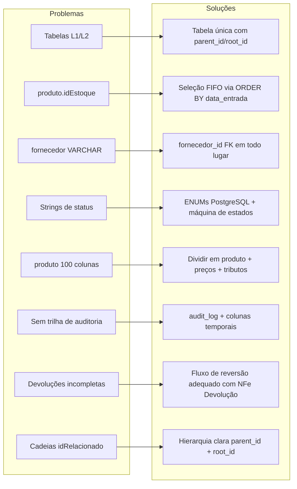
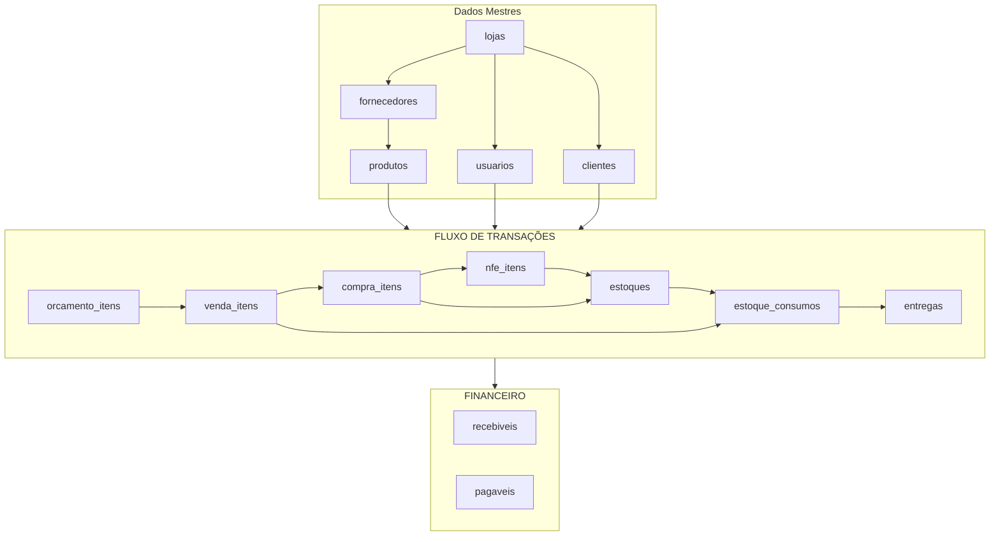
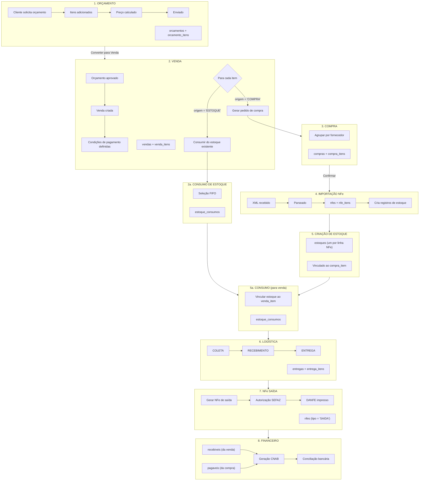
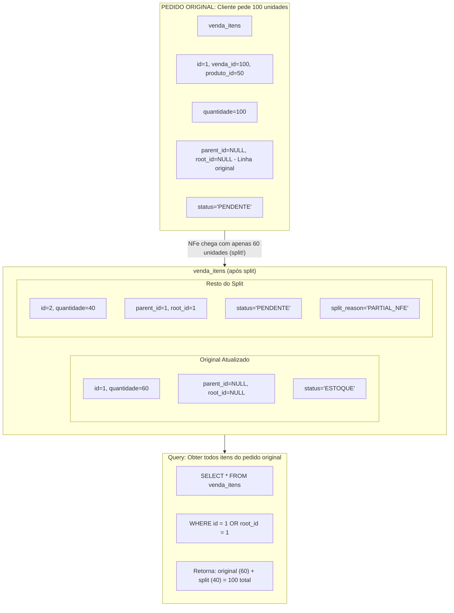
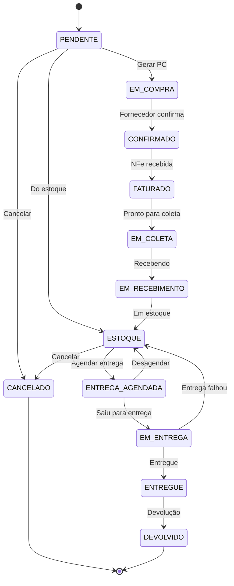
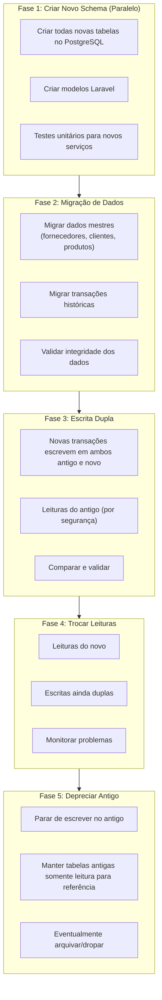

# Fluxo de Negócio e Schema Redesenhados

> Status: **Brainstorming**
> Última atualização: 2025-12-27
> Propósito: Redesenho holístico abordando todos os pontos de dor identificados

---

## Sumário

1. [Princípios de Design](#1-princípios-de-design)
2. [Modelo de Entidades Principal](#2-modelo-de-entidades-principal)
3. [Fluxo do Pedido até a Entrega](#3-fluxo-do-pedido-até-a-entrega)
4. [Schema Completo](#4-schema-completo)
5. [Máquinas de Estado de Status](#5-máquinas-de-estado-de-status)
6. [Principais Melhorias](#6-principais-melhorias)
7. [Arquitetura Orientada a Eventos](#7-arquitetura-orientada-a-eventos)
8. [Caminho de Migração](#8-caminho-de-migração)

---

## 1. Princípios de Design

### 1.1 Princípios Orientadores

| Princípio | Implementação |
|-----------|---------------|
| **Fonte Única da Verdade** | Uma tabela por conceito, sem duplicação L1/L2 |
| **Integridade Referencial** | Todas as FKs impostas, sem órfãos |
| **Explícito > Implícito** | ENUMs de status, não strings mágicas |
| **Auditar Tudo** | Quem, quando, o que mudou |
| **FIFO por Padrão** | Estoque consumido por data de entrada |
| **Núcleo Imutável** | Transações apenas append, correções via novos registros |

### 1.2 O Que Estamos Corrigindo



---

## 2. Modelo de Entidades Principal

### 2.1 Visão Geral do Relacionamento de Entidades



### 2.2 Decisões Chave de Design

**Tabelas de Itens Únicas**: Cada nível do fluxo tem UMA tabela de itens:
- `orcamento_itens` - Itens do Orçamento
- `venda_itens` - Itens da Venda (com splits via parent_id)
- `compra_itens` - Itens do pedido de compra
- `nfe_itens` - Itens da NFe
- `estoques` - Registros de estoque (um por lote/linha NFe)
- `estoque_consumos` - Registros de consumo (FIFO)
- `entrega_itens` - Itens de entrega

**Estratégia de Vinculação**: Relacionamentos FK claros, sem cópias desnormalizadas

---

## 3. Fluxo do Pedido até a Entrega

### 3.1 Diagrama de Fluxo Completo



### 3.2 Tratamento de Splits



---

## 4. Schema Completo

### 4.1 ENUMs

```sql
-- Status de Item de Venda
CREATE TYPE venda_item_status AS ENUM (
    'PENDENTE',           -- Aguardando compra
    'EM_COMPRA',          -- Pedido de compra criado
    'CONFIRMADO',         -- Fornecedor confirmou
    'FATURADO',           -- NFe recebida
    'EM_COLETA',          -- Pronto para coleta
    'EM_RECEBIMENTO',     -- Sendo recebido
    'ESTOQUE',            -- Em estoque
    'ENTREGA_AGENDADA',   -- Entrega agendada
    'EM_ENTREGA',         -- Saiu para entrega
    'ENTREGUE',           -- Entregue
    'DEVOLVIDO',          -- Devolvido
    'CANCELADO'           -- Cancelado
);

-- Status de Item de Compra
CREATE TYPE compra_item_status AS ENUM (
    'PENDENTE',           -- Aguardando confirmação
    'CONFIRMADO',         -- Fornecedor confirmou
    'FATURADO',           -- NFe recebida
    'EM_COLETA',          -- Pronto para coleta
    'EM_RECEBIMENTO',     -- Sendo recebido
    'RECEBIDO',           -- Em estoque
    'CANCELADO'           -- Cancelado
);

-- Status de NFe
CREATE TYPE nfe_status AS ENUM (
    'RASCUNHO',           -- Rascunho
    'PENDENTE',           -- Aguardando autorização
    'PROCESSANDO',        -- Enviado ao SEFAZ
    'AUTORIZADA',         -- Autorizada
    'REJEITADA',          -- Rejeitada
    'CANCELADA',          -- Cancelada
    'DENEGADA',           -- Denegada
    'INUTILIZADA'         -- Faixa inutilizada
);

-- Tipo de NFe
CREATE TYPE nfe_tipo AS ENUM (
    'ENTRADA',            -- Entrada (do fornecedor)
    'SAIDA',              -- Saída (para cliente)
    'DEVOLUCAO_ENTRADA',  -- Devolução do cliente
    'DEVOLUCAO_SAIDA'     -- Devolução para fornecedor
);

-- Status Financeiro
CREATE TYPE financeiro_status AS ENUM (
    'PENDENTE',
    'AGENDADO',
    'PAGO',
    'RECEBIDO',
    'ATRASADO',
    'CANCELADO'
);
```

### 4.2 Tabelas de Dados Mestres

```sql
-- Lojas (Lojas/Armazéns)
CREATE TABLE lojas (
    id SERIAL PRIMARY KEY,
    codigo VARCHAR(10) UNIQUE NOT NULL,
    nome VARCHAR(200) NOT NULL,
    cnpj VARCHAR(18) UNIQUE NOT NULL,
    inscricao_estadual VARCHAR(20),

    -- Endereço
    endereco_id INTEGER REFERENCES enderecos(id),

    -- Configurações
    config JSONB DEFAULT '{}',

    ativo BOOLEAN DEFAULT TRUE,
    created_at TIMESTAMP DEFAULT NOW(),
    updated_at TIMESTAMP DEFAULT NOW()
);

-- Fornecedores
CREATE TABLE fornecedores (
    id SERIAL PRIMARY KEY,
    razao_social VARCHAR(200) NOT NULL,
    nome_fantasia VARCHAR(200),
    cnpj VARCHAR(18) UNIQUE,
    inscricao_estadual VARCHAR(20),

    -- Contato
    email VARCHAR(200),
    telefone VARCHAR(20),

    -- Dados bancários
    banco VARCHAR(100),
    agencia VARCHAR(20),
    conta VARCHAR(20),

    -- Regras de negócio
    comissao_percentual DECIMAL(5,2) DEFAULT 0,
    frete_pago_loja BOOLEAN DEFAULT FALSE,
    is_representacao BOOLEAN DEFAULT FALSE,
    prazo_entrega_dias INTEGER DEFAULT 30,

    ativo BOOLEAN DEFAULT TRUE,
    created_at TIMESTAMP DEFAULT NOW(),
    updated_at TIMESTAMP DEFAULT NOW()
);

-- Clientes
CREATE TABLE clientes (
    id SERIAL PRIMARY KEY,
    tipo CHAR(2) NOT NULL CHECK (tipo IN ('PF', 'PJ')),
    nome_razao VARCHAR(200) NOT NULL,
    nome_fantasia VARCHAR(200),
    cpf_cnpj VARCHAR(18) UNIQUE NOT NULL,
    inscricao_estadual VARCHAR(20),

    -- Contato
    email VARCHAR(200),
    telefone VARCHAR(20),

    -- Crédito
    limite_credito DECIMAL(15,2) DEFAULT 0,
    saldo_credito DECIMAL(15,2) DEFAULT 0,

    -- Links
    vendedor_id INTEGER REFERENCES usuarios(id),

    incompleto BOOLEAN DEFAULT FALSE,
    ativo BOOLEAN DEFAULT TRUE,
    created_at TIMESTAMP DEFAULT NOW(),
    updated_at TIMESTAMP DEFAULT NOW()
);

-- Produtos - DIVIDIDO da mega-tabela
CREATE TABLE produtos (
    id SERIAL PRIMARY KEY,
    fornecedor_id INTEGER NOT NULL REFERENCES fornecedores(id),

    -- Identificação
    codigo_comercial VARCHAR(100) NOT NULL,
    codigo_barras VARCHAR(50),
    descricao VARCHAR(500) NOT NULL,
    descricao_curta VARCHAR(100),

    -- Unidades
    unidade VARCHAR(10) DEFAULT 'UN',
    unidades_por_caixa DECIMAL(10,4) DEFAULT 1,
    peso_kg DECIMAL(10,4),

    -- Classificação
    ncm_id INTEGER REFERENCES ncms(id),
    categoria_id INTEGER REFERENCES categorias(id),

    -- Flags
    tem_lote BOOLEAN DEFAULT FALSE,

    ativo BOOLEAN DEFAULT TRUE,
    created_at TIMESTAMP DEFAULT NOW(),
    updated_at TIMESTAMP DEFAULT NOW(),

    UNIQUE(fornecedor_id, codigo_comercial)
);

-- Preços (versionados)
CREATE TABLE produto_precos (
    id SERIAL PRIMARY KEY,
    produto_id INTEGER NOT NULL REFERENCES produtos(id),

    custo DECIMAL(15,4) NOT NULL,
    preco_venda DECIMAL(15,4) NOT NULL,
    markup DECIMAL(7,4) GENERATED ALWAYS AS (
        CASE WHEN custo > 0 THEN (preco_venda / custo - 1) * 100 ELSE 0 END
    ) STORED,

    vigencia_inicio DATE NOT NULL DEFAULT CURRENT_DATE,
    vigencia_fim DATE,

    created_at TIMESTAMP DEFAULT NOW(),
    created_by INTEGER REFERENCES usuarios(id)
);

-- Tributos (configuração de impostos)
CREATE TABLE produto_tributos (
    produto_id INTEGER PRIMARY KEY REFERENCES produtos(id),

    -- ICMS
    cst_icms VARCHAR(3),
    aliquota_icms DECIMAL(5,2),

    -- ST
    tem_st BOOLEAN DEFAULT FALSE,
    mva DECIMAL(7,4),

    -- IPI
    cst_ipi VARCHAR(2),
    aliquota_ipi DECIMAL(5,2),

    -- PIS/COFINS
    cst_pis VARCHAR(2),
    aliquota_pis DECIMAL(5,2),
    cst_cofins VARCHAR(2),
    aliquota_cofins DECIMAL(5,2),

    -- IBS/CBS (Reforma Tributária)
    config_ibs_cbs JSONB,

    updated_at TIMESTAMP DEFAULT NOW()
);
```

### 4.3 Tabelas de Transações

```sql
-- Vendas (Cabeçalho)
CREATE TABLE vendas (
    id SERIAL PRIMARY KEY,
    loja_id INTEGER NOT NULL REFERENCES lojas(id),
    cliente_id INTEGER NOT NULL REFERENCES clientes(id),
    vendedor_id INTEGER NOT NULL REFERENCES usuarios(id),

    -- Datas
    data_emissao DATE NOT NULL DEFAULT CURRENT_DATE,

    -- Totais (desnormalizados para performance)
    subtotal DECIMAL(15,2) NOT NULL DEFAULT 0,
    desconto_percentual DECIMAL(5,2) DEFAULT 0,
    desconto_valor DECIMAL(15,2) DEFAULT 0,
    frete DECIMAL(15,2) DEFAULT 0,
    total DECIMAL(15,2) NOT NULL DEFAULT 0,

    -- Entrega
    endereco_entrega_id INTEGER REFERENCES enderecos(id),

    -- Status
    status VARCHAR(20) DEFAULT 'ABERTA',
    status_financeiro VARCHAR(20) DEFAULT 'PENDENTE',

    -- Links
    orcamento_id INTEGER REFERENCES orcamentos(id),

    -- Auditoria
    created_at TIMESTAMP DEFAULT NOW(),
    updated_at TIMESTAMP DEFAULT NOW(),
    created_by INTEGER REFERENCES usuarios(id)
);

-- Venda Itens (Tabela única, sem L1/L2!)
CREATE TABLE venda_itens (
    id SERIAL PRIMARY KEY,
    venda_id INTEGER NOT NULL REFERENCES vendas(id) ON DELETE CASCADE,

    -- Hierarquia de split
    parent_id INTEGER REFERENCES venda_itens(id),
    root_id INTEGER REFERENCES venda_itens(id),
    split_reason VARCHAR(50),  -- PARTIAL_NFE, PARTIAL_DELIVERY, RETURN

    -- Produto (FK, não desnormalizado!)
    produto_id INTEGER NOT NULL REFERENCES produtos(id),
    fornecedor_id INTEGER NOT NULL REFERENCES fornecedores(id),

    -- Quantidades
    quantidade DECIMAL(15,4) NOT NULL,
    quantidade_caixas DECIMAL(15,4),
    unidade VARCHAR(10) DEFAULT 'UN',

    -- Preços (snapshot no momento da venda)
    preco_unitario DECIMAL(15,4) NOT NULL,
    desconto_item_percentual DECIMAL(5,2) DEFAULT 0,
    preco_com_desconto DECIMAL(15,4),
    total DECIMAL(15,2) NOT NULL,

    -- Desnormalizados para exibição (snapshot)
    descricao_produto VARCHAR(500),
    codigo_comercial VARCHAR(100),

    -- Origem
    origem VARCHAR(20) NOT NULL CHECK (origem IN ('COMPRA', 'ESTOQUE')),

    -- Status
    status venda_item_status NOT NULL DEFAULT 'PENDENTE',

    -- Datas
    data_prev_entrega DATE,
    data_real_entrega TIMESTAMP,

    -- Entrega
    entregue_por VARCHAR(100),
    recebido_por VARCHAR(100),

    -- NFe
    nfe_saida_id INTEGER REFERENCES nfes(id),

    -- Auditoria
    created_at TIMESTAMP DEFAULT NOW(),
    updated_at TIMESTAMP DEFAULT NOW()
);

-- Compras (Cabeçalho)
CREATE TABLE compras (
    id SERIAL PRIMARY KEY,
    loja_id INTEGER NOT NULL REFERENCES lojas(id),
    fornecedor_id INTEGER NOT NULL REFERENCES fornecedores(id),

    -- Links
    venda_id INTEGER REFERENCES vendas(id),  -- Se gerada de venda

    -- Totais
    subtotal DECIMAL(15,2) DEFAULT 0,
    frete DECIMAL(15,2) DEFAULT 0,
    total DECIMAL(15,2) DEFAULT 0,

    -- Datas
    data_emissao DATE DEFAULT CURRENT_DATE,
    data_prev_entrega DATE,
    data_real_entrega DATE,

    -- Status
    status VARCHAR(20) DEFAULT 'PENDENTE',

    -- NFe
    nfe_entrada_id INTEGER REFERENCES nfes(id),

    created_at TIMESTAMP DEFAULT NOW(),
    updated_at TIMESTAMP DEFAULT NOW()
);

-- Compra Itens
CREATE TABLE compra_itens (
    id SERIAL PRIMARY KEY,
    compra_id INTEGER NOT NULL REFERENCES compras(id) ON DELETE CASCADE,

    -- Hierarquia de split
    parent_id INTEGER REFERENCES compra_itens(id),
    root_id INTEGER REFERENCES compra_itens(id),
    split_reason VARCHAR(50),

    -- Produto
    produto_id INTEGER NOT NULL REFERENCES produtos(id),

    -- Link para item de venda (se de venda)
    venda_item_id INTEGER REFERENCES venda_itens(id),

    -- Quantidades
    quantidade DECIMAL(15,4) NOT NULL,
    quantidade_caixas DECIMAL(15,4),

    -- Preços
    preco_unitario DECIMAL(15,4),
    total DECIMAL(15,2),

    -- Status
    status compra_item_status DEFAULT 'PENDENTE',

    created_at TIMESTAMP DEFAULT NOW(),
    updated_at TIMESTAMP DEFAULT NOW()
);
```

### 4.4 Tabelas de Estoque

```sql
-- Estoques (Estoque - um registro por lote/linha NFe)
CREATE TABLE estoques (
    id SERIAL PRIMARY KEY,
    loja_id INTEGER NOT NULL REFERENCES lojas(id),
    produto_id INTEGER NOT NULL REFERENCES produtos(id),
    fornecedor_id INTEGER NOT NULL REFERENCES fornecedores(id),

    -- Origem
    nfe_entrada_id INTEGER REFERENCES nfes(id),
    nfe_item_id INTEGER REFERENCES nfe_itens(id),
    compra_item_id INTEGER REFERENCES compra_itens(id),

    -- Quantidades
    quantidade_original DECIMAL(15,4) NOT NULL,
    quantidade_disponivel DECIMAL(15,4) NOT NULL,

    -- Custo
    custo_unitario DECIMAL(15,4) NOT NULL,
    custo_total DECIMAL(15,2) NOT NULL,

    -- Rastreamento
    lote VARCHAR(50),
    data_validade DATE,

    -- Localização
    bloco_id INTEGER REFERENCES galpao_blocos(id),

    -- Status
    status VARCHAR(20) DEFAULT 'DISPONIVEL',

    -- Chave FIFO
    data_entrada TIMESTAMP NOT NULL DEFAULT NOW(),

    created_at TIMESTAMP DEFAULT NOW(),
    updated_at TIMESTAMP DEFAULT NOW()
);

-- Índice para FIFO
CREATE INDEX idx_estoques_fifo
    ON estoques(produto_id, loja_id, data_entrada)
    WHERE quantidade_disponivel > 0;

-- Estoque Consumos (Consumo de Estoque - registros FIFO)
CREATE TABLE estoque_consumos (
    id SERIAL PRIMARY KEY,
    estoque_id INTEGER NOT NULL REFERENCES estoques(id),

    -- O que consumiu
    venda_item_id INTEGER REFERENCES venda_itens(id),

    -- Quantidades
    quantidade DECIMAL(15,4) NOT NULL,
    custo_unitario DECIMAL(15,4) NOT NULL,
    custo_total DECIMAL(15,2) NOT NULL,

    -- Tipo
    motivo VARCHAR(50) NOT NULL,  -- VENDA, AJUSTE, QUEBRA, TRANSFERENCIA

    -- Reversão
    estornado BOOLEAN DEFAULT FALSE,
    estornado_at TIMESTAMP,
    estorno_motivo VARCHAR(200),

    created_at TIMESTAMP DEFAULT NOW(),
    created_by INTEGER REFERENCES usuarios(id)
);
```

### 4.5 Tabelas de NFe

```sql
-- NFes (Cabeçalho)
CREATE TABLE nfes (
    id SERIAL PRIMARY KEY,
    loja_id INTEGER NOT NULL REFERENCES lojas(id),

    -- Tipo
    tipo nfe_tipo NOT NULL,
    modelo VARCHAR(2) DEFAULT '55',  -- 55=NFe, 65=NFCe

    -- Identificação
    numero INTEGER,
    serie INTEGER DEFAULT 1,
    chave VARCHAR(44) UNIQUE,

    -- Partes
    emitente_id INTEGER,  -- FK para fornecedor ou loja
    destinatario_id INTEGER,  -- FK para cliente ou fornecedor

    -- Totais
    valor_produtos DECIMAL(15,2),
    valor_frete DECIMAL(15,2),
    valor_total DECIMAL(15,2),

    -- Status
    status nfe_status DEFAULT 'RASCUNHO',
    protocolo VARCHAR(50),

    -- XML
    xml_envio TEXT,
    xml_retorno TEXT,

    -- Datas
    data_emissao TIMESTAMP,
    data_autorizacao TIMESTAMP,

    -- Links
    venda_id INTEGER REFERENCES vendas(id),
    compra_id INTEGER REFERENCES compras(id),

    created_at TIMESTAMP DEFAULT NOW(),
    updated_at TIMESTAMP DEFAULT NOW()
);

-- NFe Itens
CREATE TABLE nfe_itens (
    id SERIAL PRIMARY KEY,
    nfe_id INTEGER NOT NULL REFERENCES nfes(id) ON DELETE CASCADE,

    numero_item INTEGER NOT NULL,

    -- Produto
    produto_id INTEGER REFERENCES produtos(id),
    codigo VARCHAR(100),
    descricao VARCHAR(500),
    ncm VARCHAR(10),
    cfop VARCHAR(4),

    -- Quantidades
    quantidade DECIMAL(15,4) NOT NULL,
    unidade VARCHAR(10),

    -- Valores
    valor_unitario DECIMAL(15,4),
    valor_total DECIMAL(15,2),

    -- Impostos (JSONB para flexibilidade)
    impostos JSONB,

    -- Links
    venda_item_id INTEGER REFERENCES venda_itens(id),
    compra_item_id INTEGER REFERENCES compra_itens(id),

    created_at TIMESTAMP DEFAULT NOW()
);
```

### 4.6 Tabelas Financeiras

```sql
-- Recebíveis (Contas a Receber)
CREATE TABLE recebiveis (
    id SERIAL PRIMARY KEY,
    loja_id INTEGER NOT NULL REFERENCES lojas(id),
    cliente_id INTEGER NOT NULL REFERENCES clientes(id),
    venda_id INTEGER REFERENCES vendas(id),

    -- Info de pagamento
    tipo_pagamento VARCHAR(50),  -- BOLETO, CARTAO, PIX, etc.
    parcela INTEGER DEFAULT 1,
    total_parcelas INTEGER DEFAULT 1,

    -- Valores
    valor DECIMAL(15,2) NOT NULL,
    valor_recebido DECIMAL(15,2) DEFAULT 0,

    -- Datas
    data_vencimento DATE NOT NULL,
    data_recebimento DATE,

    -- Status
    status financeiro_status DEFAULT 'PENDENTE',

    -- Banco
    nosso_numero VARCHAR(50),
    linha_digitavel VARCHAR(100),

    created_at TIMESTAMP DEFAULT NOW(),
    updated_at TIMESTAMP DEFAULT NOW()
);

-- Pagáveis (Contas a Pagar)
CREATE TABLE pagaveis (
    id SERIAL PRIMARY KEY,
    loja_id INTEGER NOT NULL REFERENCES lojas(id),
    fornecedor_id INTEGER NOT NULL REFERENCES fornecedores(id),
    compra_id INTEGER REFERENCES compras(id),

    -- Info de pagamento
    tipo VARCHAR(50),  -- DUPLICATA, BOLETO, etc.
    parcela INTEGER DEFAULT 1,
    total_parcelas INTEGER DEFAULT 1,

    -- Valores
    valor DECIMAL(15,2) NOT NULL,
    valor_pago DECIMAL(15,2) DEFAULT 0,

    -- Datas
    data_vencimento DATE NOT NULL,
    data_pagamento DATE,

    -- Status
    status financeiro_status DEFAULT 'PENDENTE',

    created_at TIMESTAMP DEFAULT NOW(),
    updated_at TIMESTAMP DEFAULT NOW()
);
```

### 4.7 Tabela de Auditoria

```sql
-- Log de Auditoria
CREATE TABLE audit_log (
    id BIGSERIAL PRIMARY KEY,

    -- O que mudou
    tabela VARCHAR(100) NOT NULL,
    registro_id INTEGER NOT NULL,
    acao VARCHAR(20) NOT NULL,  -- INSERT, UPDATE, DELETE

    -- Mudanças
    dados_antigos JSONB,
    dados_novos JSONB,
    campos_alterados TEXT[],

    -- Quem e quando
    usuario_id INTEGER REFERENCES usuarios(id),
    ip_address INET,

    -- Contexto
    transacao_id VARCHAR(100),
    modulo VARCHAR(50),

    created_at TIMESTAMP DEFAULT NOW()
);

CREATE INDEX idx_audit_tabela_registro ON audit_log(tabela, registro_id);
CREATE INDEX idx_audit_created ON audit_log(created_at);
CREATE INDEX idx_audit_usuario ON audit_log(usuario_id);
```

---

## 5. Máquinas de Estado de Status

### 5.1 Status de Item de Venda



### 5.2 Regras de Transição (Laravel)

```php
enum VendaItemStatus: string
{
    case PENDENTE = 'PENDENTE';
    case EM_COMPRA = 'EM_COMPRA';
    case CONFIRMADO = 'CONFIRMADO';
    case FATURADO = 'FATURADO';
    case EM_COLETA = 'EM_COLETA';
    case EM_RECEBIMENTO = 'EM_RECEBIMENTO';
    case ESTOQUE = 'ESTOQUE';
    case ENTREGA_AGENDADA = 'ENTREGA_AGENDADA';
    case EM_ENTREGA = 'EM_ENTREGA';
    case ENTREGUE = 'ENTREGUE';
    case DEVOLVIDO = 'DEVOLVIDO';
    case CANCELADO = 'CANCELADO';

    public function allowedTransitions(): array
    {
        return match($this) {
            self::PENDENTE => [self::EM_COMPRA, self::ESTOQUE, self::CANCELADO],
            self::EM_COMPRA => [self::CONFIRMADO, self::CANCELADO],
            self::CONFIRMADO => [self::FATURADO, self::CANCELADO],
            self::FATURADO => [self::EM_COLETA],
            self::EM_COLETA => [self::EM_RECEBIMENTO],
            self::EM_RECEBIMENTO => [self::ESTOQUE],
            self::ESTOQUE => [self::ENTREGA_AGENDADA, self::CANCELADO],
            self::ENTREGA_AGENDADA => [self::EM_ENTREGA, self::ESTOQUE],
            self::EM_ENTREGA => [self::ENTREGUE, self::ESTOQUE],
            self::ENTREGUE => [self::DEVOLVIDO],
            self::DEVOLVIDO => [],
            self::CANCELADO => [],
        };
    }

    public function canTransitionTo(self $new): bool
    {
        return in_array($new, $this->allowedTransitions());
    }
}
```

---

## 6. Principais Melhorias

### 6.1 Resumo das Mudanças

| Problema | Atual | Novo Design |
|----------|-------|-------------|
| **Tabelas L1/L2** | 2 tabelas + idRelacionado | 1 tabela + parent_id/root_id |
| **FIFO** | produto.idEstoque | ORDER BY data_entrada |
| **Refs de fornecedor** | VARCHAR em 9 tabelas | fornecedor_id FK |
| **Status** | Strings mágicas | ENUMs PostgreSQL |
| **Tabela produto** | 100+ colunas | Dividida em 3 tabelas |
| **Auditoria** | Nenhuma | tabela audit_log |
| **Devoluções** | Incompleto | Fluxo adequado com NFe |

### 6.2 Simplificações de Query

**Antigo: Buscar todos itens de uma venda (com splits)**
```sql
-- Complexo: join L1+L2, seguir cadeias idRelacionado
SELECT vp1.*, vp2.*
FROM venda_has_produto vp1
JOIN venda_has_produto2 vp2 ON vp1.idVendaProduto = vp2.idVendaProdutoFK
WHERE vp1.idVenda = :venda_id
  OR vp2.idRelacionado IN (SELECT ...)  -- Pesadelo recursivo
```

**Novo: Query simples**
```sql
-- Fácil: query em tabela única
SELECT * FROM venda_itens
WHERE venda_id = :venda_id;

-- Obter splits de um item
SELECT * FROM venda_itens
WHERE root_id = :item_id OR id = :item_id;
```

**Antigo: Obter fornecedor do estoque**
```sql
-- Baseado em string, propenso a erros
SELECT * FROM estoque WHERE fornecedor = 'ACME Corp';
```

**Novo: Baseado em FK**
```sql
-- Rápido, confiável
SELECT e.* FROM estoques e
JOIN fornecedores f ON e.fornecedor_id = f.id
WHERE f.id = :fornecedor_id;
```

---

## 7. Arquitetura Orientada a Eventos

### 7.1 Eventos Chave

```php
// Eventos de venda
VendaCriada::class        // → Gerar pedidos de compra se necessário
VendaItemAdicionado::class
VendaCancelada::class     // → Reverter consumos, cancelar compras

// Eventos de compra
CompraCriada::class
CompraConfirmada::class   // → Criar pagáveis
NfeImportada::class       // → Criar estoques, vincular a compra

// Eventos de estoque
EstoqueCriado::class
EstoqueConsumido::class   // → Atualizar quantidade_disponivel
EstoqueEstornado::class   // → Reverter consumo

// Eventos de entrega
EntregaAgendada::class
EntregaConfirmada::class  // → Atualizar financeiro, emitir NFe

// Eventos financeiros
RecebimentoConfirmado::class
PagamentoRealizado::class
```

### 7.2 Exemplo de Handler de Evento

```php
class NfeImportadaHandler
{
    public function handle(NfeImportada $event): void
    {
        $nfe = $event->nfe;

        // Criar estoque para cada item da NFe
        foreach ($nfe->itens as $item) {
            $estoque = Estoque::create([
                'loja_id' => $nfe->loja_id,
                'produto_id' => $item->produto_id,
                'fornecedor_id' => $nfe->emitente_id,
                'nfe_entrada_id' => $nfe->id,
                'nfe_item_id' => $item->id,
                'quantidade_original' => $item->quantidade,
                'quantidade_disponivel' => $item->quantidade,
                'custo_unitario' => $item->valor_unitario,
                'custo_total' => $item->valor_total,
                'data_entrada' => $nfe->data_emissao,
            ]);

            // Se vinculado a venda, criar consumo
            if ($item->venda_item_id) {
                $this->consumoService->consumirParaVenda(
                    $estoque,
                    $item->venda_item_id
                );
            }
        }
    }
}
```

---

## 8. Caminho de Migração

### 8.1 Fases



### 8.2 Mapeamento de Dados

| Tabela Antiga | Tabela(s) Nova(s) | Notas |
|---------------|-------------------|-------|
| fornecedor | fornecedores | 1:1, normalizar nomes |
| cliente | clientes | 1:1 |
| produto | produtos + produto_precos + produto_tributos | Dividir |
| venda_has_produto + venda_has_produto2 | venda_itens | Mesclar, adicionar parent_id |
| pedido_fornecedor_has_produto + _2 | compras + compra_itens | Mesclar |
| estoque | estoques | Adicionar data_entrada |
| estoque_has_consumo | estoque_consumos | Limpar |
| nfe | nfes | Adicionar enum tipo |
| conta_a_receber | recebiveis | Renomear |
| conta_a_pagar | pagaveis | Renomear |

---

## Documentos Relacionados

- [03-melhorias.md](./03-melhorias.md) - Pontos de dor que isso aborda
- [04-simplificacao-l1l2.md](./04-simplificacao-l1l2.md) - Detalhes L1/L2
- [05-correcao-fifo.md](./05-correcao-fifo.md) - Implementação FIFO
- [06-normalizacao-fornecedor.md](./06-normalizacao-fornecedor.md) - Normalização FK
- [../negocios/](../negocios/) - Documentação de fluxos atuais
