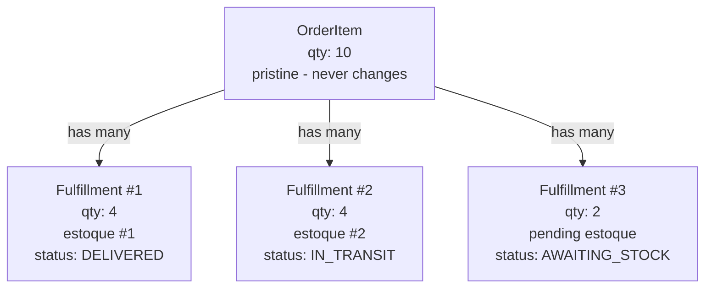
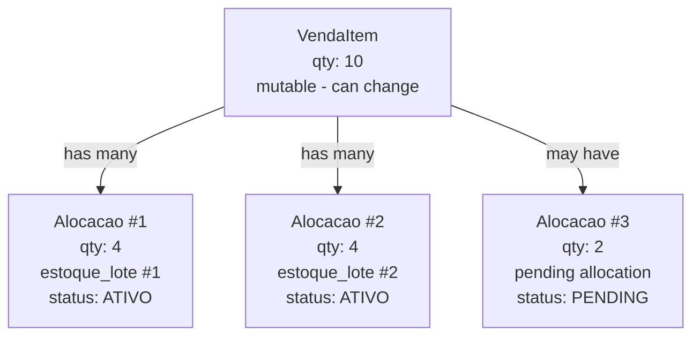

# Greenfield Design vs Proposed Schema - Comprehensive Comparison

**Date**: 2026-01-10
**Documents**:
- Greenfield: `greenfield/01-design-greenfield.md` (1766 lines)
- Proposed: `03-decisoes/02-schema-redesenhado.md` (1800+ lines)

---

## Executive Summary

**Finding**: The greenfield design and proposed schema are **fundamentally different models** in several key areas:

| Aspect | Greenfield | Proposed Schema | Status |
|--------|-----------|-----------------|--------|
| **Core Fulfillment Model** | 1:N Fulfillment | M:N Allocation | ⚠️ DIFFERENT |
| **Event Sourcing** | Full (Complete state from events) | Hybrid (Append-only audit + normal tables) | ✅ MODIFIED |
| **Reservation vs Consumption** | Explicit concept in model | Implicit in quantity fields | ⚠️ SIMPLIFIED |
| **Order Item Concept** | OrderItem (pristine) + Fulfillments | VendaItem (changes) | ⚠️ DIFFERENT |
| **Stock Entry Lifecycle** | Complex state machine | Simple quantity tracking | ⚠️ SIMPLIFIED |
| **Delivery Model** | Fulfillments → Delivery link | EntregaItem (separate table) | ⚠️ DIFFERENT |
| **Return Handling** | StockReturn entity | Soft-delete via is_estornado | ⚠️ SIMPLIFIED |

**Conclusion**: Greenfield was a **comprehensive v2.0 design**. Proposed schema is **pragmatic v1.0 subset** for faster implementation.

---

## Deep Dives by Component

### 1. FULFILLMENT MODEL: Core Architectural Difference

#### Greenfield Design: 1:N Fulfillment Model

**Concept**: One order item is fulfilled through **multiple fulfillments** (partitions).



**Key Features**:
- OrderItem is **immutable snapshot** of what customer ordered
- Fulfillments are **mutable fulfillment records**
- Status is derived from fulfillments (not stored on OrderItem)
- Each Fulfillment has complete lifecycle: RESERVED → CONSUMED → READY → IN_TRANSIT → DELIVERED/RETURNED
- Fulfillment links directly to Stock, Delivery, and Invoice

**Table Structure** (greenfield):
```
order_items
├── id, order_id, product_id
├── quantity (immutable)
├── price (immutable snapshot)
└── status (derived)

fulfillments
├── id, order_item_id
├── stock_id (FIFO allocation choice)
├── quantity (portion of order item)
├── status (RESERVED, CONSUMED, READY, IN_TRANSIT, DELIVERED, RETURNED)
├── delivery_id (FK to delivery)
└── delivered_at, returned_at

stock_entries
├── id, product_id, supplier_id
├── quantity_total
├── quantity_available
├── quantity_reserved (across fulfillments)
├── quantity_consumed (only linked fulfillments)
└── status (AVAILABLE, RESERVED, CONSUMED, BROKEN)
```

#### Proposed Schema: M:N Allocation Model

**Concept**: One venda_item is allocated to **multiple estoque_lotes** through junction table.



**Key Features**:
- VendaItem is **mutable** (quantity can change)
- Alocacao is **simple junction record** (venda_item ↔ estoque_lote)
- Status on VendaItem (not derived)
- Alocacao has minimal state: ATIVO, REVERTIDA, CANCELADA
- Alocacao links to EntregaItem (separate table), not directly to Delivery
- No explicit Fulfillment concept

**Table Structure** (proposed):
```
venda_itens
├── id, venda_id, produto_id
├── quantidade (mutable!)
├── status (stored, not derived)
├── parent_id, root_id (for splits)
└── origem (COMPRA | ESTOQUE)

alocacoes
├── id, venda_item_id, estoque_lote_id
├── quantidade
├── status (ATIVO, REVERTIDA, CANCELADA)
├── is_estornado (soft delete)
└── cost tracking

entrega_itens (separate concern)
├── id, entrega_id, venda_item_id
├── quantidade
└── status

estoque_lotes
├── id, product_id, supplier_id
├── quantidade_original
├── quantidade_disponivel
├── quantidade_reservada
└── status
```

### Status:
- ⚠️ **FUNDAMENTALLY DIFFERENT**
- Greenfield has explicit Fulfillment entity with lifecycle management
- Proposed schema simplifies to Alocacao (just linking)
- Tradeoff: Greenfield is more structured, Proposed is simpler/faster to implement

---

### 2. STOCK MANAGEMENT: Lifecycle Complexity

#### Greenfield: Complex State Machine

Stock entries have sophisticated lifecycle:

```
AVAILABLE
  → RESERVED (by 1+ fulfillments)
    → CONSUMED (when fulfillment confirmed)
      → READY (ready for delivery)
        → IN_TRANSIT
          → DELIVERED
            → FINAL (closed)
    OR
    → RETURNED (customer return)
      → AVAILABLE (if restockable)
      → SCRAPPED (if not)
  → BROKEN/LOST (damaged, shrinkage)
```

**Quantities**:
```
quantity_total = quantity_available + quantity_reserved + quantity_consumed

quantity_reserved: Sum of all RESERVED fulfillments
quantity_consumed: Sum of all CONSUMED fulfillments
quantity_available: quantity_total - reserved - consumed
```

#### Proposed: Simplified Quantity Model

Two fields only:

```
quantidade_original = original received quantity
quantidade_disponivel = amount available for new allocations
quantidade_reservada = amount allocated to sales

Golden Rule:
quantidade_disponivel + quantidade_reservada = quantidade_original
```

Stock status simplified to:
- RECEBIDO (received)
- DISPONIVEL (available)
- RESERVADO (reserved)
- CONSUMIDO (consumed)
- CANCELADO (canceled)

**Key Difference**: Greenfield tracks **both reserved AND consumed separately**. Proposed tracks **available vs reserved** (consumed is implicit).

---

### 3. EVENT SOURCING: Full vs Hybrid

#### Greenfield: Full Event Sourcing

**Philosophy**: Events are source of truth. State is derived from replaying events.

```php
class OrderItem {
    // No state stored
    // Constructor replays events to get current state

    public function __construct(Collection $events) {
        $this->status = $events
            ->latest('created_at')
            ->first()
            ->derivedState();
    }
}

class StockEntry {
    // Quantity derived from events
    public function getQuantityAvailable(): int {
        return $this->events
            ->whereIn('type', ['RECEIVED', 'RETURNED'])
            ->sum('quantity')
            -
            $this->events
                ->whereIn('type', ['RESERVED', 'CONSUMED'])
                ->sum('quantity');
    }
}
```

**Events include**:
- OrderItemCreated
- StockReserved (for Fulfillment)
- StockConsumed (Fulfillment confirmed)
- ItemDelivered
- ItemReturned
- StockRestocked
- etc.

#### Proposed: Hybrid Approach

**Philosophy**: Append-only audit trail on key tables, but normal state tables for queries.

```
estoque_lotes (normal table)
├── quantidade_disponivel (stored)
├── quantidade_reservada (stored)
└── status (stored)

estoque_lotes_events (append-only audit)
├── event_type (CRIADA, QUANTIDADE_ALTERADA, REVERTIDA, etc.)
├── event_data (JSONB payload)
└── never UPDATE/DELETE

alocacoes (normal table)
├── status (ATIVO, REVERTIDA, CANCELADA)
└── is_estornado (soft delete)

alocacoes_eventos (append-only audit)
├── event_type (CRIADA, REVERTIDA, CANCELADA)
└── event_data
```

**Key Difference**:
- Greenfield: State reconstruction from events (CQRS pattern, full replay)
- Proposed: Normal CRUD + append-only audit trail (hybrid, no replay needed)

**Practical Impact**:
- Greenfield: More powerful but complex (need replay logic)
- Proposed: Simpler (use normal queries) + audit trail (good enough for v1)

---

### 4. RESERVATION vs CONSUMPTION: Explicit vs Implicit

#### Greenfield: Explicit Two-Phase Model

**Reservation** (soft claim):
```php
class Fulfillment {
    case RESERVED = 'reserved';  // Stock held but not committed
    // Can expire after timeout
    // Can be canceled anytime
    // Multiple fulfillments can compete for same stock
    // FIFO priority determines which gets it
}

// Implementation
$stock->reserve($fulfillment, $quantity);  // Increments quantity_reserved
```

**Consumption** (hard commit):
```php
case CONSUMED = 'consumed';  // Stock hard-linked to fulfillment
// Permanent until delivery/return
// Creates complete record
// Decrements quantity_available
// Links to specific order item

// Implementation
$fulfillment->confirm();  // Moves from RESERVED to CONSUMED
// quantity_reserved -= X, quantity_consumed += X
```

#### Proposed: Implicit Single-Phase Model

Alocacao is created as ATIVO (equivalent to both reserved AND consumed):

```php
// Direct allocation (alocacao) skips reservation phase
$alocacao = Alocacao::create([
    'venda_item_id' => $item->id,
    'estoque_lote_id' => $lot->id,
    'quantidade' => 30,
    'status' => AlocacaoStatus::ATIVO,  // Already committed
]);

// Updates estoque_lote
$lot->decrement('quantidade_disponivel', 30);
$lot->increment('quantidade_reservada', 30);
```

**Key Difference**:
- Greenfield: RESERVED (tentative) → CONSUMED (confirmed) → READY/DELIVERED
- Proposed: ATIVO (allocated) → optionally REVERTIDA

---

### 5. ORDER ITEM MUTABILITY: Immutable vs Mutable

#### Greenfield: Immutable OrderItem

```php
class OrderItem {
    // Never changes after creation
    public readonly int $quantity;
    public readonly float $unit_price;

    // Status is DERIVED from fulfillments
    public function getStatus(): OrderItemStatus {
        $fulfillments = $this->fulfillments;

        if ($fulfillments->isEmpty()) {
            return OrderItemStatus::PENDING;
        }

        $delivered = $fulfillments
            ->where('status', FulfillmentStatus::DELIVERED)
            ->sum('quantity');

        if ($delivered === $this->quantity) {
            return OrderItemStatus::DELIVERED;
        }

        return OrderItemStatus::PARTIALLY_FULFILLED;
    }
}
```

**Benefits**:
- Audit trail is clean (never changed)
- "What did customer order?" is always clear
- Status is derived, not stored (single source of truth)

#### Proposed: Mutable VendaItem

```php
class VendaItem {
    public int $quantidade;  // Can change!
    public string $status;    // Stored directly
    public ?int $parent_id;   // For splits
    public ?int $root_id;     // For split hierarchy
}

// Can be split
$original = VendaItem::find(100);  // quantity: 100, status: PENDENTE

$split = $original->replicate();
$split->quantidade = 30;
$split->parent_id = 100;
$split->root_id = 100;
$split->save();

$original->update(['quantidade' => 70]);
```

**Tradeoff**:
- Greenfield: Immutable + derived (cleaner but more complex)
- Proposed: Mutable (simpler but lose pristine record)

---

### 6. DELIVERY INTEGRATION: Direct vs Indirect

#### Greenfield: Direct Fulfillment-Delivery Link

```php
class Fulfillment {
    public int $delivery_id;  // Direct FK to delivery
    public FulfillmentStatus $status;  // Includes IN_TRANSIT, DELIVERED
}

class Delivery {
    public function fulfillments(): HasMany {
        return $this->hasMany(Fulfillment::class);
    }

    public function orders(): Collection {
        return $this->fulfillments
            ->map(fn($f) => $f->orderItem->order)
            ->unique('id');
    }
}
```

**Flow**:
- Schedule delivery → set fulfillments.delivery_id + status = IN_TRANSIT
- Confirm delivery → set fulfillments.status = DELIVERED
- Generate invoice → use fulfillments.where('status', DELIVERED)

#### Proposed: Indirect EntregaItem Link

```php
class VendaItem {
    // No direct delivery link
    public function entregas(): BelongsToMany {
        return $this->belongsToMany(
            Entrega::class,
            'entrega_itens',
            'venda_item_id',
            'entrega_id'
        );
    }
}

class EntregaItem {
    public int $entrega_id;
    public int $venda_item_id;
    public int $quantidade;
    public string $status;  // Separate from venda_item.status
}

class Entrega {
    public function itens(): HasMany {
        return $this->hasMany(EntregaItem::class);
    }
}
```

**Flow**:
- Schedule delivery → create entrega + entrega_itens
- Confirm delivery → update entrega_itens status
- Generate invoice → use entrega_itens.where('status', ENTREGUE)

**Key Difference**:
- Greenfield: Fulfillment manages entire lifecycle (RESERVED→CONSUMED→DELIVERED)
- Proposed: VendaItem + EntregaItem separate concerns

---

### 7. RETURNS HANDLING: Explicit vs Implicit

#### Greenfield: StockReturn Entity

```php
class StockReturn {
    public int $fulfillment_id;  // Link to original fulfillment
    public int $stock_entry_id;
    public int $quantity;
    public string $reason;
    public bool $restock;        // Can it go back to available?
}

public function returnItem(
    Fulfillment $fulfillment,
    int $quantity,
    string $reason
): StockReturn {
    $return = StockReturn::create([
        'fulfillment_id' => $fulfillment->id,
        'stock_entry_id' => $fulfillment->stock_id,
        'quantity' => $quantity,
        'reason' => $reason,
        'restock' => $this->canRestock($reason),
    ]);

    if ($return->restock) {
        $fulfillment->stock->decrement(
            'quantity_consumed',
            $quantity
        );
        event(new StockRestocked($return));
    }

    event(new ItemReturned($return));
}
```

#### Proposed: is_estornado Flag

```php
class Alocacao {
    public bool $is_estornado = false;      // Soft delete
    public ?Carbon $estornado_em = null;
    public ?string $estorno_motivo = null;
    public ?int $estornado_por = null;      // User ID
}

public function desfazerAlocacao(Alocacao $alocacao, string $motivo) {
    DB::transaction(function () use ($alocacao, $motivo) {
        // Mark as reversed
        $alocacao->update([
            'is_estornado' => TRUE,
            'estornado_em' => now(),
            'estorno_motivo' => $motivo,
            'estornado_por' => auth()->id(),
        ]);

        // Restore stock
        $lot->increment('quantidade_disponivel', $alocacao->quantidade);
        $lot->decrement('quantidade_reservada', $alocacao->quantidade);

        // Record event
        DB::table('alocacoes_eventos')->insert([
            'alocacao_id' => $alocacao->id,
            'event_type' => 'REVERTIDA',
            'event_data' => json_encode([...]),
        ]);
    });
}
```

**Key Difference**:
- Greenfield: Explicit StockReturn entity tracks reason and restock decision
- Proposed: Soft-delete with is_estornado flag + audit event

---

## Summary Table: Feature Completeness

| Feature | Greenfield | Proposed | Notes |
|---------|-----------|----------|-------|
| **Fulfillment Concept** | ✅ Explicit | ❌ (Alocacao instead) | Greenfield more structured |
| **Order Item Immutability** | ✅ Yes | ❌ Mutable | Greenfield cleaner audit |
| **Reservation Phase** | ✅ Explicit RESERVED | ❌ Implicit | Greenfield more flexible |
| **Consumption Phase** | ✅ Explicit CONSUMED | ✅ Implicit ATIVO | Both achieve same goal |
| **Full Event Sourcing** | ✅ CQRS Pattern | ❌ Hybrid | Greenfield more advanced |
| **Stock State Machine** | ✅ Rich (5+ states) | ✅ Simplified (4 states) | Greenfield more detailed |
| **Direct Fulfillment-Delivery** | ✅ Yes | ❌ Via EntregaItem | Greenfield simpler |
| **Explicit Return Entity** | ✅ StockReturn | ❌ is_estornado flag | Greenfield more explicit |
| **Reserved vs Available** | ✅ Separated | ✅ Separated | Both track |
| **Parent-Child Item Links** | ❌ Not needed | ✅ parent_id/root_id | Proposed handles splits |

---

## Strategic Assessment

### Greenfield (v2.0 Vision)
- **Philosophy**: Enterprise-grade, DDD-inspired, event-sourced
- **Complexity**: High (Fulfillment lifecycle, full ES, CQRS)
- **Maturity Target**: Future (v2+)
- **Benefits**:
  - Cleaner audit trail (immutable order items)
  - Better for returns/partial fulfillment scenarios
  - Flexible reservation system
  - Enterprise patterns (ES, CQRS)
- **Costs**:
  - More tables and joins
  - Event replay logic needed
  - Derived state calculation overhead
  - Steeper learning curve

### Proposed (v1.0 Pragmatic)
- **Philosophy**: Pragmatic, simplified, still solid
- **Complexity**: Medium (M:N allocation, hybrid audit)
- **Maturity Target**: Current (ready for v1)
- **Benefits**:
  - Fewer entities (no explicit Fulfillment)
  - Direct queries (no event replay)
  - Simpler state management
  - Faster to implement
  - Good enough for most scenarios
- **Costs**:
  - Mutable order items (less pristine audit)
  - Implicit reservation (less explicit)
  - Cannot easily implement timeout-based reservations
  - Less suitable for complex multi-supplier scenarios

---

## Recommendations

### If implementing v1 NOW:
✅ **Use proposed schema** - It's ready, pragmatic, and balances simplicity with correctness

### Phase Future Improvements (v2+):
1. **Add Fulfillment layer** - Create fulfillment entities referencing alocacoes
2. **Implement full ES** - Add event replay capability
3. **Make OrderItem immutable** - Migrate split logic to Fulfillment
4. **Add Reservation timeout** - For abandoned reservations

### Immediate Gap to Close:
1. ⚠️ **Reserved vs Available distinction** - Proposed uses `quantidade_reservada` but allocation is always immediate (no explicit RESERVED state)
   - Greenfield: RESERVED → CONSUMED flow
   - Proposed: Direct ATIVO allocation
   - **Fix**: Document that Alocacao.ATIVO ≈ RESERVED+CONSUMED

2. ⚠️ **Return handling** - is_estornado flag is simple but loses reason/decision tracking
   - Greenfield: Explicit StockReturn.reason, restock decision
   - Proposed: Soft-delete with motivo field
   - **Fix**: Document return reason tracking in estorno_motivo field

3. ⚠️ **Order item pristineness** - VendaItem is mutable
   - Greenfield: OrderItem never changes
   - Proposed: VendaItem.quantidade can change
   - **Fix**: Document that splits create new VendaItem (with parent_id), original is updated - ensure queries understand this

---

## Conclusion

The **greenfield design is a v2.0 vision** with enterprise patterns (ES, CQRS, Fulfillment). The **proposed schema is v1.0** taking key ideas (M:N allocation, enums, event audit) but simplifying implementation.

Both are **valid architecture choices**:
- Greenfield is more correct/complete
- Proposed is more pragmatic/achievable

**Recommendation**: Proceed with proposed schema for v1, keep greenfield as v2+ roadmap for when complexity of business justifies the effort.
