# Fluxos de Processos de Negócio - Análise Completa

> Status: **Analisado a partir do código-fonte**
> Última atualização: 2025-12-27
> Fonte: Análise profunda do código C++

---

## Resumo Executivo

O ERP possui **6 fluxos principais interconectados**:

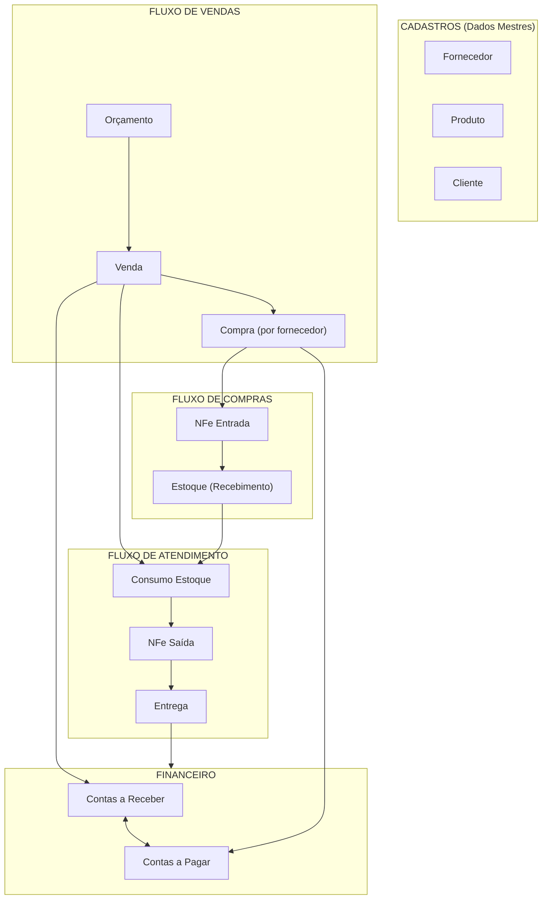

---

## Índice

1. [Arquitetura de Tabelas em Dois Níveis](#1-arquitetura-de-tabelas-em-dois-níveis)
2. [Fluxo Orçamento → Venda](#2-fluxo-orçamento--venda)
3. [Fluxo Venda → Compra](#3-fluxo-venda--compra)
4. [Fluxo Compra → Estoque](#4-fluxo-compra--estoque)
5. [Fluxo Estoque → Consumo](#5-fluxo-estoque--consumo)
6. [Fluxo NFe](#6-fluxo-nfe)
7. [Fluxo Financeiro](#7-fluxo-financeiro)
8. [Referência Completa de Status](#8-referência-completa-de-status)
9. [Regras de Integridade de Dados](#9-regras-de-integridade-de-dados)
10. [Problemas Conhecidos](#10-problemas-conhecidos)

---

## 1. Arquitetura de Tabelas em Dois Níveis

### Por Que Existem Dois Níveis

O sistema utiliza uma **hierarquia de dois níveis** tanto para vendas quanto para compras:

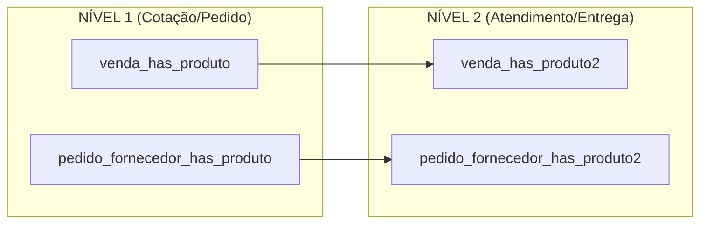

### Propósito de Cada Nível

| Aspecto | Nível 1 | Nível 2 |
|---------|---------|---------|
| **Propósito** | O que foi pedido | Como está sendo atendido |
| **Granularidade** | Um por produto no orçamento | **Pode ter MÚLTIPLOS por N1** (entregas divididas) |
| **Status** | Status do nível do pedido | Status do fluxo de trabalho do item |
| **Links NFe** | Nenhum | 3 referências NFe (Entrada, Saída, Futura) |
| **Link Estoque** | Nenhum | Links para estoque_has_consumo |
| **Datas** | Datas do pedido | Todas as datas do fluxo (6 pares de datas) |

### Exemplo de Entrega Dividida

```
Cliente pede: 100 unidades do Produto A (venda_has_produto qty=100)

Dividido em 3 entregas:
├── venda_has_produto2 [qty=40] → status=ENTREGUE
├── venda_has_produto2 [qty=35] → status=EM ENTREGA
└── venda_has_produto2 [qty=25] → status=EM COMPRA

Cada N2 rastreia independentemente:
- Própria progressão de status
- Próprio link de compra (idCompra)
- Próprios registros de consumo de estoque
- Próprias referências de NFe
```

### Diagrama de Relacionamentos

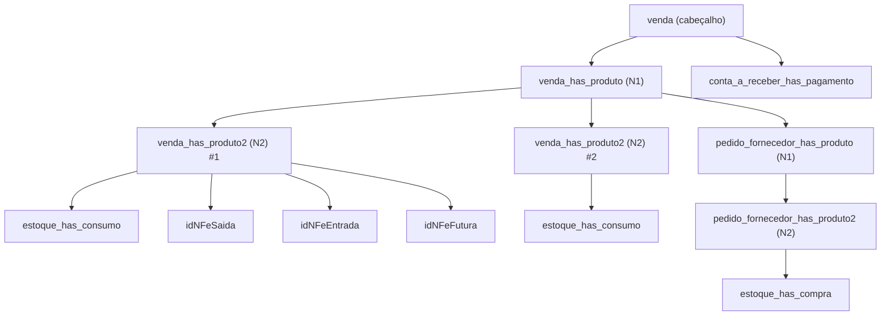

### Insight Principal

**Nível 2 é o "burro de carga"** - ele rastreia o atendimento real:
- `venda_has_produto2.idVendaProduto2` é A CHAVE que conecta:
  - Qual estoque foi consumido (`estoque_has_consumo`)
  - O que foi comprado (`pedido_fornecedor_has_produto2`)
  - Qual NFe foi emitida (`idNFeSaida`)

---

## 2. Fluxo Orçamento → Venda

### Valores de Status: Orçamento

| Status | Descrição | Transições Para |
|--------|-----------|-----------------|
| `ATIVO` | Orçamento ativo, pode ser convertido | FECHADO, EXPIRADO, PERDIDO |
| `EXPIRADO` | Passou da data de validade | REPLICADO (se replicado) |
| `REPLICADO` | Origem de um orçamento replicado | - |
| `FECHADO` | Convertido para Venda | - |
| `PERDIDO` | Marcado manualmente como perdido | - |

### Fluxo de Conversão

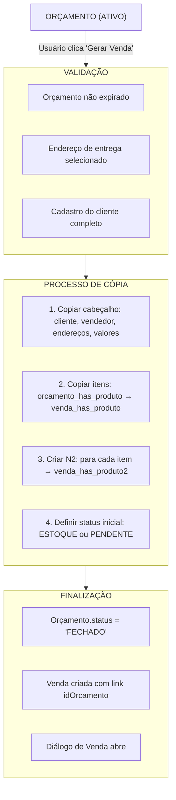

### Transformação de Dados

```
ORÇAMENTO                          VENDA
─────────                          ─────
idOrcamento          ───────────►  idOrcamento (FK)
idCliente            ───────────►  idCliente
idEnderecoEntrega    ───────────►  idEnderecoEntrega
idEnderecoFaturamento ──────────►  idEnderecoFaturamento
idProfissional       ───────────►  idProfissional
idUsuario            ───────────►  idUsuario
subTotalBru          ───────────►  subTotalBru
subTotalLiq          ───────────►  subTotalLiq
frete                ───────────►  frete
descontoPorc         ───────────►  descontoPorc
descontoReais        ───────────►  descontoReais
total                ───────────►  total
prazoEntrega         ───────────►  prazoEntrega
representacao        ───────────►  representacao
                     NOVO ──────►  status = 'ATIVO'
                     NOVO ──────►  data (data da venda)
```

---

## 3. Fluxo Venda → Compra

### Quando as Compras São Geradas

Compras (pedidos de compra) são geradas quando:
1. Usuário abre a aba "Gerar Compra" no módulo de Compras
2. Seleciona itens pendentes (status = INICIADO ou PENDENTE)
3. Clica no botão "Gerar Compra"

### Valores de Status: Item da Venda (venda_has_produto2)

| Status | Descrição | Próximo Status |
|--------|-----------|----------------|
| `INICIADO` | Estado inicial após criação da venda | EM COMPRA, ESTOQUE |
| `PENDENTE` | Aguardando ação | EM COMPRA, ESTOQUE |
| `EM COMPRA` | Pedido de compra gerado | EM FATURAMENTO |
| `EM FATURAMENTO` | Fornecedor confirmou/despachou | EM ENTREGA |
| `EM ENTREGA` | Mercadorias em trânsito | EM RECEBIMENTO, ESTOQUE |
| `EM RECEBIMENTO` | Sendo recebido no armazém | ESTOQUE |
| `ESTOQUE` | Em estoque, pronto para entrega | ENTREGA AGEND. |
| `ENTREGA AGEND.` | Entrega agendada | EM ENTREGA (para cliente) |
| `EM ENTREGA` | Saiu para entrega | ENTREGUE |
| `ENTREGUE` | Entregue ao cliente | (final) |
| `CANCELADO` | Cancelado | (final) |
| `DEVOLVIDO` | Devolvido | (final) |

### Diagrama de Fluxo

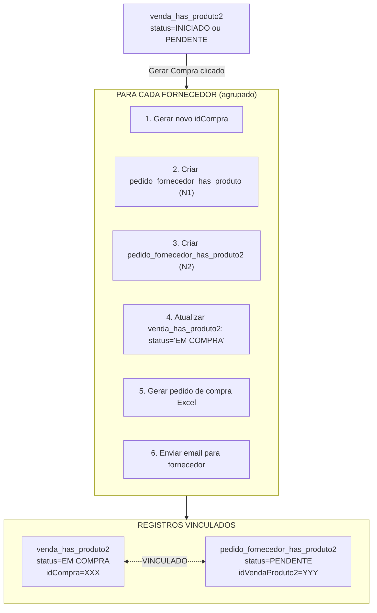

### Chave: idCompra Conecta Tudo

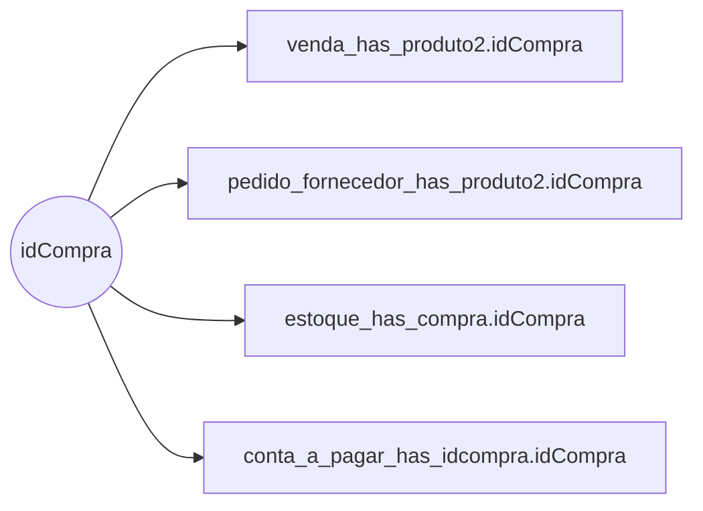

---

## 4. Fluxo Compra → Estoque

### Etapas de Confirmação de Compra

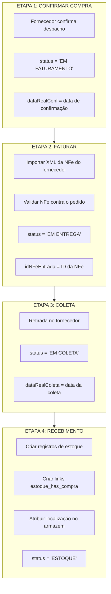

### Criação de Registro de Estoque

```sql
-- Criado durante importação de NFe / recebimento
INSERT INTO estoque (
    idNFe,              -- NFe do Fornecedor
    idProduto,
    fornecedor,         -- Nome do fornecedor (desnormalizado)
    descricao,          -- Descrição do produto
    status,             -- 'ESTOQUE'
    quant,              -- Quantidade recebida
    restante,           -- Quantidade disponível (= quant inicialmente)
    valorUnid,          -- Custo unitário da NFe
    idBloco,            -- Localização no armazém
    lote,               -- Número do lote
    -- Todos os campos de impostos da NFe...
    vBC, pICMS, vICMS, vIPI, vPIS, vCOFINS...
)
```

---

## 5. Fluxo Estoque → Consumo

### Lógica de Consumo de Estoque

Quando uma venda está pronta para entrega, o estoque é "consumido" (alocado):

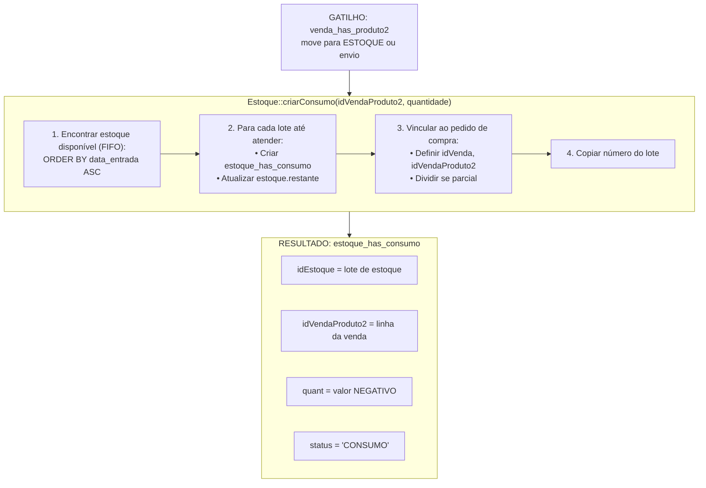

### Importante: Quantidades Negativas

O consumo de estoque é armazenado como valores **NEGATIVOS** em `estoque_has_consumo.quant`:

```
estoque.quant = 100          (original recebido)
estoque.restante = 100       (disponível)

Após consumo de 40:
estoque_has_consumo.quant = -40   (NEGATIVO!)
estoque.restante = 60             (atualizado)
```

### Reversão de Consumo

Quando uma venda é cancelada ou item devolvido:

```cpp
// Estoque::desfazerConsumo()
1. DELETE FROM estoque_has_consumo WHERE idVendaProduto2 = ?
2. UPDATE pedido_fornecedor_has_produto2 SET idVenda = NULL, idVendaProduto2 = NULL
3. UPDATE venda_has_produto2 SET status = 'PENDENTE', lote = NULL, idCompra = NULL
4. Recalcular estoque.restante
```

---

## 6. Fluxo NFe

### Tipos de NFe

| Tipo | Direção | Propósito |
|------|---------|-----------|
| `SAIDA` | Saída | Nota fiscal PARA cliente |
| `ENTRADA` | Entrada | Nota fiscal DO fornecedor |
| `FUTURA` | Agendada | Nota fiscal de entrega futura |
| `DEVOLUCAO` | Devolução | Nota de crédito de devolução |

### Valores de Status da NFe

| Status | Descrição |
|--------|-----------|
| `NOTA PENDENTE` | Pré-cadastrada, aguardando SEFAZ |
| `AUTORIZADA` | Aprovada pela SEFAZ |
| `DENEGADA` | Rejeitada pela SEFAZ |
| `CANCELADA` | Cancelada após aprovação |
| `RESUMO` | Resumo do manifesto (não é XML completo) |
| `INUTILIZADA` | Número inutilizado |

### Fluxo de Emissão de NFe (Saída)

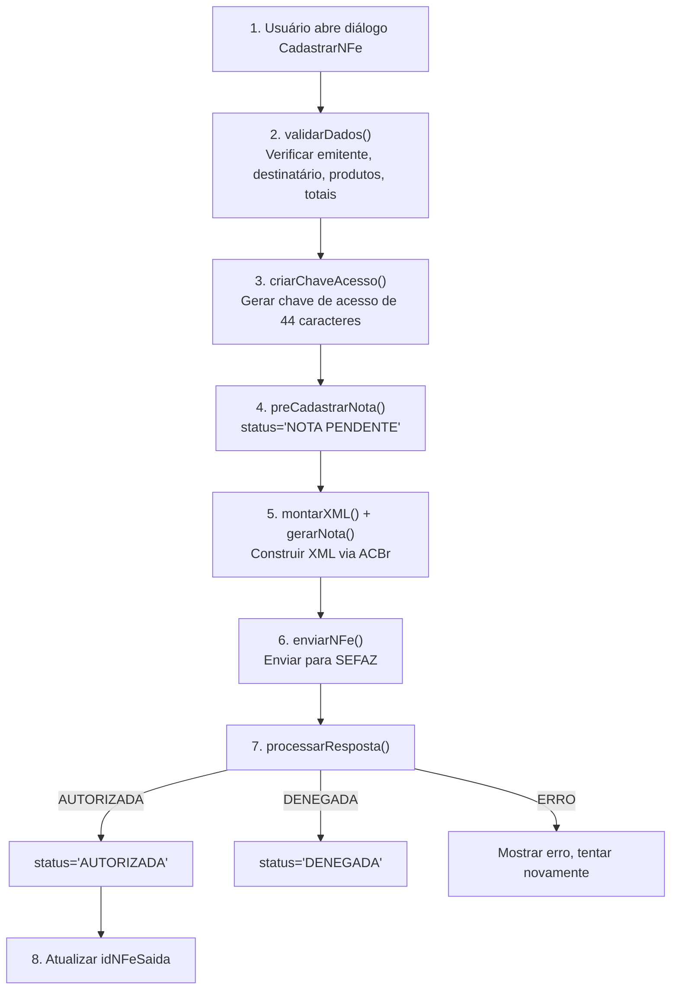

### Fluxo de Importação de NFe (Entrada)

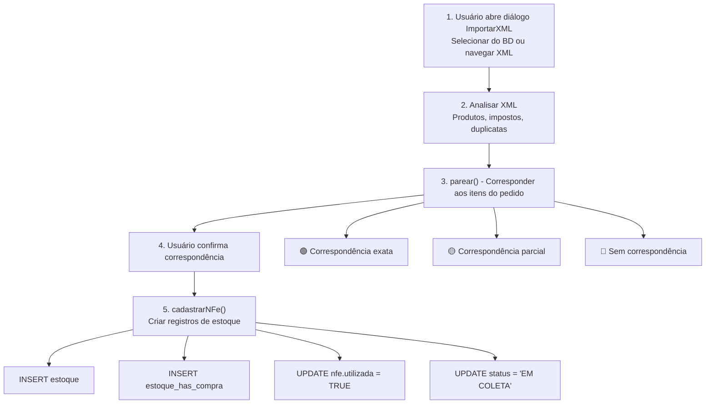

### Três Referências de NFe por Item de Venda

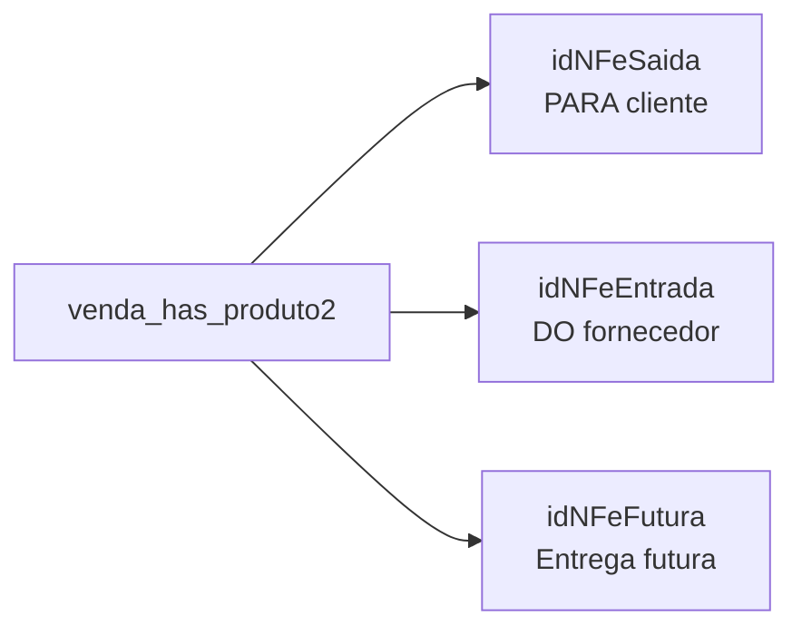

---

## 7. Fluxo Financeiro

### Contas a Receber

**Criado**: Automaticamente quando a Venda é salva/confirmada

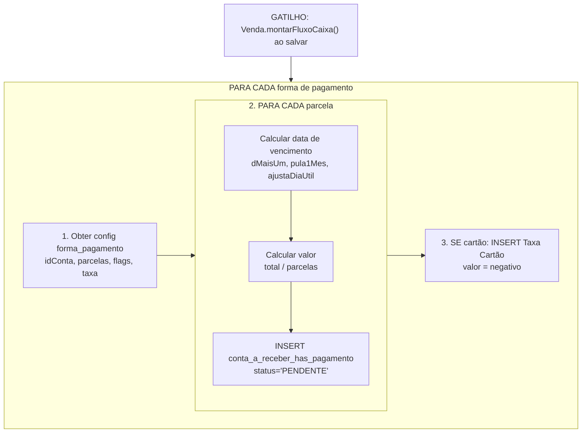

### Contas a Pagar

**Criado**: Na etapa de CONFIRMAÇÃO de compra (`widgetcompraconfirmar`)

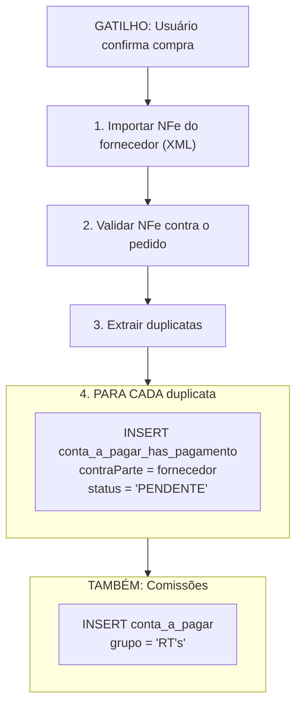

### Valores de Status Financeiro

| Status | Descrição |
|--------|-----------|
| `PENDENTE` | Ainda não pago |
| `CONFERIDO` | Verificado/confirmado |
| `AGENDADO` | Agendado para pagamento |
| `RECEBIDO` | Pagamento recebido (recebíveis) |
| `PAGO` | Pagamento efetuado (pagáveis) |
| `CANCELADO` | Cancelado |
| `PAGO GARE` | Pagamento de imposto concluído |

### Registro de Pagamento

```
Usuário edita coluna dataRealizado no diálogo Contas
    │
    ▼
método preencher() preenche automaticamente:
    • status = 'RECEBIDO' ou 'PAGO'
    • valorReal = valor (valor real)
    • tipoReal = tipo (método real)
    • idConta = conta bancária
    • centroCusto = centro de custo
    │
    ▼
SE pagamento cartão:
    • Encontrar registro "Taxa Cartão" correspondente
    • Atualizar esse registro identicamente
```

---

## 8. Referência Completa de Status

### Todas as Colunas de Status por Tabela

| Tabela | Coluna | Valores |
|--------|--------|---------|
| `venda` | status | ATIVO, CANCELADO, ENTREGUE, DEVOLVIDO |
| `venda` | statusFinanceiro | PENDENTE, CONFERIDO, LIBERADO, PAGO, CANCELADO |
| `venda_has_produto2` | status | INICIADO, PENDENTE, EM COMPRA, EM FATURAMENTO, EM ENTREGA, EM RECEBIMENTO, EM COLETA, ESTOQUE, ENTREGA AGEND., ENTREGUE, CANCELADO, DEVOLVIDO, DEVOLVIDO ESTOQUE, QUEBRADO, REPO. ENTREGA, REPO. RECEB. |
| `pedido_fornecedor_has_produto` | status | PENDENTE, CONFIRMADO, FATURADO, CANCELADO |
| `pedido_fornecedor_has_produto2` | status | (mesmo que venda_has_produto2) |
| `compra_avulsa` | status | PEND. APROV., CONFERIDO, COMPRADO, CANCELADO |
| `estoque` | status | TEMP, ESTOQUE, CANCELADO |
| `estoque_has_consumo` | status | TEMP, CONSUMO, AJUSTE, DEVOLVIDO |
| `nfe` | status | NOTA PENDENTE, AUTORIZADA, DENEGADA, CANCELADA, RESUMO, INUTILIZADA |
| `conta_a_receber` | status | PENDENTE, CONFERIDO, AGENDADO, RECEBIDO, CANCELADO |
| `conta_a_pagar` | status | PENDENTE, CONFERIDO, AGENDADO, PAGO, CANCELADO, PAGO GARE, PENDENTE GARE, LIBERADO GARE |
| `orcamento` | status | ATIVO, EXPIRADO, REPLICADO, FECHADO, PERDIDO |

### Fluxo Completo de Status do Item

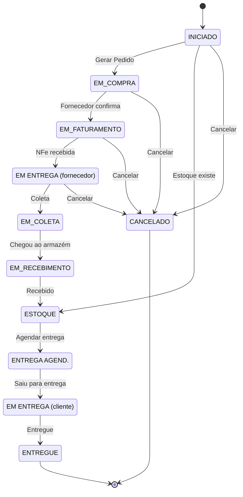

---

## 9. Regras de Integridade de Dados

### Invariantes Que SEMPRE Devem Ser Verdadeiras

```
INTEGRIDADE FINANCEIRA:
──────────────────────
1. SUM(conta_a_receber.valor) para venda == venda.total
2. SUM(conta_a_pagar.valor) para compra == compra.total
3. Nenhum pagamento órfão (sempre vinculado à transação)

INTEGRIDADE DE ESTOQUE:
──────────────────────
1. estoque.restante >= 0 (NUNCA negativo)
2. estoque.restante = estoque.quant + estoque.ajuste + SUM(estoque_has_consumo.quant)
3. SUM(estoque_has_consumo.quant) para item == venda_has_produto2.quant (como negativo)

INTEGRIDADE DE FLUXO:
────────────────────
1. Venda não pode ser ESTOQUE se compras não RECEBIDO (a menos que estoque existisse)
2. Compra RECEBIDO deve criar registros de estoque
3. Cancelamento deve reverter TODOS os efeitos downstream:
   • Deletar consumos
   • Desvincular compras
   • Cancelar financeiros
   • Reativar orçamento (se aplicável)

INTEGRIDADE NFe:
───────────────
1. NFe AUTORIZADA não pode ser modificada
2. NFe só pode ser CANCELADA em 24h (regra SEFAZ)
3. venda_has_produto2.idNFeSaida deve apontar para NFe válida
```

### Regras de Cascata de Status

```
Quando status de compra muda → status de venda_has_produto2 muda
    via stored procedure: update_venda_status()

Quando todos venda_has_produto2 são ENTREGUE → venda.status = ENTREGUE
    via stored procedure: update_venda_status()

Quando venda cancelada →
    1. Todos venda_has_produto2.status = CANCELADO
    2. Todos conta_a_receber.status = CANCELADO
    3. Todos estoque_has_consumo deletados
    4. Todos links pedido_fornecedor limpos
    5. orcamento.status = ATIVO (reativado)
```

---

## 10. Problemas Conhecidos

### Problemas Identificados na Análise

| Problema | Impacto | Causa |
|----------|---------|-------|
| **Nomes de fornecedor desnormalizados** | Atualizações requerem 5+ tabelas | fornecedor armazenado como VARCHAR, não FK |
| **Sem transações atômicas** | Estado inconsistente possível | Updates SQL separados, não encapsulados |
| **Status como strings** | Sem validação | Deveria ser ENUM |
| **Complexidade de dois níveis** | Difícil de consultar | Crescimento orgânico |
| **Pagáveis na confirmação** | Problemas de timing? | Criado na etapa de confirmação, não no pedido |
| **Sem trilha de auditoria** | Não consegue rastrear mudanças | Sem tabelas de histórico |
| **Quantidades negativas** | Confuso | estoque_has_consumo.quant é negativo |

### Regras Esclarecidas

1. **Um item de venda pode ser dividido em múltiplas entregas?**
   - **SIM** - Um `venda_has_produto` pode ter MÚLTIPLOS registros `venda_has_produto2`
   - Isso permite entregas parciais e atendimento dividido
   - Cada registro N2 rastreia um caminho separado de entrega/atendimento

2. **Quando contas_a_pagar são criadas para compras?**
   - **Na etapa de confirmação** (`widgetcompraconfirmar`)
   - Isso é quando os detalhes da nota do fornecedor são conhecidos

3. **O que acontece com recebimento parcial?**
   - **SIM** - Pode receber MENOS que o pedido
   - Item da venda fica **parcialmente atendido**
   - Precisa rastrear: quantidade pedida vs quantidade recebida

4. **Timing do cálculo de comissão?**
   - Ainda precisa esclarecimento
   - Quando a comissão é calculada?
   - E se a venda for cancelada após comissão paga?

---

## Próximos Passos

1. [ ] Documentar cada cenário quebrado especificamente
2. [ ] Definir limites de transação atômica
3. [ ] Mapear todas as stored procedures
4. [ ] Criar casos de teste para cada transição de status
5. [ ] Projetar novo schema normalizado
