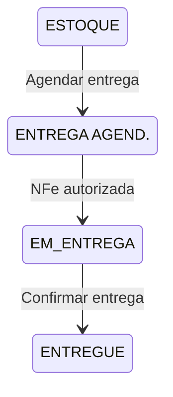
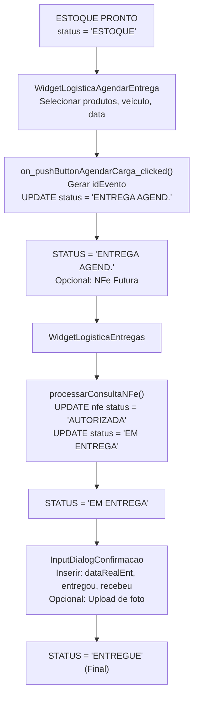
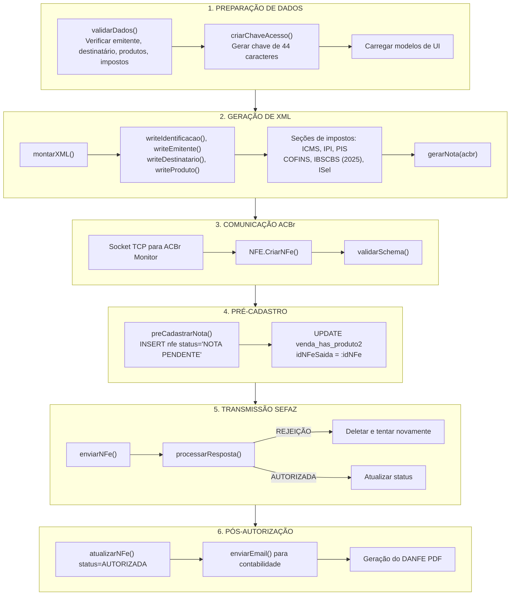
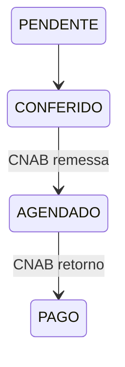
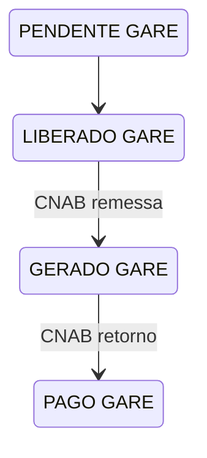
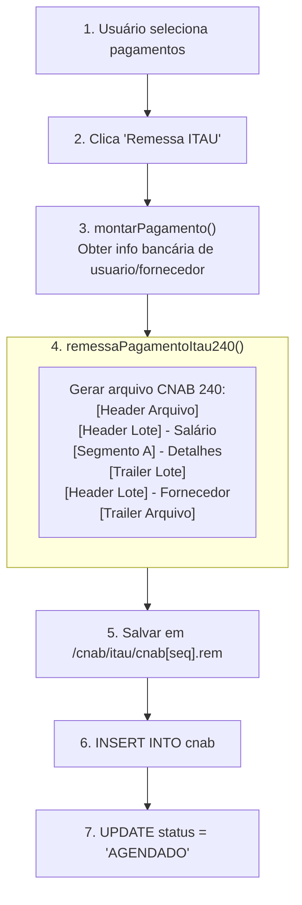
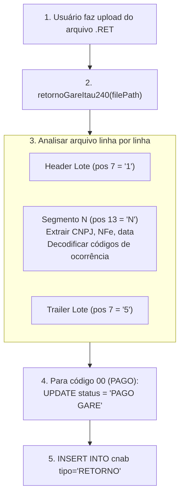
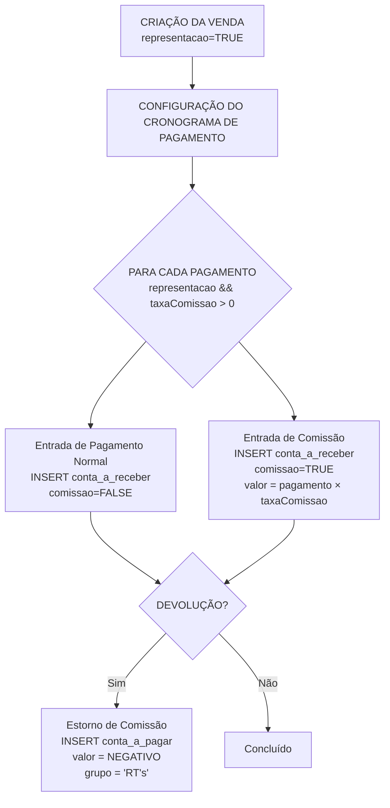

# Fluxos de Entrega, Emissão de NFe e Financeiro - Análise Profunda

> Status: **Completo**
> Última atualização: 2025-12-27
> Fonte: Análise profunda do código C++

---

## Índice

1. [Fluxo de Entrega](#1-fluxo-de-entrega)
2. [Fluxo de Emissão de NFe (Saída)](#2-fluxo-de-emissão-de-nfe-saída)
3. [Fluxo de Reconciliação Bancária CNAB](#3-fluxo-de-reconciliação-bancária-cnab)
4. [Fluxo de Cálculo de Comissão (RT)](#4-fluxo-de-cálculo-de-comissão-rt)

---

## 1. Fluxo de Entrega

### Transições de Status



### Diagrama de Fluxo Completo



### Tabelas Principais

| Tabela | Propósito |
|--------|-----------|
| `venda_has_produto2` | Rastreamento principal de status do produto |
| `pedido_fornecedor_has_produto2` | Status paralelo do pedido de compra |
| `veiculo_has_produto` | Agrupamento de entrega por veículo/evento |
| `transportadora_has_veiculo` | Cadastro de veículos |

### Geração de Documento de Entrega

Dois arquivos Excel gerados a partir de modelos:
- `espelho_entrega.xlsx` → Comprovante de entrega
- `modelo_checklist.xlsx` → Checklist de verificação física

### Tratamento de Itens Quebrados

```
Usuário marca itens como quebrados → dividirEntrega()
    │
    ├── Linha original: ENTREGUE (qty reduzida)
    ├── Linha quebrada: QUEBRADO
    ├── Linha de reposição (opcional): REPO. ENTREGA
    └── Registro de crédito: Entrada negativa em conta_a_receber
```

---

## 2. Fluxo de Emissão de NFe (Saída)

### Pontos de Entrada

- **Tipos**: `Saida`, `Futura`, `SaidaAposFutura`, `Entrada`
- **Gatilho**: Usuário seleciona itens da venda → botão "Gerar NF-e"
- **Arquivo**: `cadastrarnfe.cpp`

### Fluxo Completo de Emissão



### Valores de Status da NFe

| Status | Significado |
|--------|-------------|
| `NOTA PENDENTE` | Pré-SEFAZ, aguardando autorização |
| `AUTORIZADA` | Aprovada pela SEFAZ |
| `DENEGADA` | Negada pela SEFAZ |
| `CANCELADA` | Cancelada após autorização |

### Fluxo de Cancelamento de NFe

```cpp
1. Usuário insere justificativa (15-200 caracteres)
2. Comando: NFE.CancelarNFe(<chaveAcesso>, <justificativa>)
3. Verificar: xEvento=Cancelamento registrado
4. UPDATE nfe SET status = 'CANCELADA'
5. UPDATE venda_has_produto2 SET status = 'ENTREGA AGEND.', idNFeSaida = NULL
```

### Reforma Tributária 2025 (IBS/CBS/IS)

Novas seções XML adicionadas:
- `[IBSCBS###]` - IBS (estadual+municipal) e CBS (federal)
- `[gIBSUF###]` - IBS Estadual
- `[gIBSMun###]` - IBS Municipal
- `[gCBS###]` - CBS Federal
- `[ISel###]` - Imposto Seletivo

---

## 3. Fluxo de Reconciliação Bancária CNAB

### Visão Geral

CNAB (Centro Nacional de Automação Bancária) é o padrão brasileiro de arquivos bancários.

- **CNAB 240**: Registros de largura fixa de 240 caracteres
- **Banco**: Itaú (código 341) - único banco implementado

### Tipos de Arquivo

| Tipo | Direção | Propósito |
|------|---------|-----------|
| **Remessa** | Saída | Instruções de pagamento para o banco |
| **Retorno** | Entrada | Confirmações de pagamento do banco |

### Fluxo de Status de Pagamento



### Fluxo de Status GARE (Imposto)



### Fluxo de Geração de Remessa



### Fluxo de Processamento de Retorno



### Principais Códigos de Ocorrência

| Código | Significado |
|--------|-------------|
| 00 | PAGAMENTO EFETUADO |
| BD | PAGAMENTO AGENDADO |
| CE | PAGAMENTO CANCELADO |
| SS | CANCELADO POR INSUFICIÊNCIA DE SALDO |

### Não Implementado

- Geração de boleto (TODO no código)
- Formato CNAB 400
- Bancos além do Itaú

---

## 4. Fluxo de Cálculo de Comissão (RT)

### Fórmula

```
Comissão = Valor da Venda × (Percentual de Comissão / 100)
```

- **Apenas para vendas de REPRESENTAÇÃO**: `venda.representacao = TRUE`
- **Percentual armazenado em**: `profissional.comissao` (DECIMAL 15,4)
- **Padrão**: 5% se não definido

### Quando a Comissão é Criada

**Na criação do pagamento** (não na venda ou entrega):

```cpp
// venda.cpp:1836-1877
const double taxaComissao = query.value("comissaoLoja").toDouble() / 100;
const bool calculaComissao = (taxaComissao > 0 && isRepresentacao && observacao != "FRETE");

if (calculaComissao) {
    const double valorBase = payment.valor;
    const double valorComissao = valorBase * taxaComissao;
    // Criar entrada em conta_a_receber_has_pagamento com comissao = TRUE
}
```

### Tabelas de Armazenamento

**Recebíveis** (`conta_a_receber_has_pagamento`):
- Flag `comissao = TRUE`
- `grupo = "Comissão Representação"`
- `dataPagamento = data_pagamento + 1 mês`

**Pagáveis para Estornos** (`conta_a_pagar_has_pagamento`):
- Valor negativo para estornos de devolução
- `grupo = "RT's"`

### Estorno de Comissão em Devoluções

```cpp
// devolucao.cpp:485-534
void criarComissaoProfissional() {
    const double rt = queryVenda.value("rt").toDouble();
    const double valor = (prcUn * quant) * (rt / 100) * -1;  // NEGATIVO

    INSERT INTO conta_a_pagar_has_pagamento (
        idVenda = idDevolucao,
        contraParte = profissional_name,
        valor = valor,  // Valor negativo
        grupo = "RT's",
        dataPagamento = quinzena_date  // Dia 15 ou 30
    )
}
```

### Diagrama de Fluxo Completo



### A Entidade "Profissional"

```sql
CREATE TABLE profissional (
    idProfissional INT AUTO_INCREMENT,
    idLoja INT,
    nome_razao VARCHAR(100),
    comissao DECIMAL(15,4),    -- Percentual de comissão
    banco, agencia, cc,        -- Info bancária para pagamento
    cpf / cnpj,                -- ID fiscal
    desativado TINYINT(1)
)
```

---

## Resumo

Todos os 4 fluxos críticos estão agora documentados:

| Fluxo | Arquivos Principais | Status |
|-------|---------------------|--------|
| Entrega | `widgetlogistica*.cpp`, `inputdialogconfirmacao.cpp` | Completo |
| Emissão de NFe | `cadastrarnfe.cpp`, `acbr.cpp` | Completo |
| CNAB/Banco | `cnab.cpp`, `widgetfinanceirocontas.cpp` | Completo |
| Comissão | `venda.cpp`, `devolucao.cpp`, `cadastroprofissional.cpp` | Completo |
