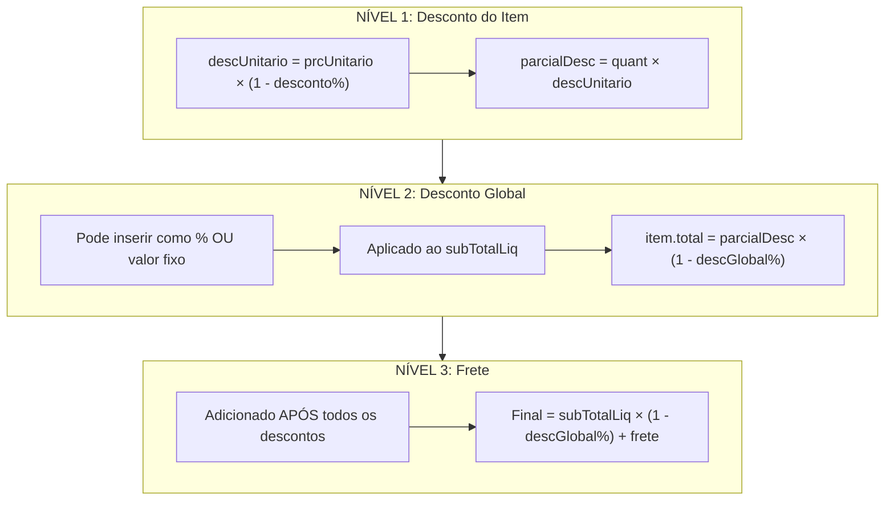
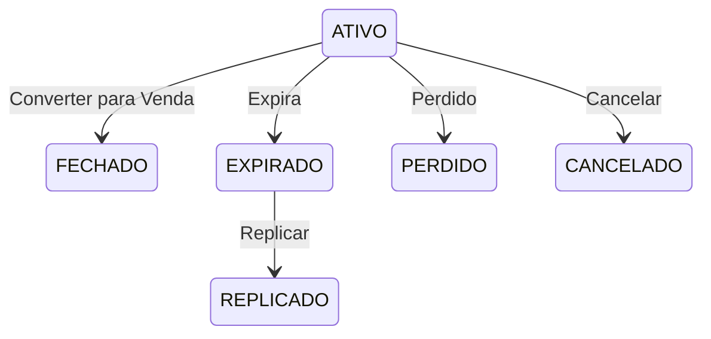
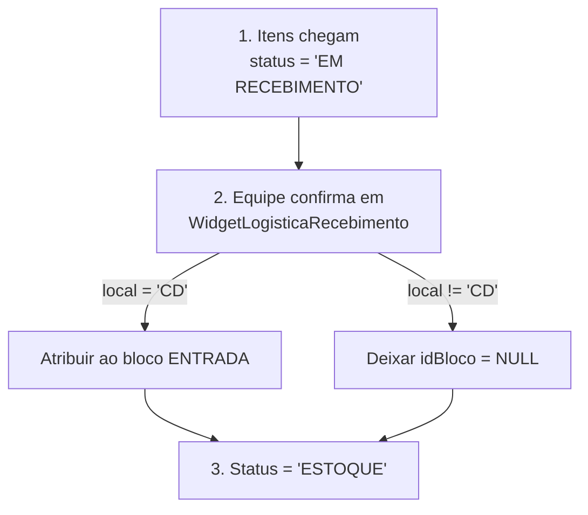

# Cadastros, Orçamento, Galpão e Permissões - Análise Completa

> Status: **Completo**
> Última atualização: 2025-12-27
> Fonte: Análise profunda do código C++

---

## Índice

1. [Cadastros (Dados Mestres)](#1-cadastros-dados-mestres)
2. [Orçamento](#2-orçamento)
3. [Galpão (Armazém)](#3-galpão-armazém)
4. [Permissões de Usuário](#4-permissões-de-usuário)

---

## 1. Cadastros (Dados Mestres)

### 1.1 Fornecedor

**Campos Principais:**
```sql
idFornecedor (PK)
razaoSocial, nomeFantasia     -- Razões sociais
cnpj (UNIQUE)                 -- CNPJ
inscEstadual                  -- Inscrição estadual
banco, agencia, cc            -- Info bancária
comissao1, comissao2          -- Taxas de comissão
representacao                 -- É representante?
fretePagoLoja                 -- Quem paga o frete
vemDoSul                      -- Origem do sul
desativado                    -- Flag de exclusão lógica
```

**Relacionamentos:**
- `fornecedor_has_endereco` - Múltiplos endereços
- `produto` - Um-para-muitos (produtos do fornecedor)
- `pedido_fornecedor` - Pedidos de compra

**Validação:**
- Formato CNPJ: `99.999.999/9999-99`
- Exclusão lógica via flag `desativado`

---

### 1.2 Cliente

**Campos Principais:**
```sql
idCliente (PK)
pfpj                          -- PF (pessoa física) ou PJ (pessoa jurídica)
nome_razao, nomeFantasia
cpf (UNIQUE) / cnpj (UNIQUE)  -- Documentos fiscais
credito (DECIMAL 15,4)        -- Saldo de crédito disponível
idProfissionalRel             -- Representante vinculado
incompleto                    -- Flag de cadastro incompleto
```

**Relacionamentos:**
- `cliente_has_endereco` - Endereços de entrega + faturamento
- `orcamento` - Orçamentos do cliente
- `venda` - Vendas do cliente
- Auto-referência (cliente pai)

**Validação:**
- Formato CPF: `999.999.999-99`
- Formato CNPJ: `99.999.999/9999-99`
- Consulta de CEP via API Qualp com geolocalização

---

### 1.3 Produto

**Campos Principais:**
```sql
idProduto (PK)
idFornecedor (FK)             -- Link do fornecedor
fornecedor                    -- Nome desnormalizado
descricao                     -- Indexado para busca full-text
codComercial                  -- Código comercial
codBarras                     -- Código de barras

-- Preços
custo                         -- Preço de custo
precoVenda                    -- Preço de venda
markup                        -- Calculado automaticamente

-- Impostos
ncm                           -- Classificação NCM
cst                           -- Código de imposto ICMS
icms                          -- Percentual de ICMS
st, sticms, mva               -- Substituição tributária

-- Estoque
estoqueRestante               -- Estoque disponível
quantCaixa                    -- Unidades por caixa
temLote                       -- Rastreamento de lote
```

**Validação:**
- `fornecedor + codComercial` deve ser único
- Markup calculado automaticamente de custo/preço
- Descontinuação em estoque zero

---

### 1.4 Transportadora

**Campos Principais:**
```sql
idTransportadora (PK)
razaoSocial, nomeFantasia
cnpj (UNIQUE)
antt                          -- Registro ANTT
```

**Relacionamentos:**
- `transportadora_has_endereco` - Endereços
- `transportadora_has_veiculo` - Veículos (modelo, placa, capacidade)
- `veiculo_has_produto` - Rastreamento de entrega com GPS

---

## 2. Orçamento

### 2.1 Estrutura de Tabelas

**Tabela Principal: `orcamento`**
```sql
idOrcamento (PK)
idCliente, idProfissionalRel, idUsuario
dataEmissao                   -- Data de emissão
validade                      -- Dias de validade (padrão: 7)
status                        -- ATIVO, EXPIRADO, REPLICADO, FECHADO, PERDIDO
representacao                 -- É venda RT?

-- Totais
subTotalBru                   -- Antes de quaisquer descontos
subTotalLiq                   -- Após descontos de item
descontoPorc / descontoReais  -- Desconto global
frete                         -- Valor do frete
total                         -- Total final
```

**Itens: `orcamento_has_produto`**
```sql
idOrcamentoProduto (PK)
idOrcamento (FK)
idProduto (FK)

-- Preços
prcUnitario                   -- Preço unitário
desconto                      -- % de desconto do item
descUnitario                  -- Preço após desconto
parcial                       -- qtd × prcUnitario
parcialDesc                   -- qtd × descUnitario
descGlobal                    -- Desconto global aplicado
total                         -- Total final da linha
```

### 2.2 Sistema de Desconto em Três Níveis



### 2.3 Ciclo de Vida do Status



### 2.4 Regras de Validade

- **Validade padrão**: 7 dias a partir da emissão
- **Verificação de expiração**: `serverDate > dataEmissao + validade`
- **Quando expirado**:
  - UI fica somente leitura
  - Não pode editar itens
  - Não pode gerar venda
  - PODE replicar (cria novo orçamento com data de hoje)

### 2.5 Cálculo de Frete

```cpp
IF frete manual: usar valor inserido
ELSE:
  fretePorcentagem = subTotalBruto × porcentagemFrete / 100
  freteMaior = MAX(fretePorcentagem, minimoFrete)
  freteQualp = CalculoFrete.getFrete()  // API Externa
  finalFrete = MAX(freteMaior, freteQualp)

  IF usuário é gerente:
    minimoGerente = MIN(freteQualp, freteMaior) × 1.2
```

### 2.6 Conversão Orçamento → Venda

**Gatilho**: `on_pushButtonGerarVenda_clicked()`

**Validações**:
1. Orçamento não expirado
2. Endereço de entrega selecionado
3. Cadastro do cliente completo

**Processo**:
1. Copiar cabeçalho: cliente, vendedor, endereços, valores
2. Copiar itens: `orcamento_has_produto` → `venda_has_produto`
3. Trigger cria `venda_has_produto2` (N2)
4. Definir status do item: ESTOQUE se existe estoque, senão PENDENTE
5. Marcar orçamento como FECHADO

---

## 3. Galpão (Armazém)

### 3.1 Estrutura de Blocos

**Tabela: `galpao`**
```sql
idBloco (PK)
label                         -- "ENTRADA", "A1", "B2", etc.
posicao                       -- Coordenadas "x,y"
tamanho                       -- Dimensões "largura,altura"
```

### 3.2 Bloco Especial: ENTRADA

**Propósito**: Zona de recebimento para inventário entrando

```cpp
// Necessário para processo de recebimento
SELECT idBloco FROM galpao WHERE label = 'ENTRADA'
// Itens em EM RECEBIMENTO não podem ser movidos
```

### 3.3 Atribuição de Localização de Estoque

**Duas Tabelas Rastreiam Localização:**

```sql
-- Inventário próprio do armazém
estoque.idBloco → galpao.idBloco

-- Inventário alocado para cliente
estoque_has_consumo.idBloco → galpao.idBloco
```

### 3.4 Fluxo de Recebimento



### 3.5 Movimentação de Estoque

```cpp
// Mover itens entre blocos
on_pushButtonMover_clicked() {
    for cada item selecionado:
        if (tipo == "EST. LOJA"):
            UPDATE estoque SET idBloco = :newBlock
        if (tipo == "CLIENTE"):
            UPDATE estoque_has_consumo SET idBloco = :newBlock
}
```

**Tipos de Movimentação:**
- `EST. LOJA` - Inventário da loja (tabela estoque)
- `CLIENTE` - Alocado para cliente (tabela estoque_has_consumo)

**Restrição**: Não pode mover DO bloco "EM RECEBIMENTO"

### 3.6 Interface Visual

- Qt Graphics Scene para mapa do armazém
- Imagem de fundo do WebDAV
- Gráficos PalletItem para cada bloco
- Clique para selecionar e mostrar conteúdo
- Destacar blocos com itens selecionados

---

## 4. Permissões de Usuário

### 4.1 Estrutura da Tabela de Usuário

```sql
CREATE TABLE usuario (
    idUsuario (PK)
    idLoja (FK)               -- Atribuição de loja
    user (UNIQUE)             -- Nome de usuário para login
    password                  -- Hash SHA
    tipo                      -- Tipo de perfil
    nome                      -- Nome de exibição
    senhaUsoUnico             -- Senha de autorização única
    valorMinimoFrete          -- Limite de autorização de frete
    desativado                -- Flag de conta desativada
)
```

### 4.2 Perfis de Usuário (tipo)

| Perfil | Descrição | Nível de Acesso |
|--------|-----------|-----------------|
| ADMINISTRADOR | Administrador completo do sistema | Total |
| DIRETOR | Diretor | Total |
| ADMINISTRATIVO | Equipe administrativa | Alto |
| GERENTE LOJA | Gerente de loja | Médio-Alto |
| GERENTE DEPARTAMENTO | Gerente de departamento | Médio-Alto |
| GERENTE FINANCEIRO | Gerente financeiro | Médio-Alto |
| VENDEDOR | Vendedor | Baixo |
| VENDEDOR ESPECIAL | Vendedor especial | Baixo-Médio |
| OPERACIONAL | Equipe operacional | Baixo |
| ASSISTENTE ADMINISTRATIVO | Assistente administrativo | Baixo |

### 4.3 Tabela de Permissões

```sql
CREATE TABLE usuario_has_permissao (
    idUsuario (PK, FK)

    -- Acesso a Módulos (11 abas)
    view_tab_orcamento, view_tab_venda, view_tab_compra,
    view_tab_logistica, view_tab_nfe, view_tab_estoque,
    view_tab_galpao, view_tab_financeiro, view_tab_relatorio,
    view_tab_grafico, view_tab_rh

    -- Acesso a Pastas WebDAV
    webdav_documentos, webdav_compras, webdav_financeiro,
    webdav_rh, webdav_obras, webdav_logistica

    -- Permissões de Funcionalidades
    ajusteFrete               -- Pode ajustar frete
)
```

### 4.4 Métodos de Verificação de Perfil

```cpp
// Métodos estáticos na classe User
User::isAdmin()              // ADMINISTRADOR ou DIRETOR
User::isAdministrativo()     // ADMIN, ADMINISTRATIVO ou DIRETOR
User::isGerente()            // Qualquer tipo GERENTE
User::isVendedor()           // VENDEDOR
User::isVendedorOrEspecial() // VENDEDOR ou VENDEDOR ESPECIAL
User::isOperacional()        // OPERACIONAL

// Verificação de permissão dinâmica
User::temPermissao("view_tab_financeiro")
```

### 4.5 Fluxo de Autorização

```mermaid
flowchart TB
    subgraph Standard["Login Padrão"]
        S1["User::login(user, password)"]
        S2["Consultar tabela usuario"]
        S3["Validar credenciais"]
        S4["Definir membros estáticos User::*"]
        S1 --> S2 --> S3 --> S4
    end

    subgraph Special["Autorização Especial"]
        A1["User::autorizacao(user, senhaUsoUnico)"]
        A2["Usa senha de uso único"]
        A3["Apenas para gerentes/admins"]
        A4["Define limite valorMinimoFrete"]
        A5["Limpa senha após uso"]
        A1 --> A2 --> A3 --> A4 --> A5
    end
```



### 4.6 Controle de Acesso por Loja

- Cada usuário atribuído a UMA loja (idLoja)
- Limites específicos por loja via `User::fromLoja()`
- Exemplos:
  - `tetoProfissionalRT` - Teto de comissão profissional
  - `valorMinimoFrete` - Valor mínimo de frete
  - `porcentagemFrete` - Percentual de frete

### 4.7 Acesso em Nível de Funcionalidade

| Funcionalidade | Permissão Necessária |
|----------------|---------------------|
| Gerenciamento de usuários | `isAdmin()` |
| Desativação de produto | `isAdministrativo()` |
| Ajuste de frete | permissão `ajusteFrete` |
| Config de email/NFe | `isAdministrativo()` |
| Teto de comissão | `isAdmin()` para exceder limite da loja |

---

## Resumo

Todos os fluxos restantes estão agora documentados:

| Fluxo | Tabelas Principais | Arquivos |
|-------|-------------------|----------|
| Cadastros | fornecedor, cliente, produto, transportadora | cadastro*.cpp |
| Orçamento | orcamento, orcamento_has_produto | orcamento.cpp |
| Galpão | galpao, estoque.idBloco | widgetgalpao.cpp |
| Permissões | usuario, usuario_has_permissao | user.cpp, logindialog.cpp |

**Documentação agora cobre 100% dos fluxos de negócio.**
