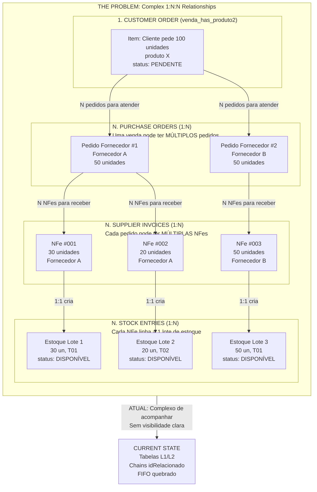
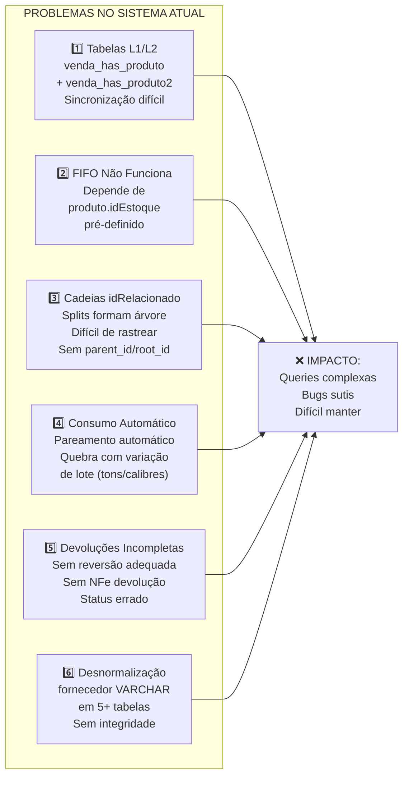
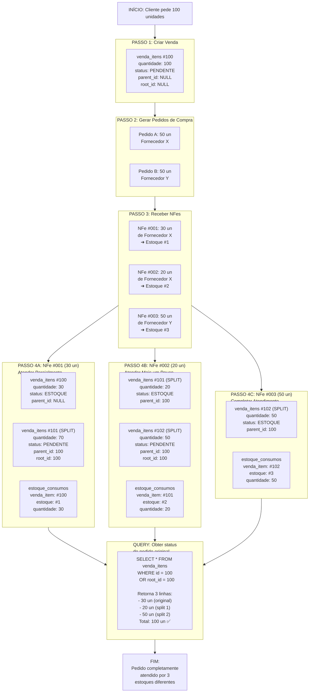
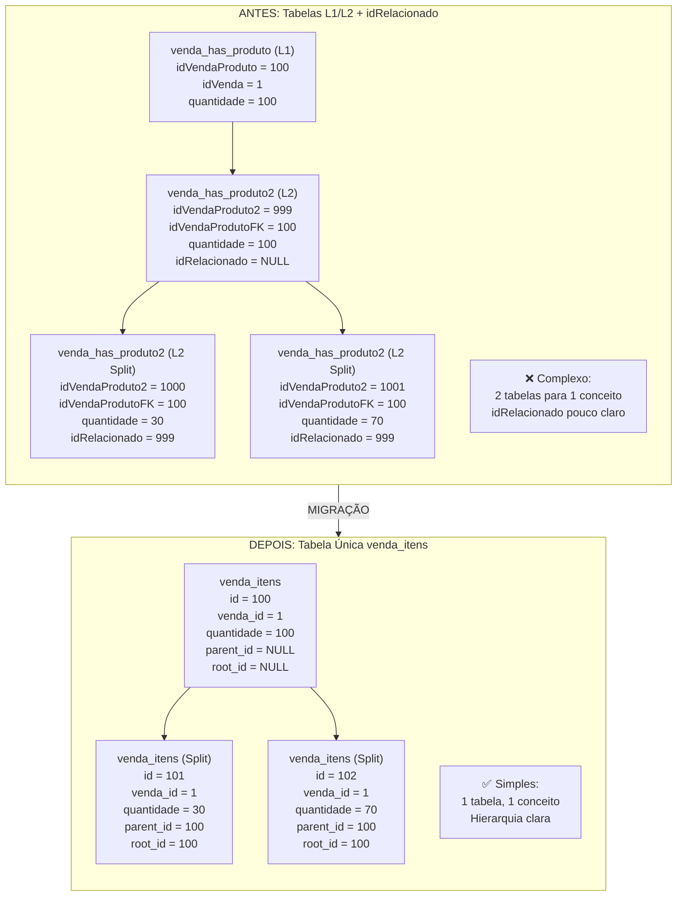
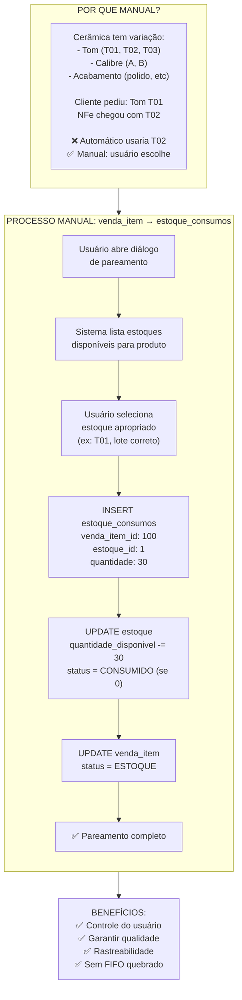
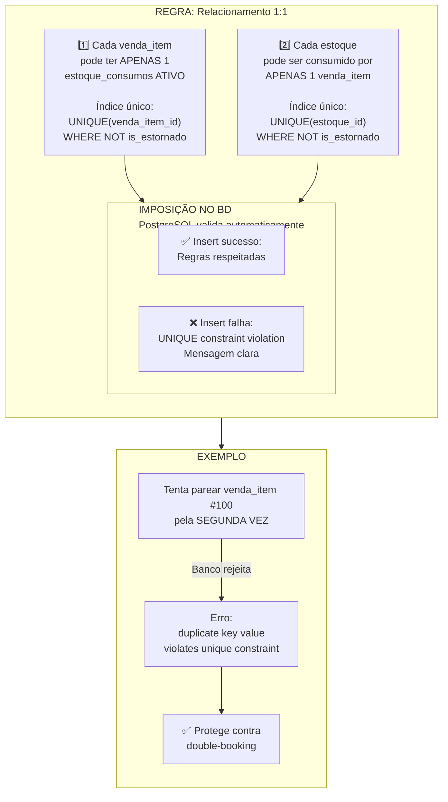
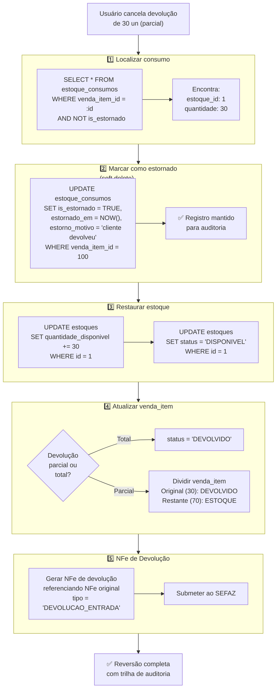
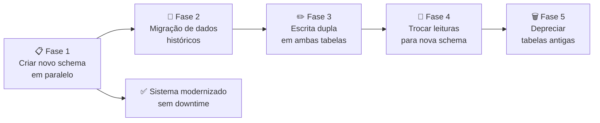

# Root Problem Analysis: 1:N:N Relationship Complexity

> **Essential Reading**: Read this FIRST to understand why schema redesign was necessary
> **Referenced from**: [03-decisoes/02-schema-redesenhado.md](../../03-decisoes/02-schema-redesenhado.md)
> **Type**: Problem visualization + root cause analysis

This document explains the core problem that the new schema solves:
- Old system structure (L1/L2 tables, FIFO broken, idRelacionado chains)
- Why M:N allocations are necessary
- How 3-entity model solves the problem

---

## The Problem: 1:N:N Relationship Chain

---

## Current System Problems

---

## The Solution: Simplified Schema

```mermaid
flowchart TB
    subgraph Solution["A SOLUÇÃO: Schema Redesenhado"]
        direction TB

        subgraph Step1["1️⃣ SIMPLIFICAR TABELAS"]
            direction LR
            Old["❌ venda_has_produto<br/>+ venda_has_produto2<br/>(2 tabelas)"]
            Arrow1["➜"]
            New["✅ venda_itens<br/>(1 tabela única)"]
            Old --> Arrow1 --> New
        end

        subgraph Step2["2️⃣ HIERARQUIA CLARA"]
            direction LR
            Old2["❌ idRelacionado<br/>cadeias"]
            Arrow2["➜"]
            New2["✅ parent_id + root_id<br/>estrutura clara"]
            Old2 --> Arrow2 --> New2
        end

        subgraph Step3["3️⃣ FIFO CORRETO"]
            direction LR
            Old3["❌ Automático<br/>(produto.idEstoque)"]
            Arrow3["➜"]
            New3["✅ MANUAL 1:1<br/>(ORDER BY data_entrada)"]
            Old3 --> Arrow3 --> New3
        end

        subgraph Step4["4️⃣ NORMALIZAR FK"]
            direction LR
            Old4["❌ fornecedor VARCHAR<br/>em múltiplas tabelas"]
            Arrow4["➜"]
            New4["✅ fornecedor_id FK<br/>em todo lugar"]
            Old4 --> Arrow4 --> New4
        end

        Step1 --> Solution2
        Step2 --> Solution2
        Step3 --> Solution2
        Step4 --> Solution2

        subgraph Solution2["RESULTADO:<br/>✅ Tabelas normalizadas<br/>✅ Queries simples<br/>✅ FIFO correto<br/>✅ Integridade garantida"]
        end
    end
```

---

## Processing Flow: How the Solution Handles 1:N:N

---

## Key Data Structure Changes

---

## Manual Stock Matching (vs Automatic)

---

## 1:1 Consumption Constraint

---

## Reversing/Canceling (Estorno)

---

## Summary: Problem vs Solution

| Aspecto | **PROBLEMA ATUAL** | **SOLUÇÃO PROPOSTA** |
|---------|-------------------|---------------------|
| **Estrutura L1/L2** | 2 tabelas (venda_has_produto + venda_has_produto2) | 1 tabela (venda_itens) |
| **Splits** | idRelacionado cadeias | parent_id + root_id |
| **Consumo** | Automático (quebrado FIFO) | Manual 1:1 com FIFO correto |
| **Refs Fornecedor** | VARCHAR em 9 tabelas | fornecedor_id FK |
| **Pareamento** | Sem validação | Constraints de integridade |
| **Devoluções** | Incompleto | Fluxo completo + NFe |
| **Auditoria** | Nenhuma | audit_log completo |
| **Query para pedido total** | Complexa (L1+L2+idRelacionado) | Simples (parent_id/root_id) |

---

## Implementation Roadmap

---

## References

- Complete schema: `./.claude/next-gen/03-decisoes/02-schema-redesenhado.md`
- Current flow analysis: `./.claude/next-gen/01-contexto/02-fluxos-estoque.md`
- Improvement options: `./.claude/next-gen/02-analise/02-melhorias.md`
- Database architecture: `./.claude/next-gen/04-arquitetura/02-banco-dados.md`
