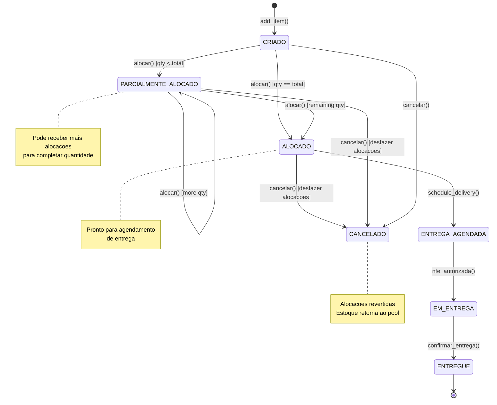
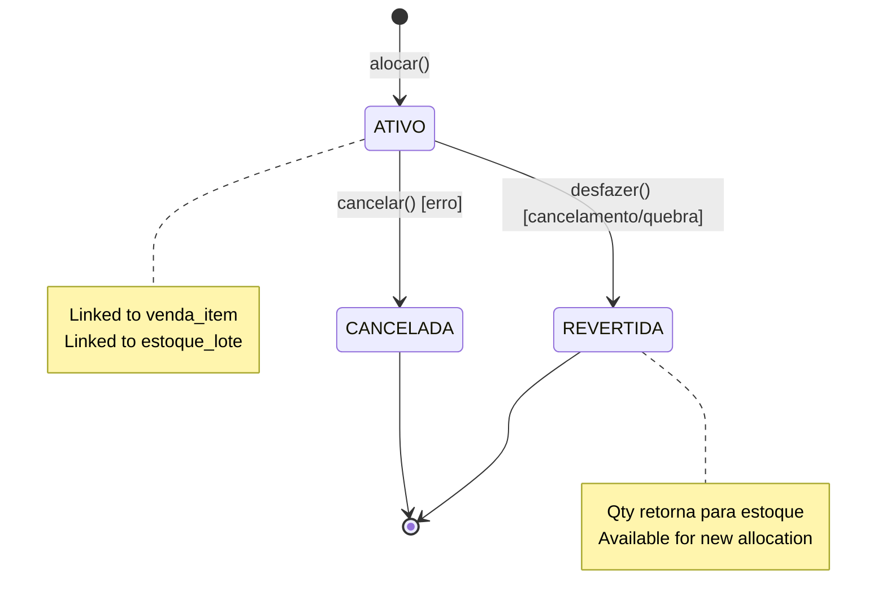

# Workflow: Alocação M:N (Venda Items ↔ Estoque Lotes)

> Status: **Proposto** | Versão: **2.0** | Pattern: **Event Sourcing + FIFO/FEFO**

---

## Visão Geral

O modelo de alocação M:N permite que um único **venda_item** seja satisfeito por múltiplos **estoque_lotes** (e vice-versa). Isso é essencial para:

- **Multi-supplier purchases**: Uma venda pode ser atendida com estoque de múltiplos fornecedores
- **FIFO/FEFO compliance**: Escolher lotes em ordem FIFO/FEFO mantendo rastreabilidade
- **Partial fulfillment**: Atender parcialmente uma venda quando estoque é limitado
- **Cost tracking**: Associar custos reais de estoque a cada venda

---

## Entidades Principais

```
┌─────────────────────────────────────────────────────────────┐
│                      Venda Item                              │
│  ────────────────────────────────────────────────────────   │
│  id, venda_id, produto_id, quantidade, status               │
│  origem (COMPRA | ESTOQUE)                                   │
└──────────────────┬──────────────────────────────────────────┘
                   │
              1:M  │  Alocações
                   │
     ┌─────────────▼──────────────────┐
     │       Alocação (M:N)           │
     │  ─────────────────────────    │
     │  id, venda_item_id, estoque_id │
     │  quantidade, status            │
     └─────────────┬──────────────────┘
                   │
              M:1  │  Estoque
                   │
┌──────────────────▼──────────────────┐
│      Estoque (Lote)                  │
│  ─────────────────────────────────  │
│  id, produto_id, quantidade,         │
│  quantidade_disponivel, custo        │
│  lote, data_validade, fornecedor     │
└────────────────────────────────────┘
```

---

## State Machine: Venda Item



---

## State Machine: Alocação



---

## Workflow: Criando uma Venda com Alocação

### 1️⃣ Criar Venda Item (status: CRIADO)

```php
// VendaService::adicionarItem()
$vendaItem = VendaItem::create([
    'venda_id' => $vendaId,
    'produto_id' => $produtoId,
    'quantidade' => 100,
    'valor_unitario' => 50.00,
    'origem' => VendaItemOrigem::ESTOQUE,  // or COMPRA
    'status' => VendaItemStatus::CRIADO,
]);

// Event: CRIADO recorded
DB::table('venda_itens_events')->insert([
    'venda_item_id' => $vendaItem->id,
    'event_type' => 'CRIADO',
    'event_data' => json_encode([...]),
    ...
]);
```

**Status**: `CRIADO`
**Alocações**: Nenhuma

---

### 2️⃣ Obter Sugestões FIFO/FEFO

```php
// AlocacaoService::sugestoesFifo()
$sugestoes = $alocacaoService->sugestoesFifo($vendaItem);

// Retorna lotes ordenados por data_entrada (FIFO)
$sugestoes = [
    [
        'id' => 101,
        'lote' => 'LOTE-2024-001',
        'quantidade_disponivel' => 50,
        'quantidade_para_alocar' => 50,  // After other allocations
        'custo_unitario' => 45.00,
        'data_entrada' => '2024-01-15',
    ],
    [
        'id' => 102,
        'lote' => 'LOTE-2024-002',
        'quantidade_disponivel' => 100,
        'quantidade_para_alocar' => 100,
        'custo_unitario' => 48.00,
        'data_entrada' => '2024-01-20',
    ],
];
```

**User action**: Seleciona manualmente qual(is) lote(s) usar

---

### 3️⃣ Alocar Item a Lote(s)

#### Primeira Alocação (50 de 100)

```php
// AlocacaoController::alocar()
$alocacao1 = $alocacaoService->alocar(
    vendaItemId: $vendaItem->id,
    estoqueId: 101,  // LOTE-2024-001
    quantidade: 50
);

// Tabelas atualizadas:
// alocacoes: INSERT (venda_item_id=X, estoque_id=101, qty=50, status=ATIVO)
// alocacoes_eventos: INSERT (CRIADA event)
// venda_itens_eventos: INSERT (PARCIALMENTE_ALOCADO event)
// venda_itens: UPDATE status = 'PARCIALMENTE_ALOCADO'
```

**Status venda_item**: `PARCIALMENTE_ALOCADO` (50/100)
**Alocações ativas**: 1 (50 unidades de LOTE-2024-001)

#### Segunda Alocação (50 de 100 remaining)

```php
$alocacao2 = $alocacaoService->alocar(
    vendaItemId: $vendaItem->id,
    estoqueId: 102,  // LOTE-2024-002
    quantidade: 50
);

// Tabelas atualizadas:
// alocacoes: INSERT (venda_item_id=X, estoque_id=102, qty=50, status=ATIVO)
// alocacoes_eventos: INSERT (CRIADA event)
// venda_itens_eventos: INSERT (ALOCADO event) - FULLY ALLOCATED!
// venda_itens: UPDATE status = 'ALOCADO'
```

**Status venda_item**: `ALOCADO` (100/100 ✓)
**Alocações ativas**: 2 (50 de LOTE-2024-001 + 50 de LOTE-2024-002)

---

### 4️⃣ Agendar Entrega

```php
// EntregaService::agendarEntrega()
$evento = $entregaService->agendarEntrega(
    vendaItemIds: [$vendaItem->id],
    veiculoId: 5,
    dataPrevista: Carbon::now()->addDays(3)
);

// Tabelas atualizadas:
// eventos_logistica: INSERT (tipo=ENTREGA, status=AGENDADO)
// entrega_itens: INSERT (venda_item_id, quantidade)
// venda_itens: UPDATE status = 'ENTREGA_AGENDADA'
```

**Status venda_item**: `ENTREGA_AGENDADA`
**Alocações**: Ainda ATIVO (serão consumidas durante entrega)

---

### 5️⃣ Confirmar Entrega

```php
// EntregaService::confirmarEntrega()
$entregaService->confirmarEntrega(
    entregaItem: $entregaItem,
    dataEntrega: now(),
    entregador: 'João Silva',
    recebedor: 'Cliente ABC'
);

// Tabelas atualizadas:
// entrega_itens: UPDATE status = 'ENTREGUE'
// venda_itens: UPDATE status = 'ENTREGUE'
// venda_itens_eventos: INSERT (ENTREGUE event)
```

**Status venda_item**: `ENTREGUE` ✓

---

## Workflow: Desfazendo Alocação (Breakage/Return)

### Cenário: Item chega quebrado

```
Planejado: 100 unidades
Entregue: 70 unidades
Quebrado: 30 unidades
```

### Processo:

```php
// EntregaService::registrarQuebra()
$entregaService->registrarQuebra(
    entregaItem: $entregaItem,
    quantidadeQuebrada: 30,
    motivo: 'Danos no transporte'
);

// O que acontece:
// 1. Marca quebra na entrega_item
DB::table('entrega_itens')->update([
    'quantidade_quebrada' => 30,
    'status' => 'PARCIAL',
]);

// 2. Reverte alocacoes correspondentes
// Se tínhamos 2 alocações (50+50), reverte as últimas (ou proporcionalmente):
foreach ($vendaItem->alocacoes()->orderByDesc('created_at')->limit(1) as $alocacao) {
    $this->alocacaoService->desfazerAlocacao(
        $alocacao,
        motivo: 'Quebra na entrega: Danos no transporte'
    );
}

// Tabelas atualizadas:
// alocacoes: UPDATE status = 'REVERTIDA' (para 30 unidades de uma alocacao)
// alocacoes_eventos: INSERT (REVERTIDA event)
// venda_itens_eventos: INSERT (PARCIALMENTE_ENTREGUE event?)
// financeiro_parcelas: INSERT (RECEBER type, valor negativo = CREDITO ao cliente)

// 3. Gera crédito para cliente
FinanceiroParcela::create([
    'tipo' => 'RECEBER',
    'cliente_id' => $venda->cliente_id,
    'valor' => -$valorQuebrado,  // Negative = credit
    'observacao' => 'Crédito por quebra na entrega',
]);
```

**Status alocação (30 unidades)**: `REVERTIDA` → Estoque fica DISPONÍVEL novamente
**Crédito ao cliente**: Criado automaticamente

---

## Consultas Típicas

### 1. Verificar Alocações de um Item

```php
$alocacoes = $vendaItem->alocacoes()
    ->where('status', AlocacaoStatus::ATIVO)
    ->with('estoque.fornecedor')
    ->get();

foreach ($alocacoes as $a) {
    echo "{$a->quantidade} unidades de {$a->estoque->lote} ";
    echo "({$a->estoque->fornecedor->razao_social})\n";
}

// Output:
// 50 unidades de LOTE-2024-001 (Fornecedor A)
// 50 unidades de LOTE-2024-002 (Fornecedor B)
```

### 2. Verificar Estoque Disponível para Alocar

```php
$estoque = Estoque::find(101);
$alocado = $estoque->quantidadeAlocada();  // 50 (from other venda_items)
$paraAlocar = $estoque->quantidadeParaAlocar();  // 100 - 50 = 50

echo "Total: {$estoque->quantidade_disponivel}\n";
echo "Já alocado: {$alocado}\n";
echo "Disponível para alocação: {$paraAlocar}\n";
```

### 3. Reconstruir Estado em Data Específica

```php
// Get all allocation events for a venda_item up to specific date
$eventos = DB::table('alocacoes_eventos')
    ->whereIn('alocacao_id', function ($q) use ($itemId) {
        $q->select('id')->from('alocacoes')
            ->where('venda_item_id', $itemId);
    })
    ->where('created_at', '<=', $data)
    ->orderBy('created_at')
    ->get();

// Replay events to reconstruct state
$estadoHistorico = [
    'alocacoes_ativas' => 0,
    'quantidade_alocada' => 0,
];

foreach ($eventos as $e) {
    match ($e->event_type) {
        'CRIADA' => $estadoHistorico['quantidade_alocada'] +=
            json_decode($e->event_data)->quantidade,
        'REVERTIDA' => $estadoHistorico['quantidade_alocada'] -=
            json_decode($e->event_data)->quantidade_revertida,
    };
}
```

---

## Regras de Validação

### 1. Quantidade Alocada ≤ Quantidade Venda Item

```php
if ($quantidade > $vendaItem->quantidadePendente()) {
    throw new BusinessException(
        "Quantidade solicitada ({$quantidade}) > necessária ({$vendaItem->quantidadePendente()})"
    );
}
```

### 2. Quantidade Alocada ≤ Estoque Disponível

```php
if ($quantidade > $estoque->quantidadeParaAlocar()) {
    throw new BusinessException(
        "Quantidade solicitada ({$quantidade}) > disponível ({$estoque->quantidadeParaAlocar()})"
    );
}
```

### 3. Não Pode Alocar se Venda Item Status ≠ CRIADO/PARCIALMENTE_ALOCADO

```php
if (!in_array($vendaItem->status, [
    VendaItemStatus::CRIADO,
    VendaItemStatus::PARCIALMENTE_ALOCADO,
])) {
    throw new BusinessException("Item status {$vendaItem->status} não permite alocação");
}
```

### 4. Desfazer Alocação só se Status = ATIVO

```php
if ($alocacao->status !== AlocacaoStatus::ATIVO) {
    throw new BusinessException("Apenas alocações ATIVO podem ser desfeitas");
}
```

---

## Transactions & Locks

Todas as operações usam transaction + locks para evitar race conditions:

```php
DB::transaction(function () {
    // Lock both venda_item and estoque to prevent simultaneous allocations
    $vendaItem = VendaItem::lockForUpdate()->find($itemId);
    $estoque = Estoque::lockForUpdate()->find($estoqueId);

    // Validate & create allocation
    $alocacao = Alocacao::create([...]);

    // Record events
    DB::table('alocacoes_eventos')->insert([...]);
    DB::table('venda_itens_eventos')->insert([...]);

    // Dispatch event
    event(new AlocacaoCriada($alocacao));
});
```

---

## Benefícios do Modelo M:N

| Benefício | Descrição |
|-----------|-----------|
| **Flexibilidade** | Multi-supplier fulfillment em uma única venda |
| **FIFO/FEFO** | Suporta rastreabilidade regulatória de estoque |
| **Auditoria** | Eventos imutáveis rastreiam cada alocação |
| **Partial Fulfillment** | Atender parcialmente com estoque limitado |
| **Cost Accuracy** | Associar custos reais a cada venda |
| **Compliance** | Atende requisitos de rastreabilidade fiscal |

---

## Anti-Patterns para Evitar

❌ **Não fazer**: Atualizar `venda_item.status` sem verificar alocações
✅ **Fazer**: Calcular status a partir das alocações ativas

❌ **Não fazer**: Deletar alocações
✅ **Fazer**: Marcar como REVERTIDA e registrar evento

❌ **Não fazer**: Permitir alocar sem validações
✅ **Fazer**: Validar quantidade + status + disponibilidade

❌ **Não fazer**: Usar queries sem locks em alocação
✅ **Fazer**: `lockForUpdate()` em ambas as entidades

---

## Índices Recomendados

```sql
-- Query alocacoes ativas de um item
CREATE INDEX idx_alocacoes_item_status
ON alocacoes (venda_item_id, status);

-- Query alocacoes de um lote
CREATE INDEX idx_alocacoes_estoque_status
ON alocacoes (estoque_id, status);

-- Query estoque disponível por produto/loja
CREATE INDEX idx_estoques_disponivel
ON estoques (produto_id, loja_id, status)
WHERE quantidade_disponivel > 0;

-- Query eventos por alocacao
CREATE INDEX idx_alocacoes_eventos_alocacao
ON alocacoes_eventos (alocacao_id, created_at);

-- Query eventos por venda_item
CREATE INDEX idx_venda_itens_eventos_item
ON venda_itens_eventos (venda_item_id, created_at);
```

---

## Referências

- Schema: `.claude/next-gen/rascunhos/schema-proposto.md` (linhas 845-889, 1199-1232)
- Modules: `vendas.md`, `estoque.md`, `logistica.md`
- Event Sourcing: See Event Sourcing sections in module docs
