# Schema Proposto: ERP Staccato v2 - Flowchart

## Overview: Architecture at a Glance

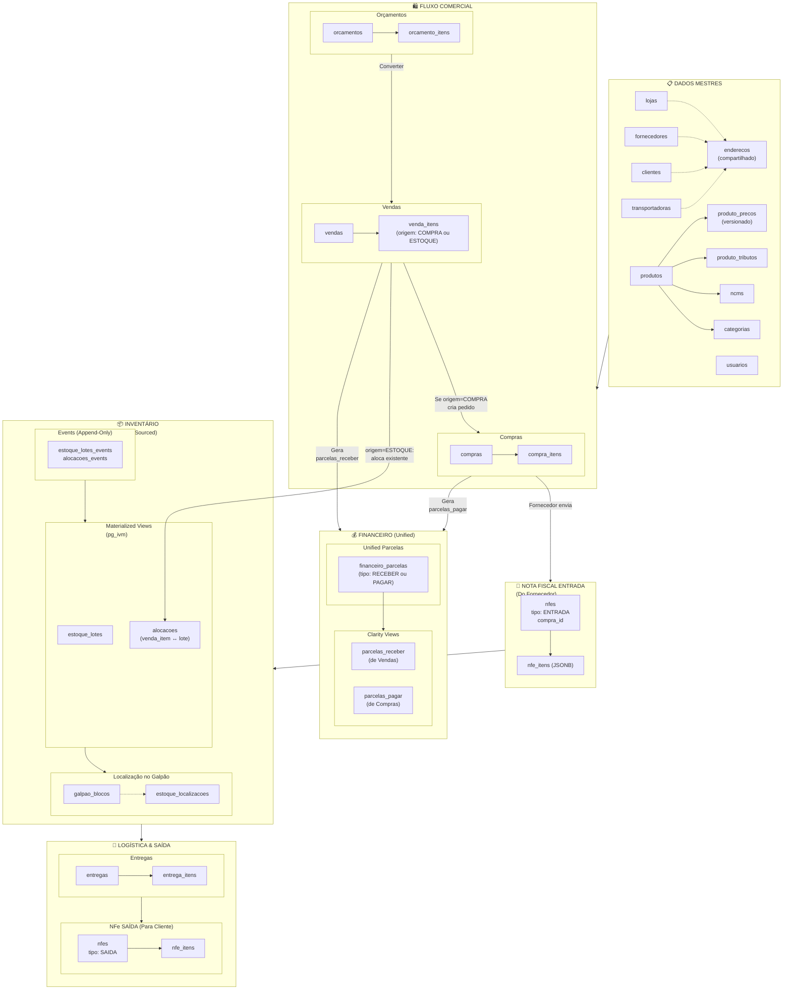

---

## Design Principles

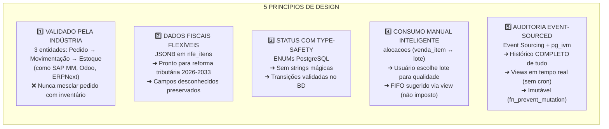

---

## Event Sourcing Architecture: Complete Audit Trail

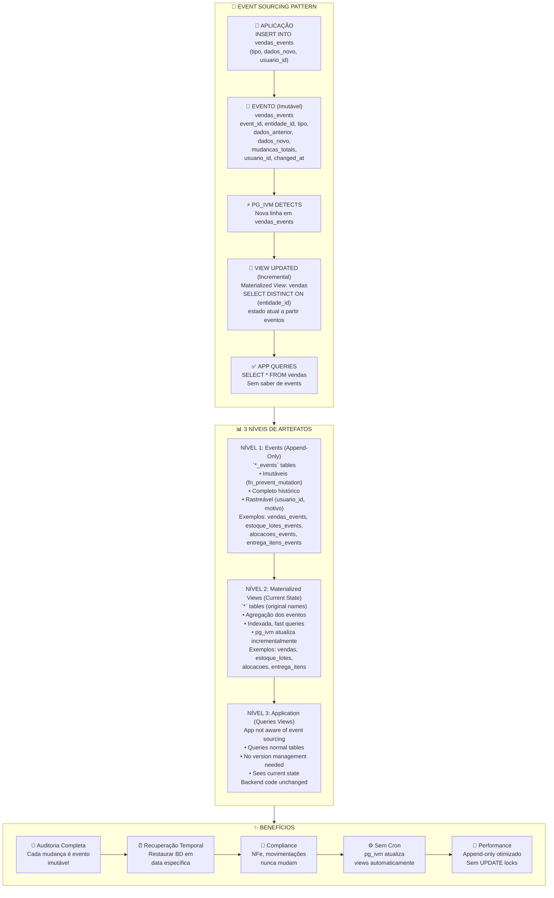

---

## Event Sourcing: Vendas Example (Status Transition)

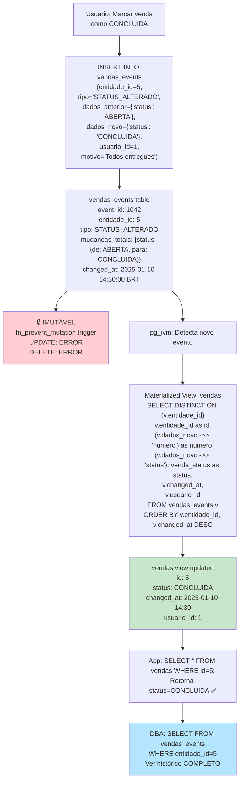

---

## Event Sourcing: Estoque Lotes Example (Allocation)

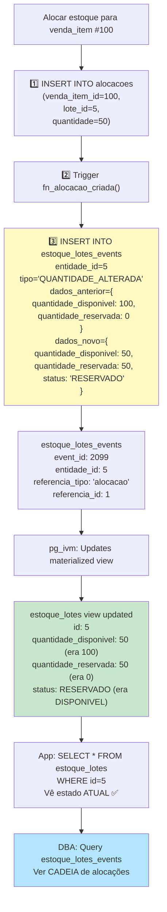

---

## Event Sourcing: Immutability Enforcement

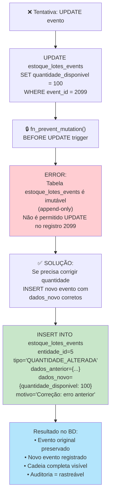

---

## Master Data: Cascade Relationships

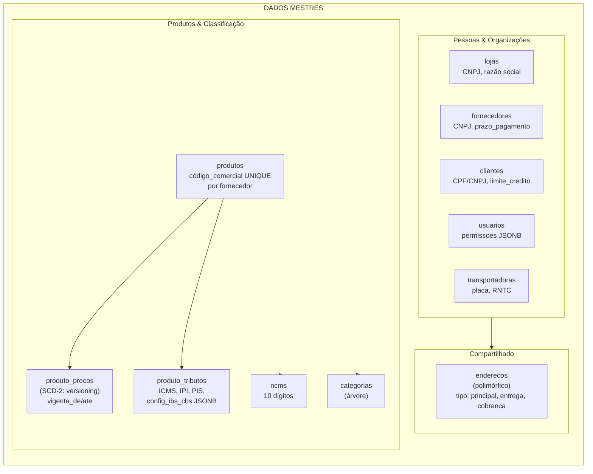

**Key Design Decision**: Produto tem FK obrigatório para fornecedor
- ✅ Garante origem
- ✅ Simplifica FIFO (já sabe fornecedor)
- ✅ Preços versionados (SCD-2) preservam histórico

---

## Commercial Flow: From Quote to Invoice

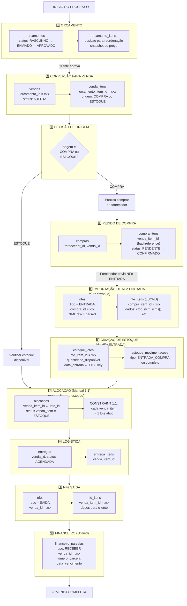

---

## Stock Model: Three-Layer Pattern (Industry Standard)

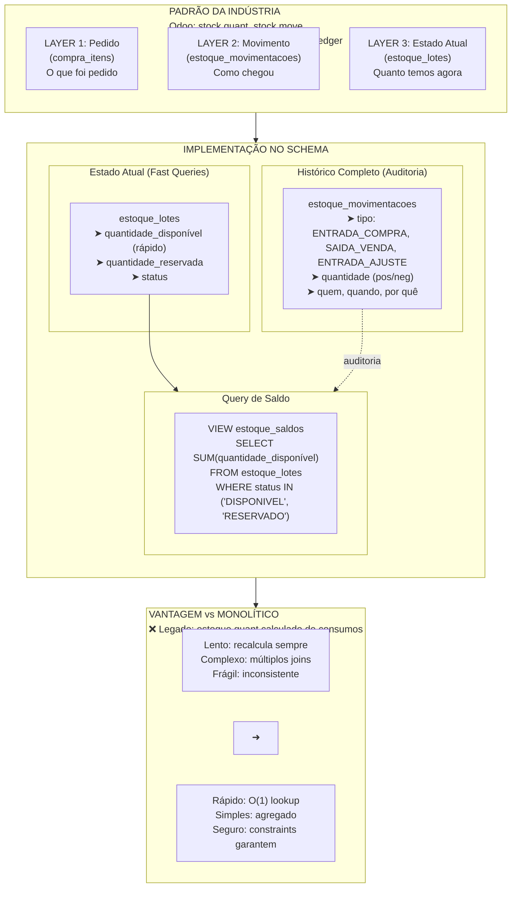

---

## Allocation (Alocação): M:N Model

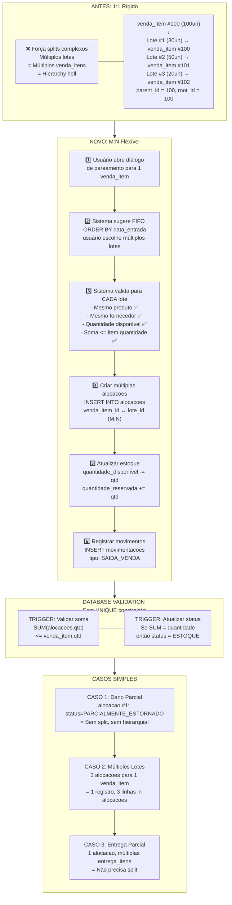

---

## Real-World Scenarios: M:N Allocation Model

### Scenario 1: Multiple NFes from One Purchase Order

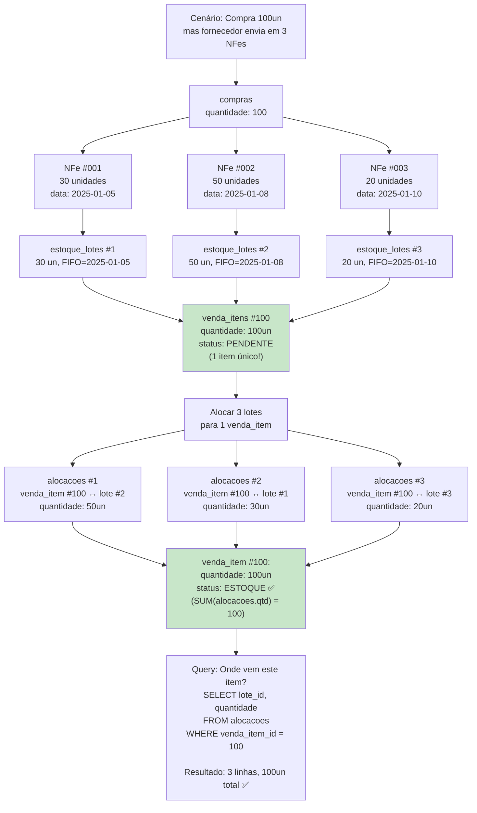

**Key Points:**
- 1 venda_item = 1 registro (sem splits!)
- Múltiplas alocacoes (M:N) ligam ao mesmo item
- Sem parent_id/root_id complexity
- FIFO respeitado: SELECT... ORDER BY data_entrada

---

### Scenario 2: Partial Delivery (Cliente quer parte, resto depois)

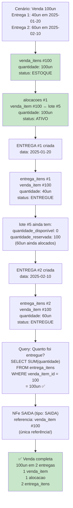

**Key Points:**
- 1 venda_item (sem splits!)
- 1 alocacao rastreia o estoque
- 2+ entrega_itens rastreiam entregas parciais
- Nenhuma hierarchia parent_id/root_id complexa
- Query simples: quanto foi entregue = SUM(entrega_itens.qtd)

---

### Scenario 3: Items Break After Delivery → Re-fulfillment

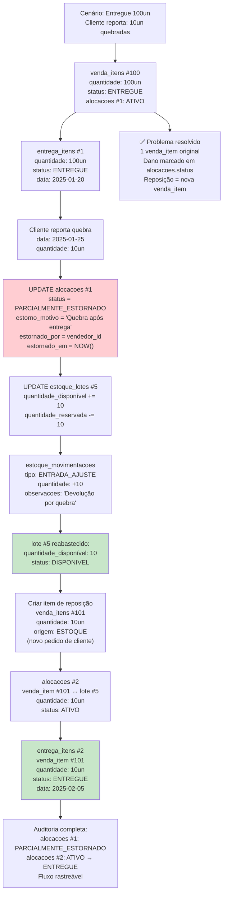

**Key Points:**
- Alocação original marcada como PARCIALMENTE_ESTORNADO
- Sem split de venda_item!
- Estoque restaurado automaticamente via trigger
- Reposição = novo venda_item + nova alocacao
- Auditoria clara no status de alocacoes

---

## Enforcement: 4-Layer Quantity Integrity

### How the System Prevents Over-Allocation

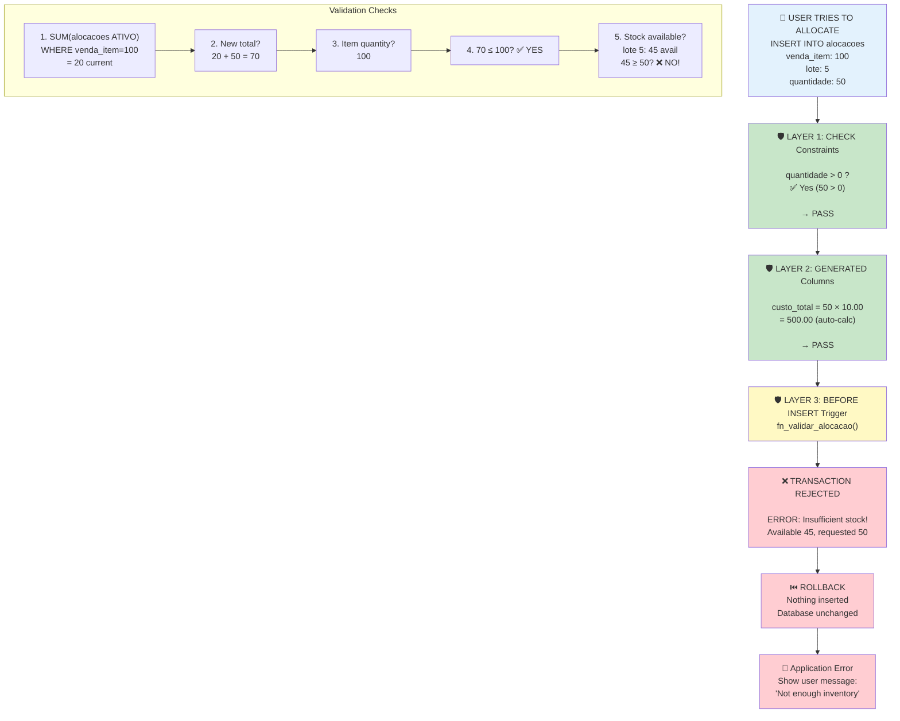

**What Happened?** Trigger caught over-allocation BEFORE it could corrupt the database!

---

### Success Path: Correct Allocation

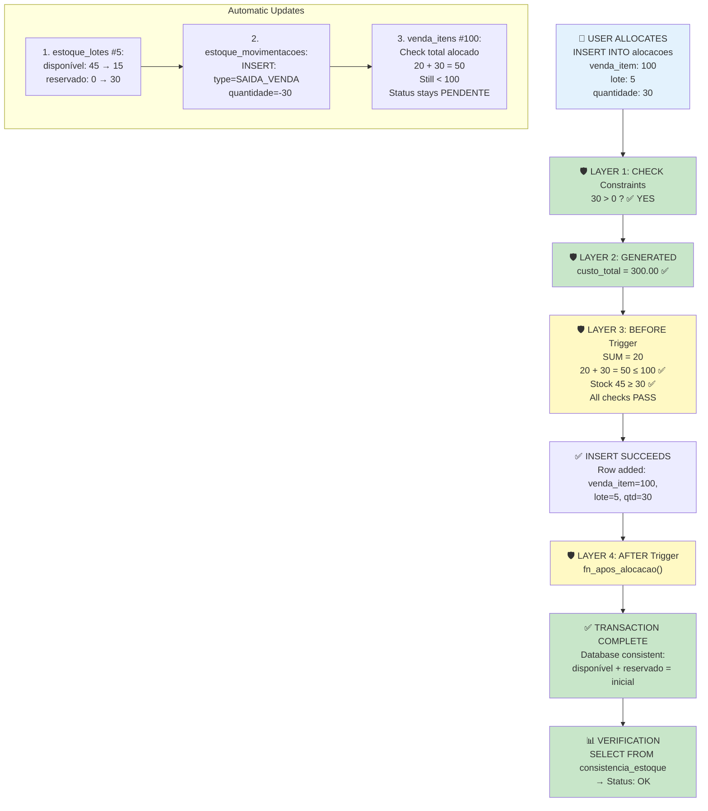

---

### The Golden Rule Enforcement

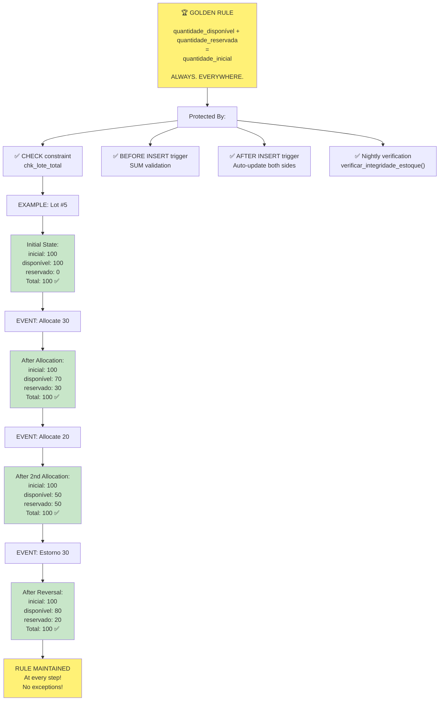

---

### Verification Layers: Catching Bugs

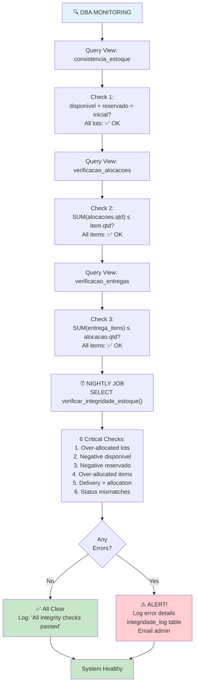

---

### What Enforcement Prevents

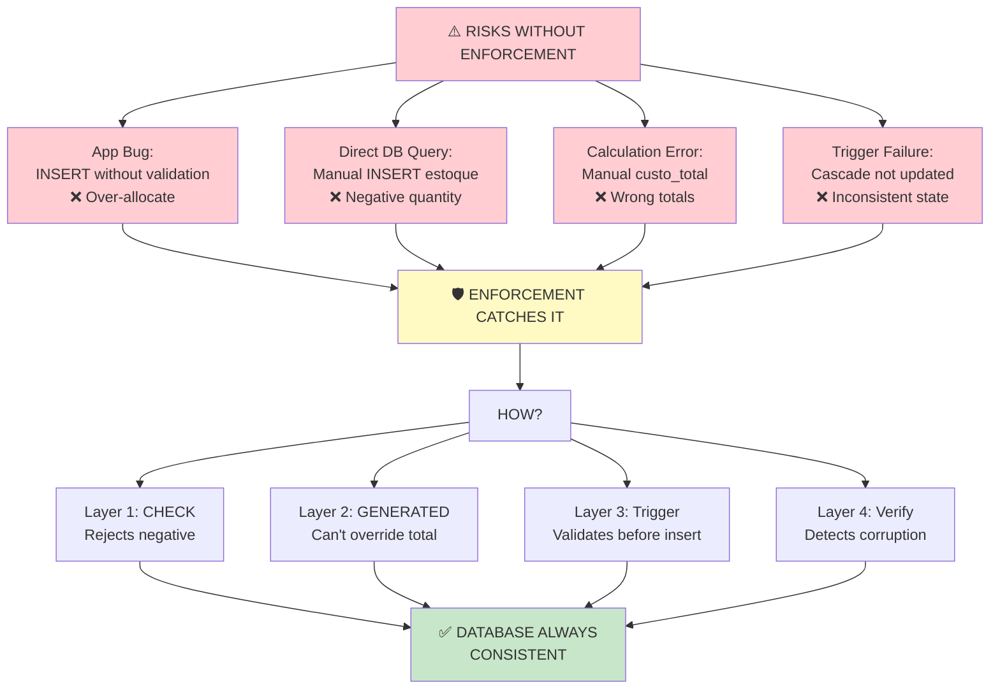

---

## Status State Machines: Venda vs Compra vs Entrega

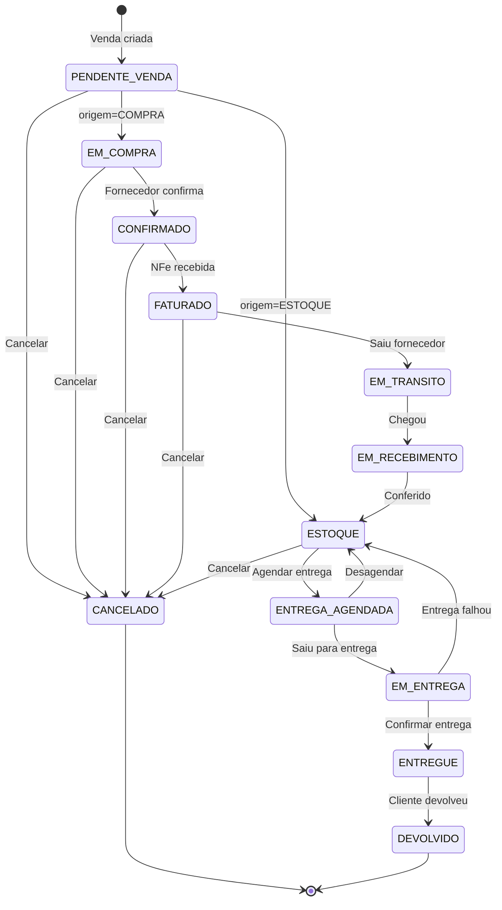

---

## ENUMs: Complete Type Safety

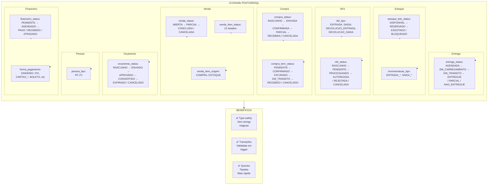

---

## NFe Strategy: Flexible JSONB for Tax Reforms

```mermaid
flowchart TB
    subgraph Problem["PROBLEMA ATUAL<br/>35+ colunas em estoque/estoque_has_consumo<br/>Para ICMS, IPI, PIS, COFINS<br/>❌ Reforma Tributária IBS/CBS: +35 colunas 2026-2033"]
    end

    Problem --> Solution

    subgraph Solution["SOLUÇÃO: JSONB em nfe_itens"]
        direction TB

        NFeHeader["nfes (header)<br/>id, numero, serie, chave<br/>tipo, status<br/>xml_original (raw)<br/>xml_protocolo (com protocolo)"]

        NFeItems["nfe_itens (itens)<br/>numero_item<br/>dados JSONB<br/>(preserva campos desconhecidos)"]

        NFeHeader --> NFeItems
    end

    Solution --> Structure

    subgraph Structure["ESTRUTURA JSONB dados"]
        direction TB

        BaseFields["Campos Mínimos:<br/>cfop, ncm, cest<br/>descricao, quantidade<br/>valor_unitario, valor_total"]

        ICMS["icms JSON:<br/>cst, origem, modalidade_bc<br/>valor_bc, aliquota, valor"]

        ICMSST["icms_st JSON:<br/>modalidade_bc, mva<br/>valor_bc, aliquota, valor"]

        IPI["ipi JSON:<br/>cst, valor_bc, aliquota, valor"]

        PIS["pis JSON:<br/>cst, valor_bc, aliquota, valor"]

        COFINS["cofins JSON:<br/>cst, valor_bc, aliquota, valor"]

        Future["Reforma 2026-2033:<br/>config_ibs_cbs JSON<br/>(adiciona campos novos<br/>sem migration)"]

        BaseFields --> ICMS
        ICMS --> ICMSST
        ICMSST --> IPI
        IPI --> PIS
        PIS --> COFINS
        COFINS --> Future
    end

    Structure --> Query

    subgraph Query["QUERIES FLEXÍVEIS"]
        direction LR

        Q1["Buscar por CFOP<br/>WHERE dados->>'cfop' = '5102'"]
        Q2["ICMS > 0<br/>WHERE (dados->'icms'->>'valor')::numeric > 0"]
        Q3["Soma de ICMS-ST<br/>SUM((dados->'icms_st'->>'valor')::numeric)"]

        Q1 --- Q2
        Q2 --- Q3
    end

    Query --> Index

    subgraph Index["ÍNDICES"]
        direction LR

        GIN["CREATE INDEX<br/>ON nfe_itens<br/>USING GIN(dados)<br/>✅ Full-text fiscal"]

        Specific["CREATE INDEX<br/>ON nfe_itens<br/>((dados->>'cfop'))<br/>✅ Específico (conforme profiling)"]

        GIN --- Specific
    end
```

---

## Product Versionization: SCD-2 Pattern

```mermaid
flowchart TB
    subgraph Current["PROBLEMA: Preço Estático"]
        direction LR

        Problem["❌ Atualizar produto.preco_venda<br/>↓<br/>Perde histórico<br/>❌ Não sabe preço em 2024-06"]
    end

    Current --> SCD2

    subgraph SCD2["SOLUÇÃO: Slowly Changing Dimension Type 2"]
        direction TB

        Main["produtos<br/>id, fornecedor_id, codigo_comercial<br/>(dados imutáveis)"]

        PriceTable["produto_precos<br/>produto_id, custo, valor_venda<br/>vigente_de, vigente_ate<br/>margem (GENERATED)"]

        View["VIEW produto_preco_atual<br/>SELECT * FROM produto_precos<br/>WHERE vigente_de <= TODAY<br/>  AND (vigente_ate IS NULL OR vigente_ate >= TODAY)<br/>ORDER BY produto_id, vigente_de DESC"]

        Main --> PriceTable
        PriceTable --> View
    end

    SCD2 --> Example

    subgraph Example["EXEMPLO"]
        direction TB

        Ex["Histórico de preços do Produto #1:<br/><br/>id | custo | venda | vigente_de | vigente_ate<br/>1  | 30.00 | 45.00 | 2024-01-01 | 2024-05-31<br/>2  | 30.00 | 50.00 | 2024-06-01 | 2024-12-31<br/>3  | 32.00 | 55.00 | 2025-01-01 | NULL (vigente)"]
    end

    Example --> Audit

    subgraph Audit["AUDITORIA DE PREÇO"]
        direction LR

        Audit1["Saber preço em data X:<br/>SELECT * FROM produto_precos<br/>WHERE produto_id = 1<br/>  AND vigente_de <= '2024-07-15'<br/>  AND vigente_ate >= '2024-07-15'"]

        Audit2["Quem atualizou:<br/>SELECT * FROM audit_log<br/>WHERE tabela = 'produto_precos'<br/>  AND registro_id = 2"]

        Audit1 --- Audit2
    end
```

---

## pg_ivm Setup: Installation & Configuration

```mermaid
flowchart TB
    subgraph Step1["PASSO 1: Instalar Extensão"]
        direction TB
        Install["# Uma vez (no servidor PostgreSQL)<br/>CREATE EXTENSION pg_ivm;<br/><br/>✅ pg_ivm agora está disponível"]
    end

    Step1 --> Step2

    subgraph Step2["PASSO 2: Converter Views para Incremental"]
        direction TB
        Drop["1️⃣ DROP antigas views<br/>DROP MATERIALIZED VIEW vendas;<br/>DROP MATERIALIZED VIEW estoque_lotes;<br/>DROP MATERIALIZED VIEW alocacoes;"]
        Create["2️⃣ Recriar como INCREMENTAL<br/>CREATE INCREMENTAL MATERIALIZED VIEW vendas AS<br/>SELECT DISTINCT ON (v.entidade_id)<br/>  v.entidade_id as id,<br/>  (v.dados_novo ->> 'status') as status<br/>FROM vendas_events v<br/>ORDER BY v.entidade_id, v.changed_at DESC;"]
        Drop --> Create
    end

    Step2 --> Step3

    subgraph Step3["PASSO 3: Repeat for All Views"]
        direction LR
        V1["estoque_lotes"]
        V2["alocacoes"]
        V3["entrega_itens"]
        V4["financeiro_parcelas"]
        V5["..."]
        V1 --> V2 --> V3 --> V4 --> V5
    end

    Step3 --> Complete

    subgraph Complete["✅ PRONTO!"]
        direction TB
        Now["pg_ivm cuida de TUDO:<br/>• INSERT em *_events table<br/>  ↓<br/>• pg_ivm detecta mudança<br/>  ↓<br/>• Materialized view atualizada incrementalmente<br/>  ↓<br/>• App queries view (sempre atual)<br/><br/>📌 Sem cron jobs<br/>📌 Sem REFRESH MATERIALIZED VIEW manual<br/>📌 Zero overhead (incremental, não full rebuild)"]
    end

    style Install fill:#c8e6c9
    style Complete fill:#81c784
```

---

## Inventory Views: Helper Queries

```mermaid
flowchart TB
    subgraph Views["2 VIEWS IMPORTANTES"]
        direction TB

        Saldos["estoque_saldos<br/>SELECT loja_id, produto_id, fornecedor_id<br/>SUM(quantidade_disponível) as disponivel<br/>SUM(quantidade_reservada) as reservado<br/>SUM(...) as total<br/>custo_medio<br/>GROUP BY loja_id, produto_id<br/><br/>👁️ Dashboard de estoque"]

        FIFO["estoque_fifo<br/>SELECT el.*, ROW_NUMBER() OVER<br/>(PARTITION BY produto_id, loja_id<br/> ORDER BY data_entrada)<br/><br/>👁️ Sugestão FIFO para alocação"]
    end

    Views --> Queries

    subgraph Queries["QUERY EXAMPLES"]
        direction TB

        Q1["Estoque baixo<br/>SELECT * FROM estoque_saldos<br/>WHERE disponivel < produto.estoque_minimo"]

        Q2["Próximo FIFO a alocar<br/>SELECT * FROM estoque_fifo<br/>WHERE produto_id = 123<br/>  AND ordem_fifo = 1<br/>  AND quantidade_disponível > 0"]

        Q3["Valor em estoque<br/>SELECT SUM(quantidade_disponível * custo_unitario)<br/>FROM estoque_lotes<br/>WHERE produto_id = 123"]

        Q1 --> Q2
        Q2 --> Q3
    end
```

---

## Triggers: Automatic Data Protection

```mermaid
flowchart TB
    subgraph Triggers["6 TRIGGERS AUTOMÁTICOS"]
        direction TB

        T1["fn_validar_alocacao()<br/>➜ Valida regras antes INSERT<br/>- Quantidade igual<br/>- Mesmo produto<br/>- Mesmo fornecedor<br/>- Status permite<br/>- Estoque suficiente"]

        T2["fn_apos_alocacao()<br/>➜ Atualiza estoque após alocação<br/>- quantidade_disponível -=<br/>- quantidade_reservada +=<br/>- Status DISPONIVEL→RESERVADO<br/>- Registra movimentação"]

        T3["fn_audit_trigger()<br/>➜ Log automático em INSERT/UPDATE/DELETE<br/>- dados_antigos JSONB<br/>- dados_novos JSONB<br/>- campos_alterados TEXT[]"]

        T4["fn_validar_transicao_venda_item()<br/>➜ Valida transições de status<br/>- Garante fluxo válido<br/>- Rejeita transições inválidas"]

        T5["Triggers financeiros<br/>➜ Atualizar saldo_devedor cliente<br/>➜ Atualizar saldo fornecedor"]

        T6["Triggers de NFe<br/>➜ Criar movimentações de estoque<br/>➜ Validar chave NFe"]
    end
```

---

## Comparison: Legacy vs Proposed

```mermaid
flowchart LR
    subgraph Legacy["❌ LEGADO"]
        direction TB

        L1["Tabelas L1/L2<br/>venda_has_produto +<br/>venda_has_produto2"]
        L2["idRelacionado cadeias<br/>(confuso)"]
        L3["fornecedor VARCHAR<br/>em 9 tabelas"]
        L4["Status strings<br/>'Em Estoque'"]
        L5["FIFO automático<br/>(quebrado)"]
        L6["~30 colunas<br/>fiscais em estoque"]
        L7["Sem auditoria"]
        L8["Devoluções incompletas"]
        L9["Mega-tabela produto<br/>100+ colunas"]
    end

    Legacy -->|"MIGRAÇÃO"| Proposed

    subgraph Proposed["✅ PROPOSTO"]
        direction TB

        P1["Tabela única venda_itens<br/>parent_id + root_id"]
        P2["Hierarquia clara<br/>(auto-referência)"]
        P3["fornecedor_id FK<br/>em todo lugar"]
        P4["ENUMs PostgreSQL<br/>com transições"]
        P5["Seleção manual<br/>+ sugestão FIFO"]
        P6["JSONB em nfe_itens<br/>(flexível)"]
        P7["audit_log completo<br/>(triggers automáticos)"]
        P8["Fluxo completo<br/>+ NFe DEVOLUCAO_*"]
        P9["produtos + produto_precos +<br/>produto_tributos"]
    end
```

---

## Statistics

```
SCHEMA PROPOSTO STATISTICS:
├── ENUMs........................... 15
├── Tabelas......................... 32
├── Views........................... 2
├── Triggers........................ 6
├── Índices......................... ~40
├── Constraints..................... ~30
├── Foreign Keys.................... ~25
└── CHECK Constraints............... ~15

MAIOR MUDANÇA:
• Dados fiscais: ~30 colunas → JSONB em nfe_itens
• Tabelas: L1+L2 (2) → Única venda_itens (1)
• Referências: VARCHAR → FK
• Status: Strings → ENUMs
• Auditoria: 0 → triggers automáticos
```

---

## Key Implementation Notes

```mermaid
flowchart TB
    subgraph Notes["⚠️ NOTAS IMPORTANTES"]
        direction TB

        N1["1️⃣ Produto obrigatório tem fornecedor_id<br/>➜ Garante origem<br/>➜ Simplifica relacionamentos"]

        N2["2️⃣ Preços são versionados (SCD-2)<br/>➜ Preserva histórico<br/>➜ Queries em date específica possível"]

        N3["3️⃣ Alocações são soft-delete<br/>➜ is_estornado = TRUE (nunca DELETE)<br/>➜ Auditoria completa"]

        N4["4️⃣ Movimentações são imutáveis<br/>➜ INSERT apenas<br/>➜ Histórico garantido"]

        N5["5️⃣ NFe itens em JSONB<br/>➜ Pronto para reforma tributária<br/>➜ Sem novas migrations"]

        N6["6️⃣ Split automático por parent_id/root_id<br/>➜ Entregas parciais<br/>➜ Devoluções parciais"]
    end
```

---

## References

- Industry Patterns: SAP MM, Odoo (stock.quant/stock.move), ERPNext
- Decision Rationale: `./.claude/next-gen/03-decisoes/02-schema-redesenhado.md`
- Problems Addressed: `./.claude/next-gen/02-analise/02-melhorias.md`
- Full Implementation: `./.claude/next-gen/rascunhos/schema-proposto.md`
