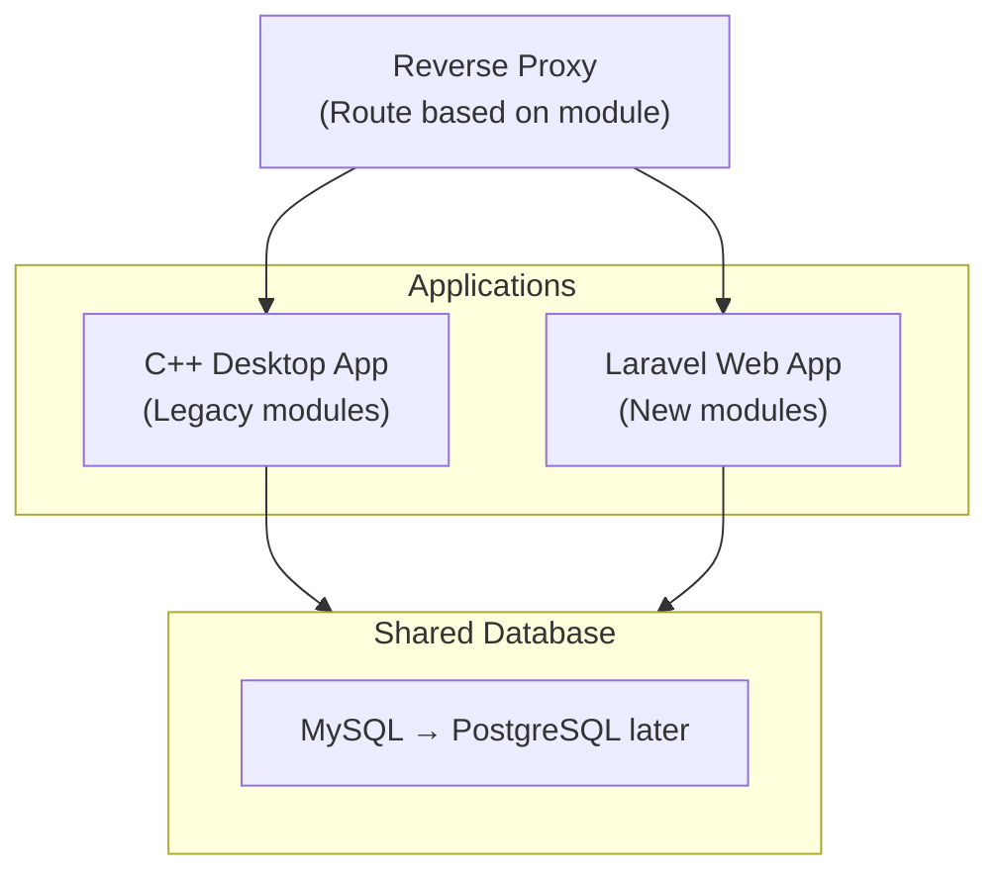
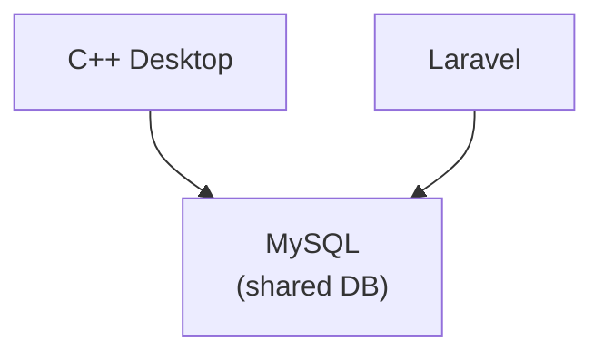

# Migration Plan

> Status: **Draft**
> Last updated: 2025-12-27

---

## Strategy Options

### Option 1: Big Bang Rewrite

**Approach**: Build complete new system, switch over all at once.

| Pros | Cons |
|------|------|
| Clean slate | High risk |
| No legacy constraints | Long time without value delivery |
| Consistent architecture | All-or-nothing |
| Simpler data migration | Team blocked on old bugs |

**Timeline**: 6-12 months
**Risk**: HIGH

---

### Option 2: Strangler Fig Pattern (Recommended)

**Approach**: Gradually replace old system piece by piece.

| Pros | Cons |
|------|------|
| Incremental value | Temporary complexity |
| Lower risk | Need to maintain two systems |
| Can validate approach early | Data sync challenges |
| Team learns as they go | Some duplicate code |

**Timeline**: 12-18 months
**Risk**: MEDIUM

---

### Option 3: Parallel Run

**Approach**: Build new system while old runs, mirror data, cut over.

| Pros | Cons |
|------|------|
| Lowest risk | Most expensive |
| Full validation before switch | Double infrastructure |
| Easy rollback | Data sync complexity |
| Users can compare | Longest timeline |

**Timeline**: 18-24 months
**Risk**: LOW

---

## Recommended Approach: Strangler Fig

### Why?
1. **Early validation** - Know if approach works before full commitment
2. **Continuous delivery** - Users get value incrementally
3. **Team learning** - Build skills on simpler modules first
4. **Risk mitigation** - Can adjust course based on learnings

---

## Phase Plan

### Phase 0: Foundation (Month 1-2)

**Goal**: Set up infrastructure and patterns.

**Tasks**:
- [ ] Create Laravel project with chosen stack
- [ ] Set up PostgreSQL database
- [ ] Implement authentication (users from legacy DB)
- [ ] Create base UI components (layout, navigation)
- [ ] Set up CI/CD pipeline
- [ ] Configure development environment

**Deliverables**:
- Working Laravel app with login
- Development environment for team
- Coding standards documented

---

### Phase 1: Cadastros (Month 2-4)

**Goal**: Migrate master data management (simplest CRUD).

**Modules**:
1. Fornecedor (Supplier)
2. Cliente (Customer)
3. Produto (Product)
4. Transportadora (Carrier)
5. NCM (Tax classification)

**Why start here**:
- Simple CRUD operations
- Establishes patterns
- Low business logic complexity
- Foundation for other modules

**Tasks**:
- [ ] Create Eloquent models
- [ ] Build form validation (Request classes)
- [ ] Implement CRUD controllers
- [ ] Create UI components (forms, tables)
- [ ] Write tests
- [ ] Data sync with legacy (if running parallel)

**Success Criteria**:
- Users can manage suppliers/customers/products in web
- Data stays in sync with desktop app
- No data loss or corruption

---

### Phase 2: Compras (Month 4-6)

**Goal**: Migrate purchase workflow.

**Components**:
- Purchase order creation
- Confirmation workflow
- Invoice linking
- Goods receipt

**Dependencies**: Phase 1 (Cadastros)

**Tasks**:
- [ ] Implement CompraService
- [ ] Create status workflow with events
- [ ] Build purchase list and detail views
- [ ] Integrate with ContasPagar generation
- [ ] Create Estoque entry on receipt

**Success Criteria**:
- Full purchase lifecycle in web
- Accounts payable auto-generated
- Stock updated on receipt

---

### Phase 3: Estoque (Month 6-8)

**Goal**: Migrate inventory management.

**Components**:
- Stock entry/receipt
- Consumption tracking
- Inventory queries
- Warehouse location (Galpão)

**Dependencies**: Phase 2 (Compras)

**Tasks**:
- [ ] Implement EstoqueService
- [ ] FIFO/LIFO consumption logic
- [ ] Stock level queries and reports
- [ ] Warehouse block management

**Success Criteria**:
- Real-time stock visibility
- Consumption tracking accurate
- Warehouse location assignment

---

### Phase 4: Financeiro (Month 8-10)

**Goal**: Migrate financial management.

**Components**:
- Accounts Payable (Contas a Pagar)
- Accounts Receivable (Contas a Receber)
- Payment registration
- Bank reconciliation (CNAB)

**Dependencies**: Phase 2 (Compras), Phase 5 (Vendas - partial)

**Tasks**:
- [ ] Implement financial services
- [ ] Payment workflow
- [ ] CNAB file generation/import
- [ ] Financial reports

**Success Criteria**:
- Track all payables/receivables
- Process payments
- Generate bank files

---

### Phase 5: Vendas (Month 10-13)

**Goal**: Migrate sales workflow (most complex).

**Components**:
- Quote creation (Orçamento)
- Sales order
- Stock allocation
- Delivery scheduling
- Sales completion

**Dependencies**: Phase 1, 3 (Cadastros, Estoque)

**Tasks**:
- [ ] Implement VendaService
- [ ] Quote → Sale conversion
- [ ] Stock reservation logic
- [ ] Integration with Compras (auto-generate)
- [ ] Integration with Financeiro (receivables)

**Success Criteria**:
- Full sales lifecycle
- Stock properly allocated
- Financials auto-generated

---

### Phase 6: NFe (Month 13-15)

**Goal**: Migrate electronic invoice.

**Components**:
- NFe emission
- NFe cancellation
- NFe import (from suppliers)
- DANFE generation

**Dependencies**: Phase 5 (Vendas), Phase 2 (Compras)

**Tasks**:
- [ ] Choose and integrate NFe provider
- [ ] Implement NfeService interface
- [ ] Build emission workflow
- [ ] XML storage and retrieval
- [ ] Certificate management

**Success Criteria**:
- Emit valid NFe from web
- Import supplier NFe
- Proper tax calculations

---

### Phase 7: Logística (Month 15-16)

**Goal**: Migrate delivery management.

**Components**:
- Delivery calendar
- Route planning
- Carrier assignment
- Delivery confirmation

**Dependencies**: Phase 5 (Vendas)

**Tasks**:
- [ ] Calendar component
- [ ] Delivery scheduling
- [ ] Status tracking

---

### Phase 8: Reports & Polish (Month 16-18)

**Goal**: Complete migration, retire legacy.

**Tasks**:
- [ ] Migrate all reports
- [ ] User training
- [ ] Performance optimization
- [ ] Legacy system retirement
- [ ] Database migration (MySQL → PostgreSQL)

---

## Database Migration Strategy

### Option A: Shared Database (Recommended for Strangler)

Both systems read/write same MySQL database.

**Pros**: No sync needed, consistent data
**Cons**: Schema changes affect both systems

### Option B: PostgreSQL Migration Later

1. Run shared MySQL during migration
2. After all modules migrated, switch to PostgreSQL
3. One-time data migration
4. Retire MySQL

---

## Risk Mitigation

| Risk | Mitigation |
|------|------------|
| Data corruption during sync | Extensive testing, transaction safety |
| Users confused by two systems | Clear communication, training |
| Scope creep | Strict phase boundaries |
| NFe integration issues | Start SaaS, abstract interface |
| Team capacity | Prioritize, defer non-essential features |
| Performance issues | Load testing each phase |

---

## Success Metrics

### Per Phase
- [ ] All features functional
- [ ] No data loss
- [ ] Performance acceptable (< 2s page load)
- [ ] Test coverage > 80%
- [ ] User acceptance sign-off

### Overall
- [ ] All modules migrated
- [ ] Legacy system retired
- [ ] Users trained
- [ ] Zero downtime transition
- [ ] Cost reduction achieved

---

## Team Requirements

| Role | Responsibility |
|------|---------------|
| Tech Lead | Architecture decisions, code review |
| Backend Dev (1-2) | Laravel services, API |
| Frontend Dev (1) | Vue/Livewire components |
| DBA | Database migration, optimization |
| QA | Testing, validation |
| Product Owner | Requirements, prioritization |

---

## Next Steps

1. **Decide on frontend framework** → See [03-frontend.md](./03-frontend.md)
2. **Decide on NFe strategy** → See [04-modules/nfe.md](./04-modules/nfe.md)
3. **Set up development environment**
4. **Begin Phase 0**
