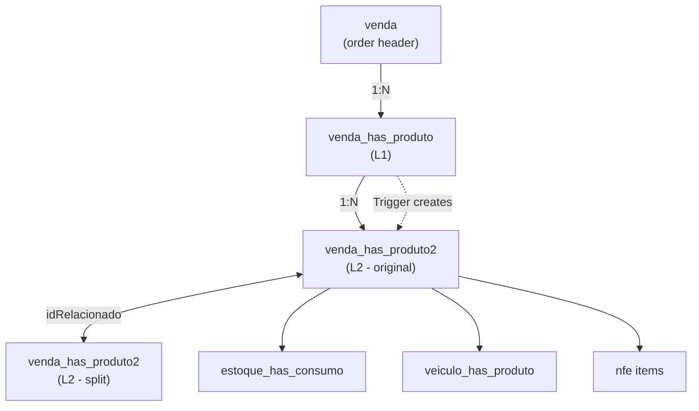

# L1/L2 Table Simplification - Deep Exploration

> Status: **Analysis**
> Last updated: 2025-12-27
> Focus: Flatten two-level table architecture to single table

---

## Table of Contents

1. [Current Architecture Analysis](#1-current-architecture-analysis)
2. [Problems with Current Design](#2-problems-with-current-design)
3. [Option A: Single Table with Self-Reference](#3-option-a-single-table-with-self-reference)
4. [Option B: Keep L2 Only, Derive L1](#4-option-b-keep-l2-only-derive-l1)
5. [Option C: Event Sourcing](#5-option-c-event-sourcing)
6. [Comparison Matrix](#6-comparison-matrix)
7. [Recommendation](#7-recommendation)
8. [Migration Strategy](#8-migration-strategy)

---

## 1. Current Architecture Analysis

### 1.1 The Two Tables

**Level 1 (L1)**: `venda_has_produto`
- Created when: Quote/Order is placed
- Purpose: "What the customer ordered"
- Granularity: One row per product in the order
- Contains: Original quantities, prices, discounts

**Level 2 (L2)**: `venda_has_produto2`
- Created when: L1 is created (trigger copies data)
- Purpose: "How the order is being fulfilled"
- Granularity: Can have MULTIPLE rows per L1 row (splits)
- Contains: Fulfillment status, delivery dates, NFe links

### 1.2 The `idRelacionado` Pattern

When an item is **split** (partial delivery, broken items, returns), a new L2 row is created with:
- New `idVendaProduto2` (primary key)
- `idRelacionado` = original `idVendaProduto2` (links to parent)

```
Original Order: 10 boxes
    │
    ├── [idVendaProduto2=100] 10 boxes, status=PENDENTE
    │
    │   (NFe arrives with only 6 boxes - split happens)
    │
    ├── [idVendaProduto2=100] 6 boxes, status=ESTOQUE
    │
    └── [idVendaProduto2=101, idRelacionado=100] 4 boxes, status=PENDENTE
```

### 1.3 Split Scenarios

| Scenario | What Happens |
|----------|--------------|
| **Partial NFe** | NFe has less qty than PO → `dividirCompra()` + `dividirVenda()` |
| **Broken items** | Delivery has damaged items → `dividirEntrega()` |
| **Partial delivery** | Only some boxes fit in truck → `dividirVenda()` |
| **Returns** | Customer returns items → new L2 with negative qty |

### 1.4 Current Table Relationships



### 1.5 Key Columns in L2

```sql
-- From venda_has_produto2
idVendaProduto2      -- PK
idVendaProduto1      -- FK to L1 (idVendaProdutoFK)
idRelacionado        -- Self-reference for splits
idVenda              -- FK to order header
idProduto            -- FK to product
fornecedor           -- Supplier name (denormalized!)

-- Quantities
quant                -- Quantity in units
caixas               -- Quantity in boxes
kg                   -- Weight
quantCaixa           -- Units per box

-- Pricing
prcUnitario          -- Unit price
desconto             -- Discount %
descUnitario         -- Price after discount
descGlobal           -- Global discount applied
total                -- Line total

-- Status & Dates
status               -- Current fulfillment status
dataPrevColworked           -- Expected pickup date
dataPrevRecworked           -- Expected receiving date
dataPrevEnt          -- Expected delivery date
dataRealColeta       -- Actual pickup date
dataRealReceb        -- Actual receiving date
dataRealEnt          -- Actual delivery date

-- Links
idNFeSaida           -- FK to outgoing NFe
idNFeEntrada         -- FK to incoming NFe (returns)
idEvento             -- Delivery event grouping
```

---

## 2. Problems with Current Design

### 2.1 Sync Complexity

L1 and L2 must stay in sync:
- Triggers copy L1 → L2 on insert
- Updates to pricing in L1 must propagate to L2
- Totals in L1 should equal sum of L2

**Current bugs found:**
- L1 totals sometimes don't match L2 sums after splits
- Canceling L2 rows doesn't always update L1

### 2.2 Query Complexity

Simple question: "What's the status of order item X?"

**Current approach:**
```sql
-- Need to check both tables and aggregate
SELECT
  vp1.idVendaProduto,
  vp1.quant as ordered,
  SUM(CASE WHEN vp2.status = 'ENTREGUE' THEN vp2.quant ELSE 0 END) as delivered,
  SUM(CASE WHEN vp2.status = 'PENDENTE' THEN vp2.quant ELSE 0 END) as pending
FROM venda_has_produto vp1
LEFT JOIN venda_has_produto2 vp2 ON vp1.idVendaProduto = vp2.idVendaProdutoFK
GROUP BY vp1.idVendaProduto;
```

### 2.3 Split Chain Tracking

When splits cascade, tracking becomes complex:
```
Original (100)
  → Split A (101, relates to 100)
    → Split B (102, relates to 101)  -- Lost connection to original!
```

Need recursive query to find original item.

### 2.4 Redundant Data

Many columns duplicated between L1 and L2:
- `produto`, `fornecedor`, `un`, `prcUnitario`
- Wastes storage, creates inconsistency risk

### 2.5 Business Logic Spread

Code to handle splits in 10+ files:
- `importarxml.cpp` - dividirCompra(), dividirVenda()
- `inputdialogconfirmacao.cpp` - dividirEntrega()
- `devolucao.cpp` - split on return
- `produtospendentes.cpp` - manual splits
- `widgetlogisticaagendarentrega.cpp` - delivery splits
- etc.

---

## 3. Option A: Single Table with Self-Reference

### 3.1 Proposed Schema

```sql
CREATE TABLE venda_itens (
    -- Identity
    id SERIAL PRIMARY KEY,
    venda_id INTEGER NOT NULL REFERENCES vendas(id) ON DELETE CASCADE,

    -- Hierarchy (for splits)
    parent_id INTEGER REFERENCES venda_itens(id),  -- NULL = original line
    root_id INTEGER REFERENCES venda_itens(id),    -- Always points to original
    split_reason VARCHAR(50),  -- 'PARTIAL_NFE', 'BROKEN', 'PARTIAL_DELIVERY', 'RETURN'

    -- Product
    produto_id INTEGER NOT NULL REFERENCES produtos(id),
    fornecedor_id INTEGER NOT NULL REFERENCES fornecedores(id),

    -- Quantities (immutable after creation)
    quantidade DECIMAL(15,4) NOT NULL,
    quantidade_caixas DECIMAL(15,4),
    quantidade_kg DECIMAL(15,4),
    unidade VARCHAR(10) DEFAULT 'UN',
    unidades_por_caixa DECIMAL(15,4),

    -- Pricing (captured at time of sale)
    preco_unitario DECIMAL(15,2) NOT NULL,
    desconto_percentual DECIMAL(7,4) DEFAULT 0,
    preco_com_desconto DECIMAL(15,2),
    desconto_global_percentual DECIMAL(7,4) DEFAULT 0,
    total DECIMAL(15,2) NOT NULL,

    -- Denormalized product info (snapshot at sale time)
    descricao_produto VARCHAR(500),
    codigo_comercial VARCHAR(100),
    ncm VARCHAR(10),

    -- Fulfillment Status
    status venda_item_status NOT NULL DEFAULT 'PENDENTE',

    -- Dates
    data_prev_coleta DATE,
    data_prev_recebimento DATE,
    data_prev_entrega DATE,
    data_real_coleta TIMESTAMP,
    data_real_recebimento TIMESTAMP,
    data_real_entrega TIMESTAMP,

    -- Links
    nfe_saida_id INTEGER REFERENCES nfes(id),
    nfe_entrada_id INTEGER REFERENCES nfes(id),  -- For returns
    evento_entrega_id INTEGER,  -- Delivery grouping

    -- Delivery info
    entregou VARCHAR(100),  -- Who delivered
    recebeu VARCHAR(100),   -- Who received

    -- Audit
    created_at TIMESTAMP DEFAULT NOW(),
    updated_at TIMESTAMP DEFAULT NOW(),
    created_by INTEGER REFERENCES usuarios(id),

    -- Constraints
    CONSTRAINT positive_quantity CHECK (quantidade > 0 OR split_reason = 'RETURN'),
    CONSTRAINT valid_split CHECK (
        (parent_id IS NULL AND root_id IS NULL) OR  -- Original line
        (parent_id IS NOT NULL AND root_id IS NOT NULL)  -- Split line
    )
);

-- Indexes
CREATE INDEX idx_venda_itens_venda ON venda_itens(venda_id);
CREATE INDEX idx_venda_itens_produto ON venda_itens(produto_id);
CREATE INDEX idx_venda_itens_status ON venda_itens(status);
CREATE INDEX idx_venda_itens_parent ON venda_itens(parent_id) WHERE parent_id IS NOT NULL;
CREATE INDEX idx_venda_itens_root ON venda_itens(root_id) WHERE root_id IS NOT NULL;
```

### 3.2 Status Enum

```sql
CREATE TYPE venda_item_status AS ENUM (
    -- Pre-purchase
    'PENDENTE',           -- Waiting for purchase order

    -- Purchase flow
    'EM_COMPRA',          -- Purchase order generated
    'CONFIRMADO',         -- Supplier confirmed
    'FATURADO',           -- NFe received from supplier

    -- Logistics - Inbound
    'EM_COLETA',          -- Ready for pickup from supplier
    'EM_RECEBIMENTO',     -- Being received at warehouse
    'ESTOQUE',            -- In stock, ready for delivery

    -- Logistics - Outbound
    'ENTREGA_AGENDADA',   -- Delivery scheduled
    'EM_ENTREGA',         -- Out for delivery
    'ENTREGUE',           -- Delivered to customer

    -- Exceptions
    'QUEBRADO',           -- Damaged
    'DEVOLVIDO',          -- Returned
    'CANCELADO'           -- Cancelled
);
```

### 3.3 Aggregation View (replaces L1)

```sql
CREATE VIEW venda_itens_agregado AS
SELECT
    venda_id,
    produto_id,
    fornecedor_id,
    descricao_produto,
    codigo_comercial,

    -- Original order (from root items)
    SUM(quantidade) FILTER (WHERE parent_id IS NULL) as quantidade_pedida,
    SUM(total) FILTER (WHERE parent_id IS NULL) as total_pedido,

    -- Current state (from all active items)
    SUM(quantidade) FILTER (WHERE status NOT IN ('CANCELADO', 'DEVOLVIDO')) as quantidade_ativa,

    -- By status
    SUM(quantidade) FILTER (WHERE status = 'PENDENTE') as quantidade_pendente,
    SUM(quantidade) FILTER (WHERE status = 'ESTOQUE') as quantidade_estoque,
    SUM(quantidade) FILTER (WHERE status = 'ENTREGUE') as quantidade_entregue,
    SUM(quantidade) FILTER (WHERE status = 'DEVOLVIDO') as quantidade_devolvida,

    -- Count of line items (for splits)
    COUNT(*) as total_linhas,
    COUNT(*) FILTER (WHERE parent_id IS NOT NULL) as linhas_split

FROM venda_itens
GROUP BY venda_id, produto_id, fornecedor_id, descricao_produto, codigo_comercial;
```

### 3.4 Split Function

```sql
CREATE OR REPLACE FUNCTION split_venda_item(
    p_item_id INTEGER,
    p_quantidade_manter DECIMAL,
    p_split_reason VARCHAR(50)
) RETURNS INTEGER AS $$
DECLARE
    v_original RECORD;
    v_novo_id INTEGER;
    v_quantidade_split DECIMAL;
BEGIN
    -- Get original item
    SELECT * INTO v_original FROM venda_itens WHERE id = p_item_id FOR UPDATE;

    IF NOT FOUND THEN
        RAISE EXCEPTION 'Item not found: %', p_item_id;
    END IF;

    v_quantidade_split := v_original.quantidade - p_quantidade_manter;

    IF v_quantidade_split <= 0 THEN
        RAISE EXCEPTION 'Invalid split quantity';
    END IF;

    -- Update original with reduced quantity
    UPDATE venda_itens
    SET quantidade = p_quantidade_manter,
        quantidade_caixas = p_quantidade_manter / NULLIF(unidades_por_caixa, 0),
        total = preco_com_desconto * p_quantidade_manter,
        updated_at = NOW()
    WHERE id = p_item_id;

    -- Create split item
    INSERT INTO venda_itens (
        venda_id, parent_id, root_id, split_reason,
        produto_id, fornecedor_id,
        quantidade, quantidade_caixas, unidade, unidades_por_caixa,
        preco_unitario, desconto_percentual, preco_com_desconto,
        desconto_global_percentual, total,
        descricao_produto, codigo_comercial, ncm,
        status
    )
    SELECT
        venda_id,
        p_item_id,  -- parent
        COALESCE(root_id, p_item_id),  -- root (original or inherited)
        p_split_reason,
        produto_id, fornecedor_id,
        v_quantidade_split,
        v_quantidade_split / NULLIF(unidades_por_caixa, 0),
        unidade, unidades_por_caixa,
        preco_unitario, desconto_percentual, preco_com_desconto,
        desconto_global_percentual,
        preco_com_desconto * v_quantidade_split,
        descricao_produto, codigo_comercial, ncm,
        v_original.status  -- Inherit status
    FROM venda_itens WHERE id = p_item_id
    RETURNING id INTO v_novo_id;

    RETURN v_novo_id;
END;
$$ LANGUAGE plpgsql;
```

### 3.5 Laravel Implementation

```php
// app/Models/VendaItem.php
class VendaItem extends Model
{
    protected $casts = [
        'status' => VendaItemStatus::class,
        'quantidade' => 'decimal:4',
        'total' => 'decimal:2',
    ];

    // Relationships
    public function venda(): BelongsTo
    {
        return $this->belongsTo(Venda::class);
    }

    public function produto(): BelongsTo
    {
        return $this->belongsTo(Produto::class);
    }

    public function fornecedor(): BelongsTo
    {
        return $this->belongsTo(Fornecedor::class);
    }

    // Split hierarchy
    public function parent(): BelongsTo
    {
        return $this->belongsTo(VendaItem::class, 'parent_id');
    }

    public function children(): HasMany
    {
        return $this->hasMany(VendaItem::class, 'parent_id');
    }

    public function root(): BelongsTo
    {
        return $this->belongsTo(VendaItem::class, 'root_id');
    }

    public function descendants(): HasMany
    {
        return $this->hasMany(VendaItem::class, 'root_id');
    }

    // Scopes
    public function scopeOriginals($query)
    {
        return $query->whereNull('parent_id');
    }

    public function scopeSplits($query)
    {
        return $query->whereNotNull('parent_id');
    }

    public function scopeActive($query)
    {
        return $query->whereNotIn('status', [
            VendaItemStatus::CANCELADO,
            VendaItemStatus::DEVOLVIDO,
        ]);
    }

    // Methods
    public function isOriginal(): bool
    {
        return $this->parent_id === null;
    }

    public function isSplit(): bool
    {
        return $this->parent_id !== null;
    }

    public function getOriginal(): VendaItem
    {
        return $this->root_id ? $this->root : $this;
    }

    public function getSiblings(): Collection
    {
        $rootId = $this->root_id ?? $this->id;
        return VendaItem::where('root_id', $rootId)
            ->orWhere('id', $rootId)
            ->get();
    }
}

// app/Services/VendaItemSplitService.php
class VendaItemSplitService
{
    public function split(
        VendaItem $item,
        float $quantidadeManter,
        string $reason
    ): VendaItem {
        return DB::transaction(function () use ($item, $quantidadeManter, $reason) {
            $quantidadeSplit = $item->quantidade - $quantidadeManter;

            if ($quantidadeSplit <= 0) {
                throw new InvalidArgumentException('Quantidade inválida para split');
            }

            // Update original
            $item->update([
                'quantidade' => $quantidadeManter,
                'quantidade_caixas' => $quantidadeManter / $item->unidades_por_caixa,
                'total' => $item->preco_com_desconto * $quantidadeManter,
            ]);

            // Create split
            $split = $item->replicate();
            $split->parent_id = $item->id;
            $split->root_id = $item->root_id ?? $item->id;
            $split->split_reason = $reason;
            $split->quantidade = $quantidadeSplit;
            $split->quantidade_caixas = $quantidadeSplit / $item->unidades_por_caixa;
            $split->total = $item->preco_com_desconto * $quantidadeSplit;
            $split->save();

            event(new VendaItemSplit($item, $split, $reason));

            return $split;
        });
    }
}
```

---

## 4. Option B: Keep L2 Only, Derive L1

### 4.1 Concept

- L2 becomes the **only** table (source of truth)
- L1 is a **materialized view** or **computed on demand**
- No trigger sync needed

### 4.2 Schema

Same as Option A, but with a materialized view for aggregations:

```sql
CREATE MATERIALIZED VIEW venda_itens_resumo AS
SELECT
    venda_id,
    produto_id,
    MIN(id) as primeiro_item_id,  -- For linking
    SUM(quantidade) as quantidade_total,
    SUM(total) as total,
    -- Status is most advanced of all splits
    MAX(status) as status_agregado
FROM venda_itens
WHERE status != 'CANCELADO'
GROUP BY venda_id, produto_id;

CREATE UNIQUE INDEX ON venda_itens_resumo(venda_id, produto_id);

-- Refresh after changes
CREATE OR REPLACE FUNCTION refresh_venda_resumo()
RETURNS TRIGGER AS $$
BEGIN
    REFRESH MATERIALIZED VIEW CONCURRENTLY venda_itens_resumo;
    RETURN NULL;
END;
$$ LANGUAGE plpgsql;

CREATE TRIGGER tr_refresh_resumo
    AFTER INSERT OR UPDATE OR DELETE ON venda_itens
    FOR EACH STATEMENT
    EXECUTE FUNCTION refresh_venda_resumo();
```

### 4.3 Pros/Cons vs Option A

| Aspect | Option A | Option B |
|--------|----------|----------|
| Consistency | Manual aggregation | Auto-refresh |
| Performance | Query-time aggregation | Pre-computed |
| Freshness | Always current | Slight delay |
| Complexity | Simpler | Needs MV management |

---

## 5. Option C: Event Sourcing

### 5.1 Concept

Store **events** instead of current state. Derive state by replaying events.

### 5.2 Schema

```sql
CREATE TABLE venda_item_events (
    id BIGSERIAL PRIMARY KEY,
    venda_item_id UUID NOT NULL,  -- Logical ID (not FK)
    venda_id INTEGER NOT NULL REFERENCES vendas(id),

    event_type VARCHAR(50) NOT NULL,
    event_data JSONB NOT NULL,

    created_at TIMESTAMP DEFAULT NOW(),
    created_by INTEGER REFERENCES usuarios(id)
);

-- Example events:
-- ITEM_CREATED: {produto_id, quantidade, preco, ...}
-- ITEM_SPLIT: {quantidade_original, quantidade_nova, reason}
-- STATUS_CHANGED: {from, to}
-- NFE_LINKED: {nfe_id, tipo}
-- DELIVERED: {entregou, recebeu, data}
-- RETURNED: {quantidade, motivo}

CREATE INDEX idx_events_item ON venda_item_events(venda_item_id);
CREATE INDEX idx_events_venda ON venda_item_events(venda_id);
```

### 5.3 State Projection

```sql
CREATE MATERIALIZED VIEW venda_itens_state AS
WITH events_ordered AS (
    SELECT
        venda_item_id,
        event_type,
        event_data,
        ROW_NUMBER() OVER (PARTITION BY venda_item_id ORDER BY created_at DESC) as rn
    FROM venda_item_events
)
SELECT
    venda_item_id,
    -- Reconstruct current state from events
    -- (complex aggregation logic here)
FROM events_ordered;
```

### 5.4 When to Use

Event sourcing is **overkill** for this use case unless:
- Need complete audit history
- Need to replay/undo transactions
- Building CQRS architecture

**Recommendation**: Skip this for initial migration.

---

## 6. Comparison Matrix

| Criteria | Current L1/L2 | Option A: Flatten | Option B: Derive L1 | Option C: Events |
|----------|---------------|-------------------|---------------------|------------------|
| **Complexity** | High | Low | Medium | High |
| **Query simplicity** | Complex | Simple | Simple | Complex |
| **Sync issues** | Yes | No | No | No |
| **Split tracking** | Confusing | Clear (root_id) | Clear | Complete history |
| **Performance** | Medium | Good | Good (cached) | Needs optimization |
| **Migration effort** | N/A | Medium | Medium | High |
| **Audit trail** | Poor | Can add | Can add | Built-in |
| **Flexibility** | Low | Medium | Medium | Maximum |

---

## 7. Recommendation

### Primary: Option A (Flatten to Single Table)

**Why:**
1. Simplest mental model
2. Clear split hierarchy with `parent_id` / `root_id`
3. Easy queries
4. Good performance
5. Moderate migration effort

### With Enhancements:

1. **Add `root_id`** for quick access to original item
2. **Add `split_reason`** for audit/debugging
3. **Use FK for supplier** (normalize)
4. **Add proper status enum**
5. **Consider materialized view** for aggregations if performance needed

---

## 8. Migration Strategy

### Phase 1: Create New Table

```sql
-- Create new table alongside old
CREATE TABLE venda_itens (...);

-- Create migration function
CREATE FUNCTION migrate_venda_items() ...
```

### Phase 2: Dual-Write

```php
// Write to both tables during transition
class VendaService {
    public function addItem(...) {
        DB::transaction(function() {
            // Old tables
            $this->writeToL1L2(...);

            // New table
            $this->writeToVendaItens(...);
        });
    }
}
```

### Phase 3: Switch Reads

```php
// Gradually switch reads to new table
class VendaItem {
    public function getItems() {
        if (config('migration.use_new_tables')) {
            return $this->newItems();
        }
        return $this->legacyItems();
    }
}
```

### Phase 4: Remove Legacy

```sql
-- After validation
DROP TABLE venda_has_produto2;
DROP TABLE venda_has_produto;
```

---

## Related Documents

- [03-improvements.md](./03-improvements.md) - Full list of improvements
- [../technical/02-database.md](../technical/02-database.md) - Database schema
- [../business/02-stock-flows.md](../business/02-stock-flows.md) - Stock flow (uses L2 tables)
