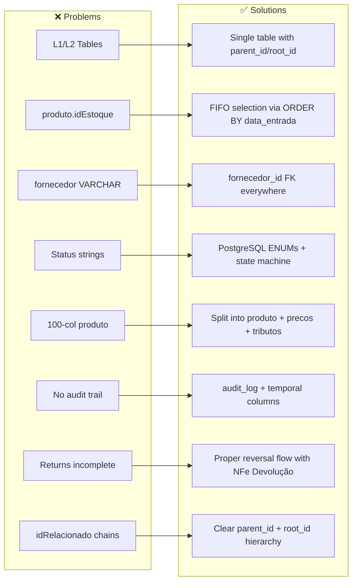
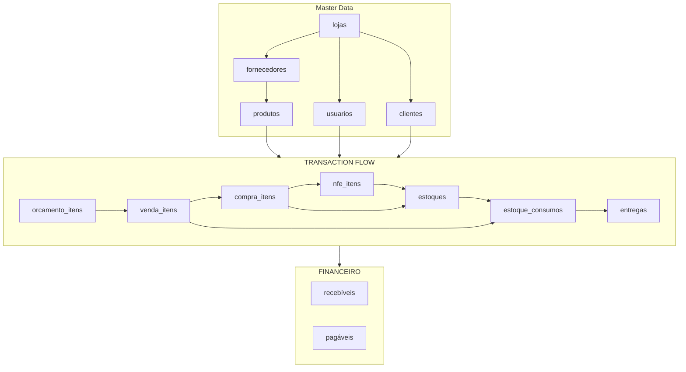
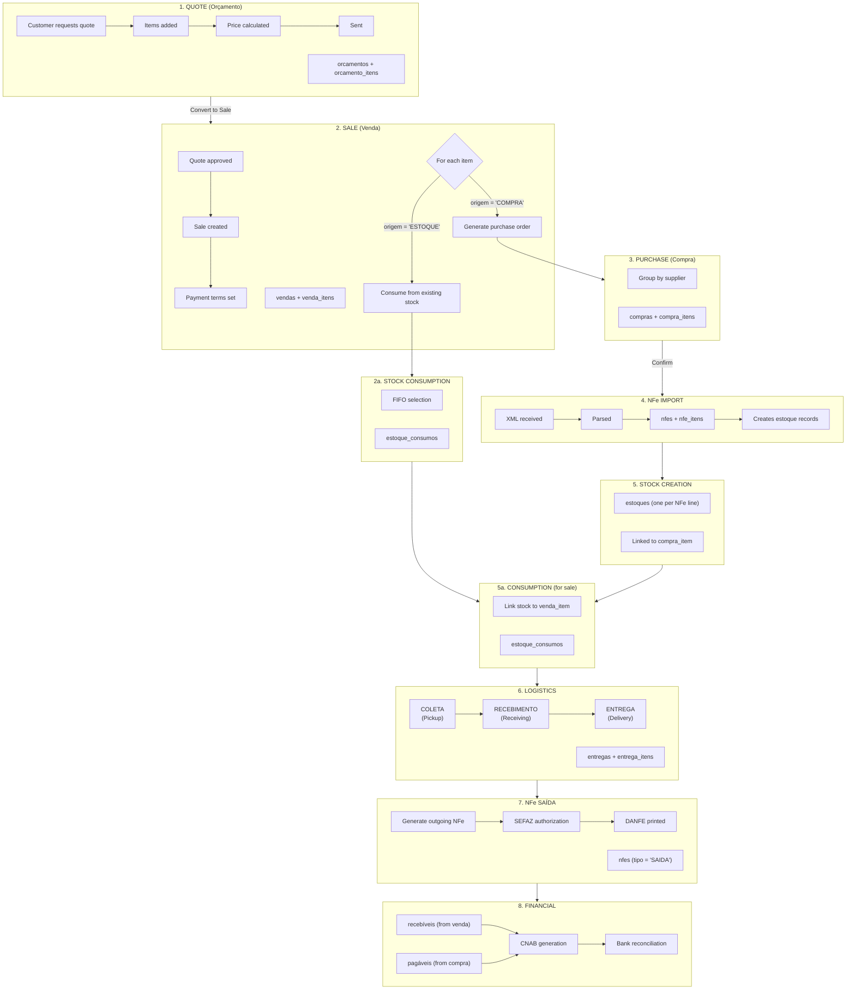
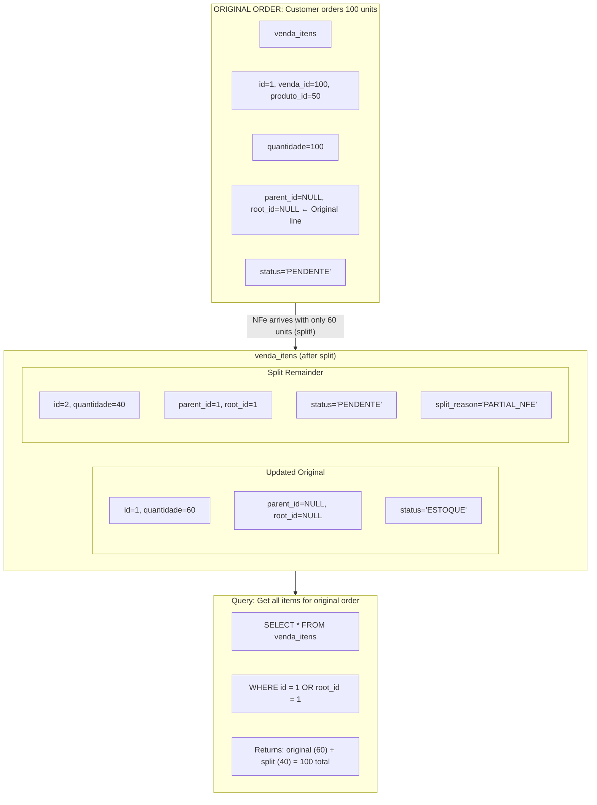
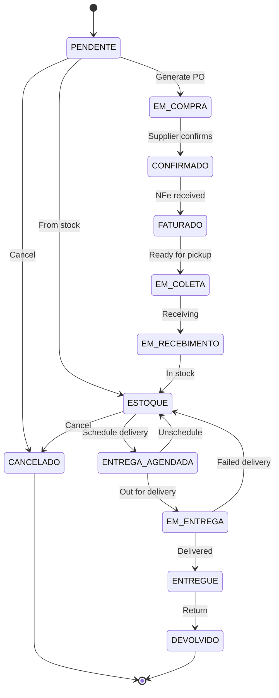
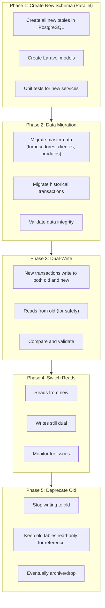

# Redesigned Business Flow & Schema

> Status: **Brainstorming**
> Last updated: 2025-12-27
> Purpose: Holistic redesign addressing all identified pain points

---

## Table of Contents

1. [Design Principles](#1-design-principles)
2. [Core Entity Model](#2-core-entity-model)
3. [The Order-to-Delivery Flow](#3-the-order-to-delivery-flow)
4. [Complete Schema](#4-complete-schema)
5. [Status State Machines](#5-status-state-machines)
6. [Key Improvements](#6-key-improvements)
7. [Event-Driven Architecture](#7-event-driven-architecture)
8. [Migration Path](#8-migration-path)

---

## 1. Design Principles

### 1.1 Guiding Principles

| Principle | Implementation |
|-----------|----------------|
| **Single Source of Truth** | One table per concept, no L1/L2 duplication |
| **Referential Integrity** | All FKs enforced, no orphans |
| **Explicit > Implicit** | Status enums, not magic strings |
| **Audit Everything** | Who, when, what changed |
| **FIFO by Default** | Stock consumed by entry date |
| **Immutable Core** | Transactions append-only, corrections via new records |

### 1.2 What We're Fixing



---

## 2. Core Entity Model

### 2.1 Entity Relationship Overview



### 2.2 Key Design Decisions

**Single Item Tables**: Each level of the flow has ONE item table:
- `orcamento_itens` - Quote line items
- `venda_itens` - Sale line items (with splits via parent_id)
- `compra_itens` - Purchase order line items
- `nfe_itens` - NFe line items
- `estoques` - Stock records (one per batch/NFe line)
- `estoque_consumos` - Consumption records (FIFO)
- `entrega_itens` - Delivery line items

**Linking Strategy**: Clear FK relationships, no denormalized copies

---

## 3. The Order-to-Delivery Flow

### 3.1 Complete Flow Diagram



### 3.2 Split Handling



---

## 4. Complete Schema

### 4.1 ENUMs

```sql
-- Venda Item Status
CREATE TYPE venda_item_status AS ENUM (
    'PENDENTE',           -- Awaiting purchase
    'EM_COMPRA',          -- Purchase order created
    'CONFIRMADO',         -- Supplier confirmed
    'FATURADO',           -- NFe received
    'EM_COLETA',          -- Ready for pickup
    'EM_RECEBIMENTO',     -- Being received
    'ESTOQUE',            -- In stock
    'ENTREGA_AGENDADA',   -- Delivery scheduled
    'EM_ENTREGA',         -- Out for delivery
    'ENTREGUE',           -- Delivered
    'DEVOLVIDO',          -- Returned
    'CANCELADO'           -- Cancelled
);

-- Compra Item Status
CREATE TYPE compra_item_status AS ENUM (
    'PENDENTE',           -- Awaiting confirmation
    'CONFIRMADO',         -- Supplier confirmed
    'FATURADO',           -- NFe received
    'EM_COLETA',          -- Ready for pickup
    'EM_RECEBIMENTO',     -- Being received
    'RECEBIDO',           -- In stock
    'CANCELADO'           -- Cancelled
);

-- NFe Status
CREATE TYPE nfe_status AS ENUM (
    'RASCUNHO',           -- Draft
    'PENDENTE',           -- Awaiting authorization
    'PROCESSANDO',        -- Sent to SEFAZ
    'AUTORIZADA',         -- Authorized
    'REJEITADA',          -- Rejected
    'CANCELADA',          -- Cancelled
    'DENEGADA',           -- Denied
    'INUTILIZADA'         -- Voided range
);

-- NFe Type
CREATE TYPE nfe_tipo AS ENUM (
    'ENTRADA',            -- Incoming (from supplier)
    'SAIDA',              -- Outgoing (to customer)
    'DEVOLUCAO_ENTRADA',  -- Return from customer
    'DEVOLUCAO_SAIDA'     -- Return to supplier
);

-- Financeiro Status
CREATE TYPE financeiro_status AS ENUM (
    'PENDENTE',
    'AGENDADO',
    'PAGO',
    'RECEBIDO',
    'ATRASADO',
    'CANCELADO'
);
```

### 4.2 Master Data Tables

```sql
-- Lojas (Stores/Warehouses)
CREATE TABLE lojas (
    id SERIAL PRIMARY KEY,
    codigo VARCHAR(10) UNIQUE NOT NULL,
    nome VARCHAR(200) NOT NULL,
    cnpj VARCHAR(18) UNIQUE NOT NULL,
    inscricao_estadual VARCHAR(20),

    -- Address
    endereco_id INTEGER REFERENCES enderecos(id),

    -- Settings
    config JSONB DEFAULT '{}',

    ativo BOOLEAN DEFAULT TRUE,
    created_at TIMESTAMP DEFAULT NOW(),
    updated_at TIMESTAMP DEFAULT NOW()
);

-- Fornecedores (Suppliers)
CREATE TABLE fornecedores (
    id SERIAL PRIMARY KEY,
    razao_social VARCHAR(200) NOT NULL,
    nome_fantasia VARCHAR(200),
    cnpj VARCHAR(18) UNIQUE,
    inscricao_estadual VARCHAR(20),

    -- Contact
    email VARCHAR(200),
    telefone VARCHAR(20),

    -- Banking
    banco VARCHAR(100),
    agencia VARCHAR(20),
    conta VARCHAR(20),

    -- Business rules
    comissao_percentual DECIMAL(5,2) DEFAULT 0,
    frete_pago_loja BOOLEAN DEFAULT FALSE,
    is_representacao BOOLEAN DEFAULT FALSE,
    prazo_entrega_dias INTEGER DEFAULT 30,

    ativo BOOLEAN DEFAULT TRUE,
    created_at TIMESTAMP DEFAULT NOW(),
    updated_at TIMESTAMP DEFAULT NOW()
);

-- Clientes (Customers)
CREATE TABLE clientes (
    id SERIAL PRIMARY KEY,
    tipo CHAR(2) NOT NULL CHECK (tipo IN ('PF', 'PJ')),
    nome_razao VARCHAR(200) NOT NULL,
    nome_fantasia VARCHAR(200),
    cpf_cnpj VARCHAR(18) UNIQUE NOT NULL,
    inscricao_estadual VARCHAR(20),

    -- Contact
    email VARCHAR(200),
    telefone VARCHAR(20),

    -- Credit
    limite_credito DECIMAL(15,2) DEFAULT 0,
    saldo_credito DECIMAL(15,2) DEFAULT 0,

    -- Links
    vendedor_id INTEGER REFERENCES usuarios(id),

    incompleto BOOLEAN DEFAULT FALSE,
    ativo BOOLEAN DEFAULT TRUE,
    created_at TIMESTAMP DEFAULT NOW(),
    updated_at TIMESTAMP DEFAULT NOW()
);

-- Produtos (Products) - SPLIT from mega-table
CREATE TABLE produtos (
    id SERIAL PRIMARY KEY,
    fornecedor_id INTEGER NOT NULL REFERENCES fornecedores(id),

    -- Identification
    codigo_comercial VARCHAR(100) NOT NULL,
    codigo_barras VARCHAR(50),
    descricao VARCHAR(500) NOT NULL,
    descricao_curta VARCHAR(100),

    -- Units
    unidade VARCHAR(10) DEFAULT 'UN',
    unidades_por_caixa DECIMAL(10,4) DEFAULT 1,
    peso_kg DECIMAL(10,4),

    -- Classification
    ncm_id INTEGER REFERENCES ncms(id),
    categoria_id INTEGER REFERENCES categorias(id),

    -- Flags
    tem_lote BOOLEAN DEFAULT FALSE,

    ativo BOOLEAN DEFAULT TRUE,
    created_at TIMESTAMP DEFAULT NOW(),
    updated_at TIMESTAMP DEFAULT NOW(),

    UNIQUE(fornecedor_id, codigo_comercial)
);

-- Preços (versioned pricing)
CREATE TABLE produto_precos (
    id SERIAL PRIMARY KEY,
    produto_id INTEGER NOT NULL REFERENCES produtos(id),

    custo DECIMAL(15,4) NOT NULL,
    preco_venda DECIMAL(15,4) NOT NULL,
    markup DECIMAL(7,4) GENERATED ALWAYS AS (
        CASE WHEN custo > 0 THEN (preco_venda / custo - 1) * 100 ELSE 0 END
    ) STORED,

    vigencia_inicio DATE NOT NULL DEFAULT CURRENT_DATE,
    vigencia_fim DATE,

    created_at TIMESTAMP DEFAULT NOW(),
    created_by INTEGER REFERENCES usuarios(id)
);

-- Tributos (tax configuration)
CREATE TABLE produto_tributos (
    produto_id INTEGER PRIMARY KEY REFERENCES produtos(id),

    -- ICMS
    cst_icms VARCHAR(3),
    aliquota_icms DECIMAL(5,2),

    -- ST
    tem_st BOOLEAN DEFAULT FALSE,
    mva DECIMAL(7,4),

    -- IPI
    cst_ipi VARCHAR(2),
    aliquota_ipi DECIMAL(5,2),

    -- PIS/COFINS
    cst_pis VARCHAR(2),
    aliquota_pis DECIMAL(5,2),
    cst_cofins VARCHAR(2),
    aliquota_cofins DECIMAL(5,2),

    -- IBS/CBS (Reforma Tributária)
    config_ibs_cbs JSONB,

    updated_at TIMESTAMP DEFAULT NOW()
);
```

### 4.3 Transaction Tables

```sql
-- Vendas (Sales Header)
CREATE TABLE vendas (
    id SERIAL PRIMARY KEY,
    loja_id INTEGER NOT NULL REFERENCES lojas(id),
    cliente_id INTEGER NOT NULL REFERENCES clientes(id),
    vendedor_id INTEGER NOT NULL REFERENCES usuarios(id),

    -- Dates
    data_emissao DATE NOT NULL DEFAULT CURRENT_DATE,

    -- Totals (denormalized for performance)
    subtotal DECIMAL(15,2) NOT NULL DEFAULT 0,
    desconto_percentual DECIMAL(5,2) DEFAULT 0,
    desconto_valor DECIMAL(15,2) DEFAULT 0,
    frete DECIMAL(15,2) DEFAULT 0,
    total DECIMAL(15,2) NOT NULL DEFAULT 0,

    -- Delivery
    endereco_entrega_id INTEGER REFERENCES enderecos(id),

    -- Status
    status VARCHAR(20) DEFAULT 'ABERTA',
    status_financeiro VARCHAR(20) DEFAULT 'PENDENTE',

    -- Links
    orcamento_id INTEGER REFERENCES orcamentos(id),

    -- Audit
    created_at TIMESTAMP DEFAULT NOW(),
    updated_at TIMESTAMP DEFAULT NOW(),
    created_by INTEGER REFERENCES usuarios(id)
);

-- Venda Itens (Single table, no L1/L2!)
CREATE TABLE venda_itens (
    id SERIAL PRIMARY KEY,
    venda_id INTEGER NOT NULL REFERENCES vendas(id) ON DELETE CASCADE,

    -- Split hierarchy
    parent_id INTEGER REFERENCES venda_itens(id),
    root_id INTEGER REFERENCES venda_itens(id),
    split_reason VARCHAR(50),  -- PARTIAL_NFE, PARTIAL_DELIVERY, RETURN

    -- Product (FK, not denormalized!)
    produto_id INTEGER NOT NULL REFERENCES produtos(id),
    fornecedor_id INTEGER NOT NULL REFERENCES fornecedores(id),

    -- Quantities
    quantidade DECIMAL(15,4) NOT NULL,
    quantidade_caixas DECIMAL(15,4),
    unidade VARCHAR(10) DEFAULT 'UN',

    -- Pricing (snapshot at sale time)
    preco_unitario DECIMAL(15,4) NOT NULL,
    desconto_item_percentual DECIMAL(5,2) DEFAULT 0,
    preco_com_desconto DECIMAL(15,4),
    total DECIMAL(15,2) NOT NULL,

    -- Denormalized for display (snapshot)
    descricao_produto VARCHAR(500),
    codigo_comercial VARCHAR(100),

    -- Source
    origem VARCHAR(20) NOT NULL CHECK (origem IN ('COMPRA', 'ESTOQUE')),

    -- Status
    status venda_item_status NOT NULL DEFAULT 'PENDENTE',

    -- Dates
    data_prev_entrega DATE,
    data_real_entrega TIMESTAMP,

    -- Delivery
    entregue_por VARCHAR(100),
    recebido_por VARCHAR(100),

    -- NFe
    nfe_saida_id INTEGER REFERENCES nfes(id),

    -- Audit
    created_at TIMESTAMP DEFAULT NOW(),
    updated_at TIMESTAMP DEFAULT NOW()
);

-- Compras (Purchase Header)
CREATE TABLE compras (
    id SERIAL PRIMARY KEY,
    loja_id INTEGER NOT NULL REFERENCES lojas(id),
    fornecedor_id INTEGER NOT NULL REFERENCES fornecedores(id),

    -- Links
    venda_id INTEGER REFERENCES vendas(id),  -- If generated from sale

    -- Totals
    subtotal DECIMAL(15,2) DEFAULT 0,
    frete DECIMAL(15,2) DEFAULT 0,
    total DECIMAL(15,2) DEFAULT 0,

    -- Dates
    data_emissao DATE DEFAULT CURRENT_DATE,
    data_prev_entrega DATE,
    data_real_entrega DATE,

    -- Status
    status VARCHAR(20) DEFAULT 'PENDENTE',

    -- NFe
    nfe_entrada_id INTEGER REFERENCES nfes(id),

    created_at TIMESTAMP DEFAULT NOW(),
    updated_at TIMESTAMP DEFAULT NOW()
);

-- Compra Itens
CREATE TABLE compra_itens (
    id SERIAL PRIMARY KEY,
    compra_id INTEGER NOT NULL REFERENCES compras(id) ON DELETE CASCADE,

    -- Split hierarchy
    parent_id INTEGER REFERENCES compra_itens(id),
    root_id INTEGER REFERENCES compra_itens(id),
    split_reason VARCHAR(50),

    -- Product
    produto_id INTEGER NOT NULL REFERENCES produtos(id),

    -- Link to sale item (if from sale)
    venda_item_id INTEGER REFERENCES venda_itens(id),

    -- Quantities
    quantidade DECIMAL(15,4) NOT NULL,
    quantidade_caixas DECIMAL(15,4),

    -- Pricing
    preco_unitario DECIMAL(15,4),
    total DECIMAL(15,2),

    -- Status
    status compra_item_status DEFAULT 'PENDENTE',

    created_at TIMESTAMP DEFAULT NOW(),
    updated_at TIMESTAMP DEFAULT NOW()
);
```

### 4.4 Stock Tables

```sql
-- Estoques (Stock - one record per batch/NFe line)
CREATE TABLE estoques (
    id SERIAL PRIMARY KEY,
    loja_id INTEGER NOT NULL REFERENCES lojas(id),
    produto_id INTEGER NOT NULL REFERENCES produtos(id),
    fornecedor_id INTEGER NOT NULL REFERENCES fornecedores(id),

    -- Source
    nfe_entrada_id INTEGER REFERENCES nfes(id),
    nfe_item_id INTEGER REFERENCES nfe_itens(id),
    compra_item_id INTEGER REFERENCES compra_itens(id),

    -- Quantities
    quantidade_original DECIMAL(15,4) NOT NULL,
    quantidade_disponivel DECIMAL(15,4) NOT NULL,

    -- Cost
    custo_unitario DECIMAL(15,4) NOT NULL,
    custo_total DECIMAL(15,2) NOT NULL,

    -- Tracking
    lote VARCHAR(50),
    data_validade DATE,

    -- Location
    bloco_id INTEGER REFERENCES galpao_blocos(id),

    -- Status
    status VARCHAR(20) DEFAULT 'DISPONIVEL',

    -- FIFO key
    data_entrada TIMESTAMP NOT NULL DEFAULT NOW(),

    created_at TIMESTAMP DEFAULT NOW(),
    updated_at TIMESTAMP DEFAULT NOW()
);

-- Index for FIFO
CREATE INDEX idx_estoques_fifo
    ON estoques(produto_id, loja_id, data_entrada)
    WHERE quantidade_disponivel > 0;

-- Estoque Consumos (Stock Consumption - FIFO records)
CREATE TABLE estoque_consumos (
    id SERIAL PRIMARY KEY,
    estoque_id INTEGER NOT NULL REFERENCES estoques(id),

    -- What consumed it
    venda_item_id INTEGER REFERENCES venda_itens(id),

    -- Quantities
    quantidade DECIMAL(15,4) NOT NULL,
    custo_unitario DECIMAL(15,4) NOT NULL,
    custo_total DECIMAL(15,2) NOT NULL,

    -- Type
    motivo VARCHAR(50) NOT NULL,  -- VENDA, AJUSTE, QUEBRA, TRANSFERENCIA

    -- Reversal
    estornado BOOLEAN DEFAULT FALSE,
    estornado_at TIMESTAMP,
    estorno_motivo VARCHAR(200),

    created_at TIMESTAMP DEFAULT NOW(),
    created_by INTEGER REFERENCES usuarios(id)
);
```

### 4.5 NFe Tables

```sql
-- NFes (Header)
CREATE TABLE nfes (
    id SERIAL PRIMARY KEY,
    loja_id INTEGER NOT NULL REFERENCES lojas(id),

    -- Type
    tipo nfe_tipo NOT NULL,
    modelo VARCHAR(2) DEFAULT '55',  -- 55=NFe, 65=NFCe

    -- Identification
    numero INTEGER,
    serie INTEGER DEFAULT 1,
    chave VARCHAR(44) UNIQUE,

    -- Parties
    emitente_id INTEGER,  -- FK to fornecedor or loja
    destinatario_id INTEGER,  -- FK to cliente or fornecedor

    -- Totals
    valor_produtos DECIMAL(15,2),
    valor_frete DECIMAL(15,2),
    valor_total DECIMAL(15,2),

    -- Status
    status nfe_status DEFAULT 'RASCUNHO',
    protocolo VARCHAR(50),

    -- XML
    xml_envio TEXT,
    xml_retorno TEXT,

    -- Dates
    data_emissao TIMESTAMP,
    data_autorizacao TIMESTAMP,

    -- Links
    venda_id INTEGER REFERENCES vendas(id),
    compra_id INTEGER REFERENCES compras(id),

    created_at TIMESTAMP DEFAULT NOW(),
    updated_at TIMESTAMP DEFAULT NOW()
);

-- NFe Itens
CREATE TABLE nfe_itens (
    id SERIAL PRIMARY KEY,
    nfe_id INTEGER NOT NULL REFERENCES nfes(id) ON DELETE CASCADE,

    numero_item INTEGER NOT NULL,

    -- Product
    produto_id INTEGER REFERENCES produtos(id),
    codigo VARCHAR(100),
    descricao VARCHAR(500),
    ncm VARCHAR(10),
    cfop VARCHAR(4),

    -- Quantities
    quantidade DECIMAL(15,4) NOT NULL,
    unidade VARCHAR(10),

    -- Values
    valor_unitario DECIMAL(15,4),
    valor_total DECIMAL(15,2),

    -- Taxes (JSONB for flexibility)
    impostos JSONB,

    -- Links
    venda_item_id INTEGER REFERENCES venda_itens(id),
    compra_item_id INTEGER REFERENCES compra_itens(id),

    created_at TIMESTAMP DEFAULT NOW()
);
```

### 4.6 Financial Tables

```sql
-- Recebíveis (Accounts Receivable)
CREATE TABLE recebiveis (
    id SERIAL PRIMARY KEY,
    loja_id INTEGER NOT NULL REFERENCES lojas(id),
    cliente_id INTEGER NOT NULL REFERENCES clientes(id),
    venda_id INTEGER REFERENCES vendas(id),

    -- Payment info
    tipo_pagamento VARCHAR(50),  -- BOLETO, CARTAO, PIX, etc.
    parcela INTEGER DEFAULT 1,
    total_parcelas INTEGER DEFAULT 1,

    -- Values
    valor DECIMAL(15,2) NOT NULL,
    valor_recebido DECIMAL(15,2) DEFAULT 0,

    -- Dates
    data_vencimento DATE NOT NULL,
    data_recebimento DATE,

    -- Status
    status financeiro_status DEFAULT 'PENDENTE',

    -- Bank
    nosso_numero VARCHAR(50),
    linha_digitavel VARCHAR(100),

    created_at TIMESTAMP DEFAULT NOW(),
    updated_at TIMESTAMP DEFAULT NOW()
);

-- Pagáveis (Accounts Payable)
CREATE TABLE pagaveis (
    id SERIAL PRIMARY KEY,
    loja_id INTEGER NOT NULL REFERENCES lojas(id),
    fornecedor_id INTEGER NOT NULL REFERENCES fornecedores(id),
    compra_id INTEGER REFERENCES compras(id),

    -- Payment info
    tipo VARCHAR(50),  -- DUPLICATA, BOLETO, etc.
    parcela INTEGER DEFAULT 1,
    total_parcelas INTEGER DEFAULT 1,

    -- Values
    valor DECIMAL(15,2) NOT NULL,
    valor_pago DECIMAL(15,2) DEFAULT 0,

    -- Dates
    data_vencimento DATE NOT NULL,
    data_pagamento DATE,

    -- Status
    status financeiro_status DEFAULT 'PENDENTE',

    created_at TIMESTAMP DEFAULT NOW(),
    updated_at TIMESTAMP DEFAULT NOW()
);
```

### 4.7 Audit Table

```sql
-- Audit Log
CREATE TABLE audit_log (
    id BIGSERIAL PRIMARY KEY,

    -- What changed
    tabela VARCHAR(100) NOT NULL,
    registro_id INTEGER NOT NULL,
    acao VARCHAR(20) NOT NULL,  -- INSERT, UPDATE, DELETE

    -- Changes
    dados_antigos JSONB,
    dados_novos JSONB,
    campos_alterados TEXT[],

    -- Who and when
    usuario_id INTEGER REFERENCES usuarios(id),
    ip_address INET,

    -- Context
    transacao_id VARCHAR(100),
    modulo VARCHAR(50),

    created_at TIMESTAMP DEFAULT NOW()
);

CREATE INDEX idx_audit_tabela_registro ON audit_log(tabela, registro_id);
CREATE INDEX idx_audit_created ON audit_log(created_at);
CREATE INDEX idx_audit_usuario ON audit_log(usuario_id);
```

---

## 5. Status State Machines

### 5.1 Venda Item Status



### 5.2 Transition Rules (Laravel)

```php
enum VendaItemStatus: string
{
    case PENDENTE = 'PENDENTE';
    case EM_COMPRA = 'EM_COMPRA';
    case CONFIRMADO = 'CONFIRMADO';
    case FATURADO = 'FATURADO';
    case EM_COLETA = 'EM_COLETA';
    case EM_RECEBIMENTO = 'EM_RECEBIMENTO';
    case ESTOQUE = 'ESTOQUE';
    case ENTREGA_AGENDADA = 'ENTREGA_AGENDADA';
    case EM_ENTREGA = 'EM_ENTREGA';
    case ENTREGUE = 'ENTREGUE';
    case DEVOLVIDO = 'DEVOLVIDO';
    case CANCELADO = 'CANCELADO';

    public function allowedTransitions(): array
    {
        return match($this) {
            self::PENDENTE => [self::EM_COMPRA, self::ESTOQUE, self::CANCELADO],
            self::EM_COMPRA => [self::CONFIRMADO, self::CANCELADO],
            self::CONFIRMADO => [self::FATURADO, self::CANCELADO],
            self::FATURADO => [self::EM_COLETA],
            self::EM_COLETA => [self::EM_RECEBIMENTO],
            self::EM_RECEBIMENTO => [self::ESTOQUE],
            self::ESTOQUE => [self::ENTREGA_AGENDADA, self::CANCELADO],
            self::ENTREGA_AGENDADA => [self::EM_ENTREGA, self::ESTOQUE],
            self::EM_ENTREGA => [self::ENTREGUE, self::ESTOQUE],
            self::ENTREGUE => [self::DEVOLVIDO],
            self::DEVOLVIDO => [],
            self::CANCELADO => [],
        };
    }

    public function canTransitionTo(self $new): bool
    {
        return in_array($new, $this->allowedTransitions());
    }
}
```

---

## 6. Key Improvements

### 6.1 Summary of Changes

| Problem | Current | New Design |
|---------|---------|------------|
| **L1/L2 Tables** | 2 tables + idRelacionado | 1 table + parent_id/root_id |
| **FIFO** | produto.idEstoque | ORDER BY data_entrada |
| **Supplier refs** | VARCHAR in 9 tables | fornecedor_id FK |
| **Status** | Magic strings | PostgreSQL ENUMs |
| **Produto table** | 100+ columns | Split into 3 tables |
| **Audit** | None | audit_log table |
| **Returns** | Incomplete | Proper flow with NFe |

### 6.2 Query Simplifications

**Old: Find all items for a sale (with splits)**
```sql
-- Complex: join L1+L2, follow idRelacionado chains
SELECT vp1.*, vp2.*
FROM venda_has_produto vp1
JOIN venda_has_produto2 vp2 ON vp1.idVendaProduto = vp2.idVendaProdutoFK
WHERE vp1.idVenda = :venda_id
  OR vp2.idRelacionado IN (SELECT ...)  -- Recursive nightmare
```

**New: Simple query**
```sql
-- Easy: query single table
SELECT * FROM venda_itens
WHERE venda_id = :venda_id;

-- Get splits for an item
SELECT * FROM venda_itens
WHERE root_id = :item_id OR id = :item_id;
```

**Old: Get supplier for stock**
```sql
-- String-based, error-prone
SELECT * FROM estoque WHERE fornecedor = 'ACME Corp';
```

**New: FK-based**
```sql
-- Fast, reliable
SELECT e.* FROM estoques e
JOIN fornecedores f ON e.fornecedor_id = f.id
WHERE f.id = :fornecedor_id;
```

---

## 7. Event-Driven Architecture

### 7.1 Key Events

```php
// Sale events
VendaCriada::class        // → Generate purchase orders if needed
VendaItemAdicionado::class
VendaCancelada::class     // → Reverse consumptions, cancel purchases

// Purchase events
CompraCriada::class
CompraConfirmada::class   // → Create pagáveis
NfeImportada::class       // → Create estoques, link to compra

// Stock events
EstoqueCriado::class
EstoqueConsumido::class   // → Update quantidade_disponivel
EstoqueEstornado::class   // → Reverse consumption

// Delivery events
EntregaAgendada::class
EntregaConfirmada::class  // → Update financeiro, emit NFe

// Financial events
RecebimentoConfirmado::class
PagamentoRealizado::class
```

### 7.2 Event Handler Example

```php
class NfeImportadaHandler
{
    public function handle(NfeImportada $event): void
    {
        $nfe = $event->nfe;

        // Create stock for each NFe item
        foreach ($nfe->itens as $item) {
            $estoque = Estoque::create([
                'loja_id' => $nfe->loja_id,
                'produto_id' => $item->produto_id,
                'fornecedor_id' => $nfe->emitente_id,
                'nfe_entrada_id' => $nfe->id,
                'nfe_item_id' => $item->id,
                'quantidade_original' => $item->quantidade,
                'quantidade_disponivel' => $item->quantidade,
                'custo_unitario' => $item->valor_unitario,
                'custo_total' => $item->valor_total,
                'data_entrada' => $nfe->data_emissao,
            ]);

            // If linked to sale, create consumption
            if ($item->venda_item_id) {
                $this->consumoService->consumirParaVenda(
                    $estoque,
                    $item->venda_item_id
                );
            }
        }
    }
}
```

---

## 8. Migration Path

### 8.1 Phases



### 8.2 Data Mapping

| Old Table | New Table(s) | Notes |
|-----------|--------------|-------|
| fornecedor | fornecedores | 1:1, normalize names |
| cliente | clientes | 1:1 |
| produto | produtos + produto_precos + produto_tributos | Split |
| venda_has_produto + venda_has_produto2 | venda_itens | Merge, add parent_id |
| pedido_fornecedor_has_produto + _2 | compras + compra_itens | Merge |
| estoque | estoques | Add data_entrada |
| estoque_has_consumo | estoque_consumos | Clean up |
| nfe | nfes | Add tipo enum |
| conta_a_receber | recebiveis | Rename |
| conta_a_pagar | pagaveis | Rename |

---

## Related Documents

- [03-improvements.md](./03-improvements.md) - Pain points this addresses
- [04-l1l2-simplification.md](./04-l1l2-simplification.md) - L1/L2 details
- [05-fifo-fix.md](./05-fifo-fix.md) - FIFO implementation
- [06-supplier-normalization.md](./06-supplier-normalization.md) - FK normalization
- [../business/](../business/) - Current flow documentation
