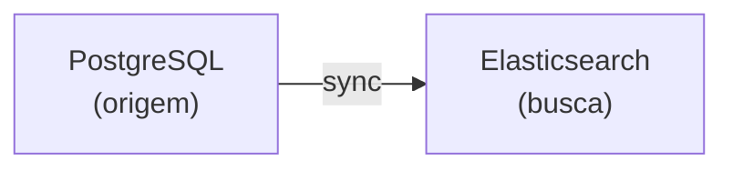
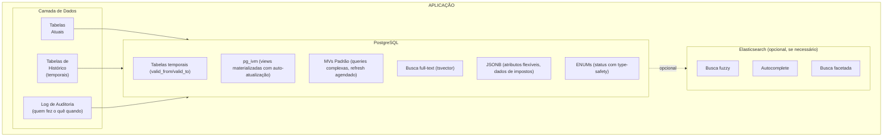

# Arquitetura de Infraestrutura

> Status: **Rascunho**
> Última atualização: 2025-12-27
> Foco: Auditoria, dados temporais, busca, views materializadas, tarefas agendadas

---

## Sumário

1. [Arquitetura de Trilha de Auditoria](#1-arquitetura-de-trilha-de-auditoria)
2. [Dados Temporais / Consultas Point-in-Time](#2-dados-temporais--consultas-point-in-time)
3. [Arquitetura de Busca](#3-arquitetura-de-busca)
4. [Views Materializadas](#4-views-materializadas)
5. [Tarefas Agendadas (Servidor)](#5-tarefas-agendadas-servidor)

---

## 1. Arquitetura de Trilha de Auditoria

### Requisitos
- Rastrear TODAS as alterações em tabelas críticas
- Saber QUEM fez a alteração
- Saber QUANDO aconteceu
- Saber O QUE mudou (valores antigos -> novos)
- Capacidade de consultar estado histórico

### Recomendado: Tabela de Log de Auditoria

```sql
CREATE TABLE audit_log (
    id BIGSERIAL PRIMARY KEY,

    -- O que mudou
    table_name VARCHAR(100) NOT NULL,
    record_id INTEGER NOT NULL,
    action VARCHAR(20) NOT NULL, -- INSERT, UPDATE, DELETE

    -- As alterações
    old_values JSONB,
    new_values JSONB,
    changed_fields TEXT[], -- quais colunas mudaram

    -- Quem e quando
    user_id INTEGER,
    user_name VARCHAR(100), -- desnormalizado para histórico
    ip_address INET,
    user_agent TEXT,

    -- Contexto
    transaction_id VARCHAR(100), -- agrupar alterações relacionadas
    module VARCHAR(50), -- 'compras', 'vendas', etc.
    reason TEXT, -- justificativa opcional

    created_at TIMESTAMPTZ DEFAULT NOW()
);

CREATE INDEX idx_audit_table_record ON audit_log(table_name, record_id);
CREATE INDEX idx_audit_created ON audit_log(created_at);
CREATE INDEX idx_audit_user ON audit_log(user_id);
CREATE INDEX idx_audit_transaction ON audit_log(transaction_id);
```

### Trigger Genérico de Auditoria

```sql
CREATE OR REPLACE FUNCTION audit_trigger_func()
RETURNS TRIGGER AS $$
BEGIN
    IF TG_OP = 'DELETE' THEN
        INSERT INTO audit_log (table_name, record_id, action, old_values, user_id)
        VALUES (TG_TABLE_NAME, OLD.id, 'DELETE', to_jsonb(OLD),
                current_setting('app.user_id', true)::int);
        RETURN OLD;
    ELSIF TG_OP = 'UPDATE' THEN
        INSERT INTO audit_log (table_name, record_id, action, old_values, new_values, user_id)
        VALUES (TG_TABLE_NAME, NEW.id, 'UPDATE', to_jsonb(OLD), to_jsonb(NEW),
                current_setting('app.user_id', true)::int);
        RETURN NEW;
    ELSIF TG_OP = 'INSERT' THEN
        INSERT INTO audit_log (table_name, record_id, action, new_values, user_id)
        VALUES (TG_TABLE_NAME, NEW.id, 'INSERT', to_jsonb(NEW),
                current_setting('app.user_id', true)::int);
        RETURN NEW;
    END IF;
END;
$$ LANGUAGE plpgsql;

-- Aplicar às tabelas importantes
CREATE TRIGGER audit_vendas
    AFTER INSERT OR UPDATE OR DELETE ON vendas
    FOR EACH ROW EXECUTE FUNCTION audit_trigger_func();
```

---

## 2. Dados Temporais / Consultas Point-in-Time

### Casos de Uso

| Consulta | Exemplo |
|-------|---------|
| Point-in-time | "Qual era o estoque do produto X em 15 de janeiro?" |
| Histórico | "Mostrar todas as alterações de preço do produto X em 2024" |
| Auditoria | "Quem alterou este registro e quando?" |
| Rollback | "Como era esta venda antes da edição?" |
| Relatórios | "Qual era nosso total de recebíveis em 31 de dezembro?" |

### Opção A: Tabelas Temporais com Histórico

```sql
-- Tabela principal (estado atual)
CREATE TABLE vendas (
    id SERIAL PRIMARY KEY,
    cliente_id INTEGER,
    status VARCHAR(50),
    total DECIMAL(15,2),
    -- ... outros campos

    -- Metadados temporais
    valid_from TIMESTAMPTZ NOT NULL DEFAULT NOW(),
    valid_to TIMESTAMPTZ NOT NULL DEFAULT 'infinity',

    -- Metadados de auditoria
    created_by INTEGER,
    updated_by INTEGER,
    created_at TIMESTAMPTZ DEFAULT NOW(),
    updated_at TIMESTAMPTZ DEFAULT NOW()
);

-- Tabela de histórico (estados passados)
CREATE TABLE vendas_history (
    history_id BIGSERIAL PRIMARY KEY,
    id INTEGER NOT NULL, -- id do registro original
    cliente_id INTEGER,
    status VARCHAR(50),
    total DECIMAL(15,2),
    -- ... espelhar todos os campos

    valid_from TIMESTAMPTZ NOT NULL,
    valid_to TIMESTAMPTZ NOT NULL,

    operation VARCHAR(10), -- UPDATE, DELETE
    changed_by INTEGER,
    changed_at TIMESTAMPTZ DEFAULT NOW()
);

-- Trigger para manter histórico
CREATE OR REPLACE FUNCTION vendas_history_trigger()
RETURNS TRIGGER AS $$
BEGIN
    IF TG_OP = 'UPDATE' THEN
        -- Fechar o registro antigo
        INSERT INTO vendas_history
        SELECT nextval('vendas_history_history_id_seq'),
               OLD.*,
               OLD.valid_from, NOW(), 'UPDATE',
               current_setting('app.user_id', true)::int, NOW();

        -- Atualizar valid_from no novo registro
        NEW.valid_from := NOW();
        NEW.updated_at := NOW();
        NEW.updated_by := current_setting('app.user_id', true)::int;
        RETURN NEW;

    ELSIF TG_OP = 'DELETE' THEN
        INSERT INTO vendas_history
        SELECT nextval('vendas_history_history_id_seq'),
               OLD.*,
               OLD.valid_from, NOW(), 'DELETE',
               current_setting('app.user_id', true)::int, NOW();
        RETURN OLD;
    END IF;
END;
$$ LANGUAGE plpgsql;

CREATE TRIGGER vendas_history
    BEFORE UPDATE OR DELETE ON vendas
    FOR EACH ROW EXECUTE FUNCTION vendas_history_trigger();
```

### Consultando em Point in Time

```sql
-- Como era a venda 123 em 2025-01-15?
SELECT * FROM vendas WHERE id = 123
  AND valid_from <= '2025-01-15' AND valid_to > '2025-01-15'
UNION ALL
SELECT id, cliente_id, status, total, ... FROM vendas_history WHERE id = 123
  AND valid_from <= '2025-01-15' AND valid_to > '2025-01-15';
```

### Opção B: Tabelas de Snapshot

Para necessidades específicas de relatórios, tirar snapshots periódicos:

```sql
CREATE TABLE estoque_snapshots (
    id SERIAL PRIMARY KEY,
    snapshot_date DATE NOT NULL,
    produto_id INTEGER NOT NULL,
    quantidade DECIMAL(15,4),
    valor_total DECIMAL(15,2),
    created_at TIMESTAMPTZ DEFAULT NOW(),

    UNIQUE(snapshot_date, produto_id)
);

-- Job diário para capturar snapshot
INSERT INTO estoque_snapshots (snapshot_date, produto_id, quantidade, valor_total)
SELECT
    CURRENT_DATE,
    produto_id,
    SUM(quantidade_disponivel),
    SUM(quantidade_disponivel * custo_unitario)
FROM estoques
GROUP BY produto_id;
```

---

## 3. Arquitetura de Busca

### Estado Atual
- Índices FULLTEXT do MySQL
- Queries LIKE com wildcards
- Lento em conjuntos de dados grandes
- Recursos limitados (sem fuzzy, sem sinônimos, sem ranking)

### Opção A: Busca Full-Text do PostgreSQL (Início Recomendado)

```sql
-- Adicionar coluna de vetor de busca
ALTER TABLE produtos ADD COLUMN search_vector tsvector;

-- Criar índice GIN
CREATE INDEX idx_produtos_search ON produtos USING GIN(search_vector);

-- Trigger de atualização
CREATE OR REPLACE FUNCTION produtos_search_trigger() RETURNS trigger AS $$
BEGIN
    NEW.search_vector :=
        setweight(to_tsvector('portuguese', COALESCE(NEW.descricao, '')), 'A') ||
        setweight(to_tsvector('portuguese', COALESCE(NEW.cod_comercial, '')), 'B') ||
        setweight(to_tsvector('portuguese', COALESCE(NEW.marca, '')), 'C');
    RETURN NEW;
END;
$$ LANGUAGE plpgsql;

CREATE TRIGGER produtos_search_update
    BEFORE INSERT OR UPDATE ON produtos
    FOR EACH ROW EXECUTE FUNCTION produtos_search_trigger();

-- Query de busca
SELECT
    id, descricao,
    ts_rank(search_vector, query) as rank
FROM produtos, plainto_tsquery('portuguese', 'mesa escritorio madeira') query
WHERE search_vector @@ query
ORDER BY rank DESC
LIMIT 20;
```

**Recursos:**
- Stemming (Português)
- Ranking
- Busca por frase
- Correspondência por prefixo
- Pesos por campo

### Opção B: Elasticsearch (Se Necessário Depois)



**Quando atualizar:**
- Precisa de tolerância a erros de digitação ("meza" encontra "mesa")
- Precisa de autocomplete com fuzzy
- Conjunto de dados > 1M produtos
- Busca facetada complexa necessária

---

## 4. Views Materializadas

### Problema
Views recalculam a cada query - lento para dashboards.

### Solução: Views Materializadas com pg_ivm (Recomendado)

**pg_ivm** (Incremental View Maintenance) fornece views materializadas com atualização automática que atualizam apenas as linhas alteradas - não a view inteira.

#### Instalando pg_ivm

```sql
-- Instalar a extensão
CREATE EXTENSION pg_ivm;
```

#### Criando Views com Manutenção Incremental

```sql
-- Usar create_immv em vez de CREATE MATERIALIZED VIEW
SELECT create_immv('immv_produto_estoque', $$
    SELECT
        p.id as produto_id,
        p.descricao,
        p.fornecedor_id,
        f.razao_social as fornecedor_nome,
        COALESCE(SUM(e.quantidade_disponivel), 0) as estoque_total,
        COALESCE(AVG(e.custo_unitario), 0) as custo_medio,
        MAX(e.data_entrada) as ultima_entrada
    FROM produtos p
    LEFT JOIN fornecedores f ON p.fornecedor_id = f.id
    LEFT JOIN estoques e ON p.id = e.produto_id AND e.quantidade_disponivel > 0
    GROUP BY p.id, p.descricao, p.fornecedor_id, f.razao_social
$$);

-- A view atualiza automaticamente quando produtos, fornecedores ou estoques mudam!
-- Não precisa de REFRESH manual.
```

#### pg_ivm vs Views Materializadas Padrão

| Recurso | MV Padrão | pg_ivm (IMMV) |
|---------|-------------|---------------|
| Atualização automática | Não (REFRESH manual) | Sim (automática) |
| Velocidade de atualização | Reconstrução completa | Incremental (apenas alterações) |
| Consistência | Desatualizada até refresh | Sempre atual |
| Overhead | Nenhum entre refreshes | Leve em cada DML |
| Melhor para | Grandes, raramente mudam | Dados que mudam frequentemente |

#### Recursos de Query Suportados

pg_ivm suporta a maioria dos padrões de query comuns:

```sql
-- Agregações (SUM, COUNT, AVG, MIN, MAX)
SELECT create_immv('immv_vendas_por_cliente', $$
    SELECT
        cliente_id,
        COUNT(*) as total_vendas,
        SUM(total) as valor_total
    FROM vendas
    WHERE status = 'completed'
    GROUP BY cliente_id
$$);

-- JOINs (INNER, LEFT, RIGHT)
SELECT create_immv('immv_itens_com_produto', $$
    SELECT
        vi.id,
        vi.venda_id,
        p.descricao as produto_nome,
        vi.quantidade,
        vi.preco_unitario
    FROM venda_itens vi
    JOIN produtos p ON p.id = vi.produto_id
$$);

-- DISTINCT
SELECT create_immv('immv_fornecedores_ativos', $$
    SELECT DISTINCT fornecedor_id
    FROM estoques
    WHERE quantidade_disponivel > 0
$$);
```

#### Limitações

pg_ivm NÃO suporta:
- Funções de janela (`ROW_NUMBER`, `RANK`, etc.)
- CTEs (cláusulas `WITH`)
- Subqueries em `FROM`
- `UNION`, `INTERSECT`, `EXCEPT`
- `HAVING` (usar workaround com CTE na camada da aplicação)

Para estes, use views materializadas padrão com refresh agendado.

#### Gerenciando IMMVs

```sql
-- Listar todas as views materializadas com manutenção incremental
SELECT * FROM pg_ivm_immv;

-- Remover uma IMMV
SELECT drop_immv('immv_produto_estoque');

-- Desabilitar temporariamente auto-refresh (para operações em massa)
SELECT immv_set_pause('immv_produto_estoque', true);

-- Reabilitar
SELECT immv_set_pause('immv_produto_estoque', false);

-- Refresh manual se necessário
REFRESH MATERIALIZED VIEW immv_produto_estoque;
```

#### Melhores Práticas

1. **Use IMMVs para dashboards** - Dados sempre atuais sem polling
2. **Pause durante importações em massa** - Evite overhead durante cargas grandes de dados
3. **Crie índices na IMMV** - Crie índices como em tabelas regulares
4. **Monitore o overhead** - Verifique se operações DML estão ficando lentas

```sql
-- Criar índices na IMMV
CREATE INDEX idx_immv_estoque_fornecedor ON immv_produto_estoque(fornecedor_id);
CREATE INDEX idx_immv_estoque_total ON immv_produto_estoque(estoque_total);
```

---

### Views Materializadas Padrão (Quando pg_ivm Não se Aplica)

Para queries com funções de janela, CTEs, ou outros recursos não suportados, use views materializadas padrão com refresh agendado:

```sql
-- Criar view materializada
CREATE MATERIALIZED VIEW mv_produto_estoque AS
SELECT
    p.id as produto_id,
    p.descricao,
    p.fornecedor_id,
    f.razao_social as fornecedor_nome,
    COALESCE(SUM(e.quantidade_disponivel), 0) as estoque_total,
    COALESCE(AVG(e.custo_unitario), 0) as custo_medio,
    MAX(e.data_entrada) as ultima_entrada
FROM produtos p
LEFT JOIN fornecedores f ON p.fornecedor_id = f.id
LEFT JOIN estoques e ON p.id = e.produto_id AND e.quantidade_disponivel > 0
GROUP BY p.id, p.descricao, p.fornecedor_id, f.razao_social;

-- Criar índices na view materializada
CREATE UNIQUE INDEX ON mv_produto_estoque(produto_id);
CREATE INDEX ON mv_produto_estoque(fornecedor_id);
CREATE INDEX ON mv_produto_estoque(estoque_total);

-- Estratégias de refresh:
-- 1. Refresh concorrente (não-bloqueante, requer índice único)
REFRESH MATERIALIZED VIEW CONCURRENTLY mv_produto_estoque;

-- 2. Refresh agendado (via pg_cron)
SELECT cron.schedule('refresh-estoque', '*/5 * * * *',
    'REFRESH MATERIALIZED VIEW CONCURRENTLY mv_produto_estoque');
```

### Views Candidatas para Materialização

| View | Tipo | Refresh | Motivo |
|------|------|---------|--------|
| `immv_produto_estoque` | **pg_ivm** | Automático | Níveis de estoque precisam de precisão em tempo real |
| `immv_vendas_dashboard` | **pg_ivm** | Automático | Dashboard deve estar atualizado |
| `immv_order_totals` | **pg_ivm** | Automático | Totais de pedidos mudam com itens |
| `immv_cliente_stats` | **pg_ivm** | Automático | Histórico de compras de clientes |
| `mv_financeiro_resumo` | Padrão | 1 hora | Queries complexas, menos frequente |
| `mv_fornecedor_performance` | Padrão | Diário | Análise histórica, funções de janela |
| `mv_produto_ranking` | Padrão | Diário | Usa função de janela RANK() |

### Refresh com Log

```sql
CREATE TABLE mv_refresh_log (
    id SERIAL PRIMARY KEY,
    view_name VARCHAR(100) NOT NULL,
    started_at TIMESTAMPTZ NOT NULL,
    finished_at TIMESTAMPTZ,
    duration_ms INTEGER,
    rows_affected INTEGER,
    status VARCHAR(20) DEFAULT 'running'
);

CREATE OR REPLACE FUNCTION refresh_mv_with_logging(view_name TEXT)
RETURNS void AS $$
DECLARE
    start_time TIMESTAMPTZ;
    log_id INTEGER;
BEGIN
    start_time := NOW();

    INSERT INTO mv_refresh_log (view_name, started_at)
    VALUES (view_name, start_time)
    RETURNING id INTO log_id;

    EXECUTE 'REFRESH MATERIALIZED VIEW CONCURRENTLY ' || view_name;

    UPDATE mv_refresh_log
    SET finished_at = NOW(),
        duration_ms = EXTRACT(MILLISECONDS FROM NOW() - start_time),
        status = 'completed'
    WHERE id = log_id;
END;
$$ LANGUAGE plpgsql;
```

---

## 5. Tarefas Agendadas (Servidor)

### Problema Atual

No sistema legado, tarefas de manutenção rodam **na primeira conexão do usuário** ao invés de no servidor:

```cpp
// application.cpp - HACK atual
void Application::runSqlJobs() {
  if (query.value("lastInvalidated").toDate() < serverDateTime().date()) {
    query.exec("CALL invalidar_produtos_expirados()");
    query.exec("CALL invalidar_orcamentos_expirados()");
    query.exec("CALL invalidar_staccatoOff()");
    query.exec("UPDATE maintenance SET lastInvalidated = :today");
  }
}
```

**Problemas**:
- Se ninguém logar no dia, as tarefas não rodam
- Depende de alguém usar o app desktop
- Primeiro usuário do dia tem delay no login
- Não é confiável para operações críticas

### Solução: Laravel Scheduler

```
┌─────────────────────────────────────────────────────────────┐
│                      SERVIDOR LINUX                         │
│                                                             │
│  ┌─────────────────────────────────────────────────────┐   │
│  │                 CRON (a cada minuto)                 │   │
│  │                         │                            │   │
│  │                         ▼                            │   │
│  │          php artisan schedule:run                    │   │
│  │                         │                            │   │
│  │    ┌────────────────────┼────────────────────┐      │   │
│  │    ▼                    ▼                    ▼      │   │
│  │ 00:00              00:00                 00:00      │   │
│  │ Expirar            Expirar               Outras     │   │
│  │ Orçamentos         Produtos              Tarefas    │   │
│  └─────────────────────────────────────────────────────┘   │
│                                                             │
└─────────────────────────────────────────────────────────────┘
```

### Tarefas a Migrar

| Tarefa Atual | Stored Procedure | Novo Job Laravel | Horário |
|--------------|------------------|------------------|---------|
| Expirar orçamentos | `invalidar_orcamentos_expirados()` | `ExpirarOrcamentosJob` | 00:01 |
| Expirar produtos | `invalidar_produtos_expirados()` | `ExpirarProdutosJob` | 00:02 |
| Staccato Off | `invalidar_staccatoOff()` | `InvalidarStaccatoOffJob` | 00:03 |
| Download NFe | Widget timer | `ConsultarDFeJob` | */5 min |
| Auto-confirmar NFe | - | `AutoConfirmarNFeAntigasJob` | 06:00 |
| Refresh MVs | - | `RefreshMaterializedViewsJob` | */15 min |

### Implementação Laravel

#### Jobs de Expiração

```php
// app/Jobs/ExpirarOrcamentosJob.php
namespace App\Jobs;

use Illuminate\Bus\Queueable;
use Illuminate\Contracts\Queue\ShouldQueue;
use Illuminate\Support\Facades\DB;
use Illuminate\Support\Facades\Log;

class ExpirarOrcamentosJob implements ShouldQueue
{
    use Queueable;

    public function handle(): void
    {
        $affected = DB::update("
            UPDATE orcamentos
            SET status = 'EXPIRADO'
            WHERE status = 'ATIVO'
              AND data_emissao + (validade || ' days')::interval < CURRENT_DATE
        ");

        Log::info("ExpirarOrcamentosJob: {$affected} orçamentos expirados");
    }
}

// app/Jobs/ExpirarProdutosJob.php
class ExpirarProdutosJob implements ShouldQueue
{
    use Queueable;

    public function handle(): void
    {
        $affected = DB::update("
            UPDATE produto_precos
            SET ativo = false
            WHERE ativo = true
              AND validade_ate IS NOT NULL
              AND validade_ate < CURRENT_DATE
        ");

        Log::info("ExpirarProdutosJob: {$affected} preços expirados");
    }
}
```

#### Scheduler

```php
// app/Console/Kernel.php
namespace App\Console;

use Illuminate\Console\Scheduling\Schedule;
use Illuminate\Foundation\Console\Kernel as ConsoleKernel;

class Kernel extends ConsoleKernel
{
    protected function schedule(Schedule $schedule): void
    {
        // ==========================================
        // MEIA-NOITE - Tarefas de expiração
        // ==========================================

        $schedule->job(new ExpirarOrcamentosJob)
            ->dailyAt('00:01')
            ->onOneServer()
            ->withoutOverlapping();

        $schedule->job(new ExpirarProdutosJob)
            ->dailyAt('00:02')
            ->onOneServer()
            ->withoutOverlapping();

        $schedule->job(new InvalidarStaccatoOffJob)
            ->dailyAt('00:03')
            ->onOneServer()
            ->withoutOverlapping();

        // ==========================================
        // NFe - Download e manifestação
        // ==========================================

        $schedule->job(new ConsultarDFeJob)
            ->everyFiveMinutes()
            ->onOneServer()
            ->withoutOverlapping();

        $schedule->job(new AutoConfirmarNFeAntigasJob)
            ->dailyAt('06:00')
            ->onOneServer();

        $schedule->job(new RetentarNFeRejeitadasJob)
            ->everyThirtyMinutes()
            ->onOneServer();

        // ==========================================
        // MANUTENÇÃO - Views e limpeza
        // ==========================================

        $schedule->job(new RefreshMaterializedViewsJob)
            ->everyFifteenMinutes()
            ->onOneServer();

        $schedule->job(new LimparLogsAntigosJob)
            ->dailyAt('03:00')
            ->onOneServer();

        // ==========================================
        // BACKUP - Opcional se não usar backup externo
        // ==========================================

        $schedule->command('backup:run --only-db')
            ->dailyAt('02:00')
            ->onOneServer();
    }
}
```

#### Configuração do Cron

```bash
# /etc/cron.d/laravel-scheduler
* * * * * www-data cd /var/www/erp && php artisan schedule:run >> /dev/null 2>&1
```

Ou com systemd timer:

```ini
# /etc/systemd/system/laravel-scheduler.timer
[Unit]
Description=Laravel Scheduler

[Timer]
OnBootSec=1min
OnUnitActiveSec=1min

[Install]
WantedBy=timers.target
```

```ini
# /etc/systemd/system/laravel-scheduler.service
[Unit]
Description=Laravel Scheduler Run

[Service]
Type=oneshot
User=www-data
WorkingDirectory=/var/www/erp
ExecStart=/usr/bin/php artisan schedule:run
```

### Migração do Sistema Legado

| Fase | Ação |
|------|------|
| 1 | Implementar Jobs no Laravel |
| 2 | Configurar cron no servidor |
| 3 | Testar em paralelo (ambos rodando) |
| 4 | Remover `runSqlJobs()` do C++ |
| 5 | Remover tabela `maintenance` |

### Monitoramento

```php
// Usar Laravel Telescope ou log custom
// app/Jobs/ExpirarOrcamentosJob.php

public function handle(): void
{
    $start = microtime(true);

    $affected = DB::update(...);

    $duration = round((microtime(true) - $start) * 1000);

    // Log estruturado
    Log::channel('scheduler')->info('Job completed', [
        'job' => 'ExpirarOrcamentosJob',
        'affected' => $affected,
        'duration_ms' => $duration,
    ]);

    // Ou salvar em tabela
    SchedulerLog::create([
        'job_name' => 'ExpirarOrcamentosJob',
        'started_at' => now()->subMilliseconds($duration),
        'finished_at' => now(),
        'duration_ms' => $duration,
        'affected_rows' => $affected,
        'status' => 'completed',
    ]);
}
```

### Alertas

```php
// app/Jobs/ExpirarOrcamentosJob.php

public function failed(\Throwable $exception): void
{
    // Notificar administrador
    Notification::route('mail', config('app.admin_email'))
        ->notify(new SchedulerJobFailed('ExpirarOrcamentosJob', $exception));

    // Ou usar serviço de monitoramento
    // Sentry::captureException($exception);
}
```

---

## Resumo da Arquitetura



---

## Documentos Relacionados

- [02-database.md](./02-database.md) - Design do schema principal
- [../business/02-stock-flows.md](../business/02-stock-flows.md) - Regras de integridade de dados de estoque
