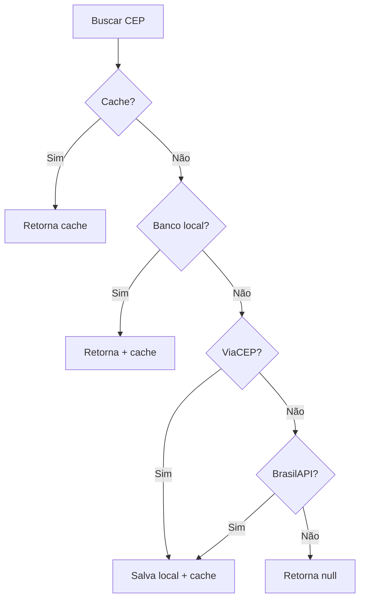

# Documentação de Integrações

> Status: **Rascunho**
> Última atualização: 2025-12-28
> Prioridade: Alta

---

## Visão Geral

Este documento detalha todas as integrações externas do sistema, incluindo protocolos, formatos, tratamento de erros e implementação Laravel proposta.

### Resumo de Integrações

| Integração | Protocolo | Porta | Uso |
|------------|-----------|-------|-----|
| ACBrMonitor | TCP Socket | 3434 | NFe (emissão, consulta, cancelamento) |
| CNAB 240 | Arquivo | - | Pagamentos bancários (Itaú) |
| CEP | Local DB | - | Busca de endereços |
| SMTP | TLS/SSL | 465 | Envio de emails |
| Google Maps | HTTPS | 443 | Geocodificação |
| QualP | HTTPS | 443 | Cálculo de frete |

---

## 1. ACBr (NFe)

**Arquivos C++**: `acbr.cpp`, `acbr.h`, `acbrlib.cpp`

### Conexão

```php
// config/acbr.php
return [
    'host' => env('ACBR_HOST', '127.0.0.1'),
    'port' => env('ACBR_PORT', 3434),
    'timeout' => env('ACBR_TIMEOUT', 30), // segundos
];
```

### Protocolo de Comunicação

| Aspecto | Valor |
|---------|-------|
| Servidor | localhost (127.0.0.1) |
| Porta | 3434 (configurável) |
| Protocolo | TCP Socket |
| Formato comando | `COMANDO(params)\r\n.\r\n` |
| Terminador resposta | `\x03` (ETX) |
| Mensagem boas-vindas | `"Esperando por comandos.\x03"` |
| Padrão sucesso | `"OK: <dados>"` |

### Comandos Utilizados

| Comando | Descrição |
|---------|-----------|
| `NFE.SaveToFile(path, xml)` | Salva XML em arquivo |
| `NFE.LoadFromFile(path)` | Carrega NFe de arquivo |
| `NFE.ConsultarNFe(path)` | Consulta status na SEFAZ |
| `NFE.EnviarEmail(email, path, 1, subject)` | Envia NFe por email |
| `NFE.Cancelar(chave, justificativa)` | Cancela NFe |
| `NFE.Inutilizar(cnpj, just, ano, modelo, serie, numIni, numFin)` | Inutiliza numeração |

### Implementação Laravel

```php
// app/Services/Integrations/AcbrService.php
namespace App\Services\Integrations;

use Illuminate\Support\Facades\Log;

class AcbrService
{
    private $socket;
    private string $host;
    private int $port;
    private int $timeout;

    public function __construct()
    {
        $this->host = config('acbr.host');
        $this->port = config('acbr.port');
        $this->timeout = config('acbr.timeout');
    }

    public function connect(): void
    {
        $this->socket = socket_create(AF_INET, SOCK_STREAM, SOL_TCP);

        if (!$this->socket) {
            throw new AcbrConnectionException('Falha ao criar socket');
        }

        socket_set_option($this->socket, SOL_SOCKET, SO_RCVTIMEO, [
            'sec' => $this->timeout,
            'usec' => 0,
        ]);

        $result = @socket_connect($this->socket, $this->host, $this->port);

        if (!$result) {
            throw new AcbrConnectionException(
                'Não foi possível conectar ao ACBrMonitor: ' . socket_strerror(socket_last_error())
            );
        }

        // Aguarda mensagem de boas-vindas
        $welcome = $this->read();
        if (!str_contains($welcome, 'Esperando por comandos')) {
            throw new AcbrConnectionException('Resposta inesperada do ACBrMonitor');
        }
    }

    public function send(string $command): string
    {
        $fullCommand = $command . "\r\n.\r\n";

        socket_write($this->socket, $fullCommand, strlen($fullCommand));

        return $this->read();
    }

    private function read(): string
    {
        $response = '';
        $etx = "\x03";

        while (true) {
            $chunk = socket_read($this->socket, 4096);

            if ($chunk === false) {
                throw new AcbrTimeoutException('Timeout ao ler resposta do ACBrMonitor');
            }

            $response .= $chunk;

            if (str_ends_with($response, $etx)) {
                return rtrim($response, $etx);
            }
        }
    }

    public function disconnect(): void
    {
        if ($this->socket) {
            socket_close($this->socket);
        }
    }

    // Métodos de alto nível

    public function consultarNfe(string $chaveAcesso): NfeConsultaResult
    {
        $this->connect();

        try {
            $tempFile = storage_path("app/nfe/temp/{$chaveAcesso}.xml");
            $response = $this->send("NFE.ConsultarNFe(\"{$tempFile}\")");

            return $this->parseConsultaResponse($response);
        } finally {
            $this->disconnect();
        }
    }

    public function emitirNfe(string $xmlContent): NfeEmissaoResult
    {
        $this->connect();

        try {
            $tempFile = storage_path('app/nfe/temp/nfe_emissao.xml');
            file_put_contents($tempFile, $xmlContent);

            $response = $this->send("NFE.LoadFromFile(\"{$tempFile}\")");

            if (!$this->isSuccess($response)) {
                throw new NfeEmissaoException($response);
            }

            // Assinar e enviar
            $response = $this->send("NFE.Assinar()");
            $response = $this->send("NFE.Enviar()");

            return $this->parseEmissaoResponse($response);
        } finally {
            $this->disconnect();
        }
    }

    public function cancelarNfe(string $chaveAcesso, string $justificativa): NfeCancelamentoResult
    {
        $this->connect();

        try {
            $response = $this->send("NFE.Cancelar(\"{$chaveAcesso}\", \"{$justificativa}\")");

            return $this->parseCancelamentoResponse($response);
        } finally {
            $this->disconnect();
        }
    }

    private function isSuccess(string $response): bool
    {
        return stripos($response, 'OK') !== false;
    }

    private function parseConsultaResponse(string $response): NfeConsultaResult
    {
        $result = new NfeConsultaResult();

        if (str_contains($response, 'Autorizado o uso da NF-e')) {
            $result->status = NfeStatus::AUTORIZADA;
        } elseif (str_contains($response, 'Cancelamento registrado')) {
            $result->status = NfeStatus::CANCELADA;
        } elseif (str_contains($response, 'Uso Denegado')) {
            $result->status = NfeStatus::DENEGADA;
        } elseif (str_contains($response, 'não consta na base de dados')) {
            $result->status = NfeStatus::NAO_ENCONTRADA;
        } else {
            $result->status = NfeStatus::DESCONHECIDO;
        }

        $result->rawResponse = $response;

        return $result;
    }
}
```

### Tratamento de Erros

```php
// app/Exceptions/Acbr/AcbrException.php
abstract class AcbrException extends Exception {}

class AcbrConnectionException extends AcbrException {}
class AcbrTimeoutException extends AcbrException {}
class NfeEmissaoException extends AcbrException {}
class NfeCancelamentoException extends AcbrException {}

// Handler
class AcbrExceptionHandler
{
    public function handle(AcbrException $e): void
    {
        Log::channel('acbr')->error($e->getMessage(), [
            'exception' => get_class($e),
            'trace' => $e->getTraceAsString(),
        ]);

        // Alertar se crítico
        if ($e instanceof AcbrConnectionException) {
            Notification::route('slack', config('services.slack.alerts'))
                ->notify(new AcbrOfflineNotification());
        }
    }
}
```

### Mensagens de Erro Conhecidas

| Mensagem | Causa | Ação |
|----------|-------|------|
| `"Can't connect"` | ACBr não está rodando | Verificar serviço ACBrMonitor |
| `"Erro ao criar a chave do CSP"` | Certificado desconectado | Reconectar leitor de certificado |
| `"Erro relacionado ao Canal Seguro"` | Problema SSL/TLS | Verificar certificado digital |
| `"Timeout"` | SEFAZ lenta/offline | Retry com backoff |

---

## 2. CNAB 240 (Itaú)

**Arquivos C++**: `cnab.cpp`, `cnab.h`

### Configuração

```php
// config/cnab.php
return [
    'banco' => '341', // Itaú
    'empresa' => [
        'cnpj' => env('CNAB_EMPRESA_CNPJ'),
        'nome' => env('CNAB_EMPRESA_NOME'),
        'agencia' => env('CNAB_AGENCIA'),
        'conta' => env('CNAB_CONTA'),
        'dac' => env('CNAB_DAC'),
    ],
    'diretorio_remessa' => storage_path('app/cnab/remessa'),
    'diretorio_retorno' => storage_path('app/cnab/retorno'),
];
```

### Tipos de Operação

| Tipo | Código | Descrição |
|------|--------|-----------|
| GARE | 05 | Guia de Arrecadação Estadual (impostos) |
| Fornecedor | 20 | Pagamento a fornecedores |
| Salário | 30 | Pagamento de folha |

### Estrutura do Arquivo

```
┌─────────────────────────────────────┐
│ Header de Arquivo (Registro 0)      │
├─────────────────────────────────────┤
│ Header de Lote (Registro 1)         │
├─────────────────────────────────────┤
│ Segmento N (Detalhe - linha 3)      │
│ Segmento B (Endereço - se GARE)     │
│ Segmento W (Complemento - se GARE)  │
│ ... mais segmentos ...              │
├─────────────────────────────────────┤
│ Trailer de Lote (Registro 5)        │
├─────────────────────────────────────┤
│ Trailer de Arquivo (Registro 9)     │
└─────────────────────────────────────┘
```

### Implementação Laravel

```php
// app/Services/Integrations/CnabService.php
namespace App\Services\Integrations;

class CnabService
{
    private const BANCO_ITAU = '341';
    private const LAYOUT_VERSAO = '040';

    public function gerarRemessaGare(Collection $gares): string
    {
        $sequencial = $this->getProximoSequencial();
        $linhas = [];

        // Header de Arquivo
        $linhas[] = $this->headerArquivo($sequencial);

        // Header de Lote
        $linhas[] = $this->headerLote(tipoOperacao: '05');

        // Segmentos
        $sequenciaRegistro = 1;
        foreach ($gares as $gare) {
            $linhas[] = $this->segmentoN($gare, $sequenciaRegistro++);
            $linhas[] = $this->segmentoB($gare, $sequenciaRegistro++);
            $linhas[] = $this->segmentoW($gare, $sequenciaRegistro++);
        }

        // Trailers
        $linhas[] = $this->trailerLote(count($gares) * 3 + 2);
        $linhas[] = $this->trailerArquivo(1, count($linhas) + 1);

        $conteudo = implode("\r\n", $linhas);

        // Salvar arquivo
        $filename = "cnab{$sequencial}.rem";
        $path = config('cnab.diretorio_remessa') . '/' . $filename;
        file_put_contents($path, $conteudo);

        // Registrar no banco
        Cnab::create([
            'tipo' => 'GARE',
            'banco' => self::BANCO_ITAU,
            'sequencial' => $sequencial,
            'arquivo' => $filename,
            'conteudo' => $conteudo,
            'status' => 'GERADO',
        ]);

        return $path;
    }

    private function headerArquivo(int $sequencial): string
    {
        $empresa = config('cnab.empresa');

        return $this->formatLine([
            ['341', 3],                           // Banco
            ['0000', 4],                          // Lote
            ['0', 1],                             // Registro
            [str_repeat(' ', 9), 9],              // Brancos
            ['2', 1],                             // Tipo pessoa (2=PJ)
            [$empresa['cnpj'], 14],               // CNPJ
            [str_repeat(' ', 20), 20],            // Convênio
            [$empresa['agencia'], 5],             // Agência
            [' ', 1],                             // Dígito agência
            [$empresa['conta'], 12],              // Conta
            [' ', 1],                             // Dígito conta
            [$empresa['dac'], 1],                 // DAC
            [mb_str_pad($empresa['nome'], 30), 30], // Nome empresa
            ['BANCO ITAU SA', 30],                // Nome banco
            [str_repeat(' ', 10), 10],            // Brancos
            ['1', 1],                             // Arquivo (1=Remessa)
            [now()->format('dmY'), 8],            // Data geração
            [now()->format('His'), 6],            // Hora geração
            [str_pad($sequencial, 6, '0', STR_PAD_LEFT), 6], // Sequencial
            [self::LAYOUT_VERSAO, 3],             // Versão layout
            ['0', 5],                             // Densidade
            [str_repeat(' ', 20), 20],            // Reservado banco
            [str_repeat(' ', 20), 20],            // Reservado empresa
            [str_repeat(' ', 29), 29],            // Brancos
        ]);
    }

    public function processarRetorno(string $filepath): CnabRetornoResult
    {
        $result = new CnabRetornoResult();
        $linhas = file($filepath, FILE_IGNORE_NEW_LINES);

        DB::beginTransaction();

        try {
            foreach ($linhas as $linha) {
                $tipoRegistro = substr($linha, 7, 1);

                if ($tipoRegistro === '3') { // Detalhe
                    $ocorrencias = $this->extrairOcorrencias($linha);
                    $result->addProcessado($this->processarOcorrencias($ocorrencias));
                }
            }

            // Salvar retorno
            Cnab::create([
                'tipo' => 'RETORNO',
                'banco' => self::BANCO_ITAU,
                'arquivo' => basename($filepath),
                'conteudo' => file_get_contents($filepath),
                'status' => 'PROCESSADO',
            ]);

            DB::commit();
        } catch (Exception $e) {
            DB::rollBack();
            throw $e;
        }

        return $result;
    }

    private function extrairOcorrencias(string $linha): array
    {
        // Posições das ocorrências no layout Itaú 240
        $posicoes = [230, 232, 234, 236, 238];
        $ocorrencias = [];

        foreach ($posicoes as $pos) {
            $codigo = substr($linha, $pos, 2);
            if ($codigo !== '  ') {
                $ocorrencias[] = $codigo;
            }
        }

        return $ocorrencias;
    }
}
```

### Códigos de Ocorrência (Retorno)

| Código | Descrição | Ação |
|--------|-----------|------|
| `00` | PAGAMENTO EFETUADO | Marcar como pago |
| `AE` | DATA DE PAGAMENTO ALTERADA | Atualizar data |
| `BD` | PAGAMENTO AGENDADO | Manter pendente |
| `CE` | PAGAMENTO CANCELADO | Marcar cancelado |
| `HA` | LOTE NAO ACEITO | Reprocessar |
| `HB` | INSCRICAO DA EMPRESA INVALIDA | Corrigir cadastro |

---

## 3. CEP (Busca de Endereços)

**Arquivos C++**: `cepcompleter.cpp`, `lineeditcep.cpp`

### Implementação Atual

O sistema atual usa **banco de dados local** com tabela `cep.cep`.

### Implementação Laravel (Híbrida)

```php
// app/Services/Integrations/CepService.php
namespace App\Services\Integrations;

use Illuminate\Support\Facades\Http;
use Illuminate\Support\Facades\Cache;

class CepService
{
    public function buscar(string $cep): ?Endereco
    {
        $cep = preg_replace('/\D/', '', $cep);

        if (strlen($cep) !== 8 || $cep === '00000000') {
            return null;
        }

        // 1. Tenta cache
        $cacheKey = "cep:{$cep}";
        if ($cached = Cache::get($cacheKey)) {
            return $cached;
        }

        // 2. Tenta banco local
        $local = $this->buscarLocal($cep);
        if ($local) {
            Cache::put($cacheKey, $local, now()->addMonth());
            return $local;
        }

        // 3. Fallback para ViaCEP
        $externo = $this->buscarViaCep($cep);
        if ($externo) {
            // Salva no banco local para próximas consultas
            $this->salvarLocal($externo);
            Cache::put($cacheKey, $externo, now()->addMonth());
            return $externo;
        }

        // 4. Fallback para BrasilAPI
        $externo = $this->buscarBrasilApi($cep);
        if ($externo) {
            $this->salvarLocal($externo);
            Cache::put($cacheKey, $externo, now()->addMonth());
            return $externo;
        }

        return null;
    }

    private function buscarLocal(string $cep): ?Endereco
    {
        $result = DB::connection('cep')
            ->table('cep')
            ->where('cep', $cep)
            ->first();

        if (!$result) {
            return null;
        }

        return new Endereco(
            cep: $cep,
            logradouro: $result->logradouro,
            complemento: $result->complemento,
            bairro: $result->bairro,
            cidade: $result->cidade,
            uf: $result->uf,
        );
    }

    private function buscarViaCep(string $cep): ?Endereco
    {
        try {
            $response = Http::timeout(5)
                ->get("https://viacep.com.br/ws/{$cep}/json/");

            if ($response->successful() && !isset($response['erro'])) {
                $data = $response->json();
                return new Endereco(
                    cep: $cep,
                    logradouro: $data['logradouro'] ?? '',
                    complemento: $data['complemento'] ?? '',
                    bairro: $data['bairro'] ?? '',
                    cidade: $data['localidade'] ?? '',
                    uf: $data['uf'] ?? '',
                );
            }
        } catch (Exception $e) {
            Log::warning('ViaCEP falhou', ['cep' => $cep, 'error' => $e->getMessage()]);
        }

        return null;
    }

    private function buscarBrasilApi(string $cep): ?Endereco
    {
        try {
            $response = Http::timeout(5)
                ->get("https://brasilapi.com.br/api/cep/v2/{$cep}");

            if ($response->successful()) {
                $data = $response->json();
                return new Endereco(
                    cep: $cep,
                    logradouro: $data['street'] ?? '',
                    complemento: '',
                    bairro: $data['neighborhood'] ?? '',
                    cidade: $data['city'] ?? '',
                    uf: $data['state'] ?? '',
                );
            }
        } catch (Exception $e) {
            Log::warning('BrasilAPI falhou', ['cep' => $cep, 'error' => $e->getMessage()]);
        }

        return null;
    }
}
```

### Diagrama de Fallback



---

## 4. SMTP (Email)

**Arquivos C++**: `smtp.cpp`, `smtp.h`

### Configuração

```php
// config/mail.php (Laravel padrão)
'mailers' => [
    'smtp' => [
        'transport' => 'smtp',
        'host' => env('MAIL_HOST'),
        'port' => env('MAIL_PORT', 465),
        'encryption' => env('MAIL_ENCRYPTION', 'tls'),
        'username' => env('MAIL_USERNAME'),
        'password' => env('MAIL_PASSWORD'),
        'timeout' => 5,
    ],
],
```

### Uso para NFe

```php
// app/Mail/NfeEmail.php
class NfeEmail extends Mailable
{
    use Queueable, SerializesModels;

    public function __construct(
        public Nfe $nfe,
        public string $xmlPath,
        public string $danfePath,
    ) {}

    public function build()
    {
        return $this->subject("NFe {$this->nfe->numero} - {$this->nfe->cliente->razao_social}")
            ->view('emails.nfe')
            ->attach($this->xmlPath, [
                'as' => "nfe_{$this->nfe->chave_acesso}.xml",
                'mime' => 'application/xml',
            ])
            ->attach($this->danfePath, [
                'as' => "danfe_{$this->nfe->chave_acesso}.pdf",
                'mime' => 'application/pdf',
            ]);
    }
}
```

---

## 5. Google Maps (Geocodificação)

**Arquivos C++**: `cadastrocliente.cpp`, `application.cpp`

### Configuração

```php
// config/services.php
'google_maps' => [
    'api_key' => env('GOOGLE_MAPS_API_KEY'),
    'geocode_endpoint' => 'https://maps.googleapis.com/maps/api/geocode/json',
],
```

### Implementação

```php
// app/Services/Integrations/GeocodingService.php
class GeocodingService
{
    public function geocode(Endereco $endereco): ?Coordenadas
    {
        $address = implode(', ', [
            $endereco->logradouro,
            $endereco->numero,
            $endereco->bairro,
            $endereco->cidade,
            $endereco->uf,
            'Brasil',
        ]);

        try {
            $response = Http::get(config('services.google_maps.geocode_endpoint'), [
                'address' => $address,
                'key' => config('services.google_maps.api_key'),
            ]);

            if ($response->successful()) {
                $data = $response->json();

                if ($data['status'] === 'OK' && !empty($data['results'])) {
                    $location = $data['results'][0]['geometry']['location'];

                    return new Coordenadas(
                        latitude: $location['lat'],
                        longitude: $location['lng'],
                    );
                }
            }
        } catch (Exception $e) {
            Log::warning('Geocoding falhou', ['endereco' => $address, 'error' => $e->getMessage()]);
        }

        return null;
    }
}
```

---

## 6. QualP (Frete)

**Arquivos C++**: `calculofrete.cpp`

### Configuração

```php
// config/services.php
'qualp' => [
    'api_url' => env('QUALP_API_URL'),
    'headers' => env('QUALP_HEADERS'), // JSON string
],
```

### Implementação

```php
// app/Services/Integrations/QualpFreteService.php
class QualpFreteService
{
    public function calcular(FreteRequest $request): FreteResult
    {
        $headers = json_decode(config('services.qualp.headers'), true);

        try {
            $response = Http::withHeaders($headers)
                ->timeout(30)
                ->post(config('services.qualp.api_url'), $request->toArray());

            if ($response->successful()) {
                return FreteResult::fromResponse($response->json());
            }

            throw new QualpException("Erro na API QualP: " . $response->body());
        } catch (ConnectionException $e) {
            throw new QualpException("Não foi possível conectar ao QualP: " . $e->getMessage());
        }
    }
}
```

---

## 7. Certificado Digital

### Tipos Suportados

| Tipo | Descrição | Armazenamento |
|------|-----------|---------------|
| A1 | Arquivo (.pfx/.p12) | Disco do servidor |
| A3 | Token/Smartcard | Hardware (apenas Windows) |

### Configuração

```php
// config/certificado.php
return [
    'tipo' => env('CERT_TIPO', 'A1'), // A1 ou A3
    'caminho' => env('CERT_CAMINHO'), // Apenas A1
    'senha' => env('CERT_SENHA'),
    'validade_alerta_dias' => 30,
];
```

### Verificação de Validade

```php
// app/Services/CertificadoService.php
class CertificadoService
{
    public function verificarValidade(): CertificadoStatus
    {
        $certPath = config('certificado.caminho');
        $senha = config('certificado.senha');

        $pkcs12 = file_get_contents($certPath);
        openssl_pkcs12_read($pkcs12, $certs, $senha);

        $certInfo = openssl_x509_parse($certs['cert']);
        $validTo = Carbon::createFromTimestamp($certInfo['validTo_time_t']);
        $diasRestantes = now()->diffInDays($validTo, false);

        $status = new CertificadoStatus(
            valido: $diasRestantes > 0,
            validoAte: $validTo,
            diasRestantes: $diasRestantes,
            titular: $certInfo['subject']['CN'] ?? 'Desconhecido',
        );

        // Alerta se próximo do vencimento
        if ($diasRestantes <= config('certificado.validade_alerta_dias')) {
            Notification::route('mail', config('mail.admin'))
                ->notify(new CertificadoVencendoNotification($status));
        }

        return $status;
    }
}
```

---

## 8. Padrões de Resiliência

### Retry com Backoff Exponencial

```php
// app/Services/Integrations/Concerns/HasRetry.php
trait HasRetry
{
    protected function withRetry(callable $operation, int $maxAttempts = 3): mixed
    {
        $attempt = 1;
        $lastException = null;

        while ($attempt <= $maxAttempts) {
            try {
                return $operation();
            } catch (Exception $e) {
                $lastException = $e;

                Log::warning("Tentativa {$attempt}/{$maxAttempts} falhou", [
                    'service' => static::class,
                    'error' => $e->getMessage(),
                ]);

                if ($attempt < $maxAttempts) {
                    // Backoff exponencial: 1s, 2s, 4s...
                    $delay = pow(2, $attempt - 1);
                    sleep($delay);
                }

                $attempt++;
            }
        }

        throw $lastException;
    }
}
```

### Circuit Breaker

```php
// app/Services/Integrations/Concerns/HasCircuitBreaker.php
trait HasCircuitBreaker
{
    protected function withCircuitBreaker(string $service, callable $operation): mixed
    {
        $cacheKey = "circuit_breaker:{$service}";
        $state = Cache::get($cacheKey, ['failures' => 0, 'open_until' => null]);

        // Circuito aberto?
        if ($state['open_until'] && now()->lt($state['open_until'])) {
            throw new CircuitOpenException("Serviço {$service} temporariamente indisponível");
        }

        try {
            $result = $operation();

            // Reset em sucesso
            Cache::put($cacheKey, ['failures' => 0, 'open_until' => null], now()->addHour());

            return $result;
        } catch (Exception $e) {
            $state['failures']++;

            // Abre circuito após 5 falhas
            if ($state['failures'] >= 5) {
                $state['open_until'] = now()->addMinutes(5);

                Log::error("Circuit breaker aberto para {$service}", [
                    'failures' => $state['failures'],
                    'reopen_at' => $state['open_until'],
                ]);
            }

            Cache::put($cacheKey, $state, now()->addHour());

            throw $e;
        }
    }
}
```

---

## 9. Monitoramento de Integrações

### Health Checks

```php
// app/Http/Controllers/HealthCheckController.php
class HealthCheckController extends Controller
{
    public function integrations(): JsonResponse
    {
        return response()->json([
            'acbr' => $this->checkAcbr(),
            'database' => $this->checkDatabase(),
            'redis' => $this->checkRedis(),
            'smtp' => $this->checkSmtp(),
            'certificado' => $this->checkCertificado(),
        ]);
    }

    private function checkAcbr(): array
    {
        try {
            $service = app(AcbrService::class);
            $service->connect();
            $service->disconnect();

            return ['status' => 'ok'];
        } catch (Exception $e) {
            return ['status' => 'error', 'message' => $e->getMessage()];
        }
    }
}
```

### Métricas

```php
// Logging estruturado para todas as integrações
Log::channel('integrations')->info('Requisição externa', [
    'service' => 'acbr',
    'operation' => 'consultar_nfe',
    'duration_ms' => $duration,
    'success' => true,
    'metadata' => ['chave' => $chaveAcesso],
]);
```

---

## Checklist de Implementação

- [ ] AcbrService com socket TCP
- [ ] CnabService com geração/processamento de arquivos
- [ ] CepService com fallback (local → ViaCEP → BrasilAPI)
- [ ] Configuração de email (Mailables)
- [ ] GeocodingService para Google Maps
- [ ] CertificadoService com alertas de vencimento
- [ ] Retry com backoff em todas as integrações
- [ ] Circuit breaker para serviços externos
- [ ] Health checks para monitoramento
- [ ] Logging estruturado de todas as chamadas

---

## Documentos Relacionados

- [../tecnico/modulos/nfe.md](./modulos/nfe.md) - Spec do módulo NFe
- [../tecnico/modulos/financeiro.md](./modulos/financeiro.md) - Spec do módulo Financeiro
- [05-seguranca.md](./05-seguranca.md) - Segurança (certificados)
