# Schema Proposto: ERP Staccato v2 - Flowchart

## Overview: Architecture at a Glance

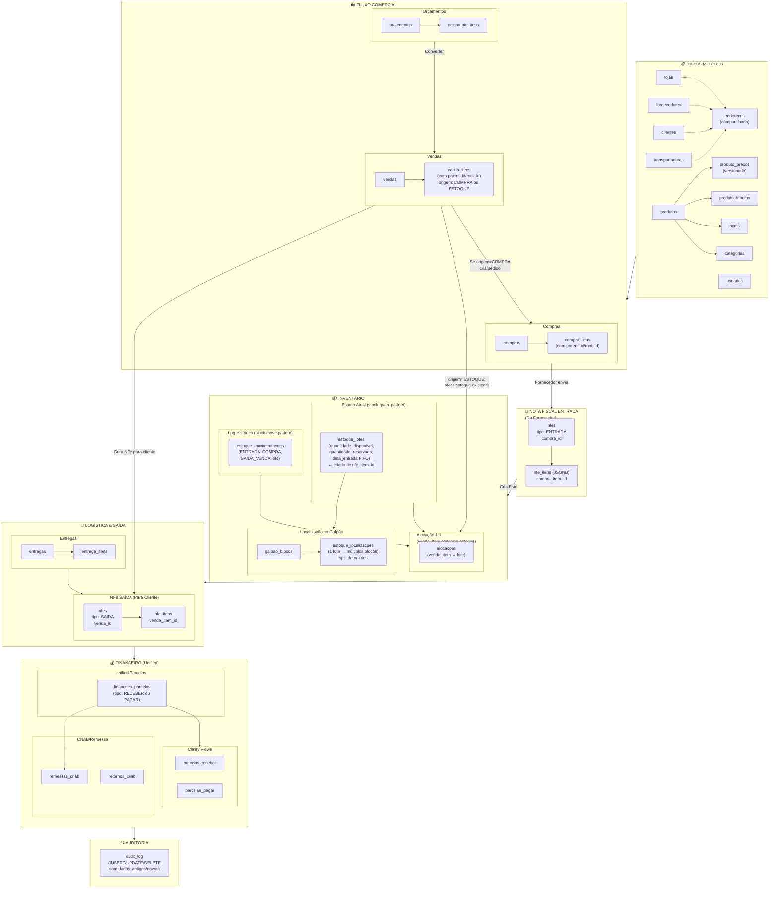

---

## Design Principles

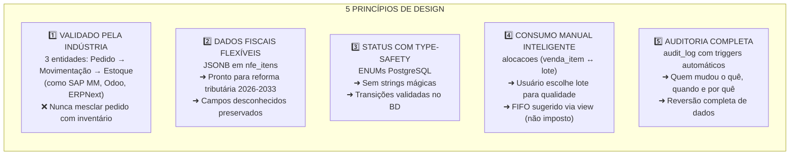

---

## Master Data: Cascade Relationships

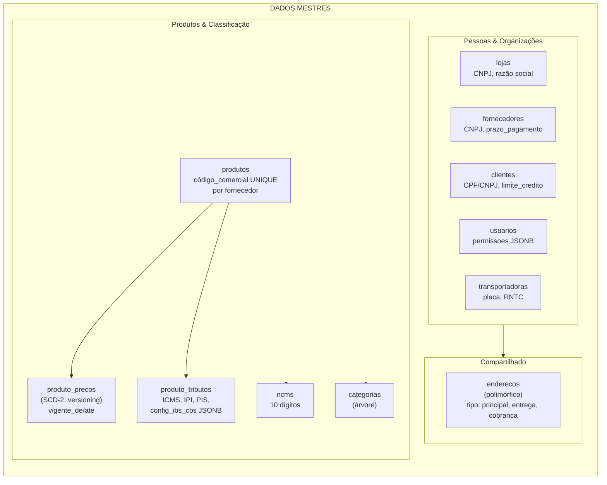

**Key Design Decision**: Produto tem FK obrigatório para fornecedor
- ✅ Garante origem
- ✅ Simplifica FIFO (já sabe fornecedor)
- ✅ Preços versionados (SCD-2) preservam histórico

---

## Commercial Flow: From Quote to Invoice

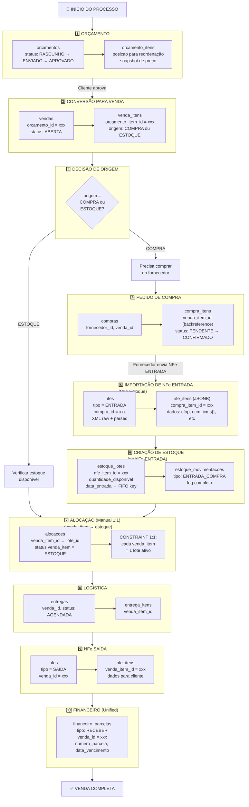

---

## Stock Model: Three-Layer Pattern (Industry Standard)

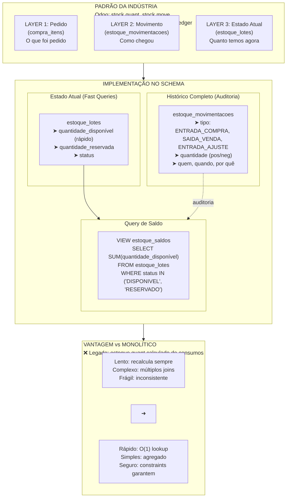

---

## Allocation (Alocação): The 1:1 Link

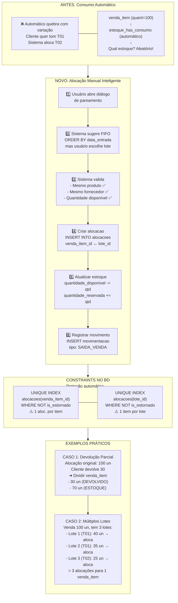

---

## Real-World Scenarios: Complex Allocations

### Scenario 1: Multiple NFes from One Purchase Order

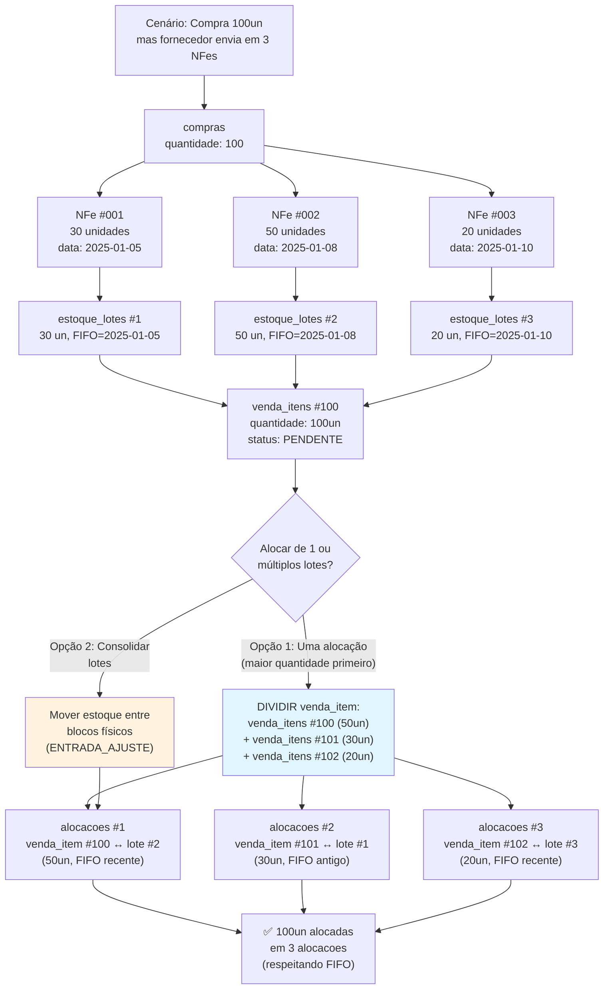

**Key Points:**
- Cada NFe = 1 `estoque_lotes` (respeita FIFO)
- 1 venda_item pode necessitar de múltiplas alocações
- **Solução**: dividir venda_item em splits (parent_id) + múltiplas alocações
- Alternativa: consolidar lotes (1 entrada_ajuste em bloco único)

---

### Scenario 2: Partial Delivery (Cliente quer parte, resto depois)

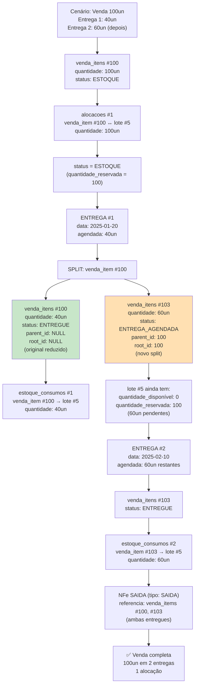

**Key Points:**
- Alocação permanece 1:1 (lote ↔ venda_item original)
- Split usa parent_id para rastrear entregas parciais
- UNIQUE (venda_item_id) na alocação continua válida
- NFe SAIDA referencia ambas as partes da split

---

### Scenario 3: Items Break After Delivery → Re-fulfillment

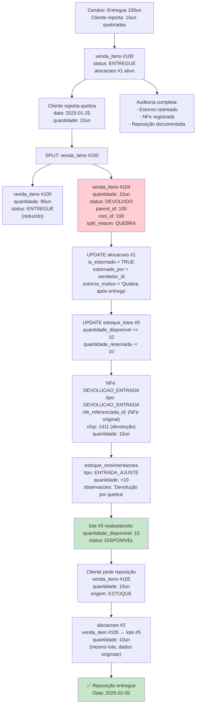

**Key Points:**
- Quebra = split do venda_item original
- Estorno (soft delete) preserva auditoria
- NFe DEVOLUCAO_ENTRADA registra oficialmente
- Estoque reabastecido e pronto para nova alocação
- Mesmo lote pode ser alocado novamente

---

## Status State Machines: Venda vs Compra vs Entrega

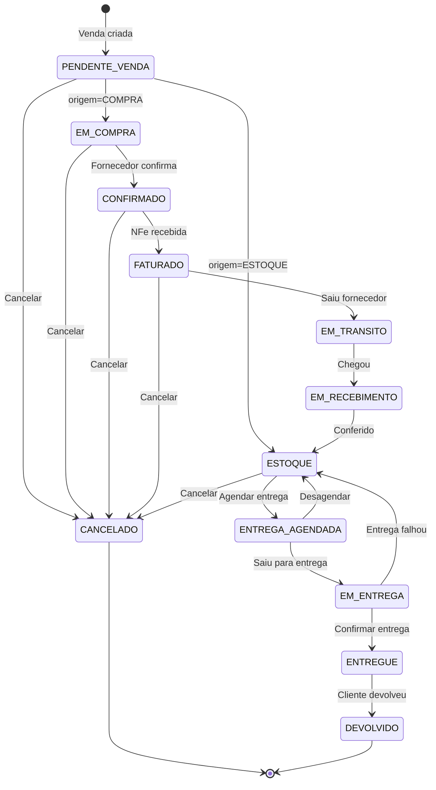

---

## ENUMs: Complete Type Safety

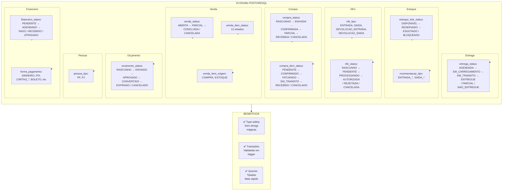

---

## NFe Strategy: Flexible JSONB for Tax Reforms

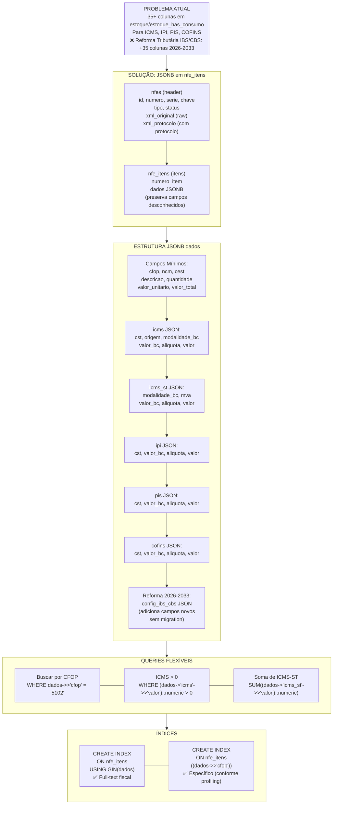

---

## Product Versionization: SCD-2 Pattern

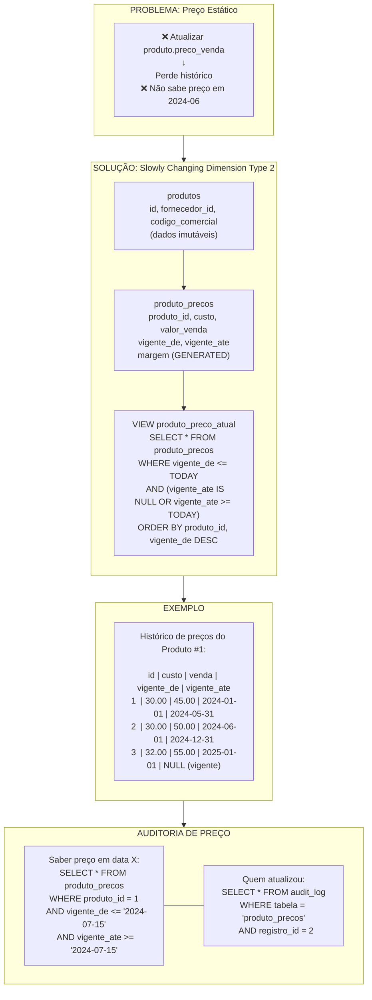

---

## Inventory Views: Helper Queries

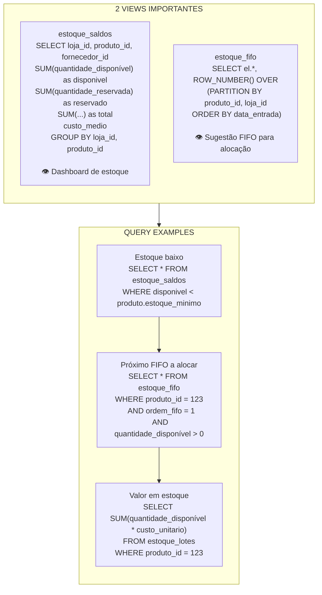

---

## Triggers: Automatic Data Protection

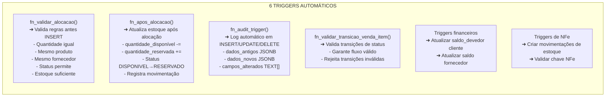

---

## Comparison: Legacy vs Proposed

```mermaid
flowchart LR
    subgraph Legacy["❌ LEGADO"]
        direction TB

        L1["Tabelas L1/L2<br/>venda_has_produto +<br/>venda_has_produto2"]
        L2["idRelacionado cadeias<br/>(confuso)"]
        L3["fornecedor VARCHAR<br/>em 9 tabelas"]
        L4["Status strings<br/>'Em Estoque'"]
        L5["FIFO automático<br/>(quebrado)"]
        L6["~30 colunas<br/>fiscais em estoque"]
        L7["Sem auditoria"]
        L8["Devoluções incompletas"]
        L9["Mega-tabela produto<br/>100+ colunas"]
    end

    Legacy -->|"MIGRAÇÃO"| Proposed

    subgraph Proposed["✅ PROPOSTO"]
        direction TB

        P1["Tabela única venda_itens<br/>parent_id + root_id"]
        P2["Hierarquia clara<br/>(auto-referência)"]
        P3["fornecedor_id FK<br/>em todo lugar"]
        P4["ENUMs PostgreSQL<br/>com transições"]
        P5["Seleção manual<br/>+ sugestão FIFO"]
        P6["JSONB em nfe_itens<br/>(flexível)"]
        P7["audit_log completo<br/>(triggers automáticos)"]
        P8["Fluxo completo<br/>+ NFe DEVOLUCAO_*"]
        P9["produtos + produto_precos +<br/>produto_tributos"]
    end
```

---

## Statistics

```
SCHEMA PROPOSTO STATISTICS:
├── ENUMs........................... 15
├── Tabelas......................... 32
├── Views........................... 2
├── Triggers........................ 6
├── Índices......................... ~40
├── Constraints..................... ~30
├── Foreign Keys.................... ~25
└── CHECK Constraints............... ~15

MAIOR MUDANÇA:
• Dados fiscais: ~30 colunas → JSONB em nfe_itens
• Tabelas: L1+L2 (2) → Única venda_itens (1)
• Referências: VARCHAR → FK
• Status: Strings → ENUMs
• Auditoria: 0 → triggers automáticos
```

---

## Key Implementation Notes

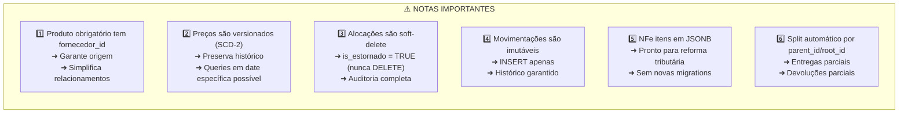

---

## References

- Industry Patterns: SAP MM, Odoo (stock.quant/stock.move), ERPNext
- Decision Rationale: `./.claude/next-gen/03-decisoes/02-schema-redesenhado.md`
- Problems Addressed: `./.claude/next-gen/02-analise/02-melhorias.md`
- Full Implementation: `./.claude/next-gen/rascunhos/schema-proposto.md`
