# Venda → Pedido Fornecedor → Estoque: Old vs New Architecture

> Comprehensive comparison of the 1:N:N relationship handling in Staccato ERP redesign

---

## Table of Contents

1. [Architecture Overview](#1-architecture-overview)
2. [Data Model Comparison](#2-data-model-comparison)
3. [Scenario 1: Simple Sale (No Splits)](#3-scenario-1-simple-sale-no-splits)
4. [Scenario 2: Sale with Supplier Split](#4-scenario-2-sale-with-supplier-split)
5. [Scenario 3: Partial NFe (Split Across Shipments)](#5-scenario-3-partial-nfe-split-across-shipments)
6. [Stock Consumption Flow](#6-stock-consumption-flow)
7. [Problem Areas in Old System](#7-problem-areas-in-old-system)
8. [Key Improvements in New System](#8-key-improvements-in-new-system)

---

## 1. Architecture Overview

### OLD SYSTEM: Tangled L1/L2 with String References

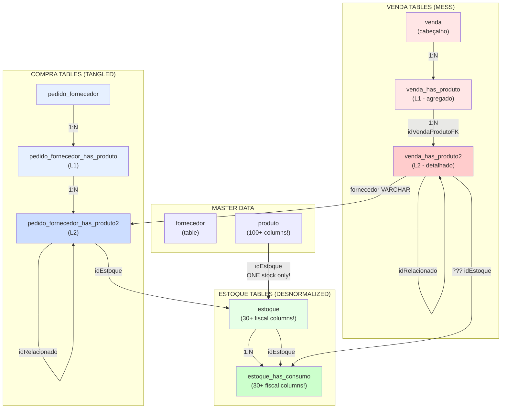

### NEW SYSTEM: Clear 1:N:N with FK Relationships

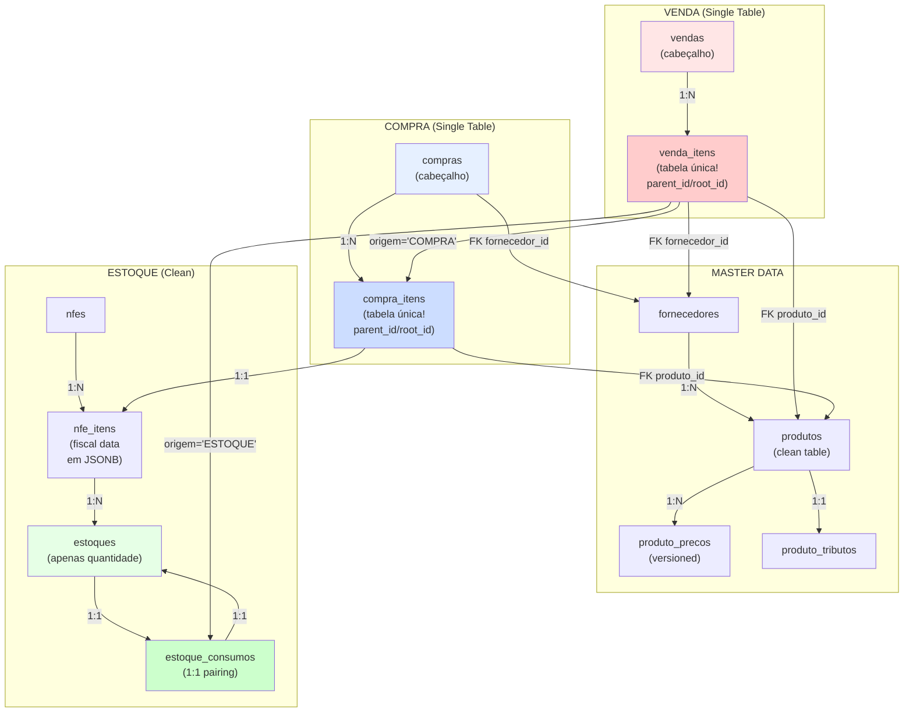

---

## 2. Data Model Comparison

### OLD: Table Structure

```
┌─────────────────────────────────────────────────────────────────────┐
│ venda_has_produto (L1 - Level 1)                                    │
├─────────────────────────────────────────────────────────────────────┤
│ idVendaProduto (PK)                                                 │
│ idVenda (FK) ──→ venda                                              │
│ idVendaProduto2FK (FK) ──→ venda_has_produto2 (L2)                 │
└─────────────────────────────────────────────────────────────────────┘
            │
            │ (1:N)
            ▼
┌─────────────────────────────────────────────────────────────────────┐
│ venda_has_produto2 (L2 - Level 2)                                   │
├─────────────────────────────────────────────────────────────────────┤
│ idVendaProduto2 (PK)                                                │
│ idProduto (FK) ──→ produto                                          │
│ descricaoProduto (VARCHAR - DESNORMALIZED)                          │
│ fornecedor (VARCHAR - MAGIC STRING!) ⚠️                             │
│ quantidade                                                           │
│ valor_unitario                                                      │
│ idRelacionado (FK) ──→ venda_has_produto2 (RECURSIVE!)             │
│ ... 30+ other fields                                                │
└─────────────────────────────────────────────────────────────────────┘

Problems:
❌ TWO tables for ONE concept (venda items)
❌ fornecedor stored as VARCHAR (PRONE TO ERRORS)
❌ idRelacionado creates RECURSIVE chains (hard to follow)
❌ Desnormalized description (update nightmare)
```

### NEW: Table Structure

```
┌──────────────────────────────────────────────────────────┐
│ venda_itens (SINGLE TABLE!)                              │
├──────────────────────────────────────────────────────────┤
│ id (PK)                                                  │
│ venda_id (FK) ──→ vendas                                 │
│ produto_id (FK) ──→ produtos ✅                          │
│ fornecedor_id (FK) ──→ fornecedores ✅                   │
│                                                          │
│ Splits via HIERARCHY:                                    │
│ ├─ parent_id (FK self-ref) ──→ venda_itens             │
│ └─ root_id (FK self-ref) ──→ venda_itens               │
│                                                          │
│ split_reason (VARCHAR) ──→ 'PARTIAL_NFE'                │
│                                                          │
│ quantidade                                               │
│ valor_unitario                                           │
│ status (venda_item_status ENUM) ✅                       │
│                                                          │
│ origem (ENUM) ──→ 'COMPRA' | 'ESTOQUE'                 │
└──────────────────────────────────────────────────────────┘

Advantages:
✅ ONE table = ONE concept (DRY principle)
✅ fornecedor as FK (referential integrity)
✅ Recursive structure with parent_id/root_id (clearer splits)
✅ Status as ENUM (type-safe)
✅ origem determines flow (COMPRA → compra_itens, ESTOQUE → estoque)
```

---

## 3. Scenario 1: Simple Sale (No Splits)

### OLD SYSTEM: Simple Sale Flow

```mermaid
flowchart TB
    subgraph UserAction["👤 USER ACTION"]
        A1["Criar venda para cliente ACME"]
        A2["Adicionar 100 unidades de Porcelanato"]
    end

    subgraph CreateVenda["1️⃣ CREATE VENDA"]
        B1["INSERT INTO venda<br/>idCliente=1, total=4500"]
        B2["venda.id = 100"]
    end

    subgraph CreateL1["2️⃣ CREATE L1 (venda_has_produto)"]
        C1["INSERT INTO venda_has_produto<br/>idVenda=100"]
        C2["venda_has_produto.idVendaProduto = 1"]
    end

    subgraph CreateL2["3️⃣ CREATE L2 (venda_has_produto2)"]
        D1["INSERT INTO venda_has_produto2<br/>idVendaProduto=1<br/>idProduto=50<br/>quantidade=100<br/>valor_unitario=45<br/>fornecedor='ACME Corp' ⚠️<br/>descricaoProduto='Porcelanato...'"]
        D2["venda_has_produto2.id = 999"]
    end

    subgraph CreateCompra["4️⃣ AUTO-CREATE PURCHASE (if needed)"]
        E1["Check: is item from 'ESTOQUE'?<br/>OR do we need to order from supplier?"]
        E2["IF need order:<br/>CREATE pedido_fornecedor<br/>idFornecedor=???<br/>(parse 'ACME Corp' string!)"]
        E3["CREATE pedido_fornecedor_has_produto (L1)"]
        E4["CREATE pedido_fornecedor_has_produto2 (L2)"]
    end

    subgraph ImportNFe["5️⃣ IMPORT NFe (when arrives)"]
        F1["NFe XML received from 'ACME Corp'"]
        F2["Parse XML manually<br/>(regex or DOM)"]
        F3["INSERT INTO estoque<br/>idProduto=50<br/>fornecedor='ACME Corp' ⚠️<br/>quantidade=100<br/>+ 30 fiscal columns"]
        F4["estoque.id = 888"]
    end

    subgraph ConsumeStock["6️⃣ CONSUME STOCK<br/>(manual or auto-FIFO broken)"]
        G1["INSERT INTO estoque_has_consumo<br/>idEstoque=888<br/>idVendaProduto2=999<br/>quantidade=100<br/>+ 30 fiscal columns AGAIN"]
        G2["UPDATE estoque<br/>SET saldoEstoque = 0<br/>WHERE idEstoque=888"]
    end

    subgraph Query["❓ COMMON QUERY<br/>(Problems!)"]
        H1["Get all items for venda 100?"]
        H2["SELECT vhp.*, vhp2.*<br/>FROM venda_has_produto vhp<br/>JOIN venda_has_produto2 vhp2<br/>  ON vhp.idVendaProduto = vhp2.idVendaProdutoFK<br/>WHERE vhp.idVenda = 100"]
        H3["Problem: No direct venda→vhp2 link<br/>Must always join through L1"]
    end

    A1 --> A2 --> CreateVenda --> CreateL1 --> CreateL2
    CreateL2 --> CreateCompra --> ImportNFe --> ConsumeStock
    ConsumeStock --> Query

    style CreateVenda fill:#ffe6e6
    style CreateL1 fill:#ffe6e6
    style CreateL2 fill:#ffcccc
    style CreateCompra fill:#e6f0ff
    style ImportNFe fill:#fff0e6
    style ConsumeStock fill:#e6ffe6
    style Query fill:#f0e6ff
```

### NEW SYSTEM: Simple Sale Flow

```mermaid
flowchart TB
    subgraph UserAction["👤 USER ACTION"]
        A1["Criar venda para cliente ACME"]
        A2["Adicionar 100 unidades de Porcelanato"]
    end

    subgraph CreateVenda["1️⃣ CREATE VENDA<br/>(no L1/L2!)"]
        B1["INSERT INTO vendas<br/>loja_id=1, cliente_id=1, total=4500"]
        B2["vendas.id = 100"]
    end

    subgraph CreateItem["2️⃣ CREATE ITEM<br/>(single table)"]
        C1["INSERT INTO venda_itens<br/>venda_id=100<br/>produto_id=50 (FK) ✅<br/>fornecedor_id=2 (FK) ✅<br/>quantidade=100<br/>valor_unitario=45<br/>origem='COMPRA'<br/>parent_id=NULL, root_id=NULL<br/>status='PENDENTE'"]
        C2["venda_itens.id = 1"]
    end

    subgraph CreateCompra["3️⃣ AUTO-CREATE PURCHASE<br/>(clean)"]
        D1["INSERT INTO compras<br/>loja_id=1<br/>fornecedor_id=2 (FK!) ✅<br/>venda_id=100"]
        D2["compras.id = 50"]
    end

    subgraph CreateCompraItem["4️⃣ CREATE COMPRA ITEM<br/>(linked)"]
        E1["INSERT INTO compra_itens<br/>compra_id=50<br/>produto_id=50<br/>venda_item_id=1 (FK) ✅<br/>quantidade=100<br/>valor_unitario=35<br/>status='PENDENTE'"]
        E2["compra_itens.id = 200"]
    end

    subgraph ImportNFe["5️⃣ IMPORT NFe<br/>(clean separation)"]
        F1["NFe XML received"]
        F2["INSERT INTO nfes<br/>tipo='ENTRADA'"]
        F3["INSERT INTO nfe_itens<br/>nfe_id=X<br/>compra_item_id=200<br/>dados={JSONB with all fiscal}"]
        F4["nfe_itens.id = 1000"]
    end

    subgraph CreateStock["6️⃣ CREATE ESTOQUE<br/>(clean)"]
        G1["INSERT INTO estoques<br/>loja_id=1<br/>produto_id=50<br/>nfe_item_id=1000<br/>compra_item_id=200<br/>quantidade_original=100<br/>quantidade_disponivel=100<br/>status='DISPONIVEL'"]
        G2["estoques.id = 777"]
    end

    subgraph PairStock["7️⃣ PAIR STOCK<br/>(manual selection)"]
        H1["User selects which estoque<br/>for this venda_item"]
        H2["INSERT INTO estoque_consumos<br/>venda_item_id=1<br/>estoque_id=777<br/>quantidade=100<br/>motivo='VENDA'"]
        H3["UPDATE estoques<br/>SET quantidade_disponivel=0<br/>WHERE id=777"]
        H4["UPDATE venda_itens<br/>SET status='ESTOQUE'<br/>WHERE id=1"]
    end

    subgraph Query["✅ SIMPLE QUERIES"]
        I1["Get all items for venda 100?"]
        I2["SELECT * FROM venda_itens<br/>WHERE venda_id = 100"]
        I3["No complex joins needed!"]
    end

    A1 --> A2 --> CreateVenda --> CreateItem
    CreateItem --> CreateCompra --> CreateCompraItem
    CreateCompraItem --> ImportNFe --> CreateStock --> PairStock
    PairStock --> Query

    style CreateVenda fill:#ffe6e6
    style CreateItem fill:#ffcccc
    style CreateCompra fill:#e6f0ff
    style CreateCompraItem fill:#ccddff
    style ImportNFe fill:#fff0e6
    style CreateStock fill:#fff0cc
    style PairStock fill:#e6ffe6
    style Query fill:#f0e6ff
```

---

## 4. Scenario 2: Sale with Supplier Split

**Context**: Customer orders Porcelanato from ACME, but ACME only supplies 60 units.
The remaining 40 must come from supplier BRICKS.

### OLD SYSTEM: Supplier Split (Messy)

```mermaid
flowchart TB
    subgraph CreateL2_Original["1️⃣ ORIGINAL L2 (before split)"]
        A1["venda_has_produto2.id = 999<br/>idProduto=50<br/>quantidade=100<br/>fornecedor='ACME Corp'"]
    end

    subgraph ManualSplit["2️⃣ MANUAL SPLIT (USER DOES)<br/>❌ No framework for this!"]
        B1["User realizes: 60 from ACME, 40 from BRICKS"]
        B2["❌ How to handle?<br/>- Keep original 999 as 60?<br/>- Create new row for 40?<br/>- Update original to 100 'pending'?<br/>NO CLEAR PATTERN"]
    end

    subgraph BadApproach["3️⃣ COMMON BAD APPROACH<br/>(causes bugs)"]
        C1["UPDATE venda_has_produto2<br/>SET quantidade=60<br/>WHERE id=999"]
        C2["INSERT INTO venda_has_produto2<br/>id=1000<br/>idProduto=50<br/>quantidade=40<br/>fornecedor='BRICKS'<br/>idRelacionado=999 (???)"]
        C3["Now what is idRelacionado?<br/>Parent? Child? Both?<br/>❌ Ambiguous!"]
    end

    subgraph CreateCompras["4️⃣ CREATE PURCHASES"]
        D1["pedido_fornecedor #1<br/>idFornecedor=??? (parse 'ACME Corp')"]
        D2["pedido_fornecedor #2<br/>idFornecedor=??? (parse 'BRICKS')"]
    end

    subgraph Problem["5️⃣ THE NIGHTMARE<br/>❌ Inconsistent State"]
        E1["When ACME delivers 60:<br/>estoque.idEstoque=888<br/>fornecedor='ACME Corp'"]
        E2["But which venda_has_produto2?<br/>999 (original) or 1000 (split)?<br/>❌ NO FK TO LINK!"]
        E3["Later: estoque_has_consumo<br/>idEstoque=888<br/>idVendaProduto2=??? (999 or 1000?)"]
    end

    CreateL2_Original --> ManualSplit --> BadApproach --> CreateCompras --> Problem

    style CreateL2_Original fill:#ffe6e6
    style ManualSplit fill:#ff9999
    style BadApproach fill:#ff6666
    style CreateCompras fill:#e6f0ff
    style Problem fill:#ff3333
```

### NEW SYSTEM: Supplier Split (Clean)

```mermaid
flowchart TB
    subgraph CreateOriginal["1️⃣ ORIGINAL ITEM (root)"]
        A1["venda_itens.id=1<br/>venda_id=100<br/>produto_id=50<br/>fornecedor_id=2 (ACME)<br/>quantidade=100<br/>parent_id=NULL<br/>root_id=NULL<br/>status='PENDENTE'<br/>origem='COMPRA'"]
    end

    subgraph Split["2️⃣ USER DECIDES TO SPLIT<br/>✅ Framework provided"]
        B1["System detects: ACME only has 60"]
        B2["User action: 'Split this item'"]
        B3["Select quantity: 60 to ACME, 40 to BRICKS"]
    end

    subgraph UpdateOriginal["3️⃣ UPDATE ORIGINAL"]
        C1["UPDATE venda_itens SET<br/>id=1<br/>quantidade=60 ✅<br/>fornecedor_id=2 (ACME)<br/>status='EM_COMPRA'"]
    end

    subgraph CreateChild["4️⃣ CREATE CHILD ITEM"]
        D1["INSERT INTO venda_itens<br/>id=2<br/>venda_id=100<br/>produto_id=50<br/>fornecedor_id=5 (BRICKS) ✅<br/>quantidade=40<br/>parent_id=1 ✅ (link to original)<br/>root_id=1 ✅ (both from same root)<br/>split_reason='SUPPLIER_SPLIT'<br/>status='PENDENTE'"]
    end

    subgraph CreateCompras["5️⃣ CREATE PURCHASES<br/>(automatic)"]
        E1["compra_itens from venda_item 1:<br/>compra_itens.id=200<br/>venda_item_id=1<br/>quantidade=60"]
        E2["compra_itens from venda_item 2:<br/>compra_itens.id=201<br/>venda_item_id=2<br/>quantidade=40"]
    end

    subgraph ImportNFe1["6️⃣ ACME NFe ARRIVES<br/>(60 units)"]
        F1["nfe_itens<br/>compra_item_id=200<br/>quantidade=60"]
        F2["estoques<br/>estoques.id=777<br/>compra_item_id=200<br/>nfe_item_id=X"]
    end

    subgraph ImportNFe2["7️⃣ BRICKS NFe ARRIVES<br/>(40 units)"]
        G1["nfe_itens<br/>compra_item_id=201<br/>quantidade=40"]
        G2["estoques<br/>estoques.id=888<br/>compra_item_id=201<br/>nfe_item_id=Y"]
    end

    subgraph PairBoth["8️⃣ PAIR BOTH STOCKS"]
        H1["estoque_consumos<br/>venda_item_id=1<br/>estoque_id=777<br/>quantidade=60"]
        H2["estoque_consumos<br/>venda_item_id=2<br/>estoque_id=888<br/>quantidade=40"]
    end

    subgraph Query["✅ QUERY UNIFIED DATA"]
        I1["Get all items for original order?"]
        I2["SELECT * FROM venda_itens<br/>WHERE venda_id=100<br/>OR root_id=1"]
        I3["Returns: Item 1 (60) + Item 2 (40)"]
    end

    CreateOriginal --> Split --> UpdateOriginal --> CreateChild
    CreateChild --> CreateCompras --> ImportNFe1
    CreateCompras --> ImportNFe2
    ImportNFe1 --> PairBoth
    ImportNFe2 --> PairBoth
    PairBoth --> Query

    style CreateOriginal fill:#ffe6e6
    style Split fill:#fff0e6
    style UpdateOriginal fill:#ffcccc
    style CreateChild fill:#ccffcc
    style CreateCompras fill:#e6f0ff
    style ImportNFe1 fill:#fff0e6
    style ImportNFe2 fill:#fff0e6
    style PairBoth fill:#e6ffe6
    style Query fill:#f0e6ff
```

---

## 5. Scenario 3: Partial NFe (Split Across Shipments)

**Context**: Customer orders 100 units. First NFe only has 60. Second NFe has remaining 40 (2 weeks later).

### OLD SYSTEM: Partial NFe (Broken FIFO)

```mermaid
flowchart TB
    subgraph Initial["1️⃣ INITIAL STATE"]
        A1["venda_has_produto2.id=999<br/>quantidade=100<br/>fornecedor='ACME Corp'<br/>status='PEDIDO'"]
    end

    subgraph NFe1Arrives["2️⃣ NFe #1 (60 units) arrives"]
        B1["UPDATE venda_has_produto2<br/>SET status='PARCIAL' or 'ESTOQUE'?"]
        B2["INSERT INTO estoque<br/>id=888<br/>quantidade=60<br/>saldoEstoque=60"]
        B3["INSERT INTO estoque_has_consumo<br/>idEstoque=888<br/>idVendaProduto2=999<br/>quantidade=60"]
        B4["❌ Problem: What about remaining 40?"]
    end

    subgraph WaitingFor40["3️⃣ WAITING FOR 40 UNITS"]
        C1["venda_has_produto2.id=999<br/>status='PEDIDO' still?<br/>or 'PARCIAL'?<br/>❌ State ambiguous"]
        C2["No way to track:<br/>- 60 already arrived<br/>- 40 still pending<br/>❌ NO PARENT/CHILD STRUCTURE"]
    end

    subgraph NFe2Arrives["4️⃣ NFe #2 (40 units) arrives<br/>2 weeks later"]
        D1["INSERT INTO estoque<br/>id=889<br/>quantidade=40"]
        D2["INSERT INTO estoque_has_consumo<br/>idEstoque=889<br/>idVendaProduto2=999<br/>quantidade=40"]
        D3["❌ Both estoques link to SAME<br/>venda_has_produto2=999<br/>(which was already marked as CONSUMED!)"]
    end

    subgraph BrokenFIFO["5️⃣ BROKEN FIFO"]
        E1["No timestamp on estoque"]
        E2["No ORDER BY data_entrada"]
        E3["When user tries to select stock:<br/>Which estoque (888 or 889)?<br/>❌ NO GUIDANCE"]
        E4["Manual FIFO selection? 🤔<br/>But product.idEstoque only holds ONE"]
    end

    subgraph Chaos["6️⃣ CHAOS"]
        F1["Duplicate consumption records?"]
        F2["Stock counting is wrong"]
        F3["Can't undo partial shipment"]
        F4["Report shows 100% fulfillment<br/>but status says 'PEDIDO'"]
    end

    Initial --> NFe1Arrives --> WaitingFor40 --> NFe2Arrives --> BrokenFIFO --> Chaos

    style Initial fill:#ffe6e6
    style NFe1Arrives fill:#fff0e6
    style WaitingFor40 fill:#ffff99
    style NFe2Arrives fill:#fff0e6
    style BrokenFIFO fill:#ff6666
    style Chaos fill:#ff3333
```

### NEW SYSTEM: Partial NFe (Proper State Management)

```mermaid
flowchart TB
    subgraph Initial["1️⃣ INITIAL ITEM"]
        A1["venda_itens.id=1<br/>quantidade=100<br/>fornecedor_id=2<br/>status='PENDENTE'<br/>parent_id=NULL<br/>root_id=NULL"]
    end

    subgraph Compra["2️⃣ PURCHASE CREATED"]
        B1["compra_itens.id=100<br/>venda_item_id=1<br/>quantidade=100<br/>status='PENDENTE'"]
    end

    subgraph NFe1Arrives["3️⃣ NFe #1 (60 units) arrives<br/>✅ Clear state"]
        C1["nfe_itens<br/>compra_item_id=100<br/>quantidade=60 (partial!)"]
        C2["estoques.id=777<br/>nfe_item_id=X<br/>compra_item_id=100<br/>quantidade_original=60<br/>data_entrada='2025-01-15 10:00'"]
        C3["compra_itens UPDATE:<br/>status='FATURADO'"]
    end

    subgraph SystemDetectsSplit["4️⃣ SYSTEM DETECTS SPLIT"]
        D1["Received: 60<br/>Expected: 100<br/>Difference: 40 ✅"]
        D2["Action: Create child item for 40"]
    end

    subgraph CreateChild["5️⃣ CREATE CHILD ITEM<br/>✅ Framework handles this"]
        E1["UPDATE venda_itens.id=1<br/>quantidade=60<br/>status='ESTOQUE'"]
        E2["INSERT venda_itens.id=2<br/>quantidade=40<br/>parent_id=1<br/>root_id=1<br/>split_reason='PARTIAL_NFE'<br/>status='PENDENTE'"]
    end

    subgraph NewCompraItem["6️⃣ NEW COMPRA ITEM FOR REMAINDER"]
        F1["INSERT compra_itens.id=101<br/>venda_item_id=2<br/>quantidade=40<br/>status='PENDENTE'"]
    end

    subgraph NFe2Arrives["7️⃣ NFe #2 (40 units) arrives<br/>2 weeks later"]
        G1["nfe_itens<br/>compra_item_id=101<br/>quantidade=40 ✅"]
        G2["estoques.id=888<br/>nfe_item_id=Y<br/>compra_item_id=101<br/>quantidade_original=40<br/>data_entrada='2025-01-29 14:00'"]
    end

    subgraph ProperFIFO["8️⃣ PROPER FIFO SELECTION"]
        H1["Query available stock:"]
        H2["SELECT * FROM estoques<br/>WHERE venda_item_id=1<br/>ORDER BY data_entrada ASC<br/>RESULT: estoque 777 (earlier)"]
        H3["SELECT * FROM estoques<br/>WHERE venda_item_id=2<br/>ORDER BY data_entrada ASC<br/>RESULT: estoque 888 (later)"]
    end

    subgraph PairBoth["9️⃣ PAIR BOTH STOCKS"]
        I1["estoque_consumos<br/>venda_item_id=1<br/>estoque_id=777<br/>quantidade=60<br/>created_at='2025-01-15'"]
        I2["estoque_consumos<br/>venda_item_id=2<br/>estoque_id=888<br/>quantidade=40<br/>created_at='2025-01-29'"]
    end

    subgraph QueryComplete["✅ QUERY COMPLETE ORDER"]
        J1["Get all items for original order:"]
        J2["SELECT * FROM venda_itens<br/>WHERE id=1 OR root_id=1<br/>ORDER BY id"]
        J3["Returns item 1 (60) + item 2 (40)<br/>= 100 total ✅"]
    end

    Initial --> Compra --> NFe1Arrives --> SystemDetectsSplit
    SystemDetectsSplit --> CreateChild --> NewCompraItem
    NewCompraItem --> NFe2Arrives
    NFe2Arrives --> ProperFIFO --> PairBoth --> QueryComplete

    style Initial fill:#ffe6e6
    style Compra fill:#e6f0ff
    style NFe1Arrives fill:#fff0e6
    style SystemDetectsSplit fill:#ffffcc
    style CreateChild fill:#ccffcc
    style NewCompraItem fill:#e6f0ff
    style NFe2Arrives fill:#fff0e6
    style ProperFIFO fill:#e6ffe6
    style PairBoth fill:#e6ffe6
    style QueryComplete fill:#f0e6ff
```

---

## 6. Stock Consumption Flow

### OLD SYSTEM: Stock Consumption (Broken)

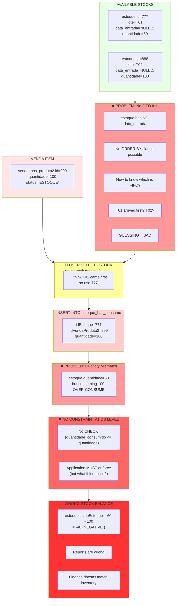

### NEW SYSTEM: Stock Consumption (Proper)

```mermaid
flowchart TB
    subgraph Available["AVAILABLE STOCKS<br/>✅ With FIFO Info"]
        S1["estoques.id=777<br/>produto_id=50<br/>fornecedor_id=2<br/>lote=T01<br/>data_entrada='2025-01-15 09:00' ✅<br/>quantidade_original=60<br/>quantidade_disponivel=60"]
        S2["estoques.id=888<br/>produto_id=50<br/>fornecedor_id=2<br/>lote=T02<br/>data_entrada='2025-01-15 15:00' ✅<br/>quantidade_original=100<br/>quantidade_disponivel=100"]
    end

    subgraph Item["VENDA ITEM"]
        I1["venda_itens.id=1<br/>venda_id=100<br/>produto_id=50<br/>fornecedor_id=2<br/>quantidade=100<br/>status='ESTOQUE'"]
    end

    subgraph FIFO["✅ AUTO FIFO LOGIC"]
        F1["Query available stock FIFO:"]
        F2["SELECT * FROM estoques<br/>WHERE produto_id=50<br/>  AND fornecedor_id=2<br/>  AND quantidade_disponivel > 0<br/>ORDER BY data_entrada ASC"]
        F3["RESULT: [777 (Jan 15 09:00)]"]
    end

    subgraph UserSelectsManual["👤 USER EXPLICITLY SELECTS<br/>(guided, not guessing)"]
        U1["UI shows: 'FIFO suggests estoque 777'"]
        U2["But due to lote variation,"]
        U3["User CAN override: 'Use 777 instead'"]
        U4["⚠️ Warning: Different lote!"]
    end

    subgraph Pair["✅ CREATE ESTOQUE_CONSUMO<br/>(with validation)"]
        PAIR1["INSERT INTO estoque_consumos<br/>venda_item_id=1<br/>estoque_id=777<br/>quantidade=60<br/>motivo='VENDA'"]
        PAIR2["BEFORE INSERT trigger runs:"]
        PAIR3["✓ Check: venda_item.quantidade=60?"]
        PAIR4["✓ Check: estoque.quantidade_disponivel >= 60?"]
        PAIR5["✓ Check: produto_id matches?"]
        PAIR6["✓ Check: fornecedor_id matches?"]
    end

    subgraph CheckPartialRemaining["3️⃣ WHAT ABOUT REMAINING 40?"]
        C1["estoque 777: 60 units ✅"]
        C2["Need: 100 units total"]
        C3["Still need: 40 units"]
        C4["System creates SPLIT:"]
    end

    subgraph SplitItem["4️⃣ CREATE CHILD ITEM<br/>(automatic)"]
        SPLIT1["UPDATE venda_itens.id=1<br/>quantidade=60"]
        SPLIT2["INSERT venda_itens.id=2<br/>quantidade=40<br/>parent_id=1<br/>root_id=1<br/>split_reason='PARTIAL_STOCK'<br/>status='PENDENTE'"]
    end

    subgraph NextSelection["5️⃣ SELECT NEXT STOCK<br/>for remaining 40"]
        NEXT1["Query available again:"]
        NEXT2["SELECT * FROM estoques<br/>WHERE produto_id=50<br/>  AND NOT id IN (777)<br/>  AND quantidade_disponivel > 0<br/>ORDER BY data_entrada"]
        NEXT3["RESULT: [888 (Jan 15 15:00)]"]
        NEXT4["Pair with 888 for remaining 40"]
    end

    subgraph Pair2["✅ PAIR SECOND STOCK"]
        PAIR2_1["INSERT estoque_consumos<br/>venda_item_id=2<br/>estoque_id=888<br/>quantidade=40"]
    end

    Available --> FIFO
    Item --> FIFO
    FIFO --> UserSelectsManual --> Pair
    Pair --> CheckPartialRemaining --> SplitItem
    SplitItem --> NextSelection --> Pair2

    style Available fill:#e6ffe6
    style Item fill:#ffe6e6
    style FIFO fill:#ffffcc
    style UserSelectsManual fill:#ffff99
    style Pair fill:#ccffcc
    style CheckPartialRemaining fill:#ffffcc
    style SplitItem fill:#ccffcc
    style NextSelection fill:#ffffcc
    style Pair2 fill:#ccffcc
```

---

## 7. Problem Areas in Old System

### Key Issues Visualized

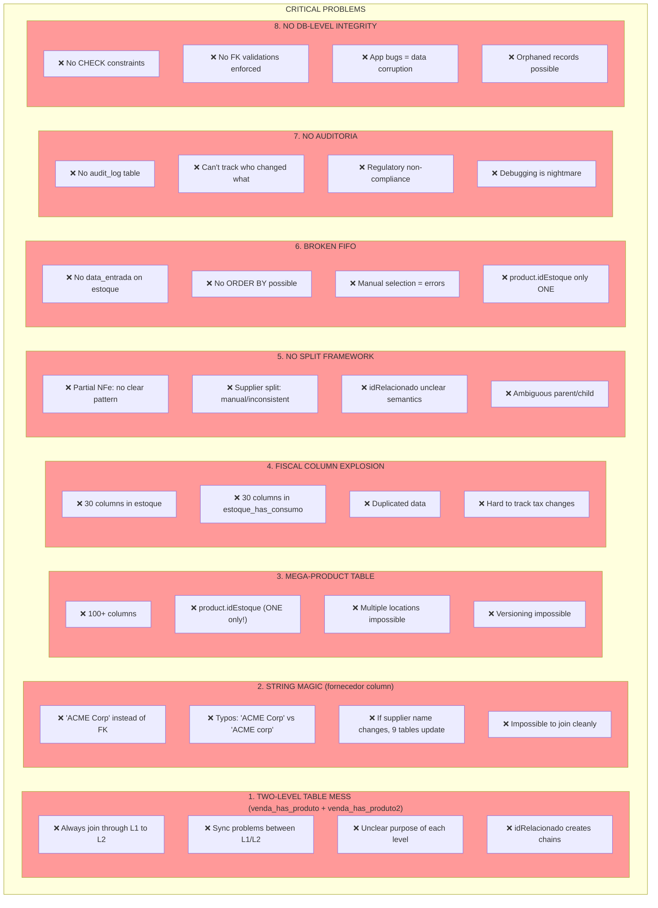

---

## 8. Key Improvements in New System

### Feature Comparison Table

```
┌────────────────────────────┬──────────────────────┬──────────────────────┐
│ Aspect                     │ OLD SYSTEM ❌         │ NEW SYSTEM ✅         │
├────────────────────────────┼──────────────────────┼──────────────────────┤
│ Venda Items                │ 2 tables (L1/L2)     │ 1 table               │
│ Join Complexity            │ Always L1→L2         │ Direct access         │
│ Supplier Reference         │ VARCHAR string       │ FK to fornecedores    │
│ Supplier Change Impact     │ Update 9 tables      │ Update 1 record       │
│ Product Table Size         │ 100+ columns         │ 3 normalized tables   │
│ Price Versioning           │ No, overwrites       │ Yes, temporal         │
│ Fiscal Columns             │ 30 in estoque        │ 0, in nfe_itens JSONB │
│ Split Handling             │ No framework         │ parent_id/root_id     │
│ Split Semantics            │ Ambiguous            │ Clear hierarchy       │
│ FIFO Capability            │ Impossible           │ ORDER BY data_entrada │
│ Stock Pairing              │ 1:N broken           │ 1:1 guaranteed        │
│ Audit Trail                │ None                 │ audit_log table       │
│ DB Constraints             │ None/minimal         │ Comprehensive         │
│ Status Management          │ Strings              │ ENUMs                 │
│ Referential Integrity      │ Application level    │ Database level        │
│ Query Simplicity           │ Complex joins        │ Simple WHERE          │
│ Performance                │ L1/L2 overhead       │ Direct indexing       │
│ Data Consistency Risk      │ Very High            │ Very Low              │
│ Scalability                │ Poor (mega-tables)   │ Good (partitioning)   │
└────────────────────────────┴──────────────────────┴──────────────────────┘
```

### Architectural Improvements

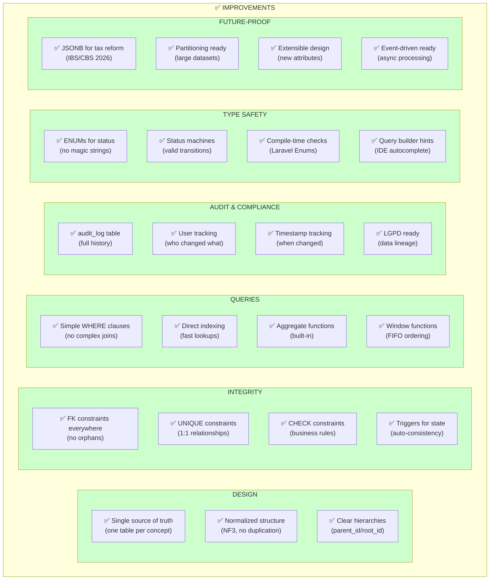

---

## Summary: Data Flow Comparison

### OLD SYSTEM: Data Path (Problematic)

```
Customer orders 100 Porcelanato
         ↓
venda created
         ↓
venda_has_produto (L1) created
         ↓
venda_has_produto2 (L2) created ← STRING 'ACME Corp'
         ↓
pedido_fornecedor created ← PARSE STRING!
         ↓
pedido_fornecedor_has_produto (L1)
         ↓
pedido_fornecedor_has_produto2 (L2)
         ↓
NFe arrives, XML parsed manually
         ↓
INSERT estoque (STRING 'ACME Corp', 30 fiscal cols)
         ↓
Supplier sends only 60? ❌ NO PATTERN
         ↓
INSERT estoque_has_consumo (more fiscal duplication)
         ↓
❌ WHERE IS THE OTHER 40 UNITS?
```

### NEW SYSTEM: Data Path (Clean)

```
Customer orders 100 Porcelanato
         ↓
vendas created
         ↓
venda_itens created (single table, FK references)
  ├─ produto_id → produtos
  ├─ fornecedor_id → fornecedores
  └─ origem='COMPRA'
         ↓
compras created (FK fornecedor_id)
         ↓
compra_itens created (venda_item_id → venda_itens)
         ↓
NFe arrives, parsed to nfe_itens (JSONB dados)
         ↓
estoques created (nfe_item_id, data_entrada timestamp)
         ↓
estoque_consumos created (1:1 pairing, constraint enforced)
         ↓
Only 60 units? ✅ AUTOMATIC SPLIT
  ├─ venda_itens[1] updated to 60 (parent)
  ├─ venda_itens[2] created for 40 (child, parent_id=1)
  └─ compra_itens[2] auto-created
         ↓
40 units arrive 2 weeks later
         ↓
nfe_itens[2], estoques[2], estoque_consumos[2]
         ↓
FIFO query with data_entrada: correct ordering
         ↓
✅ venda_itens fully linked to estoques via estoque_consumos
```

---

## Document Summary

This comparison document demonstrates why the new schema is superior:

| Aspect | Old | New |
|--------|-----|-----|
| **Simplicity** | Complex L1/L2 joins | Single-table access |
| **Type Safety** | Magic strings | ENUMs + FKs |
| **Auditability** | None | Complete audit_log |
| **Scalability** | Poor (mega-tables) | Good (normalized) |
| **Data Integrity** | App-dependent | Database-enforced |
| **Split Handling** | Manual/inconsistent | Automatic/structured |
| **FIFO Support** | Broken | Full support |
| **Query Performance** | Slow (joins) | Fast (indexes) |
| **Maintainability** | Difficult | Clear patterns |
| **Tax Flexibility** | Rigid columns | JSONB extensible |
