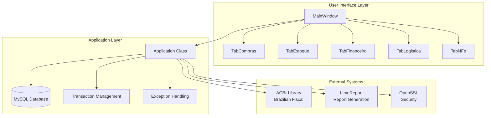
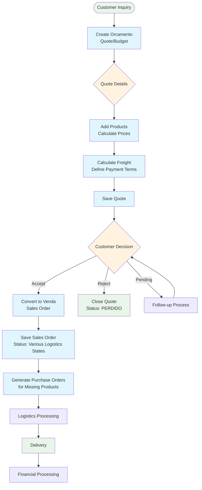
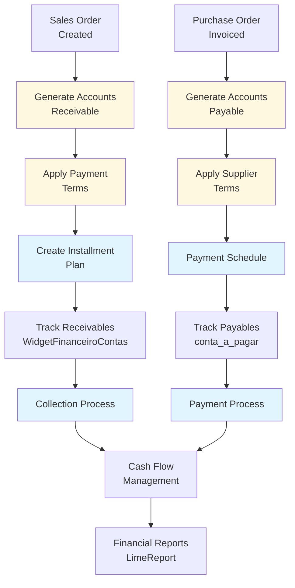
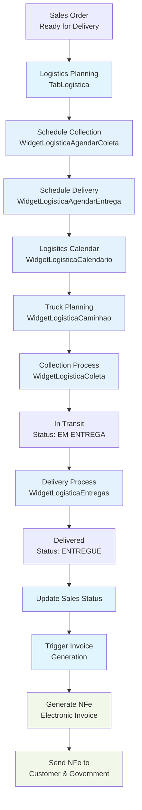
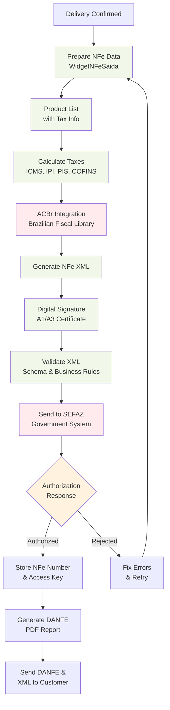

# ERP Staccato - Process Flowchart & Architecture Documentation

## System Overview

ERP Staccato is a comprehensive Brazilian business management system built with Qt C++ and MySQL/MariaDB, specifically designed for Brazilian fiscal compliance including NFe (Electronic Invoices) and tax management.

## High-Level Architecture



## Core Business Process Flow

### 1. Sales Process Flow



### 2. Purchase Process Flow

```mermaid
flowchart TD
    VendaNeed[Sales Order<br/>Needs Products] --> CheckEst{Check Inventory}
    CheckEst -->|In Stock| AllocateEst[Allocate from<br/>Existing Stock]
    CheckEst -->|Out of Stock| PendenteProd[Mark Product<br/>Status: PENDENTE]
    
    PendenteProd --> WidgetPend[WidgetCompraPendentes<br/>Pending Products View]
    WidgetPend --> IniciarCompra[Initiate Purchase<br/>Status: INICIADO]
    
    IniciarCompra --> WidgetGerar[WidgetCompraGerar<br/>Generate Purchase Orders]
    WidgetGerar --> GroupBySupp[Group Products<br/>by Supplier]
    GroupBySupp --> GenExcel[Generate Excel Files<br/>for Suppliers]
    GenExcel --> SendEmail[Send PO via Email<br/>Status: EM COMPRA]
    
    SendEmail --> WidgetConf[WidgetCompraConfirmar<br/>Confirm Orders]
    WidgetConf --> SupplierConf[Supplier Confirms<br/>Status: EM FATURAMENTO]
    
    SupplierConf --> WidgetFat[WidgetCompraFaturar<br/>Invoice Processing]
    WidgetFat --> InvoiceRec[Receive Invoice<br/>Status: EM ENTREGA]
    
    InvoiceRec --> EstoqueRec[Receive in Inventory<br/>Status: ESTOQUE]
    EstoqueRec --> AllocateEst
    
    AllocateEst --> CreateConsumo[Create Consumption<br/>Record]
    CreateConsumo --> UpdateSalesStatus[Update Sales Order<br/>Status]
    
    classDef process fill:#e1f5fe
    classDef decision fill:#fff3e0
    classDef status fill:#f3e5f5
    
    class WidgetPend,WidgetGerar,WidgetConf,WidgetFat process
    class CheckEst decision
    class PendenteProd,IniciarCompra,SendEmail,SupplierConf,InvoiceRec,EstoqueRec status
```



### 3. Inventory Management Flow

```mermaid
flowchart TD
    ProdArrival[Product Arrival] --> CreateEst[Create Estoque Record]
    CreateEst --> LinkPO[Link to Purchase Order<br/>estoque_has_compra]
    
    LinkPO --> StockReady[Stock Available<br/>Status: Green/OK]
    
    SalesNeed[Sales Order<br/>Needs Product] --> CheckAvail{Check Availability}
    CheckAvail -->|Available| CreateCons[Create Consumption<br/>criarConsumo()]
    CheckAvail -->|Insufficient| PartialCons[Partial Consumption<br/>Split Order]
    CheckAvail -->|Not Available| BackOrder[Trigger Purchase<br/>Process]
    
    CreateCons --> UpdateQuant[Update Remaining<br/>Quantities]
    UpdateQuant --> LinkSales[Link to Sales Order<br/>idVendaProduto2]
    
    PartialCons --> DivideOrder[dividirCompra()<br/>Split Purchase Order]
    DivideOrder --> CreateCons
    
    LinkSales --> StatusUpdate[Update Sales Status<br/>Ready for Logistics]
    
    ManualAdj[Manual Adjustment] --> AdjustQuant[on_pushButtonAjustarQuant_clicked()]
    AdjustQuant --> CreateAdjRec[Create Adjustment<br/>Record]
    
    BackOrder --> PurchaseFlow[Purchase Process<br/>Flow]
    
    classDef inventory fill:#e8f5e8
    classDef process fill:#e1f5fe
    classDef decision fill:#fff3e0
    
    class CreateEst,CreateCons,UpdateQuant,LinkSales inventory
    class CheckAvail decision
    class AdjustQuant,DivideOrder process
```

### 4. Financial Integration Flow



### 5. Logistics & Delivery Flow



### 6. NFe (Electronic Invoice) Process



## Key Integration Points

### Database Architecture
- **Core Tables**: `loja`, `produto`, `cliente`, `fornecedor`
- **Sales Tables**: `orcamento`, `venda`, `venda_has_produto2`
- **Purchase Tables**: `pedido_fornecedor_has_produto2`, `estoque_has_compra`
- **Inventory Tables**: `estoque`, `estoque_has_consumo`
- **Financial Tables**: `conta_a_pagar`, `conta_a_receber`
- **NFe Tables**: `nfe`, `nfe_has_produto`

### Status Flow Summary

#### Sales Order Status:
```
Quote: ATIVO → FECHADO/PERDIDO/CANCELADO
Sales: Various logistics states (EM COLETA, EM RECEBIMENTO, EM ENTREGA, ENTREGUE)
```

#### Purchase Order Status:
```
PENDENTE → EM COMPRA → EM FATURAMENTO → EM ENTREGA → ESTOQUE
```

#### Inventory Status:
```
Color-coded: White (Unprocessed) → Green (OK) → Yellow (Quantity differs) → Red (Not found)
Consumption: TEMP → CONSUMO → AJUSTE/CANCELADO
```

### Brazilian Compliance Features
- **NFe Integration**: Full electronic invoice generation and transmission
- **Tax Calculation**: Automatic ICMS, IPI, PIS, COFINS calculations
- **SEFAZ Integration**: Direct communication with government systems
- **DANFE Reports**: Official invoice PDF generation
- **Fiscal Certificates**: A1/A3 digital certificate support

### External Dependencies
- **ACBr Library**: Brazilian fiscal compliance
- **LimeReport**: Report generation and design
- **QtXlsxWriter**: Excel file generation
- **OpenSSL**: Security and certificates
- **cURL**: HTTP communications

This documentation provides a comprehensive overview of the organically grown ERP system, showing how the various modules interconnect and process business transactions from initial quote through final delivery and invoicing.