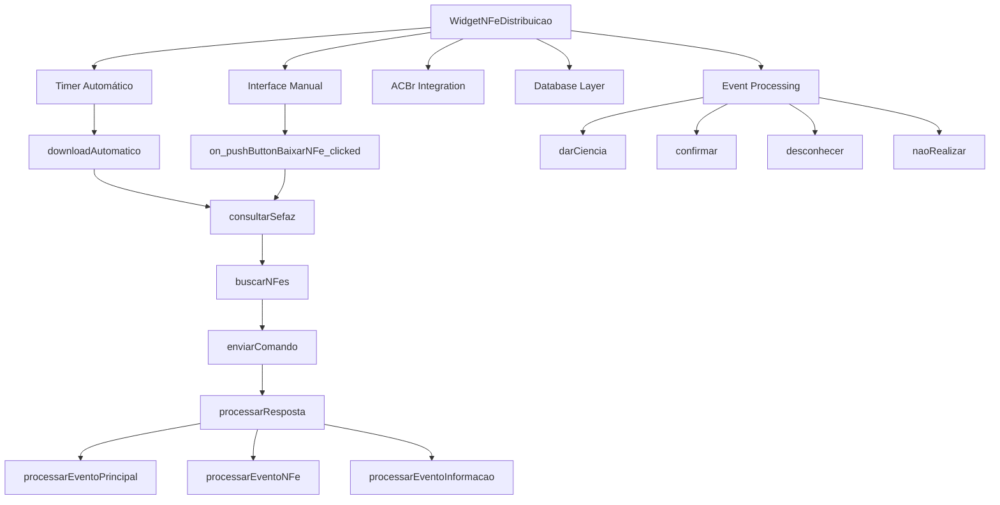
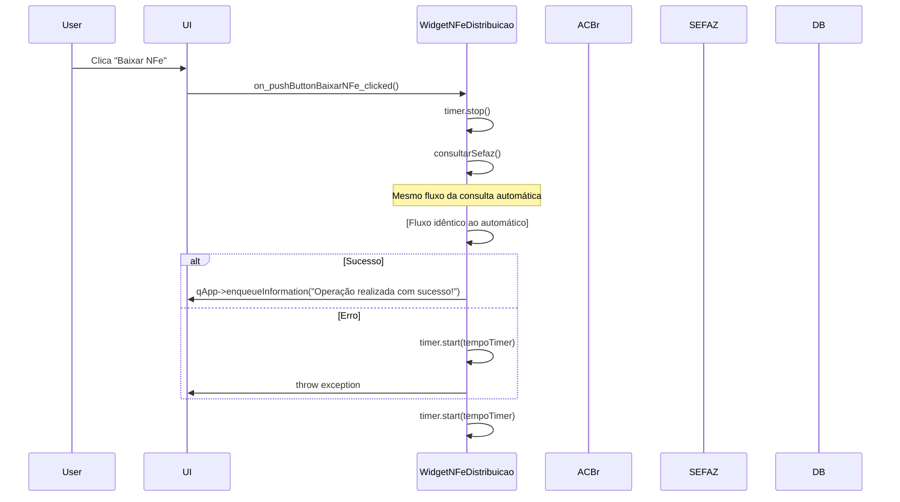
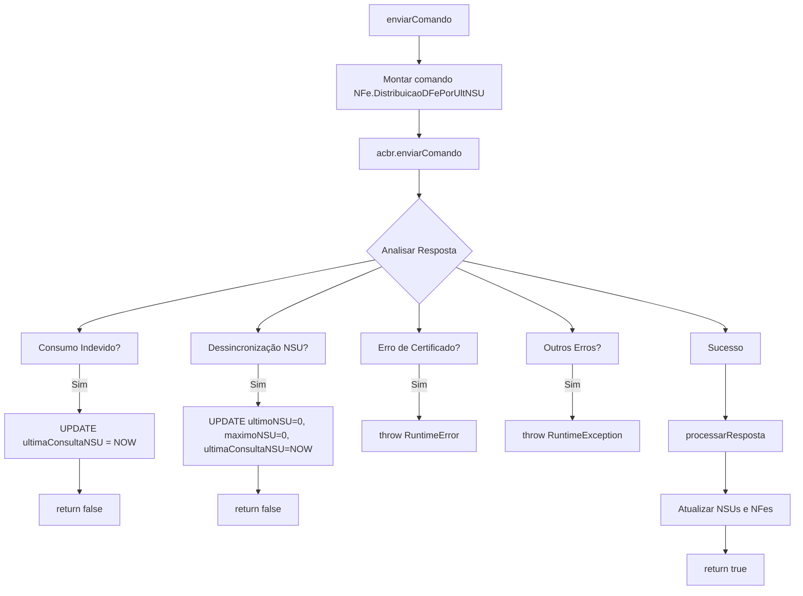
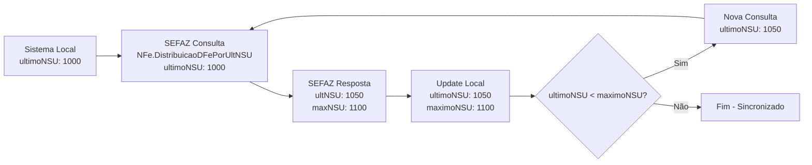
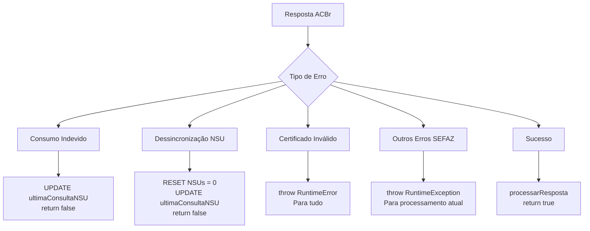
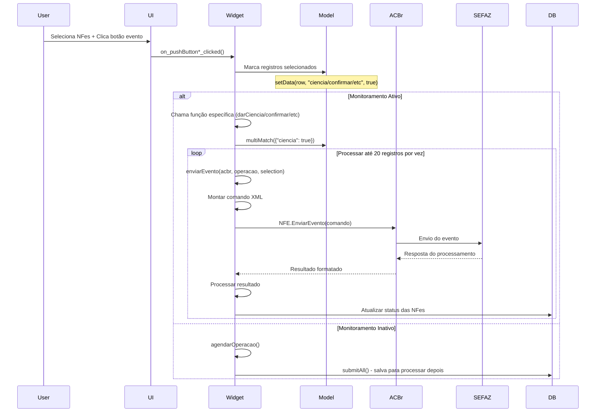
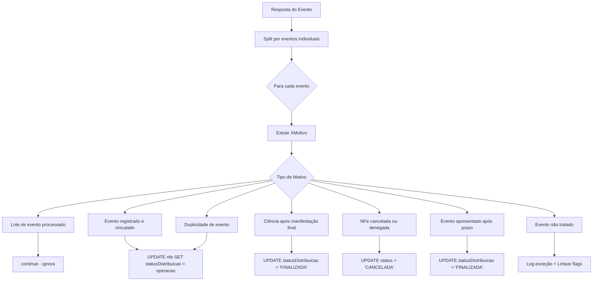
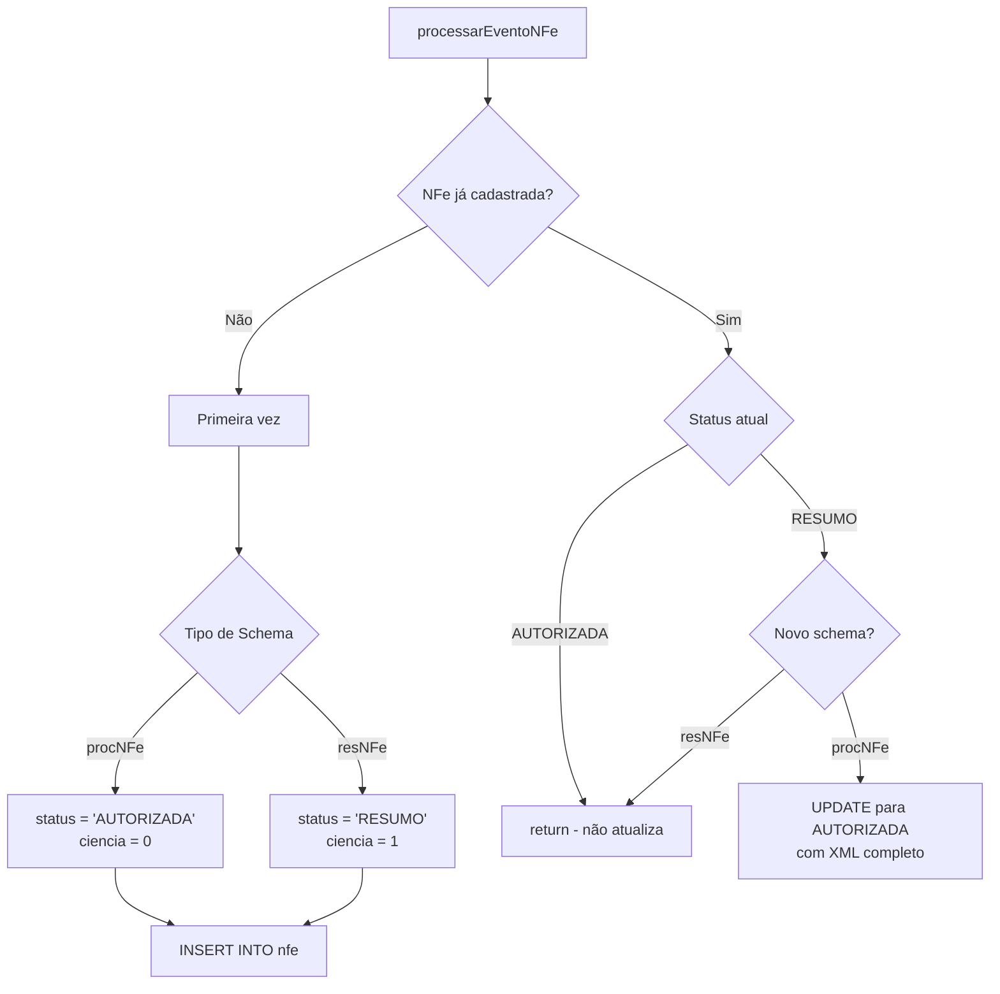

# Sistema de Distribuição de NF-e - Arquitetura e Fluxo Completo

## Índice

1. [Visão Geral](#visão-geral)
2. [Arquitetura do Sistema](#arquitetura-do-sistema)
3. [Componentes Principais](#componentes-principais)
4. [Fluxos de Execução](#fluxos-de-execução)
5. [Controle de Temporização](#controle-de-temporização)
6. [Sistema NSU](#sistema-nsu)
7. [Tratamento de Erros](#tratamento-de-erros)
8. [Eventos de Manifestação](#eventos-de-manifestação)
9. [Processamento de Respostas](#processamento-de-respostas)
10. [Segurança e Controles](#segurança-e-controles)

## Visão Geral

O `WidgetNFeDistribuicao` é o componente central responsável pela consulta e gerenciamento de Notas Fiscais Eletrônicas via Distribuição DFe da SEFAZ. O sistema opera em dois modos principais:

- **Automático**: Consultas periódicas executadas via timer
- **Manual**: Consultas iniciadas pelo usuário

### Principais Responsabilidades

- Consultar documentos fiscais eletrônicos via SEFAZ
- Processar e armazenar informações de NFes
- Gerenciar eventos de manifestação do destinatário
- Controlar temporização para evitar consumo indevido
- Sincronizar NSUs (Números Sequenciais Únicos) com a SEFAZ
- Tratar erros e dessincronizações automaticamente

## Arquitetura do Sistema

### Diagrama de Componentes



### Stack Tecnológico

- **Backend**: C++ com Qt Framework
- **Database**: MySQL/MariaDB
- **Integration**: ACBr (Automação Comercial Brasil)
- **UI**: Qt Widgets
- **Timer**: QTimer para execuções automáticas

## Componentes Principais

### 1. Timer Automático (`tempoTimer`)

**Localização**: `widgetnfedistribuicao.cpp:18-20`

O timer é o coração do sistema automático, configurado no construtor:

```cpp
connect(&timer, &QTimer::timeout, this, &WidgetNFeDistribuicao::downloadAutomatico);
timer.setTimerType(Qt::VeryCoarseTimer);
timer.start(tempoTimer);
```

**Estados do Timer**:

- `15min` - Intervalo padrão para consultas normais
- `1h` - Intervalo após consumo indevido ou nenhum documento localizado
- Tipo `VeryCoarseTimer` - Otimizado para economia de energia

### 2. Controle de NSU (Número Sequencial Único)

**Campos Principais**:

- `ultimoNSU`: Último NSU processado pelo sistema
- `maximoNSU`: Último NSU disponível na SEFAZ

**Funcionalidades**:

- Controle sequencial de documentos
- Detecção de dessincronização automática
- Reset para ressincronização (NSU = 0)

### 3. Sistema de Controle Multi-PC

**Função**: `houveConsultaEmOutroPc()` (linha 907)

```cpp
bool WidgetNFeDistribuicao::houveConsultaEmOutroPc() {
  // Verifica se passou menos de 60 minutos da última consulta
  return query.value("tempo").toInt() < 60;
}
```

**Previne**:

- Consultas simultâneas de múltiplos PCs
- Consumo indevido na SEFAZ
- Concorrência desnecessária

### 4. Integração ACBr

**Conexão**: Via socket TCP com ACBrMonitor
**Comandos Principais**:

- `NFe.DistribuicaoDFePorUltNSU()` - Consulta principal
- `NFE.EnviarEvento()` - Eventos de manifestação

## Fluxos de Execução

### Fluxo 1: Consulta Automática

```mermaid
sequenceDiagram
    participant Timer
    participant Widget as WidgetNFeDistribuicao
    participant Config as ConfigDatabase
    participant ACBr
    participant SEFAZ
    participant DB as MainDatabase

    Timer->>Widget: timeout signal (15min/1h)
    Widget->>Widget: downloadAutomatico()

    Note over Widget: Verifica se monitoramento está ativo
    Widget->>Widget: User::getSetting("User/monitorarNFe")

    Widget->>Widget: consultarSefaz()
    Widget->>Config: SELECT monitorarCNPJ1, monitorarServidor1...
    Config-->>Widget: Configurações de CNPJs

    loop Para cada CNPJ configurado
        Widget->>Widget: buscarNFes(cnpjRaiz, servidor, porta)
        Widget->>DB: SELECT idLoja, cnpj, ultimoNSU, maximoNSU FROM loja
        DB-->>Widget: Lista de filiais

        loop Para cada filial
            Widget->>Widget: houveConsultaEmOutroPc()
            Widget->>DB: SELECT timestampdiff(SECOND, ultimaConsultaNSU, NOW())

            alt Consulta recente (< 65min)
                Widget->>Widget: continue (pula filial)
            else Pode consultar
                Widget->>Widget: enviarComando(acbr)
                Widget->>ACBr: NFe.DistribuicaoDFePorUltNSU(estado, cnpj, ultimoNSU)
                ACBr->>SEFAZ: Consulta distribuição DFe
                SEFAZ-->>ACBr: Resposta com documentos
                ACBr-->>Widget: Resposta formatada

                alt Sucesso
                    Widget->>Widget: processarResposta()
                    Widget->>DB: INSERT/UPDATE nfe, UPDATE loja NSUs

                    loop Enquanto ultimoNSU < maximoNSU
                        Widget->>Widget: enviarComando() novamente
                    end

                    Widget->>Widget: Processar eventos (ciência, confirmação, etc.)
                    Widget->>DB: UPDATE loja SET ultimaConsultaNSU = NOW()

                alt Consumo Indevido
                    Widget->>DB: UPDATE loja SET ultimaConsultaNSU = NOW()
                    Widget->>Widget: return false (pula para próximo CNPJ)

                alt Dessincronização NSU
                    Widget->>DB: UPDATE loja SET ultimoNSU = 0, maximoNSU = 0, ultimaConsultaNSU = NOW()
                    Widget->>Widget: return false (pula para próximo CNPJ)
                end
            end
        end
    end

    Widget->>Timer: timer.start(tempoTimer)
```

**Detalhamento das Etapas**:

#### Etapa 1: Inicialização (`downloadAutomatico`)

**Localização**: `widgetnfedistribuicao.cpp:25-46`

1. **Verificação de Habilitação**:

   ```cpp
   if (not User::getSetting("User/monitorarNFe").toBool()) { return; }
   ```

2. **Preparação do Ambiente**:
   - Para o timer para evitar sobreposições
   - Atualiza tabelas se necessário
   - Configura modo silencioso (`qApp->setSilent(true)`)

3. **Tratamento de Exceções**:

   ```cpp
   try {
     consultarSefaz();
   } catch (std::exception &) {
     qApp->setSilent(false);
     timer.start(tempoTimer);
     throw;
   }
   ```

#### Etapa 2: Configuração (`consultarSefaz`)

**Localização**: `widgetnfedistribuicao.cpp:938-956`

Carrega configurações do banco:

- `monitorarCNPJ1/2`: CNPJs raiz para monitoramento
- `monitorarServidor1/2`: IPs dos servidores ACBr
- `monitorarPorta1/2`: Portas dos serviços ACBr

#### Etapa 3: Processamento por CNPJ (`buscarNFes`)

**Localização**: `widgetnfedistribuicao.cpp:236-316`

**Consulta de Filiais**:

```sql
SELECT idLoja, cnpj, ultimoNSU, maximoNSU
FROM loja
WHERE cnpj LIKE 'cnpjRaiz%' AND desativado = FALSE
```

**Loop Principal**:

1. Para cada filial encontrada
2. Verifica controle temporal (`houveConsultaEmOutroPc`)
3. Executa consulta principal (`enviarComando`)
4. Loop adicional enquanto `ultimoNSU < maximoNSU`
5. Processa eventos de manifestação
6. Atualiza timestamp de manutenção

### Fluxo 2: Consulta Manual



**Diferenças da Consulta Automática**:

- Iniciada por ação do usuário
- Para o timer durante execução
- Mostra mensagem de sucesso/erro
- Reinicia timer independentemente do resultado

### Fluxo 3: Comando de Consulta (`enviarComando`)



**Tratamentos Especiais**:

1. **Consumo Indevido** (linha 186):

   ```cpp
   // Atualizar timestamp para registrar que houve consulta recente (outro PC)
   SqlQuery queryUpdate;
   queryUpdate.exec("UPDATE loja SET ultimaConsultaNSU = NOW() WHERE idLoja = " + idLoja);
   ```

2. **Dessincronização de NSU** (linha 204):

   ```cpp
   // Resetar NSUs no banco e atualizar timestamp para aguardar 1h
   SqlQuery queryReset;
   queryReset.exec("UPDATE loja SET ultimoNSU = 0, maximoNSU = 0, ultimaConsultaNSU = NOW() WHERE idLoja = " + idLoja);
   ```

## Controle de Temporização

### Sistema de Timer Dinâmico

O sistema ajusta automaticamente os intervalos baseado nas respostas da SEFAZ:

```cpp
// Após processamento bem-sucedido
tempoTimer = (resposta.contains("XMotivo=Nenhum documento localizado")) ? 1h : 15min;

// Após consumo indevido ou dessincronização
tempoTimer = 1h;
```

**Estados do Timer**:

- **15 minutos**: Operação normal com documentos encontrados
- **1 hora**: Nenhum documento localizado, consumo indevido ou dessincronização

### Controle Multi-PC

**Função**: `houveConsultaEmOutroPc()` - linha 907

```cpp
bool WidgetNFeDistribuicao::houveConsultaEmOutroPc() {
  // Consulta tempo desde última distribuição
  QSqlQuery query;
  query.exec("SELECT timestampdiff(SECOND, ultimaConsultaNSU, NOW()) / 60 AS tempo FROM loja WHERE idLoja = " + idLoja);

  // Bloqueia se passou menos de 60 minutos (margem: 65min implementada)
  return query.value("tempo").toInt() < 60;
}
```

**Campos de Controle**:

- `ultimaConsultaNSU`: Timestamp da última consulta
- Margem de segurança: 65 minutos (recentemente atualizado de 60)

## Sistema NSU

### Conceito de NSU (Número Sequencial Único)

O NSU é o mecanismo de controle sequencial da SEFAZ para distribuição de documentos:

- **ultimoNSU**: Último documento processado pelo sistema local
- **maximoNSU**: Último documento disponível na SEFAZ
- **Regra**: Sistema sempre consulta a partir do `ultimoNSU + 1`

### Fluxo de Sincronização



### Processamento de NSU

**Função**: `processarEventoPrincipal()` - linha 759

```cpp
void WidgetNFeDistribuicao::processarEventoPrincipal(const QString &evento, const QString &idLoja) {
  const QString ultNSU = qApp->findTag(evento, "ultNSU=");
  const QString maxNSU = qApp->findTag(evento, "maxNSU=");

  // Atualiza variáveis locais
  ultimoNSU = ultNSU.toInt();
  maximoNSU = maxNSU.toInt();

  // Persiste no banco
  SqlQuery queryLoja;
  queryLoja.exec("UPDATE loja SET ultimoNSU = " + ultNSU + ", maximoNSU = " + maxNSU + " WHERE idLoja = " + idLoja);
}
```

### Detecção de Dessincronização

**Cenário**: Sistema local com NSU desatualizado vs SEFAZ

**Sintoma**: Erro "Deve ser utilizado o ultNSU nas solicitacoes subsequentes"

**Correção Automática**:

1. Detecta erro específico
2. Reseta NSU local para 0 (linha 209)
3. Atualiza timestamp para aguardar 1h
4. Próxima consulta iniciará do NSU correto da SEFAZ

## Tratamento de Erros

### Hierarquia de Tratamento



### Estratégias de Recuperação

#### 1. Consumo Indevido

**Causa**: Consulta muito recente (< 1h)  
**Estratégia**:

- Atualiza `ultimaConsultaNSU` para sincronizar controle local
- Pula CNPJ atual, continua outros
- Define timer para 1h

#### 2. Dessincronização NSU

**Causa**: NSU local desatualizado  
**Estratégia**:

- Reset completo: `ultimoNSU = 0, maximoNSU = 0`
- Força pausa de 1h
- Próxima consulta obterá NSU correto da SEFAZ

#### 3. Erros de Certificado

**Causa**: Certificado digital inválido/expirado  
**Estratégia**: Para execução completa (throw RuntimeError)

## Eventos de Manifestação

### Tipos de Eventos

O sistema suporta 4 tipos de manifestação do destinatário:

1. **Ciência da Operação** (210210)
2. **Confirmação da Operação** (210200)
3. **Desconhecimento da Operação** (210220)
4. **Operação não Realizada** (210240)

### Fluxo de Manifestação



### Estrutura do Comando de Evento

**Localização**: `enviarEvento()` - linha 486

```cpp
QString comando;
comando += R"(NFE.EnviarEvento("[EVENTO])" + QString("\r\n");
comando += "idLote = 1\r\n";

for (const auto row : selection) {
    comando += "[EVENTO" + numEvento + "]\r\n";
    comando += "cOrgao = 91\r\n";
    comando += "CNPJ = " + cnpjDest + "\r\n";
    comando += "chNFe = " + chaveAcesso + "\r\n";
    comando += "dhEvento = " + dataHora + "\r\n";
    comando += "tpEvento = " + codigoEvento + "\r\n";
    comando += "nSeqEvento = 1\r\n";
    comando += "versaoEvento = 1.00\r\n";
}
```

### Processamento de Respostas de Eventos



## Processamento de Respostas

### Estrutura da Resposta SEFAZ

A resposta da SEFAZ contém múltiplos blocos separados por `\r\n\r\n`:

1. **[DistribuicaoDFe]**: Informações principais (NSU, status)
2. **[ResDFe...]**: Resumos de NFe
3. **[ResEve...]**: Eventos de informação

### Função `processarResposta()`

**Localização**: linha 374-382

```cpp
void WidgetNFeDistribuicao::processarResposta(const QString &resposta, const QString &idLoja) {
  const QStringList eventos = resposta.split("\r\n\r\n", Qt::SkipEmptyParts);

  for (const auto &evento : eventos) {
    if (evento.contains("[DistribuicaoDFe]", Qt::CaseInsensitive)) {
      processarEventoPrincipal(evento, idLoja);
    }
    if (evento.contains("[ResDFe", Qt::CaseInsensitive)) {
      processarEventoNFe(evento);
    }
    if (evento.contains("[ResEve", Qt::CaseInsensitive)) {
      processarEventoInformacao(evento);
    }
  }
}
```

### Processamento de NFe (`processarEventoNFe`)

**Localização**: linha 775-834

**Extração de Dados**:

```cpp
const QString chaveAcesso = qApp->findTag(evento, "chDFe=");
const QString numeroNFe = chaveAcesso.mid(25, 9);
const QString cnpjOrig = qApp->findTag(evento, "CNPJCPF=");
const QDateTime dataHoraEmissao = QDateTime::fromString(qApp->findTag(evento, "dhRecbto="), "dd/MM/yyyy hh:mm:ss");
const QString nomeEmitente = qApp->findTag(evento, "xNome=");
const QString valor = qApp->findTag(evento, "vNF=").replace(',', '.');
const QString xml = qApp->findTag(evento, "XML=");
```

**Lógica de Inserção/Atualização**:



### Processamento de Eventos de Informação (`processarEventoInformacao`)

**Localização**: linha 836-905

Processa eventos já registrados na SEFAZ sobre NFes conhecidas:

**Tipos de Eventos Processados**:

- **Ciência da Operação**: Atualiza status para 'CIÊNCIA'
- **Confirmação da Operação**: Atualiza status para 'CONFIRMAÇÃO'
- **Cancelamento**: Atualiza status para 'CANCELADA'

## Segurança e Controles

### 1. Controle de Concorrência

**Problema**: Múltiplos PCs consultando simultaneamente  
**Solução**: Campo `ultimaConsultaNSU` com verificação temporal

### 2. Integridade de Dados

**Transações de Banco**:

```cpp
qApp->startTransaction("NFeDistribuicao::enviarComando");
// Operações de banco...
qApp->endTransaction();
```

**Rollback Automático**: Em caso de exceção, transação é desfeita

### 3. Tratamento de Falhas

**Robustez**:

- Continua processamento mesmo com erro em CNPJs individuais
- Recovery automático de dessincronização NSU
- Timeouts configuráveis para conexões ACBr

### 4. Logging e Auditoria

**Debug Extensivo**:

```cpp
qDebug() << "pesquisar cnpj - nsu: " << cnpjDest << " - " << ultimoNSU;
qDebug() << "CONSUMO INDEVIDO para CNPJ" << cnpjDest;
qDebug() << "DESSINCRONIZAÇÃO DE NSU DETECTADA";
```

**Log de Exceções**:

```cpp
Log::createLog("Exceção", "Evento não tratado: \nChave: " + chaveAcesso + "\nEvento:" + evento);
```

## Configurações e Customização

### Configurações de Timer

**Localização**: Classe header - `tempoTimer`

**Valores Padrão**:

- 15 minutos: Operação normal
- 1 hora: Casos especiais (consumo indevido, sem documentos)

### Configurações de Database

**Tabela `config`**:

- `monitorarCNPJ1/2`: CNPJs raiz para monitoramento
- `monitorarServidor1/2`: Endereços dos servidores ACBr
- `monitorarPorta1/2`: Portas dos serviços ACBr

**Tabela `loja`**:

- `ultimoNSU/maximoNSU`: Controle sequencial por filial
- `ultimaConsultaNSU`: Controle temporal de consultas
- `desativado`: Flag para ativar/desativar filiais

### Configurações de Usuário

**Setting `User/monitorarNFe`**:

- Controla se o sistema executa consultas automáticas
- Afeta comportamento de eventos (imediato vs agendado)

## TODOs e Melhorias Futuras

**Baseado nos comentários do código**:

1. **Parametrização de Estado**:

   ```cpp
   // TODO: parametrizar o código do estado em vez de usar 35
   ```

2. **XML de Usuário**:

   ```cpp
   // TODO: utilizar o xml do usuario quando importar um já cadastrado como RESUMO
   ```

3. **Auto-confirmação**:

   ```cpp
   // TODO: autoconfirmar nfes com mais de x dias para evitar perder o prazo
   ```

4. **Performance da Tabela**:

   ```cpp
   // TODO: ordenar no banco de dados em vez de localmente para ser rápido
   ```

5. **Formatação de Dados**:

   ```cpp
   // TODO: criar um cnpj/cpf delegate para formatar o valor na tabela
   ```

6. **UX - Legenda**:

   ```cpp
   // TODO: colocar legenda de cor explicando o que significa cada cor
   ```

## Conclusão

O Sistema de Distribuição de NFe é uma solução robusta e complexa que gerencia automaticamente:

- **Consultas periódicas** com controle de temporização inteligente
- **Sincronização de NSU** com detecção e correção automática de problemas
- **Processamento de eventos** de manifestação do destinatário
- **Controle multi-PC** para evitar consumo indevido
- **Tratamento abrangente de erros** com estratégias de recuperação

A arquitetura modular permite manutenção e extensões futuras, enquanto os controles de segurança garantem operação estável em ambiente multi-usuário.
