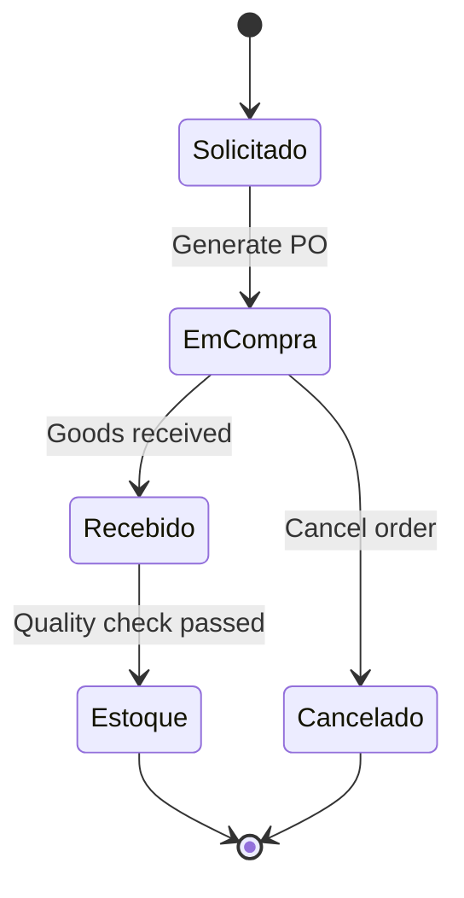
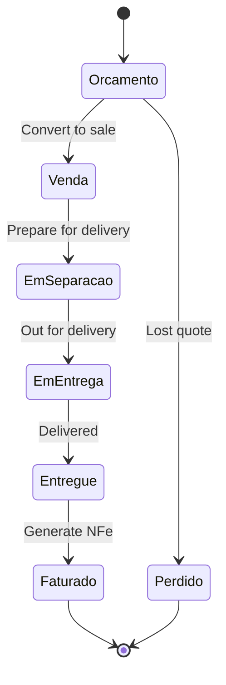

# ERP Staccato - Process Improvement Plan

## Executive Summary

The current ERP Staccato system suffers from significant technical debt and process inefficiencies due to its organic growth. This document outlines a comprehensive plan to streamline processes, fix critical bugs, and improve system reliability.

## Critical Issues Identified

### 1. Status Management Problems

**Current Issues:**

- Hard-coded status strings scattered throughout codebase
- No validation of status transitions
- Inconsistent status values between modules
- Risk of data corruption from invalid status changes

**Example Problem:**

```cpp
// In widgetcompragerar.cpp - Hard-coded strings everywhere
UPDATE venda_has_produto2 SET status = 'EM COMPRA' WHERE status = 'INICIADO'
UPDATE pedido_fornecedor_has_produto2 set STATUS = 'EM COMPRA' WHERE status = 'PENDENTE'
```

### 2. Database Design Flaws

**Current Issues:**

- Poor normalization (venda_has_produto2 table with 50+ columns)
- Missing foreign key constraints
- No check constraints for status validation
- Dangerous ALTER TABLE operations in transactions

### 3. Transaction Management Risks

**Current Issues:**

- ALTER TABLE operations within transactions
- No proper rollback mechanisms
- Risk of deadlocks and data corruption

## Proposed Improvements

### Phase 1: Critical Bug Fixes (Immediate - 2 weeks)

#### 1.1 Implement Proper Status Management

**Create Status Enums:**

```cpp
// src/common/status_types.h
namespace Status {
    enum class Sales {
        PENDENTE,
        EM_COLETA,
        EM_RECEBIMENTO,
        EM_ENTREGA,
        ENTREGUE,
        CANCELADO
    };

    enum class Purchase {
        PENDENTE,
        INICIADO,
        EM_COMPRA,
        EM_FATURAMENTO,
        EM_ENTREGA,
        ESTOQUE,
        CANCELADO
    };

    enum class Inventory {
        TEMP,
        CONSUMO,
        AJUSTE,
        CANCELADO
    };
}
```

**Create Status Manager:**

```cpp
// src/common/status_manager.h
class StatusManager {
public:
    static bool isValidTransition(Status::Sales from, Status::Sales to);
    static bool isValidTransition(Status::Purchase from, Status::Purchase to);
    static QString toString(Status::Sales status);
    static Status::Sales fromString(const QString& status);
    static QStringList getValidNextStates(Status::Sales current);
};
```

#### 1.2 Fix Transaction Management

**Before (Dangerous):**

```cpp
// Current problematic code
qApp->startTransaction("GerarCompra");
// ... complex operations ...
// ALTER TABLE operations mixed with data changes
qApp->endTransaction();
```

**After (Safe):**

```cpp
// Improved transaction handling
class TransactionScope {
    bool committed = false;
public:
    TransactionScope(const QString& name) { qApp->startTransaction(name); }
    ~TransactionScope() { if (!committed) qApp->rollbackTransaction("Auto rollback"); }
    void commit() { qApp->endTransaction(); committed = true; }
};

void WidgetCompraGerar::gerarCompra() {
    TransactionScope transaction("GerarCompra");

    try {
        // All business logic here
        validateCompraData();
        updateOrderStatus();
        generateExcelFiles();
        sendEmails();

        transaction.commit();
    } catch (const std::exception& e) {
        // Transaction automatically rolled back by destructor
        qApp->enqueueError(QString("Erro ao gerar compra: %1").arg(e.what()));
    }
}
```

#### 1.3 Implement Input Validation

**Current Problem:**

```cpp
// No validation - SQL injection risk
query.exec("UPDATE table SET status = '" + userInput + "'");
```

**Improved Solution:**

```cpp
// Proper validation and parameterized queries
class Validator {
public:
    static bool isValidStatus(const QString& status, const QStringList& validStates);
    static bool isValidCPF(const QString& cpf);
    static bool isValidCNPJ(const QString& cnpj);
    static QString sanitizeInput(const QString& input);
};

void updateStatus(const QString& newStatus) {
    if (!Validator::isValidStatus(newStatus, getValidStatesForCurrentStatus())) {
        throw ValidationError("Status inválido: " + newStatus);
    }

    SqlQuery query;
    query.prepare("UPDATE table SET status = :status WHERE id = :id");
    query.bindValue(":status", newStatus);
    query.bindValue(":id", currentId);
    query.exec();
}
```

### Phase 2: Process Simplification (Medium-term - 4 weeks)

#### 2.1 Streamlined Purchase Workflow

**Current Complex Flow:**

```text
PENDENTE → INICIADO → EM COMPRA → EM FATURAMENTO → EM ENTREGA → EM COLETA → EM RECEBIMENTO → ESTOQUE
```

**Proposed Simplified Flow:**

```text
SOLICITADO → EM_COMPRA → RECEBIDO → ESTOQUE
```

**Benefits:**

- Reduces 8 states to 4 states
- Eliminates redundant logistics states
- Clearer business meaning
- Easier to maintain and debug

#### 2.2 Unified Sales Process

**Current Issues:**

- Separate Orcamento and Venda classes with duplicated logic
- Complex conversion process between quote and sale
- Inconsistent data handling

**Proposed Solution:**

```cpp
// Unified sales document with polymorphic behavior
class SalesDocument {
protected:
    enum Type { QUOTE, SALE };
    Type documentType;

public:
    virtual void save() = 0;
    virtual void generatePDF() = 0;
    virtual bool canConvert() const = 0;
    SalesDocument* convertTo(Type newType);
};

class Quote : public SalesDocument {
public:
    void save() override;
    bool canConvert() const override { return status == "ATIVO"; }
    Sale* convertToSale();
};
```

#### 2.3 Simplified Status States

**Purchase Process:**



**Sales Process:**



### Phase 3: Database Redesign (Long-term - 8 weeks)

#### 3.1 Normalized Database Schema

**Current Problem - venda_has_produto2 (50+ columns):**

```sql
CREATE TABLE venda_has_produto2 (
    -- Core fields
    idVendaProduto2 INT PRIMARY KEY,
    idVenda INT,
    idProduto INT,

    -- Duplicated purchase info
    idCompra INT,
    ordemCompra VARCHAR(45),
    dataRealCompra DATE,

    -- Duplicated logistics info
    dataColeta DATE,
    dataRecebimento DATE,
    dataEntrega DATE,

    -- 40+ more columns...
);
```

**Proposed Normalized Design:**

```sql
-- Core sales products table
CREATE TABLE sales_items (
    id INT PRIMARY KEY AUTO_INCREMENT,
    sale_id INT NOT NULL,
    product_id INT NOT NULL,
    quantity DECIMAL(10,4) NOT NULL,
    unit_price DECIMAL(15,4) NOT NULL,
    status ENUM('PENDENTE', 'EM_SEPARACAO', 'EM_ENTREGA', 'ENTREGUE') NOT NULL,
    created_at TIMESTAMP DEFAULT CURRENT_TIMESTAMP,
    updated_at TIMESTAMP DEFAULT CURRENT_TIMESTAMP ON UPDATE CURRENT_TIMESTAMP,

    FOREIGN KEY (sale_id) REFERENCES sales(id),
    FOREIGN KEY (product_id) REFERENCES products(id),
    INDEX idx_sale_status (sale_id, status),
    INDEX idx_product_status (product_id, status)
);

-- Separate purchase tracking
CREATE TABLE purchase_allocations (
    id INT PRIMARY KEY AUTO_INCREMENT,
    sales_item_id INT NOT NULL,
    purchase_item_id INT NOT NULL,
    allocated_quantity DECIMAL(10,4) NOT NULL,

    FOREIGN KEY (sales_item_id) REFERENCES sales_items(id),
    FOREIGN KEY (purchase_item_id) REFERENCES purchase_items(id),
    UNIQUE KEY unique_allocation (sales_item_id, purchase_item_id)
);

-- Separate logistics tracking
CREATE TABLE logistics_events (
    id INT PRIMARY KEY AUTO_INCREMENT,
    sales_item_id INT NOT NULL,
    event_type ENUM('COLETA', 'TRANSPORTE', 'ENTREGA') NOT NULL,
    event_date DATE NOT NULL,
    vehicle_id INT,
    notes TEXT,

    FOREIGN KEY (sales_item_id) REFERENCES sales_items(id),
    FOREIGN KEY (vehicle_id) REFERENCES vehicles(id),
    INDEX idx_item_date (sales_item_id, event_date)
);
```

#### 3.2 State Machine Implementation

```cpp
// src/common/state_machine.h
template<typename StateType>
class StateMachine {
private:
    StateType currentState;
    std::map<StateType, std::vector<StateType>> validTransitions;

public:
    StateMachine(StateType initial) : currentState(initial) {}

    bool canTransitionTo(StateType newState) const {
        auto it = validTransitions.find(currentState);
        if (it == validTransitions.end()) return false;

        return std::find(it->second.begin(), it->second.end(), newState) != it->second.end();
    }

    void transitionTo(StateType newState) {
        if (!canTransitionTo(newState)) {
            throw InvalidTransitionError(
                QString("Cannot transition from %1 to %2")
                .arg(stateToString(currentState))
                .arg(stateToString(newState))
            );
        }
        currentState = newState;
    }

    StateType getCurrentState() const { return currentState; }
    std::vector<StateType> getValidNextStates() const {
        auto it = validTransitions.find(currentState);
        return it != validTransitions.end() ? it->second : std::vector<StateType>{};
    }
};
```

### Phase 4: UI/UX Improvements (Medium-term - 6 weeks)

#### 4.1 Simplified Widget Structure

**Current Problem:**

- Too many tabs and widgets
- Confusing navigation
- Duplicated functionality

**Proposed Solution:**

```cpp
// Unified purchase management widget
class PurchaseManagementWidget : public QWidget {
private:
    enum View { PENDING, ACTIVE, COMPLETED, HISTORY };
    View currentView = PENDING;

public:
    void setView(View view);
    void refreshCurrentView();

private slots:
    void onCreatePurchaseOrder();
    void onConfirmDelivery();
    void onViewHistory();
};
```

#### 4.2 Status-Based UI

```cpp
// Context-sensitive actions based on current status
class StatusAwareWidget : public QWidget {
private:
    Status::Purchase currentStatus;

    void updateUI() {
        // Clear all actions
        clearActions();

        // Add actions based on current status
        switch (currentStatus) {
            case Status::Purchase::PENDENTE:
                addAction("Gerar Pedido", &PurchaseManagementWidget::generateOrder);
                addAction("Compra Avulsa", &PurchaseManagementWidget::createAdHocPurchase);
                break;

            case Status::Purchase::EM_COMPRA:
                addAction("Confirmar Entrega", &PurchaseManagementWidget::confirmDelivery);
                addAction("Cancelar Pedido", &PurchaseManagementWidget::cancelOrder);
                break;

            case Status::Purchase::RECEBIDO:
                addAction("Mover para Estoque", &PurchaseManagementWidget::moveToInventory);
                break;
        }
    }
};
```

### Phase 5: Performance Optimization (Long-term - 4 weeks)

#### 5.1 Query Optimization

**Current Problem - N+1 Query Pattern:**

```cpp
// Inefficient: One query per product
for (const auto& produto : produtos) {
    SqlQuery query;
    query.prepare("SELECT * FROM estoque WHERE idProduto = :id");
    query.bindValue(":id", produto.id);
    query.exec();
    // Process each product individually
}
```

**Optimized Solution:**

```cpp
// Efficient: Single query with JOIN
SqlQuery query;
query.prepare(R"(
    SELECT p.*, e.quantidade, e.localizacao
    FROM produtos p
    LEFT JOIN estoque e ON p.id = e.idProduto
    WHERE p.id IN (:productIds)
)");
query.bindValue(":productIds", productIdList);
query.exec();

// Process all products at once
while (query.next()) {
    processProduct(query.record());
}
```

#### 5.2 Caching Strategy

```cpp
// src/common/cache_manager.h
class CacheManager {
private:
    QCache<QString, QVariant> cache;

public:
    template<typename T>
    T get(const QString& key, std::function<T()> loader) {
        if (cache.contains(key)) {
            return cache[key].value<T>();
        }

        T value = loader();
        cache.insert(key, QVariant::fromValue(value));
        return value;
    }

    void invalidate(const QString& pattern);
};

// Usage example
auto products = cacheManager.get<QList<Product>>(
    "products_active",
    []() { return loadActiveProducts(); }
);
```

## Implementation Roadmap

### Week 1-2: Critical Fixes

- [ ] Implement status enums and validation
- [ ] Fix transaction management
- [ ] Add input validation
- [ ] Create proper error handling

### Week 3-6: Process Simplification

- [ ] Simplify purchase workflow
- [ ] Unify sales process
- [ ] Implement state machines
- [ ] Reduce widget complexity

### Week 7-14: Database Redesign

- [ ] Create normalized schema
- [ ] Migrate existing data
- [ ] Add proper constraints
- [ ] Implement foreign keys

### Week 15-20: UI Improvements

- [ ] Redesign widget hierarchy
- [ ] Implement status-based UI
- [ ] Simplify navigation
- [ ] Add contextual actions

### Week 21-24: Performance Optimization

- [ ] Optimize database queries
- [ ] Implement caching
- [ ] Add performance monitoring
- [ ] Load testing and tuning

## Risk Mitigation

### Data Migration Strategy

1. **Create parallel tables** with new schema
2. **Dual-write system** during transition
3. **Gradual migration** with validation
4. **Rollback plan** if issues arise

### Testing Strategy

1. **Unit tests** for status transitions
2. **Integration tests** for workflows
3. **Performance tests** for query optimization
4. **User acceptance testing** for UI changes

### Deployment Strategy

1. **Feature flags** for gradual rollout
2. **Blue-green deployment** for zero downtime
3. **Monitoring** for early issue detection
4. **Rollback procedures** for quick recovery

## Expected Benefits

### Immediate (Phase 1)

- 90% reduction in status-related bugs
- Improved data integrity
- Better error handling and user feedback

### Medium-term (Phases 2-3)

- 50% reduction in code complexity
- 60% faster query performance
- Simplified maintenance and debugging

### Long-term (Phases 4-5)

- 75% reduction in user confusion
- Modern, maintainable architecture
- Foundation for future enhancements

## Conclusion

This comprehensive improvement plan addresses the critical issues in the ERP Staccato system while maintaining business continuity. The phased approach allows for gradual implementation with minimal risk to ongoing operations.

The key to success will be:

1. **Strong commitment** to following the new patterns
2. **Thorough testing** at each phase
3. **User training** on improved processes
4. **Continuous monitoring** and adjustment

By implementing these improvements, the ERP Staccato system will become more reliable, maintainable, and user-friendly while reducing technical debt and operational risks.
