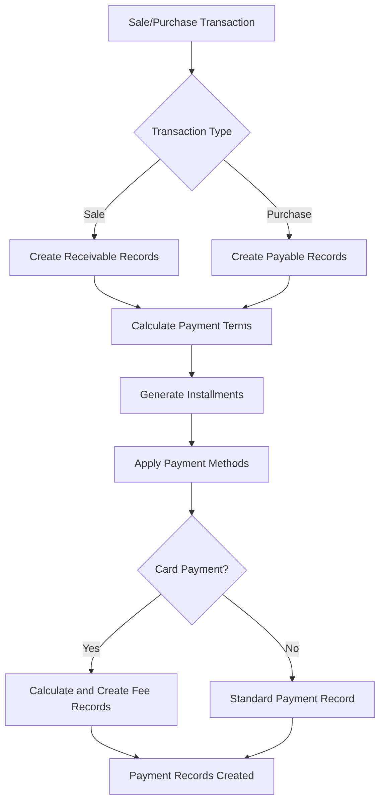
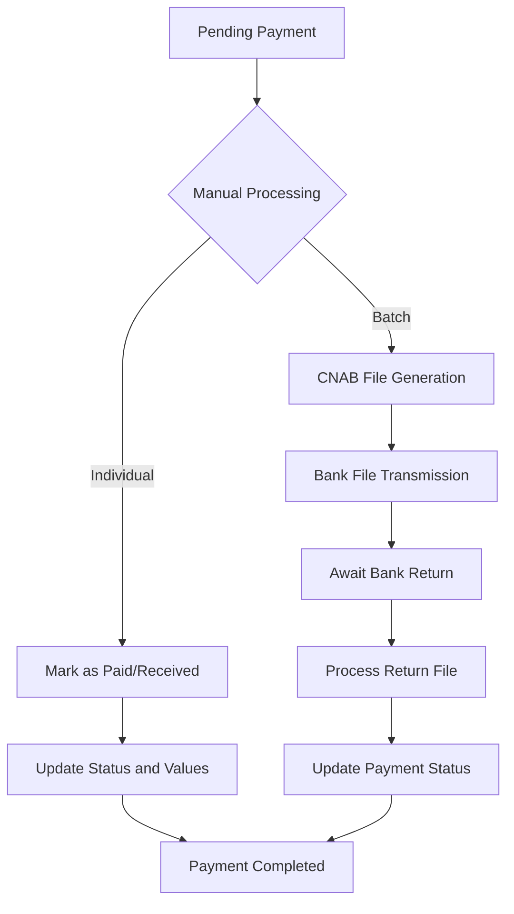
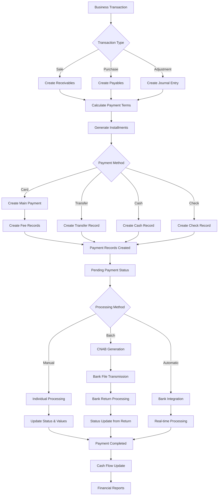
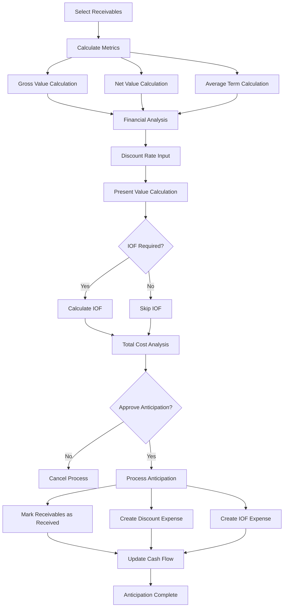
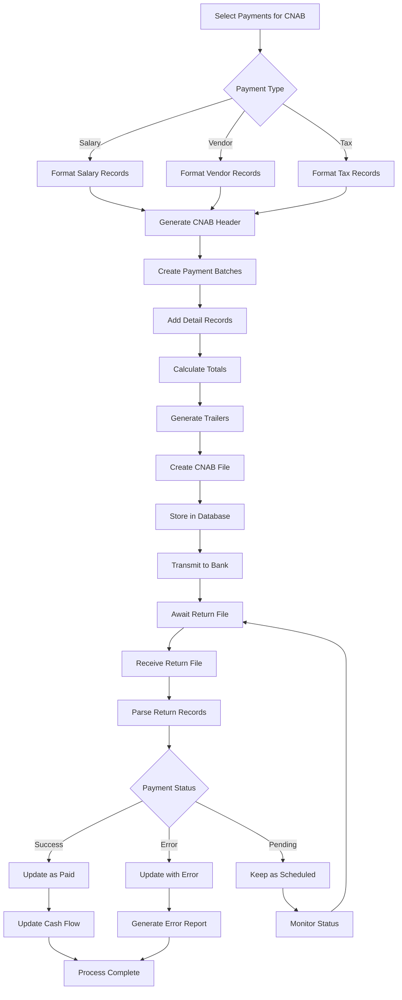
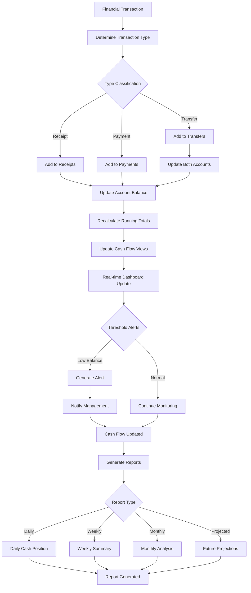

# ERP Staccato - Financial Management System Documentation

## Table of Contents
1. [Overview](#overview)
2. [Financial System Architecture](#financial-system-architecture)
3. [Core Financial Classes](#core-financial-classes)
4. [Database Schema](#database-schema)
5. [Payment Processing Workflow](#payment-processing-workflow)
6. [Brazilian Banking Integration (CNAB)](#brazilian-banking-integration-cnab)
7. [Cash Flow Management](#cash-flow-management)
8. [Payment Terms and Installments](#payment-terms-and-installments)
9. [Payment Anticipation System](#payment-anticipation-system)
10. [Financial Reporting](#financial-reporting)
11. [Collection Management](#collection-management)
12. [Business Rules and Validations](#business-rules-and-validations)
13. [Integration with Other Modules](#integration-with-other-modules)
14. [Mermaid Flowcharts](#mermaid-flowcharts)

## Overview

The ERP Staccato Financial Management System is a comprehensive solution designed specifically for Brazilian businesses, incorporating local banking standards, tax compliance, and payment processing requirements. The system manages the complete financial lifecycle from sales/purchase transactions to payment confirmation and cash flow analysis.

### Key Features
- Complete accounts payable and receivable management
- Brazilian banking integration (CNAB format)
- Payment term management and automatic installment calculations
- Credit and debit card processing with fee handling
- Cash flow forecasting and analysis
- Payment anticipation with financial calculations
- Brazilian tax compliance (GARE handling)
- Integration with NFe (Electronic Invoice) system

## Financial System Architecture

### Main Components

#### TabFinanceiro (C:\Users\Torres\Dropbox\Projeto_Staccato\erp-staccato\src\tabfinanceiro.cpp)
The central financial module coordinator that manages different financial views:
- **Cash Flow (Fluxo de Caixa)**: Real-time cash flow monitoring
- **Accounts Payable (Contas a Pagar)**: Vendor payment management
- **Accounts Receivable (Contas a Receber)**: Customer payment tracking
- **GARE**: Brazilian tax payment processing
- **Sales/Purchase**: Financial aspects of transactions

```cpp
void TabFinanceiro::updateTables() {
    const QString currentTab = ui->tabWidget->tabText(ui->tabWidget->currentIndex());
    
    if (currentTab == "Fluxo de Caixa") { ui->widgetFluxoCaixa->updateTables(); }
    if (currentTab == "Contas a Pagar") { ui->widgetPagar->updateTables(); }
    if (currentTab == "Contas a Receber") { ui->widgetReceber->updateTables(); }
    // ... other tabs
}
```

## Core Financial Classes

### 1. Contas Class (C:\Users\Torres\Dropbox\Projeto_Staccato\erp-staccato\src\contas.cpp)

The core account management class handling both payable and receivable accounts.

#### Key Methods:
- **setupTables()**: Configures models for pending and processed payments
- **preencher()**: Auto-fills payment data and handles card payment fees
- **validarData()**: Validates payment date changes (max 30 days)
- **verifyFields()**: Ensures all required fields are completed

#### Business Logic:
```cpp
// Auto-fill payment data when marking as paid/received
if (index.column() == ui->tablePendentes->columnIndex("dataRealizado")) {
    modelPendentes.setData(row, "status", (tipo == Tipo::Receber) ? "RECEBIDO" : "PAGO");
    modelPendentes.setData(row, "valorReal", modelPendentes.data(row, "valor"));
    modelPendentes.setData(row, "dataRealizado", qApp->ajustarDiaUtil(dataRealizado));
    
    // Handle card payment fees automatically
    if (tipoPagamento.contains("DÉBITO") or tipoPagamento.contains("CRÉDITO")) {
        // Find and process associated card fees
    }
}
```

### 2. WidgetFinanceiroContas Class (C:\Users\Torres\Dropbox\Projeto_Staccato\erp-staccato\src\widgetfinanceirocontas.cpp)

Main UI widget for financial account management with filtering and processing capabilities.

#### Key Features:
- **Dynamic Filtering**: Date ranges, amounts, stores, payment status
- **Payment Processing**: Individual and batch operations
- **CNAB Integration**: Bank file generation for transfers
- **Excel Import**: Payroll and expense imports

#### Filter Implementation:
```cpp
void WidgetFinanceiroContas::montaFiltro() {
    QStringList filtros;
    
    // Status filter
    if (not status.isEmpty()) { filtros << "cp.status = '" + status + "'"; }
    
    // Value range filter
    const QString valor = (not qFuzzyIsNull(ui->doubleSpinBoxDe->value()) or 
                          not qFuzzyIsNull(ui->doubleSpinBoxAte->value()))
        ? "cp.valor BETWEEN " + QString::number(ui->doubleSpinBoxDe->value() - 1) + 
          " AND " + QString::number(ui->doubleSpinBoxAte->value() + 1) : "";
    
    // Date filters, store filters, search filters...
}
```

### 3. CNAB Class (C:\Users\Torres\Dropbox\Projeto_Staccato\erp-staccato\src\cnab.cpp)

Brazilian banking standard implementation for automated payment processing.

#### Supported Operations:
- **GARE Payments**: Tax payment processing
- **Salary Payments**: Employee payment transfers
- **Vendor Payments**: Supplier payment processing

#### CNAB File Generation:
```cpp
QString CNAB::remessaPagamentoItau240(const QVector<CNAB::Pagamento> &pagamentos) {
    // Header creation with company information
    stream << "341";  // Bank code (Itaú)
    stream << "0000"; // Service batch
    // ... detailed CNAB format implementation
    
    // Payment segments for each transaction
    for (auto &pagamento : pagamentos) {
        // Segment A - Payment details
        writeNumber(stream, pagamento.valor, 15);
        writeText(stream, pagamento.nome, 30);
        // ... complete CNAB record structure
    }
}
```

### 4. WidgetFinanceiroFluxoCaixa Class (C:\Users\Torres\Dropbox\Projeto_Staccato\erp-staccato\src\widgetfinanceirofluxocaixa.cpp)

Real-time cash flow monitoring and analysis.

#### Features:
- **Multi-Account Monitoring**: Track multiple bank accounts simultaneously
- **Running Balance**: Cumulative balance calculations
- **Future Projections**: Pending payment analysis
- **Drill-down Capability**: Daily payment details

### 5. AnteciparRecebimento Class (C:\Users\Torres\Dropbox\Projeto_Staccato\erp-staccato\src\anteciparrecebimento.cpp)

Advanced payment anticipation system with financial calculations.

#### Calculation Engine:
```cpp
void AnteciparRecebimento::calcularTotais() {
    double bruto = 0;
    double liquido = 0;
    double prazoMedio = 0;
    
    for (const auto &index : selection) {
        const double valor = modelContaReceber.data(row, "valor").toDouble();
        const QDate dataPagamento = modelContaReceber.data(row, "dataPagamento").toDate();
        
        if (not tipo.contains("TAXA CARTÃO")) { bruto += valor; }
        liquido += valor;
        
        // Weighted average term calculation
        const double prazo = ui->dateEditEvento->date().daysTo(dataPagamento) * valor;
        prazoMedio += prazo;
    }
    
    prazoMedio /= liquido;
    
    // Discount calculation: (monthly_rate / 30) * average_days
    ui->doubleSpinBoxDescTotal->setValue(ui->doubleSpinBoxDescMes->value() / 30 * prazoMedio);
    
    // Present value calculation
    ui->doubleSpinBoxValorPresente->setValue(liquido * (1 - ui->doubleSpinBoxDescTotal->value() / 100));
    
    // IOF calculation for Brazilian tax compliance
    if (ui->checkBoxIOF->isChecked()) {
        ui->doubleSpinBoxIOF->setValue(ui->doubleSpinBoxValorPresente->value() * (0.0038 + 0.0041 * prazoMedio));
    }
}
```

## Database Schema

### Core Financial Tables

#### 1. conta_a_pagar_has_pagamento
Main accounts payable table storing all payment obligations.

```sql
CREATE TABLE conta_a_pagar_has_pagamento (
    idPagamento INT PRIMARY KEY AUTO_INCREMENT,
    dataEmissao DATE NOT NULL,
    idVenda VARCHAR(45),
    contraParte VARCHAR(200) NOT NULL,
    idLoja INT NOT NULL,
    idNFe INT,
    nfe VARCHAR(45),
    valor DECIMAL(10,2) NOT NULL,
    tipo VARCHAR(100) NOT NULL,
    parcela VARCHAR(45),
    dataPagamento DATE NOT NULL,
    observacao TEXT,
    status ENUM('PENDENTE', 'CONFERIDO', 'AGENDADO', 'PAGO', 'CANCELADO', 'PAGO GARE') NOT NULL,
    dataRealizado DATE,
    valorReal DECIMAL(10,2),
    tipoReal VARCHAR(100),
    parcelaReal VARCHAR(45),
    idConta INT,
    tipoDet VARCHAR(100),
    centroCusto INT,
    grupo VARCHAR(100),
    subGrupo VARCHAR(100),
    idCnab INT,
    compraAvulsa BOOLEAN DEFAULT FALSE,
    desativado BOOLEAN DEFAULT FALSE,
    created TIMESTAMP DEFAULT CURRENT_TIMESTAMP,
    lastUpdated TIMESTAMP DEFAULT CURRENT_TIMESTAMP ON UPDATE CURRENT_TIMESTAMP
);
```

#### 2. conta_a_receber_has_pagamento
Main accounts receivable table for customer payments.

```sql
CREATE TABLE conta_a_receber_has_pagamento (
    idPagamento INT PRIMARY KEY AUTO_INCREMENT,
    dataEmissao DATE NOT NULL,
    idVenda VARCHAR(45) NOT NULL,
    contraParte VARCHAR(200) NOT NULL,
    idLoja INT NOT NULL,
    idNFe INT,
    nfe VARCHAR(45),
    representacao BOOLEAN DEFAULT FALSE,
    valor DECIMAL(10,2) NOT NULL,
    tipo VARCHAR(100) NOT NULL,
    parcela VARCHAR(45),
    dataPagamento DATE NOT NULL,
    observacao TEXT,
    status ENUM('PENDENTE', 'CONFERIDO', 'AGENDADO', 'RECEBIDO', 'CANCELADO') NOT NULL,
    dataRealizado DATE,
    valorReal DECIMAL(10,2),
    tipoReal VARCHAR(100),
    parcelaReal VARCHAR(45),
    idConta INT,
    tipoDet VARCHAR(100),
    centroCusto INT,
    grupo VARCHAR(100),
    subGrupo VARCHAR(100),
    comissao DECIMAL(10,2),
    taxa DECIMAL(10,2),
    desativado BOOLEAN DEFAULT FALSE,
    created TIMESTAMP DEFAULT CURRENT_TIMESTAMP,
    lastUpdated TIMESTAMP DEFAULT CURRENT_TIMESTAMP ON UPDATE CURRENT_TIMESTAMP
);
```

#### 3. conta_a_pagar_has_idcompra
Links payment records to purchase orders for traceability.

```sql
CREATE TABLE conta_a_pagar_has_idcompra (
    idPagamento INT NOT NULL,
    idCompra VARCHAR(45) NOT NULL,
    PRIMARY KEY (idPagamento, idCompra),
    FOREIGN KEY (idPagamento) REFERENCES conta_a_pagar_has_pagamento(idPagamento)
);
```

#### 4. loja_has_conta
Bank account information for each store/location.

```sql
CREATE TABLE loja_has_conta (
    idConta INT PRIMARY KEY AUTO_INCREMENT,
    idLoja INT NOT NULL,
    banco VARCHAR(100) NOT NULL,
    agencia VARCHAR(20),
    conta VARCHAR(30),
    descricao VARCHAR(200),
    ativo BOOLEAN DEFAULT TRUE
);
```

#### 5. cnab
Stores CNAB file records for banking integration audit trail.

```sql
CREATE TABLE cnab (
    idCnab INT PRIMARY KEY AUTO_INCREMENT,
    tipo ENUM('REMESSA', 'RETORNO') NOT NULL,
    banco VARCHAR(50) NOT NULL,
    sequencial INT,
    conteudo LONGTEXT NOT NULL,
    dataProcessamento TIMESTAMP DEFAULT CURRENT_TIMESTAMP
);
```

### Financial Views

#### view_fluxo_resumo_realizado
Summarizes realized cash flow by date and account.

```sql
CREATE VIEW view_fluxo_resumo_realizado AS
SELECT 
    dataRealizado,
    idConta,
    contaDestino,
    SUM(CASE WHEN tipo_operacao = 'SAIDA' THEN valor ELSE 0 END) AS SAIDA,
    SUM(CASE WHEN tipo_operacao = 'ENTRADA' THEN valor ELSE 0 END) AS ENTRADA,
    SUM(CASE WHEN tipo_operacao = 'ENTRADA' THEN valor ELSE -valor END) AS `R$`
FROM (
    -- Union of payable and receivable transactions
    SELECT dataRealizado, idConta, banco AS contaDestino, valorReal AS valor, 'SAIDA' AS tipo_operacao
    FROM conta_a_pagar_has_pagamento cp
    LEFT JOIN loja_has_conta lhc ON cp.idConta = lhc.idConta
    WHERE status IN ('PAGO', 'PAGO GARE') AND dataRealizado IS NOT NULL
    
    UNION ALL
    
    SELECT dataRealizado, idConta, banco AS contaDestino, valorReal AS valor, 'ENTRADA' AS tipo_operacao
    FROM conta_a_receber_has_pagamento cr
    LEFT JOIN loja_has_conta lhc ON cr.idConta = lhc.idConta
    WHERE status = 'RECEBIDO' AND dataRealizado IS NOT NULL
) combined
GROUP BY dataRealizado, idConta;
```

## Payment Processing Workflow

### 1. Payment Creation Flow



### 2. Payment Processing Flow



### 3. Payment Term Calculation

The system automatically calculates payment terms based on predefined rules:

```cpp
// Payment term calculation in sales/purchase processing
void calculatePaymentTerms(const QString &paymentType, int installments, const QDate &baseDate) {
    if (paymentType.contains("CARTÃO CRÉDITO")) {
        // Credit card: 30-day intervals starting from base date
        for (int i = 1; i <= installments; ++i) {
            QDate dueDate = baseDate.addDays(30 * i);
            createPaymentRecord(dueDate, totalValue / installments);
        }
    } else if (paymentType.contains("BOLETO")) {
        // Bank slip: immediate payment
        createPaymentRecord(baseDate, totalValue);
    }
    // Additional payment types...
}
```

## Brazilian Banking Integration (CNAB)

### CNAB 240 Format Implementation

The system implements the Brazilian CNAB 240 standard for electronic banking:

#### File Structure:
1. **Header Archive** (Record Type 0): File identification
2. **Header Batch** (Record Type 1): Batch identification  
3. **Detail Records** (Record Type 3): Payment details
4. **Trailer Batch** (Record Type 5): Batch summary
5. **Trailer Archive** (Record Type 9): File summary

#### Supported Payment Types:
- **Type 20**: Vendor payments
- **Type 22**: Tax payments (GARE)
- **Type 30**: Salary payments

#### Implementation Example:
```cpp
QString CNAB::remessaGareItau240(const QVector<Gare> &gares) {
    QString arquivo;
    QTextStream stream(&arquivo);
    
    // Header arquivo
    stream << "341";                    // Bank code
    stream << "0000";                   // Batch number
    stream << "0";                      // Record type
    writeText(stream, "STACCATO REVESTIMENTOS COM E REPRES LTDA", 30);
    
    // For each GARE payment
    for (const auto &gare : gares) {
        // Segment N - Tax payment details
        stream << "341";                // Bank code
        writeNumber(stream, 1, 4);      // Batch number
        stream << "3";                  // Detail record
        stream << "N";                  // Segment type
        writeNumber(stream, gare.valor, 14);         // Payment value
        writeNumber(stream, gare.dataVencimento, 8); // Due date
        // ... complete GARE structure
    }
    
    return arquivo;
}
```

### Bank Return Processing

```cpp
void CNAB::retornoGareItau240(const QString &filePath) {
    File file(filePath);
    QStringList lines;
    
    while (not file.atEnd()) { lines << file.readLine(); }
    
    for (const auto &line : lines) {
        if (line.at(13) == 'N') {  // Segment N return
            QString cnpj = line.mid(195, 8);
            QString nfe = line.mid(206, 9);
            QString dataPgt = line.mid(150, 4) + "-" + line.mid(148, 2) + "-" + line.mid(146, 2);
            
            QString ocorrencia = decodeCodeItau(line.mid(230, 2));
            
            if (ocorrencia.contains("PAGAMENTO EFETUADO")) {
                // Update payment status in database
                SqlQuery query;
                query.exec("UPDATE conta_a_pagar_has_pagamento SET status = 'PAGO GARE', "
                          "valorReal = valor, dataRealizado = '" + dataPgt + "' "
                          "WHERE idNFe = " + nfeId);
            }
        }
    }
}
```

## Cash Flow Management

### Real-time Cash Flow Monitoring

The cash flow system provides real-time visibility into company finances:

#### Features:
- **Multi-account tracking**: Monitor multiple bank accounts
- **Running balances**: Cumulative balance calculations
- **Future projections**: Pending payment analysis
- **Drill-down capability**: Daily payment details

#### Implementation:
```cpp
void WidgetFinanceiroFluxoCaixa::montaTabela1() {
    const QString filtroConta = (ui->groupBoxCaixa1->isChecked() and ui->itemBoxCaixa1->getId().isValid()) 
        ? "WHERE idConta = " + ui->itemBoxCaixa1->getId().toString() : "";
    
    // Running total calculation using window functions
    modelCaixa.setQuery(
        "WITH x AS ("
        "  SELECT v.*, SUM(v.`R$`) OVER (ORDER BY dataRealizado) AS Acumulado "
        "  FROM view_fluxo_resumo_realizado v " + filtroConta + " "
        "  ORDER BY dataRealizado"
        ") SELECT * FROM x " + filtroData + " ORDER BY dataRealizado"
    );
    
    // Calculate final balance
    double saldo = 0;
    if (modelCaixa.rowCount() > 0) {
        saldo = modelCaixa.data(modelCaixa.rowCount() - 1, "Acumulado").toDouble();
    }
    ui->doubleSpinBoxSaldo1->setValue(saldo);
}
```

### Cash Flow Views

#### Overdue Receivables:
```sql
SELECT 
    cr.dataPagamento AS Data,
    SUM(CASE WHEN cr.tipo LIKE '%CARTÃO%' OR cr.tipo LIKE '%CRÉDITO%' OR cr.tipo LIKE '%DÉBITO%' 
        THEN cr.valor ELSE 0 END) AS Cartão,
    SUM(CASE WHEN cr.tipo LIKE '%CHEQUE%' THEN cr.valor ELSE 0 END) AS Cheque,
    SUM(CASE WHEN cr.tipo LIKE '%BOLETO%' THEN cr.valor ELSE 0 END) AS Boleto,
    SUM(cr.valor) AS Total,
    SUM(SUM(cr.valor)) OVER (ORDER BY dataPagamento) AS Acumulado
FROM conta_a_receber_has_pagamento cr
WHERE cr.dataPagamento < CURDATE() 
    AND cr.representacao = 0 
    AND cr.status IN ('PENDENTE', 'CONFERIDO')
GROUP BY cr.dataPagamento;
```

## Payment Terms and Installments

### Automatic Installment Generation

The system automatically generates installment schedules based on payment terms:

#### Credit Card Processing:
```cpp
void processCardPayment(const QString &cardType, int installments, double totalValue, const QDate &saleDate) {
    double installmentValue = totalValue / installments;
    
    for (int i = 1; i <= installments; ++i) {
        // Calculate due date based on card company rules
        QDate dueDate = saleDate.addDays(30 * i);  // Monthly intervals
        
        // Create main payment record
        int paymentId = createPaymentRecord(cardType, installmentValue, dueDate, i);
        
        // Calculate and create card fee record
        double feeRate = getCardFeeRate(cardType);  // e.g., 2.5% for credit
        double feeValue = installmentValue * feeRate / 100;
        
        createFeeRecord(cardType + " TAXA", feeValue, dueDate, i, paymentId);
    }
}
```

### Payment Term Rules

#### Standard Payment Terms:
- **Cash/PIX**: Immediate payment
- **Bank Transfer**: Next business day
- **Credit Card**: 30-day intervals per installment
- **Bank Slip (Boleto)**: 30 days from issue
- **Check**: Date specified on check

#### Business Day Adjustment:
```cpp
QDate adjustToBusinessDay(const QDate &date) {
    QDate adjustedDate = date;
    
    // Skip weekends
    while (adjustedDate.dayOfWeek() > 5) {  // Saturday = 6, Sunday = 7
        adjustedDate = adjustedDate.addDays(1);
    }
    
    // TODO: Add holiday calendar checking
    return adjustedDate;
}
```

## Payment Anticipation System

### Financial Calculation Engine

The payment anticipation system provides sophisticated financial calculations:

#### Key Metrics:
- **Gross Value**: Sum of principal amounts (excluding fees)
- **Net Value**: Gross value minus card processing fees
- **Average Term**: Weighted average of payment terms
- **Total Discount**: Calculated discount based on advance period
- **Present Value**: Net value minus calculated discount
- **IOF**: Brazilian tax on financial operations

#### Mathematical Formula:
```
Average Term = Σ(days_to_payment × payment_value) / total_net_value
Total Discount = (monthly_rate / 30) × average_term
Present Value = net_value × (1 - total_discount / 100)
IOF = present_value × (0.0038 + 0.0041 × average_term)
```

#### Implementation:
```cpp
void AnteciparRecebimento::calcularTotais() {
    const auto selection = ui->table->selectionModel()->selectedRows();
    
    double bruto = 0;
    double liquido = 0;
    double prazoMedio = 0;
    
    for (const auto &index : selection) {
        const QString tipo = modelContaReceber.data(row, "tipo").toString();
        const double valor = modelContaReceber.data(row, "valor").toDouble();
        const QDate dataPagamento = modelContaReceber.data(row, "dataPagamento").toDate();
        
        // Separate principal from fees
        if (not tipo.contains("TAXA CARTÃO")) { bruto += valor; }
        liquido += valor;
        
        // Weighted average calculation
        const double prazo = ui->dateEditEvento->date().daysTo(dataPagamento) * valor;
        prazoMedio += prazo;
    }
    
    prazoMedio /= liquido;  // Weighted average
    
    // Discount calculation
    ui->doubleSpinBoxDescTotal->setValue(ui->doubleSpinBoxDescMes->value() / 30 * prazoMedio);
    
    // Present value
    double valorPresente = liquido * (1 - ui->doubleSpinBoxDescTotal->value() / 100);
    ui->doubleSpinBoxValorPresente->setValue(valorPresente);
    
    // IOF calculation for compliance
    if (ui->checkBoxIOF->isChecked()) {
        double iof = valorPresente * (0.0038 + 0.0041 * prazoMedio);
        ui->doubleSpinBoxIOF->setValue(iof);
    }
}
```

### Anticipation Processing

When processing an anticipation:

1. **Mark original receivables as received**
2. **Create discount expense entries**
3. **Create IOF expense entries**
4. **Update cash flow with actual receipt**

```cpp
void AnteciparRecebimento::cadastrar(const QModelIndexList &list) {
    qApp->startTransaction("AnteciparRecebimento::cadastrar");
    
    // Mark receivables as received
    for (const auto &index : list) {
        modelContaReceber.setData(row, "status", "RECEBIDO");
        modelContaReceber.setData(row, "dataRealizado", ui->dateEditEvento->date());
        modelContaReceber.setData(row, "valorReal", modelContaReceber.data(row, "valor"));
        modelContaReceber.setData(row, "idConta", ui->itemBoxConta->getId());
        modelContaReceber.setData(row, "observacao", observacao + " Antecipação");
    }
    
    // Create discount expense entry
    if (not qFuzzyIsNull(discountValue)) {
        createExpenseRecord("Juros da antecipação de recebíveis", discountValue, 
                           "Despesas Financeiras", "Juros");
    }
    
    // Create IOF expense entry
    if (not qFuzzyIsNull(iofValue)) {
        createExpenseRecord("IOF da antecipação de recebíveis", iofValue,
                           "Despesas Financeiras", "IOF");
    }
    
    qApp->endTransaction();
}
```

## Financial Reporting

### Key Reports Available

#### 1. Cash Flow Summary
- Daily, weekly, monthly cash flow analysis
- Account-by-account breakdown
- Running balance calculations

#### 2. Accounts Aging
- Overdue receivables by age brackets
- Payment history analysis
- Customer payment patterns

#### 3. Payment Method Analysis
- Breakdown by payment type (card, cash, transfer)
- Processing fee analysis
- Payment term effectiveness

#### 4. Financial Performance
- Revenue vs. expenses
- Cash flow projections
- Payment collection efficiency

### SQL Queries for Reporting

#### Daily Cash Flow Report:
```sql
SELECT 
    dataRealizado AS 'Data',
    CONCAT(lhc.banco, ' - ', lhc.agencia, ' - ', lhc.conta) AS 'Conta',
    SUM(CASE WHEN categoria = 'ENTRADA' THEN valorReal ELSE 0 END) AS 'Entradas',
    SUM(CASE WHEN categoria = 'SAIDA' THEN valorReal ELSE 0 END) AS 'Saídas',
    SUM(CASE WHEN categoria = 'ENTRADA' THEN valorReal ELSE -valorReal END) AS 'Saldo Líquido'
FROM (
    SELECT dataRealizado, idConta, valorReal, 'ENTRADA' AS categoria
    FROM conta_a_receber_has_pagamento 
    WHERE status = 'RECEBIDO' AND dataRealizado IS NOT NULL
    
    UNION ALL
    
    SELECT dataRealizado, idConta, valorReal, 'SAIDA' AS categoria
    FROM conta_a_pagar_has_pagamento 
    WHERE status IN ('PAGO', 'PAGO GARE') AND dataRealizado IS NOT NULL
) combined
LEFT JOIN loja_has_conta lhc ON combined.idConta = lhc.idConta
GROUP BY dataRealizado, idConta
ORDER BY dataRealizado, lhc.banco;
```

## Collection Management

### Overdue Payment Tracking

The system automatically tracks overdue payments and provides collection tools:

#### Overdue Analysis:
```sql
SELECT 
    contraParte AS 'Cliente',
    idVenda AS 'Venda',
    dataPagamento AS 'Vencimento',
    DATEDIFF(CURDATE(), dataPagamento) AS 'Dias em Atraso',
    valor AS 'Valor Original',
    tipo AS 'Forma Pagamento',
    observacao AS 'Observações'
FROM conta_a_receber_has_pagamento
WHERE status IN ('PENDENTE', 'CONFERIDO') 
    AND dataPagamento < CURDATE()
    AND representacao = FALSE
ORDER BY dataPagamento;
```

### Collection Actions

1. **Automated Alerts**: System generates alerts for overdue payments
2. **Customer Communication**: Integration with email system for notifications
3. **Payment Plans**: Ability to restructure payment terms
4. **Collection Reports**: Detailed aging reports for management

## Business Rules and Validations

### Payment Validation Rules

#### 1. Date Validation:
```cpp
void Contas::validarData(const QModelIndex &index) {
    if (index.column() == ui->tablePendentes->columnIndex("dataPagamento")) {
        const QDate oldDate = getOriginalDate(idPagamento);
        const QDate newDate = modelPendentes.data(row, "dataPagamento").toDate();
        
        // Maximum 30-day change allowed
        if (newDate > oldDate.addDays(30) or newDate < oldDate.addDays(-30)) {
            qApp->enqueueWarning("Alteração de data maior que 30 dias!");
        }
    }
}
```

#### 2. Required Field Validation:
```cpp
void Contas::verifyFields() {
    for (int row = 0; row < ui->tablePendentes->rowCount(); ++row) {
        const QString status = modelPendentes.data(row, "status").toString();
        
        if ((tipo == Tipo::Pagar and status == "PAGO") or 
            (tipo == Tipo::Receber and status == "RECEBIDO")) {
            
            if (modelPendentes.data(row, "dataRealizado").toString().isEmpty()) {
                throw RuntimeError("'Data Realizado' vazio na linha " + QString::number(row + 1));
            }
            if (modelPendentes.data(row, "valorReal") == 0) {
                throw RuntimeError("'R$ Real' vazio na linha " + QString::number(row + 1));
            }
            if (modelPendentes.data(row, "idConta") == 0) {
                throw RuntimeError("'Conta' vazio na linha " + QString::number(row + 1));
            }
            // Additional validations...
        }
    }
}
```

### Card Payment Processing Rules

#### Automatic Fee Calculation:
```cpp
void processCardPayment(const QString &paymentType, const QString &installment) {
    if (paymentType.contains("DÉBITO") or paymentType.contains("CRÉDITO")) {
        // Find associated fee record
        const QString feeType = paymentType.left(1) + ". TAXA CARTÃO";
        const auto match = modelPendentes.multiMatch({
            {"tipo", feeType}, 
            {"parcela", installment}
        });
        
        // Auto-process fee when main payment is processed
        for (const auto &rowMatch : match) {
            if (modelPendentes.data(rowMatch, "status").toString() == "CANCELADO") continue;
            
            modelPendentes.setData(rowMatch, "dataRealizado", mainPaymentDate);
            modelPendentes.setData(rowMatch, "status", paymentStatus);
            modelPendentes.setData(rowMatch, "valorReal", modelPendentes.data(rowMatch, "valor"));
            modelPendentes.setData(rowMatch, "idConta", accountId);
        }
    }
}
```

## Integration with Other Modules

### Sales Module Integration

When a sale is finalized, the financial module:

1. **Creates payment records** based on payment terms
2. **Calculates installments** for credit payments  
3. **Generates card fee records** automatically
4. **Links payments to NFe** when applicable

### Purchase Module Integration

For purchase transactions:

1. **Creates payable records** from purchase orders
2. **Links to supplier information**
3. **Tracks purchase order references**
4. **Handles import duties and taxes**

### NFe Integration

Financial records are linked to Brazilian electronic invoices:

```cpp
// Link payment to NFe when processing
if (not nfeId.isEmpty()) {
    modelPendentes.setData(row, "idNFe", nfeId);
    
    // For GARE payments, extract tax information from NFe
    if (paymentType == "GARE") {
        extractTaxInfoFromNFe(nfeId);
    }
}
```

### Inventory Integration

Financial impact of inventory movements:

- **Purchase receipts**: Create payables
- **Sale deliveries**: Trigger receivables
- **Inventory adjustments**: Generate expense/income records

## Mermaid Flowcharts

### Complete Financial Process Flow



### Payment Anticipation Flow



### CNAB Banking Integration Flow



### Cash Flow Management Flow



---

## Conclusion

The ERP Staccato Financial Management System provides a comprehensive solution for Brazilian businesses, incorporating local banking standards, tax compliance, and sophisticated payment processing capabilities. The system's modular architecture, robust database design, and integration capabilities make it suitable for complex business operations while maintaining compliance with Brazilian financial regulations.

Key strengths include:
- **Complete payment lifecycle management**
- **Brazilian banking integration (CNAB)**
- **Real-time cash flow monitoring**
- **Advanced payment anticipation calculations**
- **Comprehensive financial reporting**
- **Strong integration with other business modules**

The system continues to evolve with business needs and regulatory requirements, providing a solid foundation for financial operations in the Brazilian market.